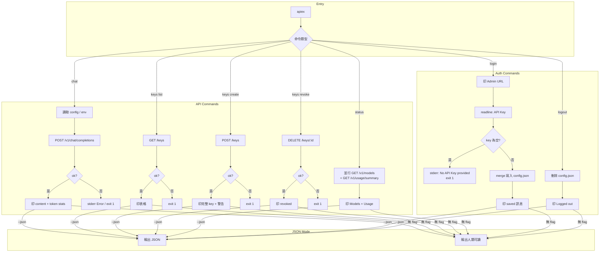
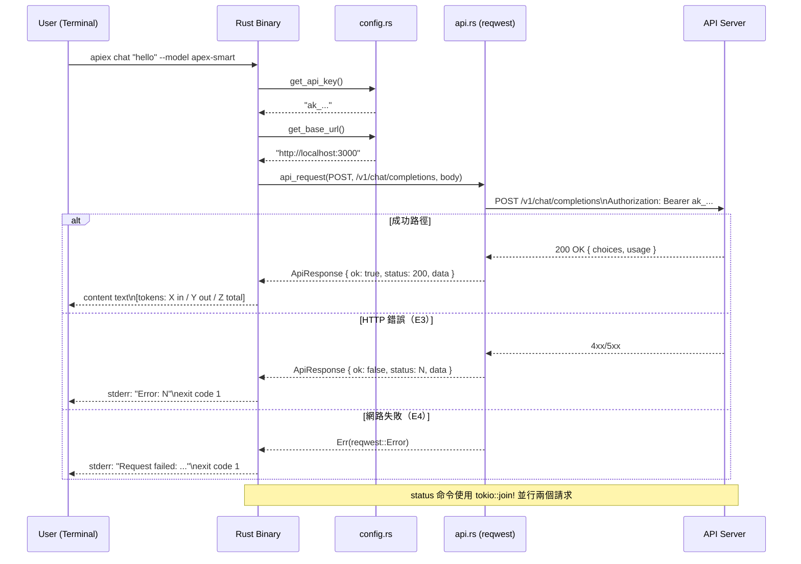

# S1 Dev Spec: Rust CLI 重寫

> **階段**: S1 技術分析
> **建立時間**: 2026-03-15 13:30
> **Agent**: architect
> **工作類型**: new_feature
> **複雜度**: M

---

## 1. 概述

### 1.1 需求參照
> 完整需求見 `sdd_context.json` s0.output，以下僅摘要。

將現有 TypeScript CLI（`packages/cli`，7 個命令，318 行）用 Rust 重寫為獨立 binary，功能完全對等，零 runtime 依賴，啟動速度目標 ~5ms。

### 1.2 技術方案摘要

在 `packages/cli-rs/` 建立全新 Rust crate，使用 clap v4（derive macro）定義 CLI 結構，reqwest + tokio 處理非同步 HTTP，serde/serde_json 處理 JSON 序列化，dirs 處理跨平台 home 路徑。Config 格式與現有 `~/.apiex/config.json` 相容，所有命令行為與 TypeScript CLI 完全對等，最終透過 `cargo build --release` 產出單一靜態可執行 binary。

---

## 2. 影響範圍

### 2.1 受影響檔案

#### 新增（packages/cli-rs/）
| 檔案 | 變更類型 | 說明 |
|------|---------|------|
| `packages/cli-rs/Cargo.toml` | 新增 | Crate 定義，依賴聲明 |
| `packages/cli-rs/src/main.rs` | 新增 | Entry point，clap 結構定義，命令分派 |
| `packages/cli-rs/src/config.rs` | 新增 | Config 讀寫，環境變數覆蓋 |
| `packages/cli-rs/src/api.rs` | 新增 | HTTP client，Bearer auth |
| `packages/cli-rs/src/commands/mod.rs` | 新增 | commands module 宣告 |
| `packages/cli-rs/src/commands/login.rs` | 新增 | login/logout 命令 |
| `packages/cli-rs/src/commands/chat.rs` | 新增 | chat 命令 |
| `packages/cli-rs/src/commands/keys.rs` | 新增 | keys list/create/revoke 命令 |
| `packages/cli-rs/src/commands/status.rs` | 新增 | status 命令（並行請求） |

#### 不異動（現有 TypeScript CLI 保留）
| 路徑 | 說明 |
|------|------|
| `packages/cli/` | 保留作為 fallback，本次不刪除也不修改 |

### 2.2 依賴關係
- **上游依賴**: 後端 API server（`/v1/chat/completions`, `/keys`, `/v1/models`, `/v1/usage/summary`）——本次不變更，僅呼叫
- **下游影響**: 無。新 binary 是獨立入口，不被其他模組依賴

### 2.3 現有模式與技術考量

從 TypeScript CLI 原始碼確認以下行為，Rust 版必須對等：

1. **Config 路徑**: `~/.apiex/config.json`，JSON 格式 `{ "apiKey": "...", "baseUrl": "..." }`
2. **環境變數優先**: `APIEX_API_KEY` > config.apiKey；`APIEX_BASE_URL` > config.baseUrl > `http://localhost:3000`
3. **login 流程**: 印 admin URL（`{baseUrl}/admin`）→ readline 讀 key → merge 寫入 config（保留既有 baseUrl）
4. **logout**: 刪除整個 config.json（不只清空）；若不存在則靜默成功
5. **chat**: POST body `{ model, messages: [{ role: "user", content: prompt }] }`；顯示 content + token stats（prompt/completion/total）
6. **keys list**: GET `/keys`，回應結構 `{ data: ApiKey[] }`；表格欄位 ID/Name/Prefix.../Created
7. **keys create**: POST `/keys` body `{ name }`；回應顯示完整 key + 警告「Save this key — it won't be shown again」
8. **keys revoke**: DELETE `/keys/{key-id}`
9. **status**: **並行** GET `/v1/models` + GET `/v1/usage/summary`；quota_remaining 為 -1 時顯示 "unlimited"
10. **--json flag**: 每個命令皆支援，輸出原始 JSON 而非人類可讀格式；錯誤時也輸出 JSON 後 exit(1)
11. **API client**: 所有請求帶 `Authorization: Bearer {apiKey}` + `Content-Type: application/json`
12. **錯誤處理**: HTTP 非 2xx → `Error: {status}` to stderr，若有 --json 則同時印 JSON body，exit code 1

---

## 3. User Flow



### 3.1 主要流程
| 步驟 | 用戶動作 | 系統回應 | 備註 |
|------|---------|---------|------|
| 1 | `apiex login` | 印 Admin URL，等待 stdin 輸入 | `{baseUrl}/admin` |
| 2 | 貼入 API Key | 寫入 `~/.apiex/config.json` | merge 模式，保留 baseUrl |
| 3 | `apiex chat "hello" --model apex-smart` | POST chat completions，印 AI 回應 + token 統計 | |
| 4 | `apiex keys list` | GET /keys，印表格 | 空則印 "No API keys found." |
| 5 | `apiex keys create --name dev` | POST /keys，印完整 key | 附加 save 警告 |
| 6 | `apiex keys revoke <id>` | DELETE /keys/{id}，印確認 | |
| 7 | `apiex status` | 並行兩個 GET，印模型列表 + 使用統計 | quota=-1 → "unlimited" |
| 8 | `apiex logout` | 刪除 config.json，印確認 | 檔案不存在則靜默成功 |

### 3.2 異常流程
| ID | 情境 | 觸發條件 | 系統處理 | 用戶看到 |
|----|------|---------|---------|---------|
| E1 | 無 API Key | 命令需要 auth 但 config 無 key 且無環境變數 | exit 1 | `No API key found. Run \`apiex login\` or set APIEX_API_KEY env var.` |
| E2 | login 未輸入 key | readline 收到空字串 | exit 1 | `No API Key provided. Aborting.` |
| E3 | HTTP 非 2xx | 任何 API 請求失敗 | stderr + exit 1 | `Error: {status_code}` |
| E4 | 網路連線失敗 | reqwest 連線錯誤 | exit 1 | `Request failed: {error}` |
| E5 | config.json 格式損毀 | JSON parse 失敗 | fallback 空 config | 靜默回退（同 TS 行為） |
| E6 | status 部分失敗 | 兩個並行請求其中一個失敗 | 顯示失敗項目的 unavailable 提示 | `(unavailable — status {N})` |

### 3.3 例外追溯表
| ID | 維度 | 描述 | S1 處理位置 | 覆蓋狀態 |
|----|------|------|-----------|---------|
| E1 | 認證 | 無 API Key | `config.rs::get_api_key()` | ✅ 覆蓋 |
| E2 | 輸入驗證 | login 空輸入 | `commands/login.rs` | ✅ 覆蓋 |
| E3 | HTTP 錯誤 | 非 2xx 回應 | `api.rs::api_request()` + 各命令 | ✅ 覆蓋 |
| E4 | 網路 | 連線失敗 | `api.rs` reqwest error handling | ✅ 覆蓋 |
| E5 | 資料損毀 | config 格式錯誤 | `config.rs::read_config()` | ✅ 覆蓋 |
| E6 | 部分失敗 | status 雙請求部分失敗 | `commands/status.rs` | ✅ 覆蓋 |

---

## 4. Data Flow



### 4.1 API 契約

**Endpoint 摘要**（呼叫現有後端，不新增端點）

| Method | Path | 說明 | 需 Auth |
|--------|------|------|--------|
| `POST` | `/v1/chat/completions` | Chat 對話 | 是 |
| `GET` | `/keys` | 列出 API keys | 是 |
| `POST` | `/keys` | 建立 API key | 是 |
| `DELETE` | `/keys/{key-id}` | 撤銷 API key | 是 |
| `GET` | `/v1/models` | 可用模型列表 | 是 |
| `GET` | `/v1/usage/summary` | 使用量統計 | 是 |

**Request Headers（所有 API 請求）**
```
Authorization: Bearer {apiKey}
Content-Type: application/json
```

### 4.2 資料模型

#### Config 檔案（`~/.apiex/config.json`）
```
ApiexConfig:
  api_key:  Option<String>   -- 對應 JSON "apiKey"
  base_url: Option<String>   -- 對應 JSON "baseUrl"
```
注意：JSON field 命名與 TypeScript 版相同（camelCase），需用 `#[serde(rename = "apiKey")]` 或 `serde(rename_all = "camelCase")`。

#### Chat Request Body
```
ChatRequest:
  model:    String
  messages: Vec<ChatMessage>

ChatMessage:
  role:    String   -- "user"
  content: String
```

#### Chat Response
```
ChatResponse:
  id:      String
  choices: Vec<Choice>
  usage:   Option<Usage>

Choice:
  message:       ChatMessage
  finish_reason: String

Usage:
  prompt_tokens:     u32
  completion_tokens: u32
  total_tokens:      u32
```

#### ApiKey（keys list 回應）
```
ApiKey:
  id:           String
  name:         String
  prefix:       String
  created_at:   String   -- JSON "createdAt"
  last_used_at: Option<String>  -- JSON "lastUsedAt"
```

#### UsageSummary
```
UsageSummary:
  total_requests:  u64
  total_tokens:    u64
  quota_remaining: i64   -- -1 表示 unlimited
  breakdown:       Vec<UsageBreakdown>

UsageBreakdown:
  model_tag: String
  tokens:    u64
  requests:  u64
```

---

## 5. 任務清單

### 5.1 任務總覽

| # | 任務 | 類型 | 複雜度 | Agent | 依賴 | SC |
|---|------|------|--------|-------|------|----|
| 1 | Cargo.toml + 專案骨架 | 基礎設施 | S | rust-expert | - | SC-1 |
| 2 | config.rs — Config 讀寫 + 環境變數 | 基礎設施 | S | rust-expert | #1 | SC-2 |
| 3 | api.rs — HTTP client | 基礎設施 | S | rust-expert | #2 | SC-3~5 |
| 4 | main.rs — clap 結構定義 + 分派 | 基礎設施 | S | rust-expert | #1 | SC-1 |
| 5 | commands/login.rs — login/logout | 命令實作 | S | rust-expert | #2 | SC-2 |
| 6 | commands/chat.rs — chat | 命令實作 | S | rust-expert | #3 | SC-3 |
| 7 | commands/keys.rs — keys list/create/revoke | 命令實作 | M | rust-expert | #3 | SC-4 |
| 8 | commands/status.rs — status（並行） | 命令實作 | S | rust-expert | #3 | SC-5 |
| 9 | --json flag 全命令整合 | 整合 | S | rust-expert | #5,6,7,8 | SC-6 |
| 10 | cargo build --release 驗證 | 驗證 | S | rust-expert | #9 | SC-7 |
| 11 | 功能對等測試 | 測試 | M | rust-expert | #10 | SC-8 |

### 5.2 任務詳情

#### Task #1: Cargo.toml + 專案骨架
- **類型**: 基礎設施
- **複雜度**: S
- **Agent**: rust-expert
- **描述**: 建立 `packages/cli-rs/` 目錄，初始化 Cargo.toml，宣告所有依賴，建立 src/ 目錄結構（空模組佔位符）。
- **Cargo.toml 依賴**:
  ```toml
  [package]
  name = "apiex-cli"
  version = "0.1.0"
  edition = "2021"

  [[bin]]
  name = "apiex"
  path = "src/main.rs"

  [dependencies]
  clap = { version = "4", features = ["derive"] }
  tokio = { version = "1", features = ["full"] }
  reqwest = { version = "0.12", features = ["json"] }
  serde = { version = "1", features = ["derive"] }
  serde_json = "1"
  dirs = "5"
  anyhow = "1"
  ```
- **DoD**:
  - [ ] `packages/cli-rs/Cargo.toml` 存在，`cargo check` 通過
  - [ ] 目錄結構符合規格（src/main.rs, src/config.rs, src/api.rs, src/commands/mod.rs 及各命令 .rs）
  - [ ] 所有模組在 main.rs / mod.rs 中宣告（即使是空的也不 compile error）
- **驗收方式**: `cd packages/cli-rs && cargo check` 零錯誤

#### Task #2: config.rs — Config 讀寫 + 環境變數
- **類型**: 基礎設施
- **複雜度**: S
- **Agent**: rust-expert
- **依賴**: Task #1
- **描述**: 實作 `ApiexConfig` struct（serde camelCase），`read_config()`、`write_config()`、`clear_config()`、`get_api_key()`、`get_base_url()`。環境變數優先順序嚴格遵循 TypeScript 版本。
- **關鍵細節**:
  - JSON field 名稱維持 camelCase（`apiKey`, `baseUrl`）以相容現有 config.json
  - `read_config()` 失敗時（檔案不存在 / parse 失敗）回傳預設空 config，不 panic
  - `write_config()` 自動建立 `~/.apiex/` 目錄（`create_dir_all`）
  - `clear_config()` 若檔案不存在則靜默成功
  - `get_api_key()` 找不到 key 時回傳 `Err`（不 panic）
  - `get_base_url()` 預設 `http://localhost:3000`
- **DoD**:
  - [ ] `ApiexConfig` struct 定義正確，serde rename_all camelCase
  - [ ] `get_api_key()` 環境變數 > config.apiKey，無則 Err
  - [ ] `get_base_url()` 環境變數 > config.baseUrl > 預設值
  - [ ] `write_config()` 自動建目錄，縮排 2 空格（對齊 TS 版）
  - [ ] `clear_config()` 不存在時不 panic
  - [ ] `cargo test` config 單元測試通過（使用 tmp dir）
- **驗收方式**: 手動設定 env var `APIEX_API_KEY=test`，程式應讀到 "test" 而非 config 中的值

#### Task #3: api.rs — HTTP client
- **類型**: 基礎設施
- **複雜度**: S
- **Agent**: rust-expert
- **依賴**: Task #2
- **描述**: 實作 `ApiResponse<T>` struct 與 `api_request()` async fn，封裝 reqwest 呼叫，自動帶入 Bearer token 與 Content-Type header。
- **函式簽章**:
  ```rust
  pub struct ApiResponse<T> {
      pub ok: bool,
      pub status: u16,
      pub data: T,
  }

  pub async fn api_request<T: DeserializeOwned>(
      method: &str,
      path: &str,
      body: Option<&impl Serialize>,
  ) -> anyhow::Result<ApiResponse<T>>
  ```
- **關鍵細節**:
  - method 字串轉 `reqwest::Method`（GET/POST/DELETE）
  - response JSON parse 失敗時回傳 `Err`（不回傳空 data）
  - `ok` 由 `status.is_success()` 決定
- **DoD**:
  - [ ] `api_request()` 正確設置 Authorization header
  - [ ] 非 2xx status 仍嘗試 parse body，並設 `ok = false`
  - [ ] reqwest 連線失敗時回傳 `Err`
  - [ ] 編譯無 warning
- **驗收方式**: 對 `http://localhost:3000` 的 GET /v1/models 能正確回傳（integration test 手動）

#### Task #4: main.rs — clap 結構定義 + 分派
- **類型**: 基礎設施
- **複雜度**: S
- **Agent**: rust-expert
- **依賴**: Task #1
- **描述**: 使用 clap derive macro 定義完整 CLI 結構，實作 `#[tokio::main]` async main，分派到各命令 handler。
- **Clap 結構**:
  ```rust
  #[derive(Parser)]
  #[command(name = "apiex", about = "Apiex Platform CLI", version = "0.1.0")]
  struct Cli {
      #[command(subcommand)]
      command: Commands,
      /// Output as JSON
      #[arg(long, global = true)]
      json: bool,
  }

  #[derive(Subcommand)]
  enum Commands {
      Login,
      Logout,
      Chat {
          prompt: String,
          #[arg(long)]
          model: String,
      },
      Keys {
          #[command(subcommand)]
          action: KeysAction,
      },
      Status,
  }

  #[derive(Subcommand)]
  enum KeysAction {
      List,
      Create {
          #[arg(long)]
          name: String,
      },
      Revoke { key_id: String },
  }
  ```
- **DoD**:
  - [ ] `apiex --help` 顯示所有命令說明
  - [ ] `apiex keys --help` 顯示子命令說明
  - [ ] `--json` 為 global flag，所有子命令可用
  - [ ] `chat` 的 `--model` 為 required（缺少時顯示 clap error）
  - [ ] `keys create` 的 `--name` 為 required
- **驗收方式**: `apiex --help`、`apiex keys --help` 輸出符合預期

#### Task #5: commands/login.rs — login / logout
- **類型**: 命令實作
- **複雜度**: S
- **Agent**: rust-expert
- **依賴**: Task #2, Task #4
- **描述**: 實作 `login_action()` 和 `logout_action()`。
- **login 流程**:
  1. 取得 base_url（`get_base_url()`），印 admin URL（`{base_url}/admin`）及指示文字
  2. 若 `--json`：先印 `{"action": "login", "adminUrl": "..."}`
  3. 從 stdin readline 讀取 API Key（`rpassword` 或標準 stdin read_line）
  4. 空字串 → stderr + exit 1
  5. `read_config()` 取得現有 config，設 `api_key`，`write_config()` 寫回（保留 base_url）
  6. 若 `--json`：印 `{"status": "ok", "message": "API Key saved"}`；否則印 "API Key saved to ~/.apiex/config.json"
- **logout 流程**: `clear_config()`，印確認訊息（or JSON）
- **DoD**:
  - [ ] login 讀取 stdin，空輸入 exit 1
  - [ ] login 寫 config 時保留既有 base_url 欄位
  - [ ] logout 刪除 config，檔案不存在也不錯誤
  - [ ] --json 模式輸出正確 JSON
- **驗收方式**: `echo "testkey" | apiex login` 後確認 config.json 內容

#### Task #6: commands/chat.rs — chat
- **類型**: 命令實作
- **複雜度**: S
- **Agent**: rust-expert
- **依賴**: Task #3, Task #4
- **描述**: 實作 `chat_action(prompt, model, json_flag)`。
- **輸出格式（非 JSON 模式）**:
  ```
  {content}

  [tokens: {prompt} in / {completion} out / {total} total]
  ```
  usage 為 null 時不顯示 token 行。
- **DoD**:
  - [ ] POST body 結構正確（model, messages array）
  - [ ] 非 2xx → stderr "Error: {status}"，exit 1
  - [ ] choices 為空時顯示 "(no response)"（對齊 TS 行為）
  - [ ] usage 存在時顯示 token 統計
  - [ ] --json 模式輸出完整 response JSON
- **驗收方式**: `apiex chat "hello" --model apex-smart` 能得到回應（需 server running）

#### Task #7: commands/keys.rs — keys list / create / revoke
- **類型**: 命令實作
- **複雜度**: M
- **Agent**: rust-expert
- **依賴**: Task #3, Task #4
- **描述**: 實作三個子命令 action。
- **keys list 表格格式**:
  ```
  ID              Name            Prefix          Created
  ────────────────────────────────────────────────────────────
  {id}    {name}    {prefix}...    {createdAt}
  ```
  空列表時印 "No API keys found."
- **keys create 輸出**:
  ```
  Key created: {full_key}
  (Save this key — it won't be shown again)
  ```
- **keys revoke 輸出**: `Key {id} revoked.`
- **DoD**:
  - [ ] list 表格 header + separator + 各行對齊
  - [ ] list 空列表顯示正確訊息
  - [ ] create 顯示完整 key 及 save 警告
  - [ ] revoke 成功確認訊息
  - [ ] 三個命令非 2xx 皆 exit 1
  - [ ] --json 模式各自輸出正確結構
- **驗收方式**: `apiex keys list`、`apiex keys create --name test`、`apiex keys revoke <id>` 行為與 TS CLI 一致

#### Task #8: commands/status.rs — status（並行請求）
- **類型**: 命令實作
- **複雜度**: S
- **Agent**: rust-expert
- **依賴**: Task #3, Task #4
- **描述**: 使用 `tokio::join!` 並行發出兩個 GET 請求，任一失敗時顯示 unavailable 提示（不 exit 1）。
- **輸出格式**:
  ```
  === Models ===
    {model_id} ({owned_by})
    ...

  === Usage ===
    Requests: {total_requests}
    Tokens: {total_tokens}
    Quota remaining: unlimited   (quota_remaining == -1)
    Quota remaining: {N}         (其他)
  ```
- **注意**: 原 TS 程式碼第 46 行有 bug：quota 非 -1 時錯誤地印了 `total_tokens` 而非 `quota_remaining`。Rust 版**修正此 bug**，印 `quota_remaining` 正確值。
- **DoD**:
  - [ ] 使用 `tokio::join!` 並行（非 sequential await）
  - [ ] 兩個請求互相獨立，任一失敗不影響另一個的顯示
  - [ ] quota_remaining == -1 顯示 "unlimited"
  - [ ] quota_remaining 非 -1 顯示實際值（修正 TS bug）
  - [ ] --json 輸出 `{ models: ..., usage: ... }` 結構（對齊 TS）
- **驗收方式**: `apiex status` 兩區塊都顯示；強制一個 endpoint 掛掉時另一個仍正常顯示

#### Task #9: --json flag 全命令整合驗證
- **類型**: 整合
- **複雜度**: S
- **Agent**: rust-expert
- **依賴**: Task #5, #6, #7, #8
- **描述**: 確認 global `--json` flag 在所有命令的正確傳遞和使用，確認 JSON 輸出 valid JSON（用 `jq` 驗證）。
- **DoD**:
  - [ ] `apiex --json login`、`apiex login --json` 兩種位置都能工作（clap global flag）
  - [ ] 所有命令的 `--json` 輸出可被 `| jq` 正確解析
  - [ ] 錯誤情況下（非 2xx）`--json` 也輸出 JSON 而非純文字
- **驗收方式**: `apiex --json status | jq .` 正常輸出

#### Task #10: cargo build --release 驗證
- **類型**: 驗證
- **複雜度**: S
- **Agent**: rust-expert
- **依賴**: Task #9
- **描述**: 執行 `cargo build --release`，確認產出 binary，測試啟動時間。
- **DoD**:
  - [ ] `cargo build --release` 零 warning（或僅允許 dead_code warning 的合理項目）
  - [ ] `target/release/apiex --help` 正常執行
  - [ ] `time ./target/release/apiex --help` 啟動時間 < 50ms（目標 ~5ms，50ms 為 CI 可接受上限）
  - [ ] binary 大小合理（< 20MB stripped）
- **驗收方式**: `cargo build --release && time ./target/release/apiex --help`

#### Task #11: 功能對等測試
- **類型**: 測試
- **複雜度**: M
- **Agent**: rust-expert
- **依賴**: Task #10
- **描述**: 撰寫 integration tests（`tests/` 目錄），使用 `mockito` 或直接對 mock server 測試所有命令的輸出行為，對照 TypeScript CLI 的預期輸出。
- **測試範圍**:
  - config 讀寫（unit test，已含於 Task #2）
  - 每個命令的 happy path（mock HTTP server）
  - 每個命令的 error path（非 2xx）
  - --json flag 輸出格式驗證
  - 環境變數覆蓋 config
- **DoD**:
  - [ ] `cargo test` 全部通過
  - [ ] 測試覆蓋 SC-1 ~ SC-8 各至少一個 case
  - [ ] mock server 測試驗證 HTTP 請求 body / headers 正確
- **驗收方式**: `cargo test` 輸出顯示全部 pass，無 failures

---

## 6. 技術決策

### 6.1 架構決策

| 決策點 | 選項 | 選擇 | 理由 |
|--------|------|------|------|
| CLI 框架 | clap v4 / structopt / argh | clap v4 (derive) | 最成熟，derive macro 簡潔，active maintenance |
| HTTP client | reqwest / ureq / hyper | reqwest + tokio | async，feature-rich，業界標準 |
| 錯誤處理 | anyhow / thiserror / 自定義 | anyhow | CLI 工具層級，anyhow 輸出訊息夠清晰，不需要錯誤類型階層 |
| 非同步 runtime | tokio / async-std | tokio | reqwest 的 default runtime，生態系相容性最佳 |
| config 路徑 | dirs crate / 自定義 | dirs v5 | 跨平台 home dir 標準解法 |
| JSON camelCase | serde rename_all / 手動 rename | `rename_all = "camelCase"` | config.json 與 TS 版相容，一行搞定 |
| status 並行 | `tokio::join!` / `FuturesUnordered` / sequential | `tokio::join!` | 固定兩個請求，join! 最直覺 |

### 6.2 設計模式
- **Pattern**: 模組化命令（每個命令獨立 module），shared state 透過函式參數傳遞（不用全域狀態）
- **理由**: CLI 工具不需要複雜的依賴注入，函式傳參最易測試和理解

### 6.3 相容性考量
- **向後相容**: Config 格式完全相容，Rust CLI 和 TS CLI 共用同一份 `~/.apiex/config.json`
- **Bug 修正**: status 命令修正 TS 版 `quota_remaining` 顯示 bug（顯示 `total_tokens` 而非 `quota_remaining`）。此為刻意改動，行為更正確
- **Migration**: 無需資料遷移。Rust binary 可與 TS CLI 並行存在

---

## 7. 驗收標準

### 7.1 功能驗收
| # | 場景 | Given | When | Then | 優先級 | SC |
|---|------|-------|------|------|--------|----|
| AC-1 | 專案結構建立 | packages/cli-rs/ 不存在 | Task #1 完成後 | `cargo check` 通過，目錄結構符合規格 | P0 | SC-1 |
| AC-2 | login 儲存 API Key | config.json 不存在 | `echo "ak_test" \| apiex login` | config.json 內容為 `{"apiKey": "ak_test"}` | P0 | SC-2 |
| AC-3 | login 保留 baseUrl | config.json 已有 baseUrl | `echo "new_key" \| apiex login` | config.json 保留原 baseUrl，apiKey 更新 | P0 | SC-2 |
| AC-4 | login 空輸入拒絕 | 任何狀態 | `echo "" \| apiex login` | stderr 印錯誤，exit code 1 | P0 | SC-2 |
| AC-5 | logout 清除 config | config.json 存在 | `apiex logout` | config.json 被刪除 | P0 | SC-2 |
| AC-6 | logout 靜默成功 | config.json 不存在 | `apiex logout` | exit code 0，無錯誤 | P1 | SC-2 |
| AC-7 | chat 成功 | API Key 已設定，server running | `apiex chat "hi" --model apex-smart` | 印 AI 回應 content + token stats | P0 | SC-3 |
| AC-8 | chat --json | API Key 已設定 | `apiex chat "hi" --model apex-smart --json` | 輸出 valid JSON，`jq .choices` 可讀 | P0 | SC-3, SC-6 |
| AC-9 | chat HTTP 錯誤 | API Key 錯誤（401） | `apiex chat "hi" --model x` | stderr "Error: 401"，exit 1 | P0 | SC-3 |
| AC-10 | keys list 表格 | 有 API keys | `apiex keys list` | 印 header + separator + key rows | P0 | SC-4 |
| AC-11 | keys list 空列表 | 無 API keys | `apiex keys list` | 印 "No API keys found." | P1 | SC-4 |
| AC-12 | keys create | API Key 已設定 | `apiex keys create --name test` | 印完整 key + save 警告 | P0 | SC-4 |
| AC-13 | keys revoke | 已知 key ID | `apiex keys revoke {id}` | 印 "Key {id} revoked." | P0 | SC-4 |
| AC-14 | status 並行 | API Key 已設定 | `apiex status` | 兩秒內顯示 Models + Usage 兩區塊 | P0 | SC-5 |
| AC-15 | status quota unlimited | quota_remaining == -1 | `apiex status` | 顯示 "Quota remaining: unlimited" | P0 | SC-5 |
| AC-16 | status 部分失敗 | models endpoint 掛掉 | `apiex status` | Models 區塊顯示 unavailable，Usage 正常，exit 0 | P1 | SC-5 |
| AC-17 | global --json | 任何命令 | `apiex --json status` 或 `apiex status --json` | JSON 輸出，兩種 flag 位置皆有效 | P0 | SC-6 |
| AC-18 | release binary 建立 | Rust toolchain 已安裝 | `cargo build --release` | `target/release/apiex` 存在，可執行 | P0 | SC-7 |
| AC-19 | 啟動速度 | release binary | `time ./target/release/apiex --help` | 啟動時間 < 50ms | P1 | SC-7 |
| AC-20 | 環境變數覆蓋 | `APIEX_API_KEY=test` 已設定 | `apiex keys list` | 使用 env key 而非 config 中的 key | P0 | SC-8 |
| AC-21 | config 格式相容 | TS CLI 寫的 config.json | `apiex keys list`（Rust binary） | 能正確讀取 TS CLI 寫的 config | P0 | SC-8 |

### 7.2 非功能驗收
| 項目 | 標準 |
|------|------|
| 啟動效能 | `--help` 啟動 < 50ms（release build） |
| Binary 大小 | `strip` 後 < 20MB |
| 編譯 | `cargo build --release` 零 error，warning 數 < 5 |
| Rust channel | stable（不用 nightly） |
| 跨平台 | macOS / Linux 目標（Windows 為 nice-to-have） |

### 7.3 測試計畫
- **單元測試**: `config.rs` 讀寫邏輯（使用 tempfile / tmp dir），環境變數優先順序
- **整合測試**: `tests/` 目錄，使用 `mockito` mock HTTP server，覆蓋所有命令 happy path + error path
- **功能對等測試**: 手動對照 TS CLI 和 Rust CLI 對同一 API server 的輸出，確認人類可讀格式和 JSON 模式皆一致
- **E2E 測試**: `cargo build --release` 後執行 binary（非 `cargo run`），對真實 dev server 測試

---

## 8. 風險與緩解

| 風險 | 影響 | 機率 | 緩解措施 | 負責人 |
|------|------|------|---------|--------|
| reqwest 版本與 tokio 不相容 | 高 | 低 | 鎖定 reqwest 0.12 + tokio 1，均為當前穩定版 | rust-expert |
| serde camelCase 與 config 欄位名稱不符 | 高 | 中 | Task #2 明確指定 `rename_all = "camelCase"`，加 unit test 驗證 | rust-expert |
| stdin readline 在 piped 模式行為 | 中 | 中 | 測試 `echo "key" \| apiex login` 管道輸入，不依賴 tty | rust-expert |
| status bug 修正造成行為不一致 | 低 | 低 | 在 spec 中明確標注為刻意修正，測試預期新行為 | rust-expert |
| cross-compilation（Windows） | 中 | 低 | 本次 scope_out，僅 macOS/Linux | - |

### 回歸風險
- Config 格式若讀寫不相容，會導致使用者已存的 config.json 被覆寫或損毀
- 修正 status quota_remaining bug 後，若有下游腳本 parse 舊格式輸出會受影響（風險低，CLI 工具通常不被腳本依賴）

---

## SDD Context

```json
{
  "sdd_context": {
    "stages": {
      "s1": {
        "status": "completed",
        "agents": ["architect"],
        "output": {
          "dev_spec_path": "dev/specs/2026-03-15_3_rust-cli/s1_dev_spec.md",
          "impact_scope": {
            "new_files": ["packages/cli-rs/"],
            "unchanged": ["packages/cli/"]
          },
          "tasks": [
            "T1: Cargo.toml + 專案骨架",
            "T2: config.rs",
            "T3: api.rs",
            "T4: main.rs clap 結構",
            "T5: login/logout",
            "T6: chat",
            "T7: keys list/create/revoke",
            "T8: status（並行）",
            "T9: --json flag 整合",
            "T10: release build 驗證",
            "T11: 功能對等測試"
          ],
          "acceptance_criteria": ["AC-1 ~ AC-21"],
          "tech_decisions": [
            "clap v4 derive macro",
            "reqwest + tokio async",
            "anyhow error handling",
            "serde camelCase rename_all"
          ],
          "solution_summary": "全新 Rust crate packages/cli-rs/，7 命令功能對等，config 格式相容，release binary 零 runtime 依賴",
          "tech_debt": ["status quota_remaining TS bug 已在 Rust 版修正"],
          "regression_risks": ["config.json 格式相容性", "status 輸出格式變更（bug fix）"]
        }
      }
    }
  }
}
```
