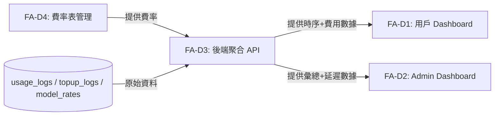
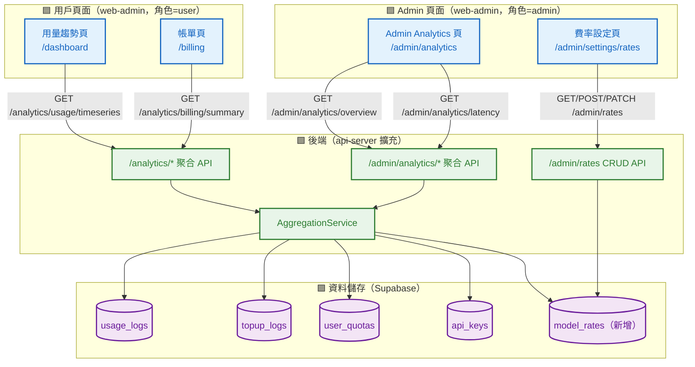
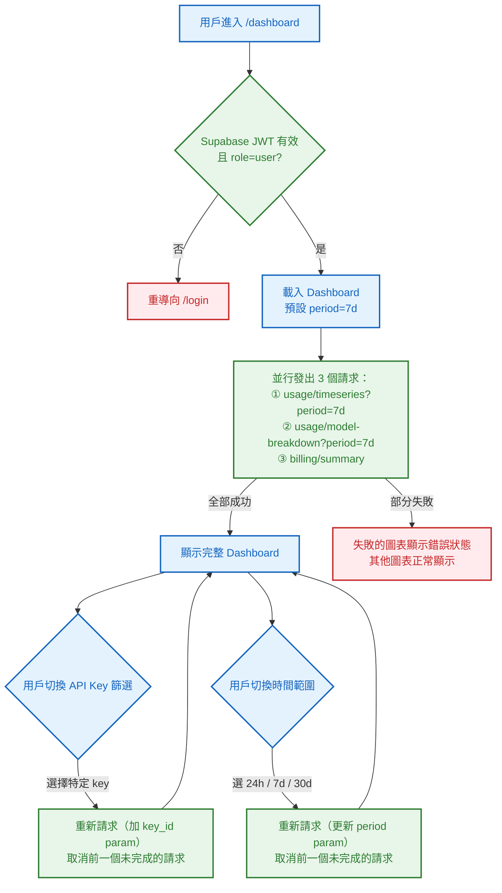
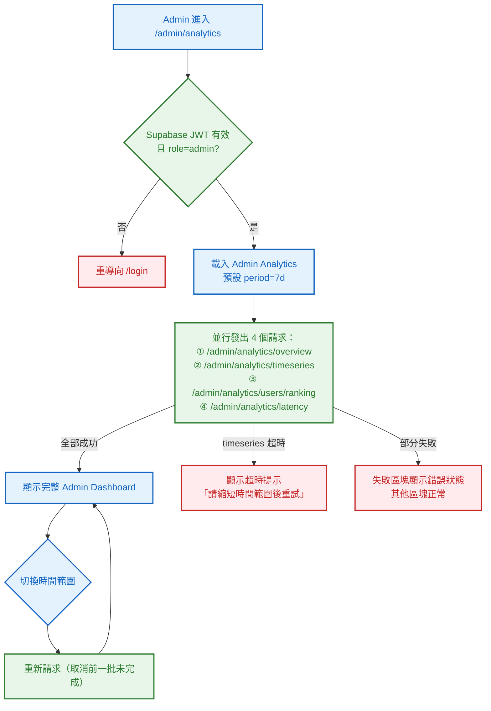
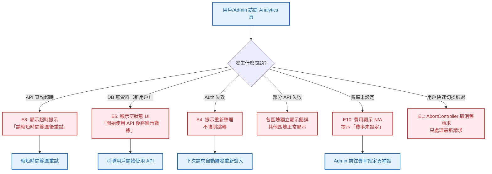

# S0 Brief Spec: Analytics Dashboard

> **階段**: S0 需求討論
> **建立時間**: 2026-03-15 15:00
> **最後更新**: 2026-03-15 15:30（整合用戶確認決策）
> **Agent**: requirement-analyst
> **Spec Mode**: Full Spec
> **工作類型**: new_feature
> **狀態**: 已確認

---

## 0. 工作類型

| 類型 | 代碼 | 說明 |
|------|------|------|
| 新需求 | `new_feature` | 全新功能或流程，S1 聚焦影響範圍+可複用元件 |

**本次工作類型**：`new_feature`（FA-D，原 apiex-platform scope_out，現正式啟動）

---

## 1. 一句話描述

為 Apiex 平台用戶與 Admin 建立可視化 Analytics Dashboard，展示 token 用量趨勢圖、API 延遲監控（p50/p95/p99 按 model 分開）、帳單費用分析，整合至現有 Admin UI 並依角色分流顯示，讓雙方都能掌握自身或全平台的使用狀況。

---

## 2. 為什麼要做

### 2.1 痛點

- **數據不透明**：用戶只能從 `/v1/usage/summary` 取得靜態累計數字，無法看到趨勢、無法知道「哪天用了最多」或「哪個 key 最活躍」。
- **延遲無感知**：`usage_logs` 記錄了 `latency_ms`，但完全沒有前端呈現，用戶和 Admin 都無法知道 API 是否在退化，也無法區分 apex-smart vs apex-cheap 的延遲差異。
- **帳單無法自助**：有了 Stripe 儲值（FA-B）之後，用戶充值了多少、還剩多少、用得有多快，目前一概看不到，也無法換算金額費用。
- **Admin 管理盲**：管理員無法快速掌握全平台用量趨勢，只能翻 `/admin/usage-logs` 的原始列表，缺乏彙總視圖。

### 2.2 目標

- 用戶登入後能在 Dashboard 看到個人 token 用量折線圖（支援 24h / 7d / 30d，粒度自動決定）
- 用戶能看到各 API Key 的用量分布（多 key 場景可分 key 查看）
- 用戶能看到 model 分布（apex-smart vs apex-cheap）及費用換算
- 用戶能看到各 model 延遲趨勢（p50/p95/p99）
- 用戶能看到充值記錄與剩餘配額
- Admin 能在 Admin Dashboard 看全平台彙總、各用戶消耗排行、按 model 分開的延遲健康
- Admin 能透過 UI 管理 per-model 費率表（不需直接操作 DB）

---

## 3. 使用者

| 角色 | 介面 | 說明 |
|------|------|------|
| **一般用戶** | 現有 Admin UI（依角色顯示用戶 Dashboard 頁面） | 查看個人 token 用量、各 key 分布、延遲趨勢、帳單費用與配額 |
| **Admin（管理員）** | 現有 Admin UI（Admin 專屬頁面） | 查看全平台彙總、各用戶排行、按 model 分開的延遲健康、管理費率表 |

> **架構決策（Q1 已確認）**：不新建獨立用戶 Portal。現有 `packages/web-admin` 登入後依 Supabase 角色（`user` / `admin`）路由到不同頁面。

---

## 4. 核心流程

> **閱讀順序**：功能區拆解 → 系統架構總覽 → 各功能區流程圖 → 例外處理

> 圖例：🟦 藍色 = 前端頁面/UI　｜　🟩 綠色 = 後端 API/服務　｜　🟪 紫色 = 資料儲存　｜　🟥 紅色 = 例外/錯誤

### 4.0 功能區拆解（Functional Area Decomposition）

#### 功能區識別表

| FA ID | 功能區名稱 | 一句話描述 | 入口 | 獨立性 | 備註 |
|-------|-----------|-----------|------|--------|------|
| FA-D1 | 用戶 Analytics Dashboard | 個人 token 用量趨勢（含 per-key 篩選）、延遲監控、帳單費用視圖 | 用戶登入後的 Dashboard 頁 | 中 | 前端依賴 FA-D3 |
| FA-D2 | Admin Analytics Dashboard | 全平台彙總、用戶消耗排行、按 model 分開的延遲健康 | Admin 登入後的 Analytics 頁 | 中 | 前端依賴 FA-D3 |
| FA-D3 | 後端資料聚合 API | 提供時序用量資料、統計彙總、帳單摘要的新 API endpoints | 後端新增 `/analytics/*` 路由 | 高 | 基礎設施，FA-D1/D2 共用 |
| FA-D4 | 費率表管理 | Admin UI 可設定各 model 的 per-token 費率，用戶 Dashboard 帳單費用換算依此費率計算 | Admin Settings 頁 + 新 `model_rates` 表 | 高 | 影響 FA-D1 帳單計算與 FA-D3 費用換算邏輯 |

> **獨立性判斷**：高 = 可獨立開發部署、中 = 共用部分資料/元件但流程獨立、低 = 與其他 FA 緊密耦合

#### 拆解策略

| FA 數量 | 獨立性 | 建議策略 | 說明 |
|---------|--------|---------|------|
| 4 | 中~高 | **單 SOP + FA 標籤** | 一份 brief spec，S3 波次按 FA 分組：FA-D4 + FA-D3 先行，FA-D1/D2 並行開發 |

**本次策略**：`single_sop_fa_labeled`

#### 跨功能區依賴



| 來源 FA | 目標 FA | 依賴類型 | 說明 |
|---------|---------|---------|------|
| FA-D4 | FA-D3 | 資料共用 | 費用換算需讀取 model_rates 表 |
| FA-D3 | FA-D1 | 資料共用 | FA-D1 所有圖表資料來自 FA-D3 API |
| FA-D3 | FA-D2 | 資料共用 | FA-D2 所有圖表資料來自 FA-D3 API |
| DB | FA-D3 | 資料來源 | usage_logs、topup_logs、user_quotas、model_rates 是聚合的原始資料 |

---

### 4.1 系統架構總覽



**架構重點**：

| 層級 | 組件 | 職責 |
|------|------|------|
| **前端（用戶）** | 用量趨勢頁 + 帳單頁（web-admin，角色=user） | 個人數據可視化，含 per-key 篩選與費用換算 |
| **前端（Admin）** | Admin Analytics 頁 + 費率設定頁（web-admin，角色=admin） | 全平台管理視圖、費率表 CRUD |
| **後端** | `/analytics/*` + `/admin/analytics/*` + `/admin/rates` | 聚合時序資料、費用換算、費率 CRUD |
| **資料（現有）** | usage_logs、topup_logs、user_quotas、api_keys | 不修改結構（可能加 Index） |
| **資料（新增）** | model_rates | 儲存各 model 的 per-1k-token 費率 |

---

### 4.2 FA-D4: 費率表管理

> 先行 FA，FA-D3 費用換算邏輯依賴其資料。

#### 4.2.1 model_rates 表結構草案

| 欄位 | 類型 | 說明 |
|------|------|------|
| `id` | uuid | PK |
| `model_tag` | text | `apex-smart` / `apex-cheap` |
| `input_rate_per_1k` | numeric | 每 1000 input token 費率（USD） |
| `output_rate_per_1k` | numeric | 每 1000 output token 費率（USD） |
| `effective_from` | timestamptz | 費率生效時間（支援歷史費率查詢） |
| `created_by` | uuid | Admin user_id |
| `created_at` | timestamptz | 建立時間 |

#### 4.2.2 費率 API Endpoints 草案

| 端點 | 認證 | 用途 |
|------|------|------|
| `GET /admin/rates` | Admin JWT | 查詢所有費率（含歷史） |
| `POST /admin/rates` | Admin JWT | 新增費率（自動設 effective_from = now） |
| `PATCH /admin/rates/:id` | Admin JWT | 修改費率（建議改為新增新版本而非覆寫，以保留歷史） |

#### 4.2.3 Happy Path（FA-D4）

| 路徑 | 入口 | 結果 |
|------|------|------|
| **A：Admin 設定初始費率** | 進入費率設定頁 → 輸入 apex-smart / apex-cheap 費率 → 儲存 | model_rates 表新增一筆記錄，立即對費用換算生效 |
| **B：Admin 更新費率** | 修改現有費率 → 儲存 | 建立新費率版本，effective_from = now；歷史記錄保留 |

---

### 4.3 FA-D3: 後端資料聚合 API

> 基礎設施 FA，FA-D1/D2 依賴其 API 合約。建議 S3 排在第一波（與 FA-D4 並行）。

#### 4.3.1 需新增的 API Endpoints

| 端點 | 認證 | 用途 |
|------|------|------|
| `GET /analytics/usage/timeseries` | API Key 或 Supabase JWT | 用戶個人 token 用量時序；支援 `key_id` 篩選 |
| `GET /analytics/usage/model-breakdown` | API Key 或 Supabase JWT | 用戶個人各 model 用量分布；支援 `key_id` 篩選 |
| `GET /analytics/latency/timeseries` | API Key 或 Supabase JWT | 用戶個人延遲趨勢（p50/p95/p99，按 model 分開）|
| `GET /analytics/billing/summary` | Supabase JWT | 用戶帳單摘要（充值記錄 + 依費率換算的消耗金額 + 剩餘配額） |
| `GET /admin/analytics/overview` | Admin JWT | 全平台彙總（總 tokens/requests/平均延遲/活躍用戶數）|
| `GET /admin/analytics/timeseries` | Admin JWT | 全平台 token 用量時序（按 model 分欄） |
| `GET /admin/analytics/users/ranking` | Admin JWT | 各用戶消耗排行 Top N（tokens + 金額） |
| `GET /admin/analytics/latency` | Admin JWT | 全平台延遲趨勢（p50/p95/p99，按 model 分開） |

**共通 Query Parameters**：

| 參數 | 類型 | 說明 |
|------|------|------|
| `period` | string | `24h` / `7d` / `30d`（不開放 custom / all-time，限制最大 90 天） |
| `key_id` | uuid | 用戶 API endpoints 專用，篩選特定 API Key |
| `model_tag` | string | 延遲 endpoints 可選，不傳則回傳所有 model |

**時間粒度自動規則（Q3 已確認）**：

| period | 自動粒度 | 說明 |
|--------|---------|------|
| `24h` | `hour` | 回傳 24 個小時點 |
| `7d` | `day` | 回傳 7 個天點 |
| `30d` | `day` | 回傳 30 個天點 |

前端不需要粒度選擇器，後端依 period 自動決定 `DATE_TRUNC` 單位。

#### 4.3.2 資料聚合策略

**MVP 決策：即時 SQL 聚合 + DB Index**

```sql
-- 必要 Index（S1 需確認是否已存在）
CREATE INDEX IF NOT EXISTS idx_usage_logs_api_key_created
    ON usage_logs (api_key_id, created_at DESC);

CREATE INDEX IF NOT EXISTS idx_usage_logs_user_created
    ON usage_logs (user_id, created_at DESC);
-- 注意：usage_logs 目前可能無 user_id，需 S1 確認（見 §9 DB 確認清單）
```

#### 4.3.3 延遲 Percentile 計算

`latency_ms` 欄位已存在於 `usage_logs`。p50/p95/p99 使用 PostgreSQL `PERCENTILE_CONT`：

```sql
SELECT
  DATE_TRUNC('day', created_at) AS bucket,
  model_tag,
  PERCENTILE_CONT(0.50) WITHIN GROUP (ORDER BY latency_ms) AS p50,
  PERCENTILE_CONT(0.95) WITHIN GROUP (ORDER BY latency_ms) AS p95,
  PERCENTILE_CONT(0.99) WITHIN GROUP (ORDER BY latency_ms) AS p99
FROM usage_logs
WHERE created_at >= NOW() - INTERVAL '7 days'
GROUP BY bucket, model_tag
ORDER BY bucket;
```

#### 4.3.4 帳單費用換算邏輯

費用計算：`cost = (prompt_tokens / 1000 * input_rate) + (completion_tokens / 1000 * output_rate)`，費率取 `model_rates` 表中 `effective_from <= usage created_at` 的最新一筆（支援歷史費率準確性）。

若 `model_rates` 尚無對應 model 的費率記錄，API 回傳費用欄位為 `null`，前端顯示「費率未設定，請聯絡管理員」。

#### 4.3.5 Happy Path（FA-D3）

| 路徑 | 入口 | 結果 |
|------|------|------|
| **A：用戶查詢 7d 時序** | `GET /analytics/usage/timeseries?period=7d` | 回傳 7 個 day 點的 token 用量陣列（apex-smart / apex-cheap 各一欄） |
| **B：用戶按 key 篩選** | `GET /analytics/usage/timeseries?period=7d&key_id={uuid}` | 僅回傳該 key 的時序資料 |
| **C：Admin 查詢全平台** | `GET /admin/analytics/overview?period=30d` | 回傳全平台 30 天彙總統計 |
| **D：Admin 查詢延遲** | `GET /admin/analytics/latency?period=7d` | 回傳 7 天每天 apex-smart/apex-cheap 各自的 p50/p95/p99 |

---

### 4.4 FA-D1: 用戶 Analytics Dashboard

> 整合到現有 `packages/web-admin`，Supabase Auth 角色 = `user` 時顯示此頁面。

#### 4.4.1 頁面結構

```
用戶 Dashboard（/dashboard）
├── 總覽卡片行：本期 Tokens 用量、本期請求數、平均延遲、剩餘配額
├── [API Key 篩選器]：「全部 Keys」或選擇特定 key（多 key 用戶使用）
├── Token 用量趨勢圖（AreaChart，24h→小時，7d/30d→天）
│   └── 疊加兩條線：apex-smart / apex-cheap
├── Model 分布圓環圖（apex-smart vs apex-cheap token 比例）
├── 延遲趨勢圖（LineChart，p50 / p95 / p99 三條線）
│   └── 依目前選擇的 model 顯示（預設全部 model 混合）
└── 帳單摘要區塊
    ├── 本期消耗費用（USD，依費率換算；費率未設定時顯示 N/A）
    ├── 剩餘 token 預估可用天數（按近 7 日平均消耗速率計算）
    └── 充值記錄表格（最近 5 筆，含金額、tokens_granted、時間）
```

#### 4.4.2 全局流程圖



#### 4.4.3 Happy Path（FA-D1）

| 路徑 | 入口 | 結果 |
|------|------|------|
| **A：查看 7 天用量趨勢（預設）** | 進入 /dashboard | AreaChart 顯示 7 天 daily token，apex-smart/apex-cheap 各一條線；卡片顯示本期總計 |
| **B：切換 24h 視圖** | 點擊「24h」篩選 | 圖表更新為 24 個小時點，粒度自動切換為 hour |
| **C：按 API Key 篩選** | Key 篩選器選擇 `key-prod` | 圖表、分布圖、延遲圖全部重新請求，僅顯示該 key 的資料 |
| **D：查看帳單費用** | 捲動至帳單區塊 | 顯示本期消耗 $X.XX USD、剩餘配額預估 N 天、最近 5 筆充值記錄 |

---

### 4.5 FA-D2: Admin Analytics Dashboard

> 整合到現有 `packages/web-admin`，Supabase Auth 角色 = `admin` 時顯示此頁面。

#### 4.5.1 頁面結構

```
Admin Analytics（/admin/analytics）
├── 總覽卡片行：全平台總 Tokens、今日請求數、活躍用戶數（近 7d）、全平台平均延遲
├── 全平台 Token 用量趨勢圖（AreaChart，兩條線：apex-smart / apex-cheap）
├── 用戶消耗排行 Top 10（表格：用戶 email、tokens 用量、請求數、消耗金額）
├── 延遲健康視圖（4 條折線：apex-smart p50/p95/p99、apex-cheap p50/p95/p99）
│   └── 兩個 model 用不同色系區分（如藍色系 = apex-smart，橘色系 = apex-cheap）
└── 全平台 Model 分布圓環圖

Admin Settings → 費率管理（/admin/settings/rates）
├── 現有費率表（model_tag、input_rate、output_rate、effective_from）
└── 新增費率表單（填入 model_tag + input/output 費率）
```

#### 4.5.2 全局流程圖



#### 4.5.3 Happy Path（FA-D2）

| 路徑 | 入口 | 結果 |
|------|------|------|
| **A：查看全平台概況** | Admin 進入 /admin/analytics | 顯示全平台 7d token 趨勢、用戶排行、延遲健康視圖 |
| **B：查看延遲按 model 分開** | 延遲健康視圖 | apex-smart p50/p95/p99（藍色系）和 apex-cheap p50/p95/p99（橘色系）共 6 條線 |
| **C：設定費率** | 進入 /admin/settings/rates → 填入費率 → 儲存 | model_rates 新增記錄，帳單頁費用換算立即使用新費率 |

---

### 4.6 例外流程圖（跨 FA）



### 4.7 六維度例外清單

| 維度 | ID | FA | 情境 | 觸發條件 | 預期行為 | 嚴重度 |
|------|-----|-----|------|---------|---------|--------|
| 並行/競爭 | E1 | FA-D1/D2 | 用戶快速切換時間範圍或 key 篩選，觸發多個並行查詢 | 前端在前一個請求未完成時發出新請求 | 前端 AbortController 取消前一批請求，只處理最新請求結果 | P1 |
| 並行/競爭 | E2 | FA-D2 | 多位 Admin 同時載入，大量彙總查詢衝擊 Supabase | 多位 Admin 同時訪問 | MVP 接受此風險；後續可加 query result cache（5 分鐘 TTL） | P2 |
| 狀態轉換 | E3 | FA-D1/D2 | 用戶停留 Dashboard 期間有新 API 請求進來，資料過期 | 圖表顯示的是舊資料 | 提供「手動刷新」按鈕；不做自動輪詢以避免 DB 壓力 | P2 |
| 狀態轉換 | E4 | FA-D1 | Supabase JWT 在頁面使用中過期 | Session 在用戶停留期間到期 | 下次 API 請求收到 401 → Toast 提示「請重新整理頁面」，不強制跳轉 | P1 |
| 資料邊界 | E5 | FA-D1/D2 | 新用戶 usage_logs 為空 | 剛建立帳號、從未發出 API 請求 | 圖表顯示空狀態 UI（非報錯），提示「開始使用 API 後將顯示數據」 | P1 |
| 資料邊界 | E6 | FA-D3 | 時區問題：DB 存 UTC，用戶本地時區不同 | 跨午夜邊界的 GROUP BY day 計算 | 所有時序聚合以 UTC 為準，前端顯示時標注「UTC」 | P1 |
| 資料邊界 | E7 | FA-D3 | 用戶選擇 30d 且 usage_logs 資料量極大 | 聚合查詢資料量過大導致超時 | 前端限制最大 30d；後端設 10 秒 timeout，超時回傳 504 | P1 |
| 網路/外部 | E8 | FA-D3 | 聚合查詢超時（Supabase 慢查詢） | 複雜 GROUP BY + PERCENTILE_CONT 超過 10 秒 | 後端 504；前端顯示「查詢超時，請縮短時間範圍」 | P1 |
| 網路/外部 | E9 | FA-D1/D2 | Supabase 服務中斷 | Supabase 故障，所有 DB 查詢失敗 | Dashboard 整體顯示錯誤狀態 + 上次更新時間；不 crash | P1 |
| 業務邏輯 | E10 | FA-D1 | 帳單費率未設定（model_rates 無對應記錄） | Admin 尚未設定費率或新 model 上線但費率未更新 | 費用欄位顯示 `N/A`，提示「費率未設定，請聯絡管理員」；不影響 token 用量顯示 | P0 |
| 業務邏輯 | E11 | FA-D4 | Admin 修改費率後，歷史帳單費用應按當時費率計算 | 費率更新前的 usage 應套用舊費率 | model_rates 有 `effective_from` 欄位，費用換算時 JOIN 取 `effective_from <= usage.created_at` 的最新費率 | P1 |
| 業務邏輯 | E12 | FA-D2 | Admin 查詢排行時有 revoked key 的歷史用量 | api_keys 已 revoked，但 usage_logs 有歷史記錄 | 歷史資料正常顯示，key 狀態標注為 revoked | P2 |
| UI/體驗 | E13 | FA-D1/D2 | 圖表 loading 中用戶切換頁面 | 請求未完成時用戶導航離開 | AbortController 取消未完成請求，不更新已卸載元件（無 memory leak） | P1 |
| UI/體驗 | E14 | FA-D1 | 窄螢幕或 Mobile 查看 | 圖表在 <768px 寬度下顯示 | 圖表響應式縮放；若太窄改為卡片式數字（隱藏圖表）；Admin UI 以桌面為主，Mobile 為次要 | P2 |

### 4.8 白話文摘要

Analytics Dashboard 讓用戶和管理員可以看到「過去一段時間的 API 使用圖表」，包含每天用了多少 token、哪條 API Key 用得最多、各模型回應速度有多快（分 apex-smart 和 apex-cheap 顯示），以及換算成美元的消耗費用。管理員可以在設定頁面輸入各模型的計費費率，設定後帳單頁面會自動換算。

如果查詢的資料範圍太大，或者 Supabase 服務不穩，圖表可能會顯示載入失敗的提示，縮短查詢時間範圍或稍後重試通常就能解決。全新帳號由於還沒有使用記錄，會看到「尚無資料」的提示，而非錯誤訊息。費率還沒有設定的情況下，費用欄位會顯示「費率未設定」，但 token 用量仍會正常顯示。

---

## 5. 成功標準

| # | FA | 類別 | 標準 | 驗證方式 |
|---|-----|------|------|---------|
| 1 | FA-D1 | 功能 | 用戶登入後能看到 token 用量 AreaChart（7d 預設，自動 day 粒度） | 手動測試：有用量記錄的帳號登入後確認圖表顯示 |
| 2 | FA-D1 | 功能 | 切換 24h / 7d / 30d 篩選，圖表粒度自動切換（24h→hour，7d/30d→day） | 手動測試：切換後確認 x 軸標籤單位正確 |
| 3 | FA-D1 | 功能 | 用戶有多個 API Key 時，key 篩選器可用；選擇特定 key 後圖表資料正確過濾 | 手動測試：建立 2 個 key 各自呼叫 API，確認分 key 顯示數據正確 |
| 4 | FA-D1 | 功能 | 延遲視圖顯示 p50/p95/p99 三條線，新用戶（零 usage）顯示空狀態 UI，不報錯 | 手動測試：剛建立的帳號登入確認空狀態 |
| 5 | FA-D1 | 功能 | 帳單區塊顯示費用換算（USD），費率設定後正確計算；費率未設定時顯示 N/A | 手動測試：Admin 設定費率後確認帳單頁顯示金額 |
| 6 | FA-D2 | 功能 | Admin Dashboard 顯示全平台 token 趨勢圖（apex-smart / apex-cheap 分開） | 手動測試：Admin 登入後確認全平台圖表 |
| 7 | FA-D2 | 功能 | Admin 延遲視圖顯示 apex-smart 和 apex-cheap 各自的 p50/p95/p99（共 6 條線） | 手動測試：確認延遲圖表按 model 分色顯示 |
| 8 | FA-D2 | 功能 | Admin 能看到用戶消耗排行 Top 10，含 token 用量和費用金額 | 手動測試：確認排行數值與 DB 彙總一致 |
| 9 | FA-D4 | 功能 | Admin 在費率設定頁新增/修改費率後，帳單頁費用換算立即更新 | 手動測試：修改費率後重新整理帳單頁確認金額變化 |
| 10 | FA-D4 | 功能 | 費率有歷史版本支援：修改費率後，修改前的 usage 仍套用舊費率計算 | 自動化測試：建立時間 t1 的 usage + t2 修改費率，確認 t1 usage 費用用舊費率 |
| 11 | FA-D3 | 功能 | `GET /analytics/usage/timeseries?period=7d` 回傳正確的 7 個 day 點時序陣列 | 自動化測試：對比 DB 聚合結果 |
| 12 | FA-D3 | 效能 | 30d 時序查詢回應時間 < 3 秒（含延遲 PERCENTILE_CONT） | 自動化：計時查詢 + 確認 Index 使用 |
| 13 | FA-D3 | 資料正確性 | model-breakdown 返回的 token 比例與 usage_logs 實際分布一致 | 自動化測試：期望值 vs API 回傳值 |
| 14 | 全域 | 體驗 | 所有圖表 loading 狀態有骨架畫面（skeleton），不出現空白畫面 | 手動測試：網速限流後確認骨架顯示 |
| 15 | 全域 | 體驗 | 快速切換時間範圍/篩選時，舊請求被取消，不出現資料閃爍或順序錯亂 | 手動測試：快速連點切換 period |

---

## 6. 範圍

### 範圍內

**FA-D4：費率表管理（先行）**
- `model_rates` 表（新增，含歷史費率支援）
- `GET/POST/PATCH /admin/rates` API
- Admin 費率設定頁（/admin/settings/rates）

**FA-D3：後端資料聚合 API（先行，與 FA-D4 並行）**
- `GET /analytics/usage/timeseries`（含 key_id 篩選）
- `GET /analytics/usage/model-breakdown`（含 key_id 篩選）
- `GET /analytics/latency/timeseries`（p50/p95/p99，按 model 分欄）
- `GET /analytics/billing/summary`（含費率換算）
- `GET /admin/analytics/overview`
- `GET /admin/analytics/timeseries`（按 model 分欄）
- `GET /admin/analytics/users/ranking`（含費用欄位）
- `GET /admin/analytics/latency`（p50/p95/p99，按 model 分開）
- DB Index 優化（usage_logs 時間欄位）
- 時間粒度自動規則（24h→hour，7d/30d→day）

**FA-D1：用戶 Analytics Dashboard**
- token 用量 AreaChart（24h / 7d / 30d，自動粒度）
- API Key 篩選器（多 key 用戶可按 key 查看）
- model 分布圓環圖（apex-smart vs apex-cheap）
- 延遲趨勢圖（p50/p95/p99）
- 帳單摘要（費率換算金額 + 充值記錄 + 剩餘配額預估天數）
- 空狀態 UI + loading skeleton

**FA-D2：Admin Analytics Dashboard**
- 全平台 token 趨勢圖（apex-smart / apex-cheap 分開）
- 用戶消耗排行 Top 10（含費用）
- 全平台 model 分布圓環圖
- 延遲健康視圖（apex-smart 和 apex-cheap 各自 p50/p95/p99）

### 範圍外

- 即時資料（Realtime WebSocket / Supabase Realtime）
- 資料匯出（CSV/JSON）
- 告警系統（延遲超標通知）
- 自訂 Dashboard 佈局
- 跨用戶比較視圖
- 財務預測 / 趨勢預測
- 物化視圖/快取層（視效能需求 Phase 2）
- per-request 粒度的費用明細（目前是時段彙總）
- Custom 時間範圍選擇器（限定 24h / 7d / 30d 三個選項）

---

## 7. 已知限制與約束

- **資料基礎**：完全依賴現有 `usage_logs` 表結構；`user_id` 欄位存在與否影響查詢策略（S1 需核實，見 §9）。
- **費率歷史**：`model_rates` 需有 `effective_from` 欄位以支援歷史費率計算，否則費率修改後歷史帳單會不準確。
- **FA-B 依賴**：帳單視圖中的充值記錄依賴 `topup_logs` 表（FA-B Stripe 已完成）。
- **效能限制**：MVP 用即時 SQL 聚合；`PERCENTILE_CONT` 在大資料量下較慢，接受 10 秒查詢上限，超過回 504。
- **圖表庫**：建議引入 Tremor（React + Tailwind Dashboard 組件庫）；Recharts 為備選。S1 需確認與現有 web-admin 的相容性。
- **角色分流**：現有 Admin UI 需要加入 Supabase 角色檢查邏輯（`user` vs `admin` 路由到不同 Dashboard 頁面）。

---

## 8. 前端 UI 畫面清單

### 8.1 FA-D1: 用戶 Analytics Dashboard 畫面

| # | 畫面 | 狀態 | 路徑 | 變更說明 |
|---|------|------|------|---------|
| 1 | **用戶 Dashboard 主頁** | 新增 | `/dashboard` | 總覽卡片 + AreaChart + Model 分布 + 延遲圖 + API Key 篩選器 |
| 2 | **帳單頁** | 新增 | `/billing` | 費用換算 + 充值記錄表格 + 配額剩餘天數 |

### 8.2 FA-D2: Admin Analytics Dashboard 畫面

| # | 畫面 | 狀態 | 路徑 | 變更說明 |
|---|------|------|------|---------|
| 3 | **Admin Analytics 頁** | 新增 | `/admin/analytics` | 全平台趨勢圖 + 用戶排行 + model 分布 + 延遲健康視圖 |
| 4 | **Admin 費率設定頁** | 新增 | `/admin/settings/rates` | 費率表 CRUD |

### 8.3 Alert / Toast 清單

| # | Alert | FA | 觸發場景 | 內容 |
|---|-------|-----|---------|------|
| A1 | 查詢超時 Toast | FA-D1/D2 | 聚合查詢 > 10s | 「查詢超時，請縮短時間範圍後重試」 |
| A2 | Session 過期 Toast | FA-D1 | JWT 過期時下一次請求失敗 | 「Session 已過期，請重新整理頁面」 |
| A3 | 費率未設定提示 | FA-D1 | billing/summary 回傳費用為 null | 「費率未設定，請聯絡管理員」 |

### 8.4 畫面統計摘要

| 類別 | 數量 |
|------|------|
| 新增畫面 | 4（用戶 Dashboard、帳單頁、Admin Analytics、費率設定頁） |
| 既有修改畫面 | 1（現有 Admin 主頁需加 role-based 路由邏輯） |
| 新增 Alert/Toast | 3（超時、Session 過期、費率未設定） |

### 8.5 共用元件規劃

| 共用元件 | 使用場景 | Props 摘要 |
|---------|---------|-----------|
| `TimeseriesAreaChart` | FA-D1 用量/延遲、FA-D2 全平台趨勢 | `data` / `series`（多條線定義）/ `xKey` / `period` |
| `LatencyLineChart` | FA-D1 延遲圖、FA-D2 延遲健康 | `data` / `models`（各 model 的 p50/p95/p99 陣列）|
| `StatsCard` | FA-D1/D2 總覽卡片 | `title` / `value` / `unit` / `delta` |
| `DonutChart` | FA-D1/D2 model 分布 | `data`（label + value 陣列）|
| `PeriodSelector` | FA-D1/D2 所有圖表頁 | `value` / `onChange`，選項固定 24h/7d/30d |
| `KeySelector` | FA-D1 | `keys`（api_keys 列表）/ `value` / `onChange` |
| `EmptyState` | FA-D1/D2 無資料 | `message` / `icon` |
| `LoadingSkeleton` | FA-D1/D2 所有圖表 | `type`（chart / card / table） |

---

## 9. 補充說明

### 圖表庫選擇（已確認方向）

**決策：引入 Tremor（主要）+ 備選 Recharts**

| 方案 | 推薦度 | 理由 |
|------|--------|------|
| **Tremor（主）** | 高 | Dashboard 場景組件現成（AreaChart/BarChart/DonutChart）、與現有 Tailwind 無縫整合、開發速度最快 |
| **Recharts（備）** | 中 | 若 Tremor 的延遲折線圖（多條線 + tooltip）不夠靈活，Recharts 可補強 |
| Chart.js | 低 | Canvas-based，TypeScript 繁瑣，不適合 |
| Nivo | 低 | Bundle 過大 |

### 資料聚合策略（已確認）

**決策：即時 SQL 聚合 + Index**

Phase 1 MVP：每次查詢直接 `GROUP BY DATE_TRUNC(...)`，搭配 composite index。
Phase 2（資料量超過 100 萬筆時）：升級為 Supabase 物化視圖 `usage_daily_stats`，定期 refresh。

### 現有 DB 表確認清單（S1 必核實）

| 確認項目 | 影響 |
|---------|------|
| `usage_logs` 是否有 `user_id` 欄位 | 若無，per-user 聚合需先 JOIN `api_keys` → `user_id` |
| `usage_logs` 是否有 `(api_key_id, created_at)` composite index | 無則 S1 加入 migration |
| `usage_logs` 是否有 `(user_id, created_at)` index（若 user_id 存在） | 無則 S1 加入 migration |
| `topup_logs` 欄位結構確認（金額、tokens_granted、status、created_at） | 帳單摘要 API 依賴 |
| `user_quotas` 剩餘配額計算方式（直接存 remaining 還是需要 quota - used 計算） | 剩餘天數預估計算方式 |
| 現有 Admin UI 的 Supabase role 欄位名稱與值（`user` / `admin` 的具體判斷方式） | Role-based 路由邏輯 |
