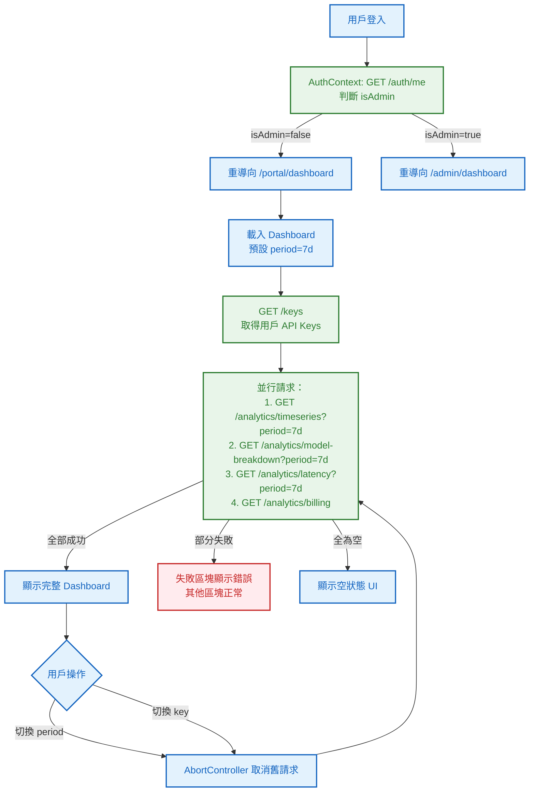
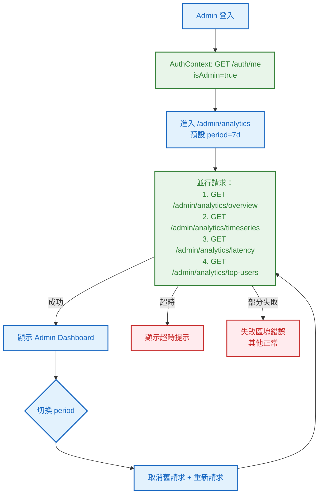
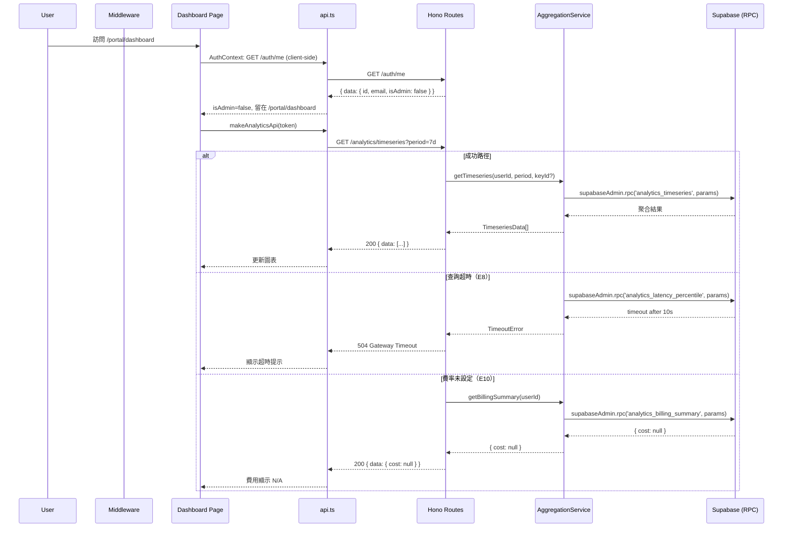

# S1 Dev Spec: Analytics Dashboard

> **階段**: S1 技術分析
> **建立時間**: 2026-03-15 16:30
> **Agent**: codebase-explorer (Phase 1) + architect (Phase 2)
> **工作類型**: new_feature
> **複雜度**: L
> **S2 修正**: 2026-03-15 -- 修正 P0 (SR-1/SR-2/SR-3) + 關鍵 P1 (SR-4/SR-5/SR-7/SR-8/SR-13)

---

## 1. 概述

### 1.1 需求參照
> 完整需求見 `s0_brief_spec.md`，以下僅摘要。

為 Apiex 平台用戶與 Admin 建立 Analytics Dashboard，整合至現有 web-admin，展示 token 用量趨勢、model 分布、延遲監控（p50/p95/p99 按 model 分開）、帳單費用換算（per-model 費率表，Admin 可動態設定），並依角色分流顯示不同視圖。

### 1.2 技術方案摘要

後端以 Hono 框架新增兩組路由群：`/analytics/*`（用戶端，supabaseJwtAuth）與 `/admin/analytics/*` + `/admin/rates`（Admin 端，adminAuth）。核心聚合邏輯封裝為 **Supabase RPC functions**（PostgreSQL stored functions），AggregationService 透過 `supabaseAdmin.rpc()` 呼叫，解決 Supabase JS client 不支援 raw SQL 的限制。新增 `model_rates` 表（含 `created_by` 追蹤建立者）支援歷史費率版本。前端以 Recharts 建立共用圖表元件，透過新增 GET `/auth/me` endpoint 實現角色判斷（沿用 ADMIN_EMAILS 機制），前端 AuthContext client-side 呼叫 `/auth/me` 取得角色資訊。

### 1.3 Unknowns 裁決摘要

| ID | Unknown | 裁決 | 依據 |
|----|---------|------|------|
| U1 | topup_logs migration 是否存在 | **未解決** -- migration 檔案不存在（migrations 目錄僅有 `20260314000000_init_schema.sql`），需在本次 analytics migration 中以 `CREATE TABLE IF NOT EXISTS` 補建 | 實際驗證 migrations 目錄，`004_topup_logs.sql` 不存在；sdd_context 亦記錄「topup_logs 缺 migration 檔案，本次補上」 |
| U2 | Admin 角色識別方案 | 沿用 ADMIN_EMAILS + 新增 `GET /auth/me` endpoint，前端 AuthContext client-side 呼叫 `/auth/me` 取得 `isAdmin` | 最小變更原則，不動 Supabase user metadata；不在 middleware 做 server-side HTTP 呼叫（避免 Edge Runtime 延遲） |
| U3 | 圖表庫選型 | **Recharts**（跳過 Tremor） | Tremor v3 不支援 Tailwind v4，web-admin 使用 `@tailwindcss/postcss 4.2.1`，相容性風險過高 |
| U4 | 配額剩餘計算 | `SUM(api_keys.quota_tokens)` WHERE user_id AND status='active' | api_keys.quota_tokens 是 per-key 配額，-1 表示無限制 |
| U5 | 用戶 Dashboard 路由 | `/portal/dashboard` | 沿用現有 `/portal/*` 路由結構 |

---

## 2. 影響範圍（Phase 1：codebase-explorer）

### 2.1 受影響檔案

#### Backend（Hono / TypeScript）

| 檔案 | 變更類型 | 說明 |
|------|---------|------|
| `packages/api-server/src/routes/analytics.ts` | 新增 | 用戶 `/analytics/*` 路由（4 endpoints） |
| `packages/api-server/src/routes/admin.ts` | 修改 | 新增 `/admin/analytics/*` 及 `/admin/rates` 路由（7 endpoints） |
| `packages/api-server/src/routes/auth.ts` | 修改 | 新增 `GET /auth/me` endpoint |
| `packages/api-server/src/services/AggregationService.ts` | 新增 | RPC 呼叫封裝：timeseries, model-breakdown, latency percentile, billing, overview, admin timeseries, ranking |
| `packages/api-server/src/services/RatesService.ts` | 新增 | model_rates CRUD |
| `packages/api-server/src/index.ts` | 修改 | 掛載 analytics 路由群 |
| `packages/api-server/src/lib/database.types.ts` | 修改 | 新增 ModelRate 型別 |

#### Frontend（Next.js 15 / React 19）

| 檔案 | 變更類型 | 說明 |
|------|---------|------|
| `packages/web-admin/src/app/portal/dashboard/page.tsx` | 新增 | 用戶 Dashboard（FA-D1） |
| `packages/web-admin/src/app/admin/(protected)/analytics/page.tsx` | 新增 | Admin Analytics（FA-D2） |
| `packages/web-admin/src/app/admin/(protected)/settings/rates/page.tsx` | 新增 | Admin 費率設定（FA-D4） |
| `packages/web-admin/src/middleware.ts` | 修改 | 加入 role-based 路由分流（client-side AuthContext 配合） |
| `packages/web-admin/src/lib/api.ts` | 修改 | 新增 analytics/rates API client |
| `packages/web-admin/src/components/charts/TimeseriesAreaChart.tsx` | 新增 | Recharts AreaChart |
| `packages/web-admin/src/components/charts/LatencyLineChart.tsx` | 新增 | Recharts 延遲折線圖 |
| `packages/web-admin/src/components/charts/DonutChart.tsx` | 新增 | Recharts 圓環圖 |
| `packages/web-admin/src/components/analytics/StatsCard.tsx` | 新增 | 統計卡片 |
| `packages/web-admin/src/components/analytics/PeriodSelector.tsx` | 新增 | 24h/7d/30d 切換 |
| `packages/web-admin/src/components/analytics/KeySelector.tsx` | 新增 | API Key 篩選 |
| `packages/web-admin/src/components/analytics/EmptyState.tsx` | 新增 | 空資料狀態 |
| `packages/web-admin/src/components/analytics/LoadingSkeleton.tsx` | 新增 | 骨架屏 |
| `packages/web-admin/src/components/AppLayout.tsx` | 修改 | Sidebar 新增 Analytics / Settings 連結 |
| `packages/web-admin/src/app/portal/layout.tsx` | 修改 | Portal nav 新增 Dashboard 連結 |
| `packages/web-admin/package.json` | 修改 | 新增 recharts 依賴 |

#### Database

| 資料表/Index | 變更類型 | 說明 |
|-------------|---------|------|
| `model_rates` | 新增 | 費率表（model_tag, input/output rate, effective_from, created_by） |
| `topup_logs` | 補 migration | `CREATE TABLE IF NOT EXISTS`（表已存在於 Supabase 雲端，補 migration 確保可重現） |
| `idx_usage_logs_api_key_created` | 新增 | composite index on (api_key_id, created_at DESC) |
| `idx_model_rates_tag_effective` | 新增 | composite index on (model_tag, effective_from DESC) |
| RPC functions (8 個) | 新增 | 聚合查詢 stored functions（詳見 Task #1） |

### 2.2 依賴關係

- **上游依賴**：
  - `usage_logs` 表：所有聚合 API 的核心資料來源（欄位：api_key_id, model_tag, prompt_tokens, completion_tokens, total_tokens, latency_ms, status, created_at）
  - `api_keys` 表：per-user 聚合的橋接表（usage_logs 無 user_id，需 JOIN api_keys 取 user_id）
  - `topup_logs` 表：帳單摘要的充值記錄（user_id, amount_usd, tokens_granted, created_at）
  - `adminAuth` middleware：Admin endpoints 複用
  - `supabaseJwtAuth` middleware：用戶 endpoints 複用

- **下游影響**：
  - `middleware.ts` 修改影響所有 `/admin/*` 和 `/portal/*` 路由的 auth guard
  - `admin.ts` 新增路由需確保不影響現有 `/admin/users`、`/admin/usage-logs`、`/admin/topup-logs`
  - `AppLayout.tsx` 修改 navItems 影響 Admin sidebar

### 2.3 現有模式與技術考量

**後端模式**：
- 路由：使用 `Hono` 函式型路由，每個 route file export 一個 `xxxRoutes()` 函式返回 `Hono` router
- 認證：`supabaseJwtAuth`（一般用戶）和 `adminAuth`（Admin，ADMIN_EMAILS whitelist）分別掛載在不同路由群
- 服務層：獨立 Service class（如 `UsageLogger`、`KeyService`、`RouterService`），透過 `supabaseAdmin` client 直接操作 DB
- 回應格式：`{ data: T }` 或 `{ data: T[], pagination: { page, limit, total } }`
- 錯誤處理：`Errors.xxx()` 靜態方法回傳標準錯誤 Response

**前端模式**：
- API 層：`lib/api.ts` 提供 `makeXxxApi(token)` 工廠函式，回傳具名方法物件
- 元件：Radix UI primitives + Tailwind v4 + lucide-react icons
- Layout：Admin 使用 `AppLayout`（sidebar），Portal 使用 `PortalLayout`（top nav）
- Auth：`@supabase/ssr` 的 `createServerClient` 在 middleware.ts 做 server-side auth check

---

## 3. User Flow（Phase 2：architect）

### 3.1 用戶 Dashboard 流程



### 3.2 Admin Analytics 流程



### 3.3 異常流程

| S0 ID | 情境 | 觸發條件 | 系統處理 | 用戶看到 |
|-------|------|---------|---------|---------|
| E1 | 快速切換篩選 | 前一請求未完成時發新請求 | AbortController 取消舊請求 | 無閃爍，只顯示最新結果 |
| E5 | 新用戶無資料 | usage_logs 為空 | API 回傳空陣列 | EmptyState：「開始使用 API 後將顯示數據」 |
| E7/E8 | 聚合查詢超時 | PERCENTILE_CONT 超過 10 秒 | 後端 504 | 「查詢超時，請縮短時間範圍」 |
| E10 | 費率未設定 | model_rates 無對應記錄 | API 回傳 cost=null | 「費率未設定，請聯絡管理員」 |
| E4 | JWT 過期 | Session 到期 | 下次請求 401 | Toast「請重新整理頁面」 |
| E13 | 離開頁面未完成請求 | 導航離開 | AbortController 取消 | 無 memory leak |

### 3.4 S0 -> S1 例外追溯表

| S0 ID | 維度 | S0 描述 | S1 處理位置 | 覆蓋狀態 |
|-------|------|---------|-----------|---------|
| E1 | 並行/競爭 | 快速切換篩選 | 前端 PeriodSelector/KeySelector + AbortController | 覆蓋 |
| E2 | 並行/競爭 | 多 Admin 同時查詢 | MVP 接受風險，後續加 cache | 覆蓋（接受風險） |
| E3 | 狀態轉換 | 資料過期 | 手動刷新按鈕 | 覆蓋 |
| E4 | 狀態轉換 | JWT 過期 | middleware.ts + 401 handler | 覆蓋 |
| E5 | 資料邊界 | 新用戶無資料 | EmptyState 元件 | 覆蓋 |
| E6 | 資料邊界 | 時區 UTC | 所有 SQL 用 UTC，前端標注 | 覆蓋 |
| E7 | 資料邊界 | 30d 大資料量 | 後端 10s timeout + 前端提示 | 覆蓋 |
| E8 | 網路/外部 | 聚合超時 | 504 + 前端錯誤提示 | 覆蓋 |
| E9 | 網路/外部 | Supabase 中斷 | Dashboard 整體錯誤狀態 | 覆蓋 |
| E10 | 業務邏輯 | 費率未設定 | API 回傳 cost=null + 前端 N/A | 覆蓋 |
| E11 | 業務邏輯 | 歷史費率準確性 | model_rates effective_from + JOIN 取歷史費率 | 覆蓋 |
| E12 | 業務邏輯 | revoked key 歷史用量 | 正常顯示歷史資料 | 覆蓋 |
| E13 | UI/體驗 | 離開頁面請求未完成 | AbortController cleanup | 覆蓋 |
| E14 | UI/體驗 | 窄螢幕 | 響應式設計（桌面優先） | 覆蓋（P2） |

---

## 4. Data Flow



### 4.1 API 契約

> 完整 API 規格見 [`s1_api_spec.md`](./s1_api_spec.md)。

**Endpoint 摘要（12 個，含 /auth/me）**

| Method | Path | Auth | 說明 |
|--------|------|------|------|
| `GET` | `/auth/me` | Supabase JWT | 回傳用戶資訊 + isAdmin |
| `GET` | `/analytics/timeseries` | Supabase JWT | 用戶 token 用量時序 |
| `GET` | `/analytics/model-breakdown` | Supabase JWT | 用戶 model 分布 |
| `GET` | `/analytics/latency` | Supabase JWT | 用戶延遲 p50/p95/p99 |
| `GET` | `/analytics/billing` | Supabase JWT | 用戶帳單摘要 |
| `GET` | `/admin/analytics/overview` | Admin JWT | 全平台統計 |
| `GET` | `/admin/analytics/timeseries` | Admin JWT | 全平台 token 用量時序（S0 成功標準 #6） |
| `GET` | `/admin/analytics/latency` | Admin JWT | 全平台延遲（按 model） |
| `GET` | `/admin/analytics/top-users` | Admin JWT | Top 10 用戶排行 |
| `GET` | `/admin/rates` | Admin JWT | 費率列表 |
| `POST` | `/admin/rates` | Admin JWT | 新增費率 |
| `PATCH` | `/admin/rates/:id` | Admin JWT | 修改費率 |

> **計數說明**：api_spec 定義 11 個 analytics/rates endpoints，加上 `/auth/me` 共 12 個。`/auth/me` 的完整規格在 api_spec Endpoint #1。`GET /admin/analytics/timeseries` 為本次 S2 審查後補充，api_spec 尚未收錄但 S0 成功標準 #6 明確需要（Admin Dashboard 顯示全平台 token 趨勢圖），規格與用戶端 `/analytics/timeseries` 相同但資料範圍為全平台且無 key_id 參數。

### 4.2 資料模型

#### model_rates（新增表）

```sql
CREATE TABLE model_rates (
  id UUID PRIMARY KEY DEFAULT gen_random_uuid(),
  model_tag TEXT NOT NULL,
  input_rate_per_1k NUMERIC(10,6) NOT NULL,
  output_rate_per_1k NUMERIC(10,6) NOT NULL,
  effective_from TIMESTAMPTZ NOT NULL DEFAULT now(),
  created_by UUID REFERENCES auth.users(id),
  created_at TIMESTAMPTZ NOT NULL DEFAULT now()
);

CREATE INDEX idx_model_rates_tag_effective
  ON model_rates (model_tag, effective_from DESC);
```

#### topup_logs（補 migration）

```sql
-- topup_logs 表已存在於 Supabase 雲端（透過 Dashboard 或 Stripe webhook 建立），
-- 但缺少 migration 檔案。本次以 IF NOT EXISTS 補上，確保 migration 可重現。
-- 欄位結構從 database.types.ts TopupLog interface 反推確認。
CREATE TABLE IF NOT EXISTS topup_logs (
  id UUID PRIMARY KEY DEFAULT gen_random_uuid(),
  user_id UUID NOT NULL REFERENCES auth.users(id),
  amount_usd INTEGER NOT NULL,
  tokens_granted BIGINT NOT NULL,
  status TEXT NOT NULL DEFAULT 'pending',
  created_at TIMESTAMPTZ NOT NULL DEFAULT now()
);
```

#### usage_logs composite index（新增）

```sql
CREATE INDEX IF NOT EXISTS idx_usage_logs_api_key_created
  ON usage_logs (api_key_id, created_at DESC);
```

#### ModelRate TypeScript 型別

```typescript
interface ModelRate {
  id: string
  model_tag: string
  input_rate_per_1k: number
  output_rate_per_1k: number
  effective_from: string
  created_by: string
  created_at: string
}

interface ModelRateInsert {
  model_tag: string
  input_rate_per_1k: number
  output_rate_per_1k: number
  effective_from?: string
  created_by: string
}
```

---

## 5. 任務清單

### 5.1 任務總覽

| # | 任務 | FA | 類型 | 複雜度 | Agent | 依賴 |
|---|------|-----|------|--------|-------|------|
| 1 | DB migration: model_rates + topup_logs + indexes + RPC functions | FA-D4 | 資料層 | M | db-expert | - |
| 2 | GET /auth/me endpoint | 全域 | 後端 | S | backend-expert | - |
| 3 | RatesService: model_rates CRUD | FA-D4 | 後端 | S | backend-expert | #1 |
| 4 | AggregationService: timeseries + model-breakdown（RPC 呼叫） | FA-D3 | 後端 | M | backend-expert | #1 |
| 5 | AggregationService: latency percentile（RPC 呼叫） | FA-D3 | 後端 | M | backend-expert | #1 |
| 6 | AggregationService: billing + overview + top-users + admin timeseries（RPC 呼叫） | FA-D3 | 後端 | L | backend-expert | #1, #3 |
| 7 | 用戶 analytics 路由 (/analytics/*) | FA-D3 | 後端 | M | backend-expert | #4, #5, #6 |
| 8 | Admin analytics + rates 路由 | FA-D3/D4 | 後端 | M | backend-expert | #3, #4, #5, #6 |
| 9 | 安裝 recharts + 前端 API 層 | 全域 | 前端 | S | frontend-expert | - |
| 10 | 共用 UI 元件 | FA-D1/D2 | 前端 | M | frontend-expert | #9 |
| 11 | 圖表元件 | FA-D1/D2 | 前端 | M | frontend-expert | #9 |
| 12 | AuthContext + role-based 路由分流 | 全域 | 前端 | M | frontend-expert | #2 |
| 13 | 用戶 Dashboard 頁面 + portal layout | FA-D1 | 前端 | L | frontend-expert | #7, #10, #11, #12 |
| 14 | Admin Analytics 頁面 + AppLayout | FA-D2 | 前端 | L | frontend-expert | #8, #10, #11 |
| 15 | Admin 費率設定頁面 | FA-D4 | 前端 | M | frontend-expert | #8, #10 |
| 16 | 整合測試 + 驗收 | 全域 | 測試 | M | test-engineer | #13, #14, #15 |

### 5.2 任務詳情

#### Task #1: DB migration -- model_rates 表 + topup_logs + indexes + RPC functions

- **類型**: 資料層
- **複雜度**: M（原 S，因 RPC functions 調升）
- **Agent**: db-expert
- **描述**: 新增 migration `20260315000000_analytics.sql`（遵循現有 timestamp 命名格式）。內容包含：(1) `model_rates` 表（含 `created_by` 欄位），(2) `topup_logs` IF NOT EXISTS 補建，(3) composite indexes，(4) 8 個 RPC functions 定義。RPC functions 封裝所有聚合查詢邏輯，AggregationService 透過 `supabaseAdmin.rpc()` 呼叫。
- **DoD**:
  - [ ] `model_rates` 表建立（id, model_tag, input_rate_per_1k NUMERIC(10,6), output_rate_per_1k NUMERIC(10,6), effective_from, **created_by UUID REFERENCES auth.users(id)**, created_at）
  - [ ] `topup_logs` IF NOT EXISTS 補建（user_id, amount_usd INTEGER, tokens_granted BIGINT, status, created_at）
  - [ ] `idx_model_rates_tag_effective` index 建立（model_tag, effective_from DESC）
  - [ ] `idx_usage_logs_api_key_created` composite index 建立（api_key_id, created_at DESC）
  - [ ] RLS policy：service role 可 CRUD
  - [ ] `database.types.ts` 新增 ModelRate、ModelRateInsert 型別（含 `created_by`），Database interface 加入 model_rates
  - [ ] **8 個 RPC functions 定義**：
    1. `analytics_timeseries(p_user_id, p_period, p_key_id)` -- DATE_TRUNC 聚合 token 用量
    2. `analytics_model_breakdown(p_user_id, p_period, p_key_id)` -- model 分布百分比
    3. `analytics_latency_percentile(p_user_id, p_period, p_key_id)` -- PERCENTILE_CONT p50/p95/p99
    4. `analytics_billing_summary(p_user_id)` -- 費用換算 + 充值記錄 + 配額
    5. `analytics_platform_overview(p_period)` -- 全平台彙總
    6. `analytics_platform_timeseries(p_period)` -- 全平台時序（Admin 用）
    7. `analytics_top_users(p_period, p_limit)` -- 用戶排行
    8. `analytics_platform_latency(p_period)` -- 全平台延遲 percentile
  - [ ] 每個 RPC function 包含 10 秒 `statement_timeout` 設定
- **驗收方式**: Migration SQL 語法正確，RPC functions 可透過 `supabaseAdmin.rpc()` 呼叫，TypeScript 編譯無錯

#### Task #2: GET /auth/me endpoint

- **類型**: 後端
- **複雜度**: S
- **Agent**: backend-expert
- **描述**: 在 `routes/auth.ts` 新增 `GET /me`（掛載後路徑為 `/auth/me`），使用 `supabaseJwtAuth`。回傳 `{ data: { id, email, isAdmin } }`。isAdmin 邏輯：讀取 `ADMIN_EMAILS` env var（與 adminAuth.ts 相同邏輯，可抽成共用 helper）。
- **DoD**:
  - [ ] `GET /auth/me` 回傳正確 JSON
  - [ ] isAdmin 依據 ADMIN_EMAILS 正確判斷
  - [ ] 未認證回傳 401
  - [ ] 單元測試覆蓋 admin / non-admin / unauthenticated
- **驗收方式**: curl + 測試通過

#### Task #3: RatesService -- model_rates CRUD

- **類型**: 後端
- **複雜度**: S
- **Agent**: backend-expert
- **依賴**: Task #1
- **描述**: 新增 `services/RatesService.ts`。方法：`listRates()` -- 按 model_tag 分組，每組按 effective_from DESC 排序；`createRate(data, adminId)` -- 插入新費率（**寫入 created_by = adminId**）；`updateRate(id, data)` -- 更新費率記錄；`getEffectiveRate(modelTag, asOfDate)` -- 取 effective_from <= asOfDate 的最新一筆。
- **DoD**:
  - [ ] listRates 回傳正確排序結果
  - [ ] createRate 正確插入，effective_from 預設 now()，**created_by 寫入 admin user ID**
  - [ ] updateRate 正確更新
  - [ ] getEffectiveRate 取得正確的歷史費率
  - [ ] 單元測試覆蓋
- **驗收方式**: 測試通過

#### Task #4: AggregationService -- timeseries + model-breakdown（RPC 呼叫）

- **類型**: 後端
- **複雜度**: M
- **Agent**: backend-expert
- **依賴**: Task #1
- **描述**: 新增 `services/AggregationService.ts`。方法透過 `supabaseAdmin.rpc()` 呼叫 Task #1 定義的 RPC functions：`getTimeseries(params)` -- 呼叫 `analytics_timeseries` RPC，支援 per-user（透過 p_user_id）和全平台模式（p_user_id = null），按 model_tag 分欄；`getModelBreakdown(params)` -- 呼叫 `analytics_model_breakdown` RPC。格式化 RPC 回傳為 API response schema。
- **DoD**:
  - [ ] getTimeseries 透過 RPC 呼叫回傳正確時序（含 model_tag 分欄）
  - [ ] getModelBreakdown 透過 RPC 呼叫回傳正確分布比例
  - [ ] per-user 模式正確（p_user_id 參數）
  - [ ] per-key 篩選（p_key_id）正常
  - [ ] 全平台模式（Admin，p_user_id = null）正常
  - [ ] RPC 參數化，無注入風險
  - [ ] 單元測試
- **驗收方式**: 測試通過

#### Task #5: AggregationService -- latency percentile（RPC 呼叫）

- **類型**: 後端
- **複雜度**: M
- **Agent**: backend-expert
- **依賴**: Task #1
- **描述**: 在 AggregationService 新增 `getLatencyTimeseries(params)`，呼叫 `analytics_latency_percentile` RPC function，取得 p50/p95/p99，按 model_tag 和時間桶分組。RPC function 內部只計算 status='success' 的記錄。支援 per-user 和全平台模式。
- **DoD**:
  - [ ] 透過 RPC 呼叫回傳按 model_tag 分組的 p50/p95/p99 時序
  - [ ] 過濾 status='success'（在 RPC function 內）
  - [ ] per-user 和全平台模式都正常
  - [ ] 10 秒 statement timeout（在 RPC function 內）
  - [ ] 單元測試
- **驗收方式**: 測試通過

#### Task #6: AggregationService -- billing + overview + top-users + admin timeseries（RPC 呼叫）

- **類型**: 後端
- **複雜度**: L
- **Agent**: backend-expert
- **依賴**: Task #1, #3
- **描述**: 四個方法，全部透過 RPC 呼叫：(1) `getBillingSummary(userId)` -- 呼叫 `analytics_billing_summary` RPC，取得用量費用換算（JOIN model_rates 取歷史費率）、topup_logs 充值記錄（最近 5 筆）、api_keys 配額剩餘（SUM quota_tokens WHERE active，-1=unlimited）、剩餘天數預估；(2) `getOverview(period)` -- 呼叫 `analytics_platform_overview` RPC，全平台彙總（總 tokens, requests, 活躍用戶, 平均延遲）；(3) `getTopUsers(period, limit)` -- 呼叫 `analytics_top_users` RPC，排行含 email, tokens, requests, cost；(4) `getAdminTimeseries(period)` -- 呼叫 `analytics_platform_timeseries` RPC，全平台 token 用量時序（按 model 分色，供 Admin Dashboard 顯示全平台趨勢圖，對應 S0 成功標準 #6）。

> **billing period 說明**：`GET /analytics/billing` 不接受 period query parameter（與 api_spec 一致），getBillingSummary 計算 all_time 累計費用。

- **DoD**:
  - [ ] getBillingSummary 費用換算使用歷史費率（effective_from <= usage.created_at）
  - [ ] 費率未設定時 cost 為 null
  - [ ] 充值記錄取最近 5 筆
  - [ ] 配額計算正確（-1 = unlimited 特殊處理）
  - [ ] 剩餘天數 = remaining_quota / daily_avg_consumption
  - [ ] getOverview 彙總正確
  - [ ] getTopUsers 排行含 email（需 JOIN auth.users 或用 admin_list_users RPC）
  - [ ] **getAdminTimeseries 回傳全平台時序（按 model_tag 分欄）**
  - [ ] 所有方法透過 RPC 呼叫（`supabaseAdmin.rpc()`），不直接執行 raw SQL
  - [ ] 單元測試
- **驗收方式**: 測試通過

#### Task #7: 用戶 analytics 路由 (/analytics/*)

- **類型**: 後端
- **複雜度**: M
- **Agent**: backend-expert
- **依賴**: Task #4, #5, #6
- **描述**: 新增 `routes/analytics.ts`，export `analyticsRoutes()` 回傳 Hono router。4 個 GET endpoints：`/analytics/timeseries`、`/analytics/model-breakdown`、`/analytics/latency`、`/analytics/billing`。前三個接受 period（24h/7d/30d，預設 7d）和 key_id（optional）query params。`/analytics/billing` 不接受額外 query params（回傳 all_time）。key_id 驗證：必須屬於當前用戶。在 index.ts 掛載（supabaseJwtAuth middleware）。
- **DoD**:
  - [ ] 4 個 GET endpoints 正確回應
  - [ ] period 參數驗證（拒絕非法值）
  - [ ] key_id 驗證（必須是用戶自己的 key）
  - [ ] `/analytics/billing` 無額外 query params
  - [ ] 回應格式 { data: T }
  - [ ] index.ts 正確掛載 + supabaseJwtAuth
  - [ ] 錯誤使用 Errors.xxx() 格式
- **驗收方式**: curl 測試各 endpoint

#### Task #8: Admin analytics + rates 路由

- **類型**: 後端
- **複雜度**: M
- **Agent**: backend-expert
- **依賴**: Task #3, #4, #5, #6
- **描述**: 在 `routes/admin.ts` 追加 7 個 endpoints。Analytics 4 個 GET：`/admin/analytics/overview`、**`/admin/analytics/timeseries`**、`/admin/analytics/latency`、`/admin/analytics/top-users`。Rates 3 個：GET list, POST create（**需將當前 admin userId 傳入 RatesService.createRate 以寫入 created_by**）, PATCH update。POST/PATCH 需驗證必填欄位。掛載順序放在現有路由後面，不影響既有路由匹配。
- **DoD**:
  - [ ] **4 個 Admin analytics GET endpoints 正常**（含 `/admin/analytics/timeseries`）
  - [ ] `GET /admin/analytics/timeseries` 回傳全平台 token 用量時序（按 model 分欄）
  - [ ] GET /admin/rates 回傳費率列表
  - [ ] POST /admin/rates 驗證 model_tag, input_rate_per_1k, output_rate_per_1k 必填，**寫入 created_by**
  - [ ] PATCH /admin/rates/:id 驗證記錄存在
  - [ ] 非 Admin 回傳 403（現有 adminAuth 保障）
  - [ ] 現有路由（users, usage-logs, topup-logs）不受影響
- **驗收方式**: curl 測試 + 回歸測試

#### Task #9: 安裝 recharts + 前端 API 層

- **類型**: 前端
- **複雜度**: S
- **Agent**: frontend-expert
- **描述**: `cd packages/web-admin && npm install recharts`。在 `lib/api.ts` 新增 3 個工廠函式：`makeAnalyticsApi(token)`、`makeAdminAnalyticsApi(token)`、`makeRatesApi(token)`，沿用 apiGet/apiPost/apiPatch。新增 response 型別定義（TimeseriesPoint, ModelBreakdown, LatencyPoint, BillingSummary, PlatformOverview, UserRanking, ModelRate）。apiGet 擴充以支援 AbortSignal（只有 GET 請求支援 AbortSignal，mutation POST/PATCH/DELETE 不支援，因為 mutation 不應被取消）。
- **DoD**:
  - [ ] recharts 加入 package.json dependencies
  - [ ] makeAnalyticsApi 提供 getTimeseries, getModelBreakdown, getLatency, getBilling
  - [ ] makeAdminAnalyticsApi 提供 getOverview, **getTimeseries**, getLatency, getTopUsers
  - [ ] makeRatesApi 提供 list, create, update
  - [ ] apiGet 支援 optional signal?: AbortSignal（apiPost/apiPatch 不需要）
  - [ ] TypeScript 型別完整
- **驗收方式**: tsc --noEmit 無錯誤

#### Task #10: 共用 UI 元件

- **類型**: 前端
- **複雜度**: M
- **Agent**: frontend-expert
- **依賴**: Task #9
- **描述**: 建立 `components/analytics/` 目錄。5 個元件：StatsCard（title/value/unit/trend）、PeriodSelector（24h/7d/30d 按鈕組，選中高亮）、KeySelector（下拉選擇含「全部 Keys」選項，使用 Radix Select）、EmptyState（icon + message）、LoadingSkeleton（chart/card/table 三種 variant）。
- **DoD**:
  - [ ] StatsCard 顯示 title, value, unit, trend arrow
  - [ ] PeriodSelector 三按鈕，選中狀態明確
  - [ ] KeySelector 使用 Radix Select，含全部選項
  - [ ] EmptyState 自訂 message + lucide icon
  - [ ] LoadingSkeleton 支援 3 種 variant
  - [ ] Tailwind v4 樣式
  - [ ] TypeScript props 完整
- **驗收方式**: tsc --noEmit + 視覺檢查

#### Task #11: 圖表元件

- **類型**: 前端
- **複雜度**: M
- **Agent**: frontend-expert
- **依賴**: Task #9
- **描述**: 建立 `components/charts/` 目錄。3 個 Recharts 元件：TimeseriesAreaChart（ResponsiveContainer + AreaChart，多 series 疊加，x 軸自動 hour/day 格式化）、LatencyLineChart（LineChart，支援多 model 的 p50/p95/p99，藍色系=apex-smart，橘色系=apex-cheap）、DonutChart（PieChart innerRadius，顯示比例 label）。
- **DoD**:
  - [ ] TimeseriesAreaChart 多 series + tooltip + legend
  - [ ] LatencyLineChart 多 model 分色 + p50/p95/p99
  - [ ] DonutChart 顯示比例 + 標籤
  - [ ] ResponsiveContainer 自適應
  - [ ] 空資料 fallback 到 EmptyState
  - [ ] TypeScript 型別完整
- **驗收方式**: tsc --noEmit + 視覺檢查

#### Task #12: AuthContext + role-based 路由分流

- **類型**: 前端
- **複雜度**: M
- **Agent**: frontend-expert
- **依賴**: Task #2
- **描述**: **統一方案：AuthContext client-side 呼叫 `GET /auth/me`**（不在 middleware server-side 呼叫）。新增 `contexts/AuthContext.tsx`，mount 時呼叫 `/auth/me` 取得 `{ id, email, isAdmin }`。isAdmin 結果驅動路由分流：Admin -> `/admin/dashboard`，一般用戶 -> `/portal/dashboard`。AuthContext loading 期間顯示全頁 spinner（避免 FOUC）。middleware.ts 維持現有行為（只做 Supabase auth check），**不新增 server-side /auth/me 呼叫**（避免 Edge Runtime 延遲和複雜度）。一般用戶訪問 `/admin/*` 由 AuthContext 偵測後 client-side redirect 到 `/portal/dashboard`。`/auth/me` 呼叫失敗時降級為「非 Admin」（不阻斷）。修改 `/admin/login` 重導向邏輯：已認證的一般用戶應直接導向 `/portal/dashboard`，不應先到 `/admin/dashboard` 再跳轉（避免二次跳轉）。
- **DoD**:
  - [ ] AuthContext 提供 user, isAdmin, isLoading
  - [ ] Admin 登入 -> /admin/dashboard
  - [ ] 一般用戶登入 -> /portal/dashboard
  - [ ] 一般用戶訪問 /admin/* -> client-side 重導向 /portal/dashboard
  - [ ] /auth/me 失敗 -> 降級為非 Admin
  - [ ] /admin/login 已認證一般用戶 -> 直接 /portal/dashboard（無二次跳轉）
  - [ ] AuthContext loading 期間全頁 spinner
  - [ ] 現有 /portal/* auth guard 不受影響
- **驗收方式**: 手動測試兩種帳號

#### Task #13: 用戶 Dashboard 頁面 + portal layout

- **類型**: 前端
- **複雜度**: L
- **Agent**: frontend-expert
- **依賴**: Task #7, #10, #11, #12
- **描述**: 建立 `app/portal/dashboard/page.tsx`。結構：4x StatsCard 行 -> PeriodSelector + KeySelector -> TimeseriesAreaChart -> DonutChart + LatencyLineChart 並排 -> 帳單摘要（費用/充值表格/剩餘天數）。頁面初始化：取 session token -> makeAnalyticsApi -> 並行 fetch 4 個 API。切換 period/key 時 AbortController 取消舊請求再發新請求。更新 portal/layout.tsx navItems 加入 { href: '/portal/dashboard', label: 'Dashboard' }。
- **DoD**:
  - [ ] 載入顯示 skeleton，資料到達渲染圖表
  - [ ] 4 張 StatsCard 正確（tokens, requests, avg latency, quota）
  - [ ] PeriodSelector / KeySelector 切換功能正常
  - [ ] 快速切換無閃爍
  - [ ] 新用戶 EmptyState
  - [ ] 帳單區塊：費用/N/A + 充值表格 + 剩餘天數
  - [ ] portal/layout.tsx navItems 更新
  - [ ] 元件 unmount 取消請求
- **驗收方式**: 手動測試完整流程

#### Task #14: Admin Analytics 頁面 + AppLayout

- **類型**: 前端
- **複雜度**: L
- **Agent**: frontend-expert
- **依賴**: Task #8, #10, #11
- **描述**: 建立 `app/admin/(protected)/analytics/page.tsx`。結構：4x StatsCard（全平台 tokens, 今日 requests, 活躍用戶, 平均延遲）-> PeriodSelector -> TimeseriesAreaChart（全平台，model 分色，**使用 `/admin/analytics/timeseries` endpoint**）-> Top 10 排行表格（email, tokens, requests, cost）-> LatencyLineChart（6 條線：2 models x 3 percentiles）。更新 AppLayout.tsx navItems 加入 { href: '/admin/analytics', label: 'Analytics' }。
- **DoD**:
  - [ ] 統計卡片正確
  - [ ] **時序圖使用 /admin/analytics/timeseries 資料，model 分色**
  - [ ] Top 10 表格含 email, tokens, requests, cost
  - [ ] 延遲圖 6 條線，顏色區分
  - [ ] PeriodSelector 功能正常
  - [ ] AppLayout navItems 更新
  - [ ] Loading skeleton
- **驗收方式**: 手動測試

#### Task #15: Admin 費率設定頁面

- **類型**: 前端
- **複雜度**: M
- **Agent**: frontend-expert
- **依賴**: Task #8, #10
- **描述**: 建立 `app/admin/(protected)/settings/rates/page.tsx`。結構：費率列表表格（model_tag, input_rate, output_rate, effective_from, 編輯按鈕）-> 新增費率 Dialog（model_tag select + input_rate + output_rate 數字輸入）。編輯走 PATCH。成功/失敗 Toast。AppLayout navItems 加入 Settings > Rates（若 T14 未加）。
- **DoD**:
  - [ ] 費率列表正確顯示
  - [ ] 新增表單驗證必填
  - [ ] 新增後列表刷新
  - [ ] 編輯功能正常
  - [ ] Toast 回饋
  - [ ] Sidebar 連結
- **驗收方式**: 手動 CRUD 測試

#### Task #16: 整合測試 + 驗收

- **類型**: 測試
- **複雜度**: M
- **Agent**: test-engineer
- **依賴**: Task #13, #14, #15
- **描述**: 全功能驗收：後端 12 個 API endpoints（含 /auth/me 和 /admin/analytics/timeseries）+ 前端 3 個頁面 + 跨功能（費率 -> 帳單）+ 邊界（空資料、費率未設定、JWT 過期）+ 效能（30d < 3s）+ 回歸（現有 Admin 頁面不受影響）。最終路徑使用 `/portal/dashboard`（非 S0 的 `/dashboard`）。
- **DoD**:
  - [ ] S0 15 條成功標準逐條 PASS
  - [ ] E1-E14 邊界情境驗證
  - [ ] 回歸：現有 Admin 頁面正常
  - [ ] 效能：30d query < 3s
  - [ ] 測試報告產出
- **驗收方式**: 完整測試報告

---

## 6. 技術決策

### 6.1 架構決策

| 決策點 | 選項 | 選擇 | 理由 |
|--------|------|------|------|
| 圖表庫 | Tremor v3 / Recharts / shadcn Charts | Recharts | Tremor v3 未支援 Tailwind v4（web-admin 用 4.2.1），直接用 Recharts 無相容風險 |
| Admin 角色判斷 | Supabase metadata / ADMIN_EMAILS + /auth/me | ADMIN_EMAILS + /auth/me | 最小變更，不需動 Supabase config |
| 角色偵測方式 | middleware server-side /auth/me / AuthContext client-side /auth/me | **AuthContext client-side /auth/me** | 不增加 middleware 複雜度和 Edge Runtime 延遲；middleware 維持現有職責（只做 Supabase auth check） |
| 費率歷史 | UPDATE 覆寫 / 新增版本行 | 新增版本行（effective_from） | S0 成功標準要求歷史費率準確 |
| 資料聚合 | 即時 SQL / 物化視圖 | 即時 SQL + composite index + **RPC functions** | MVP 階段，聚合邏輯封裝為 RPC function（Supabase JS client 不支援 raw SQL），物化視圖留 Phase 2 |
| per-user 查詢 | 加 user_id 到 usage_logs / JOIN api_keys | JOIN api_keys | 不修改現有表（S0 約束） |
| 配額計算 | user_quotas / SUM(api_keys) | SUM(api_keys.quota_tokens) WHERE active | per-key 配額更準確 |
| AbortSignal 範圍 | 全部 HTTP methods / 只有 GET | **只有 GET 請求** | mutation（POST/PATCH/DELETE）不應被取消 |

### 6.2 設計模式

- **Service Layer**: AggregationService 透過 `supabaseAdmin.rpc()` 呼叫 RPC functions，routes 只做參數驗證 + 回應格式
- **Factory Pattern**: 前端 makeXxxApi(token) 沿用現有 api.ts 模式
- **AbortController**: 前端篩選切換時建立新 controller，傳入 fetch signal（僅 GET）

### 6.3 相容性考量

- **向後相容**: 不修改任何現有 API 或 DB 表結構
- **Migration**: 純新增（新表 + 新 index + RPC functions），topup_logs 用 IF NOT EXISTS
- **降級策略**: /auth/me 失敗時 AuthContext 降級為非 Admin（不阻斷）

---

## 7. 驗收標準

### 7.1 功能驗收

| # | 場景 | Given | When | Then | 優先級 |
|---|------|-------|------|------|--------|
| 1 | 用戶查看 7d 用量 | 用戶有 usage_logs | 進入 /portal/dashboard | AreaChart 顯示 7 天 daily，model 分色 | P0 |
| 2 | 切換 24h | 在 Dashboard | 點擊 24h | 圖表 24 個 hour 點 | P0 |
| 3 | per-key 篩選 | 用戶有 2+ keys | 選擇特定 key | 所有圖表僅該 key 資料 | P0 |
| 4 | 延遲顯示 | 有 usage 記錄 | 查看延遲圖 | p50/p95/p99 三條線 | P0 |
| 5 | 帳單費用 | Admin 已設費率 | 查看帳單區塊 | 顯示 $X.XX | P0 |
| 6 | 費率未設定 | model_rates 空 | 查看帳單 | N/A + 提示 | P0 |
| 7 | Admin 概況 | Admin 登入 | /admin/analytics | 4 卡片 + 趨勢 + 排行 + 延遲 | P0 |
| 8 | Admin 延遲 | Admin 登入 | 延遲視圖 | 6 條線（2 models x 3 percentiles） | P0 |
| 9 | 管理費率 | Admin 登入 | 新增費率 | 儲存成功，列表更新 | P0 |
| 10 | 歷史費率 | 費率 t1/t2 不同 | 查詢跨期帳單 | 各段套用對應費率 | P1 |
| 11 | 空狀態 | 新帳號 | 登入 Dashboard | EmptyState，不報錯 | P0 |
| 12 | 無閃爍 | 在 Dashboard | 快速切換 period | 只顯示最新結果 | P1 |
| 13 | Skeleton | 頁面載入中 | 等待 | 骨架屏顯示 | P1 |
| 14 | 角色分流 | 一般用戶 | 登入 | 導向 /portal/dashboard | P0 |
| 15 | Top 10 | Admin | 排行區 | email/tokens/requests/cost | P0 |
| 16 | model-breakdown 正確性 | 用戶有多 model 用量 | 查看 model 分布 | percentage 與 usage_logs GROUP BY model_tag 實際分布一致 | P0 |
| 17 | Admin 全平台趨勢 | 多用戶有 usage | Admin 進入 analytics | 時序圖顯示全平台 token 趨勢（apex-smart/apex-cheap 分開） | P0 |

### 7.2 非功能驗收

| 項目 | 標準 |
|------|------|
| 效能 | 30d 時序查詢 < 3 秒 |
| 安全 | 用戶只能查自己資料；非 Admin 無法存取 /admin/analytics |
| 可用性 | API 失敗顯示友善提示，不 crash |
| 回歸 | 現有 Admin 頁面不受影響 |

### 7.3 測試計畫

- **單元測試**: AggregationService（RPC 呼叫 mock）, RatesService, /auth/me
- **整合測試**: 各 API endpoint request/response
- **手動測試**: 3 頁面 x 完整流程 + 邊界情境

---

## 8. 風險與緩解

| 風險 | 影響 | 機率 | 緩解措施 | 負責人 |
|------|------|------|---------|--------|
| usage_logs 無 user_id，JOIN 效能 | 高 | 中 | composite index + RPC function 內 10s timeout | backend-expert |
| PERCENTILE_CONT 慢查詢 | 高 | 中 | index + RPC timeout + 前端提示 | backend-expert |
| AuthContext /auth/me 呼叫失敗 | 中 | 低 | 降級為非 Admin + 不阻斷 | frontend-expert |
| admin.ts 路由衝突 | 中 | 低 | 追加不影響既有順序 | backend-expert |
| Recharts bundle size | 中 | 低 | dynamic import + code splitting | frontend-expert |

### 回歸風險

- middleware.ts 不做大改（維持現有行為），回歸風險降低
- admin.ts 新增路由若掛載順序錯誤影響 /admin/users, /admin/usage-logs, /admin/topup-logs
- AppLayout.tsx navItems 修改影響 Admin sidebar
- portal/layout.tsx navItems 修改影響 Portal nav

---

## SDD Context

```json
{
  "sdd_context": {
    "stages": {
      "s1": {
        "status": "completed",
        "agents": ["codebase-explorer", "architect"],
        "output": {
          "completed_phases": [1, 2],
          "dev_spec_path": "dev/specs/analytics-dashboard/s1_dev_spec.md",
          "api_spec_path": "dev/specs/analytics-dashboard/s1_api_spec.md",
          "impact_scope": { "backend_files": 7, "frontend_files": 16, "db_changes": 3 },
          "tasks": 16,
          "acceptance_criteria": 17,
          "assumptions": ["topup_logs migration NOT exists (補 IF NOT EXISTS)", "ADMIN_EMAILS mechanism sufficient", "Recharts compatible with React 19"],
          "solution_summary": "Hono routes + AggregationService (RPC calls) + Recharts charts + AuthContext client-side role detection",
          "tech_debt": ["topup_logs amount_usd is INTEGER not NUMERIC", "database.types.ts 手動維護"],
          "regression_risks": ["admin.ts route order", "AppLayout navItems"]
        }
      }
    }
  }
}
```
