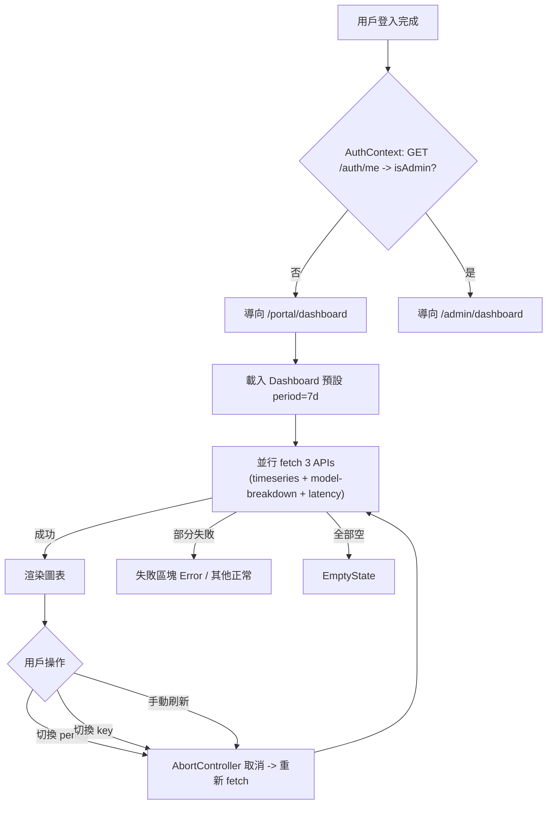
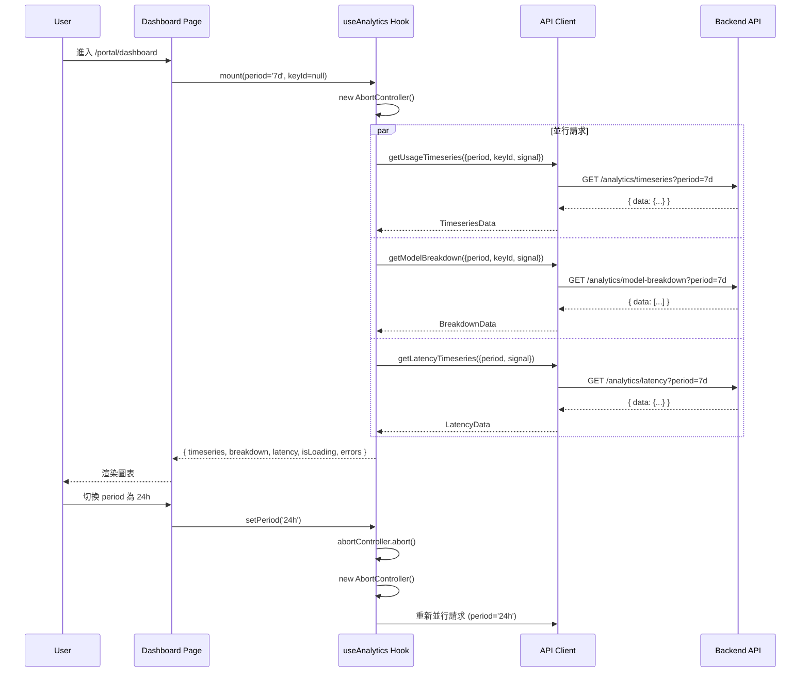
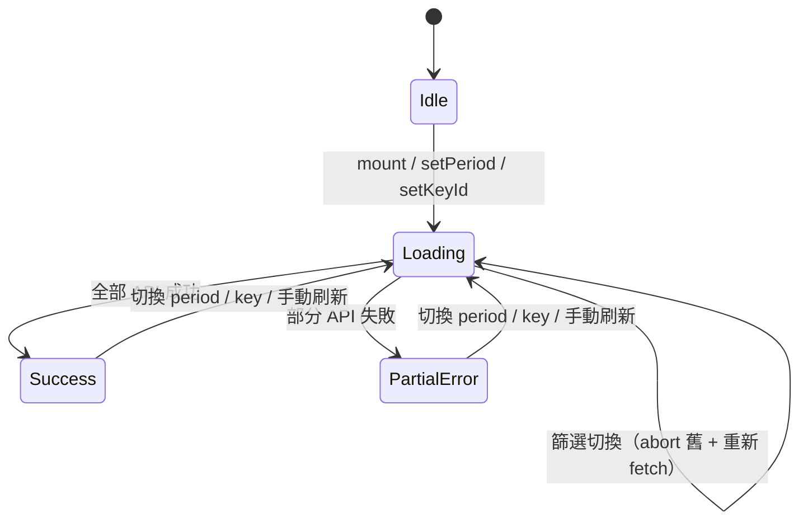

# Frontend Handoff: Analytics Dashboard

> **Target Audience**: Frontend UI developers
> **Source**: Extracted from S0 + S1, with frontend layered development guidance
> **Created**: 2026-03-15 17:00
> **S2 修正**: 2026-03-15 -- 統一 endpoint 路徑與 api_spec、統一角色偵測方案為 AuthContext + /auth/me

---

## 1. Feature Overview

為 Apiex 平台用戶與 Admin 建立可視化 Analytics Dashboard，整合至現有 `packages/web-admin`，依角色分流顯示用量趨勢、延遲監控、帳單費用等圖表。

**Design Mockup**: None（依 S0 brief_spec 的頁面結構描述實作）

**Related Documents**

| Document | Purpose |
|----------|---------|
| [`s0_brief_spec.md`](./s0_brief_spec.md) | Full requirements and success criteria |
| [`s1_api_spec.md`](./s1_api_spec.md) | API contract (Request/Response/Error Codes) |
| [`s1_dev_spec.md`](./s1_dev_spec.md) | Full technical specification |

---

## 2. User Flow

### 2.1 用戶 Dashboard Flow



### Main Flow

| Step | User Action | System Response | Frontend Responsibility |
|------|-------------|-----------------|------------------------|
| 1 | 登入 | AuthContext 呼叫 `GET /auth/me` 取得 `{ isAdmin }` 判斷角色 | `AuthContext.tsx` |
| 2 | 被重導至 /portal/dashboard | 載入 Dashboard，fetch 3 APIs | `portal/dashboard/page.tsx` |
| 3 | 切換 period (24h/7d/30d) | 取消舊請求，重新 fetch | `PeriodSelector` + AbortController |
| 4 | 切換 API Key | 取消舊請求，重新 fetch 帶 key_id | `KeySelector` + AbortController |
| 5 | 進入 /portal/billing | fetch billing API | `portal/billing/page.tsx` |

### Exception Flows

| Scenario | Trigger Condition | User Sees | Frontend Handling |
|----------|-------------------|-----------|-------------------|
| E1: 快速切換 | 連續觸發 period/key 切換 | 無閃爍，只顯示最新結果 | AbortController 取消，只處理最新 |
| E4: JWT 過期 | API 回傳 401 | Toast「Session 已過期」 | Toast，不強制跳轉 |
| E5: 新用戶無資料 | API 回傳空陣列 | EmptyState 元件 | 判斷 data.length === 0 |
| E7/E8: 查詢超時 | API 回傳 504 | Toast「查詢超時，請縮短時間範圍」 | 捕獲 504 狀態 |
| E10: 費率未設定 | billing cost = null | 「費率未設定，請聯絡管理員」 | 判斷 rates_available === false |
| E13: 離開頁面 | 用戶導航離開 | 無 memory leak | useEffect cleanup + AbortController.abort() |

---

## 3. API Spec Summary

> Full spec in [`s1_api_spec.md`](./s1_api_spec.md).

### Endpoint List

| Method | Path | Purpose | Frontend Call Trigger |
|--------|------|---------|----------------------|
| `GET` | `/auth/me` | 角色判斷 | AuthContext mount |
| `GET` | `/analytics/timeseries` | 用戶 token 用量時序 | Dashboard mount / period 切換 / key 切換 |
| `GET` | `/analytics/model-breakdown` | 用戶 model 分布 | Dashboard mount / period 切換 / key 切換 |
| `GET` | `/analytics/latency` | 用戶延遲趨勢 | Dashboard mount / period 切換 |
| `GET` | `/analytics/billing` | 用戶帳單摘要 | Billing 頁 mount |
| `GET` | `/admin/analytics/overview` | 全平台概覽 | Admin Analytics mount / period 切換 |
| `GET` | `/admin/analytics/timeseries` | 全平台時序 | Admin Analytics mount / period 切換 |
| `GET` | `/admin/analytics/latency` | 全平台延遲 | Admin Analytics mount / period 切換 |
| `GET` | `/admin/analytics/top-users` | 用戶排行 | Admin Analytics mount / period 切換 |
| `GET` | `/admin/rates` | 查詢費率 | Rates 頁 mount |
| `POST` | `/admin/rates` | 新增費率 | Rates 表單提交 |
| `PATCH` | `/admin/rates/:id` | 更新費率 | Rates 修改操作 |

### Key Response Fields

| Endpoint | Field | Type | Frontend Usage |
|----------|-------|------|----------------|
| `/analytics/billing` | `data.cost` | object \| null | null 時顯示 N/A |
| `/analytics/billing` | `data.quota.is_unlimited` | boolean | true 時顯示 "unlimited" |
| `/analytics/billing` | `data.recent_topups[].amount_usd` | number | 已轉為 USD（後端已除 100） |
| `/admin/analytics/top-users` | `data.rankings[].total_cost_usd` | number \| null | null 時顯示 N/A |

### Error Code Handling

| Error Code | HTTP Status | Frontend Display | Handling Approach |
|-----------|-------------|-----------------|-------------------|
| `INVALID_PERIOD` | 400 | 不應觸發（UI 限制選項） | 靜默處理 |
| `UNAUTHORIZED` | 401 | Toast「Session 已過期，請重新整理頁面」 | 不強制跳轉 |
| `FORBIDDEN` | 403 | 重導至 /portal/dashboard | AuthContext isAdmin = false |
| `QUERY_TIMEOUT` | 504 | Toast「查詢超時，請縮短時間範圍後重試」 | 提示用戶縮短 period |
| `INTERNAL_ERROR` | 500 | Toast「系統錯誤，請稍後再試」 | 靜默處理 |

---

## 4. Frontend Data Flow



---

## 5. Frontend Layered Development Guide

### 5.1 Data Layer (DTO / Types / API Service)

#### New TypeScript Types

```typescript
// packages/web-admin/src/lib/api.ts (新增)

// --- Analytics Types ---

export type Period = '24h' | '7d' | '30d';

export interface TimeseriesPoint {
  bucket: string;
  apex_smart_tokens: number;
  apex_cheap_tokens: number;
  apex_smart_requests: number;
  apex_cheap_requests: number;
  total_tokens: number;
  total_requests: number;
}

export interface TimeseriesMeta {
  period: Period;
  granularity: 'hour' | 'day';
  key_id: string | null;
  timezone: string;
}

export interface TimeseriesResponse {
  data: TimeseriesPoint[];
  meta: TimeseriesMeta;
}

export interface ModelBreakdownItem {
  model_tag: string;
  prompt_tokens: number;
  completion_tokens: number;
  total_tokens: number;
  request_count: number;
  percentage: number;
}

export interface ModelBreakdownResponse {
  data: ModelBreakdownItem[];
  meta: { period: Period; key_id: string | null; total_tokens: number };
}

export interface LatencyPoint {
  bucket: string;
  model_tag: string;
  p50: number;
  p95: number;
  p99: number;
  request_count: number;
}

export interface LatencyResponse {
  data: LatencyPoint[];
  meta: TimeseriesMeta;
}

export interface CostBreakdownItem {
  model_tag: string;
  prompt_tokens: number;
  completion_tokens: number;
  input_cost_usd: number;
  output_cost_usd: number;
  total_cost_usd: number;
}

export interface BillingSummaryResponse {
  data: {
    cost: {
      total_usd: number;
      breakdown: CostBreakdownItem[];
    } | null;
    quota: {
      total_quota_tokens: number;
      is_unlimited: boolean;
      estimated_days_remaining: number | null;
      daily_avg_consumption: number;
    };
    recent_topups: {
      id: string;
      amount_usd: number;
      tokens_granted: number;
      created_at: string;
    }[];
  };
}

// --- Admin Analytics Types ---

export interface AdminOverview {
  total_tokens: number;
  total_requests: number;
  avg_latency_ms: number;
  active_users: number;
  period: Period;
}

export interface AdminOverviewResponse {
  data: AdminOverview;
}

export interface UserRankingItem {
  user_id: string;
  email: string;
  total_tokens: number;
  total_requests: number;
  total_cost_usd: number | null;
}

export interface UserRankingResponse {
  data: {
    period: Period;
    rankings: UserRankingItem[];
  };
}

// --- Rates Types ---

export interface ModelRate {
  id: string;
  model_tag: string;
  input_rate_per_1k: number;
  output_rate_per_1k: number;
  effective_from: string;
  created_by: string;
  created_at: string;
}

export interface RatesResponse {
  data: ModelRate[];
}

export interface CreateRatePayload {
  model_tag: string;
  input_rate_per_1k: number;
  output_rate_per_1k: number;
}

export interface UpdateRatePayload {
  input_rate_per_1k: number;
  output_rate_per_1k: number;
}
```

#### API Service Changes

| Method | Change Type | Description |
|--------|------------|-------------|
| `makeAnalyticsApi(token)` | New | 封裝用戶端 4 個 analytics endpoints |
| `makeAdminAnalyticsApi(token)` | New | 封裝 admin 4 個 analytics endpoints |
| `makeRatesApi(token)` | New | 封裝 rates CRUD 3 個 endpoints |

```typescript
// packages/web-admin/src/lib/api.ts (新增)

export function makeAnalyticsApi(token: string) {
  return {
    getUsageTimeseries: (period: Period, keyId?: string, signal?: AbortSignal) => {
      const params = new URLSearchParams({ period });
      if (keyId) params.set('key_id', keyId);
      return apiGet<TimeseriesResponse>(`/analytics/timeseries?${params}`, token, signal);
    },
    getModelBreakdown: (period: Period, keyId?: string, signal?: AbortSignal) => {
      const params = new URLSearchParams({ period });
      if (keyId) params.set('key_id', keyId);
      return apiGet<ModelBreakdownResponse>(`/analytics/model-breakdown?${params}`, token, signal);
    },
    getLatencyTimeseries: (period: Period, keyId?: string, signal?: AbortSignal) => {
      const params = new URLSearchParams({ period });
      if (keyId) params.set('key_id', keyId);
      return apiGet<LatencyResponse>(`/analytics/latency?${params}`, token, signal);
    },
    getBillingSummary: (signal?: AbortSignal) =>
      apiGet<BillingSummaryResponse>('/analytics/billing', token, signal),
  };
}

export function makeAdminAnalyticsApi(token: string) {
  return {
    getOverview: (period: Period, signal?: AbortSignal) =>
      apiGet<AdminOverviewResponse>(`/admin/analytics/overview?period=${period}`, token, signal),
    getTimeseries: (period: Period, signal?: AbortSignal) =>
      apiGet<TimeseriesResponse>(`/admin/analytics/timeseries?period=${period}`, token, signal),
    getLatency: (period: Period, signal?: AbortSignal) =>
      apiGet<LatencyResponse>(`/admin/analytics/latency?period=${period}`, token, signal),
    getTopUsers: (period: Period, limit = 10, signal?: AbortSignal) =>
      apiGet<UserRankingResponse>(`/admin/analytics/top-users?period=${period}&limit=${limit}`, token, signal),
  };
}

export function makeRatesApi(token: string) {
  return {
    list: (signal?: AbortSignal) =>
      apiGet<RatesResponse>('/admin/rates', token, signal),
    create: (payload: CreateRatePayload) =>
      apiPost<{ data: ModelRate }>('/admin/rates', payload, token),
    update: (id: string, payload: UpdateRatePayload) =>
      apiPatch<{ data: ModelRate }>(`/admin/rates/${id}`, payload, token),
  };
}
```

**注意**：現有 `apiGet` 函數簽名需擴充以支援 `AbortSignal`（只有 GET 支援，mutation 不需要）：

```typescript
export async function apiGet<T>(path: string, token: string, signal?: AbortSignal): Promise<T> {
  const res = await fetch(`${API_BASE}${path}`, {
    headers: { Authorization: `Bearer ${token}` },
    signal,
  });
  return handleResponse<T>(res);
}
```

---

### 5.2 State Management Layer

本專案無獨立 state management library（無 Redux/Zustand）。使用 React hooks + Context 模式。

#### AuthContext

| Context | Scope | Creation Point | Description |
|---------|-------|----------------|-------------|
| `AuthContext` | App-level | Root layout mount | 提供 user, isAdmin, isLoading |

**States**

| State / Field | Type | Description | Trigger Condition |
|---------------|------|-------------|-------------------|
| `user` | User \| null | Supabase user | Auth state change |
| `isAdmin` | boolean | 是否為 admin | **GET /auth/me 回傳 isAdmin** |
| `isLoading` | boolean | 角色偵測中 | mount 到 /auth/me 回應完成 |

> **角色偵測方案**：AuthContext mount 時呼叫 `GET /auth/me`，取得 `{ isAdmin }` 判斷角色。不使用 probe `/admin/users` 方式。`/auth/me` 失敗時降級為 `isAdmin = false`。

#### Dashboard Custom Hook: useAnalytics

| State / Field | Type | Description |
|---------------|------|-------------|
| `timeseries` | TimeseriesPoint[] \| null | 時序資料 |
| `breakdown` | ModelBreakdownItem[] \| null | Model 分布 |
| `latency` | LatencyPoint[] \| null | 延遲資料 |
| `isLoading` | boolean | 任一請求進行中 |
| `errors` | Record<string, string \| null> | 各區塊錯誤 |
| `period` | Period | 目前選擇的時間範圍 |
| `keyId` | string \| null | 目前選擇的 key |



#### Error Handling Matrix

| Error Type | S0 ID | Trigger | UI Presentation | Recovery |
|------------|-------|---------|-----------------|----------|
| Timeout | E7/E8 | 504 response | Toast「查詢超時，請縮短時間範圍後重試」 | 用戶切換更短 period |
| Auth Expired | E4 | 401 response | Toast「Session 已過期，請重新整理頁面」 | 用戶重新整理 |
| Partial Failure | - | 個別 API 失敗 | 失敗區塊顯示 inline error，其他正常 | 手動刷新 |
| AbortError | E1/E13 | AbortController.abort() | 靜默忽略（不是真正的 error） | 自動（新請求取代） |

---

### 5.3 Presentation Layer (Pages / Components)

#### New Pages

| Page | Route | Change Type | Description |
|------|-------|-------------|-------------|
| UserDashboard | `/portal/dashboard` | New | 用戶 Analytics Dashboard：卡片 + 時序圖 + 分布圖 + 延遲圖 |
| UserBilling | `/portal/billing` | New | 用戶帳單：費用 + 充值記錄 + 配額 |
| AdminAnalytics | `/admin/analytics` | New | Admin Analytics：全平台趨勢 + 排行 + 延遲 |
| AdminRates | `/admin/settings/rates` | New | Admin 費率管理：列表 + 新增表單 |

#### Modified Pages/Components

| Component | File | Change Type | Description |
|-----------|------|-------------|-------------|
| `AppLayout` | `src/components/AppLayout.tsx` | Modified | sidebar navItems 新增 Analytics + Settings |
| `PortalLayout` | `src/app/portal/layout.tsx` | Modified | navbar navItems 新增 Dashboard + 帳單 |
| `middleware` | `src/middleware.ts` | Modified | 維持現有行為（Supabase auth check），不新增 server-side role check |

#### New Shared Components

| Component | File | Description | Props |
|-----------|------|-------------|-------|
| `TimeseriesAreaChart` | `src/components/charts/TimeseriesAreaChart.tsx` | 時序面積圖（多線） | `data`, `series[]`, `xKey`, `height?` |
| `LatencyLineChart` | `src/components/charts/LatencyLineChart.tsx` | 延遲折線圖 | `data`, `models[]`, `height?` |
| `DonutChart` | `src/components/charts/DonutChart.tsx` | 圓環分布圖 | `data[]`, `nameKey`, `valueKey`, `height?` |
| `StatsCard` | `src/components/analytics/StatsCard.tsx` | 總覽數字卡片 | `title`, `value`, `unit?`, `delta?`, `loading?` |
| `PeriodSelector` | `src/components/analytics/PeriodSelector.tsx` | 時間範圍選擇器 | `value: Period`, `onChange(p: Period)` |
| `KeySelector` | `src/components/analytics/KeySelector.tsx` | API Key 選擇器 | `keys: ApiKey[]`, `value`, `onChange(id)` |
| `EmptyState` | `src/components/analytics/EmptyState.tsx` | 空資料狀態 | `message`, `icon?` |
| `LoadingSkeleton` | `src/components/analytics/LoadingSkeleton.tsx` | 骨架屏 | `type: 'chart' \| 'card' \| 'table'` |

#### UI Behavior Rules

| Element | Condition | Behavior | Notes |
|---------|-----------|----------|-------|
| PeriodSelector | 請求進行中 | enabled（可切換，觸發 abort） | 不 disable，允許快速切換 |
| KeySelector | keys.length <= 1 | hidden | 單 key 用戶不顯示選擇器 |
| 手動刷新按鈕 | 請求進行中 | disabled + spinning | 防止重複觸發 |
| 費用金額 | cost === null | 顯示 N/A + 灰色提示 | 不隱藏，明確告知原因 |
| 剩餘天數 | is_unlimited === true | 顯示 "Unlimited" | 不顯示數字 |
| 充值金額 | 原始 amount_usd | 直接顯示（後端已轉為 USD） | 前端不需再除 100 |

#### Loading / Error States

| State | UI Presentation | Description |
|-------|----------------|-------------|
| Loading | `LoadingSkeleton` (chart/card/table variants) | 各區塊獨立 skeleton |
| Error (per-section) | Inline error card with retry button | 「載入失敗」+ 重試按鈕 |
| Error (全域) | Toast notification | 超時、auth 失效等 |
| Empty | `EmptyState` 元件 | 「開始使用 API 後將顯示數據」 |

---

## 6. Frontend Task List

| # | Task | Layer | Complexity | Dependencies | Wave |
|---|------|-------|------------|--------------|------|
| T09 | 圖表庫安裝 + 共用元件（8 個） | Presentation | M | - | W2 |
| T10 | API clients + TypeScript 型別 | Data | S | - | W2 |
| T11 | AuthContext 角色偵測（/auth/me）+ 路由分流 | State | M | - | W2 |
| T12 | Layout sidebar/navbar 更新 | Presentation | S | T11 | W3 |
| T13 | 用戶 Dashboard 頁面 | Presentation + State | L | T07, T09, T10, T11 | W4 |
| T14 | 用戶帳單頁面 | Presentation + State | M | T07, T09, T10 | W4 |
| T15 | Admin Analytics 頁面 | Presentation + State | L | T08, T09, T10, T11 | W4 |
| T16 | Admin 費率設定頁面 | Presentation + State | M | T02, T09, T10 | W4 |
| T18 | 前端 E2E 驗收 | Test | M | T13-T16 | W5 |

---

## 7. Frontend Acceptance Criteria

| # | Scenario | Given | When | Then | Priority |
|---|----------|-------|------|------|----------|
| AC-1 | 用戶 7d 用量趨勢 | 用戶有近 7 天 usage | 進入 /portal/dashboard | AreaChart 顯示 7 天 daily token | P0 |
| AC-2 | 切換 24h | 在 Dashboard 頁 | 點擊 24h | 圖表更新為 24 小時點 | P0 |
| AC-3 | Key 篩選 | 2+ active keys | 選擇特定 key | 所有圖表只顯示該 key 資料 | P0 |
| AC-5 | 空狀態 | 新用戶 0 usage | 進入 Dashboard | EmptyState，無報錯 | P0 |
| AC-6 | 帳單（有費率） | 費率已設定 | 進入 /portal/billing | 顯示 $X.XX USD | P0 |
| AC-7 | 帳單（無費率） | 費率未設定 | 進入 /portal/billing | 顯示 N/A + 提示 | P0 |
| AC-8 | Admin 趨勢 | 多用戶 usage | Admin 進入 /admin/analytics | 全平台趨勢 + 排行 + 延遲 | P0 |
| AC-14 | Loading skeleton | 網路延遲 | 載入中 | 骨架畫面顯示 | P1 |
| AC-15 | 快速切換 | 在 Dashboard | 快速連點 period | 無閃爍 | P0 |

---

## 8. Conventions and Constraints

### Design System

- 使用現有 Tailwind CSS v4 + clsx + tailwind-merge 樣式系統
- 顏色使用 Tailwind 內建色票（如 `text-gray-900`），不使用 hardcoded 色值
- 圖表色彩方案：apex-smart = 藍色系（`blue-500`/`blue-400`/`blue-300`），apex-cheap = 橘色系（`orange-500`/`orange-400`/`orange-300`）
- Dialog 使用現有 `@radix-ui/react-dialog`
- Select 使用現有 `@radix-ui/react-select`

### Network Layer

- 使用 `api.ts` 的 `apiGet`/`apiPost`/`apiPatch` 封裝
- JWT token 從 Supabase session 取得（`supabase.auth.getSession()`）
- GET 請求必須傳入 `AbortSignal`
- mutation（POST/PATCH）不傳入 AbortSignal
- 不直接呼叫 `fetch()`

### Feature-Specific Constraints

- 所有時間顯示標注 UTC（前端不做時區轉換）
- 圖表庫只用 `recharts`（不引入 Tremor）
- 費率金額顯示 6 位小數（如 `$0.100000`）
- 充值金額顯示 2 位小數（如 `$10.00`，後端已轉為 USD）
- Dashboard 不做自動輪詢，提供手動刷新按鈕

---

## 9. Mock Data Spec

> Mock data 用於純 UI 開發，不需要後端即可展示所有畫面狀態。

### 9.1 Model Mock Factory

| Factory Method | Return Type | Description |
|----------------|------------|-------------|
| `makeTimeseriesData(period, opts?)` | `TimeseriesPoint[]` | 生成指定 period 的假時序資料 |
| `makeBreakdownData()` | `ModelBreakdownItem[]` | 生成兩個 model 的分布資料 |
| `makeLatencyData(period, opts?)` | `LatencyPoint[]` | 生成延遲 percentile 假資料 |
| `makeBillingSummary(opts?)` | `BillingSummaryResponse['data']` | 生成帳單摘要 |
| `makeAdminOverview(opts?)` | `AdminOverview` | 生成 admin 概覽 |
| `makeUserRanking(count?)` | `UserRankingItem[]` | 生成 N 個用戶排行 |
| `makeRates()` | `ModelRate[]` | 生成費率列表 |

```typescript
// packages/web-admin/src/lib/mock-analytics.ts

export function makeTimeseriesData(period: Period = '7d'): TimeseriesPoint[] {
  const points = period === '24h' ? 24 : period === '7d' ? 7 : 30;
  const now = new Date();
  return Array.from({ length: points }, (_, i) => {
    const d = new Date(now);
    if (period === '24h') d.setHours(d.getHours() - (points - 1 - i));
    else d.setDate(d.getDate() - (points - 1 - i));
    return {
      bucket: d.toISOString(),
      apex_smart_tokens: Math.floor(Math.random() * 20000) + 5000,
      apex_cheap_tokens: Math.floor(Math.random() * 15000) + 3000,
      apex_smart_requests: Math.floor(Math.random() * 50) + 10,
      apex_cheap_requests: Math.floor(Math.random() * 100) + 20,
      total_tokens: 0, // computed below
      total_requests: 0,
    };
  }).map(p => ({
    ...p,
    total_tokens: p.apex_smart_tokens + p.apex_cheap_tokens,
    total_requests: p.apex_smart_requests + p.apex_cheap_requests,
  }));
}

export function makeBreakdownData(): ModelBreakdownItem[] {
  return [
    { model_tag: 'apex-smart', prompt_tokens: 80000, completion_tokens: 40000, total_tokens: 120000, request_count: 150, percentage: 65.2 },
    { model_tag: 'apex-cheap', prompt_tokens: 45000, completion_tokens: 19000, total_tokens: 64000, request_count: 320, percentage: 34.8 },
  ];
}

export function makeBillingSummary(opts: { ratesAvailable?: boolean } = {}): BillingSummaryResponse['data'] {
  const ratesAvailable = opts.ratesAvailable ?? true;
  return {
    cost: ratesAvailable ? {
      total_usd: 12.45,
      breakdown: [
        { model_tag: 'apex-smart', prompt_tokens: 80000, completion_tokens: 40000, input_cost_usd: 8.00, output_cost_usd: 4.00, total_cost_usd: 12.00 },
        { model_tag: 'apex-cheap', prompt_tokens: 45000, completion_tokens: 19000, input_cost_usd: 0.27, output_cost_usd: 0.18, total_cost_usd: 0.45 },
      ],
    } : null,
    quota: {
      total_quota_tokens: 1000000,
      is_unlimited: false,
      estimated_days_remaining: 14.2,
      daily_avg_consumption: 60000,
    },
    recent_topups: [
      { id: 'mock-1', amount_usd: 10.00, tokens_granted: 1000000, created_at: '2026-03-10T08:30:00Z' },
      { id: 'mock-2', amount_usd: 5.00, tokens_granted: 500000, created_at: '2026-03-05T14:20:00Z' },
    ],
  };
}
```

### 9.2 Scenario Data

| Scenario ID | Description | Data | Corresponding AC | UI State |
|-------------|-------------|------|-------------------|----------|
| S-1 | 正常 7d Dashboard | `makeTimeseriesData('7d')` + `makeBreakdownData()` | AC-1 | Success |
| S-2 | 24h Dashboard | `makeTimeseriesData('24h')` | AC-2 | Success |
| S-3 | 新用戶空狀態 | `[]` (empty arrays) | AC-5 | Empty |
| S-4 | 帳單（有費率） | `makeBillingSummary()` | AC-6 | Success |
| S-5 | 帳單（無費率） | `makeBillingSummary({ ratesAvailable: false })` | AC-7 | Success (N/A) |
| S-6 | Admin 概覽 | `makeAdminOverview()` + `makeUserRanking()` | AC-8 | Success |
| S-7 | Loading 狀態 | N/A（isLoading = true） | AC-14 | Loading |

### 9.3 Edge Cases

| Case | Data Characteristics | Expected UI Behavior |
|------|---------------------|----------------------|
| 超長 email | `email: 'a'.repeat(80) + '@example.com'` | 排行表格截斷 + tooltip |
| 單 key 用戶 | `keys: [single]` | KeySelector 隱藏 |
| unlimited 配額 | `quota.is_unlimited: true` | 顯示 "Unlimited"，天數隱藏 |
| 0 消耗 | `daily_avg_consumption: 0` | 天數顯示 N/A（避免除以 0） |
| 費率 0 筆 | `rates: []` | 費率表顯示空提示 + 新增表單可見 |

---

## 10. Division of Labor

### 10.1 Pure UI Tasks (Using Mock Data, no backend required)

| # | Corresponding Task | Component / Page | Input (Props) | Output (Callbacks) | Mock Scenario |
|---|-------------------|-----------------|---------------|-------------------|---------------|
| U1 | T09 | `TimeseriesAreaChart` | `data: TimeseriesPoint[]`, `series`, `xKey` | - | S-1, S-2 |
| U2 | T09 | `LatencyLineChart` | `data: LatencyPoint[]`, `models` | - | S-1 |
| U3 | T09 | `DonutChart` | `data`, `nameKey`, `valueKey` | - | S-1 |
| U4 | T09 | `StatsCard` | `title`, `value`, `unit`, `loading` | - | S-1, S-7 |
| U5 | T09 | `PeriodSelector` | `value`, `onChange` | `onChange(period)` | - |
| U6 | T09 | `KeySelector` | `keys`, `value`, `onChange` | `onChange(keyId)` | - |
| U7 | T09 | `EmptyState` | `message` | - | S-3 |
| U8 | T09 | `LoadingSkeleton` | `type` | - | S-7 |
| U9 | T13 | `UserDashboard page` | mock data via hooks | period/key callbacks | S-1~S-3, S-7 |
| U10 | T14 | `UserBilling page` | mock billing data | - | S-4, S-5 |
| U11 | T15 | `AdminAnalytics page` | mock admin data | period callback | S-6, S-7 |
| U12 | T16 | `AdminRates page` | mock rates data | create/update callbacks | - |

**Delivery Criteria**:
- Component accepts props and displays correct UI
- All callbacks use no-op placeholders (integrator replaces them)
- All states can be independently demonstrated using Section 9 Mock Data
- `npm run build` passes

### 10.2 Logic Integration Tasks (Requires backend API)

| # | Integration Point | Corresponding UI Task | Integration Content |
|---|-------------------|----------------------|---------------------|
| I1 | `useAnalytics` hook | U9 | Replace mock with live API + AbortController |
| I2 | `useBilling` hook | U10 | Replace mock with billing API |
| I3 | `useAdminAnalytics` hook | U11 | Replace mock with admin analytics APIs |
| I4 | `useRates` hook | U12 | Replace mock with rates CRUD API |
| I5 | `AuthContext` | All pages | Role detection via GET /auth/me |

### 10.3 Component Callback Contract

| Component | Props (Input) | Callbacks (Output) | Description |
|-----------|--------------|-------------------|-------------|
| `PeriodSelector` | `value: Period` | `onChange: (p: Period) => void` | 時間範圍切換 |
| `KeySelector` | `keys: ApiKey[], value: string \| null` | `onChange: (id: string \| null) => void` | Key 篩選切換（null = 全部） |
| `AdminRatesPage` | `rates: ModelRate[]` | `onCreate: (p: CreateRatePayload) => void, onUpdate: (id: string, p: UpdateRatePayload) => void` | 費率 CRUD |
