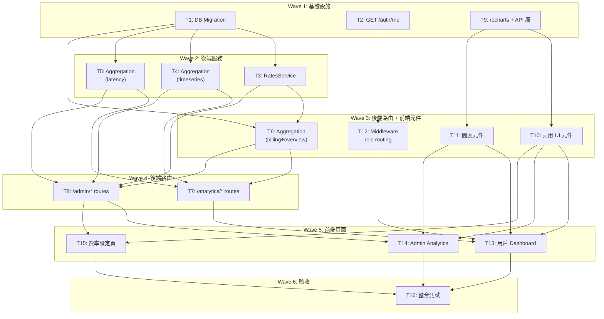

# S3 Implementation Plan: Analytics Dashboard

> **階段**: S3 實作計畫
> **建立時間**: 2026-03-15 16:30
> **Agents**: db-expert, backend-expert, frontend-expert, test-engineer

---

## 1. 概述

### 1.1 功能目標

為 Apiex 平台用戶與 Admin 建立 Analytics Dashboard，涵蓋 token 用量趨勢、model 分布、延遲監控（p50/p95/p99）、帳單費用換算、費率管理。

### 1.2 實作範圍

- **範圍內**: model_rates 表、11 個 API endpoints、3 個前端頁面、middleware role 分流、Recharts 圖表元件
- **範圍外**: Realtime、資料匯出、告警系統、物化視圖

### 1.3 關聯文件

| 文件 | 路徑 | 狀態 |
|------|------|------|
| Brief Spec | `./s0_brief_spec.md` | Done |
| Dev Spec | `./s1_dev_spec.md` | Done |
| API Spec | `./s1_api_spec.md` | Done |
| Implementation Plan | `./s3_implementation_plan.md` | Current |

---

## 2. 實作任務清單

### 2.1 任務總覽

| # | 任務 | 類型 | Agent | 依賴 | 複雜度 | source_ref | TDD | 狀態 |
|---|------|------|-------|------|--------|------------|-----|------|
| 1 | DB migration: model_rates + usage_logs index + types | 資料層 | `db-expert` | - | S | FA-D4 | N/A | Pending |
| 2 | GET /auth/me endpoint | 後端 | `backend-expert` | - | S | - | Yes | Pending |
| 3 | RatesService: model_rates CRUD | 後端 | `backend-expert` | #1 | S | FA-D4 | Yes | Pending |
| 4 | AggregationService: timeseries + model-breakdown | 後端 | `backend-expert` | #1 | M | FA-D3 | Yes | Pending |
| 5 | AggregationService: latency percentile | 後端 | `backend-expert` | #1 | M | FA-D3 | Yes | Pending |
| 6 | AggregationService: billing + overview + top-users | 後端 | `backend-expert` | #1, #3 | L | FA-D3 | Yes | Pending |
| 7 | 用戶 analytics 路由 (/analytics/*) | 後端 | `backend-expert` | #4, #5, #6 | M | FA-D3 | Yes | Pending |
| 8 | Admin analytics + rates 路由 | 後端 | `backend-expert` | #3, #4, #5, #6 | M | FA-D3/D4 | Yes | Pending |
| 9 | 安裝 recharts + 前端 API 層 | 前端 | `frontend-expert` | - | S | - | N/A | Pending |
| 10 | 共用 UI 元件 | 前端 | `frontend-expert` | #9 | M | FA-D1/D2 | N/A | Pending |
| 11 | 圖表元件 | 前端 | `frontend-expert` | #9 | M | FA-D1/D2 | N/A | Pending |
| 12 | Middleware role-based 路由分流 | 前端 | `frontend-expert` | #2 | M | - | N/A | Pending |
| 13 | 用戶 Dashboard 頁面 + portal layout | 前端 | `frontend-expert` | #7, #10, #11, #12 | L | FA-D1 | N/A | Pending |
| 14 | Admin Analytics 頁面 + AppLayout | 前端 | `frontend-expert` | #8, #10, #11 | L | FA-D2 | N/A | Pending |
| 15 | Admin 費率設定頁面 | 前端 | `frontend-expert` | #8, #10 | M | FA-D4 | N/A | Pending |
| 16 | 整合測試 + 驗收 | 測試 | `test-engineer` | #13, #14, #15 | M | - | N/A | Pending |

**狀態圖例**：Pending / In Progress / Completed / Blocked / Skipped

**TDD**: Yes = 有測試先行計畫，N/A = 純 UI/Migration/Config 無可測邏輯

---

## 3. 任務詳情

### Task #1: DB migration -- model_rates + usage_logs index + types

**基本資訊**

| 項目 | 內容 |
|------|------|
| 類型 | 資料層 |
| Agent | `db-expert` |
| 複雜度 | S |
| 依賴 | - |
| source_ref | FA-D4 |
| 狀態 | Pending |

**描述**

新增 `supabase/migrations/008_analytics.sql`。建立 model_rates 表、兩個 index、RLS policy。更新 `database.types.ts`。

**受影響檔案**

| 檔案 | 變更類型 | 說明 |
|------|---------|------|
| `supabase/migrations/008_analytics.sql` | 新增 | model_rates 表 + indexes |
| `packages/api-server/src/lib/database.types.ts` | 修改 | 新增 ModelRate 型別 |

**DoD**

- [ ] model_rates 表建立（id UUID PK, model_tag TEXT, input_rate_per_1k NUMERIC(10,6), output_rate_per_1k NUMERIC(10,6), effective_from TIMESTAMPTZ, created_at TIMESTAMPTZ）
- [ ] idx_model_rates_tag_effective (model_tag, effective_from DESC)
- [ ] idx_usage_logs_api_key_created (api_key_id, created_at DESC) -- IF NOT EXISTS
- [ ] RLS enabled + service role policy
- [ ] database.types.ts 新增 ModelRate / ModelRateInsert / Database.model_rates

**TDD Plan**: N/A -- Migration SQL，無可執行測試

**驗證方式**
```bash
# SQL 語法驗證
cat supabase/migrations/008_analytics.sql
# TypeScript 編譯驗證
cd packages/api-server && npx tsc --noEmit
```

---

### Task #2: GET /auth/me endpoint

**基本資訊**

| 項目 | 內容 |
|------|------|
| 類型 | 後端 |
| Agent | `backend-expert` |
| 複雜度 | S |
| 依賴 | - |
| 狀態 | Pending |

**描述**

在 `routes/auth.ts` 新增 GET /me。使用 supabaseJwtAuth middleware。回傳 { data: { id, email, isAdmin } }。isAdmin 判斷需從 adminAuth.ts 抽出 ADMIN_EMAILS 檢查邏輯為共用 helper（如 `lib/isAdmin.ts`），避免重複。需在 index.ts 確認 /auth 路由群已掛載 supabaseJwtAuth（目前 auth routes 無 auth middleware -- 需在 /auth/me 子路由單獨掛載）。

**受影響檔案**

| 檔案 | 變更類型 | 說明 |
|------|---------|------|
| `packages/api-server/src/routes/auth.ts` | 修改 | 新增 GET /me |
| `packages/api-server/src/lib/isAdmin.ts` | 新增 | 共用 ADMIN_EMAILS 檢查 |
| `packages/api-server/src/middleware/adminAuth.ts` | 修改 | 引用共用 isAdmin |

**DoD**

- [ ] GET /auth/me 回傳 { data: { id, email, isAdmin } }
- [ ] isAdmin 邏輯與 adminAuth 一致
- [ ] 無 JWT 回傳 401
- [ ] 單元測試：admin email / non-admin / no auth

**TDD Plan**

| 項目 | 內容 |
|------|------|
| 測試檔案 | `packages/api-server/src/routes/__tests__/auth.test.ts` |
| 測試指令 | `cd packages/api-server && npx vitest run src/routes/__tests__/auth.test.ts` |
| 預期測試案例 | should_return_user_with_isAdmin_true, should_return_user_with_isAdmin_false, should_return_401_without_token |

**驗證方式**
```bash
cd packages/api-server && npx vitest run src/routes/__tests__/auth.test.ts
```

---

### Task #3: RatesService -- model_rates CRUD

**基本資訊**

| 項目 | 內容 |
|------|------|
| 類型 | 後端 |
| Agent | `backend-expert` |
| 複雜度 | S |
| 依賴 | Task #1 |
| 狀態 | Pending |

**描述**

新增 `services/RatesService.ts`。方法：listRates(), createRate(data), updateRate(id, data), getEffectiveRate(modelTag, asOfDate)。

**受影響檔案**

| 檔案 | 變更類型 | 說明 |
|------|---------|------|
| `packages/api-server/src/services/RatesService.ts` | 新增 | CRUD + 歷史費率查詢 |

**DoD**

- [ ] listRates 按 model_tag 分組、effective_from DESC
- [ ] createRate 插入，effective_from 預設 now()
- [ ] updateRate 正確更新指定 ID
- [ ] getEffectiveRate 回傳 effective_from <= asOfDate 最新一筆
- [ ] 單元測試

**TDD Plan**

| 項目 | 內容 |
|------|------|
| 測試檔案 | `packages/api-server/src/services/__tests__/RatesService.test.ts` |
| 測試指令 | `cd packages/api-server && npx vitest run src/services/__tests__/RatesService.test.ts` |
| 預期測試案例 | should_list_rates_sorted, should_create_rate, should_update_rate, should_get_effective_rate_at_date, should_return_null_when_no_rate |

---

### Task #4: AggregationService -- timeseries + model-breakdown

**基本資訊**

| 項目 | 內容 |
|------|------|
| 類型 | 後端 |
| Agent | `backend-expert` |
| 複雜度 | M |
| 依賴 | Task #1 |
| 狀態 | Pending |

**描述**

新增 `services/AggregationService.ts`。getTimeseries(params) + getModelBreakdown(params)。usage_logs 無 user_id，per-user 查詢需先取 api_keys.id WHERE user_id，再 IN 查詢。參考 admin.ts 既有模式（先查 keyIds 再 IN）。

**受影響檔案**

| 檔案 | 變更類型 | 說明 |
|------|---------|------|
| `packages/api-server/src/services/AggregationService.ts` | 新增 | 聚合邏輯 |

**DoD**

- [ ] getTimeseries 回傳正確時序（model_tag 分欄）
- [ ] getModelBreakdown 回傳分布百分比
- [ ] per-user 模式：先查 keyIds 再 IN
- [ ] per-key 模式：直接 WHERE api_key_id =
- [ ] 全平台模式：不過濾
- [ ] 自動粒度：24h->hour, 7d/30d->day
- [ ] parameterized SQL

**TDD Plan**

| 項目 | 內容 |
|------|------|
| 測試檔案 | `packages/api-server/src/services/__tests__/AggregationService.test.ts` |
| 測試指令 | `cd packages/api-server && npx vitest run src/services/__tests__/AggregationService.test.ts` |
| 預期測試案例 | should_return_daily_timeseries_for_7d, should_return_hourly_for_24h, should_filter_by_key_id, should_return_model_breakdown_percentages |

---

### Task #5: AggregationService -- latency percentile

**基本資訊**

| 項目 | 內容 |
|------|------|
| 類型 | 後端 |
| Agent | `backend-expert` |
| 複雜度 | M |
| 依賴 | Task #1 |
| 狀態 | Pending |

**描述**

在 AggregationService 新增 getLatencyTimeseries()。PERCENTILE_CONT(0.50/0.95/0.99) + GROUP BY DATE_TRUNC + model_tag。只計算 status='success'。

**受影響檔案**

| 檔案 | 變更類型 | 說明 |
|------|---------|------|
| `packages/api-server/src/services/AggregationService.ts` | 修改 | 新增 latency 方法 |

**DoD**

- [ ] p50/p95/p99 按 model_tag 分組的時序
- [ ] 過濾 status='success'
- [ ] per-user / 全平台模式
- [ ] 10 秒 statement_timeout
- [ ] 單元測試

**TDD Plan**

| 項目 | 內容 |
|------|------|
| 測試檔案 | `packages/api-server/src/services/__tests__/AggregationService.test.ts` |
| 測試指令 | `cd packages/api-server && npx vitest run src/services/__tests__/AggregationService.test.ts` |
| 預期測試案例 | should_return_latency_percentiles_by_model, should_filter_only_success_status |

---

### Task #6: AggregationService -- billing + overview + top-users

**基本資訊**

| 項目 | 內容 |
|------|------|
| 類型 | 後端 |
| Agent | `backend-expert` |
| 複雜度 | L |
| 依賴 | Task #1, #3 |
| 狀態 | Pending |

**描述**

三個方法。getBillingSummary：用量費用換算（歷史費率），topup_logs 充值（最近 5 筆），配額剩餘。getOverview：全平台彙總。getTopUsers：排行（需取 email，可用 supabaseAdmin.auth.admin.listUsers 或 JOIN admin_list_users RPC）。

**受影響檔案**

| 檔案 | 變更類型 | 說明 |
|------|---------|------|
| `packages/api-server/src/services/AggregationService.ts` | 修改 | 新增 3 個方法 |

**DoD**

- [ ] getBillingSummary 費用用歷史費率計算
- [ ] 費率未設定時 cost = null
- [ ] 充值記錄最近 5 筆
- [ ] 配額：SUM(active keys quota_tokens)，-1 = unlimited
- [ ] 剩餘天數 = remaining / daily_avg
- [ ] getOverview 全平台彙總正確
- [ ] getTopUsers 含 email + tokens + requests + cost
- [ ] 單元測試

**TDD Plan**

| 項目 | 內容 |
|------|------|
| 測試檔案 | `packages/api-server/src/services/__tests__/AggregationService.test.ts` |
| 測試指令 | `cd packages/api-server && npx vitest run src/services/__tests__/AggregationService.test.ts` |
| 預期測試案例 | should_calculate_billing_with_historical_rates, should_return_null_cost_when_no_rates, should_return_platform_overview, should_return_top_users_ranking |

---

### Task #7: 用戶 analytics 路由 (/analytics/*)

**基本資訊**

| 項目 | 內容 |
|------|------|
| 類型 | 後端 |
| Agent | `backend-expert` |
| 複雜度 | M |
| 依賴 | Task #4, #5, #6 |
| 狀態 | Pending |

**描述**

新增 `routes/analytics.ts`。4 個 GET：timeseries, model-breakdown, latency, billing。掛載在 index.ts（supabaseJwtAuth）。key_id 驗證須確認 key 屬於當前 user。

**受影響檔案**

| 檔案 | 變更類型 | 說明 |
|------|---------|------|
| `packages/api-server/src/routes/analytics.ts` | 新增 | 4 個 GET endpoints |
| `packages/api-server/src/index.ts` | 修改 | 掛載 /analytics 路由群 |

**DoD**

- [ ] 4 個 GET endpoints 正確回應
- [ ] period 驗證（只接受 24h/7d/30d）
- [ ] key_id 驗證（屬於當前用戶）
- [ ] 回應 { data: T }
- [ ] index.ts 掛載 supabaseJwtAuth

**TDD Plan**

| 項目 | 內容 |
|------|------|
| 測試檔案 | `packages/api-server/src/routes/__tests__/analytics.test.ts` |
| 測試指令 | `cd packages/api-server && npx vitest run src/routes/__tests__/analytics.test.ts` |
| 預期測試案例 | should_return_timeseries, should_reject_invalid_period, should_reject_key_not_owned |

---

### Task #8: Admin analytics + rates 路由

**基本資訊**

| 項目 | 內容 |
|------|------|
| 類型 | 後端 |
| Agent | `backend-expert` |
| 複雜度 | M |
| 依賴 | Task #3, #4, #5, #6 |
| 狀態 | Pending |

**描述**

在 `routes/admin.ts` 追加 6 個 endpoints（3 analytics GET + 3 rates CRUD）。追加在現有路由後方，不影響既有路由。

**受影響檔案**

| 檔案 | 變更類型 | 說明 |
|------|---------|------|
| `packages/api-server/src/routes/admin.ts` | 修改 | 追加 6 個 endpoints |

**DoD**

- [ ] 3 個 GET admin analytics endpoints
- [ ] GET/POST/PATCH rates endpoints
- [ ] POST 驗證必填欄位
- [ ] PATCH 驗證記錄存在
- [ ] 現有路由不受影響

**TDD Plan**

| 項目 | 內容 |
|------|------|
| 測試檔案 | `packages/api-server/src/routes/__tests__/admin.test.ts` |
| 測試指令 | `cd packages/api-server && npx vitest run src/routes/__tests__/admin.test.ts` |
| 預期測試案例 | should_return_overview, should_create_rate, should_reject_missing_fields, should_return_404_for_nonexistent_rate |

---

### Task #9: 安裝 recharts + 前端 API 層

**基本資訊**

| 項目 | 內容 |
|------|------|
| 類型 | 前端 |
| Agent | `frontend-expert` |
| 複雜度 | S |
| 依賴 | - |
| 狀態 | Pending |

**描述**

安裝 recharts。在 api.ts 新增 makeAnalyticsApi, makeAdminAnalyticsApi, makeRatesApi + 型別定義。apiGet/apiPost/apiPatch 需擴展支援 AbortSignal。

**受影響檔案**

| 檔案 | 變更類型 | 說明 |
|------|---------|------|
| `packages/web-admin/package.json` | 修改 | 新增 recharts |
| `packages/web-admin/src/lib/api.ts` | 修改 | 新增 3 工廠函式 + 型別 |

**DoD**

- [ ] recharts 在 dependencies
- [ ] 3 個工廠函式完整
- [ ] AbortSignal 支援
- [ ] TypeScript 型別完整
- [ ] tsc --noEmit 無錯

**TDD Plan**: N/A -- 型別定義 + 配置，tsc 驗證

---

### Task #10: 共用 UI 元件

**基本資訊**

| 項目 | 內容 |
|------|------|
| 類型 | 前端 |
| Agent | `frontend-expert` |
| 複雜度 | M |
| 依賴 | Task #9 |
| 狀態 | Pending |

**描述**

5 個元件：StatsCard, PeriodSelector, KeySelector, EmptyState, LoadingSkeleton。使用 Tailwind v4 + Radix Select + lucide icons。

**受影響檔案**

| 檔案 | 變更類型 | 說明 |
|------|---------|------|
| `packages/web-admin/src/components/analytics/StatsCard.tsx` | 新增 | 統計卡片 |
| `packages/web-admin/src/components/analytics/PeriodSelector.tsx` | 新增 | 時間篩選 |
| `packages/web-admin/src/components/analytics/KeySelector.tsx` | 新增 | Key 篩選 |
| `packages/web-admin/src/components/analytics/EmptyState.tsx` | 新增 | 空狀態 |
| `packages/web-admin/src/components/analytics/LoadingSkeleton.tsx` | 新增 | 骨架屏 |

**DoD**

- [ ] 5 個元件 props 型別完整
- [ ] Tailwind v4 樣式
- [ ] Radix Select for KeySelector
- [ ] tsc --noEmit 無錯

**TDD Plan**: N/A -- 純 UI 元件

---

### Task #11: 圖表元件

**基本資訊**

| 項目 | 內容 |
|------|------|
| 類型 | 前端 |
| Agent | `frontend-expert` |
| 複雜度 | M |
| 依賴 | Task #9 |
| 狀態 | Pending |

**描述**

3 個 Recharts 元件：TimeseriesAreaChart, LatencyLineChart, DonutChart。ResponsiveContainer + tooltip + legend。

**受影響檔案**

| 檔案 | 變更類型 | 說明 |
|------|---------|------|
| `packages/web-admin/src/components/charts/TimeseriesAreaChart.tsx` | 新增 | AreaChart |
| `packages/web-admin/src/components/charts/LatencyLineChart.tsx` | 新增 | 延遲折線 |
| `packages/web-admin/src/components/charts/DonutChart.tsx` | 新增 | 圓環圖 |

**DoD**

- [ ] 3 個元件 responsive + tooltip + legend
- [ ] TimeseriesAreaChart 多 series 支援
- [ ] LatencyLineChart 多 model 分色
- [ ] DonutChart 比例標籤
- [ ] 空資料 fallback
- [ ] tsc --noEmit

**TDD Plan**: N/A -- 純 UI 元件

---

### Task #12: Middleware role-based 路由分流

**基本資訊**

| 項目 | 內容 |
|------|------|
| 類型 | 前端 |
| Agent | `frontend-expert` |
| 複雜度 | M |
| 依賴 | Task #2 |
| 狀態 | Pending |

**描述**

修改 middleware.ts。登入成功後 server-side fetch `/auth/me` 判斷 isAdmin，分流重導向。非 Admin 訪問 /admin/* 重導向 /portal/dashboard。/auth/me 失敗降級。

**受影響檔案**

| 檔案 | 變更類型 | 說明 |
|------|---------|------|
| `packages/web-admin/src/middleware.ts` | 修改 | 新增 role 判斷邏輯 |

**DoD**

- [ ] Admin -> /admin/dashboard
- [ ] User -> /portal/dashboard
- [ ] User 訪問 /admin/* -> 重導向
- [ ] /auth/me 失敗 -> 降級（原始行為）
- [ ] /admin/login 不受影響

**TDD Plan**: N/A -- Next.js middleware，手動測試

---

### Task #13: 用戶 Dashboard 頁面 + portal layout

**基本資訊**

| 項目 | 內容 |
|------|------|
| 類型 | 前端 |
| Agent | `frontend-expert` |
| 複雜度 | L |
| 依賴 | Task #7, #10, #11, #12 |
| 狀態 | Pending |

**描述**

新增 portal/dashboard/page.tsx。使用全部共用元件 + 圖表。AbortController 生命週期管理。更新 portal/layout.tsx navItems。

**受影響檔案**

| 檔案 | 變更類型 | 說明 |
|------|---------|------|
| `packages/web-admin/src/app/portal/dashboard/page.tsx` | 新增 | 用戶 Dashboard |
| `packages/web-admin/src/app/portal/layout.tsx` | 修改 | navItems 新增 Dashboard |

**DoD**

- [ ] 4 StatsCard + PeriodSelector + KeySelector
- [ ] TimeseriesAreaChart + DonutChart + LatencyLineChart
- [ ] 帳單摘要區塊
- [ ] Skeleton loading
- [ ] EmptyState for 新用戶
- [ ] AbortController 管理
- [ ] 快速切換無閃爍
- [ ] portal layout navItems 更新

**TDD Plan**: N/A -- 頁面整合，手動測試

---

### Task #14: Admin Analytics 頁面 + AppLayout

**基本資訊**

| 項目 | 內容 |
|------|------|
| 類型 | 前端 |
| Agent | `frontend-expert` |
| 複雜度 | L |
| 依賴 | Task #8, #10, #11 |
| 狀態 | Pending |

**描述**

新增 admin/(protected)/analytics/page.tsx。全平台 StatsCard + 時序圖 + Top 10 表格 + 延遲 6 條線圖。更新 AppLayout navItems。

**受影響檔案**

| 檔案 | 變更類型 | 說明 |
|------|---------|------|
| `packages/web-admin/src/app/admin/(protected)/analytics/page.tsx` | 新增 | Admin Analytics |
| `packages/web-admin/src/components/AppLayout.tsx` | 修改 | navItems 新增 Analytics |

**DoD**

- [ ] 4 StatsCard 全平台數據
- [ ] TimeseriesAreaChart model 分色
- [ ] Top 10 排行表格
- [ ] LatencyLineChart 6 條線
- [ ] PeriodSelector
- [ ] AppLayout navItems 更新
- [ ] Skeleton loading

**TDD Plan**: N/A -- 頁面整合，手動測試

---

### Task #15: Admin 費率設定頁面

**基本資訊**

| 項目 | 內容 |
|------|------|
| 類型 | 前端 |
| Agent | `frontend-expert` |
| 複雜度 | M |
| 依賴 | Task #8, #10 |
| 狀態 | Pending |

**描述**

新增 admin/(protected)/settings/rates/page.tsx。費率列表 + 新增 Dialog + 編輯 PATCH。AppLayout 加入 Settings > Rates 連結。

**受影響檔案**

| 檔案 | 變更類型 | 說明 |
|------|---------|------|
| `packages/web-admin/src/app/admin/(protected)/settings/rates/page.tsx` | 新增 | 費率管理 |
| `packages/web-admin/src/components/AppLayout.tsx` | 修改 | 可能新增 Settings 子選單 |

**DoD**

- [ ] 費率列表表格
- [ ] 新增 Dialog + 表單驗證
- [ ] 編輯 PATCH
- [ ] 成功/失敗 Toast
- [ ] Sidebar 連結

**TDD Plan**: N/A -- 頁面整合，手動測試

---

### Task #16: 整合測試 + 驗收

**基本資訊**

| 項目 | 內容 |
|------|------|
| 類型 | 測試 |
| Agent | `test-engineer` |
| 複雜度 | M |
| 依賴 | Task #13, #14, #15 |
| 狀態 | Pending |

**描述**

S0 15 條成功標準逐條驗收 + E1-E14 邊界 + 回歸 + 效能。

**DoD**

- [ ] S0 成功標準 15/15 PASS
- [ ] 邊界情境驗證
- [ ] 回歸測試
- [ ] 30d query < 3s
- [ ] 測試報告

**TDD Plan**: N/A -- 驗收測試

---

## 4. 依賴關係圖



---

## 5. 執行順序與 Agent 分配

### 5.1 執行波次

| 波次 | 任務 | Agent | 可並行 | 備註 |
|------|------|-------|--------|------|
| Wave 1 | #1 | `db-expert` | 是（與 T2, T9 並行） | 基礎設施 |
| Wave 1 | #2 | `backend-expert` | 是（與 T1, T9 並行） | /auth/me 獨立 |
| Wave 1 | #9 | `frontend-expert` | 是（與 T1, T2 並行） | recharts + API 型別 |
| Wave 2 | #3 | `backend-expert` | 是（與 T4, T5 並行） | 依賴 T1 |
| Wave 2 | #4 | `backend-expert` | 是（與 T3, T5 並行） | 依賴 T1 |
| Wave 2 | #5 | `backend-expert` | 是（與 T3, T4 並行） | 依賴 T1 |
| Wave 2 | #10 | `frontend-expert` | 是（與後端並行） | 依賴 T9 |
| Wave 2 | #11 | `frontend-expert` | 是（與 T10 並行） | 依賴 T9 |
| Wave 2 | #12 | `frontend-expert` | 是（與後端並行） | 依賴 T2 |
| Wave 3 | #6 | `backend-expert` | 是（與 T7 部分並行） | 依賴 T1, T3 |
| Wave 4 | #7 | `backend-expert` | 是（與 T8 並行） | 依賴 T4, T5, T6 |
| Wave 4 | #8 | `backend-expert` | 是（與 T7 並行） | 依賴 T3, T4, T5, T6 |
| Wave 5 | #13 | `frontend-expert` | 是（與 T14, T15 可序列） | 依賴 T7, T10, T11, T12 |
| Wave 5 | #14 | `frontend-expert` | 否（T13 後） | 依賴 T8, T10, T11 |
| Wave 5 | #15 | `frontend-expert` | 否（T14 後） | 依賴 T8, T10 |
| Wave 6 | #16 | `test-engineer` | 否 | 依賴 T13, T14, T15 |

---

## 6. 驗證計畫

### 6.1 逐任務驗證

| 任務 | 驗證指令 | 預期結果 |
|------|---------|---------|
| #1 | `cat supabase/migrations/008_analytics.sql && cd packages/api-server && npx tsc --noEmit` | SQL 正確 + TS 編譯通過 |
| #2 | `cd packages/api-server && npx vitest run src/routes/__tests__/auth.test.ts` | Tests passed |
| #3 | `cd packages/api-server && npx vitest run src/services/__tests__/RatesService.test.ts` | Tests passed |
| #4-6 | `cd packages/api-server && npx vitest run src/services/__tests__/AggregationService.test.ts` | Tests passed |
| #7 | `cd packages/api-server && npx vitest run src/routes/__tests__/analytics.test.ts` | Tests passed |
| #8 | `cd packages/api-server && npx vitest run src/routes/__tests__/admin.test.ts` | Tests passed |
| #9-15 | `cd packages/web-admin && npx tsc --noEmit` | No errors |

### 6.2 整體驗證

```bash
# 後端編譯 + 測試
cd packages/api-server && npx tsc --noEmit && npx vitest run

# 前端編譯
cd packages/web-admin && npx tsc --noEmit

# 前端 build
cd packages/web-admin && npm run build
```

---

## 7. 實作進度追蹤

### 7.1 進度總覽

| 指標 | 數值 |
|------|------|
| 總任務數 | 16 |
| 已完成 | 0 |
| 進行中 | 0 |
| 待處理 | 16 |
| 完成率 | 0% |

### 7.2 時間軸

| 時間 | 事件 | 備註 |
|------|------|------|
| 2026-03-15 16:30 | 計畫建立 | |

---

## 8. 變更記錄

### 8.1 檔案變更清單

```
新增：
  supabase/migrations/008_analytics.sql
  packages/api-server/src/services/AggregationService.ts
  packages/api-server/src/services/RatesService.ts
  packages/api-server/src/routes/analytics.ts
  packages/api-server/src/lib/isAdmin.ts
  packages/web-admin/src/components/analytics/StatsCard.tsx
  packages/web-admin/src/components/analytics/PeriodSelector.tsx
  packages/web-admin/src/components/analytics/KeySelector.tsx
  packages/web-admin/src/components/analytics/EmptyState.tsx
  packages/web-admin/src/components/analytics/LoadingSkeleton.tsx
  packages/web-admin/src/components/charts/TimeseriesAreaChart.tsx
  packages/web-admin/src/components/charts/LatencyLineChart.tsx
  packages/web-admin/src/components/charts/DonutChart.tsx
  packages/web-admin/src/app/portal/dashboard/page.tsx
  packages/web-admin/src/app/admin/(protected)/analytics/page.tsx
  packages/web-admin/src/app/admin/(protected)/settings/rates/page.tsx

修改：
  packages/api-server/src/routes/admin.ts
  packages/api-server/src/routes/auth.ts
  packages/api-server/src/index.ts
  packages/api-server/src/lib/database.types.ts
  packages/api-server/src/middleware/adminAuth.ts
  packages/web-admin/src/middleware.ts
  packages/web-admin/src/lib/api.ts
  packages/web-admin/src/components/AppLayout.tsx
  packages/web-admin/src/app/portal/layout.tsx
  packages/web-admin/package.json
```

---

## 9. 風險與問題追蹤

### 9.1 已識別風險

| # | 風險 | 影響 | 緩解措施 | 狀態 |
|---|------|------|---------|------|
| 1 | usage_logs 無 user_id，JOIN 效能 | 高 | composite index + 10s timeout | 監控中 |
| 2 | PERCENTILE_CONT 慢查詢 | 高 | index + timeout + 前端提示 | 監控中 |
| 3 | middleware.ts 修改影響現有路由 | 高 | /auth/me 失敗降級 + 回歸測試 | 監控中 |
| 4 | Recharts bundle size | 中 | dynamic import | 監控中 |

---

## SDD Context

```json
{
  "sdd_context": {
    "stages": {
      "s3": {
        "status": "completed",
        "agent": "architect",
        "output": {
          "implementation_plan_path": "dev/specs/analytics-dashboard/s3_implementation_plan.md",
          "waves": [
            { "wave": 1, "name": "基礎設施", "tasks": [1, 2, 9], "parallel": true },
            { "wave": 2, "name": "後端服務 + 前端元件", "tasks": [3, 4, 5, 10, 11, 12], "parallel": true },
            { "wave": 3, "name": "後端聚合（billing/overview）", "tasks": [6], "parallel": false },
            { "wave": 4, "name": "後端路由", "tasks": [7, 8], "parallel": true },
            { "wave": 5, "name": "前端頁面", "tasks": [13, 14, 15], "parallel": false },
            { "wave": 6, "name": "驗收", "tasks": [16], "parallel": false }
          ],
          "total_tasks": 16,
          "estimated_waves": 6,
          "verification": {
            "static_analysis": ["cd packages/api-server && npx tsc --noEmit", "cd packages/web-admin && npx tsc --noEmit"],
            "unit_tests": ["cd packages/api-server && npx vitest run"],
            "build": ["cd packages/web-admin && npm run build"]
          }
        }
      }
    }
  }
}
```
