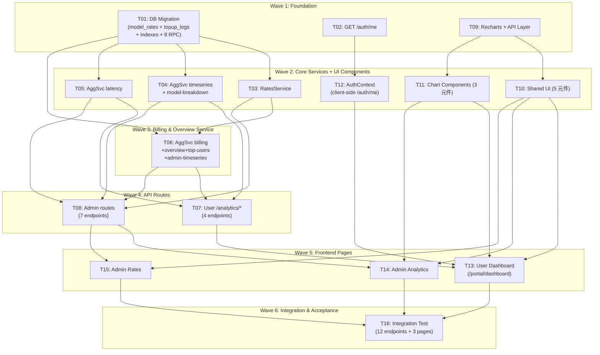

# S3 Implementation Plan: Analytics Dashboard

> **階段**: S3 實作計畫
> **建立時間**: 2026-03-15 18:30
> **最後更新**: 2026-03-15 18:30（S2 審查修正後重新產出）
> **Agents**: backend-developer, frontend-developer, test-engineer

---

## 1. 概述

### 1.1 功能目標

為 Apiex 平台用戶與 Admin 建立 Analytics Dashboard，整合至現有 web-admin，展示 token 用量趨勢、model 分布、延遲監控（p50/p95/p99 按 model 分開）、帳單費用換算（per-model 費率表，Admin 可動態設定），並依角色分流顯示不同視圖。

### 1.2 實作範圍

- **範圍內**: DB migration（model_rates + topup_logs IF NOT EXISTS + indexes + 8 RPC functions）、12 個 API endpoints（含 /auth/me 和 /admin/analytics/timeseries）、用戶 Dashboard、Admin Analytics、Admin 費率設定、AuthContext client-side 角色分流、Recharts 圖表元件
- **範圍外**: Realtime、資料匯出、告警系統、自訂 Dashboard 佈局、物化視圖/快取層、Custom 時間範圍、per-request 費用明細

### 1.3 關聯文件

| 文件 | 路徑 | 狀態 |
|------|------|------|
| Brief Spec | `./s0_brief_spec.md` | completed |
| Dev Spec | `./s1_dev_spec.md` | completed |
| API Spec | `./s1_api_spec.md` | completed |
| Frontend Handoff | `./s1_frontend_handoff.md` | completed |
| S2 Review | `./review/r1_findings.md` | completed |
| Implementation Plan | `./s3_implementation_plan.md` | 當前文件 |

---

## 2. 實作任務清單

### 2.1 任務總覽

| # | 任務 | 類型 | Agent | 依賴 | 複雜度 | source_ref | TDD | 狀態 |
|---|------|------|-------|------|--------|------------|-----|------|
| T01 | DB migration: model_rates + topup_logs IF NOT EXISTS + indexes + 8 RPC functions | 資料層 | `backend-developer` | - | M | dev_spec#5.2-T1 | N/A | pending |
| T02 | GET /auth/me endpoint | 後端 | `backend-developer` | - | S | dev_spec#5.2-T2, api_spec#1 | test | pending |
| T09 | Install Recharts + 前端 API 層 + AbortSignal | 前端 | `frontend-developer` | - | S | dev_spec#5.2-T9, frontend_handoff#5.1 | N/A | pending |
| T03 | RatesService CRUD（含 created_by） | 後端 | `backend-developer` | T01 | S | dev_spec#5.2-T3, api_spec#9-11 | test | pending |
| T04 | AggregationService: timeseries + model-breakdown（RPC） | 後端 | `backend-developer` | T01 | M | dev_spec#5.2-T4, api_spec#2-3 | test | pending |
| T05 | AggregationService: latency percentile（RPC） | 後端 | `backend-developer` | T01 | M | dev_spec#5.2-T5, api_spec#4 | test | pending |
| T10 | 共用 UI 元件（StatsCard, PeriodSelector, KeySelector, EmptyState, LoadingSkeleton） | 前端 | `frontend-developer` | T09 | M | dev_spec#5.2-T10, frontend_handoff#5.3 | N/A | pending |
| T11 | 圖表元件（TimeseriesAreaChart, LatencyLineChart, DonutChart） | 前端 | `frontend-developer` | T09 | M | dev_spec#5.2-T11, frontend_handoff#5.3 | N/A | pending |
| T12 | AuthContext（GET /auth/me）+ role-based 路由分流（client-side） | 前端 | `frontend-developer` | T02 | M | dev_spec#5.2-T12, frontend_handoff#5.2 | N/A | pending |
| T06 | AggregationService: billing + overview + top-users + admin timeseries（RPC） | 後端 | `backend-developer` | T01, T03 | L | dev_spec#5.2-T6, api_spec#5-8 | test | pending |
| T07 | 用戶 analytics 路由 (/analytics/*) | 後端 | `backend-developer` | T04, T05, T06 | M | dev_spec#5.2-T7, api_spec#2-5 | test | pending |
| T08 | Admin analytics + rates 路由（7 endpoints 含 /admin/analytics/timeseries） | 後端 | `backend-developer` | T03, T04, T05, T06 | M | dev_spec#5.2-T8, api_spec#6-11 | test | pending |
| T13 | 用戶 Dashboard 頁面 (/portal/dashboard) + portal layout | 前端 | `frontend-developer` | T07, T10, T11, T12 | L | dev_spec#5.2-T13, frontend_handoff#U9 | N/A | pending |
| T14 | Admin Analytics 頁面 + AppLayout | 前端 | `frontend-developer` | T08, T10, T11 | L | dev_spec#5.2-T14, frontend_handoff#U11 | N/A | pending |
| T15 | Admin 費率設定頁面 | 前端 | `frontend-developer` | T08, T10 | M | dev_spec#5.2-T15, frontend_handoff#U12 | N/A | pending |
| T16 | 整合測試 + 驗收（12 endpoints + 3 頁面） | 測試 | `test-engineer` | T13, T14, T15 | M | dev_spec#5.2-T16 | test | pending |

**狀態圖例**：pending / in_progress / completed / blocked / skipped

**複雜度**：S（小，<30min）、M（中，30min-2hr）、L（大，>2hr）

**TDD**: test = has tdd_plan, N/A = skip (justification in task detail)

---

## 3. 任務詳情

### Task #T01: DB Migration -- model_rates + topup_logs + indexes + 8 RPC functions

**基本資訊**

| 項目 | 內容 |
|------|------|
| 類型 | 資料層 |
| Agent | `backend-developer` |
| 複雜度 | M |
| 依賴 | - |
| source_ref | dev_spec#5.2-T1 |
| 狀態 | pending |

**描述**

新增 migration `20260315000000_analytics.sql`（遵循現有 timestamp 命名格式）。內容：
1. `model_rates` 表（含 `created_by UUID REFERENCES auth.users(id)`）
2. `topup_logs` IF NOT EXISTS 補建（表已存在於 Supabase 雲端，但缺 migration 檔案）
3. `idx_usage_logs_api_key_created` composite index
4. `idx_model_rates_tag_effective` composite index
5. 8 個 RPC functions（analytics_timeseries, analytics_model_breakdown, analytics_latency_percentile, analytics_billing_summary, analytics_platform_overview, analytics_platform_timeseries, analytics_top_users, analytics_platform_latency）
6. 每個 RPC function 內設定 10 秒 `statement_timeout`
7. RLS policy：service role 可 CRUD
8. `database.types.ts` 新增 ModelRate, ModelRateInsert 型別（含 created_by）

**受影響檔案**

| 檔案 | 變更類型 | 說明 |
|------|---------|------|
| `packages/api-server/supabase/migrations/20260315000000_analytics.sql` | 新增 | 完整 migration |
| `packages/api-server/src/lib/database.types.ts` | 修改 | 新增 ModelRate, ModelRateInsert 型別 |

**DoD**

- [ ] `model_rates` 表建立（id UUID PK, model_tag TEXT, input_rate_per_1k NUMERIC(10,6), output_rate_per_1k NUMERIC(10,6), effective_from TIMESTAMPTZ DEFAULT now(), created_by UUID REFERENCES auth.users(id), created_at TIMESTAMPTZ DEFAULT now()）
- [ ] `topup_logs` IF NOT EXISTS 補建（user_id UUID, amount_usd INTEGER, tokens_granted BIGINT, status TEXT, created_at TIMESTAMPTZ）
- [ ] `idx_model_rates_tag_effective` index 建立（model_tag, effective_from DESC）
- [ ] `idx_usage_logs_api_key_created` composite index 建立（api_key_id, created_at DESC）
- [ ] RLS policy：service role 可 CRUD
- [ ] 8 個 RPC functions 定義完成，每個包含 `SET statement_timeout = '10s'`
- [ ] `database.types.ts` 新增 ModelRate, ModelRateInsert 型別（含 created_by），Database interface 加入 model_rates

**TDD Plan**: N/A -- 純 SQL DDL + RPC function 定義，無可單元測試的 TypeScript 邏輯。RPC functions 透過 T04/T05/T06 的服務層測試間接驗證。

**驗證方式**
```bash
# SQL 語法檢查
cat /Users/asd/demo/1/packages/api-server/supabase/migrations/20260315000000_analytics.sql
# TypeScript 編譯驗證
cd /Users/asd/demo/1/packages/api-server && npx tsc --noEmit
```

**實作備註**
- 現有 migration 命名格式：`20260314000000_init_schema.sql`
- usage_logs 無 user_id 欄位，RPC functions 內 per-user 聚合需 JOIN api_keys
- topup_logs.amount_usd 為 INTEGER（美分），RPC function 內費用計算注意單位
- RPC function 參數使用 `$1`, `$2` 格式防注入

---

### Task #T02: GET /auth/me endpoint

**基本資訊**

| 項目 | 內容 |
|------|------|
| 類型 | 後端 |
| Agent | `backend-developer` |
| 複雜度 | S |
| 依賴 | - |
| source_ref | dev_spec#5.2-T2, api_spec#1 |
| 狀態 | pending |

**描述**

在 `routes/auth.ts` 新增 `GET /me`（掛載後路徑為 `/auth/me`），使用 `supabaseJwtAuth`。回傳 `{ data: { id, email, isAdmin } }`。isAdmin 邏輯：讀取 `ADMIN_EMAILS` env var（與 adminAuth.ts 相同邏輯）。建議抽出 `lib/isAdmin.ts` 共用 helper。

**受影響檔案**

| 檔案 | 變更類型 | 說明 |
|------|---------|------|
| `packages/api-server/src/routes/auth.ts` | 修改 | 新增 GET /me |
| `packages/api-server/src/lib/isAdmin.ts` | 新增 | isAdmin 共用 helper |

**DoD**

- [ ] `GET /auth/me` 回傳 `{ data: { id, email, isAdmin } }`
- [ ] isAdmin 依據 ADMIN_EMAILS 正確判斷
- [ ] 未認證回傳 401
- [ ] 單元測試覆蓋 admin / non-admin / unauthenticated

**TDD Plan**

| 項目 | 內容 |
|------|------|
| 測試檔案 | `packages/api-server/src/routes/__tests__/auth.test.ts` |
| 測試指令 | `cd /Users/asd/demo/1/packages/api-server && npx vitest run src/routes/__tests__/auth.test.ts` |
| 預期測試案例 | `should return isAdmin=true for admin email`, `should return isAdmin=false for regular user`, `should return 401 for unauthenticated` |

**驗證方式**
```bash
cd /Users/asd/demo/1/packages/api-server && npx vitest run src/routes/__tests__/auth.test.ts
```

---

### Task #T09: Install Recharts + 前端 API 層 + AbortSignal

**基本資訊**

| 項目 | 內容 |
|------|------|
| 類型 | 前端 |
| Agent | `frontend-developer` |
| 複雜度 | S |
| 依賴 | - |
| source_ref | dev_spec#5.2-T9, frontend_handoff#5.1 |
| 狀態 | pending |

**描述**

1. `cd packages/web-admin && npm install recharts`
2. 在 `lib/api.ts` 新增 3 個工廠函式：`makeAnalyticsApi(token)`, `makeAdminAnalyticsApi(token)`, `makeRatesApi(token)`
3. 新增 response 型別定義（對齊 frontend_handoff#5.1 的完整型別清單）
4. `apiGet` 擴充支援 optional `signal?: AbortSignal`（只有 GET，mutation 不支援）

**受影響檔案**

| 檔案 | 變更類型 | 說明 |
|------|---------|------|
| `packages/web-admin/package.json` | 修改 | 新增 recharts 依賴 |
| `packages/web-admin/src/lib/api.ts` | 修改 | 3 個 API factory + AbortSignal + 型別 |

**DoD**

- [ ] recharts 加入 package.json dependencies
- [ ] makeAnalyticsApi 提供 getTimeseries, getModelBreakdown, getLatency, getBilling
- [ ] makeAdminAnalyticsApi 提供 getOverview, getTimeseries, getLatency, getTopUsers
- [ ] makeRatesApi 提供 list, create, update
- [ ] apiGet 支援 optional signal?: AbortSignal（apiPost/apiPatch 不需要）
- [ ] TypeScript 型別完整（Period, TimeseriesPoint, ModelBreakdownItem, LatencyPoint, BillingSummaryResponse, AdminOverview, UserRankingItem, ModelRate, CreateRatePayload, UpdateRatePayload）

**TDD Plan**: N/A -- 純型別定義 + API factory 封裝，無可測邏輯。型別正確性由 `tsc --noEmit` 驗證。

**驗證方式**
```bash
cd /Users/asd/demo/1/packages/web-admin && npx tsc --noEmit
```

---

### Task #T03: RatesService CRUD（含 created_by）

**基本資訊**

| 項目 | 內容 |
|------|------|
| 類型 | 後端 |
| Agent | `backend-developer` |
| 複雜度 | S |
| 依賴 | T01 |
| source_ref | dev_spec#5.2-T3, api_spec#9-11 |
| 狀態 | pending |

**描述**

新增 `services/RatesService.ts`。方法：`listRates()` -- 按 model_tag 分組，effective_from DESC；`createRate(data, adminId)` -- 插入新費率，**寫入 created_by = adminId**；`updateRate(id, data)` -- 更新費率；`getEffectiveRate(modelTag, asOfDate)` -- 取 effective_from <= asOfDate 的最新一筆。

**受影響檔案**

| 檔案 | 變更類型 | 說明 |
|------|---------|------|
| `packages/api-server/src/services/RatesService.ts` | 新增 | CRUD + getEffectiveRate |

**DoD**

- [ ] listRates 回傳正確排序結果（按 model_tag 分組，effective_from DESC）
- [ ] createRate 正確插入，effective_from 預設 now()，**created_by 寫入 admin user ID**
- [ ] updateRate 正確更新
- [ ] getEffectiveRate 取得 effective_from <= asOfDate 的最新費率
- [ ] 無對應費率時回傳 null
- [ ] 單元測試覆蓋

**TDD Plan**

| 項目 | 內容 |
|------|------|
| 測試檔案 | `packages/api-server/src/services/__tests__/RatesService.test.ts` |
| 測試指令 | `cd /Users/asd/demo/1/packages/api-server && npx vitest run src/services/__tests__/RatesService.test.ts` |
| 預期測試案例 | `should list rates grouped by model_tag`, `should create rate with created_by`, `should get effective rate for given date`, `should return null when no rate exists`, `should update rate fields` |

---

### Task #T04: AggregationService -- timeseries + model-breakdown（RPC）

**基本資訊**

| 項目 | 內容 |
|------|------|
| 類型 | 後端 |
| Agent | `backend-developer` |
| 複雜度 | M |
| 依賴 | T01 |
| source_ref | dev_spec#5.2-T4, api_spec#2-3 |
| 狀態 | pending |

**描述**

新增 `services/AggregationService.ts`。透過 `supabaseAdmin.rpc()` 呼叫 RPC functions：
- `getTimeseries(params)` 呼叫 `analytics_timeseries` RPC，支援 per-user（p_user_id）和全平台模式（p_user_id = null）
- `getModelBreakdown(params)` 呼叫 `analytics_model_breakdown` RPC
- 格式化 RPC 回傳為 API response schema（按 model_tag 分欄）

**受影響檔案**

| 檔案 | 變更類型 | 說明 |
|------|---------|------|
| `packages/api-server/src/services/AggregationService.ts` | 新增 | getTimeseries + getModelBreakdown |

**DoD**

- [ ] getTimeseries 透過 RPC 呼叫回傳正確時序（含 model_tag 分欄）
- [ ] getModelBreakdown 透過 RPC 呼叫回傳正確分布比例（percentage 計算正確）
- [ ] per-user 模式（p_user_id 參數）正確
- [ ] per-key 篩選（p_key_id）正常
- [ ] 全平台模式（Admin，p_user_id = null）正常
- [ ] RPC 參數化，無注入風險
- [ ] 單元測試（mock supabaseAdmin.rpc）

**TDD Plan**

| 項目 | 內容 |
|------|------|
| 測試檔案 | `packages/api-server/src/services/__tests__/AggregationService.test.ts` |
| 測試指令 | `cd /Users/asd/demo/1/packages/api-server && npx vitest run src/services/__tests__/AggregationService.test.ts` |
| 預期測試案例 | `should call analytics_timeseries RPC with correct params`, `should format timeseries response with model columns`, `should call analytics_model_breakdown RPC`, `should support per-key filtering`, `should support platform mode (null user_id)` |

---

### Task #T05: AggregationService -- latency percentile（RPC）

**基本資訊**

| 項目 | 內容 |
|------|------|
| 類型 | 後端 |
| Agent | `backend-developer` |
| 複雜度 | M |
| 依賴 | T01 |
| source_ref | dev_spec#5.2-T5, api_spec#4 |
| 狀態 | pending |

**描述**

在 AggregationService 新增 `getLatencyTimeseries(params)`，呼叫 `analytics_latency_percentile` RPC function。取得 p50/p95/p99，按 model_tag 和時間桶分組。RPC function 內部只計算 status='success' 的記錄。支援 per-user 和全平台模式。

**受影響檔案**

| 檔案 | 變更類型 | 說明 |
|------|---------|------|
| `packages/api-server/src/services/AggregationService.ts` | 修改 | 新增 getLatencyTimeseries |

**DoD**

- [ ] 透過 RPC 呼叫回傳按 model_tag 分組的 p50/p95/p99 時序
- [ ] 過濾 status='success'（在 RPC function 內）
- [ ] per-user 和全平台模式都正常
- [ ] 10 秒 statement timeout（在 RPC function 內）
- [ ] 單元測試（mock RPC）

**TDD Plan**

| 項目 | 內容 |
|------|------|
| 測試檔案 | `packages/api-server/src/services/__tests__/AggregationService.test.ts` |
| 測試指令 | `cd /Users/asd/demo/1/packages/api-server && npx vitest run src/services/__tests__/AggregationService.test.ts` |
| 預期測試案例 | `should call analytics_latency_percentile RPC`, `should return p50/p95/p99 grouped by model`, `should support per-user and platform mode` |

---

### Task #T10: 共用 UI 元件

**基本資訊**

| 項目 | 內容 |
|------|------|
| 類型 | 前端 |
| Agent | `frontend-developer` |
| 複雜度 | M |
| 依賴 | T09 |
| source_ref | dev_spec#5.2-T10, frontend_handoff#5.3 |
| 狀態 | pending |

**描述**

建立 `components/analytics/` 目錄。5 個元件：StatsCard（title/value/unit/trend）、PeriodSelector（24h/7d/30d 按鈕組）、KeySelector（Radix Select，含「全部 Keys」選項，單 key 用戶隱藏）、EmptyState（lucide icon + message）、LoadingSkeleton（chart/card/table 三種 variant）。

**受影響檔案**

| 檔案 | 變更類型 | 說明 |
|------|---------|------|
| `packages/web-admin/src/components/analytics/StatsCard.tsx` | 新增 | 統計卡片 |
| `packages/web-admin/src/components/analytics/PeriodSelector.tsx` | 新增 | 24h/7d/30d 按鈕組 |
| `packages/web-admin/src/components/analytics/KeySelector.tsx` | 新增 | API Key 下拉選擇 |
| `packages/web-admin/src/components/analytics/EmptyState.tsx` | 新增 | 空資料狀態 |
| `packages/web-admin/src/components/analytics/LoadingSkeleton.tsx` | 新增 | 骨架屏 |

**DoD**

- [ ] StatsCard 顯示 title, value, unit, trend arrow（含 loading 狀態）
- [ ] PeriodSelector 三按鈕，選中狀態明確（enabled during loading，允許快速切換觸發 abort）
- [ ] KeySelector 使用 Radix Select，含「全部 Keys」選項，keys.length <= 1 時隱藏
- [ ] EmptyState 自訂 message + lucide icon
- [ ] LoadingSkeleton 支援 chart/card/table 3 種 variant
- [ ] Tailwind v4 樣式，TypeScript props 完整

**TDD Plan**: N/A -- 純展示型 UI 元件，無業務邏輯。`tsc --noEmit` 驗證型別，視覺驗證透過 dev server。

**驗證方式**
```bash
cd /Users/asd/demo/1/packages/web-admin && npx tsc --noEmit
```

---

### Task #T11: 圖表元件（Recharts）

**基本資訊**

| 項目 | 內容 |
|------|------|
| 類型 | 前端 |
| Agent | `frontend-developer` |
| 複雜度 | M |
| 依賴 | T09 |
| source_ref | dev_spec#5.2-T11, frontend_handoff#5.3 |
| 狀態 | pending |

**描述**

建立 `components/charts/` 目錄。3 個 Recharts 元件：
- TimeseriesAreaChart（ResponsiveContainer + AreaChart，多 series 疊加，x 軸自動 hour/day 格式化）
- LatencyLineChart（LineChart，支援多 model 的 p50/p95/p99，藍色系=apex-smart，橘色系=apex-cheap）
- DonutChart（PieChart innerRadius，顯示比例 label）

**受影響檔案**

| 檔案 | 變更類型 | 說明 |
|------|---------|------|
| `packages/web-admin/src/components/charts/TimeseriesAreaChart.tsx` | 新增 | Recharts AreaChart |
| `packages/web-admin/src/components/charts/LatencyLineChart.tsx` | 新增 | Recharts 延遲折線圖 |
| `packages/web-admin/src/components/charts/DonutChart.tsx` | 新增 | Recharts 圓環圖 |

**DoD**

- [ ] TimeseriesAreaChart 多 series + tooltip + legend
- [ ] LatencyLineChart 多 model 分色（藍色系 apex-smart，橘色系 apex-cheap）+ p50/p95/p99
- [ ] DonutChart 顯示比例 + 標籤
- [ ] ResponsiveContainer 自適應
- [ ] 空資料 fallback 到 EmptyState
- [ ] TypeScript 型別完整

**TDD Plan**: N/A -- 純 Recharts 渲染元件，無業務邏輯。視覺驗證為主。

**驗證方式**
```bash
cd /Users/asd/demo/1/packages/web-admin && npx tsc --noEmit
```

---

### Task #T12: AuthContext（GET /auth/me）+ role-based 路由分流（client-side）

**基本資訊**

| 項目 | 內容 |
|------|------|
| 類型 | 前端 |
| Agent | `frontend-developer` |
| 複雜度 | M |
| 依賴 | T02 |
| source_ref | dev_spec#5.2-T12, frontend_handoff#5.2 |
| 狀態 | pending |

**描述**

**統一方案：AuthContext client-side 呼叫 `GET /auth/me`**（不在 middleware server-side 呼叫，S2 審查已修正）。

新增 `contexts/AuthContext.tsx`，mount 時呼叫 `/auth/me` 取得 `{ id, email, isAdmin }`。isAdmin 結果驅動路由分流：Admin -> `/admin/dashboard`，一般用戶 -> `/portal/dashboard`。Loading 期間全頁 spinner（避免 FOUC）。`/auth/me` 失敗降級為 `isAdmin = false`（不阻斷）。middleware.ts 維持現有行為（只做 Supabase auth check），不新增 server-side /auth/me 呼叫。

**受影響檔案**

| 檔案 | 變更類型 | 說明 |
|------|---------|------|
| `packages/web-admin/src/contexts/AuthContext.tsx` | 新增 | AuthContext provider |
| `packages/web-admin/src/app/portal/layout.tsx` | 修改 | 包裝 AuthContext（或在 root layout） |

**DoD**

- [ ] AuthContext 提供 user, isAdmin, isLoading
- [ ] Admin 登入 -> /admin/dashboard
- [ ] 一般用戶登入 -> /portal/dashboard
- [ ] 一般用戶訪問 /admin/* -> client-side 重導向 /portal/dashboard
- [ ] /auth/me 失敗 -> 降級為非 Admin（不阻斷）
- [ ] /admin/login 已認證一般用戶 -> 直接 /portal/dashboard（無二次跳轉）
- [ ] AuthContext loading 期間全頁 spinner
- [ ] 現有 /portal/* auth guard 不受影響
- [ ] middleware.ts 不做修改（維持現有行為）

**TDD Plan**: N/A -- React Context + useEffect，依賴瀏覽器環境。手動測試 admin/user 兩種帳號。

**驗證方式**
```bash
cd /Users/asd/demo/1/packages/web-admin && npx tsc --noEmit
# 手動：admin 帳號登入 -> /admin/dashboard
# 手動：一般用戶登入 -> /portal/dashboard
# 手動：一般用戶訪問 /admin/analytics -> 重導向 /portal/dashboard
```

---

### Task #T06: AggregationService -- billing + overview + top-users + admin timeseries（RPC）

**基本資訊**

| 項目 | 內容 |
|------|------|
| 類型 | 後端 |
| Agent | `backend-developer` |
| 複雜度 | L |
| 依賴 | T01, T03 |
| source_ref | dev_spec#5.2-T6, api_spec#5-8 |
| 狀態 | pending |

**描述**

四個方法，全部透過 `supabaseAdmin.rpc()` 呼叫：
1. **getBillingSummary(userId)** -- `analytics_billing_summary` RPC（費用換算 JOIN model_rates 歷史費率 + topup_logs 最近 5 筆 + api_keys 配額）。不接受 period 參數，計算 all_time 累計。
2. **getOverview(period)** -- `analytics_platform_overview` RPC（全平台彙總：total_tokens, requests, active_users, avg_latency）
3. **getTopUsers(period, limit)** -- `analytics_top_users` RPC（排行含 email/tokens/requests/cost）
4. **getAdminTimeseries(period)** -- `analytics_platform_timeseries` RPC（全平台 token 用量時序，按 model 分色，對應 S0 成功標準 #6）

**受影響檔案**

| 檔案 | 變更類型 | 說明 |
|------|---------|------|
| `packages/api-server/src/services/AggregationService.ts` | 修改 | 新增 4 個方法 |

**DoD**

- [ ] getBillingSummary 費用換算使用歷史費率（effective_from <= usage.created_at）
- [ ] 費率未設定時 cost 為 null
- [ ] 充值記錄取最近 5 筆（topup_logs ORDER BY created_at DESC LIMIT 5）
- [ ] 配額計算正確（SUM(api_keys.quota_tokens) WHERE active，-1 = unlimited 特殊處理）
- [ ] 剩餘天數 = remaining_quota / daily_avg_consumption（daily_avg_consumption=0 時回傳 null）
- [ ] getOverview 彙總正確（total_tokens, requests, active_users, avg_latency）
- [ ] getTopUsers 排行含 email（需 JOIN 或 admin API 取得）
- [ ] **getAdminTimeseries 回傳全平台時序（按 model_tag 分欄）**
- [ ] 所有方法透過 `supabaseAdmin.rpc()` 呼叫
- [ ] 單元測試

**TDD Plan**

| 項目 | 內容 |
|------|------|
| 測試檔案 | `packages/api-server/src/services/__tests__/AggregationService.test.ts` |
| 測試指令 | `cd /Users/asd/demo/1/packages/api-server && npx vitest run src/services/__tests__/AggregationService.test.ts` |
| 預期測試案例 | `should calculate billing with historical rates`, `should return null cost when rates not set`, `should get top 5 recent topups`, `should handle unlimited quota (-1)`, `should return null remaining days when daily_avg is 0`, `should get platform overview`, `should get top users with email`, `should get admin timeseries by model` |

---

### Task #T07: 用戶 analytics 路由 (/analytics/*)

**基本資訊**

| 項目 | 內容 |
|------|------|
| 類型 | 後端 |
| Agent | `backend-developer` |
| 複雜度 | M |
| 依賴 | T04, T05, T06 |
| source_ref | dev_spec#5.2-T7, api_spec#2-5 |
| 狀態 | pending |

**描述**

新增 `routes/analytics.ts`，export `analyticsRoutes()` 回傳 Hono router。4 個 GET endpoints：
- `/analytics/timeseries` -- period + key_id
- `/analytics/model-breakdown` -- period + key_id
- `/analytics/latency` -- period + key_id
- `/analytics/billing` -- 無額外 query params（all_time）

key_id 驗證：查詢 api_keys 確認屬於當前用戶。在 index.ts 掛載（supabaseJwtAuth middleware）。

**受影響檔案**

| 檔案 | 變更類型 | 說明 |
|------|---------|------|
| `packages/api-server/src/routes/analytics.ts` | 新增 | 4 個 GET endpoints |
| `packages/api-server/src/index.ts` | 修改 | 掛載 analytics 路由群 + supabaseJwtAuth |

**DoD**

- [ ] 4 個 GET endpoints 正確回應
- [ ] period 參數驗證（拒絕非 24h/7d/30d，預設 7d）
- [ ] key_id 驗證（必須是用戶自己的 key，否則 400）
- [ ] `/analytics/billing` 無額外 query params
- [ ] 回應格式 `{ data: T }`
- [ ] index.ts 正確掛載 + supabaseJwtAuth
- [ ] 錯誤使用 `Errors.xxx()` 格式

**TDD Plan**

| 項目 | 內容 |
|------|------|
| 測試檔案 | `packages/api-server/src/routes/__tests__/analytics.test.ts` |
| 測試指令 | `cd /Users/asd/demo/1/packages/api-server && npx vitest run src/routes/__tests__/analytics.test.ts` |
| 預期測試案例 | `should return timeseries for 7d default`, `should validate period param`, `should reject key_id not owned by user`, `should return billing without period param`, `should return 401 for unauthenticated` |

---

### Task #T08: Admin analytics + rates 路由（7 endpoints）

**基本資訊**

| 項目 | 內容 |
|------|------|
| 類型 | 後端 |
| Agent | `backend-developer` |
| 複雜度 | M |
| 依賴 | T03, T04, T05, T06 |
| source_ref | dev_spec#5.2-T8, api_spec#6-11 |
| 狀態 | pending |

**描述**

在 `routes/admin.ts` 追加 **7 個** endpoints：
- Analytics 4 GET：`/admin/analytics/overview`, **`/admin/analytics/timeseries`**, `/admin/analytics/latency`, `/admin/analytics/top-users`
- Rates 3：`GET /admin/rates`（list）, `POST /admin/rates`（create，**傳入 admin userId 寫入 created_by**）, `PATCH /admin/rates/:id`（update）

掛載順序放在現有路由後面，不影響既有 `/admin/users`, `/admin/usage-logs`, `/admin/topup-logs` 路由匹配。

**受影響檔案**

| 檔案 | 變更類型 | 說明 |
|------|---------|------|
| `packages/api-server/src/routes/admin.ts` | 修改 | 新增 7 個 endpoints |

**DoD**

- [ ] **4 個 Admin analytics GET endpoints 正常**（含 `/admin/analytics/timeseries`）
- [ ] `/admin/analytics/timeseries` 回傳全平台 token 用量時序（按 model 分欄）
- [ ] `GET /admin/rates` 回傳費率列表
- [ ] `POST /admin/rates` 驗證 model_tag, input_rate_per_1k, output_rate_per_1k 必填，**寫入 created_by**
- [ ] `PATCH /admin/rates/:id` 驗證記錄存在（404 if not found）
- [ ] 非 Admin 回傳 403（現有 adminAuth 保障）
- [ ] 現有路由（users, usage-logs, topup-logs）不受影響

**TDD Plan**

| 項目 | 內容 |
|------|------|
| 測試檔案 | `packages/api-server/src/routes/__tests__/admin-analytics.test.ts` |
| 測試指令 | `cd /Users/asd/demo/1/packages/api-server && npx vitest run src/routes/__tests__/admin-analytics.test.ts` |
| 預期測試案例 | `should return platform overview`, `should return platform timeseries`, `should return platform latency`, `should return top users`, `should list rates`, `should create rate with created_by`, `should reject POST missing fields`, `should update rate`, `should return 404 for non-existent rate`, `should return 403 for non-admin` |

---

### Task #T13: 用戶 Dashboard 頁面 (/portal/dashboard) + portal layout

**基本資訊**

| 項目 | 內容 |
|------|------|
| 類型 | 前端 |
| Agent | `frontend-developer` |
| 複雜度 | L |
| 依賴 | T07, T10, T11, T12 |
| source_ref | dev_spec#5.2-T13, frontend_handoff#U9 |
| 狀態 | pending |

**描述**

建立 `app/portal/dashboard/page.tsx`。頁面結構：
- 4x StatsCard（tokens, requests, avg latency, quota）
- PeriodSelector + KeySelector
- TimeseriesAreaChart（apex-smart / apex-cheap 分色）
- DonutChart + LatencyLineChart 並排
- 帳單摘要（費用/充值表格/剩餘天數）

頁面初始化：取 session token -> makeAnalyticsApi -> 並行 fetch 4 APIs。切換 period/key 時 AbortController 取消舊請求再發新請求。更新 portal/layout.tsx navItems 加入 `{ href: '/portal/dashboard', label: 'Dashboard' }`。

**受影響檔案**

| 檔案 | 變更類型 | 說明 |
|------|---------|------|
| `packages/web-admin/src/app/portal/dashboard/page.tsx` | 新增 | 用戶 Dashboard |
| `packages/web-admin/src/app/portal/layout.tsx` | 修改 | navItems 新增 Dashboard |

**DoD**

- [ ] 載入顯示 LoadingSkeleton，資料到達渲染圖表
- [ ] 4 張 StatsCard 正確（tokens, requests, avg latency, quota）
- [ ] PeriodSelector / KeySelector 切換功能正常
- [ ] 快速切換無閃爍（AbortController 取消舊請求）
- [ ] 新用戶 EmptyState（「開始使用 API 後將顯示數據」）
- [ ] 帳單區塊：費用 USD 或 N/A + 充值表格 + 剩餘天數（unlimited 顯示 "Unlimited"）
- [ ] portal/layout.tsx navItems 更新
- [ ] 元件 unmount 取消請求（useEffect cleanup）

**TDD Plan**: N/A -- 前端頁面組裝，手動測試完整流程。

**驗證方式**
```bash
cd /Users/asd/demo/1/packages/web-admin && npx tsc --noEmit && npm run build
# 手動：有 usage 用戶 -> 圖表正常
# 手動：新用戶 -> EmptyState
# 手動：快速切換 period -> 無閃爍
```

---

### Task #T14: Admin Analytics 頁面 + AppLayout

**基本資訊**

| 項目 | 內容 |
|------|------|
| 類型 | 前端 |
| Agent | `frontend-developer` |
| 複雜度 | L |
| 依賴 | T08, T10, T11 |
| source_ref | dev_spec#5.2-T14, frontend_handoff#U11 |
| 狀態 | pending |

**描述**

建立 `app/admin/(protected)/analytics/page.tsx`。結構：
- 4x StatsCard（全平台 tokens, 今日 requests, 活躍用戶, 平均延遲）
- PeriodSelector
- TimeseriesAreaChart（**使用 `/admin/analytics/timeseries`**，model 分色）
- Top 10 排行表格（email, tokens, requests, cost）
- LatencyLineChart（6 條線：apex-smart p50/p95/p99 藍色系 + apex-cheap p50/p95/p99 橘色系）

更新 AppLayout.tsx navItems 加入 `{ href: '/admin/analytics', label: 'Analytics' }`。

**受影響檔案**

| 檔案 | 變更類型 | 說明 |
|------|---------|------|
| `packages/web-admin/src/app/admin/(protected)/analytics/page.tsx` | 新增 | Admin Analytics |
| `packages/web-admin/src/components/AppLayout.tsx` | 修改 | navItems 新增 Analytics |

**DoD**

- [ ] 統計卡片正確（全平台 tokens, 今日 requests, 活躍用戶, 平均延遲）
- [ ] **時序圖使用 `/admin/analytics/timeseries` 資料，model 分色**
- [ ] Top 10 表格含 email, tokens, requests, cost（cost=null 時顯示 N/A）
- [ ] 延遲圖 6 條線（apex-smart 藍色系 + apex-cheap 橘色系，各 p50/p95/p99）
- [ ] PeriodSelector 功能正常
- [ ] AppLayout navItems 更新
- [ ] Loading skeleton

**TDD Plan**: N/A -- 前端頁面組裝，手動測試。

**驗證方式**
```bash
cd /Users/asd/demo/1/packages/web-admin && npx tsc --noEmit && npm run build
# 手動：Admin 登入看到全平台 Analytics
```

---

### Task #T15: Admin 費率設定頁面

**基本資訊**

| 項目 | 內容 |
|------|------|
| 類型 | 前端 |
| Agent | `frontend-developer` |
| 複雜度 | M |
| 依賴 | T08, T10 |
| source_ref | dev_spec#5.2-T15, frontend_handoff#U12 |
| 狀態 | pending |

**描述**

建立 `app/admin/(protected)/settings/rates/page.tsx`。結構：費率列表表格（model_tag, input_rate, output_rate, effective_from, 編輯按鈕）+ 新增費率 Dialog（model_tag select + input_rate + output_rate 數字輸入）。編輯走 PATCH。成功/失敗 Toast。AppLayout navItems 加入 Settings > Rates（若 T14 未加）。

**受影響檔案**

| 檔案 | 變更類型 | 說明 |
|------|---------|------|
| `packages/web-admin/src/app/admin/(protected)/settings/rates/page.tsx` | 新增 | 費率設定頁 |
| `packages/web-admin/src/components/AppLayout.tsx` | 修改 | navItems 加入 Settings > Rates（若 T14 未加） |

**DoD**

- [ ] 費率列表正確顯示（model_tag, input_rate_per_1k, output_rate_per_1k, effective_from）
- [ ] 費率金額顯示 6 位小數（如 `$0.100000`）
- [ ] 新增表單驗證必填（model_tag, input_rate_per_1k, output_rate_per_1k）
- [ ] 新增後列表刷新
- [ ] 編輯功能正常（PATCH）
- [ ] Toast 回饋（成功/失敗）
- [ ] Sidebar 連結

**TDD Plan**: N/A -- 前端 CRUD 頁面，手動測試。

**驗證方式**
```bash
cd /Users/asd/demo/1/packages/web-admin && npx tsc --noEmit && npm run build
# 手動：新增/修改費率
```

---

### Task #T16: 整合測試 + 驗收

**基本資訊**

| 項目 | 內容 |
|------|------|
| 類型 | 測試 |
| Agent | `test-engineer` |
| 複雜度 | M |
| 依賴 | T13, T14, T15 |
| source_ref | dev_spec#5.2-T16 |
| 狀態 | pending |

**描述**

全功能驗收：後端 12 個 API endpoints（含 /auth/me 和 /admin/analytics/timeseries）+ 前端 3 個頁面 + 跨功能（費率 -> 帳單）+ 邊界（空資料、費率未設定、JWT 過期）+ 效能（30d < 3s）+ 回歸（現有 Admin 頁面不受影響）。最終路徑使用 `/portal/dashboard`（非 S0 的 `/dashboard`）。

**DoD**

- [ ] S0 15 條成功標準逐條 PASS
- [ ] dev_spec 17 條驗收標準（AC-1~AC-17）逐條 PASS
- [ ] E1-E14 邊界情境驗證
- [ ] 回歸：現有 Admin 頁面（users, usage-logs, topup-logs）正常
- [ ] 效能：30d query < 3s
- [ ] 測試報告產出

**TDD Plan**

| 項目 | 內容 |
|------|------|
| 測試檔案 | `packages/api-server/src/__tests__/integration/analytics.integration.test.ts` |
| 測試指令 | `cd /Users/asd/demo/1/packages/api-server && npx vitest run src/__tests__/integration/` |
| 預期測試案例 | 12 個 endpoint 各一個 happy path + error case，跨功能（rate -> billing cost 連動）測試 |

---

## 4. 依賴關係圖



---

## 5. 執行順序與 Agent 分配

### 5.1 執行波次

| 波次 | 任務 | Agent | parallel | 備註 |
|------|------|-------|----------|------|
| **W1: Foundation** | T01 (DB Migration) | `backend-developer` | true | 無依賴 |
| | T02 (GET /auth/me) | `backend-developer` | true | 無依賴 |
| | T09 (Recharts + API Layer) | `frontend-developer` | true | 無依賴，與後端完全並行 |
| **W2: Core Services + UI** | T03 (RatesService) | `backend-developer` | true | dep: T01 |
| | T04 (AggSvc timeseries) | `backend-developer` | true | dep: T01 |
| | T05 (AggSvc latency) | `backend-developer` | true | dep: T01 |
| | T10 (Shared UI) | `frontend-developer` | true | dep: T09，與後端並行 |
| | T11 (Chart Components) | `frontend-developer` | true | dep: T09，與後端並行 |
| | T12 (AuthContext) | `frontend-developer` | true | dep: T02 |
| **W3: Billing Service** | T06 (AggSvc billing+overview+top-users+admin-ts) | `backend-developer` | false | dep: T01+T03，本波次唯一後端瓶頸 |
| **W4: API Routes** | T07 (User analytics routes) | `backend-developer` | true | dep: T04+T05+T06 |
| | T08 (Admin routes) | `backend-developer` | true | dep: T03+T04+T05+T06 |
| **W5: Frontend Pages** | T13 (User Dashboard) | `frontend-developer` | true | dep: T07+T10+T11+T12 |
| | T14 (Admin Analytics) | `frontend-developer` | true | dep: T08+T10+T11 |
| | T15 (Admin Rates) | `frontend-developer` | true | dep: T08+T10 |
| **W6: Integration** | T16 (Integration Test) | `test-engineer` | false | dep: T13+T14+T15 |

### 5.2 並行策略說明

- **W1**: 3 個任務完全獨立。後端 T01/T02 與前端 T09 可跨 agent 同時進行。
- **W2**: 後端 T03/T04/T05 互不依賴可並行；前端 T10/T11/T12 互不依賴可並行；後端與前端可跨 agent 並行。本波次效率最高。
- **W3**: T06 依賴 T03（W2 完成），是後端唯一瓶頸任務。前端 W2 任務若未完成可繼續。
- **W4**: T07/T08 互不依賴可並行。
- **W5**: T13/T14/T15 互不依賴可並行（同一 agent 可能序列執行）。
- **W6**: 全功能驗收，必須等 W5 全部完成。

### 5.3 關鍵路徑

```
T01 -> T03 -> T06 -> T07 -> T13 -> T16
                  -> T08 -> T14 -> T16
                         -> T15 -> T16
```

瓶頸在 T06（L 複雜度），建議優先處理。

---

## 6. 驗證計畫

### 6.1 逐任務驗證

| 任務 | 驗證指令 | 預期結果 |
|------|---------|---------|
| T01 | `cat packages/api-server/supabase/migrations/20260315000000_analytics.sql` + `npx tsc --noEmit` | SQL 語法正確 + TS 編譯通過 |
| T02 | `npx vitest run src/routes/__tests__/auth.test.ts` | Tests passed |
| T03 | `npx vitest run src/services/__tests__/RatesService.test.ts` | Tests passed |
| T04 | `npx vitest run src/services/__tests__/AggregationService.test.ts` | Tests passed |
| T05 | `npx vitest run src/services/__tests__/AggregationService.test.ts` | Tests passed |
| T06 | `npx vitest run src/services/__tests__/AggregationService.test.ts` | Tests passed |
| T07 | `npx vitest run src/routes/__tests__/analytics.test.ts` | Tests passed |
| T08 | `npx vitest run src/routes/__tests__/admin-analytics.test.ts` | Tests passed |
| T09 | `cd packages/web-admin && npx tsc --noEmit` | No errors |
| T10 | `cd packages/web-admin && npx tsc --noEmit` | No errors |
| T11 | `cd packages/web-admin && npx tsc --noEmit` | No errors |
| T12 | `cd packages/web-admin && npx tsc --noEmit` | No errors |
| T13 | `cd packages/web-admin && npm run build` | Build success |
| T14 | `cd packages/web-admin && npm run build` | Build success |
| T15 | `cd packages/web-admin && npm run build` | Build success |
| T16 | 完整測試報告 | 所有標準 PASS |

### 6.2 整體驗證

```bash
# 後端 TypeScript 編譯
cd /Users/asd/demo/1/packages/api-server && npx tsc --noEmit

# 後端單元測試
cd /Users/asd/demo/1/packages/api-server && npx vitest run

# 前端 TypeScript 編譯
cd /Users/asd/demo/1/packages/web-admin && npx tsc --noEmit

# 前端 build
cd /Users/asd/demo/1/packages/web-admin && npm run build
```

---

## 7. 實作進度追蹤

### 7.1 進度總覽

| 指標 | 數值 |
|------|------|
| 總任務數 | 16 |
| 已完成 | 0 |
| 進行中 | 0 |
| 待處理 | 16 |
| 完成率 | 0% |

### 7.2 時間軸

| 時間 | 事件 | 備註 |
|------|------|------|
| 2026-03-15 18:30 | S3 實作計畫完成（S2 修正後重新產出） | |

---

## 8. 變更記錄

### 8.1 檔案變更清單

```
新增：
  packages/api-server/supabase/migrations/20260315000000_analytics.sql
  packages/api-server/src/services/AggregationService.ts
  packages/api-server/src/services/RatesService.ts
  packages/api-server/src/routes/analytics.ts
  packages/api-server/src/lib/isAdmin.ts
  packages/web-admin/src/contexts/AuthContext.tsx
  packages/web-admin/src/components/analytics/StatsCard.tsx
  packages/web-admin/src/components/analytics/PeriodSelector.tsx
  packages/web-admin/src/components/analytics/KeySelector.tsx
  packages/web-admin/src/components/analytics/EmptyState.tsx
  packages/web-admin/src/components/analytics/LoadingSkeleton.tsx
  packages/web-admin/src/components/charts/TimeseriesAreaChart.tsx
  packages/web-admin/src/components/charts/LatencyLineChart.tsx
  packages/web-admin/src/components/charts/DonutChart.tsx
  packages/web-admin/src/app/portal/dashboard/page.tsx
  packages/web-admin/src/app/admin/(protected)/analytics/page.tsx
  packages/web-admin/src/app/admin/(protected)/settings/rates/page.tsx

修改：
  packages/api-server/src/routes/admin.ts
  packages/api-server/src/routes/auth.ts
  packages/api-server/src/index.ts
  packages/api-server/src/lib/database.types.ts
  packages/web-admin/src/lib/api.ts
  packages/web-admin/src/components/AppLayout.tsx
  packages/web-admin/src/app/portal/layout.tsx
  packages/web-admin/package.json

刪除：
  (無)
```

### 8.2 Commit 記錄

| Commit | 訊息 | 關聯任務 |
|--------|------|---------|
| | | |

---

## 9. 風險與問題追蹤

### 9.1 已識別風險

| # | 風險 | 影響 | 緩解措施 | 狀態 |
|---|------|------|---------|------|
| 1 | usage_logs 無 user_id，JOIN api_keys 效能 | 高 | composite index + RPC 10s timeout | 監控中 |
| 2 | PERCENTILE_CONT 慢查詢 | 高 | index + RPC timeout + 前端「查詢超時」提示 | 監控中 |
| 3 | AuthContext /auth/me 呼叫失敗 | 中 | 降級為非 Admin，不阻斷 | 監控中 |
| 4 | admin.ts 路由掛載順序影響既有路由 | 中 | 追加至末尾，回歸測試確認 | 監控中 |
| 5 | Recharts bundle size | 中 | dynamic import + code splitting | 監控中 |

### 9.2 問題記錄

| # | 問題 | 發現時間 | 狀態 | 解決方案 |
|---|------|---------|------|---------|
| | | | | |

---

## 10. E2E Test Plan

### 10.1 Testability 分類

| TC-ID | 描述 | S0 標準 | Testability | 驗證方式 |
|-------|------|---------|-------------|---------|
| TC-01 | 用戶 7d 用量 AreaChart 顯示 | SC-1 | `hybrid` | API 回傳驗證 + 手動視覺確認 |
| TC-02 | 24h/7d/30d 粒度自動切換 | SC-2 | `api_only` | API 回傳 granularity 欄位驗證 |
| TC-03 | per-key 篩選 | SC-3 | `hybrid` | API key_id 參數 + 手動確認圖表 |
| TC-04 | 延遲 p50/p95/p99 三條線 | SC-4 | `manual` | 手動視覺確認 |
| TC-05 | 帳單費用 USD / N/A | SC-5 | `hybrid` | API cost 欄位 + 手動確認 UI |
| TC-06 | Admin 延遲 6 條線 | SC-7 | `manual` | 手動視覺確認 |
| TC-07 | 費率 CRUD + 歷史費率 | SC-9/SC-10 | `api_only` | API CRUD + 歷史費率計算驗證 |
| TC-08 | Top 10 排行含費用 | SC-8 | `api_only` | API top-users 回傳驗證 |
| TC-09 | 新用戶空狀態 | SC-4 | `hybrid` | API 空回傳 + 手動確認 EmptyState |
| TC-10 | 30d 查詢 < 3s | SC-12 | `api_only` | API 回應時間計測 |
| TC-11 | Skeleton loading | SC-14 | `manual` | 手動限流確認骨架 |
| TC-12 | 快速切換無閃爍 | SC-15 | `manual` | 手動快速連點確認 |
| TC-13 | 角色分流 | AC-13 | `hybrid` | 手動測試兩種帳號 |
| TC-14 | model-breakdown 正確性 | AC-16 | `api_only` | API 回傳 percentage 與 DB 實際比對 |
| TC-15 | Admin 全平台趨勢圖 | AC-17 | `hybrid` | API timeseries + 手動確認圖表 |

### 10.2 Testability 統計

| 類型 | 數量 |
|------|------|
| auto | 0 |
| api_only | 5 |
| hybrid | 6 |
| manual | 4 |

---

## 附錄

### A. 相關文件

- S0 Brief Spec: `./s0_brief_spec.md`
- S1 Dev Spec: `./s1_dev_spec.md`
- S1 API Spec: `./s1_api_spec.md`
- S1 Frontend Handoff: `./s1_frontend_handoff.md`
- S2 Review: `./review/r1_findings.md`

### B. 專案規範提醒

#### 後端（Hono / TypeScript）

- 路由 export `xxxRoutes()` 回傳 Hono router
- 服務層使用 `supabaseAdmin` client，聚合邏輯透過 `supabaseAdmin.rpc()` 呼叫
- 回應格式：`{ data: T }` 或 `{ data: T[], pagination: {...} }`
- 錯誤：`Errors.xxx()` 靜態方法
- 認證：用戶端 `supabaseJwtAuth`，Admin 端 `adminAuth`

#### 前端（Next.js 15 / React 19）

- API 封裝：`makeXxxApi(token)` 工廠函式，沿用 apiGet/apiPost/apiPatch
- 元件：Radix UI + Tailwind v4 + lucide-react icons
- 圖表：Recharts（不用 Tremor，Tremor v3 不支援 Tailwind v4）
- 時間顯示標注 UTC
- GET 請求必須傳 AbortSignal，mutation（POST/PATCH/DELETE）不傳
- 角色偵測：AuthContext client-side 呼叫 GET /auth/me（不在 middleware server-side）
- 費率金額：6 位小數（$0.100000），充值金額：2 位小數（$10.00，後端已轉 USD）

### C. S2 審查修正摘要

本次 S3 已整合 S2 審查的所有 P0/P1 修正：
- **SR-2**: endpoint 總數 12（含 /auth/me + /admin/analytics/timeseries）
- **SR-3**: model_rates 含 created_by，createRate 接收 adminId
- **SR-5**: T08 DoD 含 /admin/analytics/timeseries
- **SR-7**: 統一為 AuthContext client-side GET /auth/me（T12 修正）
- **SR-8**: T01 含 topup_logs IF NOT EXISTS
- **SR-13**: AggregationService 透過 supabaseAdmin.rpc() 呼叫（T01 含 8 個 RPC function）
