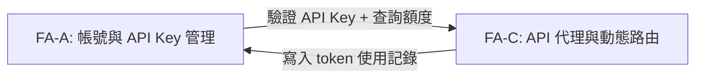
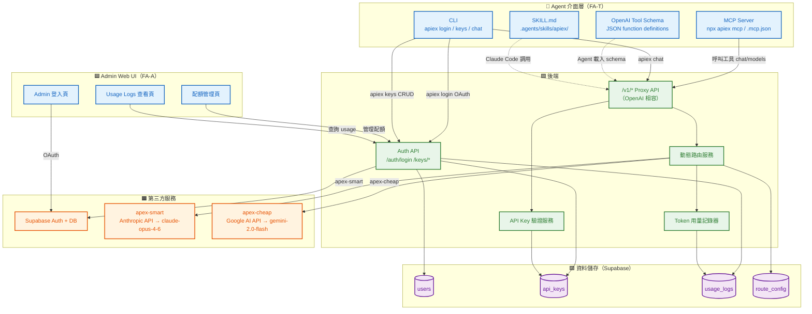
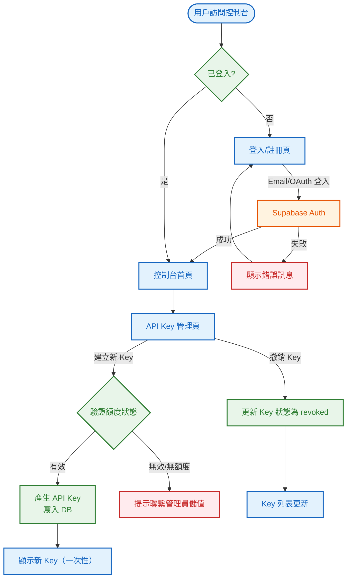
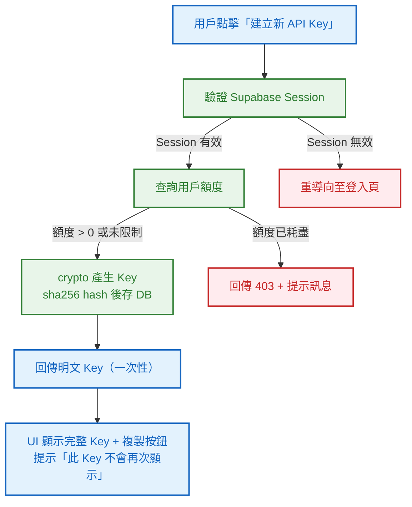
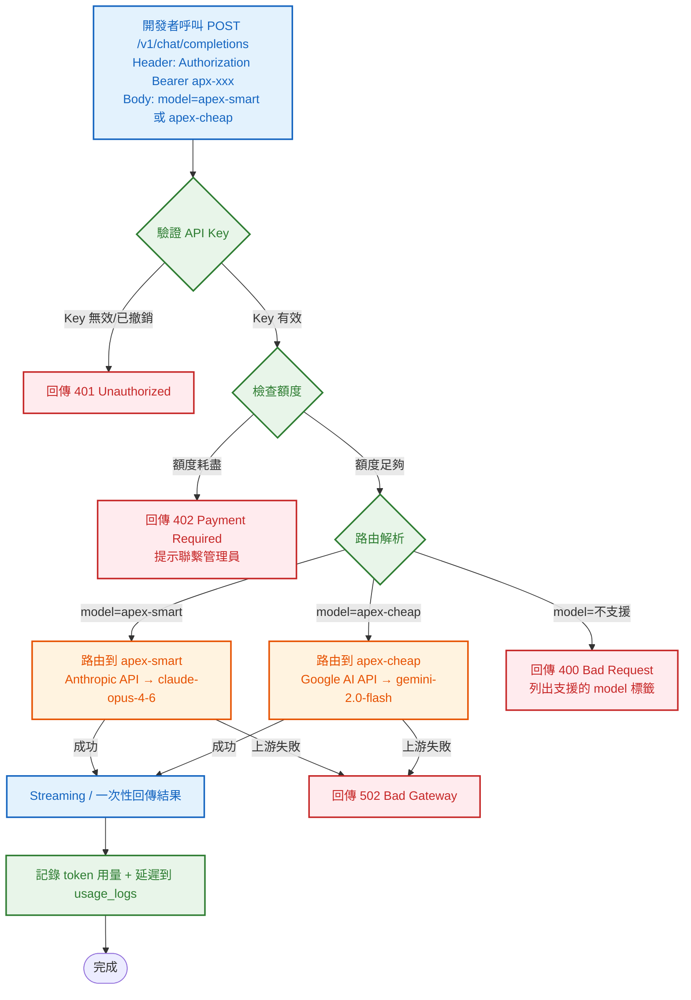
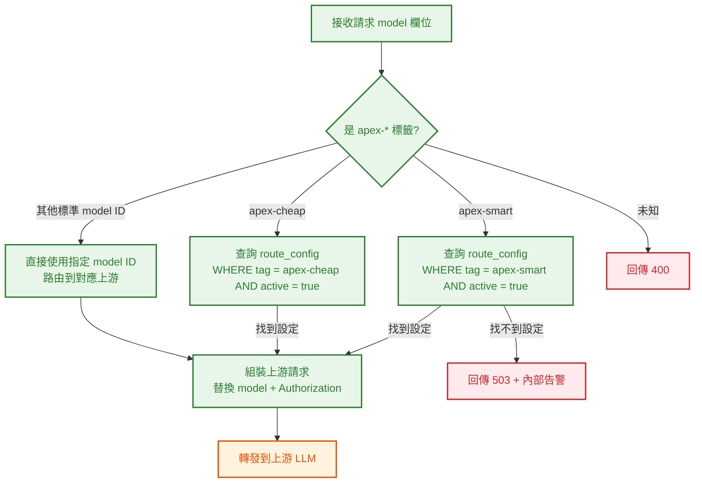
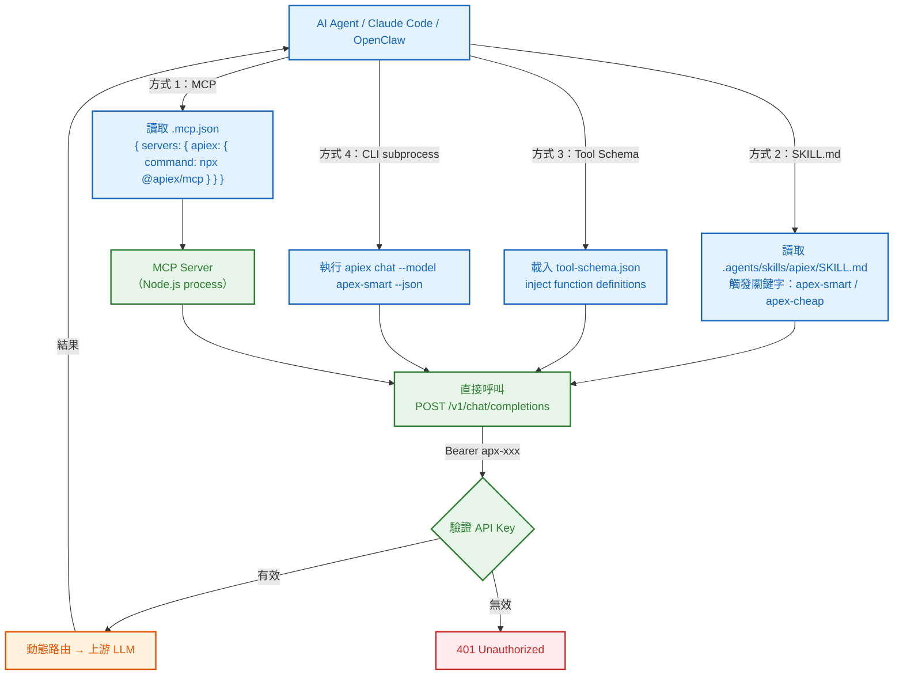
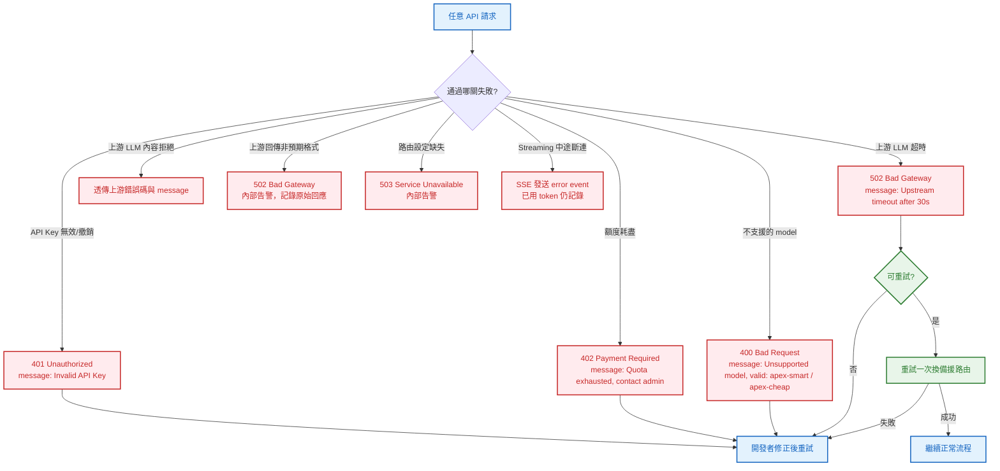

# S0 Brief Spec: Apiex Platform（MVP）

> **階段**: S0 需求討論
> **建立時間**: 2026-03-14 00:00
> **Agent**: requirement-analyst
> **Spec Mode**: Full Spec
> **工作類型**: new_feature

---

## 0. 工作類型

| 類型 | 代碼 | 說明 |
|------|------|------|
| 新需求 | `new_feature` | 全新功能或流程，S1 聚焦影響範圍+可複用元件 |

**本次工作類型**：`new_feature`

---

## 1. 一句話描述

Apiex 是一個 **Agent-first AI API 中轉平台**：`apiex login` 一行取得 Key，呼叫 `apex-smart` 自動路由到當前最強模型（`claude-opus-4-6`），呼叫 `apex-cheap` 路由到最省模型（`gemini-2.0-flash`）；平台打包成 MCP Server、CLI 工具、OpenAI Tool Schema 與 SKILL.md，讓 Claude Code / OpenClaw 等 Agent 零配置接入，人類管理員透過最小 Admin Web UI 管理配額與路由。

---

## 2. 為什麼要做

### 2.1 痛點

- **選擇障礙**：市面上 AI 模型百家爭鳴，開發者需耗費大量時間追蹤評測榜單、自行比較 CP 值，卻仍難以做出最優決策。
- **串接成本高**：每次模型迭代就需改動 SDK 設定、調整 API 格式，造成頻繁的整合維護成本。
- **缺乏單一入口**：沒有一個可信賴的「永遠用當下最好模型」的穩定抽象層，開發者只能自己維護模型切換邏輯。
- **透明度不足**：不知道每個請求實際花了多少 token、多少錢，難以控制 AI 使用成本。

### 2.2 目標

- 開發者替換 Base URL + API Key 後，零程式碼修改即可接入平台（Drop-in Replacement）。
- 透過 `apex-smart` / `apex-cheap` 路由標籤，讓平台承擔模型選型的認知負擔。
- 建立最小可交付閉環：用戶能完成帳號建立、取得 API Key、發出請求、收到正確回應。
- 平台維持「精英名單」機制，隨時可替換路由目標，用戶無需改任何程式碼。

---

## 3. 使用者

| 角色 | 介面 | 說明 |
|------|------|------|
| **AI Agent（主要）** | MCP Server / SKILL.md | Claude Code、OpenClaw 等 Agent 透過 MCP 工具或 Skill 直接呼叫 Apiex API，無需人工介入 |
| **開發者 / 腳本（次要）** | CLI (`apiex`) / OpenAI SDK | 用 `apiex login` 取得 Key，透過 CLI 或直接替換 base_url 呼叫；CI/CD 以 `APIEX_API_KEY` env var 注入 |
| **平台管理員（Admin）** | 最小 Admin Web UI | 維護路由設定、管理用戶配額（手動充值）、查看 usage_logs；此角色為人類（你自己） |

---

## 4. 核心流程

> **閱讀順序**：功能區拆解（理解全貌）→ 系統架構總覽（理解組成）→ 各功能區流程圖（對焦細節）→ 例外處理（邊界情境）

> 圖例：🟦 藍色 = 前端頁面/UI　｜　🟩 綠色 = 後端 API/服務　｜　🟧 橘色 = 第三方服務　｜　🟪 紫色 = 資料儲存　｜　🟥 紅色 = 例外/錯誤

### 4.0 功能區拆解（Functional Area Decomposition）

#### 功能區識別表

| FA ID | 功能區名稱 | 一句話描述 | 入口 | 獨立性 | MVP? |
|-------|-----------|-----------|------|--------|------|
| FA-A | 帳號與 API Key 管理 | `apiex login` OAuth 流程取得 Key，CLI 管理 Key 生命週期；最小 Admin Web UI 供管理員操作配額 | CLI / Admin Web | 高 | MVP |
| FA-C | API 代理與動態路由 | 接受 OpenAI 相容格式請求，根據 model 標籤路由到指定上游 LLM 並回傳結果 | API endpoint | 中 | MVP |
| FA-T | Agent 工具封裝 | 將 Apiex 打包成 MCP Server、CLI、OpenAI Tool Schema、SKILL.md 四種格式，讓 Agent 零配置接入 | npx / .mcp.json / SKILL.md | 高 | MVP |
| FA-B | 點數儲值與計費系統 | 金流充值、per-request 自動扣款、帳單記錄 | Admin / API | 中 | Phase 2 |
| FA-D | Analytics Dashboard | Token 用量圖表、延遲監控、帳單分析 | Admin Web | 中 | Phase 2 |

> **獨立性判斷**：高 = 可獨立開發部署、中 = 共用部分資料/元件但流程獨立、低 = 與其他 FA 緊密耦合

#### 拆解策略

| FA 數量 | 獨立性 | 建議策略 | 說明 |
|---------|--------|---------|------|
| 3（MVP） | 中~高 | **單 SOP + FA 標籤** | MVP 涵蓋 FA-A + FA-C + FA-T，一份 brief spec，S3 波次按 FA 分組 |

**本次策略**：`single_sop_fa_labeled`（MVP 範圍）

> Phase 2 的 FA-B、FA-D 將各自啟動獨立 SOP。

#### 跨功能區依賴



| 來源 FA | 目標 FA | 依賴類型 | 說明 |
|---------|---------|---------|------|
| FA-A | FA-C | 資料共用 | FA-C 每次請求需向 FA-A 驗證 API Key 有效性與額度狀態 |
| FA-C | FA-A | 事件觸發 | FA-C 請求完成後寫入 token 用量記錄，供 FA-A 顯示累計用量 |

---

### 4.1 系統架構總覽



**架構重點**：

| 層級 | 組件 | 職責 |
|------|------|------|
| **Agent 介面層** | MCP Server + CLI + Tool Schema + SKILL.md | Agent / 開發者的四種接入方式，統一對接後端 API |
| **Admin Web UI** | 最小 3 頁（登入、配額管理、Usage Logs） | 人類管理員操作，不對 Agent 暴露 |
| **後端** | Proxy API + Auth API + 路由服務 + 用量記錄器 | 核心業務邏輯，所有介面層的統一後端 |
| **第三方** | Supabase Auth、Anthropic API、Google AI API | 身份驗證 + 資料持久化、實際模型推論 |
| **資料** | users, api_keys, usage_logs, route_config | 用戶資料、Key 管理、用量記錄、路由設定 |

---

### 4.2 FA-A：帳號與 API Key 管理

> 本節涵蓋用戶從帳號建立到取得可用 API Key 的完整流程。

#### 4.2.1 全局流程圖



**技術細節補充**：
- API Key 建立後完整值**僅顯示一次**，之後只顯示遮罩（`apx-****...****`），遺失需重建。
- Key 儲存時以 hash 形式保存，不儲存明文。
- MVP 階段額度由管理員手動在 DB 設定，無自助儲值入口。

---

#### 4.2.2 API Key 建立子流程（局部）



---

#### 4.2.3 Happy Path 摘要（FA-A）

| 路徑 | 入口 | 結果 |
|------|------|------|
| **A：首次註冊取得 API Key** | 訪問控制台 → 點擊「註冊」→ Email / OAuth → 進入控制台 → 建立 API Key | 取得可用 API Key，複製後即可呼叫 Apiex API |
| **B：回訪登入** | 訪問控制台 → 已有帳號 → 登入 → 進入控制台 | 查看 Key 列表與遮罩值 |
| **C：撤銷失效 Key** | 控制台 Key 管理頁 → 點擊「撤銷」→ 確認 | Key 立即失效，後續請求回傳 401 |

---

### 4.3 FA-C：API 代理與動態路由

> 本節涵蓋開發者透過 API Key 呼叫 Apiex endpoint、系統路由到上游 LLM 並回傳結果的完整流程。

#### 4.3.1 全局流程圖



**技術細節補充**：
- `Authorization: Bearer {apiex_key}` 取代原本的 OpenAI Key，其他 request body 格式完全相容 OpenAI。
- 路由映射（`apex-smart` → 哪個上游 + 哪個 model）由 `route_config` 資料表控制，MVP 階段直接在 DB 設定，不需後台 UI。
- Streaming 回應透過 SSE（Server-Sent Events）透傳，格式與 OpenAI streaming 完全相同。
- token 用量記錄在回應完成後（或 stream 結束後）寫入，避免中途斷線造成記錄不一致。

---

#### 4.3.2 路由解析子流程（局部）



---

#### 4.3.3 Happy Path 摘要（FA-C）

| 路徑 | 入口 | 結果 |
|------|------|------|
| **A：apex-smart 請求** | POST /v1/chat/completions + model=apex-smart | 路由到當前最強模型，回傳 OpenAI 相容格式結果，記錄用量 |
| **B：apex-cheap 請求** | POST /v1/chat/completions + model=apex-cheap | 路由到當前最省模型，回傳結果，記錄用量 |
| **C：指定具體 model ID** | POST /v1/chat/completions + model=claude-3-opus-20240229 | 直接路由到指定模型（若平台支援），回傳結果 |
| **D：Streaming 模式** | 同上 + stream=true | SSE 格式逐 token 透傳，與 OpenAI streaming 行為完全一致 |

---

### 4.4 FA-T：Agent 工具封裝

> 本節涵蓋四種封裝格式的交付規格與 Agent 接入流程。

#### 4.4.1 四種封裝格式規格

| 格式 | 交付物 | 使用方式 | 目標 Agent/環境 |
|------|--------|---------|----------------|
| **MCP Server** | `packages/mcp-server/` Node.js 套件 | `npx @apiex/mcp` 或 `.mcp.json` 設定 | Claude Code、OpenClaw、任何 MCP-compatible Agent |
| **CLI** | `packages/cli/` 發佈至 npm | `npx apiex` / `brew install apiex` | 開發者終端、CI/CD 腳本、Agent subprocess |
| **OpenAI Tool Schema** | `dist/tool-schema.json` | Agent 動態載入 JSON，直接 inject 至 system prompt | 任何支援 function calling 的 Agent |
| **SKILL.md** | `.agents/skills/apiex/SKILL.md` | 放入 Agent repo 的 `.agents/skills/` 目錄 | Claude Code、此 repo 現有 Skill 系統 |

#### 4.4.2 MCP Server 工具清單

| Tool Name | 說明 | 輸入 | 輸出 |
|-----------|------|------|------|
| `apiex_chat` | 呼叫 apex-smart 或 apex-cheap 完成對話 | `model`, `messages`, `stream?` | OpenAI 相容 completion |
| `apiex_models` | 列出當前可用模型標籤與對應上游 | — | `[{tag, upstream_model, provider}]` |
| `apiex_usage` | 查詢當前 Key 的用量摘要 | `period?` | `{total_tokens, requests, quota_remaining}` |

#### 4.4.3 CLI 指令規格

```
apiex login                        # OAuth 流程 → 存 ~/.apiex/config.json
apiex logout                       # 清除本地憑證
apiex keys list                    # 列出所有 API Key（遮罩）
apiex keys create [--name <name>]  # 建立新 Key，一次性顯示明文
apiex keys revoke <key-id>         # 撤銷 Key
apiex chat --model apex-smart "prompt"  # 直接呼叫（快速測試用）
apiex status                       # 顯示配額與當前路由目標
```

> 所有指令支援 `--json` flag 輸出機器可讀格式，供 Agent subcommand 呼叫。

#### 4.4.4 Agent 接入流程圖



---

### 4.5 例外流程圖（跨 FA）



**技術細節補充**：
- 所有錯誤回應均使用 OpenAI 相容的 error 格式：`{ "error": { "message": "...", "type": "...", "code": "..." } }`
- 上游 timeout 預設 30 秒，streaming 模式放寬為 120 秒（因模型回應時間較長）。
- E_Stream 情境下，已完成的 token 用量仍寫入 usage_logs，但標記 `status: incomplete`。

---

### 4.5 六維度例外清單

| 維度 | ID | FA | 情境 | 觸發條件 | 預期行為 | 嚴重度 |
|------|-----|-----|------|---------|---------|--------|
| 並行/競爭 | E1 | FA-C | 同一 API Key 並發請求造成額度計數競爭 | 多個請求同時通過額度檢查，實際消耗超過額度上限 | 額度更新使用 DB 層 atomic 操作（如 UPDATE ... WHERE quota > 0），超出者回傳 402 | P1 |
| 並行/競爭 | E2 | FA-A | 用戶同時建立多個 API Key 的競爭 | 前端快速多次點擊「建立」 | 後端加 request deduplication 或 rate limit（同用戶 1 秒內限建 1 個） | P2 |
| 狀態轉換 | E3 | FA-A | API Key 被撤銷時，進行中的上游請求 | 撤銷操作發生在 proxy 已轉發到上游但尚未收到回應時 | 繼續等待上游回應並回傳，但 usage 仍記錄；後續請求以撤銷後狀態為準 | P1 |
| 狀態轉換 | E4 | FA-C | 路由設定（route_config）更新時進行中的請求 | 管理員更改 apex-smart 指向的模型，同時有請求正在處理 | 進行中請求使用舊路由完成，新請求使用新路由（read-at-start 語義） | P2 |
| 資料邊界 | E5 | FA-C | Prompt 超過上游模型 context window | 用戶傳送超長 prompt，上游回傳 400 context length exceeded | 透傳上游錯誤給開發者，附帶上游原始 error message，不扣款 | P1 |
| 資料邊界 | E6 | FA-C | 不同模型 tokenizer 差異導致計費基準不統一 | apex-smart / apex-cheap 指向不同廠商模型，token 定義不同 | 以上游回傳的 `usage.total_tokens` 為準記錄，換算成本時使用各模型獨立單價 | P2 |
| 資料邊界 | E7 | FA-A | API Key 格式驗證邊界 | 傳入空值、過短、含非法字元的 Key | Header 解析後立即回傳 401，不進入後續邏輯 | P2 |
| 網路/外部 | E8 | FA-C | 上游 LLM 服務超時（30s） | 上游超過 timeout 閾值未回應 | 回傳 502 + 錯誤訊息，嘗試重試一次；streaming 模式發送 SSE error event | P0 |
| 網路/外部 | E9 | FA-C | 上游 LLM 回傳非預期格式（非 OpenAI 相容） | 上游服務變更回應格式或回傳 HTML 錯誤頁 | 記錄原始回應到日誌，回傳 502 並觸發內部告警，不暴露原始錯誤給開發者 | P1 |
| 網路/外部 | E10 | FA-C | Streaming 回應中途上游斷連 | SSE 串流進行中，上游 TCP 連線斷開 | 發送 SSE `event: error` 通知開發者，已完成 token 記錄為 `status: incomplete` | P1 |
| 網路/外部 | E11 | FA-A | Supabase Auth/DB 服務不可用 | Supabase 發生故障，JWT 驗證或 DB 查詢失敗 | JWT 可用公鑰離線驗證（API Key 查詢失敗則降級回傳 503，避免無限等待） | P1 |
| 業務邏輯 | E12 | FA-C | 用戶額度為 0 或負數 | 手動充值系統下，管理員尚未設定額度或額度耗盡 | 回傳 402 Payment Required，附帶聯繫管理員的說明訊息 | P0 |
| 業務邏輯 | E13 | FA-C | 請求使用不支援的 model 名稱 | 開發者傳入 `model: gpt-99-turbo-ultra`（非平台支援標籤） | 回傳 400 Bad Request，列出有效 model 標籤（apex-smart / apex-cheap） | P1 |
| 業務邏輯 | E14 | FA-C | 路由設定缺失（route_config 無有效記錄） | 管理員誤刪或未設定 apex-smart 的路由目標 | 回傳 503 Service Unavailable，觸發內部告警（Slack / Email）給管理員 | P0 |
| UI/體驗 | E15 | FA-A | 用戶未複製 API Key 就關閉彈窗 | 建立 Key 後的「一次性顯示」彈窗被關閉 | 彈窗關閉前顯示二次確認：「你確定已複製 Key？關閉後無法再次查看。」 | P1 |
| UI/體驗 | E16 | FA-A | 用戶無 API Key 嘗試使用服務 | 新用戶未建立 Key 直接呼叫 API | 控制台顯示「你尚未建立 API Key」引導 CTA；API 層回傳標準 401 | P2 |

---

### 4.6 白話文摘要

Apiex MVP 讓開發者把 OpenAI SDK 的 `base_url` 換成我們的網址、把 `api_key` 換成從控制台建立的 Apiex Key，之後呼叫 `model: apex-smart` 就自動用最強的模型、`model: apex-cheap` 就自動用最省的。第一版手動充值，所以沒有自助儲值頁面，額度由管理員直接在後台設定。當上游 AI 服務出問題時，系統會回傳清楚的錯誤訊息讓開發者知道是平台問題，不是自己的程式碼有 bug；萬一額度用完，API 會立即拒絕請求並提示聯繫管理員，不會讓服務無聲無息地失敗。

---

## 5. 成功標準

| # | FA | 類別 | 標準 | 驗證方式 |
|---|-----|------|------|---------|
| 1 | FA-A | 功能 | 用戶可透過 Email / OAuth 完成註冊並進入控制台 | 手動測試：完整走一遍 Supabase Auth 流程 |
| 2 | FA-A | 功能 | 用戶可建立 API Key，明文僅顯示一次，之後遮罩 | 手動測試：建立 Key → 記錄 → 重新整理後確認遮罩 |
| 3 | FA-A | 功能 | 撤銷 Key 後，使用該 Key 的 API 請求立即回傳 401 | 自動化測試：撤銷 → 立即呼叫 → 預期 401 |
| 4 | FA-C | 功能 | 使用有效 Key + model=apex-smart 可收到正確 LLM 回應 | 自動化測試：E2E API 呼叫驗證 |
| 5 | FA-C | 功能 | 使用有效 Key + model=apex-cheap 可收到正確 LLM 回應 | 自動化測試：E2E API 呼叫驗證 |
| 6 | FA-C | 相容性 | OpenAI SDK 僅替換 base_url 和 api_key，零程式碼修改可呼叫成功 | 用官方 openai Python / Node SDK 實測 |
| 7 | FA-C | 功能 | Streaming 模式（stream=true）可正常透傳 SSE，格式與 OpenAI 相同 | 手動測試 + curl streaming 驗證 |
| 8 | FA-C | 可靠性 | 上游 LLM timeout（>30s）時，回傳 502 且不讓請求無限懸掛 | 模擬上游超時（mock server）+ 計時驗證 |
| 9 | FA-C | 可靠性 | 額度為 0 時，API 請求回傳 402，不透傳到上游 | 自動化測試：設額度=0 → 呼叫 → 預期 402 |
| 10 | 全域 | 記錄 | 每次成功/失敗請求均寫入 usage_logs，含 token 用量與延遲 | DB 查詢驗證：呼叫後確認 usage_logs 有記錄 |

---

## 6. 範圍

### 範圍內（MVP）

**FA-A：帳號與 API Key 管理**
- `apiex login` CLI OAuth 流程 → 存入 `~/.apiex/config.json`
- `apiex keys` CLI CRUD（create / list / revoke）
- 最小 Admin Web UI：登入頁 + 配額管理頁 + Usage Logs 查看頁（共 3 頁）
- 所有 CLI 指令支援 `--json` 機器可讀輸出

**FA-C：API 代理與動態路由**
- OpenAI 相容 `/v1/chat/completions` endpoint
- `apex-smart`（Anthropic API → `claude-opus-4-6`）/ `apex-cheap`（Google AI API → `gemini-2.0-flash`）動態路由
- Streaming（SSE）與非 Streaming 兩種模式
- Token 用量記錄（usage_logs）
- API 層額度檢查（管理員透過 Admin UI 手動設定配額）
- 統一 OpenAI 相容錯誤格式（`--json` 友好）

**FA-T：Agent 工具封裝**
- MCP Server（`@apiex/mcp`，工具：`apiex_chat` / `apiex_models` / `apiex_usage`）
- CLI 執行檔（`apiex`，發佈至 npm）
- OpenAI Tool Schema JSON（`dist/tool-schema.json`）
- SKILL.md（`.agents/skills/apiex/SKILL.md`）
- `.mcp.json` 範例設定檔

### 範圍外（Phase 2）

- FA-B：金流自助儲值（Stripe 串接）
- FA-B：自動計費扣款系統
- FA-D：Analytics Dashboard（圖表、延遲監控、帳單分析）
- 自訂 Rate Limit 規則（Pro 訂閱制）
- 多 workspace / 團隊協作
- per-key spend limit
- Webhook / 用量通知
- Agent SDK（Python / Node 原生 wrapper，Phase 2 錦上添花）

---

## 7. 已知限制與約束

- **手動充值限制**：MVP 無自助儲值，開發者額度需管理員直接操作 DB 設定，擴展性受限。
- **無 Admin UI**：路由設定、額度管理均直接操作 Supabase DB，需技術人員執行。
- **無 Dashboard**：開發者只能看到靜態累計用量數字，無法查看歷史趨勢或帳單明細（Phase 2）。
- **後端技術棧待定**：S1 architect 決定，MVP 優先考慮開發速度，建議 Monolith（詳見 §9 方案比較）。
- **部署待定**：Fly.io 或 Render，MVP 階段不做 auto-scaling 規劃。
- **上游模型設定**：MVP 的 apex-smart / apex-cheap 路由目標需在 DB 手動設定，不支援熱更新 UI。
- **Supabase 依賴**：Auth 與 DB 均依賴 Supabase，若 Supabase 故障影響範圍包含 Auth 驗證與 Key 查詢（降級策略見 E11）。

---

## 8. 前端 UI 畫面清單

### 8.1 FA-A：帳號與 API Key 管理 畫面

| # | 畫面 | 狀態 | 既有檔案 | 變更說明 |
|---|------|------|---------|---------|
| 1 | **登入/註冊頁** | 新增 | — | Supabase Auth UI，支援 Email + OAuth |
| 2 | **控制台首頁** | 新增 | — | 歡迎訊息 + 用量概覽（累計 token 數） + 導航 |
| 3 | **API Key 管理頁** | 新增 | — | Key 列表（遮罩顯示）、建立 Key、撤銷 Key |
| 4 | **API Key 建立確認彈窗** | 新增 | — | 一次性顯示明文 Key + 複製按鈕 + 二次確認關閉 |

### 8.2 全域元件

| # | 畫面 | 狀態 | 既有檔案 | 變更說明 |
|---|------|------|---------|---------|
| 5 | **側邊欄/頂部導航** | 新增 | — | 控制台共用導航，含登出 |

### 8.3 Alert / 彈窗清單

| # | Alert | FA | 狀態 | 觸發場景 | 內容摘要 |
|---|-------|-----|------|---------|---------|
| A1 | **API Key 一次性顯示彈窗** | FA-A | 新增 | 建立 Key 成功後 | 顯示完整 Key、複製按鈕、「此 Key 不會再次顯示」警告 |
| A2 | **關閉 Key 彈窗二次確認** | FA-A | 新增 | 用戶嘗試關閉 A1 彈窗 | 「確定已複製 API Key？關閉後將無法再次查看。」[確認關閉] [返回複製] |
| A3 | **額度耗盡提示** | FA-A | 新增 | 額度為 0 時嘗試建立 Key 或 API 回傳 402 | 「你的額度已用完，請聯繫管理員充值。」 |
| A4 | **撤銷 Key 確認** | FA-A | 新增 | 點擊「撤銷」按鈕 | 「撤銷後此 Key 立即失效，且不可恢復。確認撤銷？」 |

### 8.4 畫面統計摘要

| 類別 | 數量 | 說明 |
|------|------|------|
| 新增畫面 | **5** | 登入/註冊頁、控制台首頁、API Key 管理頁、建立確認彈窗、導航元件 |
| 既有修改畫面 | **0** | 全新專案 |
| 不動畫面 | **0** | 全新專案 |
| 新增 Alert | **4** | A1~A4 |
| 既有修改 Alert | **0** | — |

### 8.5 元件復用規劃

| 共用元件 | 使用 FA / 場景 | 說明 |
|---------|---------------|------|
| **ApiKeyCard** | FA-A（列表顯示、撤銷） | 顯示遮罩 Key + 撤銷按鈕，接收 key 物件與 onRevoke callback |
| **CopyableTextField** | FA-A（建立彈窗）、Phase 2 其他場景 | 文字欄位 + 一鍵複製按鈕，支援複製後顯示「已複製」反饋 |
| **ConfirmDialog** | FA-A（撤銷確認、關閉彈窗確認） | 通用確認對話框，接收 title / message / onConfirm |

---

## 9. 補充說明

### 架構方案比較（供 S1 Architect 參考）

MVP 的核心是「API Proxy + Auth」，架構選型直接影響開發速度與後期擴展性。

| 方案 | 描述 | 優點 | 缺點 | MVP 適合度 |
|------|------|------|------|-----------|
| **方案 A：Monolith（推薦 MVP）** | 單一後端服務（如 Node.js/Express 或 Python/FastAPI），同時處理 Auth API、Proxy、用量記錄 | 開發快、部署簡單、除錯容易、無跨服務網路延遲 | 後期 Proxy 和業務邏輯混在一起，需刻意維持模組邊界 | 高 |
| **方案 B：Edge Function as Proxy + 傳統 Backend** | Proxy 層跑在 Edge（Cloudflare Workers / Vercel Edge），Auth/業務跑傳統 Server | Proxy 延遲極低（靠近用戶）、Proxy 可獨立擴展 | Edge Function 執行時間限制可能影響 streaming；複雜度較高；streaming 在 Edge 有坑 | 中 |
| **方案 C：Microservice** | Proxy Service + Auth Service + Usage Service 各自獨立部署 | 關注點分離、可獨立擴展 | MVP 過度工程、運維成本高、服務間通訊複雜度高 | 低 |

**S0 建議**：方案 A（Monolith）作為 MVP，但設計上將 Proxy 邏輯、Auth 邏輯、Usage 邏輯放入不同模組（獨立目錄/檔案），保留未來拆分的可能。方案 B 的 Edge Function 留到 Phase 2 評估（當延遲成為瓶頸時）。

### 資料模型初步設計

```
users（由 Supabase Auth 管理）
  - id (uuid, PK)
  - email
  - created_at

api_keys
  - id (uuid, PK)
  - user_id (FK -> users.id)
  - key_hash (text, 儲存 sha256 hash)
  - key_prefix (text, 顯示用遮罩，如 "apx-abc1")
  - name (text, 用戶自訂名稱)
  - status (enum: active | revoked)
  - quota_tokens (bigint, 剩餘 token 配額，-1 = 無限制)
  - created_at
  - revoked_at

usage_logs
  - id (uuid, PK)
  - api_key_id (FK -> api_keys.id)
  - model_tag (text, "apex-smart" | "apex-cheap")
  - upstream_model (text, 實際路由到的模型名稱)
  - prompt_tokens (int)
  - completion_tokens (int)
  - total_tokens (int)
  - latency_ms (int)
  - status (enum: success | incomplete | error)
  - created_at

route_config
  - id (uuid, PK)
  - tag (text, "apex-smart" | "apex-cheap")
  - upstream_provider (text, "anthropic" | "google" | "openai")
  - upstream_model (text, 實際模型 ID)
    -- apex-smart 初始值：claude-opus-4-6
    -- apex-cheap 初始值：gemini-2.0-flash
  - upstream_base_url (text)
    -- anthropic: https://api.anthropic.com/v1
    -- google: https://generativelanguage.googleapis.com/v1beta/openai
  - is_active (boolean)
  - updated_at
```

### 預計 MVP 交付物

1. **後端 API Server**（Monolith：Proxy + Auth API + Admin API）
2. **最小 Admin Web UI**（3 頁：登入、配額管理、Usage Logs）
3. **MCP Server**（`packages/mcp-server/`，發佈 `@apiex/mcp`）
4. **CLI 執行檔**（`packages/cli/`，發佈 `apiex`）
5. **OpenAI Tool Schema**（`dist/tool-schema.json`）
6. **SKILL.md**（`.agents/skills/apiex/SKILL.md`）
7. **Supabase DB Schema + RLS 設定**
8. **本地開發 + 部署設定**（Fly.io 或 Render）
9. **README**（Agent 接入指南 + CLI 快速開始）
10. **`.mcp.json` 範例**（一行接入 Claude Code）

---

## 10. SDD Context

```json
{
  "sdd_context": {
    "stages": {
      "s0": {
        "status": "pending_confirmation",
        "agent": "requirement-analyst",
        "output": {
          "brief_spec_path": "dev/specs/apiex-platform/s0_brief_spec.md",
          "work_type": "new_feature",
          "requirement": "建立 Apiex AI API 中轉平台 MVP，讓開發者只需替換 Base URL 與 API Key，即可透過 apex-smart/apex-cheap 路由標籤使用平台嚴選的頂尖 AI 模型，第一版以 Supabase Auth 管理帳號與 API Key，手動充值維持最小交付閉環",
          "pain_points": [
            "市面上 AI 模型選擇過多，開發者有選擇困難",
            "各 API 格式不同，每次模型迭代都要改 SDK 設定",
            "沒有可信賴的「永遠用當下最好模型」的穩定抽象層",
            "不知道每個請求實際花了多少 token、多少錢"
          ],
          "goal": "建立最小可交付閉環：帳號建立 + API Key 取得 + Drop-in Replacement API 呼叫成功 + apex-smart/cheap 路由正確",
          "success_criteria": [
            "OpenAI SDK 僅替換 base_url 和 api_key，零程式碼修改可呼叫成功",
            "apex-smart / apex-cheap 路由到正確上游模型",
            "Streaming 模式格式與 OpenAI 完全相容",
            "上游 timeout 時回傳 502，不讓請求無限懸掛",
            "額度為 0 時回傳 402，不透傳到上游",
            "所有請求（成功/失敗）均寫入 usage_logs"
          ],
          "scope_in": [
            "FA-A：Supabase Auth 帳號系統",
            "FA-A：API Key 建立、列表、撤銷",
            "FA-C：OpenAI 相容 /v1/chat/completions endpoint",
            "FA-C：apex-smart / apex-cheap 動態路由",
            "FA-C：Streaming SSE 透傳",
            "FA-C：手動充值額度檢查",
            "全域：統一 OpenAI 相容錯誤格式"
          ],
          "scope_out": [
            "FA-B：Stripe 金流自助儲值",
            "FA-D：Analytics Dashboard",
            "FA-E：模型管理 Admin UI",
            "Pro 訂閱制與 Rate Limit 差異化",
            "多 workspace / 團隊協作",
            "Webhook / 用量通知"
          ],
          "constraints": [
            "Auth 使用 Supabase（Auth + DB 一體）",
            "MVP 金流跳過，手動充值",
            "後端技術棧由 S1 architect 決定",
            "部署目標 Fly.io 或 Render（待 S1 確定）",
            "無 Admin UI，路由設定直接操作 DB"
          ],
          "functional_areas": [
            {
              "id": "FA-A",
              "name": "帳號與 API Key 管理",
              "description": "用戶透過 Supabase Auth 註冊/登入，並建立、查看、撤銷 API Key",
              "independence": "high"
            },
            {
              "id": "FA-C",
              "name": "API 代理與動態路由",
              "description": "接受 OpenAI 相容格式請求，根據 model 標籤路由到指定上游 LLM 並回傳結果",
              "independence": "medium"
            }
          ],
          "decomposition_strategy": "single_sop_fa_labeled",
          "child_sops": []
        }
      }
    }
  }
}
```
