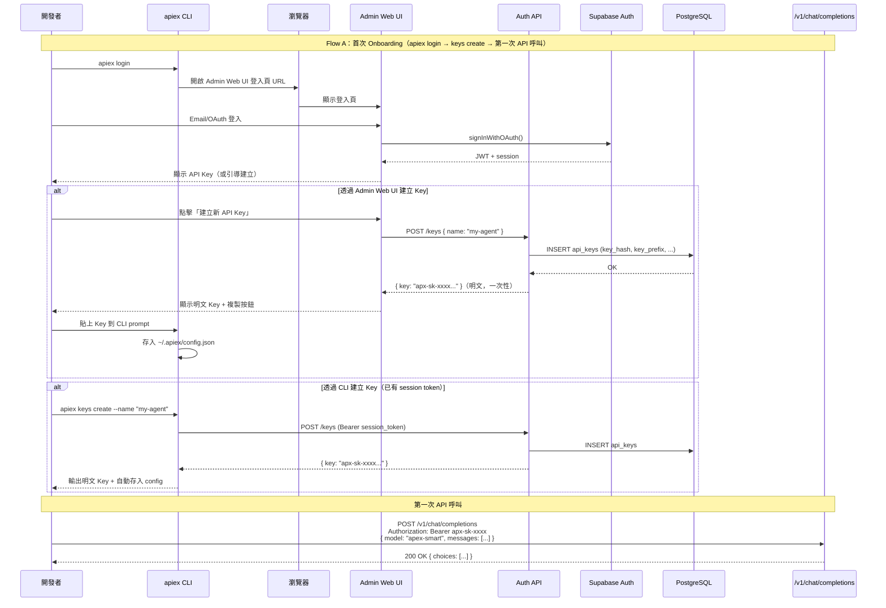
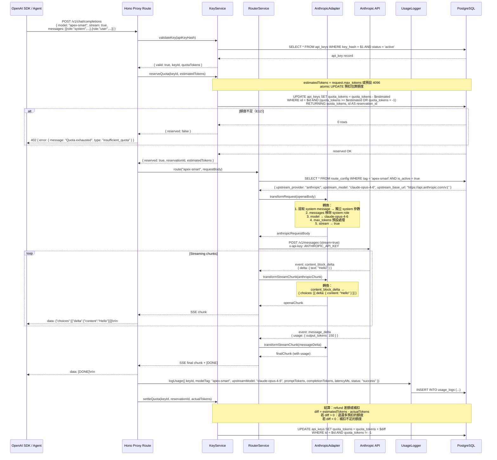
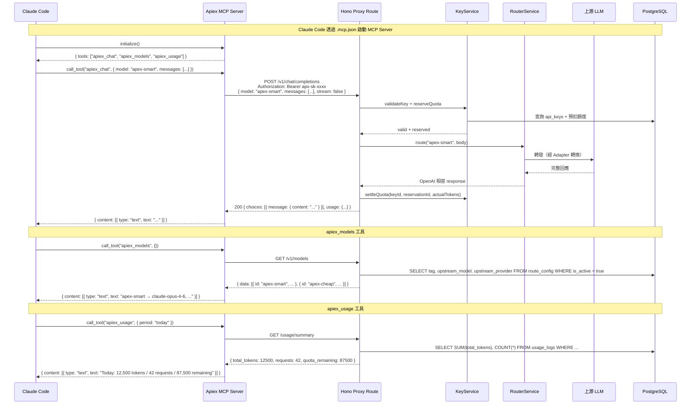
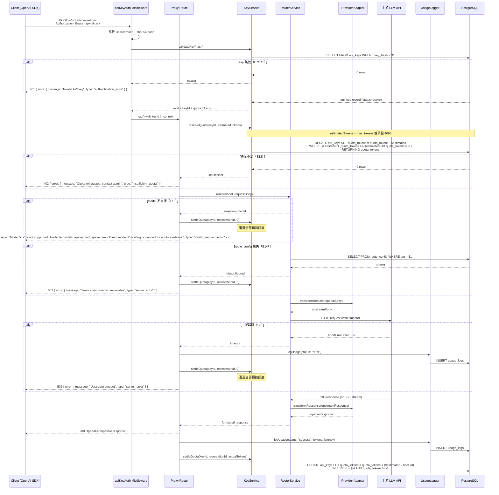

# S1 Dev Spec: Apiex Platform (MVP)

> **階段**: S1 技術分析
> **建立時間**: 2026-03-14 03:00
> **最後修訂**: 2026-03-14 21:50（S2 R3 裁決修正）
> **Agent**: codebase-explorer (Phase 1) + architect (Phase 2)
> **工作類型**: new_feature
> **複雜度**: L

---

## 1. 概述

### 1.1 需求參照
> 完整需求見 `s0_brief_spec.md`，以下僅摘要。

Apiex 是 Agent-first AI API 中轉平台：開發者替換 `base_url` + `api_key`，透過 `apex-smart` / `apex-cheap` 路由標籤呼叫平台嚴選的頂尖 AI 模型，平台打包成 MCP Server、CLI、OpenAI Tool Schema、SKILL.md 四種格式供 Agent 零配置接入。

### 1.2 技術方案摘要

採用 **pnpm workspaces + turborepo** monorepo 架構，分為四個 packages：`api-server`（Hono + Node.js）、`web-admin`（Next.js + shadcn/ui）、`cli`（commander.js）、`mcp-server`（@modelcontextprotocol/sdk）。後端為 Monolith，透過 **AnthropicAdapter** 與 **GeminiAdapter** 兩個 provider adapter 將上游異質格式正規化為 OpenAI 相容格式，以 Hono `c.streamText()` 實作 SSE streaming proxy。資料層使用 Supabase PostgreSQL，API Key 驗證走 sha256 hash lookup，額度管理採用**樂觀預扣（optimistic reserve）機制**——請求開始時預扣估算額度，完成後結算實際用量。部署至 Fly.io（API server）+ Vercel（Admin Web UI）。

---

## 2. 影響範圍（Phase 1：codebase-explorer）

### 2.1 受影響檔案

#### Frontend (Next.js + shadcn/ui)
| 檔案 | 變更類型 | 說明 |
|------|---------|------|
| `packages/web-admin/src/app/login/page.tsx` | 新增 | Admin 登入頁，整合 Supabase Auth UI |
| `packages/web-admin/src/app/dashboard/page.tsx` | 新增 | 配額管理頁，顯示用戶列表 + 配額設定 |
| `packages/web-admin/src/app/logs/page.tsx` | 新增 | Usage Logs 查看頁，含篩選與分頁 |
| `packages/web-admin/src/components/ApiKeyCard.tsx` | 新增 | Key 卡片元件（遮罩顯示 + 撤銷按鈕） |
| `packages/web-admin/src/components/CopyableTextField.tsx` | 新增 | 文字欄位 + 一鍵複製 |
| `packages/web-admin/src/components/ConfirmDialog.tsx` | 新增 | 通用確認對話框 |

#### Backend (Node.js + Hono)
| 檔案 | 變更類型 | 說明 |
|------|---------|------|
| `packages/api-server/src/index.ts` | 新增 | Hono app 進入點 + 路由註冊 |
| `packages/api-server/src/routes/proxy.ts` | 新增 | `/v1/chat/completions` proxy route |
| `packages/api-server/src/routes/auth.ts` | 新增 | `/auth/*` 認證相關 routes |
| `packages/api-server/src/routes/keys.ts` | 新增 | `/keys/*` API Key CRUD routes |
| `packages/api-server/src/routes/admin.ts` | 新增 | `/admin/*` 管理員 routes |
| `packages/api-server/src/services/KeyService.ts` | 新增 | API Key 生成、驗證、CRUD、樂觀預扣額度管理 |
| `packages/api-server/src/services/RouterService.ts` | 新增 | route_config 查詢、上游派發、adapter 調用 |
| `packages/api-server/src/services/UsageLogger.ts` | 新增 | usage_logs 寫入 |
| `packages/api-server/src/adapters/AnthropicAdapter.ts` | 新增 | OpenAI <-> Anthropic 雙向格式轉換 + streaming 正規化 |
| `packages/api-server/src/adapters/GeminiAdapter.ts` | 新增 | Google AI OpenAI 相容層正規化 |
| `packages/api-server/src/adapters/types.ts` | 新增 | Adapter 介面定義 |
| `packages/api-server/src/middleware/apiKeyAuth.ts` | 新增 | API Key 驗證 middleware |
| `packages/api-server/src/middleware/adminAuth.ts` | 新增 | Admin JWT 驗證 middleware |
| `packages/api-server/src/lib/supabase.ts` | 新增 | Supabase client 初始化 |
| `packages/api-server/src/lib/errors.ts` | 新增 | OpenAI 相容錯誤格式工具函式 |
| `packages/mcp-server/src/index.ts` | 新增 | MCP Server 進入點，註冊 3 個 tools |
| `packages/cli/src/index.ts` | 新增 | CLI 進入點 |
| `packages/cli/src/commands/login.ts` | 新增 | `apiex login` 指令 |
| `packages/cli/src/commands/keys.ts` | 新增 | `apiex keys` 指令群 |
| `packages/cli/src/commands/chat.ts` | 新增 | `apiex chat` 指令 |
| `packages/cli/src/commands/status.ts` | 新增 | `apiex status` 指令 |

#### Database (Supabase PostgreSQL)
| 資料表 | 變更類型 | 說明 |
|--------|---------|------|
| `users` | 既有（Supabase Auth） | Supabase Auth 自動管理 |
| `api_keys` | 新增 | API Key 儲存（sha256 hash）、狀態、配額 |
| `user_quotas` | 新增 | 用戶級別預設配額設定（SR-P1-006 修正） |
| `usage_logs` | 新增 | 請求用量記錄 |
| `route_config` | 新增 | 路由標籤對應上游設定 |

### 2.2 依賴關係
- **上游依賴**: Supabase Auth + PostgreSQL、Anthropic API (`api.anthropic.com/v1`)、Google AI API (`generativelanguage.googleapis.com/v1beta/openai`)、`@modelcontextprotocol/sdk`
- **下游影響**: OpenAI SDK 相容用戶、Claude Code / OpenClaw（MCP 消費者）、CI/CD 腳本（CLI 消費者）

### 2.3 現有模式與技術考量
全新專案，無既有 codebase 限制。Monorepo 結構需確保四個 packages 之間共用 TypeScript 設定與 lint 規則。

---

## 3. User Flow（Phase 2：architect）

### 3.1 Flow A：Agent/開發者 Onboarding



### 3.2 Flow B：apex-smart 請求完整鏈路（含樂觀預扣 + AnthropicAdapter + Streaming）



### 3.3 Flow C：MCP Server 接入



### 3.4 異常流程

> 每個例外情境引用 S0 的 E{N} 編號，確保追溯。

| S0 ID | 情境 | 觸發條件 | 系統處理 | 用戶看到 |
|-------|------|---------|---------|---------|
| E1 | 並發額度競爭 | 同一 Key 多個並發請求同時預扣額度 | PostgreSQL atomic UPDATE 預扣（`WHERE quota_tokens >= $estimated OR quota_tokens = -1`），預扣失敗者 RETURNING 0 rows | 402 Payment Required |
| E3 | Key 撤銷時進行中請求 | 撤銷操作發生在 proxy 已轉發上游 | 進行中請求繼續完成，usage 仍記錄，後續請求回 401 | 當前請求正常回應，之後 401 |
| E5 | Prompt 超出 context window | 上游回傳 400 context length exceeded | 透傳上游錯誤，退還預扣額度 | 400 + 上游原始 error message |
| E8 | 上游 LLM 超時 | 上游 >30s（streaming >120s）未回應 | 回傳 502，記錄 usage_logs status=error，退還預扣額度。**[S0 Scope 變更]** S0 E8 原始定義包含「嘗試重試一次」，經架構評估 MVP 不實作自動重試，原因：(a) MVP 每個 tag 僅一個 upstream，無備援路由可切換；(b) Streaming 場景的重試涉及 client-side rollback，複雜度過高。延至 Phase 2 與備援路由機制一併實作。 | 502 Bad Gateway + timeout message |
| E9 | 上游回傳非預期格式 | 上游回傳 HTML 或非 JSON | 記錄原始回應到 log，回傳 502，退還預扣額度 | 502 Bad Gateway |
| E10 | Streaming 中途斷連 | SSE 進行中上游 TCP 斷開 | 發送 SSE error event，以已接收的 tokens 結算（settleQuota 使用實際已消耗量），usage_logs 記錄 status=incomplete | SSE error event |
| E11 | Supabase 不可用 | Supabase 故障 | API Key 查詢失敗回 503。Admin JWT 離線驗證延至 Phase 2——MVP 階段 Supabase 不可用時 Admin 和 Proxy 均回 503 | 503 Service Unavailable |
| E12 | 額度不足 | 預扣估算額度時 quota_tokens 不足 | reserveQuota 失敗回傳 402，不透傳上游 | 402 + "Quota exhausted, contact admin" |
| E13 | 不支援的 model | 傳入非 apex-smart/apex-cheap 且非平台支援 | 回傳 400，列出有效標籤 + 提示 MVP 不支援直接 model ID。**[S0 Scope 變更]** S0 FA-C Happy Path C 定義了「指定具體 model ID 直接路由」功能。MVP 階段僅支援 `apex-smart` / `apex-cheap` 兩個路由標籤，不支援直接指定 model ID。原因：passthrough 需要 provider 推斷邏輯與額外的權限控制，延至 Phase 2。錯誤訊息格式：`{ "error": { "message": "Model 'xxx' is not supported. Available models: apex-smart, apex-cheap. Direct model ID routing is planned for a future release.", "type": "invalid_request_error" } }` | 400 + 有效 model 列表 + MVP 不支援直接 model ID 提示 |
| E14 | route_config 缺失 | 管理員未設定或誤刪 | 回傳 503，觸發內部告警，退還預扣額度 | 503 Service Unavailable |
| E15 | 未複製 Key 就關閉彈窗 | 關閉一次性 Key 顯示彈窗 | 二次確認對話框 | 「確定已複製？關閉後無法再次查看」 |

### 3.5 S0 -> S1 例外追溯表

| S0 ID | 維度 | S0 描述 | S1 處理位置 | 覆蓋狀態 |
|-------|------|---------|-----------|---------|
| E1 | 並行/競爭 | 同一 Key 並發額度競爭 | KeyService.reserveQuota() atomic SQL 預扣 | 覆蓋 |
| E2 | 並行/競爭 | 快速多次建立 Key | Keys Route rate limit middleware | 覆蓋 |
| E3 | 狀態轉換 | Key 撤銷時進行中請求 | Proxy Route read-at-start 語義 | 覆蓋 |
| E4 | 狀態轉換 | route_config 更新時進行中請求 | RouterService read-at-start 語義 | 覆蓋 |
| E5 | 資料邊界 | Prompt 超出 context window | Adapter 透傳上游錯誤 + settleQuota 退還 | 覆蓋 |
| E6 | 資料邊界 | 不同 tokenizer 計費差異 | 以上游回傳 usage.total_tokens 為準（settleQuota 結算） | 覆蓋 |
| E7 | 資料邊界 | API Key 格式驗證 | apiKeyAuth middleware 前置檢查 | 覆蓋 |
| E8 | 網路/外部 | 上游超時 | RouterService AbortController timeout + settleQuota 退還。**MVP 不實作重試，延至 Phase 2** | 覆蓋（scope 變更已標註） |
| E9 | 網路/外部 | 上游非預期格式 | Adapter try-catch + 502 fallback + settleQuota 退還 | 覆蓋 |
| E10 | 網路/外部 | Streaming 中途斷連 | Proxy Route stream error handler + settleQuota 以已接收 tokens 結算 | 覆蓋 |
| E11 | 網路/外部 | Supabase 不可用 | lib/supabase.ts connection error → 503。Admin JWT 離線驗證延至 Phase 2 | 覆蓋（P2 技術債已標註） |
| E12 | 業務邏輯 | 額度為 0 | KeyService.reserveQuota() → 402 | 覆蓋 |
| E13 | 業務邏輯 | 不支援的 model | RouterService model validation → 400（含 scope 變更標註） | 覆蓋（scope 變更已標註） |
| E14 | 業務邏輯 | route_config 缺失 | RouterService → 503 + console.error + settleQuota 退還 | 覆蓋 |
| E15 | UI/體驗 | 未複製 Key 就關閉彈窗 | ConfirmDialog 二次確認 | 覆蓋 |
| E16 | UI/體驗 | 無 Key 嘗試使用 | apiKeyAuth → 401；Admin UI 引導 CTA | 覆蓋 |

---

## 4. Data Flow

### 4.1 核心 Proxy Data Flow（含樂觀預扣 + 錯誤路徑）



### 4.2 API 契約

> 完整 API 規格（Request/Response/Error Codes）見 [`s1_api_spec.md`](./s1_api_spec.md)。

**Endpoint 摘要**

| Method | Path | 說明 | Auth |
|--------|------|------|------|
| `POST` | `/v1/chat/completions` | OpenAI 相容 proxy（核心） | API Key |
| `GET` | `/v1/models` | 列出可用模型標籤 | API Key |
| `POST` | `/auth/login` | 用 Supabase JWT 換取身份確認 + is_admin 狀態 | Supabase JWT |
| `POST` | `/auth/logout` | MVP 保留作為 API 存在（實際登出由前端清除本地 token）| Supabase JWT |
| `GET` | `/keys` | 列出用戶的 API Keys（遮罩） | Supabase JWT |
| `POST` | `/keys` | 建立新 API Key | Supabase JWT |
| `DELETE` | `/keys/:id` | 撤銷 API Key | Supabase JWT |
| `GET` | `/usage/summary` | 查詢用量摘要 | API Key / Supabase JWT |
| `GET` | `/admin/users` | 列出所有用戶（Admin） | Admin JWT |
| `PATCH` | `/admin/users/:id/quota` | 設定用戶預設配額模板 + 更新所有 active keys（Admin） | Admin JWT |
| `GET` | `/admin/usage-logs` | 查詢全域 usage logs（Admin） | Admin JWT |

### 4.3 資料模型

#### api_keys
```sql
CREATE TABLE api_keys (
  id UUID PRIMARY KEY DEFAULT gen_random_uuid(),
  user_id UUID NOT NULL REFERENCES auth.users(id),
  key_hash TEXT NOT NULL,
  key_prefix TEXT NOT NULL,        -- "apx-sk-abc1" 用於顯示
  name TEXT DEFAULT '',
  status TEXT NOT NULL DEFAULT 'active' CHECK (status IN ('active', 'revoked')),
  quota_tokens BIGINT NOT NULL DEFAULT -1,  -- -1 = 無限制
  created_at TIMESTAMPTZ NOT NULL DEFAULT now(),
  revoked_at TIMESTAMPTZ,
  CONSTRAINT uk_api_keys_key_hash UNIQUE (key_hash)
);

CREATE INDEX idx_api_keys_user_id ON api_keys(user_id);
```

#### user_quotas
> **SR-P1-006 修正**：新增 `user_quotas` 表，明確記錄管理員為用戶設定的預設配額。新建 API Key 時繼承此值。選擇獨立表而非 `auth.users.raw_user_metadata`，原因：業務數據不應混入 Supabase Auth 元資料。

```sql
CREATE TABLE user_quotas (
  user_id UUID PRIMARY KEY REFERENCES auth.users(id),
  default_quota_tokens BIGINT NOT NULL DEFAULT -1,  -- -1 = 無限制（管理員未設定前的預設值）
  updated_at TIMESTAMPTZ NOT NULL DEFAULT now(),
  updated_by UUID REFERENCES auth.users(id)          -- 設定此配額的管理員
);
```

#### usage_logs
```sql
CREATE TABLE usage_logs (
  id UUID PRIMARY KEY DEFAULT gen_random_uuid(),
  api_key_id UUID NOT NULL REFERENCES api_keys(id),
  model_tag TEXT NOT NULL,
  upstream_model TEXT NOT NULL,
  prompt_tokens INTEGER NOT NULL DEFAULT 0,
  completion_tokens INTEGER NOT NULL DEFAULT 0,
  total_tokens INTEGER NOT NULL DEFAULT 0,
  latency_ms INTEGER NOT NULL DEFAULT 0,
  status TEXT NOT NULL DEFAULT 'success' CHECK (status IN ('success', 'incomplete', 'error')),
  created_at TIMESTAMPTZ NOT NULL DEFAULT now()
);

CREATE INDEX idx_usage_logs_api_key_id ON usage_logs(api_key_id);
CREATE INDEX idx_usage_logs_created_at ON usage_logs(created_at);
```

#### route_config
```sql
CREATE TABLE route_config (
  id UUID PRIMARY KEY DEFAULT gen_random_uuid(),
  tag TEXT NOT NULL,                    -- "apex-smart" | "apex-cheap"
  upstream_provider TEXT NOT NULL,      -- "anthropic" | "google"
  upstream_model TEXT NOT NULL,         -- "claude-opus-4-6" | "gemini-2.0-flash"
  upstream_base_url TEXT NOT NULL,
  is_active BOOLEAN NOT NULL DEFAULT true,
  updated_at TIMESTAMPTZ NOT NULL DEFAULT now()
);

CREATE UNIQUE INDEX idx_route_config_tag_active ON route_config(tag) WHERE is_active = true;
```

#### RLS 政策
```sql
-- api_keys: 用戶只能看自己的 keys
ALTER TABLE api_keys ENABLE ROW LEVEL SECURITY;
CREATE POLICY "Users can view own keys" ON api_keys FOR SELECT USING (auth.uid() = user_id);
CREATE POLICY "Users can insert own keys" ON api_keys FOR INSERT WITH CHECK (auth.uid() = user_id);
CREATE POLICY "Users can update own keys" ON api_keys FOR UPDATE USING (auth.uid() = user_id);

-- user_quotas: 只有 service role 可寫（admin 操作透過 api-server）
ALTER TABLE user_quotas ENABLE ROW LEVEL SECURITY;
CREATE POLICY "Users can view own quota" ON user_quotas FOR SELECT USING (auth.uid() = user_id);

-- usage_logs: 用戶只能看自己 key 的 logs
ALTER TABLE usage_logs ENABLE ROW LEVEL SECURITY;
CREATE POLICY "Users can view own usage" ON usage_logs FOR SELECT
  USING (api_key_id IN (SELECT id FROM api_keys WHERE user_id = auth.uid()));

-- route_config: 只有 service role 可寫，所有人可讀
ALTER TABLE route_config ENABLE ROW LEVEL SECURITY;
CREATE POLICY "Anyone can read routes" ON route_config FOR SELECT USING (true);

-- 注意：api-server 使用 service_role key 繞過 RLS 執行寫入操作
-- （如 API Key 建立時的 INSERT、額度預扣/結算的 UPDATE、usage_logs INSERT、user_quotas UPSERT）
```

---

## 5. 任務清單

### 5.1 任務總覽

| # | 任務 | 類型 | 複雜度 | Agent | 依賴 | FA |
|---|------|------|--------|-------|------|----|
| T01 | Monorepo 初始化 | 基礎設施 | S | backend-developer | - | 全域 |
| T02 | Supabase DB Schema + RLS | 資料層 | M | backend-developer | T01 | FA-A |
| T03 | Hono App 骨架 + Middleware | 後端 | M | backend-developer | T01 | 全域 |
| T04 | KeyService | 後端 | M | backend-developer | T02, T03 | FA-A |
| T05 | AnthropicAdapter | 後端 | L | backend-developer | T03 | FA-C |
| T06 | GeminiAdapter | 後端 | M | backend-developer | T03 | FA-C |
| T07 | RouterService | 後端 | M | backend-developer | T02, T05, T06 | FA-C |
| T08 | UsageLogger | 後端 | S | backend-developer | T02, T03 | FA-C |
| T09 | Proxy Route (/v1/chat/completions) | 後端 | L | backend-developer | T04, T07, T08 | FA-C |
| T10 | Auth Route (/auth/*) | 後端 | S | backend-developer | T03 | FA-A |
| T11 | Keys Route (/keys/*) | 後端 | M | backend-developer | T04, T10 | FA-A |
| T12 | Admin Route (/admin/*) | 後端 | M | backend-developer | T04, T08, T10 | FA-A |
| T13 | Admin Web UI (3 頁) | 前端 | M | frontend-developer | T10, T11, T12 | FA-A |
| T14 | CLI (commander.js) | 後端 | M | backend-developer | T10, T11 | FA-T |
| T15 | MCP Server | 後端 | M | backend-developer | T09 | FA-T |
| T16 | OpenAI Tool Schema JSON | 後端 | S | backend-developer | T09 | FA-T |
| T17 | SKILL.md | 文件 | S | backend-developer | T09 | FA-T |
| T18 | Integration Tests | 測試 | L | backend-developer | T09, T13, T14, T15 | 全域 |
| T19 | Fly.io + Vercel 部署設定 | 基礎設施 | M | backend-developer | T09, T13 | 全域 |

### 5.2 任務詳情

#### Task T01: Monorepo 初始化
- **類型**: 基礎設施
- **複雜度**: S
- **Agent**: backend-developer
- **描述**: 初始化 pnpm workspaces + turborepo monorepo，建立四個 packages 的目錄結構與共用設定。
- **DoD**:
  - [ ] `pnpm-workspace.yaml` 定義四個 packages：`api-server`、`web-admin`、`cli`、`mcp-server`
  - [ ] `turbo.json` 設定 build/dev/lint pipeline
  - [ ] 根 `package.json` 含 turbo scripts
  - [ ] 共用 `tsconfig.base.json`、`.eslintrc`、`.prettierrc`
  - [ ] 每個 package 有獨立 `package.json` 與 `tsconfig.json` extends base
  - [ ] `pnpm install` + `pnpm build` 無錯誤
- **驗收方式**: `pnpm install && pnpm build` 成功

#### Task T02: Supabase DB Schema + RLS
- **類型**: 資料層
- **複雜度**: M
- **Agent**: backend-developer
- **依賴**: T01
- **描述**: 建立 `api_keys`、`user_quotas`、`usage_logs`、`route_config` 四個表的 SQL migration，含 index、RLS policy、初始 route_config 種子資料。
- **DoD**:
  - [ ] SQL migration 檔可透過 Supabase CLI 執行
  - [ ] `api_keys.key_hash` 有 unique index
  - [ ] `user_quotas` 表建立，含 RLS policy
  - [ ] `usage_logs` 有 `api_key_id` 和 `created_at` index
  - [ ] `route_config` 有 conditional unique index（`tag` WHERE `is_active = true`）
  - [ ] RLS policy 按 Section 4.3 設定
  - [ ] 種子資料包含 `apex-smart`（Anthropic）和 `apex-cheap`（Google）兩筆 route_config
  - [ ] 提供本地測試用的 Supabase 設定說明
- **驗收方式**: Supabase CLI `db reset` + migration 成功，RLS 驗證通過

#### Task T03: Hono App 骨架 + Middleware
- **類型**: 後端
- **複雜度**: M
- **Agent**: backend-developer
- **依賴**: T01
- **描述**: 建立 `packages/api-server` 的 Hono app 骨架，含全域 error handler（OpenAI 相容格式）、CORS、health check、apiKeyAuth middleware、adminAuth middleware。
- **DoD**:
  - [ ] Hono app 可啟動監聽指定 port
  - [ ] `GET /health` 回傳 200
  - [ ] 全域 error handler 回傳 OpenAI 相容格式：`{ error: { message, type, code } }`
  - [ ] apiKeyAuth middleware：解析 `Authorization: Bearer apx-xxx`，sha256 hash 後查 DB 驗證
  - [ ] adminAuth middleware：驗證 Supabase JWT，檢查 admin 權限（email whitelist）。（P2 技術債）Supabase 不可用時，可使用 JWT 公鑰離線驗證 admin 身份，僅提供降級功能（如 health status 頁面），延至 Phase 2 實作
  - [ ] CORS 設定允許 Admin Web UI 的 origin（含 Vercel 部署 URL）
  - [ ] Supabase client 初始化（`lib/supabase.ts`）
- **驗收方式**: `pnpm dev` 啟動後 `curl /health` 回 200，帶錯誤 key 呼叫回 401 OpenAI 格式

#### Task T04: KeyService
- **類型**: 後端
- **複雜度**: M
- **Agent**: backend-developer
- **依賴**: T02, T03
- **描述**: API Key 生命週期管理服務，含樂觀預扣額度機制。
- **DoD**:
  - [ ] `createKey(userId, name)`: 用 `crypto.randomBytes(32)` 產生 key，sha256 hash 存 DB，回傳明文（一次性）。**新 key 的 quota_tokens 繼承 `user_quotas.default_quota_tokens`**；若該用戶在 `user_quotas` 無記錄，預設為 `-1`（無限制）
  - [ ] Key 格式：`apx-sk-{base64url(32bytes)}`，prefix 取前 8 字元
  - [ ] `validateKey(keyHash)`: 查 DB 回傳 key record 或 null
  - [ ] `listKeys(userId)`: 回傳用戶所有 keys（含遮罩 prefix，不含 hash）
  - [ ] `revokeKey(userId, keyId)`: 更新 status='revoked' + revoked_at
  - [ ] `reserveQuota(keyId, estimatedTokens)`: atomic SQL 預扣估算額度（使用 request 的 `max_tokens` 參數，若未提供則預設 4096），回傳 reservation 資訊（keyId + estimatedTokens）。SQL：`UPDATE api_keys SET quota_tokens = quota_tokens - $estimated WHERE id = $id AND (quota_tokens >= $estimated OR quota_tokens = -1) RETURNING quota_tokens`
  - [ ] `settleQuota(keyId, reservationId, actualTokens)`: 結算——計算 diff = estimatedTokens - actualTokens；若 diff > 0 則退還差額（refund）；若 diff < 0 則補扣。**quota_tokens = -1 的 key 不做結算操作**。SQL：`UPDATE api_keys SET quota_tokens = quota_tokens + $diff WHERE id = $id AND quota_tokens != -1`
  - [ ] **Streaming 中斷/客戶端斷線退款規則**：(1) connection close event 觸發結算；(2) 以已接收的 tokens（message_start 的 input_tokens + 已累計的 output_tokens）作為 actualTokens 結算；(3) 若尚未收到任何 upstream response，actualTokens = 0，全額退還
  - [ ] 單元測試覆蓋以上所有方法
- **驗收方式**: 單元測試通過，包含 atomic reserveQuota 的並發測試 + settleQuota 的 refund/補扣測試

#### Task T05: AnthropicAdapter
- **類型**: 後端
- **複雜度**: L
- **Agent**: backend-developer
- **依賴**: T03
- **描述**: OpenAI <-> Anthropic 雙向格式轉換 adapter，含 streaming chunk 正規化。這是 MVP 技術風險最高的任務。
- **DoD**:
  - [ ] 實作 `ProviderAdapter` 介面（定義於 `adapters/types.ts`）
  - [ ] `transformRequest(openaiBody)`: OpenAI ChatCompletion request → Anthropic Messages request
    - system message 提取為獨立 `system` 參數
    - messages 陣列移除 system role entries
    - `max_tokens` 設預設值（Anthropic 必填）
    - `model` 替換為上游 model ID
  - [ ] `transformResponse(anthropicResponse)`: Anthropic Messages response → OpenAI ChatCompletion response
  - [ ] `transformStreamChunk(chunk)`: Anthropic SSE events → OpenAI SSE chunks，完整 event 處理表如下：

    | Anthropic Event | 轉換行為 | 備註 |
    |-----------------|---------|------|
    | `message_start` | 提取 `message.usage.input_tokens` 作為 prompt_tokens，傳遞給 UsageLogger；不產生 OpenAI chunk | **prompt tokens 唯一來源** |
    | `content_block_start` | 初始化 delta | 已有 |
    | `content_block_delta` | → `{ choices: [{ delta: { content } }] }` | 已有 |
    | `content_block_stop` | no-op（結束 block） | 明確處理，避免觸發 fallback error |
    | `message_delta` | 提取 `output_tokens` + usage | 已有 |
    | `message_stop` | → `[DONE]` | 已有 |
    | `ping` | 忽略（keep-alive，不轉發給 client） | 明確處理 |
    | `error` | 轉換為 OpenAI 相容 error event 格式，觸發 E10 處理流程 | 上游錯誤不可靜默吞掉 |

  - [ ] `getHeaders()`: 回傳 Anthropic 特有 headers（`x-api-key`, `anthropic-version`）
  - [ ] 單元測試覆蓋 non-streaming + streaming 轉換（含全部 8 種 event type）
  - [ ] 邊界測試：空 system message、多段 content_block、tool_use content type（暫不支援，回 400）
- **驗收方式**: 單元測試通過 + 手動測試真實 Anthropic API streaming

#### Task T06: GeminiAdapter
- **類型**: 後端
- **複雜度**: M
- **Agent**: backend-developer
- **依賴**: T03
- **描述**: Google AI OpenAI 相容層的正規化 adapter。因 Google 提供 OpenAI 相容端點，轉換量較小，主要處理 streaming 差異。
- **DoD**:
  - [ ] 實作 `ProviderAdapter` 介面
  - [ ] `transformRequest(openaiBody)`: 基本透傳，僅替換 model ID
  - [ ] `transformResponse(geminiResponse)`: 正規化 `finish_reason`（Gemini 可能用 `STOP` 而非 `stop`）、補齊缺失欄位
  - [ ] `transformStreamChunk(chunk)`: 正規化 streaming chunks，處理 usage 回傳時機差異（Gemini 在 stream 結束後才回傳 usage）
  - [ ] `getHeaders()`: 回傳 Google AI 特有 headers（`Authorization: Bearer GOOGLE_API_KEY`）
  - [ ] 單元測試覆蓋 non-streaming + streaming
- **驗收方式**: 單元測試通過 + 手動測試真實 Google AI API

#### Task T07: RouterService
- **類型**: 後端
- **複雜度**: M
- **Agent**: backend-developer
- **依賴**: T02, T05, T06
- **描述**: 根據 model tag 查詢 route_config，選擇對應 adapter，組裝上游請求並轉發。
- **DoD**:
  - [ ] `resolveRoute(modelTag)`: 查 `route_config` WHERE `tag = $1 AND is_active = true`
  - [ ] 根據 `upstream_provider` 選擇對應 adapter（AnthropicAdapter / GeminiAdapter）
  - [ ] `forward(route, requestBody, stream)`: 呼叫上游，回傳 Response 或 ReadableStream
  - [ ] 上游 timeout：non-streaming 30s，streaming 120s（AbortController）
  - [ ] model 不支援 → 拋出 InvalidModelError
  - [ ] route_config 缺失 → 拋出 RouteNotFoundError
  - [ ] 上游錯誤透傳（4xx 直接轉發，5xx 包裝為 502）
  - [ ] 單元測試（mock adapter）
- **驗收方式**: 單元測試通過

#### Task T08: UsageLogger
- **類型**: 後端
- **複雜度**: S
- **Agent**: backend-developer
- **依賴**: T02, T03
- **描述**: 將請求用量寫入 usage_logs。
- **DoD**:
  - [ ] `logUsage({ apiKeyId, modelTag, upstreamModel, promptTokens, completionTokens, totalTokens, latencyMs, status })`: INSERT INTO usage_logs
  - [ ] 寫入失敗不阻塞主流程（fire-and-forget + console.error）
  - [ ] 單元測試
- **驗收方式**: 單元測試通過

#### Task T09: Proxy Route (/v1/chat/completions)
- **類型**: 後端
- **複雜度**: L
- **Agent**: backend-developer
- **依賴**: T04, T07, T08
- **描述**: 核心 proxy endpoint，整合 KeyService + RouterService + UsageLogger，支援 streaming 和 non-streaming 兩種模式。採用樂觀預扣機制。
- **DoD**:
  - [ ] `POST /v1/chat/completions`：apiKeyAuth → **reserveQuota** → route → forward → (stream 完成或中斷) → logUsage → **settleQuota**
  - [ ] Non-streaming：回傳完整 JSON response
  - [ ] Streaming：使用 Hono `c.streamText()` 回傳 SSE，Content-Type: `text/event-stream`
  - [ ] Streaming 時 body parser 不攔截 response
  - [ ] Stream 結束後計算 usage 並寫 log + settleQuota 結算
  - [ ] **Streaming 中途中斷處理**：監聽 connection close event，觸發 settleQuota 以已接收 tokens 結算
  - [ ] E8 timeout 處理（settleQuota 退還全額）、E10 stream 斷連處理（settleQuota 以已接收 tokens 結算）
  - [ ] `GET /v1/models`：回傳 route_config 中 active 的 model 列表
  - [ ] `GET /usage/summary`：回傳當前 key 的用量摘要
  - [ ] 全部回傳使用 OpenAI 相容格式
  - [ ] 整合測試（mock upstream）
- **驗收方式**: 整合測試通過；curl 呼叫 streaming + non-streaming 均正常

#### Task T10: Auth Route (/auth/*)
- **類型**: 後端
- **複雜度**: S
- **Agent**: backend-developer
- **依賴**: T03
- **描述**: MVP 簡化版認證路由。前端直接跟 Supabase Auth 互動取得 JWT，後端 `/auth/login` 的角色是「驗證 JWT 有效性並回傳用戶資訊 + is_admin 狀態」。
- **DoD**:
  - [ ] `POST /auth/login`：
    - **語意說明**：此 endpoint 用於前端取得 Supabase JWT 後，向後端確認身份並取得 is_admin 狀態，非傳統 login
    - Request：`{ access_token: string }`（Supabase JWT）
    - Response 200：`{ user: { id, email, created_at }, is_admin: boolean }`
    - Response 401：JWT 無效或過期 → `{ error: { message: "Invalid or expired token", type: "authentication_error" } }`
  - [ ] `POST /auth/logout`：MVP 使用 stateless JWT，後端無需維護 session。此 endpoint 保留作為 API 契約完整性，實際登出由前端清除本地 token 完成。Response 200：`{ message: "Logged out" }`
  - [ ] 整合 Supabase Auth SDK（`@supabase/supabase-js`）
  - [ ] 無效/過期 token 的 error response 格式與全域 error handler 一致
- **驗收方式**: 單元測試：有效 JWT → 200 + user info；無效 JWT → 401；過期 JWT → 401

#### Task T11: Keys Route (/keys/*)
- **類型**: 後端
- **複雜度**: M
- **Agent**: backend-developer
- **依賴**: T04, T10
- **描述**: API Key CRUD 端點。
- **DoD**:
  - [ ] `GET /keys`：列出當前用戶的 keys（遮罩顯示）
  - [ ] `POST /keys`：建立新 key，回傳明文（一次性）。**新 key 的 quota_tokens 繼承 `user_quotas.default_quota_tokens`**（透過 KeyService.createKey）
  - [ ] `DELETE /keys/:id`：撤銷 key
  - [ ] 所有端點需 Supabase JWT 認證
  - [ ] POST rate limit：同用戶 1 秒內限建 1 個（E2）
  - [ ] 整合測試
- **驗收方式**: 整合測試通過

#### Task T12: Admin Route (/admin/*)
- **類型**: 後端
- **複雜度**: M
- **Agent**: backend-developer
- **依賴**: T04, T08, T10
- **描述**: 管理員專用端點。
- **DoD**:
  - [ ] `GET /admin/users`：列出所有用戶 + 各用戶的 key 數量 + 總用量
  - [ ] `PATCH /admin/users/:id/quota`：設定用戶的**預設配額模板**——(1) UPSERT `user_quotas` 表記錄 `default_quota_tokens`；(2) UPDATE 該用戶所有 active keys 的 `quota_tokens` 為新值。語意：管理員設定的是「此用戶每個 key 的配額上限」
  - [ ] `GET /admin/usage-logs`：查詢全域 usage logs，支援分頁 + 篩選（by user, by model, by date range）
  - [ ] 所有端點需 Admin JWT 認證（adminAuth middleware）
  - [ ] Admin 判定方式：email whitelist（環境變數 `ADMIN_EMAILS`）
  - [ ] 整合測試
- **驗收方式**: 整合測試通過

#### Task T13: Admin Web UI (3 頁)
- **類型**: 前端
- **複雜度**: M
- **Agent**: frontend-developer
- **依賴**: T10, T11, T12
- **描述**: Next.js + shadcn/ui 最小 Admin Web UI。
- **DoD**:
  - [ ] 登入頁：Supabase Auth UI 元件，支援 Email + OAuth
  - [ ] 配額管理頁：用戶列表 + 配額設定表單 + API Key 建立/撤銷
  - [ ] Usage Logs 頁：表格 + 分頁 + 日期/model 篩選
  - [ ] 全域 Layout（側邊欄導航 + 登出按鈕）
  - [ ] API Key 建立後一次性顯示彈窗（含二次確認關閉 E15）
  - [ ] 撤銷確認對話框
  - [ ] 響應式設計（桌面優先，手機可用）
  - [ ] 整合 `@supabase/ssr` 處理 server-side auth

  > **MVP 頁面整合說明**（SR-P2-001）：S0 的「控制台首頁」（歡迎訊息 + 用量概覽）和「API Key 管理頁」整合為「配額管理頁」，該頁面包含用戶列表、配額設定、API Key CRUD、用量摘要。API Key 建立確認彈窗和導航元件作為共用元件存在。

- **驗收方式**: 手動測試三頁完整流程

#### Task T14: CLI (commander.js)
- **類型**: 後端
- **複雜度**: M
- **Agent**: backend-developer
- **依賴**: T10, T11
- **描述**: `apiex` CLI 工具。
- **DoD**:
  - [ ] `apiex login`：顯示 Admin Web UI URL，提示用戶登入後複製 API Key 貼回 CLI → 存入 `~/.apiex/config.json`
  - [ ] `apiex logout`：清除 `~/.apiex/config.json`
  - [ ] `apiex keys list`：列出 API Keys（遮罩）
  - [ ] `apiex keys create --name <name>`：建立 Key，輸出明文
  - [ ] `apiex keys revoke <key-id>`：撤銷 Key
  - [ ] `apiex chat --model <model> "<prompt>"`：直接呼叫 API，輸出回應
  - [ ] `apiex status`：顯示配額餘額 + 當前路由目標
  - [ ] 所有指令支援 `--json` flag
  - [ ] `--help` 輸出完整說明
  - [ ] npm bin 設定可 `npx apiex` 執行
- **驗收方式**: 手動執行所有指令 + `--json` 輸出驗證

#### Task T15: MCP Server
- **類型**: 後端
- **複雜度**: M
- **Agent**: backend-developer
- **依賴**: T09
- **描述**: `@apiex/mcp` MCP Server，註冊 3 個 tools。
- **DoD**:
  - [ ] 使用 `@modelcontextprotocol/sdk` 實作 StdioServerTransport
  - [ ] `apiex_chat` tool：接收 `model`、`messages`，呼叫 `/v1/chat/completions`。**MCP Server 一律使用 non-streaming 模式呼叫後端 API（MCP 協議的 `call_tool` 回傳是一次性的 `CallToolResult`，不支援 streaming response）**
  - [ ] `apiex_models` tool：呼叫 `GET /v1/models`，格式化輸出
  - [ ] `apiex_usage` tool：呼叫 `GET /usage/summary`，格式化輸出
  - [ ] API Key 從環境變數 `APIEX_API_KEY` 或 `~/.apiex/config.json` 讀取
  - [ ] `.mcp.json` 範例設定檔
  - [ ] 可透過 `npx @apiex/mcp` 啟動
  - [ ] 在 Claude Code 中測試 `.mcp.json` 接入
- **驗收方式**: Claude Code 的 `.mcp.json` 設定後，`apiex_chat` tool 可正常呼叫

#### Task T16: OpenAI Tool Schema JSON
- **類型**: 後端
- **複雜度**: S
- **Agent**: backend-developer
- **依賴**: T09
- **描述**: 產出 `dist/tool-schema.json`，符合 OpenAI function calling 格式。
- **DoD**:
  - [ ] 包含 `apiex_chat`、`apiex_models`、`apiex_usage` 三個 function definitions
  - [ ] 每個 function 有完整的 `parameters` JSON Schema
  - [ ] 符合 OpenAI `tools` 陣列格式（`type: "function"`）
- **驗收方式**: JSON Schema 驗證通過

#### Task T17: SKILL.md
- **類型**: 文件
- **複雜度**: S
- **Agent**: backend-developer
- **依賴**: T09
- **描述**: 產出 `.agents/skills/apiex/SKILL.md`。
- **DoD**:
  - [ ] 包含觸發關鍵字（apex-smart、apex-cheap、apiex）
  - [ ] 包含使用範例（curl 指令 + MCP 設定）
  - [ ] 包含環境變數設定說明
  - [ ] 格式符合 Claude Code Skill 規範
- **驗收方式**: Claude Code 可辨識並觸發 Skill

#### Task T18: Integration Tests
- **類型**: 測試
- **複雜度**: L
- **Agent**: backend-developer
- **依賴**: T09, T13, T14, T15
- **描述**: 端對端整合測試。
- **DoD**:
  - [ ] Streaming E2E：使用 mock upstream，驗證 SSE 格式正確
  - [ ] Non-streaming E2E：驗證完整 request/response cycle
  - [ ] API Key 建立 → 使用 → 撤銷 → 再使用回 401
  - [ ] 額度預扣 + 結算：設定 quota=1000 → 呼叫消耗 → 查詢餘額正確（含 refund 差額驗證）
  - [ ] 額度並發測試：10 個並發 streaming 請求，各 max_tokens=200，quota=1000 → 最多 5 個預扣成功並轉發，其餘回 402
  - [ ] 上游 timeout 測試：mock 30s+ 延遲 → 預期 502 + 預扣額度全額退還
  - [ ] 上游格式錯誤測試：mock 回傳 HTML → 預期 502
  - [ ] Streaming 中途中斷測試：mock 上游發送部分 chunks 後斷連 → 預期 settleQuota 以已接收 tokens 結算
  - [ ] 使用 OpenAI Node.js SDK 替換 base_url 呼叫（mock upstream）→ 預期成功
  - [ ] MCP Server smoke test
- **驗收方式**: 全部測試通過

#### Task T19: Fly.io + Vercel 部署設定
- **類型**: 基礎設施
- **複雜度**: M
- **Agent**: backend-developer
- **依賴**: T09, T13
- **描述**: API server 部署至 Fly.io，Admin Web UI 部署至 Vercel。
- **DoD**:
  - [ ] `fly.toml` 設定（api-server）
  - [ ] Dockerfile（api-server multi-stage build）
  - [ ] 環境變數文件（`.env.example`）含所有必要 env vars
  - [ ] `fly deploy` 可成功部署
  - [ ] Health check 設定（`/health` endpoint）
  - [ ] 長連線設定（streaming SSE 不被 proxy 中斷）
  - [ ] **web-admin Vercel 部署**（SR-P2-002）：
    - `vercel.json` 設定或 Vercel project 連結
    - 環境變數設定：`NEXT_PUBLIC_SUPABASE_URL`、`NEXT_PUBLIC_SUPABASE_ANON_KEY`、`NEXT_PUBLIC_API_SERVER_URL`
    - CORS 設定對應 Vercel 部署 URL（需同步更新 api-server 的 CORS 白名單）
- **驗收方式**: `fly deploy` 成功 + 遠端 health check 通過；Vercel 部署成功 + Admin Web UI 可存取

---

## 6. 技術決策

### 6.1 架構決策

| 決策點 | 選項 | 選擇 | 理由 |
|--------|------|------|------|
| Web 框架 | Express / Fastify / Hono | **Hono** | 原生支援 `c.streamText()` SSE streaming，不需手動設 Content-Type；TypeScript 原生；在 Bun/Node/Deno/Edge 均可執行；體積極小（~14KB）；middleware 組合 API 優雅 |
| Adapter 模式 | 內嵌 RouterService / 獨立模組 | **獨立模組** | 每個 provider 的轉換邏輯差異大（特別是 Anthropic），內嵌會讓 RouterService 臃腫；獨立模組可單獨測試；未來新增 provider 只需新增一個 adapter 檔案 |
| Streaming proxy | Hono streamText / raw Node.js stream / 第三方 lib | **Hono streamText** | Hono 原生支援，自動處理 Content-Type + Connection headers；backpressure 透過 Web Streams API 處理；不需引入額外依賴 |
| 額度管理 | checkQuota + deductQuota / 樂觀預扣 | **樂觀預扣（reserveQuota + settleQuota）** | checkQuota 只做一次靜態快照，streaming 期間無保護，並發請求可超扣導致上游成本已產生。預扣機制在請求開始時 atomic UPDATE 預扣估算額度，完成後結算差額，確保不超扣上游成本 |
| 配額資料模型 | per-user / per-key + user_quotas | **per-key + user_quotas 繼承** | per-key 允許未來更細粒度控制（如不同 agent 不同額度）；`user_quotas` 表記錄管理員設定的預設值；新建 key 自動繼承；避免 per-user 的跨 key 聚合查詢成本 |
| CLI login | 完整 PKCE OAuth flow / 簡化版（顯示 URL + 貼 token） | **簡化版** | 完整 PKCE flow 需啟動 local HTTP server + callback handler，MVP 開發成本過高；簡化版足夠 MVP 使用；標記為技術債 Phase 2 實作 |
| 專案結構 | Monorepo (pnpm + turborepo) / 扁平單一 package | **Monorepo** | 四個 packages（api-server、web-admin、cli、mcp-server）職責明確不同、部署目標不同（server vs npm package vs static site）；turborepo 提供 build cache + 依賴圖 |
| Admin 身份判定 | Supabase custom claims / email whitelist | **email whitelist** | MVP 最簡方案：環境變數 `ADMIN_EMAILS=admin@example.com,admin2@example.com`；adminAuth middleware 比對 JWT 中的 email；不需修改 Supabase Auth 設定；Phase 2 再評估 custom claims |
| Supabase service_role key 使用邊界 | 全程使用 / 限定場景 | **限定場景** | 只在以下場景繞過 RLS：(1) API Key 驗證的 hash lookup（proxy 熱路徑，用 anon key + RLS 會因 auth.uid() 不適用而失敗）、(2) usage_logs INSERT（proxy 熱路徑）、(3) 額度預扣/結算 UPDATE、(4) user_quotas UPSERT（admin 操作）。其餘場景使用 anon key + 用戶 JWT |
| Admin Web UI 部署 | Fly.io / Vercel / 靜態導出 | **Vercel** | Next.js 原生支援，免費額度足夠 MVP；SSR/ISR 開箱即用；不需額外 Dockerfile |

### 6.2 設計模式
- **Strategy Pattern (Adapter)**: `ProviderAdapter` 介面定義 `transformRequest`、`transformResponse`、`transformStreamChunk`、`getHeaders` 四個方法，`AnthropicAdapter` 和 `GeminiAdapter` 各自實作。`RouterService` 依據 `upstream_provider` 選擇 adapter，不直接依賴具體實作。
- **Pipeline Pattern (Proxy)**: 請求流經 middleware chain → KeyService.reserveQuota → RouterService → Adapter → Upstream → Adapter → UsageLogger → KeyService.settleQuota，每層職責單一。
- **Optimistic Reservation Pattern (Quota)**: 預扣估算額度 → 執行操作 → 結算實際用量。避免 streaming 場景的 TOCTOU（Time-of-Check-to-Time-of-Use）問題。

### 6.3 相容性考量
- **向後相容**: 全新專案，無向後相容需求。
- **OpenAI SDK 相容**: 這是核心約束 -- `/v1/chat/completions` 的 request/response 必須與 OpenAI API 100% 相容，包括 streaming SSE 格式、error 格式、usage 欄位命名。
- **Migration**: 無既有資料遷移。首次部署需執行 DB migration + 種子資料。

---

## 7. 驗收標準

### 7.1 功能驗收

| # | 場景 | Given | When | Then | 優先級 |
|---|------|-------|------|------|--------|
| AC-1 | OpenAI SDK 相容性 | OpenAI Node.js SDK 設定 `baseURL` 為 Apiex endpoint，`apiKey` 為有效 Apiex key | 呼叫 `client.chat.completions.create({ model: "apex-smart", messages: [...] })` | 收到正確的 ChatCompletion 回應，格式與直接呼叫 OpenAI 一致 | P0 |
| AC-2 | apex-smart 路由正確性 | route_config 中 apex-smart 指向 Anthropic claude-opus-4-6 | 呼叫 `model: "apex-smart"` | 上游實際呼叫 Anthropic API，回應內容來自 claude-opus-4-6 | P0 |
| AC-3 | apex-cheap 路由正確性 | route_config 中 apex-cheap 指向 Google gemini-2.0-flash | 呼叫 `model: "apex-cheap"` | 上游實際呼叫 Google AI API，回應內容來自 gemini-2.0-flash | P0 |
| AC-4 | Streaming SSE 格式相容 | 有效 API Key + stream=true | 呼叫 apex-smart streaming | 收到標準 OpenAI SSE 格式：`data: {"choices":[{"delta":{"content":"..."}}]}\n\n`，最後 `data: [DONE]\n\n` | P0 |
| AC-5 | 額度為 0 回 402 | API Key 的 quota_tokens = 0 | 呼叫 /v1/chat/completions | 回傳 402 `{ error: { message: "Quota exhausted, contact admin", type: "insufficient_quota" } }`，不透傳到上游 | P0 |
| AC-6 | 並發額度預扣不超扣 | API Key quota_tokens = 1000，10 個並發 streaming 請求各 max_tokens=200 | 同時發出 10 個請求 | 最多 5 個預扣成功並轉發到上游（1000/200），其餘在 reserveQuota 階段回 402；預扣失敗的請求**不會被轉發到上游**；最終 quota_tokens >= 0（含結算退還的差額） | P0 |
| AC-7 | 上游 timeout 回 502 | 上游 LLM 超過 30 秒未回應 | 呼叫 /v1/chat/completions（non-streaming） | 回傳 502 `{ error: { message: "Upstream timeout", type: "server_error" } }`，耗時不超過 35 秒，預扣額度全額退還 | P0 |
| AC-8 | Key 撤銷立即失效 | 用戶有一個 active API Key | 撤銷該 Key 後立即用它呼叫 API | 回傳 401 | P1 |
| AC-9 | usage_logs 記錄 | 有效 API Key + 成功呼叫 | 完成一次 API 呼叫 | usage_logs 中有對應記錄，含正確的 model_tag、upstream_model、token 用量、latency_ms、status='success' | P1 |
| AC-10 | MCP Server apiex_chat 可用 | Claude Code `.mcp.json` 設定 apiex server | 在 Claude Code 中觸發 `apiex_chat` tool | MCP Server 正確呼叫後端 API 並回傳結果（non-streaming） | P1 |
| AC-11 | CLI apiex login 可用 | 無 `~/.apiex/config.json` | 執行 `apiex login` | 顯示 Admin Web UI URL，提示貼入 API Key，存入 config | P1 |
| AC-12 | AnthropicAdapter streaming 正規化 | apex-smart streaming 呼叫 | Anthropic 回傳 `content_block_delta` 事件 | 轉換為 OpenAI `delta.content` 格式，逐 chunk 透傳 | P0 |
| AC-13 | Admin 設定配額 | 管理員登入 Admin Web UI | 在配額管理頁設定用戶 quota_tokens = 50000 | DB 中該用戶所有 active keys 的 quota_tokens 更新為 50000，且 `user_quotas.default_quota_tokens` 更新為 50000；之後該用戶新建 key 的 quota_tokens 為 50000（而非 -1） | P1 |
| AC-14 | Streaming 中途斷連 | apex-smart streaming 進行中 | 上游 TCP 斷開 | Client 收到 SSE error event，usage_logs 記錄 status='incomplete'，settleQuota 以已接收 tokens 結算（退還未使用的預扣額度） | P1 |
| AC-15 | Web UI 登入進入控制台 | 用戶未註冊 | 在 Admin Web UI 使用 Email 註冊並登入 | 成功進入控制台頁面，看到導航與 API Key 管理入口 | P1 |
| AC-16 | Key 明文一次顯示 + 遮罩 | 用戶已登入控制台 | 建立新 API Key | 彈窗顯示完整明文 Key + 複製按鈕；關閉彈窗後重新整理頁面，Key 列表只顯示遮罩前綴（如 `apx-sk-abc1****`） | P1 |

### 7.2 非功能驗收
| 項目 | 標準 |
|------|------|
| 效能 | API Key 驗證（DB lookup）< 50ms（P95）；Proxy 增加的端到端延遲 < 100ms（不含上游回應時間） |
| 安全 | API Key 明文不儲存於 DB；所有 API 錯誤不洩漏內部實作細節；CORS 限制 Admin UI origin |
| 可用性 | Hono 啟動時間 < 2s；Health check 每 10s |
| 可觀測 | 所有請求寫入 usage_logs；上游錯誤 console.error 記錄原始回應 |

### 7.3 測試計畫
- **單元測試**: AnthropicAdapter（轉換邏輯，含全部 8 種 event type）、GeminiAdapter、KeyService（CRUD + reserveQuota 並發 + settleQuota refund/補扣）、RouterService、UsageLogger
- **整合測試**: Proxy Route E2E（mock upstream，含預扣 + 結算驗證）、Auth + Keys CRUD flow（含配額繼承驗證）、Admin endpoints（含 user_quotas UPSERT 驗證）
- **E2E 測試**: OpenAI SDK 相容性（mock upstream）、MCP Server smoke test（non-streaming）、CLI 指令 smoke test
- **手動測試**: 真實 Anthropic/Google API streaming、Admin Web UI 三頁流程、CLI login flow

---

## 8. 風險與緩解

| 風險 | 影響 | 機率 | 緩解措施 | 負責人 |
|------|------|------|---------|--------|
| R1: AnthropicAdapter streaming 轉換複雜度 | 高 — MVP 核心功能 | 高 | 先建立 mock Anthropic server 驗證 SSE event 格式；AnthropicAdapter 大量單元測試（覆蓋全部 8 種 event type）；預留 2 天 buffer | T05 |
| R2: Google Gemini OpenAI 相容層差異 | 高 — apex-cheap 無法正常運作 | 中 | GeminiAdapter 獨立測試；streaming 時的 `finish_reason` / `usage` 回傳時機需 integration test 實測確認 | T06 |
| R3: API Key DB 查詢是熱路徑 | 中 — 高並發時延遲增加 | 中 | `key_hash` unique index 確保 O(1) lookup；MVP 先不加 cache，標記為技術債；後續加 in-memory LRU cache（TTL 30s） | T04 |
| R4: 額度並發 race condition | 高 — 超扣導致財務損失 | 中 | 樂觀預扣機制（reserveQuota atomic UPDATE）確保並發請求不超扣；settleQuota 結算差額；整合測試驗證並發場景 | T04, T09 |
| R5: CLI OAuth 簡化版體驗差 | 低 — MVP 可接受 | 高 | MVP 先用「貼 token」方案；文件清楚說明流程；Phase 2 實作 PKCE device flow | T14 |
| R6: MCP SDK 版本 breaking changes | 中 — MCP Server 無法啟動 | 低 | 鎖定特定版本（`@modelcontextprotocol/sdk@x.y.z`），不使用 `^` 範圍 | T15 |
| R7: Supabase RLS 設計不當 | 高 — 資料洩漏或權限錯誤 | 低 | RLS policy 在 T02 完成後做專項審查；api-server 使用 service_role key 的場景嚴格限定 | T02 |
| R8: claude-opus-4-6 model ID 不確定 | 低 — route_config 可隨時更新 | 中 | route_config 設計為 DB 動態設定，model ID 錯誤時只需 UPDATE 一行 SQL | T02 |
| R9: Proxy endpoint 無 rate limiting | 中 — 惡意或失控 Agent 短時間大量請求 | 低（MVP 用戶受信任） | MVP 依賴配額預扣機制作為軟限制（額度用完即無法繼續呼叫）；Phase 2 實作 per-key rate limiting（sliding window，建議 60 req/min/key） | T09 |

### Scope 變更記錄

> S2 審查裁決後，以下 S0 需求項目在 MVP 階段不實作，已在 Section 3.4 對應的異常流程中標註。此清單作為 S3 計畫的 open items，上線前需需求方確認。

| S0 原始定義 | MVP 處理 | 延期原因 | 延至 |
|-------------|---------|---------|------|
| E8「嘗試重試一次」 | 不實作自動重試，直接回 502 | (a) MVP 每個 tag 僅一個 upstream，無備援路由可切換；(b) Streaming 場景的重試涉及 client-side rollback，複雜度過高 | Phase 2（與備援路由機制一併實作） |
| FA-C Happy Path C「指定具體 model ID 直接路由」 | 回 400 + 列出有效標籤 + 提示 MVP 不支援直接 model ID | passthrough 需要 provider 推斷邏輯與額外的權限控制 | Phase 2 |

### 技術債清單

| 項目 | 現狀（MVP） | 目標（Phase 2） | 優先級 |
|------|------------|----------------|--------|
| CLI OAuth | 貼 token 手動方案 | PKCE device flow + local callback server | 中 |
| API Key cache | 每次 DB lookup | in-memory LRU cache（TTL 30s）或 Redis | 高 |
| usage_logs 寫入 | 同步 fire-and-forget | 非同步 queue（BullMQ / 批次寫入） | 中 |
| 模組邊界 | 目錄隔離的 Monolith | 評估是否需拆 microservice | 低 |
| Admin 身份判定 | email whitelist | Supabase custom claims / RBAC | 低 |
| 上游 retry | 無自動重試 | 可設定的 retry policy（指數退避 + 備援路由） | 中 |
| Proxy rate limiting | 無（依賴配額預扣作為軟限制） | per-key sliding window rate limiting（60 req/min/key） | 高 |
| Admin JWT 離線驗證 | Supabase 不可用時一律 503 | 使用 JWT 公鑰離線驗證 admin 身份，提供降級功能頁面 | 低 |
| Model ID passthrough routing | 僅支援 apex-smart / apex-cheap 標籤 | 支援直接指定 model ID 路由到對應 provider | 中 |
| 上游 API Key 管理 | 環境變數 | 評估是否需要資料庫化 + 加密儲存（多帳號 / key rotation） | 低 |

### 回歸風險
- 全新專案，無回歸風險。

---

## SDD Context

```json
{
  "sdd_context": {
    "stages": {
      "s1": {
        "status": "completed",
        "agents": ["codebase-explorer", "architect"],
        "output": {
          "dev_spec_path": "dev/specs/apiex-platform/s1_dev_spec.md",
          "api_spec_path": "dev/specs/apiex-platform/s1_api_spec.md",
          "frontend_handoff_path": "dev/specs/apiex-platform/s1_frontend_handoff.md",
          "completed_phases": [1, 2],
          "impact_scope": { "frontend": 6, "backend": 22, "database": 5 },
          "tasks": ["T01~T19"],
          "acceptance_criteria": ["AC-1~AC-16"],
          "risks": ["R1~R9"],
          "solution_summary": "pnpm monorepo + Hono API server + AnthropicAdapter/GeminiAdapter（樂觀預扣額度機制）+ Supabase PostgreSQL + Next.js Admin UI + commander.js CLI + MCP Server，部署至 Fly.io + Vercel",
          "tech_debt": ["CLI OAuth PKCE", "API Key cache", "usage_logs async queue", "Proxy rate limiting", "Admin JWT offline verification", "Model ID passthrough routing"],
          "regression_risks": ["全新專案，無回歸風險"]
        }
      }
    }
  }
}
```
