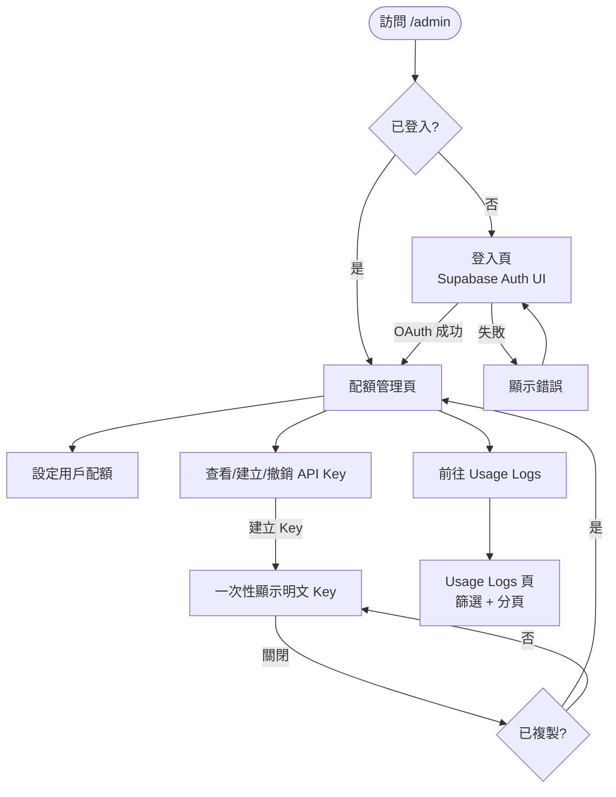
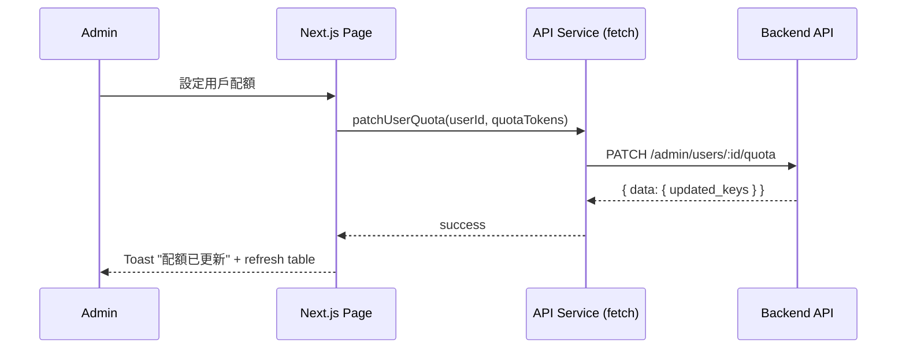

# Frontend Handoff: Apiex Platform (MVP)

> **Target Audience**: Frontend UI developers (Admin Web UI) + CLI/MCP developers
> **Source**: S0 Brief Spec + S1 Dev Spec
> **Created**: 2026-03-14 03:00
> **Scope**: 3 頁 Admin Web UI + CLI 6 指令 + MCP 3 tools

---

## 1. Feature Overview

Apiex 最小 Admin Web UI 供人類管理員管理配額、查看用量、操作 API Key。CLI 和 MCP Server 供 Agent 和開發者接入。

**Design Mockup**: None（shadcn/ui 預設樣式）

**Related Documents**

| Document | Purpose |
|----------|---------|
| [`s0_brief_spec.md`](./s0_brief_spec.md) | 完整需求與成功標準 |
| [`s1_api_spec.md`](./s1_api_spec.md) | API 契約（Request/Response/Error Codes） |
| [`s1_dev_spec.md`](./s1_dev_spec.md) | 完整技術規格與任務清單 |

---

## 2. User Flow

### 2.1 Admin Web UI 流程



### Main Flow (Admin)

| Step | User Action | System Response | Frontend Responsibility |
|------|-------------|-----------------|------------------------|
| 1 | 訪問 `/admin` | 檢查 Supabase session | `@supabase/ssr` middleware redirect |
| 2 | OAuth 登入 | 建立 session | Supabase Auth UI component |
| 3 | 查看用戶列表 | GET `/admin/users` | Table + pagination |
| 4 | 設定配額 | PATCH `/admin/users/:id/quota` | Inline edit + confirm |
| 5 | 建立 API Key | POST `/keys` | 一次性顯示 modal |
| 6 | 查看 Usage Logs | GET `/admin/usage-logs` | Table + filter + pagination |

### Exception Flows

| Scenario | Trigger | User Sees | Handling |
|----------|---------|-----------|----------|
| Session 過期 | JWT expired | Redirect to login | Supabase onAuthStateChange |
| 非 Admin | Email 不在 whitelist | 403 toast + redirect | adminAuth middleware |
| Key 已撤銷 | DELETE /keys/:id 重複 | 404 toast | Disable button after action |
| 配額設定失敗 | Network error | Error toast + retry button | Optimistic UI rollback |

---

## 3. API Spec Summary

> Full spec in [`s1_api_spec.md`](./s1_api_spec.md).

### Endpoint List

| Method | Path | Purpose | Frontend Trigger |
|--------|------|---------|-----------------|
| `GET` | `/admin/users` | 列出所有用戶 + 配額 | 頁面載入 / 分頁切換 |
| `PATCH` | `/admin/users/:id/quota` | 設定用戶配額 | 配額編輯表單提交 |
| `GET` | `/admin/usage-logs` | 查詢 usage logs | 頁面載入 / 篩選 / 分頁 |
| `GET` | `/keys` | 列出當前用戶 keys | 頁面載入 |
| `POST` | `/keys` | 建立新 key | 按鈕點擊 |
| `DELETE` | `/keys/:id` | 撤銷 key | 撤銷按鈕 + 確認對話框 |

### Error Code Handling

| Error | Frontend Display | Handling |
|-------|-----------------|----------|
| 401 `invalid_token` | Redirect to login | Auto redirect |
| 403 `admin_required` | Toast: "權限不足" | Redirect to login |
| 404 `key_not_found` | Toast: "Key 不存在" | Refresh list |
| 429 `rate_limit` | Toast: "操作太頻繁" | Disable button 1s |

---

## 4. Frontend Data Flow



---

## 5. Frontend Layered Development Guide

### 5.1 Data Layer

#### API Service

| Method | Change | Description |
|--------|--------|-------------|
| `adminApi.getUsers(page, limit)` | New | GET /admin/users |
| `adminApi.setQuota(userId, quota)` | New | PATCH /admin/users/:id/quota |
| `adminApi.getUsageLogs(filters)` | New | GET /admin/usage-logs |
| `keysApi.list()` | New | GET /keys |
| `keysApi.create(name)` | New | POST /keys |
| `keysApi.revoke(id)` | New | DELETE /keys/:id |

#### Types

```typescript
// types/admin.ts
interface AdminUser {
  id: string;
  email: string;
  key_count: number;
  total_tokens_used: number;
  quota_tokens: number;
  created_at: string;
}

interface UsageLog {
  id: string;
  api_key_prefix: string;
  model_tag: 'apex-smart' | 'apex-cheap';
  upstream_model: string;
  prompt_tokens: number;
  completion_tokens: number;
  total_tokens: number;
  latency_ms: number;
  status: 'success' | 'incomplete' | 'error';
  created_at: string;
}

interface ApiKey {
  id: string;
  key_prefix: string;
  key?: string; // 僅建立時有值
  name: string;
  status: 'active' | 'revoked';
  quota_tokens: number;
  created_at: string;
}
```

---

### 5.2 Presentation Layer

#### Pages

| Page | Route | Description |
|------|-------|-------------|
| LoginPage | `/admin/login` | Supabase Auth UI，OAuth + Email |
| DashboardPage | `/admin/dashboard` | 用戶列表 + 配額管理 + API Key CRUD |
| LogsPage | `/admin/logs` | Usage logs table + filter + pagination |

#### Components

| Component | File | Description |
|-----------|------|-------------|
| `UserTable` | `components/UserTable.tsx` | 用戶列表 + inline 配額編輯 |
| `QuotaEditor` | `components/QuotaEditor.tsx` | 配額數值輸入 + 確認按鈕 |
| `ApiKeyCard` | `components/ApiKeyCard.tsx` | Key 遮罩顯示 + 撤銷按鈕 |
| `ApiKeyCreateModal` | `components/ApiKeyCreateModal.tsx` | 一次性顯示 + 複製 + 二次確認關閉 |
| `CopyableTextField` | `components/CopyableTextField.tsx` | 文字 + 複製按鈕 |
| `ConfirmDialog` | `components/ConfirmDialog.tsx` | 通用確認對話框 |
| `UsageLogsTable` | `components/UsageLogsTable.tsx` | Logs table + 篩選列 |
| `AppLayout` | `components/AppLayout.tsx` | 側邊欄導航 + 頂部 bar + 登出 |

#### UI Behavior Rules

| Element | Condition | Behavior |
|---------|-----------|----------|
| 建立 Key 按鈕 | 建立中 | Disabled + spinner |
| 撤銷按鈕 | Key 已 revoked | Hidden |
| ApiKeyCreateModal 關閉 | 用戶按 X 或 Escape | 顯示二次確認「確定已複製？」 |
| 配額輸入 | 值 < -1 | 驗證錯誤提示 |
| Logs 篩選 | 變更篩選條件 | Debounce 300ms 後自動查詢 |

---

## 6. CLI Interface Spec

> Task T14 的 frontend-equivalent handoff。

### 指令清單

| Command | Input | Output (normal) | Output (--json) |
|---------|-------|-----------------|-----------------|
| `apiex login` | 互動式 | URL + token prompt | `{ "status": "ok", "config_path": "~/.apiex/config.json" }` |
| `apiex logout` | — | "Logged out" | `{ "status": "ok" }` |
| `apiex keys list` | — | Table (prefix, name, status) | `{ "data": [...] }` |
| `apiex keys create --name <n>` | name flag | 明文 key + warning | `{ "data": { "key": "apx-sk-..." } }` |
| `apiex keys revoke <id>` | key-id arg | "Key revoked" | `{ "data": { "status": "revoked" } }` |
| `apiex chat --model <m> "<prompt>"` | model, prompt | LLM response text | OpenAI completion JSON |
| `apiex status` | — | 配額 + 路由表 | `{ "quota": ..., "routes": [...] }` |

### Config File

```json
// ~/.apiex/config.json
{
  "api_key": "apx-sk-xxx",
  "base_url": "https://apiex.fly.dev"
}
```

**優先順序**：env `APIEX_API_KEY` > `~/.apiex/config.json`

---

## 7. MCP Server Tool Spec

> Task T15 的 frontend-equivalent handoff。

### Tools

| Tool | Input Schema | Output |
|------|-------------|--------|
| `apiex_chat` | `{ model: string, messages: Message[], stream?: boolean }` | OpenAI completion text |
| `apiex_models` | `{}` | 可用模型列表 |
| `apiex_usage` | `{ period?: "24h"\|"7d"\|"30d" }` | 用量摘要 |

### `.mcp.json` 範例

```json
{
  "mcpServers": {
    "apiex": {
      "command": "npx",
      "args": ["@apiex/mcp"],
      "env": {
        "APIEX_API_KEY": "apx-sk-xxx"
      }
    }
  }
}
```

---

## 8. Frontend Task List

| # | Task | Layer | Complexity | Dependencies | Wave |
|---|------|-------|------------|--------------|------|
| T13a | Admin Web UI — Data Layer (API service + types) | Data | S | T10, T11, T12 | W3 |
| T13b | Admin Web UI — 3 Pages + Components | Presentation | M | T13a | W3 |
| T13c | Admin Web UI — Integration (Supabase SSR auth) | Integration | S | T13b | W3 |

---

## 9. Frontend Acceptance Criteria

| # | Scenario | Given | When | Then | Priority |
|---|----------|-------|------|------|----------|
| AC-F1 | Admin 登入 | Admin 在登入頁 | OAuth 登入成功 | 跳轉到 Dashboard | P0 |
| AC-F2 | 非 Admin 登入 | 非 whitelist email 登入 | 進入 Dashboard | 顯示 403 + redirect | P0 |
| AC-F3 | 配額設定 | Admin 在 Dashboard | 修改用戶配額 + 確認 | 配額更新成功 toast | P0 |
| AC-F4 | 建立 API Key | Admin 在 Dashboard | 點擊「建立 Key」 | Modal 顯示明文 key + 複製按鈕 | P0 |
| AC-F5 | Key modal 二次確認 | Modal 開啟中 | 點擊關閉 | 顯示「確定已複製？」確認 | P1 |
| AC-F6 | 撤銷 Key | Key 為 active | 點撤銷 + 確認 | Key 狀態變 revoked，撤銷按鈕消失 | P0 |
| AC-F7 | Usage Logs 篩選 | Logs 頁 | 選 model_tag 篩選 | Table 更新 | P1 |

---

## 10. Conventions and Constraints

### Design System
- 使用 **shadcn/ui** 元件庫（基於 Radix UI + Tailwind CSS）
- 色彩使用 shadcn 預設 theme tokens，**不硬編碼色值**
- Dialog 使用 `<AlertDialog>` 元件

### Network Layer
- 使用原生 `fetch` + 自建 `apiClient` wrapper（注入 auth header）
- Token 管理由 `@supabase/ssr` 處理，**不手動操作 token**

### Feature-Specific Constraints
- Admin 判定以 `ADMIN_EMAILS` 環境變數控制，前端不做角色判斷（依賴後端 403）
- API Key 明文僅在 POST /keys 回應中出現一次，**前端不得 cache 明文 key**
