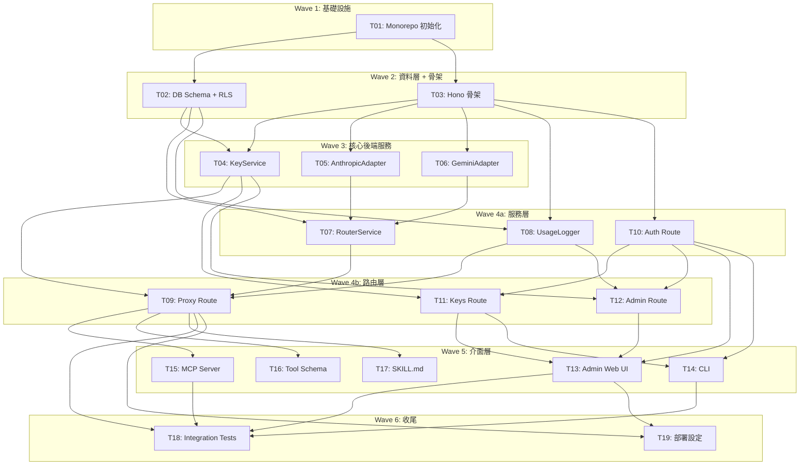

# S3 Implementation Plan: Apiex Platform (MVP)

> **階段**: S3 實作計畫
> **建立時間**: 2026-03-14 22:30
> **Agent**: architect
> **來源**: S1 Dev Spec (T01-T19) + S2 Review Report (conditional_pass)

---

## 1. 概述

### 1.1 功能目標

建立 Apiex AI API 中轉平台 MVP：開發者替換 `base_url` + `api_key`，透過 `apex-smart` / `apex-cheap` 路由標籤呼叫平台嚴選的頂尖 AI 模型。平台打包成 MCP Server、CLI、OpenAI Tool Schema、SKILL.md 四種格式供 Agent 零配置接入。

### 1.2 實作範圍

- **範圍內**: FA-A（帳號與 API Key 管理）、FA-C（API 代理與動態路由）、FA-T（Agent 工具封裝）
- **範圍外**: FA-B（金流自助儲值）、FA-D（Analytics Dashboard）、自動重試、直接 model ID routing

### 1.3 關聯文件

| 文件 | 路徑 | 狀態 |
|------|------|------|
| Brief Spec | `./s0_brief_spec.md` | completed |
| Dev Spec | `./s1_dev_spec.md` | completed |
| API Spec | `./s1_api_spec.md` | completed |
| Frontend Handoff | `./s1_frontend_handoff.md` | completed |
| Review Report | `./s2_review_report.md` | completed |
| Implementation Plan | `./s3_implementation_plan.md` | 當前文件 |

---

## 2. 實作任務清單

### 2.1 任務總覽

| # | 任務 | 類型 | Agent | 依賴 | 複雜度 | FA | TDD | 狀態 |
|---|------|------|-------|------|--------|-----|-----|------|
| T01 | Monorepo 初始化 | 基礎設施 | `backend-developer` | - | S | 全域 | ⛔ | ⬜ |
| T02 | Supabase DB Schema + RLS | 資料層 | `backend-developer` | T01 | M | FA-A | ⛔ | ⬜ |
| T03 | Hono App 骨架 + Middleware | 後端 | `backend-developer` | T01 | M | 全域 | ✅ | ⬜ |
| T04 | KeyService | 後端 | `backend-developer` | T02, T03 | M | FA-A | ✅ | ⬜ |
| T05 | AnthropicAdapter | 後端 | `backend-developer` | T03 | L | FA-C | ✅ | ⬜ |
| T06 | GeminiAdapter | 後端 | `backend-developer` | T03 | M | FA-C | ✅ | ⬜ |
| T07 | RouterService | 後端 | `backend-developer` | T02, T05, T06 | M | FA-C | ✅ | ⬜ |
| T08 | UsageLogger | 後端 | `backend-developer` | T02, T03 | S | FA-C | ✅ | ⬜ |
| T09 | Proxy Route (/v1/chat/completions) | 後端 | `backend-developer` | T04, T07, T08 | L | FA-C | ✅ | ⬜ |
| T10 | Auth Route (/auth/*) | 後端 | `backend-developer` | T03 | S | FA-A | ✅ | ⬜ |
| T11 | Keys Route (/keys/*) | 後端 | `backend-developer` | T04, T10 | M | FA-A | ✅ | ⬜ |
| T12 | Admin Route (/admin/*) | 後端 | `backend-developer` | T04, T08, T10 | M | FA-A | ✅ | ⬜ |
| T13 | Admin Web UI (3 頁) | 前端 | `frontend-developer` | T10, T11, T12 | M | FA-A | ✅ | ⬜ |
| T14 | CLI (commander.js) | 後端 | `backend-developer` | T10, T11 | M | FA-T | ✅ | ⬜ |
| T15 | MCP Server | 後端 | `backend-developer` | T09 | M | FA-T | ✅ | ⬜ |
| T16 | OpenAI Tool Schema JSON | 後端 | `backend-developer` | T09 | S | FA-T | ⛔ | ⬜ |
| T17 | SKILL.md | 文件 | `backend-developer` | T09 | S | FA-T | ⛔ | ⬜ |
| T18 | Integration Tests | 測試 | `backend-developer` | T09, T13, T14, T15 | L | 全域 | ✅ | ⬜ |
| T19 | Fly.io + Vercel 部署設定 | 基礎設施 | `backend-developer` | T09, T13 | M | 全域 | ⛔ | ⬜ |

**狀態圖例**：⬜ pending | 🔄 in_progress | ✅ completed | ❌ blocked | ⏭️ skipped

**複雜度**：S（<30min）| M（30min-2hr）| L（>2hr）

**TDD**：✅ = 有 TDD Plan | ⛔ = N/A（見各任務 skip_justification）

---

## 3. 任務詳情

### Task T01: Monorepo 初始化

**基本資訊**

| 項目 | 內容 |
|------|------|
| 類型 | 基礎設施 |
| Agent | `backend-developer` |
| 複雜度 | S |
| 依賴 | - |
| 狀態 | ⬜ pending |

**描述**

初始化 pnpm workspaces + turborepo monorepo，建立四個 packages 的目錄結構與共用設定。

**受影響檔案**

| 檔案 | 變更類型 | 說明 |
|------|---------|------|
| `pnpm-workspace.yaml` | 新增 | Workspace 定義 |
| `turbo.json` | 新增 | Turborepo pipeline |
| `package.json` | 新增 | 根 package |
| `tsconfig.base.json` | 新增 | 共用 TS 設定 |
| `packages/api-server/package.json` | 新增 | API server package |
| `packages/web-admin/package.json` | 新增 | Admin Web UI package |
| `packages/cli/package.json` | 新增 | CLI package |
| `packages/mcp-server/package.json` | 新增 | MCP Server package |

**DoD（完成定義）**
- [ ] `pnpm-workspace.yaml` 定義四個 packages：`api-server`、`web-admin`、`cli`、`mcp-server`
- [ ] `turbo.json` 設定 build/dev/lint pipeline
- [ ] 根 `package.json` 含 turbo scripts
- [ ] 共用 `tsconfig.base.json`、`.eslintrc`、`.prettierrc`
- [ ] 每個 package 有獨立 `package.json` 與 `tsconfig.json` extends base
- [ ] `pnpm install` + `pnpm build` 無錯誤

**TDD Plan**: N/A — 純 config/scaffold 任務，無可測試業務邏輯。驗證方式為 `pnpm install && pnpm build` 成功。

**驗證方式**
```bash
pnpm install && pnpm build
```

---

### Task T02: Supabase DB Schema + RLS

**基本資訊**

| 項目 | 內容 |
|------|------|
| 類型 | 資料層 |
| Agent | `backend-developer` |
| 複雜度 | M |
| 依賴 | T01 |
| 狀態 | ⬜ pending |

**描述**

建立 `api_keys`、`user_quotas`、`usage_logs`、`route_config` 四個表的 SQL migration，含 index、RLS policy、初始 route_config 種子資料。

**受影響檔案**

| 檔案 | 變更類型 | 說明 |
|------|---------|------|
| `supabase/migrations/001_create_tables.sql` | 新增 | 四表 DDL + indexes |
| `supabase/migrations/002_rls_policies.sql` | 新增 | RLS policies |
| `supabase/seed.sql` | 新增 | route_config 種子資料 |

**DoD（完成定義）**
- [ ] SQL migration 檔可透過 Supabase CLI 執行
- [ ] `api_keys.key_hash` 有 unique index
- [ ] `user_quotas` 表建立，含 RLS policy
- [ ] `usage_logs` 有 `api_key_id` 和 `created_at` index
- [ ] `route_config` 有 conditional unique index（`tag` WHERE `is_active = true`）
- [ ] RLS policy 按 S1 Dev Spec Section 4.3 設定
- [ ] 種子資料包含 `apex-smart`（Anthropic）和 `apex-cheap`（Google）兩筆 route_config
- [ ] 提供本地測試用的 Supabase 設定說明

**TDD Plan**: N/A — 純 SQL migration，不含應用層邏輯。驗證方式為 Supabase CLI `db reset` + migration 成功 + RLS 手動驗證。

**驗證方式**
```bash
supabase db reset
supabase db push
```

---

### Task T03: Hono App 骨架 + Middleware

**基本資訊**

| 項目 | 內容 |
|------|------|
| 類型 | 後端 |
| Agent | `backend-developer` |
| 複雜度 | M |
| 依賴 | T01 |
| 狀態 | ⬜ pending |

**描述**

建立 `packages/api-server` 的 Hono app 骨架，含全域 error handler（OpenAI 相容格式）、CORS、health check、apiKeyAuth middleware、adminAuth middleware。

**受影響檔案**

| 檔案 | 變更類型 | 說明 |
|------|---------|------|
| `packages/api-server/src/index.ts` | 新增 | Hono app 進入點 |
| `packages/api-server/src/middleware/apiKeyAuth.ts` | 新增 | API Key 驗證 middleware |
| `packages/api-server/src/middleware/adminAuth.ts` | 新增 | Admin JWT 驗證 middleware |
| `packages/api-server/src/lib/supabase.ts` | 新增 | Supabase client 初始化 |
| `packages/api-server/src/lib/errors.ts` | 新增 | OpenAI 相容錯誤格式工具 |

**DoD（完成定義）**
- [ ] Hono app 可啟動監聽指定 port
- [ ] `GET /health` 回傳 200
- [ ] 全域 error handler 回傳 OpenAI 相容格式：`{ error: { message, type, code } }`
- [ ] apiKeyAuth middleware：解析 `Authorization: Bearer apx-xxx`，sha256 hash 後查 DB 驗證
- [ ] adminAuth middleware：驗證 Supabase JWT，檢查 admin 權限（email whitelist）
- [ ] CORS 設定允許 Admin Web UI 的 origin（含 Vercel 部署 URL）
- [ ] Supabase client 初始化（`lib/supabase.ts`）

**TDD Plan**

| 項目 | 內容 |
|------|------|
| 測試檔案 | `packages/api-server/src/__tests__/app.test.ts` |
| 測試指令 | `pnpm --filter @apiex/api-server test` |
| 預期失敗測試 | 見下方 |

Test Cases:
1. `GET /health should return 200 with status ok`
2. `unknown route should return 404 in OpenAI error format`
3. `request without API Key should return 401 in OpenAI error format`
4. `request with invalid API Key should return 401 in OpenAI error format`
5. `admin endpoint with non-whitelist email should return 403`

**驗證方式**
```bash
pnpm --filter @apiex/api-server test
curl http://localhost:3000/health
```

---

### Task T04: KeyService

**基本資訊**

| 項目 | 內容 |
|------|------|
| 類型 | 後端 |
| Agent | `backend-developer` |
| 複雜度 | M |
| 依賴 | T02, T03 |
| 狀態 | ⬜ pending |

**描述**

API Key 生命週期管理服務，含樂觀預扣額度機制（reserveQuota + settleQuota）。

**受影響檔案**

| 檔案 | 變更類型 | 說明 |
|------|---------|------|
| `packages/api-server/src/services/KeyService.ts` | 新增 | API Key CRUD + 額度管理 |

**DoD（完成定義）**
- [ ] `createKey(userId, name)`: 用 `crypto.randomBytes(32)` 產生 key，sha256 hash 存 DB，回傳明文（一次性）。新 key 的 quota_tokens 繼承 `user_quotas.default_quota_tokens`；若該用戶在 `user_quotas` 無記錄，預設為 `-1`（無限制）
- [ ] Key 格式：`apx-sk-{base64url(32bytes)}`，prefix 取前 8 字元
- [ ] `validateKey(keyHash)`: 查 DB 回傳 key record 或 null
- [ ] `listKeys(userId)`: 回傳用戶所有 keys（含遮罩 prefix，不含 hash）
- [ ] `revokeKey(userId, keyId)`: 更新 status='revoked' + revoked_at
- [ ] `reserveQuota(keyId, estimatedTokens)`: atomic SQL 預扣估算額度，SQL：`UPDATE api_keys SET quota_tokens = quota_tokens - $estimated WHERE id = $id AND (quota_tokens >= $estimated OR quota_tokens = -1) RETURNING quota_tokens`
- [ ] `settleQuota(keyId, reservationId, actualTokens)`: 結算差額。`quota_tokens = -1` 的 key 不做結算操作。SQL：`UPDATE api_keys SET quota_tokens = quota_tokens + $diff WHERE id = $id AND quota_tokens != -1`
- [ ] Streaming 中斷/客戶端斷線退款規則：(1) connection close 觸發結算；(2) 以已接收 tokens 作為 actualTokens；(3) 若尚未收到任何 upstream response，actualTokens = 0 全額退還
- [ ] 單元測試覆蓋以上所有方法

**TDD Plan**

| 項目 | 內容 |
|------|------|
| 測試檔案 | `packages/api-server/src/services/__tests__/KeyService.test.ts` |
| 測試指令 | `pnpm --filter @apiex/api-server test` |
| 預期失敗測試 | 見下方 |

Test Cases:
1. `createKey should return key with apx-sk- prefix and store hash in DB`
2. `validateKey should return record for valid hash, null for invalid`
3. `revokeKey should set status=revoked and revoked_at`
4. `reserveQuota should atomically deduct estimated tokens and reject when insufficient`
5. `settleQuota should refund excess or charge deficit, skip when quota=-1`

**驗證方式**
```bash
pnpm --filter @apiex/api-server test -- --grep KeyService
```

---

### Task T05: AnthropicAdapter

**基本資訊**

| 項目 | 內容 |
|------|------|
| 類型 | 後端 |
| Agent | `backend-developer` |
| 複雜度 | L |
| 依賴 | T03 |
| 狀態 | ⬜ pending |

**描述**

OpenAI <-> Anthropic 雙向格式轉換 adapter，含 streaming chunk 正規化。MVP 技術風險最高的任務。必須處理 Anthropic SSE 的全部 8 種 event type。

**受影響檔案**

| 檔案 | 變更類型 | 說明 |
|------|---------|------|
| `packages/api-server/src/adapters/types.ts` | 新增 | ProviderAdapter 介面定義 |
| `packages/api-server/src/adapters/AnthropicAdapter.ts` | 新增 | Anthropic 雙向轉換 |

**DoD（完成定義）**
- [ ] 實作 `ProviderAdapter` 介面（定義於 `adapters/types.ts`）
- [ ] `transformRequest(openaiBody)`: system message 提取為獨立 `system` 參數；messages 移除 system role；`max_tokens` 設預設值（Anthropic 必填）；`model` 替換為上游 model ID
- [ ] `transformResponse(anthropicResponse)`: Anthropic Messages response → OpenAI ChatCompletion response
- [ ] `transformStreamChunk(chunk)`: 完整 8 種 event 處理：
  - `message_start` → 提取 prompt_tokens，不產生 OpenAI chunk
  - `content_block_start` → 初始化 delta
  - `content_block_delta` → `{ choices: [{ delta: { content } }] }`
  - `content_block_stop` → no-op
  - `message_delta` → 提取 output_tokens + usage
  - `message_stop` → `[DONE]`
  - `ping` → 忽略（keep-alive）
  - `error` → 轉換為 OpenAI 相容 error event
- [ ] `getHeaders()`: 回傳 `x-api-key`、`anthropic-version`
- [ ] 單元測試覆蓋 non-streaming + streaming 轉換（含全部 8 種 event type）
- [ ] 邊界測試：空 system message、多段 content_block、tool_use content type（暫不支援，回 400）

**TDD Plan**

| 項目 | 內容 |
|------|------|
| 測試檔案 | `packages/api-server/src/adapters/__tests__/AnthropicAdapter.test.ts` |
| 測試指令 | `pnpm --filter @apiex/api-server test` |
| 預期失敗測試 | 見下方（**8 種 SSE event 全部覆蓋**） |

Test Cases:
1. `transformRequest should extract system message as separate parameter`
2. `transformResponse should convert Anthropic Messages response to OpenAI ChatCompletion format`
3. `transformStreamChunk: message_start should extract prompt_tokens without producing OpenAI chunk`
4. `transformStreamChunk: content_block_start should initialize delta`
5. `transformStreamChunk: content_block_delta should produce OpenAI delta.content chunk`
6. `transformStreamChunk: content_block_stop should be no-op (no output)`
7. `transformStreamChunk: message_delta should extract output_tokens and usage`
8. `transformStreamChunk: message_stop should produce DONE signal`
9. `transformStreamChunk: ping should be ignored (no output, no error)`
10. `transformStreamChunk: error should convert to OpenAI error event format`

**驗證方式**
```bash
pnpm --filter @apiex/api-server test -- --grep AnthropicAdapter
```

**實作備註**
- 技術風險最高的任務（R1），建議先建立 mock Anthropic SSE server 驗證格式
- 參考 Anthropic Messages API streaming 文件：每個 SSE event 的 `event:` 和 `data:` 格式
- 預留 2 天 buffer 以因應格式差異

---

### Task T06: GeminiAdapter

**基本資訊**

| 項目 | 內容 |
|------|------|
| 類型 | 後端 |
| Agent | `backend-developer` |
| 複雜度 | M |
| 依賴 | T03 |
| 狀態 | ⬜ pending |

**描述**

Google AI OpenAI 相容層的正規化 adapter。因 Google 提供 OpenAI 相容端點，轉換量較小，主要處理 streaming 差異。

**受影響檔案**

| 檔案 | 變更類型 | 說明 |
|------|---------|------|
| `packages/api-server/src/adapters/GeminiAdapter.ts` | 新增 | Google AI 正規化 |

**DoD（完成定義）**
- [ ] 實作 `ProviderAdapter` 介面
- [ ] `transformRequest(openaiBody)`: 基本透傳，僅替換 model ID
- [ ] `transformResponse(geminiResponse)`: 正規化 `finish_reason`（STOP → stop）、補齊缺失欄位
- [ ] `transformStreamChunk(chunk)`: 正規化 streaming chunks，處理 usage 回傳時機差異（Gemini 在 stream 結束後才回傳 usage）
- [ ] `getHeaders()`: 回傳 Google AI 特有 headers
- [ ] 單元測試覆蓋 non-streaming + streaming

**TDD Plan**

| 項目 | 內容 |
|------|------|
| 測試檔案 | `packages/api-server/src/adapters/__tests__/GeminiAdapter.test.ts` |
| 測試指令 | `pnpm --filter @apiex/api-server test` |
| 預期失敗測試 | 見下方 |

Test Cases:
1. `transformRequest should pass through body with replaced model ID`
2. `transformResponse should normalize finish_reason STOP to stop`
3. `transformStreamChunk should normalize streaming chunks to OpenAI format`
4. `transformStreamChunk should handle deferred usage at stream end`
5. `getHeaders should return correct Authorization header`

**驗證方式**
```bash
pnpm --filter @apiex/api-server test -- --grep GeminiAdapter
```

---

### Task T07: RouterService

**基本資訊**

| 項目 | 內容 |
|------|------|
| 類型 | 後端 |
| Agent | `backend-developer` |
| 複雜度 | M |
| 依賴 | T02, T05, T06 |
| 狀態 | ⬜ pending |

**描述**

根據 model tag 查詢 route_config，選擇對應 adapter，組裝上游請求並轉發。

**受影響檔案**

| 檔案 | 變更類型 | 說明 |
|------|---------|------|
| `packages/api-server/src/services/RouterService.ts` | 新增 | 路由解析 + 上游轉發 |

**DoD（完成定義）**
- [ ] `resolveRoute(modelTag)`: 查 `route_config` WHERE `tag = $1 AND is_active = true`
- [ ] 根據 `upstream_provider` 選擇對應 adapter（AnthropicAdapter / GeminiAdapter）
- [ ] `forward(route, requestBody, stream)`: 呼叫上游，回傳 Response 或 ReadableStream
- [ ] 上游 timeout：non-streaming 30s，streaming 120s（AbortController）
- [ ] model 不支援 → 拋出 InvalidModelError
- [ ] route_config 缺失 → 拋出 RouteNotFoundError
- [ ] 上游錯誤透傳（4xx 直接轉發，5xx 包裝為 502）
- [ ] 單元測試（mock adapter）

**TDD Plan**

| 項目 | 內容 |
|------|------|
| 測試檔案 | `packages/api-server/src/services/__tests__/RouterService.test.ts` |
| 測試指令 | `pnpm --filter @apiex/api-server test` |
| 預期失敗測試 | 見下方 |

Test Cases:
1. `resolveRoute should select AnthropicAdapter for apex-smart`
2. `resolveRoute should throw InvalidModelError for unsupported model`
3. `resolveRoute should throw RouteNotFoundError when route_config is empty`
4. `forward should set 30s timeout for non-streaming, 120s for streaming`
5. `forward should wrap upstream 5xx as 502`

**驗證方式**
```bash
pnpm --filter @apiex/api-server test -- --grep RouterService
```

---

### Task T08: UsageLogger

**基本資訊**

| 項目 | 內容 |
|------|------|
| 類型 | 後端 |
| Agent | `backend-developer` |
| 複雜度 | S |
| 依賴 | T02, T03 |
| 狀態 | ⬜ pending |

**描述**

將請求用量寫入 usage_logs。

**受影響檔案**

| 檔案 | 變更類型 | 說明 |
|------|---------|------|
| `packages/api-server/src/services/UsageLogger.ts` | 新增 | Usage 寫入服務 |

**DoD（完成定義）**
- [ ] `logUsage({ apiKeyId, modelTag, upstreamModel, promptTokens, completionTokens, totalTokens, latencyMs, status })`: INSERT INTO usage_logs
- [ ] 寫入失敗不阻塞主流程（fire-and-forget + console.error）
- [ ] 單元測試

**TDD Plan**

| 項目 | 內容 |
|------|------|
| 測試檔案 | `packages/api-server/src/services/__tests__/UsageLogger.test.ts` |
| 測試指令 | `pnpm --filter @apiex/api-server test` |
| 預期失敗測試 | 見下方 |

Test Cases:
1. `logUsage should insert all fields into usage_logs`
2. `logUsage should not throw on DB write failure (fire-and-forget)`
3. `logUsage should correctly record status=incomplete for interrupted streams`

**驗證方式**
```bash
pnpm --filter @apiex/api-server test -- --grep UsageLogger
```

---

### Task T09: Proxy Route (/v1/chat/completions)

**基本資訊**

| 項目 | 內容 |
|------|------|
| 類型 | 後端 |
| Agent | `backend-developer` |
| 複雜度 | L |
| 依賴 | T04, T07, T08 |
| 狀態 | ⬜ pending |

**描述**

核心 proxy endpoint，整合 KeyService + RouterService + UsageLogger，支援 streaming 和 non-streaming。採用樂觀預扣機制：apiKeyAuth → reserveQuota → route → forward → logUsage → settleQuota。

**受影響檔案**

| 檔案 | 變更類型 | 說明 |
|------|---------|------|
| `packages/api-server/src/routes/proxy.ts` | 新增 | /v1/* proxy routes |

**DoD（完成定義）**
- [ ] `POST /v1/chat/completions`：apiKeyAuth → reserveQuota → route → forward → logUsage → settleQuota
- [ ] Non-streaming：回傳完整 JSON response
- [ ] Streaming：使用 Hono `c.streamText()` 回傳 SSE，Content-Type: `text/event-stream`
- [ ] Streaming 時 body parser 不攔截 response
- [ ] Stream 結束後計算 usage 並寫 log + settleQuota 結算
- [ ] Streaming 中途中斷處理：監聽 connection close event，觸發 settleQuota 以已接收 tokens 結算
- [ ] E8 timeout 處理（settleQuota 退還全額）、E10 stream 斷連處理
- [ ] `GET /v1/models`：回傳 route_config 中 active 的 model 列表
- [ ] `GET /usage/summary`：回傳當前 key 的用量摘要
- [ ] 全部回傳使用 OpenAI 相容格式
- [ ] 整合測試（mock upstream）

**TDD Plan**

| 項目 | 內容 |
|------|------|
| 測試檔案 | `packages/api-server/src/routes/__tests__/proxy.test.ts` |
| 測試指令 | `pnpm --filter @apiex/api-server test` |
| 預期失敗測試 | 見下方 |

Test Cases:
1. `POST /v1/chat/completions non-streaming should return OpenAI format response`
2. `POST /v1/chat/completions streaming should return SSE with text/event-stream`
3. `should execute reserveQuota before forward and settleQuota after completion`
4. `GET /v1/models should return active routes list in OpenAI format`
5. `GET /usage/summary should return token usage breakdown`

**驗證方式**
```bash
pnpm --filter @apiex/api-server test -- --grep proxy
curl -X POST http://localhost:3000/v1/chat/completions \
  -H "Authorization: Bearer apx-sk-test" \
  -H "Content-Type: application/json" \
  -d '{"model":"apex-smart","messages":[{"role":"user","content":"hi"}]}'
```

---

### Task T10: Auth Route (/auth/*)

**基本資訊**

| 項目 | 內容 |
|------|------|
| 類型 | 後端 |
| Agent | `backend-developer` |
| 複雜度 | S |
| 依賴 | T03 |
| 狀態 | ⬜ pending |

**描述**

MVP 簡化版認證路由。`/auth/login` 驗證 Supabase JWT 有效性並回傳用戶資訊 + is_admin 狀態。

**受影響檔案**

| 檔案 | 變更類型 | 說明 |
|------|---------|------|
| `packages/api-server/src/routes/auth.ts` | 新增 | /auth/* routes |

**DoD（完成定義）**
- [ ] `POST /auth/login`：Request `{ access_token }` → Response 200 `{ user: { id, email, created_at }, is_admin }` 或 401
- [ ] `POST /auth/logout`：MVP stateless JWT，Response 200 `{ message: "Logged out" }`
- [ ] 整合 Supabase Auth SDK
- [ ] 無效/過期 token 回傳 OpenAI 相容 error 格式

**TDD Plan**

| 項目 | 內容 |
|------|------|
| 測試檔案 | `packages/api-server/src/routes/__tests__/auth.test.ts` |
| 測試指令 | `pnpm --filter @apiex/api-server test` |
| 預期失敗測試 | 見下方 |

Test Cases:
1. `POST /auth/login with valid JWT should return user info and is_admin`
2. `POST /auth/login with invalid JWT should return 401 in OpenAI error format`
3. `POST /auth/logout should return 200 with message`

**驗證方式**
```bash
pnpm --filter @apiex/api-server test -- --grep auth
```

---

### Task T11: Keys Route (/keys/*)

**基本資訊**

| 項目 | 內容 |
|------|------|
| 類型 | 後端 |
| Agent | `backend-developer` |
| 複雜度 | M |
| 依賴 | T04, T10 |
| 狀態 | ⬜ pending |

**描述**

API Key CRUD 端點。

**受影響檔案**

| 檔案 | 變更類型 | 說明 |
|------|---------|------|
| `packages/api-server/src/routes/keys.ts` | 新增 | /keys/* routes |

**DoD（完成定義）**
- [ ] `GET /keys`：列出當前用戶的 keys（遮罩顯示）
- [ ] `POST /keys`：建立新 key，回傳明文（一次性）。新 key 的 quota_tokens 繼承 `user_quotas.default_quota_tokens`
- [ ] `DELETE /keys/:id`：撤銷 key
- [ ] 所有端點需 Supabase JWT 認證
- [ ] POST rate limit：同用戶 1 秒內限建 1 個（E2）
- [ ] 整合測試

**TDD Plan**

| 項目 | 內容 |
|------|------|
| 測試檔案 | `packages/api-server/src/routes/__tests__/keys.test.ts` |
| 測試指令 | `pnpm --filter @apiex/api-server test` |
| 預期失敗測試 | 見下方 |

Test Cases:
1. `GET /keys should list masked keys for authenticated user`
2. `POST /keys should create key and return plaintext once`
3. `DELETE /keys/:id should revoke key and set revoked_at`
4. `POST /keys should return 429 when creating twice within 1 second`
5. `POST /keys should inherit quota from user_quotas.default_quota_tokens`

**驗證方式**
```bash
pnpm --filter @apiex/api-server test -- --grep keys
```

---

### Task T12: Admin Route (/admin/*)

**基本資訊**

| 項目 | 內容 |
|------|------|
| 類型 | 後端 |
| Agent | `backend-developer` |
| 複雜度 | M |
| 依賴 | T04, T08, T10 |
| 狀態 | ⬜ pending |

**描述**

管理員專用端點。

**受影響檔案**

| 檔案 | 變更類型 | 說明 |
|------|---------|------|
| `packages/api-server/src/routes/admin.ts` | 新增 | /admin/* routes |

**DoD（完成定義）**
- [ ] `GET /admin/users`：列出所有用戶 + 各用戶的 key 數量 + 總用量
- [ ] `PATCH /admin/users/:id/quota`：UPSERT `user_quotas` 表 + UPDATE 該用戶所有 active keys 的 `quota_tokens`
- [ ] `GET /admin/usage-logs`：查詢全域 usage logs，支援分頁 + 篩選
- [ ] 所有端點需 Admin JWT 認證（adminAuth middleware）
- [ ] Admin 判定方式：email whitelist（環境變數 `ADMIN_EMAILS`）
- [ ] 整合測試

**TDD Plan**

| 項目 | 內容 |
|------|------|
| 測試檔案 | `packages/api-server/src/routes/__tests__/admin.test.ts` |
| 測試指令 | `pnpm --filter @apiex/api-server test` |
| 預期失敗測試 | 見下方 |

Test Cases:
1. `GET /admin/users should list users with key count and total usage`
2. `PATCH /admin/users/:id/quota should upsert user_quotas and update all active keys`
3. `GET /admin/usage-logs should support pagination and model_tag filter`
4. `non-admin email should receive 403`
5. `PATCH quota should propagate default_quota_tokens to newly created keys`

**驗證方式**
```bash
pnpm --filter @apiex/api-server test -- --grep admin
```

---

### Task T13: Admin Web UI (3 頁)

**基本資訊**

| 項目 | 內容 |
|------|------|
| 類型 | 前端 |
| Agent | `frontend-developer` |
| 複雜度 | M |
| 依賴 | T10, T11, T12 |
| 狀態 | ⬜ pending |

**描述**

Next.js + shadcn/ui 最小 Admin Web UI：登入頁、配額管理頁（含 API Key CRUD）、Usage Logs 頁。詳見 `s1_frontend_handoff.md`。

**受影響檔案**

| 檔案 | 變更類型 | 說明 |
|------|---------|------|
| `packages/web-admin/src/app/login/page.tsx` | 新增 | 登入頁 |
| `packages/web-admin/src/app/dashboard/page.tsx` | 新增 | 配額管理頁 |
| `packages/web-admin/src/app/logs/page.tsx` | 新增 | Usage Logs 頁 |
| `packages/web-admin/src/components/ApiKeyCard.tsx` | 新增 | Key 卡片元件 |
| `packages/web-admin/src/components/ApiKeyCreateModal.tsx` | 新增 | 一次性顯示 modal |
| `packages/web-admin/src/components/CopyableTextField.tsx` | 新增 | 複製文字欄位 |
| `packages/web-admin/src/components/ConfirmDialog.tsx` | 新增 | 確認對話框 |
| `packages/web-admin/src/components/AppLayout.tsx` | 新增 | 全域 Layout |
| `packages/web-admin/src/components/UserTable.tsx` | 新增 | 用戶列表 |
| `packages/web-admin/src/components/UsageLogsTable.tsx` | 新增 | Logs 表格 |

**DoD（完成定義）**
- [ ] 登入頁：Supabase Auth UI 元件，支援 Email + OAuth
- [ ] 配額管理頁：用戶列表 + 配額設定表單 + API Key 建立/撤銷
- [ ] Usage Logs 頁：表格 + 分頁 + 日期/model 篩選
- [ ] 全域 Layout（側邊欄導航 + 登出按鈕）
- [ ] API Key 建立後一次性顯示彈窗（含二次確認關閉 E15）
- [ ] 撤銷確認對話框
- [ ] 響應式設計（桌面優先，手機可用）
- [ ] 整合 `@supabase/ssr` 處理 server-side auth

**TDD Plan**

| 項目 | 內容 |
|------|------|
| 測試檔案 | `packages/web-admin/src/__tests__/pages.test.tsx` |
| 測試指令 | `pnpm --filter @apiex/web-admin test` |
| 預期失敗測試 | 見下方 |

Test Cases:
1. `LoginPage should render Supabase Auth UI component`
2. `DashboardPage should render user table and quota editor`
3. `ApiKeyCreateModal should show plaintext key with copy button`
4. `ApiKeyCreateModal close should trigger confirmation dialog`
5. `LogsPage should render filterable usage logs table with pagination`

**驗證方式**
```bash
pnpm --filter @apiex/web-admin test
pnpm --filter @apiex/web-admin dev
# 手動測試三頁完整流程
```

---

### Task T14: CLI (commander.js)

**基本資訊**

| 項目 | 內容 |
|------|------|
| 類型 | 後端 |
| Agent | `backend-developer` |
| 複雜度 | M |
| 依賴 | T10, T11 |
| 狀態 | ⬜ pending |

**描述**

`apiex` CLI 工具，含 login、logout、keys CRUD、chat、status 指令。

**受影響檔案**

| 檔案 | 變更類型 | 說明 |
|------|---------|------|
| `packages/cli/src/index.ts` | 新增 | CLI 進入點 |
| `packages/cli/src/commands/login.ts` | 新增 | login 指令 |
| `packages/cli/src/commands/keys.ts` | 新增 | keys 指令群 |
| `packages/cli/src/commands/chat.ts` | 新增 | chat 指令 |
| `packages/cli/src/commands/status.ts` | 新增 | status 指令 |

**DoD（完成定義）**
- [ ] `apiex login`：顯示 Admin Web UI URL，提示貼入 API Key → 存 `~/.apiex/config.json`
- [ ] `apiex logout`：清除 config
- [ ] `apiex keys list`：列出 API Keys（遮罩）
- [ ] `apiex keys create --name <name>`：建立 Key，輸出明文
- [ ] `apiex keys revoke <key-id>`：撤銷 Key
- [ ] `apiex chat --model <model> "<prompt>"`：直接呼叫 API
- [ ] `apiex status`：顯示配額餘額 + 當前路由目標
- [ ] 所有指令支援 `--json` flag
- [ ] `--help` 輸出完整說明
- [ ] npm bin 設定可 `npx apiex` 執行

**TDD Plan**

| 項目 | 內容 |
|------|------|
| 測試檔案 | `packages/cli/src/__tests__/commands.test.ts` |
| 測試指令 | `pnpm --filter @apiex/cli test` |
| 預期失敗測試 | 見下方 |

Test Cases:
1. `apiex login should output URL and prompt for API key`
2. `apiex keys list should output masked keys in table format`
3. `apiex keys create should output plaintext key with warning`
4. `apiex chat should call API and return response text`
5. `--json flag should output machine-readable JSON format`

**驗證方式**
```bash
pnpm --filter @apiex/cli test
npx apiex --help
```

---

### Task T15: MCP Server

**基本資訊**

| 項目 | 內容 |
|------|------|
| 類型 | 後端 |
| Agent | `backend-developer` |
| 複雜度 | M |
| 依賴 | T09 |
| 狀態 | ⬜ pending |

**描述**

`@apiex/mcp` MCP Server，註冊 3 個 tools：`apiex_chat`、`apiex_models`、`apiex_usage`。一律 non-streaming 呼叫後端 API。

**受影響檔案**

| 檔案 | 變更類型 | 說明 |
|------|---------|------|
| `packages/mcp-server/src/index.ts` | 新增 | MCP Server 進入點 |

**DoD（完成定義）**
- [ ] 使用 `@modelcontextprotocol/sdk` 實作 StdioServerTransport
- [ ] `apiex_chat` tool：接收 `model`、`messages`，呼叫 `/v1/chat/completions`（non-streaming）
- [ ] `apiex_models` tool：呼叫 `GET /v1/models`，格式化輸出
- [ ] `apiex_usage` tool：呼叫 `GET /usage/summary`，格式化輸出
- [ ] API Key 從 `APIEX_API_KEY` env 或 `~/.apiex/config.json` 讀取
- [ ] `.mcp.json` 範例設定檔
- [ ] 可透過 `npx @apiex/mcp` 啟動

**TDD Plan**

| 項目 | 內容 |
|------|------|
| 測試檔案 | `packages/mcp-server/src/__tests__/tools.test.ts` |
| 測試指令 | `pnpm --filter @apiex/mcp-server test` |
| 預期失敗測試 | 見下方 |

Test Cases:
1. `apiex_chat tool should call /v1/chat/completions with non-streaming`
2. `apiex_models tool should return formatted model list`
3. `apiex_usage tool should return usage summary text`
4. `should read API key from APIEX_API_KEY env variable`
5. `should return error content when API key is missing`

**驗證方式**
```bash
pnpm --filter @apiex/mcp-server test
APIEX_API_KEY=test npx @apiex/mcp
```

---

### Task T16: OpenAI Tool Schema JSON

**基本資訊**

| 項目 | 內容 |
|------|------|
| 類型 | 後端 |
| Agent | `backend-developer` |
| 複雜度 | S |
| 依賴 | T09 |
| 狀態 | ⬜ pending |

**描述**

產出 `dist/tool-schema.json`，符合 OpenAI function calling 格式。

**受影響檔案**

| 檔案 | 變更類型 | 說明 |
|------|---------|------|
| `dist/tool-schema.json` | 新增 | OpenAI Tool Schema |

**DoD（完成定義）**
- [ ] 包含 `apiex_chat`、`apiex_models`、`apiex_usage` 三個 function definitions
- [ ] 每個 function 有完整的 `parameters` JSON Schema
- [ ] 符合 OpenAI `tools` 陣列格式（`type: "function"`）

**TDD Plan**: N/A — 純靜態 JSON 輸出，無運行時邏輯。驗證方式為 JSON Schema 結構正確性檢查。

**驗證方式**
```bash
node -e "JSON.parse(require('fs').readFileSync('dist/tool-schema.json','utf8'))"
```

---

### Task T17: SKILL.md

**基本資訊**

| 項目 | 內容 |
|------|------|
| 類型 | 文件 |
| Agent | `backend-developer` |
| 複雜度 | S |
| 依賴 | T09 |
| 狀態 | ⬜ pending |

**描述**

產出 `.agents/skills/apiex/SKILL.md`。

**受影響檔案**

| 檔案 | 變更類型 | 說明 |
|------|---------|------|
| `.agents/skills/apiex/SKILL.md` | 新增 | Claude Code Skill 文件 |

**DoD（完成定義）**
- [ ] 包含觸發關鍵字（apex-smart、apex-cheap、apiex）
- [ ] 包含使用範例（curl 指令 + MCP 設定）
- [ ] 包含環境變數設定說明
- [ ] 格式符合 Claude Code Skill 規範

**TDD Plan**: N/A — 純 Markdown 文件，無可測試邏輯。

**驗證方式**
```bash
cat .agents/skills/apiex/SKILL.md
```

---

### Task T18: Integration Tests

**基本資訊**

| 項目 | 內容 |
|------|------|
| 類型 | 測試 |
| Agent | `backend-developer` |
| 複雜度 | L |
| 依賴 | T09, T13, T14, T15 |
| 狀態 | ⬜ pending |

**描述**

端對端整合測試，驗證完整請求鏈路、額度預扣結算、並發安全、錯誤處理。

**受影響檔案**

| 檔案 | 變更類型 | 說明 |
|------|---------|------|
| `packages/api-server/src/__tests__/integration.test.ts` | 新增 | 整合測試 |
| `packages/api-server/src/__tests__/e2e-openai-sdk.test.ts` | 新增 | OpenAI SDK 相容測試 |

**DoD（完成定義）**
- [ ] Streaming E2E：使用 mock upstream，驗證 SSE 格式正確
- [ ] Non-streaming E2E：驗證完整 request/response cycle
- [ ] API Key 建立 → 使用 → 撤銷 → 再使用回 401
- [ ] 額度預扣 + 結算：設定 quota=1000 → 呼叫消耗 → 查詢餘額正確
- [ ] 額度並發測試：10 個並發 streaming 請求，各 max_tokens=200，quota=1000 → 最多 5 個預扣成功
- [ ] 上游 timeout 測試：mock 30s+ 延遲 → 502 + 全額退還
- [ ] 上游格式錯誤測試：mock 回傳 HTML → 502
- [ ] Streaming 中途中斷測試：settleQuota 以已接收 tokens 結算
- [ ] OpenAI Node.js SDK 替換 base_url 呼叫（mock upstream）→ 成功
- [ ] MCP Server smoke test

**TDD Plan**

| 項目 | 內容 |
|------|------|
| 測試檔案 | `packages/api-server/src/__tests__/integration.test.ts` |
| 測試指令 | `pnpm --filter @apiex/api-server test:integration` |
| 預期失敗測試 | 見下方 |

Test Cases:
1. `streaming E2E should produce valid SSE format with mock upstream`
2. `API Key lifecycle: create -> use -> revoke -> use returns 401`
3. `quota reserve+settle: quota=1000, consume, verify remaining balance with refund`
4. `concurrent 10 requests with quota=1000 max_tokens=200: max 5 succeed, rest 402`
5. `upstream timeout >30s should return 502 and refund full reservation`

**驗證方式**
```bash
pnpm --filter @apiex/api-server test:integration
```

---

### Task T19: Fly.io + Vercel 部署設定

**基本資訊**

| 項目 | 內容 |
|------|------|
| 類型 | 基礎設施 |
| Agent | `backend-developer` |
| 複雜度 | M |
| 依賴 | T09, T13 |
| 狀態 | ⬜ pending |

**描述**

API server 部署至 Fly.io，Admin Web UI 部署至 Vercel。

**受影響檔案**

| 檔案 | 變更類型 | 說明 |
|------|---------|------|
| `fly.toml` | 新增 | Fly.io 設定 |
| `Dockerfile` | 新增 | API server 容器 |
| `.env.example` | 新增 | 環境變數範本 |
| `packages/web-admin/vercel.json` | 新增 | Vercel 設定 |

**DoD（完成定義）**
- [ ] `fly.toml` 設定（api-server）
- [ ] Dockerfile（api-server multi-stage build）
- [ ] 環境變數文件（`.env.example`）含所有必要 env vars
- [ ] `fly deploy` 可成功部署
- [ ] Health check 設定（`/health` endpoint）
- [ ] 長連線設定（streaming SSE 不被 proxy 中斷）
- [ ] web-admin Vercel 部署：`vercel.json` 或 Vercel project 連結 + env vars + CORS 對應

**TDD Plan**: N/A — 純 config/部署設定，無應用層邏輯。驗證方式為部署成功 + health check 通過。

**驗證方式**
```bash
fly deploy
fly status
curl https://apiex.fly.dev/health
```

---

## 4. 依賴關係圖



---

## 5. 執行順序與 Agent 分配

### 5.1 執行波次

| 波次 | 任務 | Agent | 並行 | 備註 |
|------|------|-------|------|------|
| **Wave 1** | T01 | `backend-developer` | 否 | 必須最先完成 |
| **Wave 2** | T02, T03 | `backend-developer` | **是** | T02 和 T03 都只依賴 T01，可並行 |
| **Wave 3** | T04, T05, T06 | `backend-developer` | **是** | T04 需 T02+T03 完成；T05/T06 只需 T03。三者在 Wave 2 完成後可並行啟動 |
| **Wave 4a** | T07, T08, T10 | `backend-developer` | **是** | T07 需 T02+T05+T06；T08 需 T02+T03；T10 需 T03。Wave 3 完成後三者並行 |
| **Wave 4b** | T09, T11, T12 | `backend-developer` | **是** | T09 需 T04+T07+T08；T11 需 T04+T10；T12 需 T04+T08+T10。Wave 4a 完成後三者並行 |
| **Wave 5** | T13, T14, T15, T16, T17 | `frontend-developer` (T13) / `backend-developer` (其餘) | **是** | 五者可並行。T14 不依賴 T09，理論上可提前至 Wave 4b |
| **Wave 6** | T18, T19 | `backend-developer` | **是** | 可並行 |

### 5.2 關鍵路徑

```
T01 → T03 → T05 → T07 → T09 → T18
T01 → T02 → T04 → T09 → T18
```

最長路徑經過 AnthropicAdapter（T05, L）和 Proxy Route（T09, L），這兩個也是複雜度最高的任務。

### 5.3 Agent 調度指令

```
# Wave 1
Task(agent: "backend-developer", task: "T01", description: "Monorepo 初始化")

# Wave 2 (parallel)
Task(agent: "backend-developer", task: "T02", description: "DB Schema + RLS", parallel: true)
Task(agent: "backend-developer", task: "T03", description: "Hono App 骨架", parallel: true)

# Wave 3 (parallel)
Task(agent: "backend-developer", task: "T04", description: "KeyService", parallel: true)
Task(agent: "backend-developer", task: "T05", description: "AnthropicAdapter", parallel: true)
Task(agent: "backend-developer", task: "T06", description: "GeminiAdapter", parallel: true)

# Wave 4a (parallel)
Task(agent: "backend-developer", task: "T07", description: "RouterService", parallel: true)
Task(agent: "backend-developer", task: "T08", description: "UsageLogger", parallel: true)
Task(agent: "backend-developer", task: "T10", description: "Auth Route", parallel: true)

# Wave 4b (parallel)
Task(agent: "backend-developer", task: "T09", description: "Proxy Route", parallel: true)
Task(agent: "backend-developer", task: "T11", description: "Keys Route", parallel: true)
Task(agent: "backend-developer", task: "T12", description: "Admin Route", parallel: true)

# Wave 5 (parallel)
Task(agent: "frontend-developer", task: "T13", description: "Admin Web UI")
Task(agent: "backend-developer", task: "T14", description: "CLI", parallel: true)
Task(agent: "backend-developer", task: "T15", description: "MCP Server", parallel: true)
Task(agent: "backend-developer", task: "T16", description: "Tool Schema JSON", parallel: true)
Task(agent: "backend-developer", task: "T17", description: "SKILL.md", parallel: true)

# Wave 6 (parallel)
Task(agent: "backend-developer", task: "T18", description: "Integration Tests", parallel: true)
Task(agent: "backend-developer", task: "T19", description: "部署設定", parallel: true)
```

---

## 6. 驗證計畫

### 6.1 逐任務驗證

| 任務 | 驗證指令 | 預期結果 |
|------|---------|---------|
| T01 | `pnpm install && pnpm build` | 無錯誤 |
| T02 | `supabase db reset` | Migration 成功 |
| T03 | `pnpm --filter @apiex/api-server test` | Tests passed |
| T04 | `pnpm --filter @apiex/api-server test -- --grep KeyService` | Tests passed |
| T05 | `pnpm --filter @apiex/api-server test -- --grep AnthropicAdapter` | Tests passed（含 8 種 event） |
| T06 | `pnpm --filter @apiex/api-server test -- --grep GeminiAdapter` | Tests passed |
| T07 | `pnpm --filter @apiex/api-server test -- --grep RouterService` | Tests passed |
| T08 | `pnpm --filter @apiex/api-server test -- --grep UsageLogger` | Tests passed |
| T09 | `pnpm --filter @apiex/api-server test -- --grep proxy` | Tests passed |
| T10 | `pnpm --filter @apiex/api-server test -- --grep auth` | Tests passed |
| T11 | `pnpm --filter @apiex/api-server test -- --grep keys` | Tests passed |
| T12 | `pnpm --filter @apiex/api-server test -- --grep admin` | Tests passed |
| T13 | `pnpm --filter @apiex/web-admin test` | Tests passed |
| T14 | `pnpm --filter @apiex/cli test` | Tests passed |
| T15 | `pnpm --filter @apiex/mcp-server test` | Tests passed |
| T16 | `node -e "JSON.parse(...)"` | Valid JSON |
| T17 | `cat .agents/skills/apiex/SKILL.md` | 檔案存在 |
| T18 | `pnpm --filter @apiex/api-server test:integration` | All passed |
| T19 | `fly deploy && curl /health` | 200 OK |

### 6.2 整體驗證

```bash
# 全部單元測試
pnpm test

# 整合測試
pnpm --filter @apiex/api-server test:integration

# 靜態分析
pnpm lint

# Build 驗證
pnpm build

# E2E 手動測試清單
# 1. OpenAI SDK 替換 base_url 呼叫（mock upstream）
# 2. curl streaming 驗證 SSE 格式
# 3. Admin Web UI 三頁完整流程
# 4. CLI 所有指令 + --json
# 5. MCP Server Claude Code 接入
```

---

## 7. 實作進度追蹤

### 7.1 進度總覽

| 指標 | 數值 |
|------|------|
| 總任務數 | 19 |
| 已完成 | 0 |
| 進行中 | 0 |
| 待處理 | 19 |
| 完成率 | 0% |

### 7.2 時間軸

| 時間 | 事件 | 備註 |
|------|------|------|
| 2026-03-14 22:30 | S3 計畫產出 | 待確認後進入 S4 |
| | | |

---

## 8. 變更記錄

### 8.1 檔案變更清單

```
新增：
  (待實作後填寫)

修改：
  (待實作後填寫)

刪除：
  (無)
```

### 8.2 Commit 記錄

| Commit | 訊息 | 關聯任務 |
|--------|------|---------|
| | | |

---

## 9. 風險與問題追蹤

### 9.1 已識別風險

| # | 風險 | 影響 | 緩解措施 | 狀態 |
|---|------|------|---------|------|
| R1 | AnthropicAdapter streaming 轉換複雜度 | 高 | 建立 mock SSE server；大量單元測試覆蓋 8 種 event；預留 2 天 buffer | 監控中 |
| R2 | Google Gemini OpenAI 相容層差異 | 高 | GeminiAdapter 獨立測試；integration test 實測確認 | 監控中 |
| R3 | API Key DB 查詢熱路徑 | 中 | key_hash unique index；Phase 2 加 LRU cache | 監控中 |
| R4 | 額度並發 race condition | 高 | 樂觀預扣 atomic UPDATE；並發整合測試驗證 | 監控中 |
| R5 | CLI OAuth 簡化版體驗差 | 低 | MVP 先用貼 token 方案；Phase 2 PKCE | 接受 |
| R6 | MCP SDK breaking changes | 中 | 鎖定特定版本，不用 `^` | 監控中 |
| R7 | Supabase RLS 設計不當 | 高 | T02 完成後專項審查 | 監控中 |
| R8 | claude-opus-4-6 model ID 不確定 | 低 | route_config 可動態 UPDATE | 接受 |
| R9 | Proxy 無 rate limiting | 中 | MVP 依賴配額預扣作為軟限制 | 接受（技術債） |

### 9.2 問題記錄

| # | 問題 | 發現時間 | 狀態 | 解決方案 |
|---|------|---------|------|---------|
| | | | | |

---

## 10. Scope 變更記錄

> 繼承自 S1 Dev Spec Section 8，S3 不新增變更。

| S0 原始定義 | MVP 處理 | 延期原因 | 延至 |
|-------------|---------|---------|------|
| E8「嘗試重試一次」 | 不實作自動重試，直接回 502 | MVP 每個 tag 僅一個 upstream，無備援路由 | Phase 2 |
| FA-C Happy Path C「指定 model ID」 | 回 400 + 列出有效標籤 | passthrough 需 provider 推斷邏輯 | Phase 2 |

---

## SDD Context

```json
{
  "sdd_context": {
    "stages": {
      "s3": {
        "status": "pending_confirmation",
        "agent": "architect",
        "completed_at": "2026-03-14T22:30:00+08:00",
        "output": {
          "implementation_plan_path": "dev/specs/apiex-platform/s3_implementation_plan.md",
          "waves": [
            {
              "wave": 1, "name": "基礎設施",
              "tasks": [
                { "id": "T01", "name": "Monorepo 初始化", "agent": "backend-developer", "dependencies": [], "complexity": "S", "parallel": false, "tdd_plan": null }
              ]
            },
            {
              "wave": 2, "name": "資料層 + 骨架",
              "tasks": [
                { "id": "T02", "name": "DB Schema + RLS", "agent": "backend-developer", "dependencies": ["T01"], "complexity": "M", "parallel": true, "tdd_plan": null },
                { "id": "T03", "name": "Hono App 骨架", "agent": "backend-developer", "dependencies": ["T01"], "complexity": "M", "parallel": true, "tdd_plan": { "test_file": "packages/api-server/src/__tests__/app.test.ts", "test_command": "pnpm --filter @apiex/api-server test" } }
              ]
            },
            {
              "wave": 3, "name": "核心後端服務",
              "tasks": [
                { "id": "T04", "name": "KeyService", "agent": "backend-developer", "dependencies": ["T02", "T03"], "complexity": "M", "parallel": true, "tdd_plan": { "test_file": "packages/api-server/src/services/__tests__/KeyService.test.ts", "test_command": "pnpm --filter @apiex/api-server test" } },
                { "id": "T05", "name": "AnthropicAdapter", "agent": "backend-developer", "dependencies": ["T03"], "complexity": "L", "parallel": true, "tdd_plan": { "test_file": "packages/api-server/src/adapters/__tests__/AnthropicAdapter.test.ts", "test_command": "pnpm --filter @apiex/api-server test" } },
                { "id": "T06", "name": "GeminiAdapter", "agent": "backend-developer", "dependencies": ["T03"], "complexity": "M", "parallel": true, "tdd_plan": { "test_file": "packages/api-server/src/adapters/__tests__/GeminiAdapter.test.ts", "test_command": "pnpm --filter @apiex/api-server test" } }
              ]
            },
            {
              "wave": 4, "name": "Routes + RouterService",
              "parallel": "Wave 4a (T07/T08/T10) -> Wave 4b (T09/T11/T12)",
              "tasks": [
                { "id": "T07", "name": "RouterService", "agent": "backend-developer", "dependencies": ["T02", "T05", "T06"], "complexity": "M", "parallel": true, "tdd_plan": { "test_file": "packages/api-server/src/services/__tests__/RouterService.test.ts", "test_command": "pnpm --filter @apiex/api-server test" } },
                { "id": "T08", "name": "UsageLogger", "agent": "backend-developer", "dependencies": ["T02", "T03"], "complexity": "S", "parallel": true, "tdd_plan": { "test_file": "packages/api-server/src/services/__tests__/UsageLogger.test.ts", "test_command": "pnpm --filter @apiex/api-server test" } },
                { "id": "T10", "name": "Auth Route", "agent": "backend-developer", "dependencies": ["T03"], "complexity": "S", "parallel": true, "tdd_plan": { "test_file": "packages/api-server/src/routes/__tests__/auth.test.ts", "test_command": "pnpm --filter @apiex/api-server test" } },
                { "id": "T09", "name": "Proxy Route", "agent": "backend-developer", "dependencies": ["T04", "T07", "T08"], "complexity": "L", "parallel": true, "tdd_plan": { "test_file": "packages/api-server/src/routes/__tests__/proxy.test.ts", "test_command": "pnpm --filter @apiex/api-server test" } },
                { "id": "T11", "name": "Keys Route", "agent": "backend-developer", "dependencies": ["T04", "T10"], "complexity": "M", "parallel": true, "tdd_plan": { "test_file": "packages/api-server/src/routes/__tests__/keys.test.ts", "test_command": "pnpm --filter @apiex/api-server test" } },
                { "id": "T12", "name": "Admin Route", "agent": "backend-developer", "dependencies": ["T04", "T08", "T10"], "complexity": "M", "parallel": true, "tdd_plan": { "test_file": "packages/api-server/src/routes/__tests__/admin.test.ts", "test_command": "pnpm --filter @apiex/api-server test" } }
              ]
            },
            {
              "wave": 5, "name": "介面層",
              "tasks": [
                { "id": "T13", "name": "Admin Web UI", "agent": "frontend-developer", "dependencies": ["T10", "T11", "T12"], "complexity": "M", "parallel": true, "tdd_plan": { "test_file": "packages/web-admin/src/__tests__/pages.test.tsx", "test_command": "pnpm --filter @apiex/web-admin test" } },
                { "id": "T14", "name": "CLI", "agent": "backend-developer", "dependencies": ["T10", "T11"], "complexity": "M", "parallel": true, "tdd_plan": { "test_file": "packages/cli/src/__tests__/commands.test.ts", "test_command": "pnpm --filter @apiex/cli test" } },
                { "id": "T15", "name": "MCP Server", "agent": "backend-developer", "dependencies": ["T09"], "complexity": "M", "parallel": true, "tdd_plan": { "test_file": "packages/mcp-server/src/__tests__/tools.test.ts", "test_command": "pnpm --filter @apiex/mcp-server test" } },
                { "id": "T16", "name": "Tool Schema JSON", "agent": "backend-developer", "dependencies": ["T09"], "complexity": "S", "parallel": true, "tdd_plan": null },
                { "id": "T17", "name": "SKILL.md", "agent": "backend-developer", "dependencies": ["T09"], "complexity": "S", "parallel": true, "tdd_plan": null }
              ]
            },
            {
              "wave": 6, "name": "收尾",
              "tasks": [
                { "id": "T18", "name": "Integration Tests", "agent": "backend-developer", "dependencies": ["T09", "T13", "T14", "T15"], "complexity": "L", "parallel": true, "tdd_plan": { "test_file": "packages/api-server/src/__tests__/integration.test.ts", "test_command": "pnpm --filter @apiex/api-server test:integration" } },
                { "id": "T19", "name": "部署設定", "agent": "backend-developer", "dependencies": ["T09", "T13"], "complexity": "M", "parallel": true, "tdd_plan": null }
              ]
            }
          ],
          "total_tasks": 19,
          "estimated_waves": 6,
          "verification": {
            "static_analysis": ["pnpm lint"],
            "unit_tests": ["pnpm test"],
            "integration_tests": ["pnpm --filter @apiex/api-server test:integration"]
          }
        }
      }
    }
  }
}
```

---

## 附錄

### A. 相關文件
- S0 Brief Spec: `./s0_brief_spec.md`
- S1 Dev Spec: `./s1_dev_spec.md`
- S1 API Spec: `./s1_api_spec.md`
- S1 Frontend Handoff: `./s1_frontend_handoff.md`
- S2 Review Report: `./s2_review_report.md`

### B. 專案規範提醒

#### Node.js 後端（Hono）
- 使用 **vitest** 作為測試框架
- 測試指令：`pnpm --filter @apiex/{package} test`
- OpenAI 相容格式為核心約束，所有 error response 必須符合 `{ error: { message, type, code } }`

#### Next.js 前端
- 使用 **shadcn/ui** 元件庫（Radix UI + Tailwind CSS）
- 色彩使用 shadcn 預設 theme tokens，不硬編碼色值
- 網路層使用原生 fetch + apiClient wrapper
- Token 管理由 `@supabase/ssr` 處理

#### 測試框架對照
| Package | 框架 | 指令 |
|---------|------|------|
| `@apiex/api-server` | vitest | `pnpm --filter @apiex/api-server test` |
| `@apiex/web-admin` | vitest | `pnpm --filter @apiex/web-admin test` |
| `@apiex/cli` | vitest | `pnpm --filter @apiex/cli test` |
| `@apiex/mcp-server` | vitest | `pnpm --filter @apiex/mcp-server test` |
