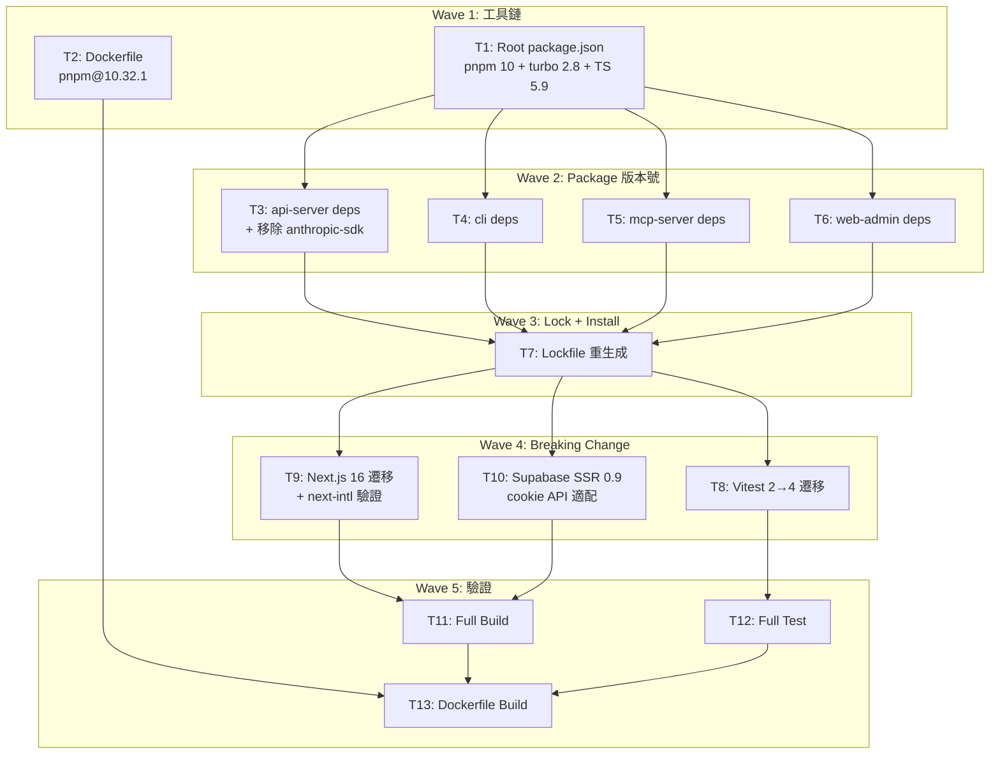

# S1 Dev Spec: 全專案依賴升級（Next.js 16 + Vitest 4 + pnpm 10）

> **階段**: S1 技術分析
> **建立時間**: 2026-03-15 22:45
> **Agent**: codebase-explorer (Phase 1) + architect (Phase 2)
> **工作類型**: refactor
> **複雜度**: L

---

## 1. 概述

### 1.1 需求參照
> 完整需求見 `s0_brief_spec.md`，以下僅摘要。

全 monorepo（root + 4 packages）所有依賴升級至最新穩定版本，含 3 個 major breaking change：Next.js 15->16、Vitest 2->4、pnpm 9->10。

### 1.2 技術方案摘要

分波執行依賴升級：先更新工具鏈基礎（pnpm / turbo / typescript），再批次更新各 package 的 package.json，統一重新生成 lockfile，接著處理 breaking change 遷移（Vitest mock API、Next.js 16 App Router、Supabase SSR cookie API），最後進行全量建置與測試驗證。順手移除未使用的 `@anthropic-ai/sdk` 依賴。

---

## 2. 影響範圍（Phase 1：codebase-explorer）

### 2.1 受影響檔案

#### Root（工具鏈）
| 檔案 | 變更類型 | 說明 |
|------|---------|------|
| `package.json` | 修改 | `packageManager` 欄位 + turbo/typescript 版本 |
| `Dockerfile` | 修改 | 兩處 `pnpm@9.15.0` -> `pnpm@10.32.1` |
| `pnpm-lock.yaml` | 重新生成 | 刪除後重新 `pnpm install` |

#### packages/api-server（後端）
| 檔案 | 變更類型 | 說明 |
|------|---------|------|
| `package.json` | 修改 | hono、supabase-js、tsup、tsx、vitest、@types/node 版本；移除 @anthropic-ai/sdk |
| `vitest.config.ts` | 可能修改 | Vitest 4 config 格式若有變更 |
| `src/**/__tests__/*.test.ts` (22 檔) | 可能修改 | vi.hoisted / vi.mock 行為變更時適配 |

#### packages/cli
| 檔案 | 變更類型 | 說明 |
|------|---------|------|
| `package.json` | 修改 | commander、tsx、tsup、vitest、@types/node 版本 |
| `vitest.config.ts` | 可能修改 | 同上 |

#### packages/mcp-server
| 檔案 | 變更類型 | 說明 |
|------|---------|------|
| `package.json` | 修改 | @modelcontextprotocol/sdk、zod、tsx、tsup、vitest、@types/node 版本 |
| `vitest.config.ts` | 可能修改 | 同上 |

#### packages/web-admin（前端）
| 檔案 | 變更類型 | 說明 |
|------|---------|------|
| `package.json` | 修改 | next、react、react-dom、@supabase/ssr、@supabase/supabase-js、radix-ui、tanstack、next-intl、@types/react、@types/react-dom 版本 |
| `next.config.ts` | 可能修改 | Next.js 16 config API 若有變更（`__dirname` 已被 Next 15 deprecate） |
| `src/middleware.ts` | 可能修改 | @supabase/ssr 0.9 cookie API 變更 |
| `src/lib/supabase-server.ts` | 可能修改 | 同上 |

### 2.2 依賴關係
- **上游依賴**: 無（純升級，不依賴外部新模組）
- **下游影響**: 所有 package 的建置產物、Docker image、CI pipeline

### 2.3 現有模式與技術考量
- Monorepo 使用 Turbo 管理 build/test pipeline，`dependsOn: ["^build"]` 確保建置順序
- Packages 間無 `workspace:` 互相引用，升級順序無強制依賴
- web-admin 無測試，升級後只能靠 build + typecheck 驗證
- `next.config.ts` 使用 `__dirname`，Next.js 16 可能需改用 `import.meta.dirname`

---

## 2.5 [refactor 專用] 現狀分析

### 現狀問題

| # | 問題 | 嚴重度 | 影響範圍 | 說明 |
|---|------|--------|---------|------|
| 1 | 依賴版本落後 3 個 major | 高 | 全專案 | Next.js 15（現有 16.1.6 GA）、Vitest 2（現有 4.1.0）、pnpm 9（現有 10.32.1） |
| 2 | 未使用依賴佔空間 | 低 | api-server | @anthropic-ai/sdk 列為 dependency 但程式碼完全不 import |
| 3 | Dockerfile 硬編碼版本 | 中 | DevOps | `pnpm@9.15.0` 硬編碼兩處，無法自動跟隨 root package.json |

### 目標狀態（Before -> After）

| 面向 | Before | After |
|------|--------|-------|
| Next.js | 15.1.0 | 16.1.6 (Major) |
| Vitest | 2.1.0 | 4.1.0 (Major) |
| pnpm | 9.15.0 | 10.32.1 (Major) |
| TypeScript | 5.7.0 | 5.9.3 (Minor) |
| Turbo | 2.3.0 | 2.8.17 (Minor) |
| Hono | 4.6.0 | 4.12.8 (Minor) |
| React / React DOM | 19.0.0 | 19.2.4 (Patch) |
| @supabase/supabase-js | 2.47.0 | 2.99.1 (Minor) |
| @supabase/ssr | 0.5.0 | 0.9.0 (Minor) |
| Anthropic SDK | 0.39.0 | **移除** (unused) |
| @types/node | 22.0.0 | 25.5.0 (Major, types only) |
| @types/react | 19.0.0 | 19.2.14 (Minor) |
| @types/react-dom | 19.0.0 | 19.2.3 (Minor) |
| tsup | 8.3.0 | 8.5.1 (Patch) |
| tsx | 4.19.0 | 4.21.0 (Patch) |
| OTel 全系列 | (current) | **不更新**（已是最新） |
| next-intl | 4.8.3 | **不更新**（已是最新，需驗證 Next 16 相容） |

### 遷移路徑

1. **Wave 1 — 工具鏈基礎**: 更新 root `package.json`（pnpm 10 + turbo 2.8 + typescript 5.9）+ Dockerfile
2. **Wave 2 — 各 package 版本號**: 批次更新 4 個 package 的 `package.json`（可並行）
3. **Wave 3 — Lock + Install**: 刪除舊 lockfile，以 pnpm 10 重新安裝生成新 lockfile
4. **Wave 4 — Breaking Change 遷移**: Vitest 4 mock API 修復、Next.js 16 config/API 適配、Supabase SSR 0.9 cookie API 適配
5. **Wave 5 — 整合驗證**: 全量 build + test + Dockerfile build

### 回歸風險矩陣

| 外部行為 | 驗證方式 | 風險等級 |
|---------|---------|---------|
| Supabase SSR middleware 登入/登出/角色分流 | 手動測試 middleware 重導向邏輯 | 中 |
| Hono streaming proxy（LLM 回應串流） | `pnpm test`（整合測試覆蓋） | 低 |
| next-intl locale 切換與 SSR 語言偵測 | `next build` + 手動驗證 locale 路由 | 中 |
| 全部 22 個 Vitest 測試檔（452+ mock 呼叫） | `pnpm test` 全量通過 | 中 |
| Next.js App Router 頁面渲染 | `next build` + `next start` 驗證 | 中 |
| Docker image 建置與啟動 | `docker build` + container 啟動 | 低 |

---

## 3. 遷移流程

> 此為 refactor 類型，無 User Flow。以遷移流程取代。



---

## 4. Data Flow

> 此為 refactor 類型，無 API 變更。無需 API 契約或資料模型變更。

---

## 5. 任務清單

### 5.1 任務總覽

| # | 任務 | 類型 | 複雜度 | Agent | 依賴 | 並行 |
|---|------|------|--------|-------|------|------|
| T1 | Root package.json 工具鏈升級 | 工具鏈 | S | backend-expert | - | - |
| T2 | Dockerfile pnpm 版本更新 | 工具鏈 | S | backend-expert | - | T1 並行 |
| T3 | api-server 依賴升級 + 移除 @anthropic-ai/sdk | 後端 | S | backend-expert | T1 | T4,T5,T6 並行 |
| T4 | cli 依賴升級 | 後端 | S | backend-expert | T1 | T3,T5,T6 並行 |
| T5 | mcp-server 依賴升級 | 後端 | S | backend-expert | T1 | T3,T4,T6 並行 |
| T6 | web-admin 依賴升級 | 前端 | S | frontend-expert | T1 | T3,T4,T5 並行 |
| T7 | Lockfile 重新生成 | 工具鏈 | S | backend-expert | T3,T4,T5,T6 | - |
| T8 | Vitest 2->4 測試遷移 | 測試 | M | backend-expert | T7 | T9,T10 並行 |
| T9 | Next.js 16 遷移 + next-intl 相容性驗證 | 前端 | M | frontend-expert | T7 | T8,T10 並行 |
| T10 | Supabase SSR 0.9 cookie API 適配 | 前端 | M | frontend-expert | T7 | T8,T9 並行 |
| T11 | Full Build 驗證 | 驗證 | S | backend-expert | T9,T10 | - |
| T12 | Full Test 驗證 | 驗證 | S | backend-expert | T8 | T11 並行 |
| T13 | Dockerfile Build 驗證 | 驗證 | S | backend-expert | T11,T12 | - |

### 5.2 任務詳情

#### Task #T1: Root package.json 工具鏈升級
- **類型**: 工具鏈
- **複雜度**: S
- **Agent**: backend-expert
- **描述**: 更新 root `package.json` 三個欄位：
  - `packageManager`: `"pnpm@9.15.0"` -> `"pnpm@10.32.1"`
  - `turbo`: `"^2.3.0"` -> `"^2.8.17"`
  - `typescript`: `"^5.7.0"` -> `"^5.9.3"`
- **DoD**:
  - [ ] `packageManager` 欄位為 `pnpm@10.32.1`
  - [ ] turbo 版本為 `^2.8.17`
  - [ ] typescript 版本為 `^5.9.3`
- **驗收方式**: `cat package.json | grep -E "packageManager|turbo|typescript"` 確認版本號

#### Task #T2: Dockerfile pnpm 版本更新
- **類型**: 工具鏈
- **複雜度**: S
- **Agent**: backend-expert
- **描述**: 更新 `Dockerfile` 兩處 `corepack prepare pnpm@9.15.0 --activate` -> `corepack prepare pnpm@10.32.1 --activate`
- **DoD**:
  - [ ] Dockerfile 內無 `pnpm@9` 殘留
  - [ ] 兩處 `corepack prepare` 均為 `pnpm@10.32.1`
- **驗收方式**: `grep pnpm Dockerfile` 確認

#### Task #T3: api-server 依賴升級 + 移除 @anthropic-ai/sdk
- **類型**: 後端
- **複雜度**: S
- **Agent**: backend-expert
- **依賴**: T1
- **描述**: 更新 `packages/api-server/package.json`：
  - dependencies: `hono` ^4.12.8, `@hono/node-server` ^1.19.11（或最新）, `@supabase/supabase-js` ^2.99.1, `stripe` ^20.4.1（或最新）, `@upstash/redis` ^1.37.0（或最新）
  - **移除** `@anthropic-ai/sdk`（程式碼完全不 import，確認後刪除）
  - devDependencies: `vitest` ^4.1.0, `tsup` ^8.5.1, `tsx` ^4.21.0, `@types/node` ^25.5.0, `typescript` ^5.9.3
  - OTel 系列**不動**（已是最新）
- **DoD**:
  - [ ] `@anthropic-ai/sdk` 已從 dependencies 移除
  - [ ] 所有目標版本已更新
  - [ ] `grep -r "anthropic-ai/sdk" packages/api-server/src/` 無結果（確認無 import）
- **驗收方式**: `cat packages/api-server/package.json` 確認版本號 + 無 anthropic-sdk

#### Task #T4: cli 依賴升級
- **類型**: 後端
- **複雜度**: S
- **Agent**: backend-expert
- **依賴**: T1
- **描述**: 更新 `packages/cli/package.json`：
  - dependencies: `commander` ^12.1.0（或最新）
  - devDependencies: `vitest` ^4.1.0, `tsup` ^8.5.1, `tsx` ^4.21.0, `@types/node` ^25.5.0, `typescript` ^5.9.3
- **DoD**:
  - [ ] 所有目標版本已更新
- **驗收方式**: `cat packages/cli/package.json` 確認

#### Task #T5: mcp-server 依賴升級
- **類型**: 後端
- **複雜度**: S
- **Agent**: backend-expert
- **依賴**: T1
- **描述**: 更新 `packages/mcp-server/package.json`：
  - dependencies: `@modelcontextprotocol/sdk` 最新版（目前 1.12.1，確認有無新版）, `zod` ^3.23.8（或最新）
  - devDependencies: `vitest` ^4.1.0, `tsup` ^8.5.1, `tsx` ^4.21.0, `@types/node` ^25.5.0, `typescript` ^5.9.3
- **DoD**:
  - [ ] 所有目標版本已更新
- **驗收方式**: `cat packages/mcp-server/package.json` 確認

#### Task #T6: web-admin 依賴升級
- **類型**: 前端
- **複雜度**: S
- **Agent**: frontend-expert
- **依賴**: T1
- **描述**: 更新 `packages/web-admin/package.json`：
  - dependencies: `next` ^16.1.6, `react` ^19.2.4, `react-dom` ^19.2.4, `@supabase/ssr` ^0.9.0, `@supabase/supabase-js` ^2.99.1, `next-intl` ^4.8.3（不變）, 所有 `@radix-ui/*` 和 `@tanstack/*` 升至最新
  - devDependencies: `@types/react` ^19.2.14, `@types/react-dom` ^19.2.3, `typescript` ^5.9.3
- **DoD**:
  - [ ] next 版本為 ^16.1.6
  - [ ] react / react-dom 版本為 ^19.2.4
  - [ ] @supabase/ssr 版本為 ^0.9.0
  - [ ] 所有其餘依賴為最新穩定版
- **驗收方式**: `cat packages/web-admin/package.json` 確認

#### Task #T7: Lockfile 重新生成
- **類型**: 工具鏈
- **複雜度**: S
- **Agent**: backend-expert
- **依賴**: T3, T4, T5, T6
- **描述**:
  1. 刪除 `pnpm-lock.yaml`
  2. 刪除所有 `node_modules`（`rm -rf node_modules packages/*/node_modules`）
  3. 使用 pnpm 10 執行 `pnpm install`
  4. 確認 lockfile 乾淨生成、無 peer dependency 衝突
- **DoD**:
  - [ ] `pnpm-lock.yaml` 已重新生成
  - [ ] `pnpm install` 無 error（warning 可接受）
  - [ ] 無 unresolved peer dependency 錯誤
- **驗收方式**: `pnpm install` exit code 0；`git diff --stat pnpm-lock.yaml` 確認有變更

#### Task #T8: Vitest 2->4 測試遷移
- **類型**: 測試
- **複雜度**: M
- **Agent**: backend-expert
- **依賴**: T7
- **描述**:
  1. 參照 Vitest 3.x 和 4.x migration guide
  2. 重點檢查 3 個使用 `vi.hoisted()` 的測試檔：
     - `packages/api-server/src/services/__tests__/WebhookService.test.ts`
     - `packages/api-server/src/routes/__tests__/proxy.test.ts`
     - `packages/api-server/src/services/__tests__/RouterService.test.ts`
  3. 檢查 `vitest.config.ts` 的 `globals: true` 設定是否仍支援
  4. 執行 `pnpm --filter @apiex/api-server test` 修復失敗用例
  5. 執行 `pnpm --filter @apiex/cli test` 和 `pnpm --filter @apiex/mcp test`
- **DoD**:
  - [ ] 所有 3 個含 `vi.hoisted()` 的測試檔通過
  - [ ] api-server 全部 22 個測試檔通過
  - [ ] cli 和 mcp-server 測試通過
  - [ ] 無 deprecation warning（或已記錄可接受的 warning）
- **驗收方式**: `pnpm test` 全量通過（exit code 0）

#### Task #T9: Next.js 16 遷移 + next-intl 相容性驗證
- **類型**: 前端
- **複雜度**: M
- **Agent**: frontend-expert
- **依賴**: T7
- **描述**:
  1. 參照 Next.js 16 migration guide，逐條核對：
     - `next.config.ts` 中的 `__dirname` -> 可能需改為 `import.meta.dirname`
     - `next/navigation`、`next/server`、`next/headers` API 變更
     - App Router 行為變更（如有）
  2. 驗證 `next-intl` 4.8.3 與 Next.js 16 相容：
     - `createNextIntlPlugin` 是否正常運作
     - `next build` 是否成功
     - locale routing 是否正常
  3. 驗證 32 個 `'use client'` component 無水合錯誤
- **DoD**:
  - [ ] `next.config.ts` 的 `__dirname` 已替換為 `import.meta.dirname`（或驗證 Next.js 16 仍支援）
  - [ ] `next build` 成功（exit code 0）
  - [ ] `next.config.ts` 無 deprecation warning
  - [ ] next-intl plugin 正常載入
  - [ ] `next start` 後首頁可正常訪問
- **驗收方式**: `cd packages/web-admin && pnpm build` 成功；`pnpm start` 後 `curl http://localhost:3000` 回應 200

#### Task #T10: Supabase SSR 0.9 cookie API 適配
- **類型**: 前端
- **複雜度**: M
- **Agent**: frontend-expert
- **依賴**: T7
- **描述**:
  1. 參照 `@supabase/ssr` changelog（0.5 -> 0.9）
  2. 檢查兩個關鍵檔案的 cookie API：
     - `src/middleware.ts`: `CookieMethodsServer` 型別、`getAll()`、`setAll()` 簽名
     - `src/lib/supabase-server.ts`: 同上
  3. 確認 `createServerClient` 的 cookie options 格式是否有變更
  4. 若 API 有 breaking change，進行適配修改
- **DoD**:
  - [ ] `middleware.ts` 通過 typecheck（`pnpm typecheck`）
  - [ ] `supabase-server.ts` 通過 typecheck
  - [ ] 無 `CookieMethodsServer` 相關型別錯誤
- **驗收方式**: `cd packages/web-admin && pnpm typecheck` 無錯誤

#### Task #T11: Full Build 驗證
- **類型**: 驗證
- **複雜度**: S
- **Agent**: backend-expert
- **依賴**: T9, T10
- **描述**: 從 repo root 執行 `pnpm build`，確認所有 4 個 package 建置成功
- **DoD**:
  - [ ] `pnpm build` exit code 0
  - [ ] 4 個 package 的 dist / .next 產出正常
- **驗收方式**: `pnpm build` 成功

#### Task #T12: Full Test 驗證
- **類型**: 驗證
- **複雜度**: S
- **Agent**: backend-expert
- **依賴**: T8
- **描述**: 從 repo root 執行 `pnpm test`，確認所有測試通過
- **DoD**:
  - [ ] `pnpm test` exit code 0
  - [ ] 249+ 測試全部通過
- **驗收方式**: `pnpm test` 成功，0 failures

#### Task #T13: Dockerfile Build 驗證
- **類型**: 驗證
- **複雜度**: S
- **Agent**: backend-expert
- **依賴**: T11, T12
- **描述**: 執行 `docker build -t apiex-test .` 確認 Docker image 可正常建置
- **前置條件**: T7 重生成的 `pnpm-lock.yaml` 必須存在於工作目錄
- **DoD**:
  - [ ] `docker build` exit code 0
  - [ ] `--frozen-lockfile` 在 pnpm 10 下正常運作
  - [ ] image 可成功啟動（`docker run --rm apiex-test node -e "console.log('ok')"` 或類似驗證）
- **驗收方式**: Docker build 成功

---

## 6. 技術決策

### 6.1 架構決策

| 決策點 | 選項 | 選擇 | 理由 |
|--------|------|------|------|
| @anthropic-ai/sdk 處理 | A: 更新版本 / B: 移除 | B: 移除 | AnthropicAdapter 為純 HTTP adapter，全 codebase 無任何 import，保留是無意義的技術債 |
| OTel 處理 | A: 升級 / B: 不動 | B: 不動 | 已是最新版本，無需操作 |
| next-intl 處理 | A: 升級 / B: 不動但驗證 | B: 不動但驗證 | 已是最新 4.8.3，但需確認與 Next.js 16 的相容性 |
| Lockfile 策略 | A: 增量更新 / B: 全量重生成 | B: 全量重生成 | pnpm 9->10 lockfile 格式變更，增量更新不可靠 |
| pnpm 版本固定方式 | A: 只改 packageManager / B: 同步改 Dockerfile | B: 同步改 | Dockerfile 硬編碼版本，必須同步，否則 CI 建置失敗 |

### 6.2 注意事項
- **`next.config.ts` 中的 `__dirname`**: Next.js 16 可能要求使用 `import.meta.dirname`。需在 T9 中驗證並視需要修改。
- **`outputFileTracingRoot`**: 此設定在 Next.js 16 中是否仍為有效選項，需在 T9 中確認。
- **pnpm 10 breaking changes**: `--frozen-lockfile` 行為可能有變更，Dockerfile 中使用此 flag 需在 T13 中驗證。

---

## 7. 驗收標準

### 7.1 功能驗收

| # | 場景 | Given | When | Then | 優先級 |
|---|------|-------|------|------|--------|
| SC-1 | 版本全部升級 | 所有 package.json 已修改 | 檢查各 package.json 的依賴版本 | 所有依賴為目標版本 | P0 |
| SC-2 | 全量建置通過 | 所有依賴已安裝 | 執行 `pnpm build` | 4 個 package 全部建置成功，exit code 0 | P0 |
| SC-3 | 全部測試通過 | Vitest 4 遷移完成 | 執行 `pnpm test` | 249+ 測試全部通過，0 failures | P0 |
| SC-4 | Next.js 16 正常運行 | web-admin 建置成功 | 執行 `pnpm --filter @apiex/web-admin build` | Build 成功，無 Next.js deprecation error | P0 |
| SC-5 | LLM proxy 正常 | @anthropic-ai/sdk 已移除 | 執行 api-server proxy 相關測試 | 測試通過（proxy 不依賴 SDK） | P1 |
| SC-6 | Dockerfile 建置成功 | Dockerfile 已更新 pnpm 10 | 執行 `docker build .` | Image 建置成功 | P1 |
| SC-7 | Lockfile 乾淨 | 全部版本已更新 | 執行 `pnpm install --frozen-lockfile` | 安裝成功，lockfile 無需變更 | P0 |

### 7.2 非功能驗收
| 項目 | 標準 |
|------|------|
| 向後相容 | 升級後所有外部行為不變（API 回應格式、前端頁面渲染、middleware 重導向邏輯） |
| 型別安全 | `pnpm typecheck` 全 package 通過，無新增 type error |

### 7.3 測試計畫
- **單元測試**: api-server 22 檔 + cli 1 檔 + mcp-server 1 檔（Vitest 4 遷移後全量通過）
- **整合測試**: api-server integration tests（若有）
- **手動測試**: web-admin `next build` + `next start` + 頁面訪問；Dockerfile build

---

## 8. 風險與緩解

| 風險 | 影響 | 機率 | 緩解措施 | 負責 |
|------|------|------|---------|------|
| R2: next-intl 4.8.3 + Next.js 16 不相容 | 高 | 中 | T9 中優先驗證 `next build`；若不相容需升級 next-intl 或 pin Next.js 版本 | frontend-expert |
| R3: Supabase SSR 0.9 cookie API 變更 | 中 | 中 | T10 中比對 changelog + typecheck 驗證；必要時調整 getAll/setAll 簽名 | frontend-expert |
| R4: Vitest 4 vi.hoisted/vi.mock 行為變更 | 中 | 中 | T8 中優先測試 3 個 vi.hoisted 檔案；參照 migration guide 修復 | backend-expert |
| R6: pnpm 10 lockfile + --frozen-lockfile 行為 | 中 | 中 | T7 全量重生成 lockfile；T13 驗證 Dockerfile build | backend-expert |
| R7: Hono 4.12 streaming API 變更 | 低 | 低 | proxy.test.ts 覆蓋 streaming 路徑 | backend-expert |
| ~~R1: Next.js 16 未 GA~~ | ~~高~~ | - | **已消除**: 16.1.6 已 GA confirmed | - |
| ~~R5: OTel 版本矩陣~~ | ~~中~~ | - | **已消除**: 已是最新版，不需更新 | - |
| ~~R8: Anthropic SDK 升級~~ | ~~低~~ | - | **已消除**: 程式碼不 import SDK，直接移除 | - |

### 回歸風險
- Supabase SSR middleware 登入/登出/角色分流（`middleware.ts` cookie API 變更可能破壞 session 管理）
- Hono streaming proxy response（minor 升級但需驗證 `hono/streaming` 行為不變）
- next-intl locale 切換與 SSR 語言偵測（與 Next.js 16 的整合點）
- 全部 22 個 Vitest 測試檔的 452+ mock 呼叫（Vitest 4 mock hoisting 行為可能變更）

---

## SDD Context

```json
{
  "stages": {
    "s1": {
      "status": "completed",
      "agents": ["codebase-explorer", "architect"],
      "output": {
        "completed_phases": [1, 2],
        "dev_spec_path": "dev/specs/deps-upgrade/s1_dev_spec.md",
        "tasks": ["T1","T2","T3","T4","T5","T6","T7","T8","T9","T10","T11","T12","T13"],
        "acceptance_criteria": ["SC-1","SC-2","SC-3","SC-4","SC-5","SC-6","SC-7"],
        "solution_summary": "分 5 波執行依賴升級：工具鏈基礎 -> 各 package 版本號 -> lockfile 重生成 -> breaking change 遷移 -> 整合驗證。移除未使用的 @anthropic-ai/sdk。",
        "assumptions": [
          "Next.js 16.1.6 GA 穩定可用",
          "next-intl 4.8.3 與 Next.js 16 相容（需 T9 驗證）",
          "OTel 系列已是最新，無需更新"
        ],
        "tech_debt": [
          "web-admin 無測試覆蓋，升級後缺乏自動化回歸保護",
          "Dockerfile 硬編碼 pnpm 版本（本次修復但模式未改善）"
        ],
        "regression_risks": [
          "Supabase SSR middleware cookie API",
          "Vitest 4 mock hoisting",
          "next-intl + Next.js 16 整合"
        ]
      }
    }
  }
}
```
