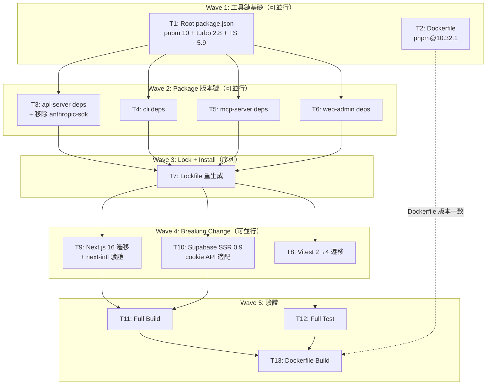

# S3 執行計畫: 全專案依賴升級（Next.js 16 + Vitest 4 + pnpm 10）

> **階段**: S3 實作
> **建立時間**: 2026-03-15 23:00
> **Agent**: general-purpose

---

## 1. 概述

### 1.1 功能目標

全 monorepo（root + 4 packages）所有依賴升級至最新穩定版本，消除技術債，含 3 個 major breaking change：Next.js 15→16、Vitest 2→4、pnpm 9→10。移除未使用的 `@anthropic-ai/sdk`。

### 1.2 實作範圍

- **範圍內**: Next.js 15→16、Vitest 2→4、pnpm 9→10、TypeScript 5.7→5.9、Turbo 2.3→2.8、Hono 4.6→4.12、React 19.0→19.2、@supabase/supabase-js 2.47→2.99、@supabase/ssr 0.5→0.9、Dockerfile pnpm 版本更新、移除 @anthropic-ai/sdk、所有其餘 minor/patch 依賴
- **範圍外**: Node.js 版本升級（維持 22）、新功能開發、架構重構、OTel 升級（已是最新）

### 1.3 關聯文件

| 文件 | 路徑 | 狀態 |
|------|------|------|
| Brief Spec | `./s0_brief_spec.md` | ✅ |
| Dev Spec | `./s1_dev_spec.md` | ✅ |
| Implementation Plan | `./s3_implementation_plan.md` | 📝 當前 |

---

## 2. 波次總覽

| Wave | 任務 | 並行 | 說明 |
|------|------|------|------|
| 1 | T1, T2 | 可並行 | 工具鏈基礎（root package.json + Dockerfile） |
| 2 | T3, T4, T5, T6 | 可並行 | 各 package 版本號更新 |
| 3 | T7 | 序列 | Lockfile 重新生成（依賴 Wave 2 全部完成） |
| 4 | T8, T9, T10 | 可並行 | Breaking change 遷移 |
| 5 | T11, T12 | 可並行；T13 序列（依賴 T11+T12） | 整合驗證 |

---

## 3. 任務總覽

| # | 任務 | 類型 | Agent | 依賴 | 複雜度 | TDD | 狀態 |
|---|------|------|-------|------|--------|-----|------|
| T1 | Root package.json 工具鏈升級 | 工具鏈 | `general-purpose` | - | S | ⛔ | ⬜ |
| T2 | Dockerfile pnpm 版本更新 | 工具鏈 | `general-purpose` | - | S | ⛔ | ⬜ |
| T3 | api-server 依賴升級 + 移除 @anthropic-ai/sdk | 後端 | `general-purpose` | T1 | S | ⛔ | ⬜ |
| T4 | cli 依賴升級 | 後端 | `general-purpose` | T1 | S | ⛔ | ⬜ |
| T5 | mcp-server 依賴升級 | 後端 | `general-purpose` | T1 | S | ⛔ | ⬜ |
| T6 | web-admin 依賴升級 | 前端 | `general-purpose` | T1 | S | ⛔ | ⬜ |
| T7 | Lockfile 重新生成 | 工具鏈 | `general-purpose` | T3,T4,T5,T6 | S | ⛔ | ⬜ |
| T8 | Vitest 2→4 測試遷移 | 測試 | `general-purpose` | T7 | M | ⛔ | ⬜ |
| T9 | Next.js 16 遷移 + next-intl 相容性驗證 | 前端 | `general-purpose` | T7 | M | ⛔ | ⬜ |
| T10 | Supabase SSR 0.9 cookie API 適配 | 前端 | `general-purpose` | T7 | M | ⛔ | ⬜ |
| T11 | Full Build 驗證 | 驗證 | `general-purpose` | T9,T10 | S | ⛔ | ⬜ |
| T12 | Full Test 驗證 | 驗證 | `general-purpose` | T8 | S | ⛔ | ⬜ |
| T13 | Dockerfile Build 驗證 | 驗證 | `general-purpose` | T11,T12 | S | ⛔ | ⬜ |

**狀態圖例**：⬜ pending / 🔄 in_progress / ✅ completed / ❌ blocked / ⏭️ skipped

**TDD**: ✅ = has tdd_plan, ⛔ = N/A (skip_justification provided)

---

## 4. 任務詳情

### Task #T1: Root package.json 工具鏈升級

**基本資訊**
| 項目 | 內容 |
|------|------|
| 類型 | 工具鏈 |
| Agent | `general-purpose` |
| 複雜度 | S |
| 依賴 | - |
| 並行 | T2 可並行 |
| 狀態 | ⬜ pending |

**描述**

更新 repo root 的 `package.json`，三個欄位：
- `packageManager`: `"pnpm@9.15.0"` → `"pnpm@10.32.1"`
- `turbo` devDependency: `"^2.3.0"` → `"^2.8.17"`
- `typescript` devDependency: `"^5.7.0"` → `"^5.9.3"`

**受影響檔案**
| 檔案 | 變更類型 | 說明 |
|------|---------|------|
| `package.json` | 修改 | packageManager + turbo + typescript 版本 |

**DoD**
- [ ] `packageManager` 欄位為 `"pnpm@10.32.1"`
- [ ] turbo 版本為 `"^2.8.17"`
- [ ] typescript 版本為 `"^5.9.3"`

**TDD Plan**: N/A — 純 config/版本號變更，無可測邏輯

**驗證方式**
```bash
cat package.json | grep -E "packageManager|turbo|typescript"
```

---

### Task #T2: Dockerfile pnpm 版本更新

**基本資訊**
| 項目 | 內容 |
|------|------|
| 類型 | 工具鏈 |
| Agent | `general-purpose` |
| 複雜度 | S |
| 依賴 | - |
| 並行 | T1 可並行 |
| 狀態 | ⬜ pending |

**描述**

更新 repo root 的 `Dockerfile`，將兩處 `corepack prepare pnpm@9.15.0 --activate` 改為 `corepack prepare pnpm@10.32.1 --activate`。

**受影響檔案**
| 檔案 | 變更類型 | 說明 |
|------|---------|------|
| `Dockerfile` | 修改 | 兩處 pnpm 版本硬編碼 |

**DoD**
- [ ] Dockerfile 內無 `pnpm@9` 殘留
- [ ] 兩處 `corepack prepare` 均為 `pnpm@10.32.1`

**TDD Plan**: N/A — 純 config/版本號變更，無可測邏輯

**驗證方式**
```bash
grep pnpm Dockerfile
```

---

### Task #T3: api-server 依賴升級 + 移除 @anthropic-ai/sdk

**基本資訊**
| 項目 | 內容 |
|------|------|
| 類型 | 後端 |
| Agent | `general-purpose` |
| 複雜度 | S |
| 依賴 | T1 |
| 並行 | T4, T5, T6 可並行 |
| 狀態 | ⬜ pending |

**描述**

更新 `packages/api-server/package.json`：

- dependencies 升級：
  - `hono`: ^4.12.8
  - `@hono/node-server`: ^1.19.11（或最新）
  - `@supabase/supabase-js`: ^2.99.1
  - `stripe`: ^20.4.1（或最新）
  - `@upstash/redis`: ^1.37.0（或最新）
- 移除 `@anthropic-ai/sdk`（確認 `grep -r "anthropic-ai/sdk" packages/api-server/src/` 無任何 import 後刪除）
- devDependencies 升級：
  - `vitest`: ^4.1.0
  - `tsup`: ^8.5.1
  - `tsx`: ^4.21.0
  - `@types/node`: ^25.5.0
  - `typescript`: ^5.9.3
- OTel 系列**不動**（已是最新）

**受影響檔案**
| 檔案 | 變更類型 | 說明 |
|------|---------|------|
| `packages/api-server/package.json` | 修改 | 依賴版本 + 移除 anthropic-sdk |

**DoD**
- [ ] `@anthropic-ai/sdk` 已從 dependencies 移除
- [ ] 所有目標依賴版本已更新
- [ ] `grep -r "anthropic-ai/sdk" packages/api-server/src/` 無結果（確認無 import）

**TDD Plan**: N/A — 純 config/版本號變更，無可測邏輯

**驗證方式**
```bash
cat packages/api-server/package.json | grep -E "anthropic|hono|supabase|vitest|tsup|tsx|@types/node"
grep -r "anthropic-ai/sdk" packages/api-server/src/
```

---

### Task #T4: cli 依賴升級

**基本資訊**
| 項目 | 內容 |
|------|------|
| 類型 | 後端 |
| Agent | `general-purpose` |
| 複雜度 | S |
| 依賴 | T1 |
| 並行 | T3, T5, T6 可並行 |
| 狀態 | ⬜ pending |

**描述**

更新 `packages/cli/package.json`：
- dependencies: `commander` ^12.1.0（或最新）
- devDependencies: `vitest` ^4.1.0, `tsup` ^8.5.1, `tsx` ^4.21.0, `@types/node` ^25.5.0, `typescript` ^5.9.3

**受影響檔案**
| 檔案 | 變更類型 | 說明 |
|------|---------|------|
| `packages/cli/package.json` | 修改 | 依賴版本更新 |

**DoD**
- [ ] 所有目標版本已更新

**TDD Plan**: N/A — 純 config/版本號變更，無可測邏輯

**驗證方式**
```bash
cat packages/cli/package.json | grep -E "commander|vitest|tsup|tsx|@types/node"
```

---

### Task #T5: mcp-server 依賴升級

**基本資訊**
| 項目 | 內容 |
|------|------|
| 類型 | 後端 |
| Agent | `general-purpose` |
| 複雜度 | S |
| 依賴 | T1 |
| 並行 | T3, T4, T6 可並行 |
| 狀態 | ⬜ pending |

**描述**

更新 `packages/mcp-server/package.json`：
- dependencies: `@modelcontextprotocol/sdk` 最新版（確認有無新版超過 1.12.1）, `zod` ^3.23.8（或最新）
- devDependencies: `vitest` ^4.1.0, `tsup` ^8.5.1, `tsx` ^4.21.0, `@types/node` ^25.5.0, `typescript` ^5.9.3

**受影響檔案**
| 檔案 | 變更類型 | 說明 |
|------|---------|------|
| `packages/mcp-server/package.json` | 修改 | 依賴版本更新 |

**DoD**
- [ ] 所有目標版本已更新

**TDD Plan**: N/A — 純 config/版本號變更，無可測邏輯

**驗證方式**
```bash
cat packages/mcp-server/package.json | grep -E "modelcontextprotocol|zod|vitest|tsup|tsx|@types/node"
```

---

### Task #T6: web-admin 依賴升級

**基本資訊**
| 項目 | 內容 |
|------|------|
| 類型 | 前端 |
| Agent | `general-purpose` |
| 複雜度 | S |
| 依賴 | T1 |
| 並行 | T3, T4, T5 可並行 |
| 狀態 | ⬜ pending |

**描述**

更新 `packages/web-admin/package.json`：
- dependencies:
  - `next`: ^16.1.6
  - `react`: ^19.2.4
  - `react-dom`: ^19.2.4
  - `@supabase/ssr`: ^0.9.0
  - `@supabase/supabase-js`: ^2.99.1
  - `next-intl`: ^4.8.3（**不動**，已是最新，待 T9 驗證相容性）
  - 所有 `@radix-ui/*` 和 `@tanstack/*` 升至最新穩定版
- devDependencies:
  - `@types/react`: ^19.2.14
  - `@types/react-dom`: ^19.2.3
  - `typescript`: ^5.9.3

**受影響檔案**
| 檔案 | 變更類型 | 說明 |
|------|---------|------|
| `packages/web-admin/package.json` | 修改 | 依賴版本更新 |

**DoD**
- [ ] next 版本為 ^16.1.6
- [ ] react / react-dom 版本為 ^19.2.4
- [ ] @supabase/ssr 版本為 ^0.9.0
- [ ] 所有其餘依賴為最新穩定版

**TDD Plan**: N/A — 純 config/版本號變更，無可測邏輯

**驗證方式**
```bash
cat packages/web-admin/package.json | grep -E "next|react|supabase|radix|tanstack"
```

---

### Task #T7: Lockfile 重新生成

**基本資訊**
| 項目 | 內容 |
|------|------|
| 類型 | 工具鏈 |
| Agent | `general-purpose` |
| 複雜度 | S |
| 依賴 | T3, T4, T5, T6（Wave 2 全部完成） |
| 並行 | 不可並行（必須序列） |
| 狀態 | ⬜ pending |

**描述**

pnpm 9→10 lockfile 格式不相容，必須全量重生成：
1. 刪除 `pnpm-lock.yaml`
2. 刪除所有 `node_modules`（`rm -rf node_modules packages/*/node_modules`）
3. 使用 pnpm 10 執行 `pnpm install`
4. 確認 lockfile 乾淨生成、無 peer dependency 衝突

**受影響檔案**
| 檔案 | 變更類型 | 說明 |
|------|---------|------|
| `pnpm-lock.yaml` | 重新生成 | pnpm 10 格式 |
| `node_modules/` | 刪除重建 | 全量重裝 |

**DoD**
- [ ] `pnpm-lock.yaml` 已重新生成
- [ ] `pnpm install` 無 error（warning 可接受）
- [ ] 無 unresolved peer dependency 錯誤

**TDD Plan**: N/A — 純 config/版本號變更，無可測邏輯

**驗證方式**
```bash
pnpm install
# 確認 exit code 0
git diff --stat pnpm-lock.yaml
```

---

### Task #T8: Vitest 2→4 測試遷移

**基本資訊**
| 項目 | 內容 |
|------|------|
| 類型 | 測試 |
| Agent | `general-purpose` |
| 複雜度 | M |
| 依賴 | T7 |
| 並行 | T9, T10 可並行 |
| 狀態 | ⬜ pending |

**描述**

參照 Vitest 3.x 和 4.x migration guide，修復 breaking change：

1. 重點檢查 3 個使用 `vi.hoisted()` 的測試檔（風險最高）：
   - `packages/api-server/src/services/__tests__/WebhookService.test.ts`
   - `packages/api-server/src/routes/__tests__/proxy.test.ts`
   - `packages/api-server/src/services/__tests__/RouterService.test.ts`
2. 確認 `vitest.config.ts` 的 `globals: true` 設定是否仍支援（api-server, cli, mcp-server）
3. 逐一執行各 package 測試，修復失敗用例：
   - `pnpm --filter @apiex/api-server test`
   - `pnpm --filter @apiex/cli test`
   - `pnpm --filter @apiex/mcp test`（或對應 filter name）
4. 確認全量通過後執行 `pnpm test`

**受影響檔案**
| 檔案 | 變更類型 | 說明 |
|------|---------|------|
| `packages/api-server/src/services/__tests__/WebhookService.test.ts` | 可能修改 | vi.hoisted 適配 |
| `packages/api-server/src/routes/__tests__/proxy.test.ts` | 可能修改 | vi.hoisted 適配 |
| `packages/api-server/src/services/__tests__/RouterService.test.ts` | 可能修改 | vi.hoisted 適配 |
| `packages/api-server/src/**/__tests__/*.test.ts` (22 檔) | 可能修改 | Vitest 4 API 適配 |
| `packages/api-server/vitest.config.ts` | 可能修改 | config 格式變更 |
| `packages/cli/vitest.config.ts` | 可能修改 | 同上 |
| `packages/mcp-server/vitest.config.ts` | 可能修改 | 同上 |

**DoD**
- [ ] 所有 3 個含 `vi.hoisted()` 的測試檔通過
- [ ] api-server 全部 22 個測試檔通過
- [ ] cli 和 mcp-server 測試通過
- [ ] 無 deprecation warning（或已記錄可接受的 warning）

**TDD Plan**: N/A — 遷移現有測試，不新增測試邏輯。驗證方式為跑通全部現有測試。

**驗證方式**
```bash
pnpm --filter @apiex/api-server test
pnpm --filter @apiex/cli test
# mcp-server（依實際 filter name）
pnpm test
```

**實作備註**
- 參考：https://vitest.dev/guide/migration.html
- Vitest 4 中 `vi.hoisted()` 的提升行為可能更嚴格，若有 import 在 hoisted 之後需重排
- `globals: true` 在 Vitest 4 仍支援但需在 config 中明確啟用

---

### Task #T9: Next.js 16 遷移 + next-intl 相容性驗證

**基本資訊**
| 項目 | 內容 |
|------|------|
| 類型 | 前端 |
| Agent | `general-purpose` |
| 複雜度 | M |
| 依賴 | T7 |
| 並行 | T8, T10 可並行 |
| 狀態 | ⬜ pending |

**描述**

參照 Next.js 16 migration guide，逐條核對並修復：

1. `next.config.ts` 中的 `__dirname`：Next.js 16 ESM 環境下需改為 `import.meta.dirname`（若 Next.js 16 已不支援 `__dirname` 則必須修改；若仍支援則保留並記錄）
2. 確認 `outputFileTracingRoot` 在 Next.js 16 中仍為有效設定（若 deprecate 需移除或替換）
3. 驗證 `next/navigation`、`next/server`、`next/headers` API 無 breaking change
4. 驗證 `next-intl` 4.8.3 與 Next.js 16 相容：
   - `createNextIntlPlugin` 正常運作
   - locale routing 正常
5. 執行 `next build` 確認無錯誤
6. 32 個 `'use client'` component 無水合錯誤（build 輸出無 hydration warning）

**受影響檔案**
| 檔案 | 變更類型 | 說明 |
|------|---------|------|
| `packages/web-admin/next.config.ts` | 可能修改 | `__dirname` → `import.meta.dirname`；outputFileTracingRoot 驗證 |
| `packages/web-admin/src/**/*.tsx` | 可能修改 | 若有 Next.js 16 API 變更 |

**DoD**
- [ ] `next.config.ts` 的 `__dirname` 已替換為 `import.meta.dirname`（或驗證 Next.js 16 仍支援並記錄結果）
- [ ] `next build` 成功（exit code 0）
- [ ] `next.config.ts` 無 deprecation warning
- [ ] next-intl plugin 正常載入（build log 無相關 error）
- [ ] `next start` 後首頁可正常訪問

**TDD Plan**: N/A — web-admin 無測試框架。驗證方式為 next build 成功。

**驗證方式**
```bash
cd packages/web-admin && pnpm build
pnpm start
curl http://localhost:3000
# 預期回應 200
```

**實作備註**
- 參考：https://nextjs.org/docs/app/guides/upgrading/version-16
- 若 next-intl 不相容 Next.js 16，優先升級 next-intl 版本；若仍不相容，pin Next.js 版本並記錄風險（R2）

---

### Task #T10: Supabase SSR 0.9 cookie API 適配

**基本資訊**
| 項目 | 內容 |
|------|------|
| 類型 | 前端 |
| Agent | `general-purpose` |
| 複雜度 | M |
| 依賴 | T7 |
| 並行 | T8, T9 可並行 |
| 狀態 | ⬜ pending |

**描述**

參照 `@supabase/ssr` changelog（0.5→0.9），檢查並適配兩個關鍵檔案的 cookie API：

1. `src/middleware.ts`：
   - `CookieMethodsServer` 型別簽名是否變更
   - `getAll()` / `setAll()` 方法簽名
2. `src/lib/supabase-server.ts`：
   - `createServerClient` 的 cookie options 格式
3. 若 API 有 breaking change，依照新 API 格式進行適配
4. 執行 typecheck 確認無型別錯誤

**受影響檔案**
| 檔案 | 變更類型 | 說明 |
|------|---------|------|
| `packages/web-admin/src/middleware.ts` | 可能修改 | cookie API 適配 |
| `packages/web-admin/src/lib/supabase-server.ts` | 可能修改 | cookie API 適配 |

**DoD**
- [ ] `middleware.ts` 通過 typecheck（`pnpm typecheck`）
- [ ] `supabase-server.ts` 通過 typecheck
- [ ] 無 `CookieMethodsServer` 相關型別錯誤

**TDD Plan**: N/A — cookie API 適配，驗證方式為 typecheck 通過。

**驗證方式**
```bash
cd packages/web-admin && pnpm typecheck
```

**實作備註**
- @supabase/ssr 0.6 已將 `cookies()` 改為非同步，0.9 可能進一步變更
- 參考 changelog：https://github.com/supabase/ssr/blob/main/CHANGELOG.md

---

### Task #T11: Full Build 驗證

**基本資訊**
| 項目 | 內容 |
|------|------|
| 類型 | 驗證 |
| Agent | `general-purpose` |
| 複雜度 | S |
| 依賴 | T9, T10 |
| 並行 | T12 可並行 |
| 狀態 | ⬜ pending |

**描述**

從 repo root 執行 `pnpm build`，確認所有 4 個 package 建置成功：
- `packages/api-server` → dist 產出
- `packages/cli` → dist 產出
- `packages/mcp-server` → dist 產出
- `packages/web-admin` → .next 產出

**受影響檔案**

無（純驗證，不修改源碼）

**DoD**
- [ ] `pnpm build` exit code 0
- [ ] 4 個 package 的 dist / .next 產出正常

**TDD Plan**: N/A — 純驗證任務，本身就是測試行為。

**驗證方式**
```bash
pnpm build
echo "Exit code: $?"
ls packages/api-server/dist packages/cli/dist packages/mcp-server/dist packages/web-admin/.next
```

---

### Task #T12: Full Test 驗證

**基本資訊**
| 項目 | 內容 |
|------|------|
| 類型 | 驗證 |
| Agent | `general-purpose` |
| 複雜度 | S |
| 依賴 | T8 |
| 並行 | T11 可並行 |
| 狀態 | ⬜ pending |

**描述**

從 repo root 執行 `pnpm test`，確認所有測試通過（Turbo pipeline 管理各 package 測試順序）。

**受影響檔案**

無（純驗證）

**DoD**
- [ ] `pnpm test` exit code 0
- [ ] 249+ 測試全部通過
- [ ] 0 failures

**TDD Plan**: N/A — 純驗證任務，本身就是測試行為。

**驗證方式**
```bash
pnpm test
echo "Exit code: $?"
```

---

### Task #T13: Dockerfile Build 驗證

**基本資訊**
| 項目 | 內容 |
|------|------|
| 類型 | 驗證 |
| Agent | `general-purpose` |
| 複雜度 | S |
| 依賴 | T11, T12 |
| 並行 | 不可並行（必須序列，T11+T12 完成後） |
| 狀態 | ⬜ pending |

**描述**

執行 `docker build` 確認 Docker image 可正常建置：
1. `docker build -t apiex-test .`
2. 確認 `--frozen-lockfile` 在 pnpm 10 下正常運作（Dockerfile 內部使用）
3. 驗證 image 可啟動

**前置條件**: T7 重生成的 `pnpm-lock.yaml` 必須存在於工作目錄

**受影響檔案**

無（純驗證）

**DoD**
- [ ] `docker build` exit code 0
- [ ] `--frozen-lockfile` 在 pnpm 10 下正常運作
- [ ] image 可成功啟動

**TDD Plan**: N/A — 純驗證任務，本身就是測試行為。

**驗證方式**
```bash
docker build -t apiex-test .
docker run --rm apiex-test node -e "console.log('ok')"
```

**實作備註**
- pnpm 10 中 `--frozen-lockfile` 行為可能有細微變更，若 build 失敗需確認 Dockerfile 的 `pnpm install` 指令格式

---

## 5. 依賴關係圖



---

## 6. 執行順序與 Agent 分配

### 6.1 執行波次

| 波次 | 任務 | Agent | 可並行 | 備註 |
|------|------|-------|--------|------|
| Wave 1 | T1 | `general-purpose` | 是（與 T2） | Root package.json |
| Wave 1 | T2 | `general-purpose` | 是（與 T1） | Dockerfile |
| Wave 2 | T3 | `general-purpose` | 是（與 T4,T5,T6） | 需 T1 完成 |
| Wave 2 | T4 | `general-purpose` | 是（與 T3,T5,T6） | 需 T1 完成 |
| Wave 2 | T5 | `general-purpose` | 是（與 T3,T4,T6） | 需 T1 完成 |
| Wave 2 | T6 | `general-purpose` | 是（與 T3,T4,T5） | 需 T1 完成 |
| Wave 3 | T7 | `general-purpose` | 否 | 需 Wave 2 全部完成 |
| Wave 4 | T8 | `general-purpose` | 是（與 T9,T10） | 需 T7 完成 |
| Wave 4 | T9 | `general-purpose` | 是（與 T8,T10） | 需 T7 完成 |
| Wave 4 | T10 | `general-purpose` | 是（與 T8,T9） | 需 T7 完成 |
| Wave 5 | T11 | `general-purpose` | 是（與 T12） | 需 T9,T10 完成 |
| Wave 5 | T12 | `general-purpose` | 是（與 T11） | 需 T8 完成 |
| Wave 5 | T13 | `general-purpose` | 否 | 需 T11,T12 完成 |

### 6.2 Agent 調度指令

```
# Wave 1 - 並行執行
Task(subagent_type: "general-purpose", prompt: "實作 T1: Root package.json 工具鏈升級\n\n更新 repo root package.json：\n- packageManager: pnpm@10.32.1\n- turbo devDep: ^2.8.17\n- typescript devDep: ^5.9.3\n\nDoD:\n- packageManager 欄位為 pnpm@10.32.1\n- turbo 版本為 ^2.8.17\n- typescript 版本為 ^5.9.3\n\n驗證: cat package.json | grep -E \"packageManager|turbo|typescript\"", description: "deps-upgrade T1 Root package.json")

Task(subagent_type: "general-purpose", prompt: "實作 T2: Dockerfile pnpm 版本更新\n\n將 Dockerfile 兩處 corepack prepare pnpm@9.15.0 --activate 改為 pnpm@10.32.1\n\nDoD:\n- Dockerfile 內無 pnpm@9 殘留\n- 兩處 corepack prepare 均為 pnpm@10.32.1\n\n驗證: grep pnpm Dockerfile", description: "deps-upgrade T2 Dockerfile")

# Wave 2 - 並行執行（T1 完成後）
Task(subagent_type: "general-purpose", prompt: "實作 T3: api-server 依賴升級 + 移除 @anthropic-ai/sdk\n\n更新 packages/api-server/package.json:\n- hono: ^4.12.8\n- @supabase/supabase-js: ^2.99.1\n- vitest: ^4.1.0, tsup: ^8.5.1, tsx: ^4.21.0, @types/node: ^25.5.0\n- 移除 @anthropic-ai/sdk（先確認 grep -r anthropic-ai/sdk packages/api-server/src/ 無結果）\n- OTel 系列不動\n\nDoD:\n- @anthropic-ai/sdk 已移除\n- 所有目標版本已更新\n- grep 確認無 import", description: "deps-upgrade T3 api-server")

Task(subagent_type: "general-purpose", prompt: "實作 T4: cli 依賴升級\n\n更新 packages/cli/package.json:\n- commander: ^12.1.0（或最新）\n- vitest: ^4.1.0, tsup: ^8.5.1, tsx: ^4.21.0, @types/node: ^25.5.0, typescript: ^5.9.3\n\nDoD: 所有目標版本已更新", description: "deps-upgrade T4 cli")

Task(subagent_type: "general-purpose", prompt: "實作 T5: mcp-server 依賴升級\n\n更新 packages/mcp-server/package.json:\n- @modelcontextprotocol/sdk: 最新版（確認有無超過 1.12.1）\n- zod: ^3.23.8（或最新）\n- vitest: ^4.1.0, tsup: ^8.5.1, tsx: ^4.21.0, @types/node: ^25.5.0, typescript: ^5.9.3\n\nDoD: 所有目標版本已更新", description: "deps-upgrade T5 mcp-server")

Task(subagent_type: "general-purpose", prompt: "實作 T6: web-admin 依賴升級\n\n更新 packages/web-admin/package.json:\n- next: ^16.1.6\n- react: ^19.2.4, react-dom: ^19.2.4\n- @supabase/ssr: ^0.9.0, @supabase/supabase-js: ^2.99.1\n- next-intl: ^4.8.3（不動，已是最新）\n- 所有 @radix-ui/* 和 @tanstack/* 升至最新\n- @types/react: ^19.2.14, @types/react-dom: ^19.2.3, typescript: ^5.9.3\n\nDoD:\n- next ^16.1.6, react/react-dom ^19.2.4, @supabase/ssr ^0.9.0", description: "deps-upgrade T6 web-admin")

# Wave 3 - 序列（Wave 2 全部完成後）
Task(subagent_type: "general-purpose", prompt: "實作 T7: Lockfile 重新生成\n\n步驟:\n1. rm pnpm-lock.yaml\n2. rm -rf node_modules packages/*/node_modules\n3. pnpm install\n4. 確認無 unresolved peer dependency 錯誤\n\nDoD:\n- pnpm-lock.yaml 已重新生成\n- pnpm install 無 error（warning 可接受）\n- 無 unresolved peer dependency 錯誤\n\n驗證: pnpm install exit code 0; git diff --stat pnpm-lock.yaml", description: "deps-upgrade T7 Lockfile")

# Wave 4 - 並行執行（T7 完成後）
Task(subagent_type: "general-purpose", prompt: "實作 T8: Vitest 2→4 測試遷移\n\n1. 參照 Vitest 3.x/4.x migration guide\n2. 重點檢查 vi.hoisted() 測試檔：\n   - packages/api-server/src/services/__tests__/WebhookService.test.ts\n   - packages/api-server/src/routes/__tests__/proxy.test.ts\n   - packages/api-server/src/services/__tests__/RouterService.test.ts\n3. 確認各 package vitest.config.ts 格式\n4. 執行各 package 測試並修復失敗用例\n\nDoD:\n- 所有 3 個 vi.hoisted 測試檔通過\n- api-server 全部 22 個測試檔通過\n- cli 和 mcp-server 測試通過\n\n驗證: pnpm test 全量通過", description: "deps-upgrade T8 Vitest 遷移")

Task(subagent_type: "general-purpose", prompt: "實作 T9: Next.js 16 遷移 + next-intl 相容性驗證\n\n1. 參照 Next.js 16 migration guide\n2. 檢查 next.config.ts 中 __dirname → 視情況改為 import.meta.dirname\n3. 確認 outputFileTracingRoot 是否仍有效\n4. 驗證 next-intl 4.8.3 與 Next.js 16 相容\n5. 執行 next build\n6. next start 後確認首頁 200\n\nDoD:\n- next.config.ts __dirname 處理完成（替換或驗證仍支援並記錄）\n- next build 成功（exit code 0）\n- next-intl plugin 正常載入\n- next start 後首頁 200\n\n驗證: cd packages/web-admin && pnpm build && pnpm start, curl http://localhost:3000", description: "deps-upgrade T9 Next.js 16 遷移")

Task(subagent_type: "general-purpose", prompt: "實作 T10: Supabase SSR 0.9 cookie API 適配\n\n1. 參照 @supabase/ssr changelog 0.5→0.9\n2. 檢查 packages/web-admin/src/middleware.ts 的 CookieMethodsServer 型別、getAll()、setAll()\n3. 檢查 packages/web-admin/src/lib/supabase-server.ts 的 createServerClient cookie options\n4. 依新 API 格式適配\n5. 執行 typecheck 確認通過\n\nDoD:\n- middleware.ts 通過 typecheck\n- supabase-server.ts 通過 typecheck\n- 無 CookieMethodsServer 型別錯誤\n\n驗證: cd packages/web-admin && pnpm typecheck", description: "deps-upgrade T10 Supabase SSR 適配")

# Wave 5 - T11/T12 並行，T13 序列
Task(subagent_type: "general-purpose", prompt: "實作 T11: Full Build 驗證\n\n從 repo root 執行 pnpm build，確認所有 4 個 package 建置成功。\n\nDoD:\n- pnpm build exit code 0\n- 4 個 package 的 dist/.next 產出正常\n\n驗證: pnpm build; ls packages/api-server/dist packages/cli/dist packages/mcp-server/dist packages/web-admin/.next", description: "deps-upgrade T11 Full Build 驗證")

Task(subagent_type: "general-purpose", prompt: "實作 T12: Full Test 驗證\n\n從 repo root 執行 pnpm test，確認所有測試通過。\n\nDoD:\n- pnpm test exit code 0\n- 249+ 測試全部通過，0 failures\n\n驗證: pnpm test", description: "deps-upgrade T12 Full Test 驗證")

Task(subagent_type: "general-purpose", prompt: "實作 T13: Dockerfile Build 驗證\n\n執行 docker build 確認 image 可正常建置：\n1. docker build -t apiex-test .\n2. docker run --rm apiex-test node -e \"console.log('ok')\"\n\nDoD:\n- docker build exit code 0\n- --frozen-lockfile 在 pnpm 10 下正常運作\n- image 可成功啟動\n\n驗證: docker build -t apiex-test . && docker run --rm apiex-test node -e \"console.log('ok')\"", description: "deps-upgrade T13 Dockerfile Build 驗證")
```

---

## 7. 驗證計畫

### 7.1 逐任務驗證

| 任務 | 驗證指令 | 預期結果 |
|------|---------|---------|
| T1 | `cat package.json \| grep -E "packageManager\|turbo\|typescript"` | 版本號正確 |
| T2 | `grep pnpm Dockerfile` | 兩處均為 pnpm@10.32.1 |
| T3 | `cat packages/api-server/package.json \| grep anthropic` | 無結果 |
| T4 | `cat packages/cli/package.json \| grep vitest` | ^4.1.0 |
| T5 | `cat packages/mcp-server/package.json \| grep vitest` | ^4.1.0 |
| T6 | `cat packages/web-admin/package.json \| grep next` | ^16.1.6 |
| T7 | `pnpm install` | exit code 0 |
| T8 | `pnpm test` | 249+ tests passed |
| T9 | `cd packages/web-admin && pnpm build` | exit code 0 |
| T10 | `cd packages/web-admin && pnpm typecheck` | 0 errors |
| T11 | `pnpm build` | 4 packages built |
| T12 | `pnpm test` | 0 failures |
| T13 | `docker build -t apiex-test .` | exit code 0 |

### 7.2 整體驗證（SC 對照）

| SC-ID | 場景 | 驗證指令 | 優先級 |
|-------|------|---------|--------|
| SC-1 | 版本全部升級 | 逐一 cat package.json 確認 | P0 |
| SC-2 | pnpm build 全 package 通過 | `pnpm build` exit code 0 | P0 |
| SC-3 | 全部 249+ 測試通過 | `pnpm test` 0 failures | P0 |
| SC-4 | Next.js 16 App Router 正常 | `pnpm build` + `next start` + `curl :3000` | P0 |
| SC-5 | LLM proxy 正常（SDK 已移除） | proxy 相關測試通過 | P1 |
| SC-6 | Dockerfile 建置成功 | `docker build -t apiex-test .` | P1 |
| SC-7 | pnpm-lock.yaml 乾淨無衝突 | `pnpm install --frozen-lockfile` | P0 |

---

## 8. 風險追蹤

| # | 風險 | 影響 | 機率 | 緩解措施 | 相關任務 | 狀態 |
|---|------|------|------|---------|---------|------|
| R2 | next-intl 4.8.3 + Next.js 16 不相容 | 高 | 中 | T9 優先 `next build`；不相容時升級 next-intl 或 pin Next.js | T9 | 監控中 |
| R3 | Supabase SSR 0.9 cookie API 變更 | 中 | 中 | 比對 changelog + typecheck 驗證 | T10 | 監控中 |
| R4 | Vitest 4 vi.hoisted/vi.mock 行為變更 | 中 | 中 | 優先測試 3 個 vi.hoisted 檔案 | T8 | 監控中 |
| R6 | pnpm 10 lockfile + --frozen-lockfile 行為 | 中 | 中 | T7 全量重生成；T13 驗證 | T7, T13 | 監控中 |
| R7 | Hono 4.12 streaming API 變更 | 低 | 低 | proxy.test.ts 覆蓋 streaming 路徑 | T8 | 監控中 |

---

## 9. 實作進度追蹤

### 9.1 進度總覽

| 指標 | 數值 |
|------|------|
| 總任務數 | 13 |
| 已完成 | 0 |
| 進行中 | 0 |
| 待處理 | 13 |
| 完成率 | 0% |

### 9.2 時間軸

| 時間 | 事件 | 備註 |
|------|------|------|
| 2026-03-15 23:00 | S3 計畫產出 | |
| | | |

---

## 10. 變更記錄

### 10.1 檔案變更清單

```
修改（版本號）：
  package.json（root）
  Dockerfile（root）
  packages/api-server/package.json
  packages/cli/package.json
  packages/mcp-server/package.json
  packages/web-admin/package.json

重新生成：
  pnpm-lock.yaml

可能修改（breaking change 遷移）：
  packages/web-admin/next.config.ts
  packages/web-admin/src/middleware.ts
  packages/web-admin/src/lib/supabase-server.ts
  packages/api-server/src/**/__tests__/*.test.ts（最多 22 檔）
  packages/api-server/vitest.config.ts
  packages/cli/vitest.config.ts
  packages/mcp-server/vitest.config.ts
```

### 10.2 Commit 記錄

| Commit | 訊息 | 關聯任務 |
|--------|------|---------|
| | | |

---

## SDD Context

```json
{
  "sdd_context": {
    "stages": {
      "s3": {
        "status": "completed",
        "agent": "architect",
        "completed_at": "2026-03-15T23:00:00+08:00",
        "output": {
          "implementation_plan_path": "dev/specs/deps-upgrade/s3_implementation_plan.md",
          "waves": [
            {
              "wave": 1,
              "name": "工具鏈基礎",
              "parallel": true,
              "tasks": [
                { "id": "T1", "name": "Root package.json 工具鏈升級", "agent": "general-purpose", "dependencies": [], "complexity": "S", "parallel": true, "tdd_plan": null, "skip_justification": "純 config/版本號變更，無可測邏輯" },
                { "id": "T2", "name": "Dockerfile pnpm 版本更新", "agent": "general-purpose", "dependencies": [], "complexity": "S", "parallel": true, "tdd_plan": null, "skip_justification": "純 config/版本號變更，無可測邏輯" }
              ]
            },
            {
              "wave": 2,
              "name": "各 package 版本號",
              "parallel": true,
              "tasks": [
                { "id": "T3", "name": "api-server 依賴升級 + 移除 @anthropic-ai/sdk", "agent": "general-purpose", "dependencies": ["T1"], "complexity": "S", "parallel": true, "tdd_plan": null, "skip_justification": "純 config/版本號變更，無可測邏輯" },
                { "id": "T4", "name": "cli 依賴升級", "agent": "general-purpose", "dependencies": ["T1"], "complexity": "S", "parallel": true, "tdd_plan": null, "skip_justification": "純 config/版本號變更，無可測邏輯" },
                { "id": "T5", "name": "mcp-server 依賴升級", "agent": "general-purpose", "dependencies": ["T1"], "complexity": "S", "parallel": true, "tdd_plan": null, "skip_justification": "純 config/版本號變更，無可測邏輯" },
                { "id": "T6", "name": "web-admin 依賴升級", "agent": "general-purpose", "dependencies": ["T1"], "complexity": "S", "parallel": true, "tdd_plan": null, "skip_justification": "純 config/版本號變更，無可測邏輯" }
              ]
            },
            {
              "wave": 3,
              "name": "Lockfile 重生成",
              "parallel": false,
              "tasks": [
                { "id": "T7", "name": "Lockfile 重新生成", "agent": "general-purpose", "dependencies": ["T3","T4","T5","T6"], "complexity": "S", "parallel": false, "tdd_plan": null, "skip_justification": "純 config/版本號變更，無可測邏輯" }
              ]
            },
            {
              "wave": 4,
              "name": "Breaking Change 遷移",
              "parallel": true,
              "tasks": [
                { "id": "T8", "name": "Vitest 2→4 測試遷移", "agent": "general-purpose", "dependencies": ["T7"], "complexity": "M", "parallel": true, "tdd_plan": null, "skip_justification": "遷移現有測試，不新增測試邏輯。驗證方式為跑通全部現有測試。" },
                { "id": "T9", "name": "Next.js 16 遷移 + next-intl 相容性驗證", "agent": "general-purpose", "dependencies": ["T7"], "complexity": "M", "parallel": true, "tdd_plan": null, "skip_justification": "web-admin 無測試框架。驗證方式為 next build 成功。" },
                { "id": "T10", "name": "Supabase SSR 0.9 cookie API 適配", "agent": "general-purpose", "dependencies": ["T7"], "complexity": "M", "parallel": true, "tdd_plan": null, "skip_justification": "cookie API 適配，驗證方式為 typecheck 通過。" }
              ]
            },
            {
              "wave": 5,
              "name": "整合驗證",
              "parallel": "T11+T12 可並行，T13 序列",
              "tasks": [
                { "id": "T11", "name": "Full Build 驗證", "agent": "general-purpose", "dependencies": ["T9","T10"], "complexity": "S", "parallel": true, "tdd_plan": null, "skip_justification": "純驗證任務，本身就是測試行為。" },
                { "id": "T12", "name": "Full Test 驗證", "agent": "general-purpose", "dependencies": ["T8"], "complexity": "S", "parallel": true, "tdd_plan": null, "skip_justification": "純驗證任務，本身就是測試行為。" },
                { "id": "T13", "name": "Dockerfile Build 驗證", "agent": "general-purpose", "dependencies": ["T11","T12"], "complexity": "S", "parallel": false, "tdd_plan": null, "skip_justification": "純驗證任務，本身就是測試行為。" }
              ]
            }
          ],
          "total_tasks": 13,
          "estimated_waves": 5,
          "verification": {
            "build": ["pnpm build"],
            "unit_tests": ["pnpm test"],
            "typecheck": ["cd packages/web-admin && pnpm typecheck"],
            "docker": ["docker build -t apiex-test ."]
          }
        }
      }
    }
  }
}
```
