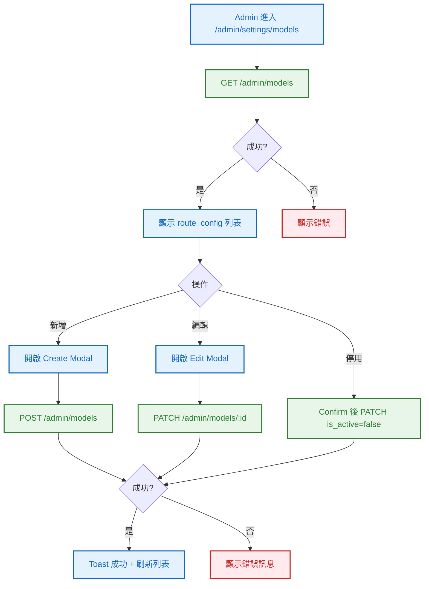
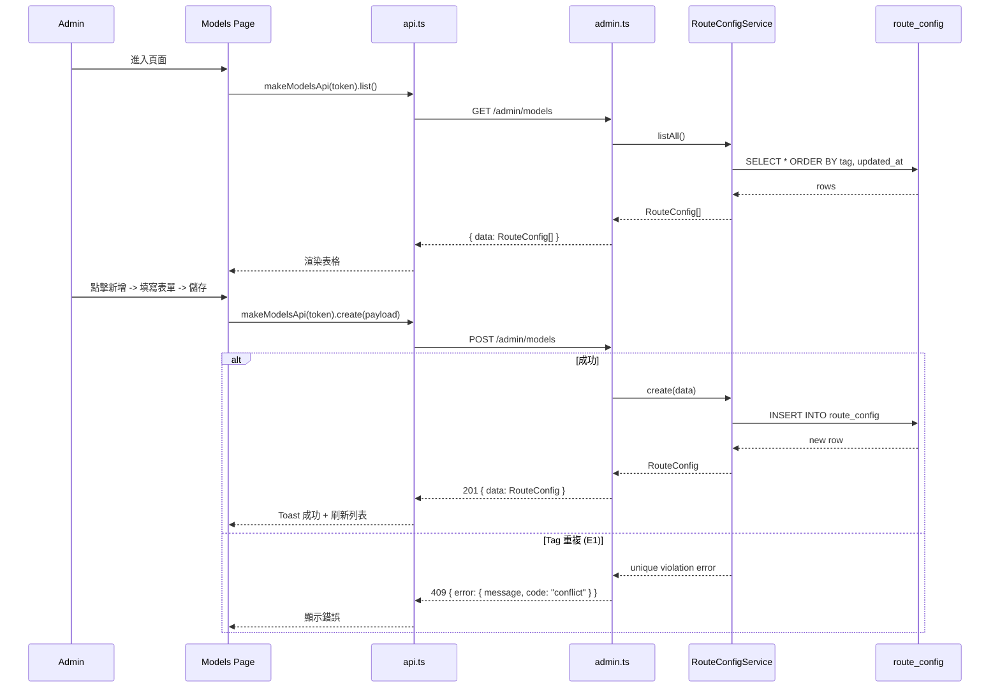

# S1 Dev Spec: Admin Model Route Management

> **階段**: S1 技術分析
> **建立時間**: 2026-03-15 10:00
> **Agent**: codebase-explorer (Phase 1) + architect (Phase 2)
> **工作類型**: new_feature
> **複雜度**: S-M

---

## 1. 概述

### 1.1 需求參照
> 完整需求見 `s0_brief_spec.md`，以下僅摘要。

在 Admin Web UI 新增模型路由管理頁面（`/admin/settings/models`），讓管理員可透過 UI 管理 `route_config` 表中的路由設定，取代直接操作 DB。

### 1.2 技術方案摘要

後端在現有 `adminRoutes()` 中新增 3 個 endpoints（GET/POST/PATCH `/admin/models`），新建 `RouteConfigService` 封裝 CRUD 邏輯。前端新增 Models 管理頁面，複用現有 Rates 頁面的 UI 模式（table + Radix Dialog modal + Toast）。Sidebar 新增導航連結。

---

## 2. 影響範圍（Phase 1：codebase-explorer）

### 2.1 受影響檔案

#### Backend (Hono / TypeScript)
| 檔案 | 變更類型 | 說明 |
|------|---------|------|
| `packages/api-server/src/services/RouteConfigService.ts` | 新增 | route_config CRUD 服務 |
| `packages/api-server/src/routes/admin.ts` | 修改 | 新增 GET/POST/PATCH /models endpoints |

#### Frontend (Next.js / TypeScript)
| 檔案 | 變更類型 | 說明 |
|------|---------|------|
| `packages/web-admin/src/lib/api.ts` | 修改 | 新增 RouteConfig types + makeModelsApi factory |
| `packages/web-admin/src/app/admin/(protected)/settings/models/page.tsx` | 新增 | Models 管理頁面 |
| `packages/web-admin/src/components/AppLayout.tsx` | 修改 | Sidebar 新增 Models 導航項 |

#### Database
| 資料表 | 變更類型 | 說明 |
|--------|---------|------|
| `route_config` | 不動 | 已存在，無需 migration |

### 2.2 依賴關係
- **上游依賴**: `supabaseAdmin` client、`adminAuth` middleware（已存在）
- **下游影響**: 無。新增的 API 不影響現有 `RouterService`（只是共用同一張表）

### 2.3 現有模式與技術考量

後端模式：
- Service 層封裝 DB 操作（參考 `RatesService.ts`）
- Route 層做參數驗證 + 呼叫 Service（參考 `admin.ts` 現有 endpoints）
- 錯誤回傳使用 `Errors.*` helper

前端模式：
- 頁面使用 `'use client'` directive
- API 呼叫透過 `makeXxxApi(token)` factory pattern（參考 `makeRatesApi`）
- Modal 使用 `@radix-ui/react-dialog`
- Toast 使用 inline Toast component
- Table 使用原生 HTML table + Tailwind styling
- Auth token 取自 `supabase.auth.getSession()`

---

## 3. User Flow（Phase 2：architect）



### 3.1 主要流程
| 步驟 | 用戶動作 | 系統回應 | 備註 |
|------|---------|---------|------|
| 1 | 點擊 Sidebar "Settings: Models" | 導航至 /admin/settings/models | |
| 2 | 頁面載入 | GET /admin/models，顯示表格 | 包含 inactive 記錄 |
| 3a | 點擊「新增路由」 | 開啟 Create Modal | |
| 3b | 填寫表單，點擊儲存 | POST /admin/models，成功後刷新 | |
| 4a | 點擊某筆的「編輯」 | 開啟 Edit Modal，預填現有值 | |
| 4b | 修改欄位，點擊儲存 | PATCH /admin/models/:id，成功後刷新 | |
| 5 | 點擊某筆的「停用」 | PATCH /admin/models/:id {is_active: false} | 需確認 |

### 3.2 異常流程

| S0 ID | 情境 | 觸發條件 | 系統處理 | 用戶看到 |
|-------|------|---------|---------|---------|
| E1 | Tag 重複 | 新增時 tag 與 active 路由重複 | DB unique index violation -> 409 | Modal 顯示錯誤 |
| E2 | API 失敗 | 網路問題或 server error | 500 | Toast 或 inline error |
| E3 | 表單驗證失敗 | 必填欄位空白 | 前端阻擋 | 表單紅字提示 |

---

## 4. Data Flow



### 4.1 API 契約

> 完整 API 規格見 [`s1_api_spec.md`](./s1_api_spec.md)。

**Endpoint 摘要**

| Method | Path | 說明 |
|--------|------|------|
| `GET` | `/admin/models` | 列出所有 route_config（含 inactive） |
| `POST` | `/admin/models` | 新增 route_config |
| `PATCH` | `/admin/models/:id` | 更新 route_config（含 is_active 切換） |

### 4.2 資料模型

#### RouteConfig Entity (已存在)
```
route_config:
  id: UUID (PK, auto-generated)
  tag: TEXT (NOT NULL)
  upstream_provider: TEXT (NOT NULL)
  upstream_model: TEXT (NOT NULL)
  upstream_base_url: TEXT (NOT NULL)
  is_active: BOOLEAN (NOT NULL, default true)
  updated_at: TIMESTAMPTZ (NOT NULL, default now())

Constraints:
  - UNIQUE INDEX on (tag) WHERE is_active = true
```

---

## 5. 任務清單

### 5.1 任務總覽

| # | 任務 | 類型 | 複雜度 | Agent | 依賴 |
|---|------|------|--------|-------|------|
| T1 | RouteConfigService | 後端 | S | backend-expert | - |
| T2 | Admin Models API endpoints | 後端 | S | backend-expert | T1 |
| T3 | 前端 api.ts 擴充 | 前端 | S | frontend-expert | - |
| T4 | Models 管理頁面 | 前端 | M | frontend-expert | T3 |
| T5 | AppLayout sidebar 新增 Models 連結 | 前端 | S | frontend-expert | - |
| T6 | 整合測試 | 測試 | S | test-engineer | T1-T5 |

### 5.2 任務詳情

#### Task T1: RouteConfigService

- **類型**: 後端
- **複雜度**: S
- **Agent**: backend-expert
- **描述**: 建立 `RouteConfigService`，封裝 route_config 表的 CRUD 操作（listAll, create, update）。參考 `RatesService.ts` 模式。
- **DoD (Definition of Done)**:
  - [ ] `packages/api-server/src/services/RouteConfigService.ts` 建立
  - [ ] `listAll()` 方法：回傳所有 route_config，ORDER BY tag ASC, updated_at DESC
  - [ ] `create(data)` 方法：INSERT，回傳新建記錄
  - [ ] `update(id, data)` 方法：UPDATE + 自動設定 updated_at，回傳更新後記錄，找不到拋出 not_found
- **驗收方式**: TypeScript 編譯通過，方法簽名正確

#### Task T2: Admin Models API endpoints

- **類型**: 後端
- **複雜度**: S
- **Agent**: backend-expert
- **依賴**: T1
- **描述**: 在 `admin.ts` 新增 3 個 route handlers（GET/POST/PATCH `/models`），含參數驗證、呼叫 RouteConfigService、錯誤處理。參考 admin.ts 現有 rates endpoints 的模式。
- **DoD**:
  - [ ] GET `/admin/models` 回傳完整列表
  - [ ] POST `/admin/models` 含必填欄位驗證（tag, upstream_provider, upstream_model, upstream_base_url），回傳 201
  - [ ] PATCH `/admin/models/:id` 含至少一個欄位更新驗證，回傳 200
  - [ ] 409 handling：unique constraint violation 時回傳 conflict error
  - [ ] 404 handling：update 找不到時回傳 not_found
- **驗收方式**: curl 測試三個 endpoints

#### Task T3: 前端 api.ts 擴充

- **類型**: 前端
- **複雜度**: S
- **Agent**: frontend-expert
- **描述**: 在 `api.ts` 新增 `RouteConfig` type 與 `makeModelsApi(token)` factory，提供 `list()`, `create()`, `update()` 方法。參考 `makeRatesApi` 模式。
- **DoD**:
  - [ ] `RouteConfig` interface 定義（id, tag, upstream_provider, upstream_model, upstream_base_url, is_active, updated_at）
  - [ ] `RouteConfigCreate` interface 定義
  - [ ] `makeModelsApi(token)` factory：list, create, update 三個方法
- **驗收方式**: TypeScript 編譯通過

#### Task T4: Models 管理頁面

- **類型**: 前端
- **複雜度**: M
- **Agent**: frontend-expert
- **依賴**: T3
- **描述**: 建立 `/admin/settings/models/page.tsx`。完整複用 Rates 頁面的 UI 模式（table + Radix Dialog + Toast）。表格顯示所有 route_config，含 is_active 狀態標記。新增/編輯 Modal 含 tag, upstream_provider, upstream_model, upstream_base_url, is_active 欄位。停用功能透過編輯 Modal 切換 is_active。
- **DoD**:
  - [ ] 頁面建立於 `packages/web-admin/src/app/admin/(protected)/settings/models/page.tsx`
  - [ ] 表格顯示所有欄位 + is_active 狀態 badge
  - [ ] 新增路由 Modal（Create Dialog）含表單驗證
  - [ ] 編輯路由 Modal（Edit Dialog）含預填值 + is_active toggle
  - [ ] 操作後 Toast 通知 + 列表刷新
  - [ ] 空狀態提示
  - [ ] Loading skeleton
- **驗收方式**: 開發環境手動操作驗證

#### Task T5: AppLayout sidebar 新增 Models 連結

- **類型**: 前端
- **複雜度**: S
- **Agent**: frontend-expert
- **描述**: 在 `AppLayout.tsx` 的 `navItems` 陣列中新增 `{ href: '/admin/settings/models', label: 'Settings: Models' }`，放在 `Settings: Rates` 之後。
- **DoD**:
  - [ ] navItems 新增 Models 項目
  - [ ] 導航連結可正確點擊進入 /admin/settings/models
  - [ ] Active 狀態高亮正常
- **驗收方式**: UI 驗證

#### Task T6: 整合測試

- **類型**: 測試
- **複雜度**: S
- **Agent**: test-engineer
- **依賴**: T1-T5
- **描述**: 驗證 API endpoints 正常運作、前端頁面可正常操作。以手動測試清單 + curl 為主。
- **DoD**:
  - [ ] GET /admin/models 回傳正確資料
  - [ ] POST /admin/models 可新增路由
  - [ ] PATCH /admin/models/:id 可更新路由
  - [ ] PATCH is_active=false 可停用路由
  - [ ] 前端頁面 CRUD 流程完整
- **驗收方式**: 手動測試清單

---

## 6. 技術決策

### 6.1 架構決策

| 決策點 | 選項 | 選擇 | 理由 |
|--------|------|------|------|
| Service 拆分 | A: 新建 RouteConfigService / B: 擴充 RouterService | A | RouterService 負責路由解析與轉發，CRUD 管理是不同職責，遵循單一職責原則 |
| API 路徑 | A: /admin/models / B: /admin/routes | A | 對 Admin 來說管理的是「模型」的路由映射，models 更直觀 |
| 停用 vs 刪除 | A: Soft delete (is_active=false) / B: Hard delete | A | 安全考量 + DB 不刪除資料原則 |

### 6.2 設計模式
- **Pattern**: 與現有 Rates 管理一致的 Service + Route + API Factory + Page 四層模式
- **理由**: 保持 codebase 一致性，降低認知負擔

### 6.3 相容性考量
- **向後相容**: 新增 API，不影響現有功能
- **Migration**: 不需要

---

## 7. 驗收標準

### 7.1 功能驗收
| # | 場景 | Given | When | Then | 優先級 |
|---|------|-------|------|------|--------|
| 1 | 查看列表 | Admin 已登入 | 進入 /admin/settings/models | 看到所有 route_config 記錄（含 inactive），欄位齊全 | P0 |
| 2 | 新增路由 | Admin 在 Models 頁面 | 點擊新增，填寫完整欄位，儲存 | 新記錄出現在列表，Toast 成功 | P0 |
| 3 | 編輯路由 | 列表有一筆記錄 | 點擊編輯，修改 provider，儲存 | 記錄更新，列表刷新 | P0 |
| 4 | 停用路由 | 列表有一筆 active 記錄 | 編輯並將 is_active 切為 false，儲存 | 記錄顯示 inactive 狀態 | P0 |
| 5 | Tag 重複 | 已有 active 的 apex-smart | 新增另一個 tag=apex-smart 的 active 路由 | 顯示衝突錯誤 | P1 |
| 6 | 表單驗證 | Admin 在 Create Modal | 不填 tag 直接儲存 | 表單顯示驗證錯誤 | P1 |

### 7.2 非功能驗收
| 項目 | 標準 |
|------|------|
| 安全 | 所有 endpoints 需經 adminAuth middleware 驗證 |
| 一致性 | UI 風格與 Rates 頁面一致 |

### 7.3 測試計畫
- **單元測試**: N/A（簡單 CRUD，投入產出比低）
- **整合測試**: 手動 curl 測試 API + UI 操作驗證
- **E2E 測試**: 手動測試清單

---

## 8. 風險與緩解

| 風險 | 影響 | 機率 | 緩解措施 | 負責人 |
|------|------|------|---------|--------|
| 停用路由導致線上 API 立即失敗 | 高 | 中 | 停用前 UI 顯示確認提示 | frontend-expert |
| Unique index violation 錯誤訊息不友善 | 低 | 中 | 後端捕獲 DB error 轉換為 409 + 友善訊息 | backend-expert |

### 回歸風險
- RouterService.resolveRoute() 行為不變（只讀 active routes），無回歸風險
- 現有 admin.ts 其他 endpoints 不受影響（只新增 route handlers）
