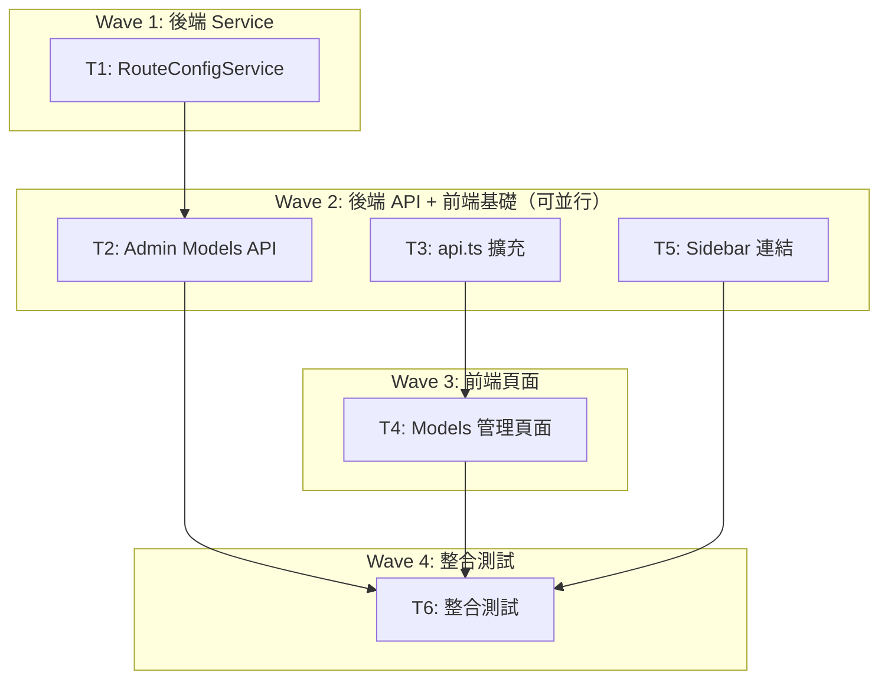

# S3 Implementation Plan: Admin Model Route Management

> **階段**: S3 實作計畫
> **建立時間**: 2026-03-15 10:00
> **Agents**: backend-expert, frontend-expert, test-engineer

---

## 1. 概述

### 1.1 功能目標
在 Admin Web UI 新增模型路由管理頁面，讓管理員可透過 `/admin/settings/models` 管理 `route_config` 表（查看/新增/修改/停用）。

### 1.2 實作範圍
- **範圍內**: RouteConfigService、Admin Models API、前端 api.ts 擴充、Models 頁面、Sidebar 連結
- **範圍外**: DB migration、DELETE endpoint、負載均衡

### 1.3 關聯文件
| 文件 | 路徑 | 狀態 |
|------|------|------|
| Brief Spec | `./s0_brief_spec.md` | completed |
| Dev Spec | `./s1_dev_spec.md` | completed |
| API Spec | `./s1_api_spec.md` | completed |
| Implementation Plan | `./s3_implementation_plan.md` | 當前 |

---

## 2. 實作任務清單

### 2.1 任務總覽

| # | 任務 | 類型 | Agent | 依賴 | 複雜度 | TDD | 狀態 |
|---|------|------|-------|------|--------|-----|------|
| T1 | RouteConfigService | 後端 | `backend-expert` | - | S | N/A | pending |
| T2 | Admin Models API endpoints | 後端 | `backend-expert` | T1 | S | N/A | pending |
| T3 | 前端 api.ts 擴充 | 前端 | `frontend-expert` | - | S | N/A | pending |
| T4 | Models 管理頁面 | 前端 | `frontend-expert` | T3 | M | N/A | pending |
| T5 | AppLayout sidebar 連結 | 前端 | `frontend-expert` | - | S | N/A | pending |
| T6 | 整合測試 | 測試 | `test-engineer` | T1-T5 | S | N/A | pending |

**TDD**: N/A -- 簡單 CRUD 功能，無複雜業務邏輯需 TDD 守護。

---

## 3. 任務詳情

### Task T1: RouteConfigService

**基本資訊**
| 項目 | 內容 |
|------|------|
| 類型 | 後端 |
| Agent | `backend-expert` |
| 複雜度 | S |
| 依賴 | - |
| 狀態 | pending |

**描述**
建立 `RouteConfigService`，參考 `RatesService.ts` 模式，封裝 route_config 的 CRUD。

**輸出**
- `packages/api-server/src/services/RouteConfigService.ts`

**受影響檔案**
| 檔案 | 變更類型 | 說明 |
|------|---------|------|
| `packages/api-server/src/services/RouteConfigService.ts` | 新增 | Service class |

**DoD**
- [ ] listAll(): 回傳全部 route_config，ORDER BY tag ASC, updated_at DESC
- [ ] create(data): INSERT + 回傳新建記錄，DB error 正確拋出
- [ ] update(id, data): UPDATE + updated_at = now()，回傳更新記錄，不存在拋 not_found

**TDD Plan**: N/A -- 簡單 DB CRUD wrapper，無獨立可測邏輯

**驗證方式**
```bash
cd /Users/asd/demo/1/packages/api-server && npx tsc --noEmit
```

---

### Task T2: Admin Models API endpoints

**基本資訊**
| 項目 | 內容 |
|------|------|
| 類型 | 後端 |
| Agent | `backend-expert` |
| 複雜度 | S |
| 依賴 | T1 |
| 狀態 | pending |

**描述**
在 `admin.ts` 的 `adminRoutes()` 函式中新增 3 個 route handlers。參考現有 rates endpoints 的驗證+錯誤處理模式。

**受影響檔案**
| 檔案 | 變更類型 | 說明 |
|------|---------|------|
| `packages/api-server/src/routes/admin.ts` | 修改 | 新增 models endpoints |

**DoD**
- [ ] GET /models: 列出所有 route_config
- [ ] POST /models: 驗證必填欄位(tag, upstream_provider, upstream_model, upstream_base_url)，unique violation 回傳 409
- [ ] PATCH /models/:id: 驗證至少一個更新欄位，not_found 回傳 404，unique violation 回傳 409
- [ ] 所有 endpoint 遵循 adminAuth middleware（已由 parent route 保護）

**TDD Plan**: N/A -- route handler 為膠水層

**驗證方式**
```bash
# 啟動 server 後
curl -s http://localhost:3000/admin/models -H "Authorization: Bearer <token>" | jq
curl -s -X POST http://localhost:3000/admin/models -H "Authorization: Bearer <token>" -H "Content-Type: application/json" -d '{"tag":"test","upstream_provider":"anthropic","upstream_model":"test-model","upstream_base_url":"https://api.anthropic.com"}' | jq
```

---

### Task T3: 前端 api.ts 擴充

**基本資訊**
| 項目 | 內容 |
|------|------|
| 類型 | 前端 |
| Agent | `frontend-expert` |
| 複雜度 | S |
| 依賴 | - |
| 狀態 | pending |

**描述**
在 `api.ts` 新增 RouteConfig 相關 types 與 `makeModelsApi(token)` factory，參考 `makeRatesApi` 模式。

**受影響檔案**
| 檔案 | 變更類型 | 說明 |
|------|---------|------|
| `packages/web-admin/src/lib/api.ts` | 修改 | 新增 types + factory |

**DoD**
- [ ] RouteConfig interface（id, tag, upstream_provider, upstream_model, upstream_base_url, is_active, updated_at）
- [ ] RouteConfigCreate interface（tag, upstream_provider, upstream_model, upstream_base_url, is_active?）
- [ ] makeModelsApi(token) factory：list(), create(data), update(id, data)

**TDD Plan**: N/A -- type definitions + API factory wrapper

**驗證方式**
```bash
cd /Users/asd/demo/1/packages/web-admin && npx tsc --noEmit
```

---

### Task T4: Models 管理頁面

**基本資訊**
| 項目 | 內容 |
|------|------|
| 類型 | 前端 |
| Agent | `frontend-expert` |
| 複雜度 | M |
| 依賴 | T3 |
| 狀態 | pending |

**描述**
建立 Models 管理頁面，完整複用 Rates 頁面的 UI 模式。表格顯示所有 route_config（含 inactive），新增/編輯 Modal 含所有欄位，停用透過 Edit Modal 中的 is_active toggle。

**受影響檔案**
| 檔案 | 變更類型 | 說明 |
|------|---------|------|
| `packages/web-admin/src/app/admin/(protected)/settings/models/page.tsx` | 新增 | 完整頁面 |

**DoD**
- [ ] 表格列出所有 route_config（tag, provider, model, URL, active 狀態 badge, updated_at）
- [ ] inactive 記錄以灰色或 badge 標記
- [ ] Create Modal：tag, upstream_provider, upstream_model, upstream_base_url 必填；is_active 預設 true
- [ ] Edit Modal：預填現有值，可修改所有欄位含 is_active（checkbox/switch）
- [ ] 操作後 Toast 通知 + 列表自動刷新
- [ ] 空狀態提示
- [ ] Loading skeleton（複用 LoadingSkeleton）
- [ ] 表單驗證：前端阻擋空白必填欄位

**TDD Plan**: N/A -- UI page

**驗證方式**
手動操作驗證：進入頁面 -> 新增 -> 編輯 -> 停用

**實作備註**
- 參考 `packages/web-admin/src/app/admin/(protected)/settings/rates/page.tsx` 的完整實作模式
- 使用 `@radix-ui/react-dialog` for modals
- 使用 `lucide-react` icons（Plus, Pencil, X, AlertCircle, CheckCircle2）
- Active badge 建議用綠色/灰色區分

---

### Task T5: AppLayout sidebar 連結

**基本資訊**
| 項目 | 內容 |
|------|------|
| 類型 | 前端 |
| Agent | `frontend-expert` |
| 複雜度 | S |
| 依賴 | - |
| 狀態 | pending |

**描述**
在 `AppLayout.tsx` 的 `navItems` 陣列新增 Models 連結。

**受影響檔案**
| 檔案 | 變更類型 | 說明 |
|------|---------|------|
| `packages/web-admin/src/components/AppLayout.tsx` | 修改 | navItems 新增一項 |

**DoD**
- [ ] navItems 新增 `{ href: '/admin/settings/models', label: 'Settings: Models' }`
- [ ] 位置在 `Settings: Rates` 之後

**TDD Plan**: N/A -- 單行設定變更

**驗證方式**
UI 驗證 sidebar 出現 "Settings: Models" 連結

---

### Task T6: 整合測試

**基本資訊**
| 項目 | 內容 |
|------|------|
| 類型 | 測試 |
| Agent | `test-engineer` |
| 複雜度 | S |
| 依賴 | T1-T5 |
| 狀態 | pending |

**描述**
驗證完整 CRUD 流程：API 回傳正確 + 前端操作順暢。

**DoD**
- [ ] GET /admin/models 回傳資料格式正確
- [ ] POST /admin/models 新增成功 + 重複 tag 回 409
- [ ] PATCH /admin/models/:id 更新成功 + 不存在回 404
- [ ] 前端頁面完整操作流程無錯誤
- [ ] Sidebar 連結正常導航

**TDD Plan**: N/A -- 手動整合測試

**驗證方式**
手動測試清單 + curl 命令

---

## 4. 依賴關係圖



---

## 5. 執行順序與 Agent 分配

### 5.1 執行波次

| 波次 | 任務 | Agent | 可並行 | 備註 |
|------|------|-------|--------|------|
| Wave 1 | T1 | `backend-expert` | 否 | Service 層 |
| Wave 2 | T2 | `backend-expert` | 是（T2, T3, T5 可並行） | API 層 |
| Wave 2 | T3 | `frontend-expert` | 是（與 T2 並行） | 前端 types + API factory |
| Wave 2 | T5 | `frontend-expert` | 是（與 T2 並行） | Sidebar 連結 |
| Wave 3 | T4 | `frontend-expert` | 否 | 依賴 T3 |
| Wave 4 | T6 | `test-engineer` | 否 | 依賴全部完成 |

---

## 6. 驗證計畫

### 6.1 逐任務驗證

| 任務 | 驗證指令 | 預期結果 |
|------|---------|---------|
| T1 | `cd packages/api-server && npx tsc --noEmit` | 無錯誤 |
| T2 | `curl -s http://localhost:3000/admin/models` | 200 + JSON |
| T3 | `cd packages/web-admin && npx tsc --noEmit` | 無錯誤 |
| T4 | 手動操作頁面 | CRUD 流程完整 |
| T5 | 開啟 sidebar | Models 連結出現 |
| T6 | 手動測試清單 | 全部通過 |

### 6.2 整體驗證

```bash
# 後端編譯
cd /Users/asd/demo/1/packages/api-server && npx tsc --noEmit

# 前端編譯
cd /Users/asd/demo/1/packages/web-admin && npx tsc --noEmit
```

---

## 7. 實作進度追蹤

### 7.1 進度總覽

| 指標 | 數值 |
|------|------|
| 總任務數 | 6 |
| 已完成 | 0 |
| 進行中 | 0 |
| 待處理 | 6 |
| 完成率 | 0% |

---

## 8. 變更記錄

### 8.1 檔案變更清單

```
新增：
  packages/api-server/src/services/RouteConfigService.ts
  packages/web-admin/src/app/admin/(protected)/settings/models/page.tsx

修改：
  packages/api-server/src/routes/admin.ts
  packages/web-admin/src/lib/api.ts
  packages/web-admin/src/components/AppLayout.tsx
```

---

## 9. 風險與問題追蹤

### 9.1 已識別風險

| # | 風險 | 影響 | 緩解措施 | 狀態 |
|---|------|------|---------|------|
| 1 | 停用路由導致線上請求失敗 | 高 | Edit Modal 停用時加確認提示 | 監控中 |
| 2 | Unique index violation 訊息不友善 | 低 | 後端捕獲轉為友善 409 | 監控中 |
