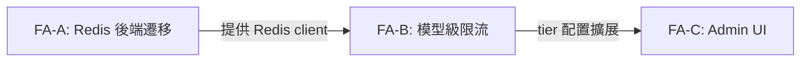
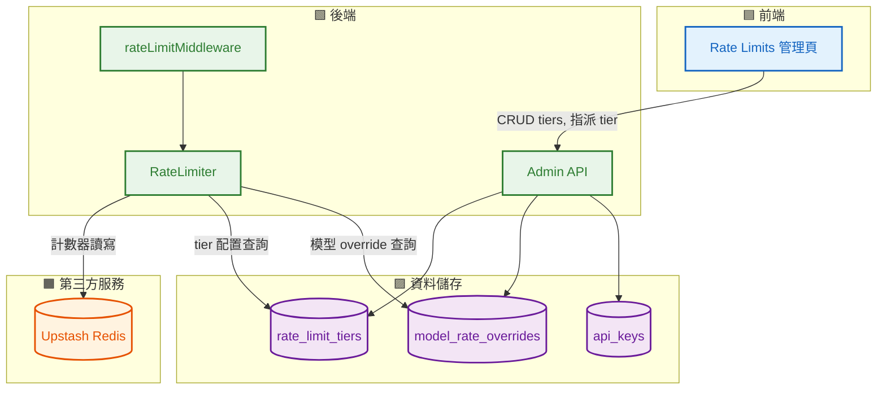
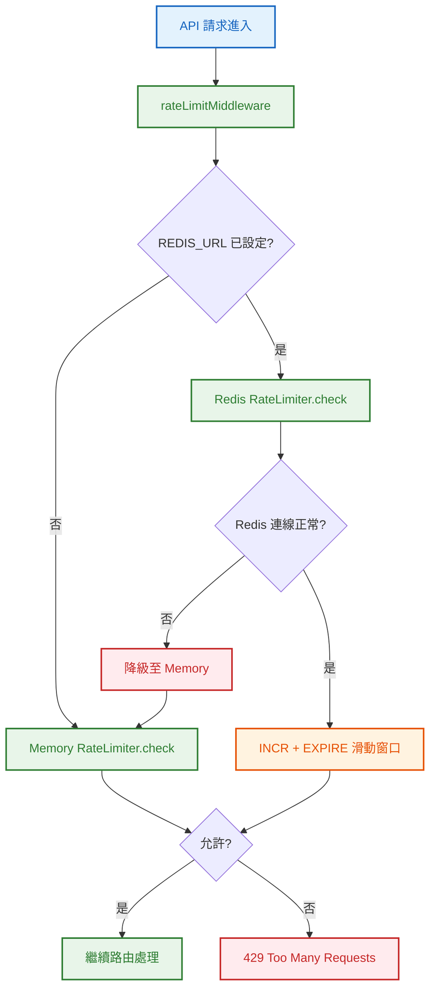
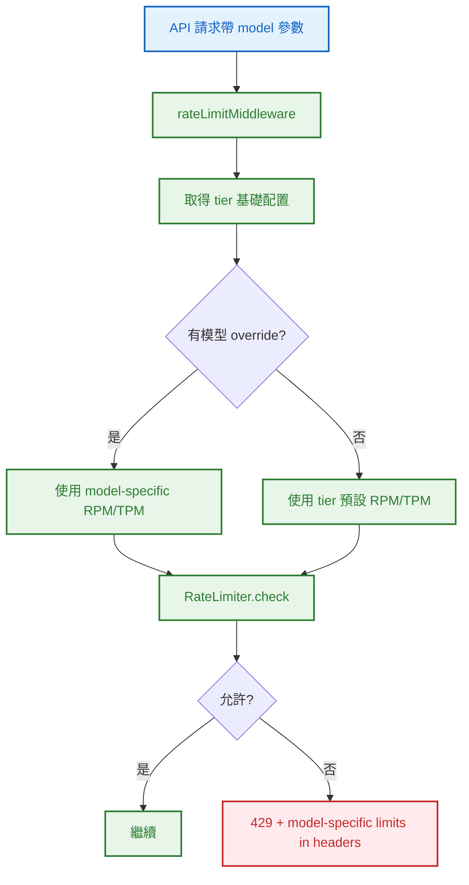
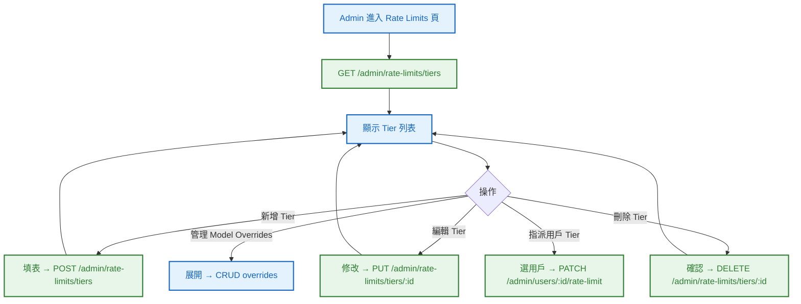
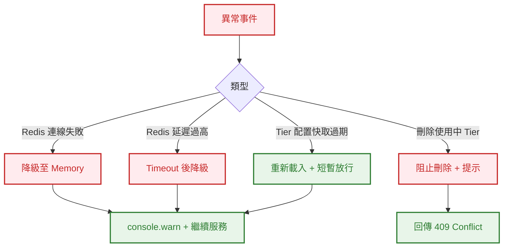

# S0 Brief Spec: Rate Limiting v2（Redis + 模型級限流 + Admin UI）

> **階段**: S0 需求討論
> **建立時間**: 2026-03-15 14:00
> **Agent**: requirement-analyst
> **Spec Mode**: Full Spec
> **工作類型**: refactor

---

## 0. 工作類型

**本次工作類型**：`refactor`（增強現有 Rate Limiting 架構 + 新增 Admin UI）

## 1. 一句話描述

將現有記憶體版 Rate Limiter 遷移至 Redis（Upstash），新增按模型維度的細粒度限流，並提供 Admin UI 管理 tier 配置與用戶 tier 指派。

## 2. 為什麼要做

### 2.1 痛點

- **多程序失效**：計數器存於記憶體（Map），多程序/多實例部署時各自獨立計數，限流形同虛設
- **無分佈式鎖**：並發請求在時間窗口邊界可能 race condition，短暫超限
- **粒度不足**：所有模型共用同一 RPM/TPM 配額，無法反映不同模型的成本差異（GPT-4 vs GPT-3.5）
- **管理不透明**：Tier 配置只能直接改 DB，無 Admin UI；用戶 tier 指派需 curl API

### 2.2 目標

- Rate Limiting 在多程序/多實例部署下正確運作
- 不同模型可設定不同的 RPM/TPM 限制
- Admin 可在 UI 上管理 tier 配置和用戶 tier 指派
- `REDIS_URL` 未設定時自動降級為記憶體版（開發環境零依賴）

## 3. 使用者

| 角色 | 說明 |
|------|------|
| API 消費者 | 透過 API Key 發送請求，受 rate limit 控制 |
| Admin | 管理 tier 配置、指派用戶 tier |
| 系統維運 | 部署 Redis、監控限流狀態 |

## 4. 核心流程

### 4.0 功能區拆解

#### 功能區識別表

| FA ID | 功能區名稱 | 一句話描述 | 入口 | 獨立性 |
|-------|-----------|-----------|------|--------|
| FA-A | Redis 後端遷移 | RateLimiter 從記憶體改用 Redis，含 fallback 機制 | API 請求進入 rateLimitMiddleware | 高 |
| FA-B | 模型級限流 | 擴展 tier 配置支援 per-model RPM/TPM override | API 請求帶有 model 參數 | 中（依賴 FA-A） |
| FA-C | Admin Rate Limit UI | 前端管理 tier CRUD + 用戶 tier 指派 | Admin 進入 Settings: Rate Limits 頁 | 高 |

#### 拆解策略

**本次策略**：`single_sop_fa_labeled`

3 個 FA，FA-B 依賴 FA-A 的 Redis 基礎設施，但流程各自獨立。一份 spec 按 FA 標籤組織。

#### 跨功能區依賴



| 來源 FA | 目標 FA | 依賴類型 | 說明 |
|---------|---------|---------|------|
| FA-A | FA-B | 資料共用 | FA-B 的模型限流使用 FA-A 的 Redis client |
| FA-B | FA-C | 資料共用 | FA-C 的 UI 管理 FA-B 擴展後的 tier 配置 |

---

### 4.1 系統架構總覽



---

### 4.2 FA-A: Redis 後端遷移

#### 4.2.1 全局流程圖



**技術細節**：
- Redis 滑動窗口使用 Sorted Set（`ZADD` + `ZRANGEBYSCORE` + `ZCARD`）或簡化版 `INCR` + `EXPIRE`
- Fallback 邏輯：Redis 連線失敗時 console.warn 並降級至記憶體版
- Upstash REST API（`@upstash/redis`）不需長連線

#### 4.2.N Happy Path 摘要

| 路徑 | 入口 | 結果 |
|------|------|------|
| **A：Redis 正常** | API 請求 → Redis INCR → 未超限 | 繼續處理 |
| **B：Redis 降級** | API 請求 → Redis 失敗 → Memory fallback | 繼續處理（記憶體版） |

---

### 4.3 FA-B: 模型級限流

#### 4.3.1 全局流程圖



**技術細節**：
- `model_rate_overrides` 表：`(tier, model_pattern, rpm, tpm)`
- `model_pattern` 支援精確匹配（如 `gpt-4`）和前綴匹配（如 `gpt-4*`）
- Redis key 格式：`rl:{keyId}:{model}:rpm` / `rl:{keyId}:{model}:tpm`
- 無 override 時 fallback 到 tier 預設值

#### 4.3.N Happy Path 摘要

| 路徑 | 入口 | 結果 |
|------|------|------|
| **A：有 model override** | 請求 gpt-4（override: rpm=10） | 套用 model-specific 限制 |
| **B：無 override** | 請求未知模型 | 套用 tier 預設限制 |

---

### 4.4 FA-C: Admin Rate Limit UI

#### 4.4.1 全局流程圖



#### 4.4.N Happy Path 摘要

| 路徑 | 入口 | 結果 |
|------|------|------|
| **A：CRUD Tier** | Admin 新增/編輯/刪除 tier | tier 配置更新 |
| **B：Model Override** | Admin 為 tier 設定模型級限制 | override 儲存 |
| **C：指派 Tier** | Admin 為用戶指派 tier | 用戶的所有 key 更新 |

---

### 4.5 例外流程圖



### 4.6 六維度例外清單

| 維度 | ID | FA | 情境 | 觸發條件 | 預期行為 | 嚴重度 |
|------|-----|-----|------|---------|---------|--------|
| 並行/競爭 | E1 | FA-A | 多實例同時 INCR | 高並發窗口邊界 | Redis 原子操作保證正確性 | P1 |
| 狀態轉換 | E2 | FA-A | Redis 連線中斷 | Redis 不可用 | 降級至 Memory + warn log | P0 |
| 資料邊界 | E3 | FA-B | model_pattern 為空或 * | 配置錯誤 | 拒絕儲存，回傳 400 | P1 |
| 網路/外部 | E4 | FA-A | Upstash 延遲 >100ms | 網路抖動 | Timeout 後降級 | P1 |
| 業務邏輯 | E5 | FA-C | 刪除仍有用戶使用的 tier | Admin 操作 | 阻止刪除，提示 409 | P1 |
| UI/體驗 | E6 | FA-C | Tier 列表載入失敗 | API 錯誤 | 顯示錯誤提示 + 重試按鈕 | P2 |

### 4.7 白話文摘要

這次改造讓 API 限流在多台伺服器同時運行時依然正確計數（透過 Redis 共享計數器）。管理員可以在後台介面直接調整不同會員等級的限流數值，也能針對特定 AI 模型設定更嚴格的限制（例如 GPT-4 每分鐘只能請求 10 次）。當 Redis 暫時不可用時，系統會自動降回單機模式繼續服務，不會中斷。

## 5. 成功標準

| # | FA | 類別 | 標準 | 驗證方式 |
|---|-----|------|------|---------|
| SC-1 | FA-A | 功能 | `REDIS_URL` 設定時，計數器存取走 Redis | 單元測試 mock Redis client |
| SC-2 | FA-A | 功能 | `REDIS_URL` 未設定時，自動降級為記憶體版 | 單元測試 |
| SC-3 | FA-A | 功能 | Redis 連線中斷時，降級至記憶體版並 console.warn | 單元測試 |
| SC-4 | FA-A | 相容 | 現有 9 個 RateLimiter 測試全部通過 | `pnpm test` |
| SC-5 | FA-B | 功能 | 有 model override 時，使用 model-specific RPM/TPM | 單元測試 |
| SC-6 | FA-B | 功能 | 無 model override 時，fallback 到 tier 預設值 | 單元測試 |
| SC-7 | FA-B | 功能 | model_rate_overrides 表支援 CRUD | API 測試 |
| SC-8 | FA-C | 功能 | Admin UI 可列出/新增/編輯/刪除 tier | 手動測試 |
| SC-9 | FA-C | 功能 | Admin UI 可管理 model override | 手動測試 |
| SC-10 | FA-C | 功能 | Admin UI 可指派用戶 tier | 手動測試 |
| SC-11 | FA-A | 效能 | Rate limit 檢查增加延遲 < 5ms（Redis RTT） | 觀察 |

## 6. 範圍

### 範圍內
- **FA-A**: RateLimiter 遷移至 Redis（Upstash `@upstash/redis`）
- **FA-A**: Redis 不可用時自動降級至記憶體版
- **FA-A**: Redis key 設計 + TTL 管理
- **FA-B**: `model_rate_overrides` 表 + migration
- **FA-B**: RateLimiter 支援 per-model RPM/TPM
- **FA-B**: rateLimitMiddleware 傳入 model 參數
- **FA-C**: Admin Rate Limits 頁面（Tier CRUD + Model Override CRUD）
- **FA-C**: Admin 用戶 Tier 指派 UI
- **FA-C**: Sidebar 導航新增 Settings: Rate Limits

### 範圍外
- IP 級限流（未來功能）
- 端點級限流（目前只有一個 proxy 端點）
- Rate limit 監控面板 / Prometheus 指標
- Rate limit 事件 Webhook 通知
- 自訂滑動窗口大小（維持 1 分鐘）
- Redis Cluster / Sentinel（Upstash 已處理高可用）

## 7. 已知限制與約束

- Upstash Redis REST API 有 ~1-3ms 延遲，比本地 Redis 慢但可接受
- 記憶體版 fallback 不支援多程序，只是單機降級
- `@upstash/redis` 套件需新增依賴
- Tier 刪除需檢查是否有用戶使用中

## 8. 前端 UI 畫面清單

### 8.1 FA-C: Admin Rate Limit UI 畫面

| # | 畫面 | 狀態 | 既有檔案 | 變更說明 |
|---|------|------|---------|---------|
| 1 | **Rate Limits 管理頁** | 新增 | — | Tier 列表 + CRUD + Model Override 管理 |
| 2 | **Sidebar** | 既有修改 | `AppLayout.tsx` | 新增 Settings: Rate Limits 導航 |

### 8.2 Alert / 彈窗清單

| # | Alert | FA | 狀態 | 觸發場景 | 內容摘要 |
|---|-------|-----|------|---------|---------|
| A1 | **刪除確認** | FA-C | 新增 | 刪除 tier 時 | 「確定刪除？此操作不可復原」 |
| A2 | **刪除阻止** | FA-C | 新增 | 刪除使用中 tier | 「此 tier 仍有 N 個用戶使用中」 |

### 8.3 畫面統計摘要

| 類別 | 數量 |
|------|------|
| 新增畫面 | 1（Rate Limits 管理頁） |
| 既有修改 | 1（Sidebar） |
| 新增 Alert | 2 |

---

## 10. SDD Context

```json
{
  "sdd_context": {
    "stages": {
      "s0": {
        "status": "pending_confirmation",
        "agent": "requirement-analyst",
        "output": {
          "brief_spec_path": "dev/specs/rate-limit-v2/s0_brief_spec.md",
          "work_type": "refactor",
          "requirement": "將 Rate Limiter 遷移至 Redis + 新增模型級限流 + Admin UI 管理 tier",
          "pain_points": ["多程序失效", "無分佈式鎖", "粒度不足", "管理不透明"],
          "goal": "多程序正確限流 + 模型級細粒度 + Admin UI 管理",
          "success_criteria": ["SC-1~SC-11"],
          "scope_in": ["Redis 遷移 + fallback", "model_rate_overrides", "Admin tier CRUD + 指派 UI"],
          "scope_out": ["IP 限流", "端點限流", "監控面板", "Webhook 通知"],
          "constraints": ["Upstash REST API", "@upstash/redis 新依賴", "記憶體版保留為 fallback"],
          "functional_areas": [
            {"id": "FA-A", "name": "Redis 後端遷移", "description": "RateLimiter 從記憶體改用 Redis + fallback", "independence": "high"},
            {"id": "FA-B", "name": "模型級限流", "description": "per-model RPM/TPM override", "independence": "medium"},
            {"id": "FA-C", "name": "Admin Rate Limit UI", "description": "Tier CRUD + Model Override + 用戶指派", "independence": "high"}
          ],
          "decomposition_strategy": "single_sop_fa_labeled",
          "child_sops": []
        }
      }
    }
  }
}
```
