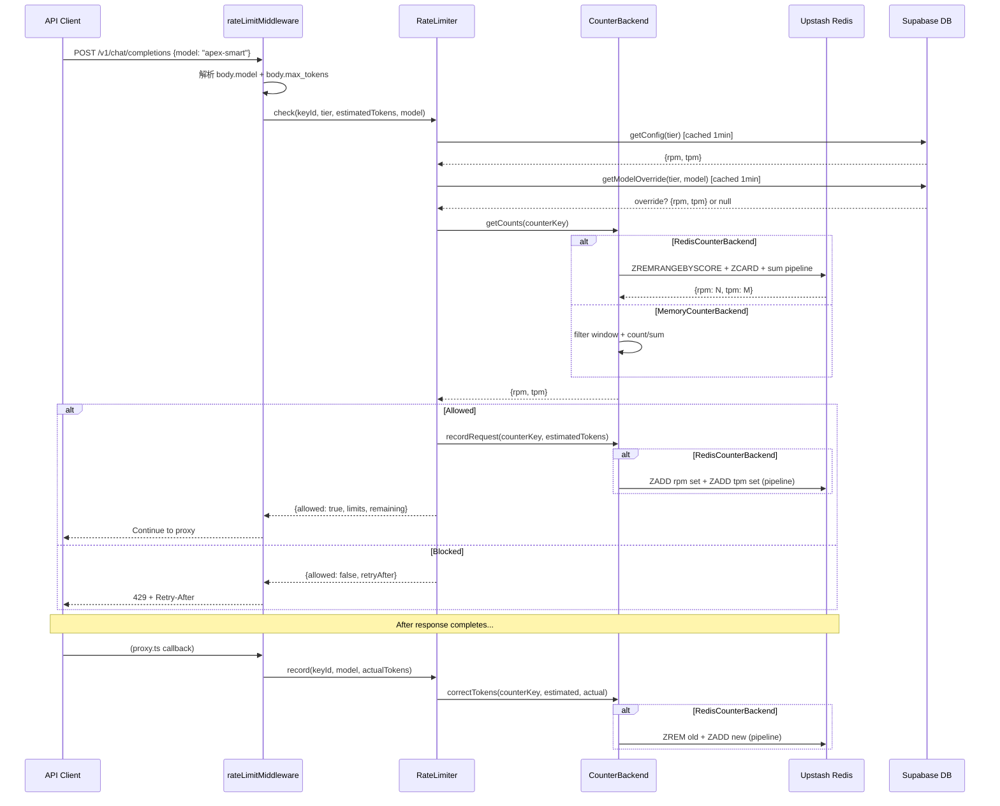

# S1 Dev Spec: Rate Limiting v2 (Redis + Model Override + Admin UI)

> **階段**: S1 技術分析
> **建立時間**: 2026-03-15 15:00
> **Agent**: codebase-explorer (Phase 1) + architect (Phase 2)
> **工作類型**: refactor
> **複雜度**: L

---

## [refactor 專用] 現狀分析

### Before（現狀）

| 面向 | 現況 |
|------|------|
| 計數器儲存 | 記憶體 `Map<string, KeyCounters>`，程序重啟歸零，多實例各自獨立 |
| 滑動窗口 | `TimestampedCount[]` 陣列，`Date.now()` 做 1 分鐘窗口 filter |
| 限流粒度 | 僅 tier 級別（free/pro/unlimited），所有模型共用 RPM/TPM |
| Tier 管理 | 只有 `PATCH /admin/users/:id/rate-limit` 指派，無 tier CRUD、無 UI |
| 配置快取 | 記憶體 `configCache` Map，1 分鐘 TTL |
| 介面耦合 | `RateLimiter` 直接操作 `Map`，無抽象層，測試需 mock 整個 class |

### After（目標）

| 面向 | 目標 |
|------|------|
| 計數器儲存 | Redis Sorted Set（Upstash REST），多實例共享計數；記憶體版保留為 fallback |
| 滑動窗口 | Redis ZADD + ZREMRANGEBYSCORE + ZCARD/sum，精確 sliding window |
| 限流粒度 | tier 級別 + 模型級別（`model_rate_overrides` 表覆寫特定模型的 RPM/TPM） |
| Tier 管理 | 完整 Tier CRUD + Model Override CRUD + Admin UI |
| 配置快取 | 維持記憶體 configCache，新增 model override cache |
| 介面耦合 | `CounterBackend` interface 抽象，constructor 注入，測試可注入 mock |

### 遷移路徑

1. 引入 `CounterBackend` interface，將現有記憶體邏輯封裝為 `MemoryCounterBackend`
2. 實作 `RedisCounterBackend`（`@upstash/redis`）
3. `RateLimiter` constructor 改為接收 `CounterBackend`，factory function 根據環境變數選擇
4. 擴展 `check()` 和 `record()` 簽名加入 `model` 參數
5. 新增 `getModelConfig()` 查詢 model override
6. `rateLimitMiddleware` 讀取 `body.model` 傳入
7. `proxy.ts` 的 2 處 `record()` 加入 `model` 參數

### 回歸風險矩陣

| 風險 | 影響範圍 | 嚴重度 | 驗證方式 |
|------|---------|--------|---------|
| `check()` 簽名變更 | `rateLimitMiddleware` | P0 | 編譯通過 + 現有 9 測試通過 |
| `record()` 簽名變更 | `proxy.ts` 2 處 | P0 | 編譯通過 + 手動測試 |
| Redis fallback 路徑未覆蓋 | 生產降級場景 | P0 | 專項單元測試 |
| `CounterBackend` 抽象洩漏 | 全限流邏輯 | P1 | interface 測試 |
| config cache 失效 | tier 更新即時性 | P2 | 手動測試（1 分鐘 TTL） |

### 外部行為不變驗證

- 429 回應格式不變（OpenAI-compatible error format）
- `X-RateLimit-*` headers 格式不變
- `Retry-After` header 計算邏輯不變
- unlimited tier（rpm=-1, tpm=-1）行為不變
- free tier fallback 行為不變（DB 錯誤時）

---

## 1. 概述

### 1.1 需求參照
> 完整需求見 `s0_brief_spec.md`，以下僅摘要。

將現有記憶體版 RateLimiter 遷移至 Redis（Upstash），新增按模型維度的細粒度限流，並提供 Admin UI 管理 tier 配置與 model override。

### 1.2 技術方案摘要

重構 `RateLimiter` 引入 `CounterBackend` interface，實作 `RedisCounterBackend`（`@upstash/redis` Sorted Set sliding window）和 `MemoryCounterBackend`（現有邏輯封裝）。環境變數 `UPSTASH_REDIS_REST_URL` 未設定或 Redis 連線失敗時自動降級記憶體版。新增 `model_rate_overrides` 表支援 per-model RPM/TPM 覆寫。新增 Admin API 8 個端點 + 前端管理頁面。

---

## 2. 影響範圍（Phase 1: codebase-explorer）

### 2.1 受影響檔案

#### Backend
| 檔案 | 變更類型 | 說明 |
|------|---------|------|
| `packages/api-server/src/lib/RateLimiter.ts` | 修改 | 核心重構：CounterBackend interface、Redis/Memory 實作、model override 查詢 |
| `packages/api-server/src/middleware/rateLimitMiddleware.ts` | 修改 | 讀取 `body.model` 傳入 `check()` |
| `packages/api-server/src/routes/proxy.ts` | 修改 | 2 處 `record()` 加入 model 參數 |
| `packages/api-server/src/routes/admin.ts` | 修改 | 新增 Tier CRUD + Model Override CRUD（8 個端點） |
| `packages/api-server/src/lib/__tests__/RateLimiter.test.ts` | 修改 | 適配新介面 + 新增 Redis/fallback/model 測試 |
| `packages/api-server/src/middleware/__tests__/rateLimitMiddleware.test.ts` | 修改 | model 參數測試 |
| `packages/api-server/package.json` | 修改 | 新增 `@upstash/redis` |

#### Frontend
| 檔案 | 變更類型 | 說明 |
|------|---------|------|
| `packages/web-admin/src/lib/api.ts` | 修改 | 新增 RateLimitTier / ModelOverride 型別 + API factory |
| `packages/web-admin/src/components/AppLayout.tsx` | 修改 | Sidebar 新增 Rate Limits 導航 |
| `packages/web-admin/src/app/admin/(protected)/settings/rate-limits/page.tsx` | 新增 | Tier CRUD + Model Override 管理頁 |
| `packages/web-admin/messages/zh-TW.json` | 修改 | 新增 rateLimits i18n key |
| `packages/web-admin/messages/en.json` | 修改 | 新增 rateLimits i18n key |

#### Database
| 資料表 / 檔案 | 變更類型 | 說明 |
|---------------|---------|------|
| `supabase/migrations/011_model_rate_overrides.sql` | 新增 | model_rate_overrides 表 + UNIQUE + FK CASCADE |

### 2.2 依賴關係
- **上游**: `supabase/migrations/006_rate_limit_tiers.sql`（rate_limit_tiers 表）、`apiKeyAuth.ts`（設定 `c.set('apiKeyTier')`）
- **下游**: `proxy.ts`（record() 簽名變更需同步）、`rateLimitMiddleware`（check() 簽名變更需同步）

---

## 3. User Flow

```mermaid
flowchart TD
    subgraph FA_A["FA-A: Redis 後端遷移"]
        A1[API 請求進入]:::fe --> A2[rateLimitMiddleware]:::be
        A2 --> A3{UPSTASH_REDIS_REST_URL 已設定?}
        A3 -->|Yes| A4[RedisCounterBackend.getCounts]:::tp
        A3 -->|No| A5[MemoryCounterBackend.getCounts]:::be
        A4 --> A6{Redis 連線正常?}
        A6 -->|Yes| A7[ZREMRANGEBYSCORE + ZCARD/sum]:::tp
        A6 -->|No| A8[console.warn + 降級]:::ex
        A8 --> A5
        A5 --> A9{允許?}
        A7 --> A9
        A9 -->|Yes| A10[recordRequest + 繼續路由]:::be
        A9 -->|No| A11[429 Too Many Requests]:::ex
    end

    subgraph FA_B["FA-B: 模型級限流"]
        B1[API 請求帶 model]:::fe --> B2[rateLimitMiddleware 讀取 body.model]:::be
        B2 --> B3[getModelConfig tier + model]:::be
        B3 --> B4{有 model override?}
        B4 -->|Yes| B5[使用 model-specific RPM/TPM]:::be
        B4 -->|No| B6[使用 tier 預設 RPM/TPM]:::be
        B5 --> B7[check keyId:model]:::be
        B6 --> B8[check keyId tier-level]:::be
    end

    subgraph FA_C["FA-C: Admin UI"]
        C1[Admin 進入 Rate Limits 頁]:::fe --> C2[GET /admin/rate-limits/tiers]:::be
        C2 --> C3[顯示 Tier 列表]:::fe
        C3 --> C4{操作}
        C4 -->|新增 Tier| C5[POST /admin/rate-limits/tiers]:::be
        C4 -->|編輯 Tier| C6[PATCH /admin/rate-limits/tiers/:tier]:::be
        C4 -->|刪除 Tier| C7{有用戶使用?}
        C7 -->|Yes| C8[409 Conflict 提示]:::ex
        C7 -->|No| C9[DELETE 成功]:::be
        C4 -->|管理 Override| C10[展開 Model Override CRUD]:::fe
    end

    classDef fe fill:#e3f2fd,color:#1565c0,stroke:#1565c0,stroke-width:2px
    classDef be fill:#e8f5e9,color:#2e7d32,stroke:#2e7d32,stroke-width:2px
    classDef tp fill:#fff3e0,color:#e65100,stroke:#e65100,stroke-width:2px
    classDef ex fill:#ffebee,color:#c62828,stroke:#c62828,stroke-width:2px
```



### 3.1 異常流程

| ID | FA | 情境 | 觸發條件 | 系統處理 |
|----|-----|------|---------|---------|
| E1 | FA-A | Redis 連線中斷 | Upstash 不可用 | 降級至 MemoryCounterBackend + `console.warn` |
| E2 | FA-A | Redis 延遲 > 100ms | 網路抖動 | Upstash REST timeout 後降級 |
| E3 | FA-B | model 參數缺失 | 舊版 client 未傳 model | 使用 tier 預設值（不做 model-level check） |
| E4 | FA-C | 刪除使用中 Tier | api_keys 仍引用 | 409 Conflict + 提示使用中數量 |
| E5 | FA-C | Override 重複 | (tier, model_tag) 已存在 | 409 Conflict |

---

## 4. Data Flow



### 4.1 API 契約

> 完整 API 規格見 [`s1_api_spec.md`](./s1_api_spec.md)。

**Endpoint 摘要**

| Method | Path | 說明 | 狀態 |
|--------|------|------|------|
| `GET` | `/admin/rate-limits/tiers` | 列出所有 tier | 新增 |
| `POST` | `/admin/rate-limits/tiers` | 新增 tier | 新增 |
| `PATCH` | `/admin/rate-limits/tiers/:tier` | 更新 tier | 新增 |
| `DELETE` | `/admin/rate-limits/tiers/:tier` | 刪除 tier | 新增 |
| `GET` | `/admin/rate-limits/overrides` | 列出 model override | 新增 |
| `POST` | `/admin/rate-limits/overrides` | 新增 model override | 新增 |
| `PATCH` | `/admin/rate-limits/overrides/:id` | 更新 model override | 新增 |
| `DELETE` | `/admin/rate-limits/overrides/:id` | 刪除 model override | 新增 |
| `PATCH` | `/admin/users/:id/rate-limit` | 指派用戶 tier | 既有（文件化） |

### 4.2 資料模型

#### model_rate_overrides（新增）

```sql
CREATE TABLE model_rate_overrides (
  id UUID PRIMARY KEY DEFAULT gen_random_uuid(),
  tier TEXT NOT NULL REFERENCES rate_limit_tiers(tier) ON DELETE CASCADE,
  model_tag TEXT NOT NULL,
  rpm INTEGER NOT NULL,
  tpm INTEGER NOT NULL,
  created_at TIMESTAMPTZ NOT NULL DEFAULT now(),
  UNIQUE(tier, model_tag)
);

CREATE INDEX idx_model_rate_overrides_tier ON model_rate_overrides(tier);
```

#### rate_limit_tiers（既有，不變）

```
tier: TEXT PK
rpm: INTEGER NOT NULL
tpm: INTEGER NOT NULL
created_at: TIMESTAMPTZ NOT NULL DEFAULT now()
```

#### Redis Key 結構

| Key Pattern | Type | TTL | 說明 |
|-------------|------|-----|------|
| `rl:{keyId}:rpm` | Sorted Set | 120s | Tier 級別 RPM 計數 |
| `rl:{keyId}:tpm` | Sorted Set | 120s | Tier 級別 TPM 計數 |
| `rl:{keyId}:{model}:rpm` | Sorted Set | 120s | 模型級別 RPM 計數 |
| `rl:{keyId}:{model}:tpm` | Sorted Set | 120s | 模型級別 TPM 計數 |

- Score = Unix timestamp (ms)
- Member = `{timestamp}:{randomSuffix}` (RPM) 或 `{timestamp}:{randomSuffix}:{tokenCount}` (TPM)
- TTL 設為 120s (2x window) 確保過期資料清理，但實際窗口判定靠 ZREMRANGEBYSCORE

---

## 5. 任務清單

### 5.1 任務總覽

| # | 任務 | FA | 類型 | 複雜度 | Agent | 依賴 |
|---|------|----|------|--------|-------|------|
| T1 | model_rate_overrides DB Migration | FA-B | 資料層 | S | backend-developer | - |
| T2 | RateLimiter 核心重構 (CounterBackend + Redis + Memory + fallback) | FA-A | 後端 | L | backend-developer | - |
| T3 | 模型級限流整合 (middleware + proxy + model override 查詢) | FA-B | 後端 | M | backend-developer | T1, T2 |
| T4 | Admin API (Tier CRUD + Model Override CRUD) | FA-C | 後端 | M | backend-developer | T1 |
| T5 | 前端 (API client + Admin UI + Sidebar + i18n) | FA-C | 前端 | M | frontend-developer | T4 |
| T6 | 測試擴展 (RateLimiter + middleware) | FA-A/B | 後端 | M | backend-developer | T2, T3 |

### 5.2 任務詳情

#### Task T1: model_rate_overrides DB Migration
- **FA**: FA-B
- **類型**: 資料層
- **複雜度**: S
- **Agent**: backend-developer
- **描述**: 新增 `supabase/migrations/011_model_rate_overrides.sql`。建立 `model_rate_overrides` 表，含 `id` (UUID PK)、`tier` (FK → rate_limit_tiers ON DELETE CASCADE)、`model_tag`、`rpm`、`tpm`、`created_at`。UNIQUE 約束 `(tier, model_tag)`。建立 `idx_model_rate_overrides_tier` 索引。RLS policy: service_role 可讀寫。
- **DoD**:
  - [ ] `011_model_rate_overrides.sql` 建立 model_rate_overrides 表
  - [ ] UNIQUE(tier, model_tag) 約束
  - [ ] FK tier → rate_limit_tiers(tier) ON DELETE CASCADE
  - [ ] RLS policy for service_role
  - [ ] Migration 可成功執行
- **驗收方式**: `supabase db push` 或手動執行 SQL 成功

#### Task T2: RateLimiter 核心重構 (CounterBackend + Redis + Memory + fallback)
- **FA**: FA-A
- **類型**: 後端
- **複雜度**: L
- **Agent**: backend-developer
- **描述**:
  1. 定義 `CounterBackend` interface:
     ```typescript
     interface CounterBackend {
       getCounts(key: string): Promise<{ rpm: number; tpm: number }>
       recordRequest(key: string, tokens: number): Promise<void>
       correctTokens(key: string, estimatedTokens: number, actualTokens: number): Promise<void>
     }
     ```
  2. 將現有記憶體邏輯封裝為 `MemoryCounterBackend`（實作 `CounterBackend`）
  3. 實作 `RedisCounterBackend`（`@upstash/redis`，Sorted Set sliding window）:
     - `getCounts`: ZREMRANGEBYSCORE 清理過期 + ZCARD (rpm) + ZRANGEBYSCORE parse sum (tpm)，使用 pipeline 批次
     - `recordRequest`: ZADD rpm set + ZADD tpm set (pipeline)，設 EXPIRE 120s
     - `correctTokens`: ZREM 舊 tpm entry + ZADD 新 tpm entry (pipeline)
  4. `RateLimiter` constructor 改為 `constructor(backend: CounterBackend, db?)`
  5. 新增 factory function `createRateLimiter()`:
     - `UPSTASH_REDIS_REST_URL` + `UPSTASH_REDIS_REST_TOKEN` 已設定 → `RedisCounterBackend`
     - 否則 → `MemoryCounterBackend`
  6. Redis 連線失敗時 → catch → `console.warn` → 降級至 `MemoryCounterBackend` 實例
  7. 維持 singleton export: `export const rateLimiter = createRateLimiter()`
  8. 安裝 `@upstash/redis`: `pnpm add @upstash/redis --filter @apiex/api-server`
- **DoD**:
  - [ ] `CounterBackend` interface 定義
  - [ ] `MemoryCounterBackend` 封裝現有記憶體邏輯
  - [ ] `RedisCounterBackend` 實作 Sorted Set sliding window
  - [ ] Redis pipeline 批次操作（減少 RTT）
  - [ ] `createRateLimiter()` factory function
  - [ ] `UPSTASH_REDIS_REST_URL` 未設定 → 自動使用 MemoryCounterBackend
  - [ ] Redis 連線失敗 → console.warn + 降級至 MemoryCounterBackend
  - [ ] `@upstash/redis` 安裝完成
  - [ ] 現有 9 個 RateLimiter 測試全部通過（SC-4）
  - [ ] `RateLimitConfig`, `RateLimitResult` interface 不變
- **驗收方式**: 單元測試通過 + 手動驗證 Redis/Memory 切換

#### Task T3: 模型級限流整合 (middleware + proxy + model override 查詢)
- **FA**: FA-B
- **類型**: 後端
- **複雜度**: M
- **Agent**: backend-developer
- **依賴**: T1, T2
- **描述**:
  1. `RateLimiter` 新增 `getModelConfig(tier, model)` 方法：查詢 `model_rate_overrides` 表，命中 → 返回 override 的 rpm/tpm，未命中 → 返回 `null`。加入記憶體快取（1 分鐘 TTL，key = `{tier}:{model}`）
  2. 擴展 `check()` 簽名為 `check(keyId, tier, estimatedTokens, model?: string)`:
     - 若 `model` 傳入且有 override → counter key 使用 `{keyId}:{model}`，限制值使用 override
     - 否則 → 使用現有 `{keyId}` key 和 tier 預設值
  3. 擴展 `record()` 簽名為 `record(keyId, actualTokens, model?: string)`:
     - counter key 對應 `check()` 使用的 key
  4. `rateLimitMiddleware` 修改：讀取 `body.model` → 傳入 `check(keyId, tier, estimatedTokens, model)`
  5. `proxy.ts` 2 處 `record()` 修改：加入 `route.tag`（即 model）
     - 非串流：`rateLimiter.record(apiKeyId, usage.total_tokens, route.tag)`
     - 串流 finally：`rateLimiter.record(apiKeyId, usage.total_tokens, route.tag)`
- **DoD**:
  - [ ] `getModelConfig()` 方法實作 + 快取
  - [ ] `check()` 支援 `model` 可選參數
  - [ ] `record()` 支援 `model` 可選參數
  - [ ] `rateLimitMiddleware` 讀取 `body.model`
  - [ ] `proxy.ts` 2 處 `record()` 傳入 model
  - [ ] 無 model 時行為不變（向後相容）
- **驗收方式**: 單元測試 + 手動測試

#### Task T4: Admin API (Tier CRUD + Model Override CRUD)
- **FA**: FA-C
- **類型**: 後端
- **複雜度**: M
- **Agent**: backend-developer
- **依賴**: T1
- **描述**: 在 `admin.ts` 新增 8 個端點（見 `s1_api_spec.md`）:
  1. `GET /admin/rate-limits/tiers` — 列出所有 tier
  2. `POST /admin/rate-limits/tiers` — 新增 tier（驗證 tier 非空、rpm/tpm >= -1）
  3. `PATCH /admin/rate-limits/tiers/:tier` — 更新 tier（至少一欄位）
  4. `DELETE /admin/rate-limits/tiers/:tier` — 刪除 tier（檢查 api_keys 引用 → 409）
  5. `GET /admin/rate-limits/overrides` — 列出所有 override（可選 `?tier=` 篩選）
  6. `POST /admin/rate-limits/overrides` — 新增 override（驗證 tier 存在、model_tag 非空）
  7. `PATCH /admin/rate-limits/overrides/:id` — 更新 override
  8. `DELETE /admin/rate-limits/overrides/:id` — 刪除 override
- **DoD**:
  - [ ] 8 個端點全部實作
  - [ ] 所有端點受 adminAuth middleware 保護
  - [ ] DELETE tier 檢查 api_keys 引用 → 409 含使用數量
  - [ ] POST override 驗證 tier 存在 → 404
  - [ ] POST override 的 (tier, model_tag) 重複 → 409
  - [ ] 遵循現有 admin.ts 錯誤回傳格式（`Errors.*`）
- **驗收方式**: curl 測試所有端點

#### Task T5: 前端 (API client + Admin UI + Sidebar + i18n)
- **FA**: FA-C
- **類型**: 前端
- **複雜度**: M
- **Agent**: frontend-developer
- **依賴**: T4
- **描述**:
  1. `api.ts` 新增型別：
     ```typescript
     interface RateLimitTier { tier: string; rpm: number; tpm: number; created_at: string }
     interface ModelRateOverride { id: string; tier: string; model_tag: string; rpm: number; tpm: number; created_at: string }
     ```
  2. `api.ts` 新增 API factory `makeRateLimitsApi(token)`：CRUD tier + CRUD override
  3. 新增 `settings/rate-limits/page.tsx`:
     - 上半部：Tier 列表表格 + 新增/編輯 dialog + 刪除確認
     - 下半部：Model Override 列表（按 tier 分組或可篩選）+ CRUD
     - 刪除 tier 時 409 → 顯示 Alert A2（「此 tier 仍有 N 個用戶使用中」）
  4. `AppLayout.tsx` navItems 新增 `{ href: '/admin/settings/rate-limits', label: t('settingsRateLimits') }`
  5. `zh-TW.json` / `en.json` 新增 `rateLimits` 相關 i18n keys
- **DoD**:
  - [ ] RateLimitTier / ModelRateOverride interface 定義
  - [ ] makeRateLimitsApi factory 完整
  - [ ] Tier 列表 + 新增 + 編輯 + 刪除 功能
  - [ ] Model Override 列表 + 新增 + 編輯 + 刪除 功能
  - [ ] 刪除 tier 409 → 顯示衝突提示
  - [ ] Sidebar 新增 Rate Limits 導航
  - [ ] i18n keys 新增（zh-TW + en）
  - [ ] loading / error 狀態處理
- **驗收方式**: 手動測試所有 CRUD 操作

#### Task T6: 測試擴展
- **FA**: FA-A / FA-B
- **類型**: 後端
- **複雜度**: M
- **Agent**: backend-developer
- **依賴**: T2, T3
- **描述**: 擴展 `RateLimiter.test.ts` 和 `rateLimitMiddleware.test.ts`:
  1. 現有 9 個測試適配新 constructor（注入 `MemoryCounterBackend`）
  2. 新增 `RedisCounterBackend` 測試（mock `@upstash/redis`）:
     - Redis getCounts 正確計算 RPM/TPM
     - Redis recordRequest 使用 ZADD pipeline
     - Redis correctTokens 使用 ZREM + ZADD
  3. 新增 fallback 測試:
     - `UPSTASH_REDIS_REST_URL` 未設定 → MemoryCounterBackend
     - Redis 操作拋錯 → 降級至 Memory + console.warn
  4. 新增 model override 測試:
     - 有 override → 使用 model-specific limits
     - 無 override → fallback 到 tier 預設值
     - model 參數缺失 → 使用 tier 預設值
  5. `rateLimitMiddleware.test.ts` 新增:
     - body.model 有值時傳入 check()
     - body.model 缺失時使用預設行為
- **DoD**:
  - [ ] 現有 9 個測試全部通過（SC-4）
  - [ ] RedisCounterBackend mock 測試 >= 3 個
  - [ ] Fallback 降級測試 >= 2 個
  - [ ] Model override 測試 >= 3 個
  - [ ] Middleware model 參數測試 >= 2 個
  - [ ] 總測試新增 >= 10 個
- **驗收方式**: `pnpm --filter @apiex/api-server test` 全部通過

---

## 6. 技術決策

### 6.1 架構決策

| 決策點 | 選項 | 選擇 | 理由 |
|--------|------|------|------|
| Redis client | A: ioredis / B: @upstash/redis | B | Upstash REST API 不需長連線，Serverless 友好，S0 已確認 |
| 計數器結構 | A: INCR+EXPIRE / B: Sorted Set | B | Sorted Set 支援精確 sliding window，INCR 只能做 fixed window |
| 抽象層 | A: 策略模式 if/else / B: CounterBackend interface | B | 依賴反轉原則，測試可注入 mock，不汙染核心邏輯 |
| Fallback 策略 | A: 啟動時決定 / B: 每次操作 try/catch | A+B 混合 | 啟動時根據環境變數選擇 backend；Redis 操作失敗時 per-call 降級 |
| Model override 儲存 | A: JSON 欄位在 tier 表 / B: 獨立表 | B | 獨立表 CRUD 清晰、UNIQUE 約束、FK CASCADE 自動清理 |
| Override 的 model_tag | A: 支援 wildcard / B: 精確匹配 | B | 精確匹配簡單可靠，wildcard 增加複雜度（未來可擴展） |
| Redis pipeline | A: 逐一呼叫 / B: pipeline 批次 | B | Upstash REST 每次呼叫 1 RTT，pipeline 壓到 1 RTT |
| Tier 刪除保護 | A: 軟刪除 / B: 引用檢查 409 | B | S0 明確要求 409，保持資料一致性 |

### 6.2 設計模式

- **Strategy Pattern**: `CounterBackend` interface + `MemoryCounterBackend` / `RedisCounterBackend`
- **Factory**: `createRateLimiter()` 根據環境變數選擇 backend
- **Graceful Degradation**: Redis 失敗 → Memory fallback + warn log

### 6.3 相容性考量

- `check()` 新增 `model?: string` 可選參數 — **向後相容**，不傳時行為不變
- `record()` 新增 `model?: string` 可選參數 — **向後相容**
- `RateLimitResult` interface 不變
- 429 回應格式不變
- `X-RateLimit-*` headers 不變

---

## 7. 驗收標準

### 7.1 功能驗收

| # | SC | 場景 | Given | When | Then | 優先級 |
|---|-----|------|-------|------|------|--------|
| AC-1 | SC-1 | Redis 計數器 | `UPSTASH_REDIS_REST_URL` 已設定 | RateLimiter.check() 被呼叫 | 計數器讀寫走 Redis Sorted Set | P0 |
| AC-2 | SC-2 | 自動降級 Memory | `UPSTASH_REDIS_REST_URL` 未設定 | createRateLimiter() 初始化 | 使用 MemoryCounterBackend | P0 |
| AC-3 | SC-3 | Redis 斷線降級 | Redis 連線正常後中斷 | getCounts() 拋錯 | console.warn + 降級至 MemoryCounterBackend，請求不中斷 | P0 |
| AC-4 | SC-4 | 現有測試通過 | 重構後的 RateLimiter | 執行 `pnpm test` | 現有 9 個測試全部通過 | P0 |
| AC-5 | SC-5 | Model override 生效 | pro tier 有 apex-smart override (rpm=10) | 以 pro tier 請求 apex-smart | 使用 rpm=10 而非 tier 預設 60 | P0 |
| AC-6 | SC-6 | Model override fallback | pro tier 無 apex-cheap override | 以 pro tier 請求 apex-cheap | 使用 tier 預設 rpm=60 | P0 |
| AC-7 | SC-7 | Override CRUD | Admin 透過 API | POST/GET/PATCH/DELETE model_rate_overrides | CRUD 正常運作 | P0 |
| AC-8 | SC-8 | Admin UI CRUD Tier | Admin 在 Rate Limits 頁 | 新增/編輯/刪除 tier | 操作成功，列表即時更新 | P1 |
| AC-9 | SC-9 | Admin UI Override 管理 | Admin 在 Rate Limits 頁 | 管理 model override | CRUD 正常運作 | P1 |
| AC-10 | SC-10 | Admin 指派 tier | Admin 在 UI 或 API | PATCH /admin/users/:id/rate-limit | 用戶所有 active key 的 tier 更新 | P1 |
| AC-11 | SC-11 | 延遲要求 | Redis 在同地區 | 單次 check() | 增加延遲 < 5ms（pipeline 壓縮 RTT） | P1 |

### 7.2 非功能驗收

| 項目 | 標準 |
|------|------|
| 效能 | Redis pipeline 壓到 1 RTT，getCounts + recordRequest 合計 < 5ms |
| 可用性 | Redis 不可用時自動降級，API 不中斷 |
| 安全 | 所有 Admin 端點需 adminAuth middleware |
| 測試 | 新增 >= 10 個測試案例 |

### 7.3 測試計畫

- **單元測試**: MemoryCounterBackend、RedisCounterBackend（mock）、RateLimiter、model override 邏輯、fallback 降級
- **手動測試**: Admin UI CRUD、Redis/Memory 切換、proxy 完整流程
- **不做**: E2E 整合測試（Redis 需要實際服務）

---

## 8. 風險與緩解

| 風險 | 影響 | 機率 | 緩解措施 |
|------|------|------|---------|
| Upstash REST API 延遲超標（SC-11） | 中 | 中 | 使用 pipeline 批次操作壓到 1 RTT；部署在與 Upstash 同地區 |
| Redis mock 實作錯誤導致假通過 | 高 | 低 | mock 精確到 ZADD/ZREMRANGEBYSCORE 語義，review 時重點檢查 |
| check() / record() 簽名變更遺漏呼叫點 | 高 | 低 | TypeScript 編譯會報錯；只有 middleware + proxy.ts 2 處 |
| rate_limit_tiers 快取 1 分鐘，Admin 修改不立即生效 | 低 | 高 | 已知限制，1 分鐘延遲可接受；未來可加 cache invalidation |
| Redis Sorted Set member 解析 token count 邏輯出錯 | 中 | 中 | member 格式 `{ts}:{rand}:{count}` 有明確分隔，加防禦 parseInt |

### 回歸風險
- `rateLimitMiddleware` 呼叫 `check()` 的簽名需同步更新
- `proxy.ts` 2 處 `record()` 呼叫需同步更新
- 現有 9 個 `RateLimiter.test.ts` 測試需適配新 constructor
- Redis fallback 路徑若漏測，生產 Redis 斷線時行為不可預期
