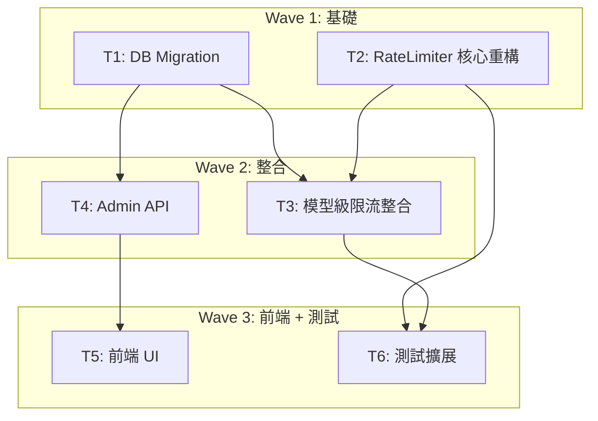

# S3 Implementation Plan: Rate Limiting v2

> **階段**: S3 執行計畫
> **建立時間**: 2026-03-15 15:30
> **Agents**: backend-developer, frontend-developer

---

## 1. 概述

### 1.1 功能目標
將 RateLimiter 從記憶體遷移至 Redis（Upstash），新增模型級限流（model_rate_overrides），提供 Admin UI 管理 tier 和 override 配置。

### 1.2 實作範圍
- **範圍內**: CounterBackend 抽象 + Redis/Memory 實作 + fallback 降級 + model override + Admin API 8 端點 + Admin UI + 測試
- **範圍外**: IP 限流、端點限流、監控面板、Redis Cluster

### 1.3 關聯文件

| 文件 | 路徑 | 狀態 |
|------|------|------|
| Brief Spec | `./s0_brief_spec.md` | completed |
| Dev Spec | `./s1_dev_spec.md` | completed |
| API Spec | `./s1_api_spec.md` | completed |
| Implementation Plan | `./s3_implementation_plan.md` | current |

---

## 2. 實作任務清單

### 2.1 任務總覽

| # | 任務 | FA | 類型 | Agent | 依賴 | 複雜度 | TDD | 狀態 |
|---|------|----|------|-------|------|--------|-----|------|
| T1 | model_rate_overrides DB Migration | FA-B | 資料層 | `backend-developer` | - | S | N/A | pending |
| T2 | RateLimiter 核心重構 (CounterBackend + Redis + Memory + fallback) | FA-A | 後端 | `backend-developer` | - | L | planned | pending |
| T3 | 模型級限流整合 (middleware + proxy + model override) | FA-B | 後端 | `backend-developer` | T1, T2 | M | planned | pending |
| T4 | Admin API (Tier CRUD + Model Override CRUD) | FA-C | 後端 | `backend-developer` | T1 | M | planned | pending |
| T5 | 前端 (API client + Admin UI + Sidebar + i18n) | FA-C | 前端 | `frontend-developer` | T4 | M | N/A | pending |
| T6 | 測試擴展 (Redis/fallback/model override) | FA-A/B | 後端 | `backend-developer` | T2, T3 | M | core | pending |

---

## 3. 任務詳情

### Task T1: model_rate_overrides DB Migration

**基本資訊**

| 項目 | 內容 |
|------|------|
| FA | FA-B |
| 類型 | 資料層 |
| Agent | `backend-developer` |
| 複雜度 | S |
| 依賴 | - |

**描述**

新增 `supabase/migrations/011_model_rate_overrides.sql`。建立 `model_rate_overrides` 表，含 id UUID PK、tier FK → rate_limit_tiers ON DELETE CASCADE、model_tag TEXT、rpm INTEGER、tpm INTEGER、created_at。UNIQUE(tier, model_tag) 約束 + 索引 + RLS。

**受影響檔案**

| 檔案 | 變更類型 | 說明 |
|------|---------|------|
| `supabase/migrations/011_model_rate_overrides.sql` | 新增 | 建表 + 索引 + RLS |

**DoD**

- [ ] model_rate_overrides 表建立（id UUID PK, tier, model_tag, rpm, tpm, created_at）
- [ ] UNIQUE(tier, model_tag) 約束
- [ ] FK tier → rate_limit_tiers(tier) ON DELETE CASCADE
- [ ] idx_model_rate_overrides_tier 索引
- [ ] RLS policy: service_role 可讀寫

**TDD Plan**: N/A — 純 DDL，無可測邏輯

---

### Task T2: RateLimiter 核心重構

**基本資訊**

| 項目 | 內容 |
|------|------|
| FA | FA-A |
| 類型 | 後端 |
| Agent | `backend-developer` |
| 複雜度 | L |
| 依賴 | - |

**描述**

1. 定義 `CounterBackend` interface（getCounts, recordRequest, correctTokens）
2. 將現有記憶體邏輯封裝為 `MemoryCounterBackend`
3. 實作 `RedisCounterBackend`（@upstash/redis Sorted Set pipeline）
4. RateLimiter constructor 改為接收 CounterBackend
5. 新增 `createRateLimiter()` factory（環境變數判斷）
6. Redis 失敗 → console.warn + 降級 Memory
7. 安裝 `@upstash/redis`

**受影響檔案**

| 檔案 | 變更類型 | 說明 |
|------|---------|------|
| `packages/api-server/src/lib/RateLimiter.ts` | 修改 | CounterBackend + Redis + Memory + factory |
| `packages/api-server/package.json` | 修改 | @upstash/redis 依賴 |
| `pnpm-lock.yaml` | 修改 | lockfile |

**DoD**

- [ ] CounterBackend interface 定義
- [ ] MemoryCounterBackend 封裝現有記憶體邏輯
- [ ] RedisCounterBackend 實作 Sorted Set sliding window + pipeline
- [ ] createRateLimiter() factory function
- [ ] UPSTASH_REDIS_REST_URL 未設定 → MemoryCounterBackend
- [ ] Redis 操作失敗 → console.warn + 降級
- [ ] @upstash/redis 安裝完成
- [ ] 現有 9 個測試全部通過（SC-4）

**TDD Plan**

| 項目 | 內容 |
|------|------|
| 測試檔案 | `packages/api-server/src/lib/__tests__/RateLimiter.test.ts` |
| 測試指令 | `pnpm --filter @apiex/api-server test` |
| 預期失敗測試 | CounterBackend 注入、MemoryCounterBackend 基礎操作、Redis fallback |

---

### Task T3: 模型級限流整合

**基本資訊**

| 項目 | 內容 |
|------|------|
| FA | FA-B |
| 類型 | 後端 |
| Agent | `backend-developer` |
| 複雜度 | M |
| 依賴 | T1, T2 |

**描述**

1. RateLimiter 新增 `getModelConfig(tier, model)` — 查 model_rate_overrides + 1min cache
2. 擴展 `check()` 為 `check(keyId, tier, estimatedTokens, model?: string)`
3. 擴展 `record()` 為 `record(keyId, actualTokens, model?: string)`
4. rateLimitMiddleware 讀取 body.model 傳入
5. proxy.ts 2 處 record() 加入 model

**受影響檔案**

| 檔案 | 變更類型 | 說明 |
|------|---------|------|
| `packages/api-server/src/lib/RateLimiter.ts` | 修改 | getModelConfig + check/record model 參數 |
| `packages/api-server/src/middleware/rateLimitMiddleware.ts` | 修改 | 讀取 body.model |
| `packages/api-server/src/routes/proxy.ts` | 修改 | 2 處 record() 加 model |

**DoD**

- [ ] getModelConfig() + 記憶體快取
- [ ] check() 支援 model 可選參數
- [ ] record() 支援 model 可選參數
- [ ] rateLimitMiddleware 讀取 body.model
- [ ] proxy.ts 2 處 record() 傳入 model
- [ ] 無 model 時行為不變（向後相容）

**TDD Plan**

| 項目 | 內容 |
|------|------|
| 測試檔案 | `packages/api-server/src/lib/__tests__/RateLimiter.test.ts` |
| 測試指令 | `pnpm --filter @apiex/api-server test` |
| 預期失敗測試 | model override 查詢、check 帶 model、record 帶 model |

---

### Task T4: Admin API

**基本資訊**

| 項目 | 內容 |
|------|------|
| FA | FA-C |
| 類型 | 後端 |
| Agent | `backend-developer` |
| 複雜度 | M |
| 依賴 | T1 |

**描述**

在 admin.ts 新增 8 個端點（見 s1_api_spec.md）：Tier GET/POST/PATCH/DELETE + Override GET/POST/PATCH/DELETE。DELETE tier 檢查 api_keys 引用 → 409。

**受影響檔案**

| 檔案 | 變更類型 | 說明 |
|------|---------|------|
| `packages/api-server/src/routes/admin.ts` | 修改 | 8 個新端點 |

**DoD**

- [ ] 8 個端點全部實作
- [ ] adminAuth middleware 保護
- [ ] DELETE tier 檢查 api_keys → 409
- [ ] POST override 驗證 tier 存在 → 404
- [ ] POST override (tier, model_tag) 重複 → 409
- [ ] 遵循 Errors.* 回傳格式

**TDD Plan**

| 項目 | 內容 |
|------|------|
| 測試檔案 | `packages/api-server/src/routes/__tests__/admin.test.ts` |
| 測試指令 | `pnpm --filter @apiex/api-server test` |
| 預期失敗測試 | tier CRUD 系列、override CRUD 系列、刪除保護 |

---

### Task T5: 前端

**基本資訊**

| 項目 | 內容 |
|------|------|
| FA | FA-C |
| 類型 | 前端 |
| Agent | `frontend-developer` |
| 複雜度 | M |
| 依賴 | T4 |

**描述**

1. api.ts 新增 RateLimitTier / ModelRateOverride 型別 + makeRateLimitsApi factory
2. 新增 settings/rate-limits/page.tsx（Tier CRUD + Model Override CRUD）
3. AppLayout.tsx Sidebar 新增導航
4. i18n keys 新增

**受影響檔案**

| 檔案 | 變更類型 | 說明 |
|------|---------|------|
| `packages/web-admin/src/lib/api.ts` | 修改 | 型別 + factory |
| `packages/web-admin/src/app/admin/(protected)/settings/rate-limits/page.tsx` | 新增 | 管理頁 |
| `packages/web-admin/src/components/AppLayout.tsx` | 修改 | Sidebar 導航 |
| `packages/web-admin/messages/zh-TW.json` | 修改 | i18n |
| `packages/web-admin/messages/en.json` | 修改 | i18n |

**DoD**

- [ ] RateLimitTier / ModelRateOverride interface
- [ ] makeRateLimitsApi factory
- [ ] Tier 列表 + 新增 + 編輯 + 刪除
- [ ] Model Override 列表 + 新增 + 編輯 + 刪除
- [ ] 刪除 tier 409 → 衝突提示
- [ ] Sidebar 新增 Rate Limits
- [ ] i18n keys（zh-TW + en）
- [ ] loading / error 狀態

**TDD Plan**: N/A — UI 頁面，手動驗證

---

### Task T6: 測試擴展

**基本資訊**

| 項目 | 內容 |
|------|------|
| FA | FA-A / FA-B |
| 類型 | 後端 |
| Agent | `backend-developer` |
| 複雜度 | M |
| 依賴 | T2, T3 |

**描述**

擴展 RateLimiter.test.ts + rateLimitMiddleware.test.ts，覆蓋 Redis backend、fallback 降級、model override。新增 >= 10 個測試。

**受影響檔案**

| 檔案 | 變更類型 | 說明 |
|------|---------|------|
| `packages/api-server/src/lib/__tests__/RateLimiter.test.ts` | 修改 | Redis/fallback/model 測試 |
| `packages/api-server/src/middleware/__tests__/rateLimitMiddleware.test.ts` | 修改 | model 參數測試 |

**DoD**

- [ ] 現有 9 個測試全部通過
- [ ] RedisCounterBackend mock 測試 >= 3
- [ ] Fallback 降級測試 >= 2
- [ ] Model override 測試 >= 3
- [ ] Middleware model 參數測試 >= 2
- [ ] 總新增 >= 10

**TDD Plan**

| 項目 | 內容 |
|------|------|
| 測試檔案 | `packages/api-server/src/lib/__tests__/RateLimiter.test.ts`, `packages/api-server/src/middleware/__tests__/rateLimitMiddleware.test.ts` |
| 測試指令 | `pnpm --filter @apiex/api-server test` |

---

## 4. 依賴關係圖



---

## 5. 執行順序與 Agent 分配

### 5.1 執行波次

| 波次 | 任務 | Agent | 可並行 | 備註 |
|------|------|-------|--------|------|
| Wave 1 | T1, T2 | `backend-developer` | 是（T1 // T2） | T1 是 DB，T2 是核心重構，互不依賴 |
| Wave 2 | T3, T4 | `backend-developer` | 部分（T4 只需 T1，T3 需 T1+T2） | T4 可在 T1 完成後先啟動 |
| Wave 3 | T5, T6 | `frontend-developer` / `backend-developer` | 是（T5 // T6） | T5 依賴 T4，T6 依賴 T2+T3 |

---

## 6. 驗證計畫

### 6.1 逐任務驗證

| 任務 | 驗證指令 | 預期結果 |
|------|---------|---------|
| T1 | `cat supabase/migrations/011_model_rate_overrides.sql` | 表定義正確 |
| T2 | `pnpm --filter @apiex/api-server test -- --grep RateLimiter` | 9 個現有測試通過 |
| T3 | Code review: middleware + proxy.ts | model 參數傳入 |
| T4 | `pnpm --filter @apiex/api-server test -- --grep admin` | Admin 測試通過 |
| T5 | `cd packages/web-admin && npx tsc --noEmit` | 編譯通過 |
| T6 | `pnpm --filter @apiex/api-server test` | 全部通過 |

### 6.2 整體驗證

```bash
pnpm --filter @apiex/api-server test
cd packages/web-admin && npx tsc --noEmit
cd packages/web-admin && pnpm build
```

---

## 7. 風險與問題追蹤

| # | 風險 | 影響 | 緩解措施 | 狀態 |
|---|------|------|---------|------|
| 1 | Upstash REST 延遲超標 | 中 | pipeline 批次 + 同地區部署 | 監控中 |
| 2 | Redis mock 假通過 | 高 | mock 精確到 ZADD/ZRANGEBYSCORE 語義 | 監控中 |
| 3 | check()/record() 簽名變更遺漏 | 高 | TypeScript 編譯捕捉 | 已接受 |
| 4 | config cache 1min 延遲 | 低 | 已知限制，可接受 | 已接受 |
