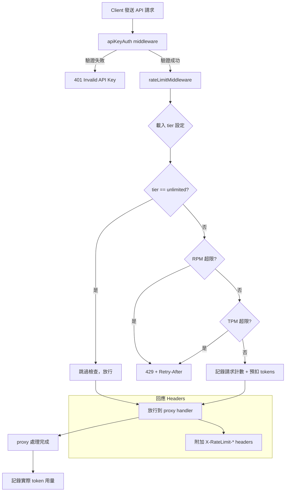
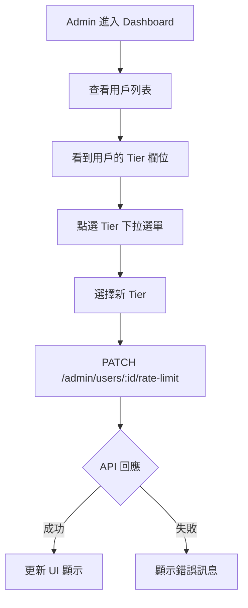
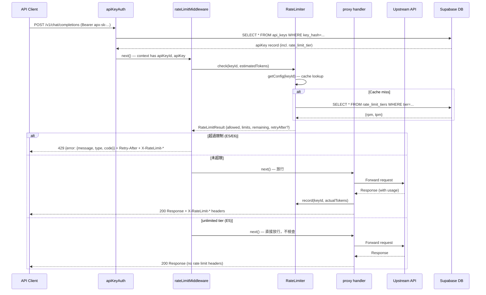

# S1 Dev Spec: API Rate Limiting

> **階段**: S1 技術分析
> **建立時間**: 2026-03-15 05:00
> **Agent**: architect (S1 Phase 1+2 合併)
> **工作類型**: new_feature
> **複雜度**: M

---

## 1. 概述

### 1.1 需求參照
> 完整需求見 `s0_brief_spec.md`，以下僅摘要。

為 Apiex API Proxy 加入 per-key rate limiting（RPM/TPM），超過限制回傳 429 Too Many Requests（OpenAI 相容格式），Admin 可設定 per-user rate limit tier。

### 1.2 技術方案摘要

在 `apiKeyAuth` middleware 之後插入 `rateLimitMiddleware`，使用 in-memory sliding window counter（`RateLimiter` class）追蹤每個 API Key 過去 60 秒的請求數與 token 數。Tier 定義存 DB（`rate_limit_tiers` 表），API Key 透過 `rate_limit_tier` 欄位關聯。每個回應附帶 `X-RateLimit-*` headers，超限回傳 429 + `Retry-After`。Admin 透過 `PATCH /admin/users/:id/rate-limit` 設定用戶 tier。

---

## 2. 影響範圍

### 2.1 受影響檔案

#### Backend (Hono / TypeScript)
| 檔案 | 變更類型 | 說明 |
|------|---------|------|
| `packages/api-server/src/lib/RateLimiter.ts` | 新增 | Sliding window counter 核心類別 |
| `packages/api-server/src/middleware/rateLimitMiddleware.ts` | 新增 | Rate limit 攔截 middleware |
| `packages/api-server/src/lib/errors.ts` | 修改 | 新增 `RateLimitError` class，強化 `rateLimitExceeded` 支援 retry-after + headers |
| `packages/api-server/src/index.ts` | 修改 | 在 v1 route 掛載 rateLimitMiddleware |
| `packages/api-server/src/routes/proxy.ts` | 修改 | 請求完成後呼叫 `rateLimiter.record()` 記錄實際 token 用量 |
| `packages/api-server/src/routes/admin.ts` | 修改 | 新增 `PATCH /users/:id/rate-limit` 端點 |

#### Database (Supabase / PostgreSQL)
| 資料表 | 變更類型 | 說明 |
|--------|---------|------|
| `rate_limit_tiers` | 新增 | Tier 定義表（tier, rpm, tpm） |
| `api_keys` | 修改 | 新增 `rate_limit_tier TEXT DEFAULT 'free'` 欄位 |
| `admin_list_users` RPC | 修改 | 回傳值包含 `rate_limit_tier` |

#### Frontend (Next.js / React)
| 檔案 | 變更類型 | 說明 |
|------|---------|------|
| `packages/web-admin/src/lib/api.ts` | 修改 | 新增 `setRateLimit` API method，`AdminUser` 加 `rate_limit_tier` 欄位 |
| `packages/web-admin/src/components/TierSelector.tsx` | 新增 | Tier 下拉選單元件 |
| `packages/web-admin/src/components/UserTable.tsx` | 修改 | 新增 Tier 欄位與 TierSelector 整合 |

### 2.2 依賴關係
- **上游依賴**: `apiKeyAuth` middleware（提供 `apiKeyId` + `apiKey` context）、`api_keys` 表、`route_config`
- **下游影響**: 所有 `/v1/*` proxy 請求都會經過 rate limit 檢查；Admin Dashboard 使用者列表新增欄位

### 2.3 現有模式與技術考量

1. **Middleware 模式**: `apiKeyAuth` 使用 `createMiddleware` from `hono/factory`，rateLimitMiddleware 應遵循相同模式
2. **Error 格式**: 所有錯誤透過 `ApiError` class + `Errors` 工廠，回傳 OpenAI 相容 JSON
3. **Context 傳遞**: `apiKeyAuth` 把完整 `apiKey` record 設到 context（`c.set('apiKey', data)`），用 `select('*')` 查詢，所以新增的 `rate_limit_tier` 欄位會自動帶入
4. **Admin API 模式**: `PATCH /admin/users/:id/quota` 是現有的 per-user 設定模式，rate-limit endpoint 完全對齊
5. **前端模式**: `UserTable` + `QuotaEditor` 的 inline editing 模式，TierSelector 採用相同 pattern
6. **Pitfall**: Supabase `.update()` 是 SET 不是 INCREMENT — 但 rate limit tier 就是 SET 所以沒問題

---

## 3. User Flow

### 3.1 FA-RL1: API 請求 Rate Limit 流程



### 3.2 FA-RL2: Admin 設定 Rate Limit Tier



### 3.3 主要流程
| 步驟 | 用戶動作 | 系統回應 | 備註 |
|------|---------|---------|------|
| 1 | Client 發送 `/v1/chat/completions` | apiKeyAuth 驗證 API Key | 既有流程不變 |
| 2 | （自動） | rateLimitMiddleware 檢查 RPM/TPM | 新增步驟 |
| 3a | （未超限） | 放行，附加 X-RateLimit-* headers | 每次都附帶 |
| 3b | （超限） | 回傳 429 + Retry-After header | OpenAI 相容格式 |
| 4 | （請求完成） | 記錄實際 token 用量到計數器 | fire-and-forget |

### 3.4 異常流程

| S0 ID | 情境 | 觸發條件 | 系統處理 | 用戶看到 |
|-------|------|---------|---------|---------|
| E1 | 高併發請求同時到達 | burst traffic | RateLimiter 內部使用同步操作（單執行緒 Node.js，天然原子性） | 正常 429 或放行 |
| E2 | Admin 即時更改 tier | tier 變更 | tier config 有 cache TTL，下一次 cache miss 時生效 | 最遲 60 秒內生效 |
| E3 | Streaming 時 TPM 未知 | stream=true | 以 `max_tokens`（或預設 4096）預扣，完成後用 `record()` 結算 | 正常運作 |
| E4 | 伺服器重啟 | process restart | 計數器歸零，重啟後所有 key 重新開始計數 | 暫時放寬（可接受） |
| E5 | unlimited tier | tier rpm/tpm = -1 | 跳過 rate limit 檢查 | 無限制 |
| E6 | 429 回應格式 | 超過限制 | 回傳 OpenAI 相容 error JSON + Retry-After header | 標準 429 格式 |

### 3.5 S0->S1 例外追溯表

| S0 ID | 維度 | S0 描述 | S1 處理位置 | 覆蓋狀態 |
|-------|------|---------|-----------|---------|
| E1 | 並行/競爭 | 高併發請求同時到達 | RateLimiter class（Node.js 單執行緒） | ✅ 覆蓋 |
| E2 | 狀態轉換 | Admin 即時更改 tier | RateLimiter.getConfig() cache TTL | ✅ 覆蓋 |
| E3 | 資料邊界 | Streaming TPM 預估 | middleware check + proxy record() | ✅ 覆蓋 |
| E4 | 網路/外部 | 伺服器重啟 | in-memory 限制，已確認可接受 | ✅ 覆蓋 |
| E5 | 業務邏輯 | unlimited tier 不受限 | RateLimiter.check() 判斷 -1 | ✅ 覆蓋 |
| E6 | UI/體驗 | 429 回應格式 | RateLimitError class + Errors factory | ✅ 覆蓋 |

---

## 4. Data Flow



### 4.1 API 契約

> 完整 API 規格見 [`s1_api_spec.md`](./s1_api_spec.md)。

**Endpoint 摘要**

| Method | Path | 說明 |
|--------|------|------|
| `PATCH` | `/admin/users/:id/rate-limit` | Admin 設定用戶 rate limit tier |

**Rate Limit Response Headers**（每次 `/v1/*` 請求都回傳）

| Header | 說明 |
|--------|------|
| `X-RateLimit-Limit-Requests` | RPM 上限 |
| `X-RateLimit-Limit-Tokens` | TPM 上限 |
| `X-RateLimit-Remaining-Requests` | 剩餘 RPM |
| `X-RateLimit-Remaining-Tokens` | 剩餘 TPM |
| `Retry-After` | 秒數（僅 429 時） |

### 4.2 資料模型

#### rate_limit_tiers（新增表）
```
rate_limit_tiers:
  tier: TEXT (PK)        -- 'free' | 'pro' | 'unlimited'
  rpm: INTEGER           -- requests per minute, -1 = unlimited
  tpm: INTEGER           -- tokens per minute, -1 = unlimited
  created_at: TIMESTAMPTZ
```

#### api_keys（新增欄位）
```
api_keys:
  ...existing fields...
  rate_limit_tier: TEXT DEFAULT 'free'  -- FK to rate_limit_tiers.tier
```

#### RateLimiter 內部資料結構
```typescript
interface TimestampedCount {
  timestamp: number  // ms
  count: number
}

interface KeyCounters {
  requests: TimestampedCount[]  // sliding window entries
  tokens: TimestampedCount[]
}

interface RateLimitConfig {
  tier: string
  rpm: number   // -1 = unlimited
  tpm: number   // -1 = unlimited
}

interface RateLimitResult {
  allowed: boolean
  limits: { rpm: number; tpm: number }
  remaining: { rpm: number; tpm: number }
  retryAfter?: number  // seconds, only when blocked
}
```

---

## 5. 任務清單

### 5.1 任務總覽

| # | 任務 | 類型 | 複雜度 | Agent | 依賴 | FA |
|---|------|------|--------|-------|------|-----|
| T1 | DB Migration 006: rate_limit_tiers 表 + api_keys 欄位 | 資料層 | S | db-expert | - | FA-RL1, FA-RL2 |
| T2 | RateLimitError class + Errors 工廠強化 | 後端 | S | backend-expert | - | FA-RL1 |
| T3 | RateLimiter class（sliding window counter） | 後端 | M | backend-expert | T1 | FA-RL1 |
| T4 | rateLimitMiddleware 實作 | 後端 | M | backend-expert | T2, T3 | FA-RL1 |
| T5 | index.ts 掛載 middleware + proxy.ts record() 整合 | 後端 | S | backend-expert | T4 | FA-RL1 |
| T6 | Admin API: PATCH /admin/users/:id/rate-limit | 後端 | S | backend-expert | T1 | FA-RL2 |
| T7 | 更新 admin_list_users RPC 回傳 rate_limit_tier | 資料層 | S | db-expert | T1 | FA-RL2 |
| T8 | 前端: api.ts + TierSelector + UserTable 整合 | 前端 | M | frontend-expert | T6, T7 | FA-RL2 |
| T9 | 單元測試 + 整合測試 | 測試 | M | backend-expert | T5, T6 | FA-RL1, FA-RL2 |

### 5.2 任務詳情

#### Task #1: DB Migration 006
- **類型**: 資料層
- **複雜度**: S
- **Agent**: db-expert
- **描述**: 建立 `supabase/migrations/006_rate_limit_tiers.sql`。新增 `rate_limit_tiers` 表（tier PK, rpm, tpm, created_at），INSERT 預設三組 tier（free/pro/unlimited）。ALTER `api_keys` 新增 `rate_limit_tier TEXT NOT NULL DEFAULT 'free'`。
- **DoD**:
  - [ ] `rate_limit_tiers` 表已建立，含 PK `tier`
  - [ ] 預設資料 free(20/100000), pro(60/500000), unlimited(-1/-1) 已 INSERT
  - [ ] `api_keys.rate_limit_tier` 欄位已新增，DEFAULT 'free'
  - [ ] Migration 可重複安全執行（使用 IF NOT EXISTS）
- **驗收方式**: `psql` 查詢確認表與欄位存在

#### Task #2: RateLimitError + Errors 強化
- **類型**: 後端
- **複雜度**: S
- **Agent**: backend-expert
- **描述**: 在 `errors.ts` 新增 `RateLimitError extends ApiError`，支援 `retryAfter` 和 `rateLimitHeaders` 參數。`toResponse()` 需附帶 `Retry-After` 和 `X-RateLimit-*` headers。更新 `Errors.rateLimitExceeded()` 接受 `RateLimitResult` 參數。
- **DoD**:
  - [ ] `RateLimitError` class 存在，繼承 `ApiError`
  - [ ] `toResponse()` 回傳 429 + OpenAI 格式 JSON + `Retry-After` header + `X-RateLimit-*` headers
  - [ ] `Errors.rateLimitExceeded(result)` 接受 `RateLimitResult` 參數
- **TDD Plan**:
  - 測試檔案: `packages/api-server/src/lib/__tests__/errors.test.ts`
  - 測試指令: `cd packages/api-server && npx vitest run src/lib/__tests__/errors.test.ts`
  - 預期測試: `RateLimitError.toResponse() includes Retry-After header`, `RateLimitError.toResponse() includes X-RateLimit headers`, `response body matches OpenAI error format`

#### Task #3: RateLimiter Class
- **類型**: 後端
- **複雜度**: M
- **Agent**: backend-expert
- **依賴**: T1
- **描述**: 實作 `packages/api-server/src/lib/RateLimiter.ts`。核心邏輯：
  - `Map<string, KeyCounters>` 儲存 per-key 計數
  - `check(keyId, estimatedTokens)`: 清理 >60s 的舊 entries，加總 window 內的 count，比對 tier 限制
  - `record(keyId, actualTokens)`: 更新實際 token 用量（替換預估值）
  - `getConfig(keyId)`: 從 DB 載入 tier 設定，cache 60 秒
  - Sliding window: 每次 check 記錄一筆 `{timestamp, count: 1}` 到 requests，`{timestamp, count: estimatedTokens}` 到 tokens
  - Cleanup: 定期（或每次 check 時）清理過期 entries，避免記憶體洩漏
- **DoD**:
  - [ ] `RateLimiter` class export，含 `check()`, `record()`, `getConfig()` 方法
  - [ ] Sliding window 正確清理 >60s entries
  - [ ] `check()` 回傳 `RateLimitResult`（allowed, limits, remaining, retryAfter）
  - [ ] `getConfig()` 有 cache 機制，TTL 60 秒
  - [ ] unlimited tier (-1) 正確跳過限制檢查
  - [ ] Singleton export 供 middleware 使用
- **TDD Plan**:
  - 測試檔案: `packages/api-server/src/lib/__tests__/RateLimiter.test.ts`
  - 測試指令: `cd packages/api-server && npx vitest run src/lib/__tests__/RateLimiter.test.ts`
  - 預期測試: `allows requests under RPM limit`, `blocks requests over RPM limit`, `allows requests under TPM limit`, `blocks requests over TPM limit`, `unlimited tier bypasses all checks`, `sliding window cleans up old entries`, `record() updates token count`, `getConfig() caches tier config`, `retryAfter is correct seconds until window reset`

#### Task #4: rateLimitMiddleware
- **類型**: 後端
- **複雜度**: M
- **Agent**: backend-expert
- **依賴**: T2, T3
- **描述**: 實作 `packages/api-server/src/middleware/rateLimitMiddleware.ts`。使用 `createMiddleware` from `hono/factory`。流程：
  1. 從 context 取 `apiKeyId` 和 `apiKey.rate_limit_tier`
  2. 解析 request body 取 `max_tokens`（用於 TPM 預估）
  3. 呼叫 `rateLimiter.check(keyId, estimatedTokens)`
  4. 若 blocked：throw `RateLimitError`
  5. 若 allowed：`await next()`，然後附加 `X-RateLimit-*` headers 到 response
  6. 注意：request body 是 stream，讀取後需要可重複讀取（Hono 的 `c.req.json()` 已處理）
- **DoD**:
  - [ ] Middleware 正確從 context 讀取 apiKeyId
  - [ ] 超限時 throw `RateLimitError`（由 global error handler 處理）
  - [ ] 未超限時放行並附加 `X-RateLimit-*` headers
  - [ ] unlimited tier 不附加 rate limit headers
- **TDD Plan**:
  - 測試檔案: `packages/api-server/src/middleware/__tests__/rateLimitMiddleware.test.ts`
  - 測試指令: `cd packages/api-server && npx vitest run src/middleware/__tests__/rateLimitMiddleware.test.ts`
  - 預期測試: `passes through when under limit`, `returns 429 when over RPM`, `returns 429 when over TPM`, `includes X-RateLimit headers on success`, `includes Retry-After on 429`, `skips check for unlimited tier`

#### Task #5: index.ts + proxy.ts 整合
- **類型**: 後端
- **複雜度**: S
- **Agent**: backend-expert
- **依賴**: T4
- **描述**:
  1. 在 `index.ts` 的 v1 route 中，在 `apiKeyAuth` 之後加掛 `rateLimitMiddleware`
  2. 在 `proxy.ts` 的 `chat/completions` handler 中，請求完成後呼叫 `rateLimiter.record(apiKeyId, actualTokens)` — 在 non-streaming 的 `keyService.settleQuota` 旁、streaming 的 finally block 中
- **DoD**:
  - [ ] `index.ts` v1 route chain: `apiKeyAuth` → `rateLimitMiddleware` → `proxyRoutes()`
  - [ ] `proxy.ts` non-streaming 成功時呼叫 `rateLimiter.record()`
  - [ ] `proxy.ts` streaming 完成時呼叫 `rateLimiter.record()`
  - [ ] 錯誤路徑不記錄 token（或記錄 0）
- **TDD Plan**: N/A -- 整合層，由 T9 整合測試覆蓋

#### Task #6: Admin API - PATCH /admin/users/:id/rate-limit
- **類型**: 後端
- **複雜度**: S
- **Agent**: backend-expert
- **依賴**: T1
- **描述**: 在 `admin.ts` 新增 `PATCH /users/:id/rate-limit` 端點。接收 `{ tier: string }`，驗證 tier 存在於 `rate_limit_tiers` 表，更新該用戶所有 active `api_keys` 的 `rate_limit_tier` 欄位。
- **DoD**:
  - [ ] 端點接受 `{ tier: "free" | "pro" | "unlimited" }` body
  - [ ] 驗證 tier 存在於 `rate_limit_tiers` 表，不存在回 400
  - [ ] 更新該 user_id 下所有 active api_keys 的 rate_limit_tier
  - [ ] 回傳 `{ data: { user_id, updated_keys, tier } }`
  - [ ] 遵循現有 admin route 的錯誤處理模式
- **TDD Plan**:
  - 測試檔案: `packages/api-server/src/routes/__tests__/admin.test.ts`
  - 測試指令: `cd packages/api-server && npx vitest run src/routes/__tests__/admin.test.ts`
  - 預期測試: `PATCH /admin/users/:id/rate-limit updates tier`, `returns 400 for invalid tier`, `updates all active keys for user`

#### Task #7: 更新 admin_list_users RPC
- **類型**: 資料層
- **複雜度**: S
- **Agent**: db-expert
- **依賴**: T1
- **描述**: 修改 `admin_list_users` DB function，在回傳結果中包含 `rate_limit_tier`。由於同一用戶可能有多個 key 且 tier 可能不同，取該用戶 active keys 中最高的 tier（或最常見的 tier，簡化起見取 MAX）。實際上同一用戶的所有 key tier 應一致（由 Admin API 批次更新），所以取任一即可。
- **DoD**:
  - [ ] `admin_list_users` 回傳結果包含 `rate_limit_tier` 欄位
  - [ ] 沒有 key 的用戶預設顯示 'free'
- **驗收方式**: `SELECT * FROM admin_list_users(0, 10)` 確認欄位存在

#### Task #8: 前端 - API + TierSelector + UserTable
- **類型**: 前端
- **複雜度**: M
- **Agent**: frontend-expert
- **依賴**: T6, T7
- **描述**:
  1. `api.ts`: `AdminUser` interface 加 `rate_limit_tier: string`。`makeAdminApi` 加 `setRateLimit(userId, tier)` 方法
  2. 新增 `TierSelector.tsx`: 下拉選單元件，props 為 `userId`, `currentTier`, `onSave`, `onCancel`。選項: free / pro / unlimited
  3. `UserTable.tsx`: 新增 Tier 欄位，顯示當前 tier badge，點擊出現 TierSelector（類似 QuotaEditor 的 inline editing 模式）
  4. `dashboard/page.tsx`: 新增 `handleTierUpdate` handler
- **DoD**:
  - [ ] `AdminUser` interface 包含 `rate_limit_tier`
  - [ ] `makeAdminApi(token).setRateLimit(userId, tier)` 可用
  - [ ] `TierSelector` 元件呈現三個 tier 選項
  - [ ] `UserTable` 顯示 Tier 欄位，可 inline 編輯
  - [ ] 修改後即時更新 UI state
- **TDD Plan**: N/A -- UI 元件，由手動測試驗證

#### Task #9: 單元測試 + 整合測試
- **類型**: 測試
- **複雜度**: M
- **Agent**: backend-expert
- **依賴**: T5, T6
- **描述**: 補齊所有測試：
  1. RateLimiter 單元測試（如 T3 TDD plan）
  2. rateLimitMiddleware 單元測試（mock RateLimiter）
  3. Admin rate-limit endpoint 整合測試
  4. 端到端流程測試：連續發送超過 RPM 限制的請求，驗證第 N+1 個被 429
- **DoD**:
  - [ ] RateLimiter 單元測試 100% 分支覆蓋
  - [ ] Middleware 測試覆蓋 allow/block/unlimited 三條路徑
  - [ ] Admin API 測試覆蓋 valid tier / invalid tier
  - [ ] 所有測試通過

---

## 6. 技術決策

### 6.1 架構決策

| 決策點 | 選項 | 選擇 | 理由 |
|--------|------|------|------|
| Rate limit 儲存 | A: In-memory Map / B: Redis / C: SQLite | A | 單節點部署（Fly.io 單實例），不需分散式。重啟歸零可接受。最簡單且零依賴 |
| 演算法 | A: Sliding window counter / B: Token bucket / C: Fixed window | A | 比 fixed window 平滑、比 token bucket 簡單，且 OpenAI 自己也用 sliding window |
| Tier 儲存 | A: DB 表 / B: ENV 變數 / C: 硬編碼 | A | 可動態新增 tier、Admin 可管理、不需重啟 |
| Middleware 位置 | A: 在 apiKeyAuth 之後 / B: 獨立 route group | A | 需要 apiKeyId 才能查 rate limit，必須在 auth 之後 |
| TPM 計算（streaming） | A: max_tokens 預扣 / B: 不計 / C: 即時計算 | A | streaming 時無法預知實際用量，預扣再結算是業界標準做法 |

### 6.2 設計模式
- **Singleton**: RateLimiter 全域單例，所有 middleware 共享同一個計數器
- **Strategy**: Tier config 從 DB 載入，透過 cache 層隔離 DB 依賴
- **Decorator**: rateLimitMiddleware 裝飾 proxy handler，不侵入既有邏輯

### 6.3 相容性考量
- **向後相容**: API 行為對既有 client 完全相容（只多了 headers，多了一個被 429 的可能）
- **Migration**: 新增欄位 DEFAULT 'free'，既有 keys 自動獲得 free tier，無破壞性
- **OpenAI 相容**: 429 error format 完全遵循 OpenAI API error schema

---

## 7. 驗收標準

### 7.1 功能驗收
| # | 場景 | Given | When | Then | 優先級 |
|---|------|-------|------|------|--------|
| 1 | RPM 超限 | API Key 為 free tier (20 RPM) | 60 秒內發送第 21 個請求 | 回傳 429 + Retry-After header + OpenAI error format | P0 |
| 2 | TPM 超限 | API Key 為 free tier (100K TPM) | 60 秒內 token 用量超過 100,000 | 回傳 429 | P0 |
| 3 | 正常放行 | API Key 為 free tier, 未超限 | 發送請求 | 200 + X-RateLimit-Limit-Requests + X-RateLimit-Remaining-Requests 等 headers | P0 |
| 4 | Unlimited 不受限 | API Key 為 unlimited tier | 發送大量請求 | 全部放行，不回傳 rate limit headers | P0 |
| 5 | Admin 設定 tier | Admin 已登入 | PATCH /admin/users/:id/rate-limit { tier: "pro" } | 該用戶所有 active keys 的 tier 更新為 pro | P0 |
| 6 | 429 格式相容 | 任何 tier | 超過限制 | `{ "error": { "message": "...", "type": "rate_limit_error", "code": "rate_limit" } }` | P0 |
| 7 | 無效 tier | Admin 已登入 | PATCH { tier: "nonexistent" } | 回傳 400 invalid tier | P1 |
| 8 | 前端 tier 顯示 | Admin 進入 Dashboard | 查看用戶列表 | 看到每個用戶的 rate_limit_tier 欄位 | P1 |
| 9 | 前端 tier 修改 | Admin 點擊 tier 下拉 | 選擇新 tier 並確認 | UI 即時更新，API 已呼叫 | P1 |

### 7.2 非功能驗收
| 項目 | 標準 |
|------|------|
| 效能 | Rate limit check 應 <1ms（in-memory lookup） |
| 記憶體 | 每個 active key 的 sliding window 佔用 <10KB |
| 準確性 | Sliding window 計數誤差 <5%（可接受） |

### 7.3 測試計畫
- **單元測試**: RateLimiter class, RateLimitError class
- **整合測試**: rateLimitMiddleware + mock RateLimiter, Admin API endpoint
- **手動測試**: 前端 TierSelector UI, 連續 curl 測試 429 行為

---

## 8. 風險與緩解

| 風險 | 影響 | 機率 | 緩解措施 | 負責 |
|------|------|------|---------|------|
| In-memory 計數器重啟歸零 | 中 — 重啟後短暫無保護 | 低（單實例少重啟） | MVP 可接受；未來可加 Redis | backend-expert |
| Body 重複讀取問題 | 高 — middleware 讀 body 後 proxy 無法再讀 | 中 | Hono 的 `c.req.json()` 有內建 cache，第二次讀取同一 body 安全 | backend-expert |
| Sliding window 記憶體洩漏 | 中 — 大量 key 長期不清理 | 低 | 每次 check 時清理過期 entries；可加定期 GC | backend-expert |
| Tier config cache 延遲 | 低 — Admin 改 tier 不立即生效 | 中 | Cache TTL 60 秒，可接受延遲 | backend-expert |
| apiKeyAuth SELECT * 可能不包含新欄位 | 高 — rate_limit_tier 無法取得 | 低 | 已確認 `select('*')` 會自動包含新欄位 | backend-expert |

### 回歸風險
- Proxy 請求效能：新增 middleware 可能增加延遲 — 但 in-memory check <1ms，影響可忽略
- apiKeyAuth 行為：不修改 apiKeyAuth 本身，只在其後加 middleware，無回歸風險
- Admin users 列表：修改 RPC function，需確認不影響既有欄位

---

## SDD Context

```json
{
  "sdd_context": {
    "stages": {
      "s1": {
        "status": "completed",
        "agents": ["architect"],
        "output": {
          "completed_phases": [1, 2],
          "dev_spec_path": "dev/specs/rate-limiting/s1_dev_spec.md",
          "api_spec_path": "dev/specs/rate-limiting/s1_api_spec.md",
          "tasks": ["T1:Migration", "T2:RateLimitError", "T3:RateLimiter", "T4:Middleware", "T5:Integration", "T6:AdminAPI", "T7:RPC", "T8:Frontend", "T9:Tests"],
          "acceptance_criteria": ["RPM超限429", "TPM超限429", "正常放行+headers", "unlimited不受限", "Admin設定tier", "429 OpenAI相容"],
          "assumptions": ["單節點部署", "in-memory計數器重啟歸零可接受", "Hono c.req.json() 支援重複讀取"],
          "solution_summary": "In-memory sliding window rate limiter, per-key RPM/TPM, DB-backed tier config, OpenAI-compatible 429",
          "tech_debt": ["未來需 Redis 支援多節點", "無 burst allowance"],
          "regression_risks": ["proxy 效能", "admin_list_users RPC"]
        }
      }
    }
  }
}
```
