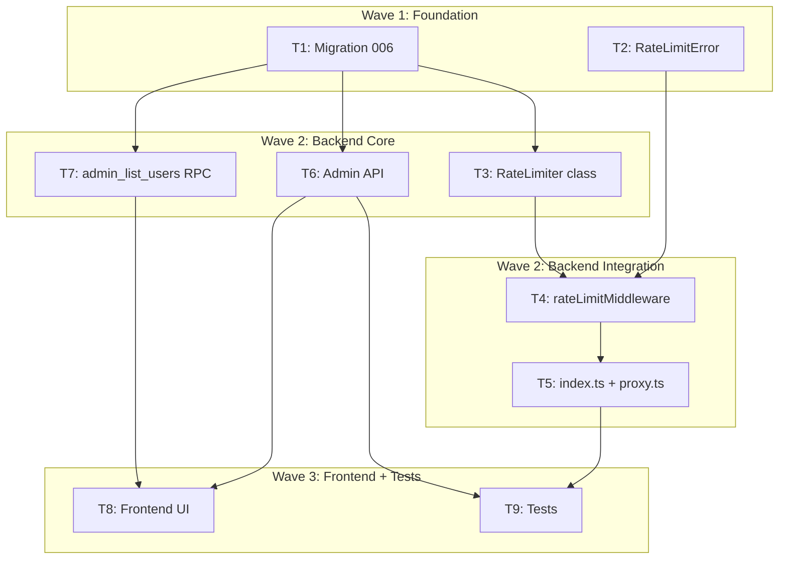

# S3 Implementation Plan: API Rate Limiting

> **階段**: S3 實作計畫
> **建立時間**: 2026-03-15 05:00
> **Agents**: db-expert, backend-expert, frontend-expert

---

## 1. 概述

### 1.1 功能目標
為 Apiex API Proxy 加入 per-key rate limiting（RPM/TPM），保護上游 API 免受濫用、確保多用戶公平使用。Admin 可設定 per-user rate limit tier。

### 1.2 實作範圍
- **範圍內**: Rate limit middleware、RateLimiter class、DB schema、Admin API、前端 tier 管理
- **範圍外**: 分散式 rate limiting、per-endpoint 限制、自適應 rate limiting、burst allowance

### 1.3 關聯文件
| 文件 | 路徑 | 狀態 |
|------|------|------|
| Brief Spec | `./s0_brief_spec.md` | ✅ |
| Dev Spec | `./s1_dev_spec.md` | ✅ |
| API Spec | `./s1_api_spec.md` | ✅ |
| Implementation Plan | `./s3_implementation_plan.md` | 📝 當前 |

---

## 2. 實作任務清單

### 2.1 任務總覽

| # | 任務 | 類型 | Agent | 依賴 | 複雜度 | source_ref | TDD | 狀態 |
|---|------|------|-------|------|--------|--------|-----|------|
| T1 | Migration 006: rate_limit_tiers + api_keys 欄位 | 資料層 | `db-expert` | - | S | - | ⛔ | ⬜ |
| T2 | RateLimitError class + Errors 工廠強化 | 後端 | `backend-expert` | - | S | - | ✅ | ⬜ |
| T3 | RateLimiter class (sliding window) | 後端 | `backend-expert` | T1 | M | - | ✅ | ⬜ |
| T4 | rateLimitMiddleware 實作 | 後端 | `backend-expert` | T2, T3 | M | - | ✅ | ⬜ |
| T5 | index.ts + proxy.ts 整合 | 後端 | `backend-expert` | T4 | S | - | ⛔ | ⬜ |
| T6 | Admin API: PATCH /users/:id/rate-limit | 後端 | `backend-expert` | T1 | S | - | ✅ | ⬜ |
| T7 | 更新 admin_list_users RPC | 資料層 | `db-expert` | T1 | S | - | ⛔ | ⬜ |
| T8 | 前端: api.ts + TierSelector + UserTable | 前端 | `frontend-expert` | T6, T7 | M | - | ⛔ | ⬜ |
| T9 | 單元測試 + 整合測試 | 測試 | `backend-expert` | T5, T6 | M | - | ✅ | ⬜ |

**狀態圖例**：⬜ pending / 🔄 in_progress / ✅ completed / ❌ blocked / ⏭️ skipped

**TDD**: ✅ = has tdd_plan, ⛔ = N/A (migration/integration/UI)

---

## 3. 任務詳情

### Task #1: Migration 006 — rate_limit_tiers + api_keys 欄位

**基本資訊**
| 項目 | 內容 |
|------|------|
| 類型 | 資料層 |
| Agent | `db-expert` |
| 複雜度 | S |
| 依賴 | - |
| 狀態 | ⬜ pending |

**描述**
建立 `supabase/migrations/006_rate_limit_tiers.sql`：
1. CREATE TABLE `rate_limit_tiers` (tier TEXT PK, rpm INT, tpm INT, created_at TIMESTAMPTZ)
2. INSERT 預設 tier: free(20, 100000), pro(60, 500000), unlimited(-1, -1)
3. ALTER TABLE `api_keys` ADD COLUMN `rate_limit_tier` TEXT NOT NULL DEFAULT 'free'

**受影響檔案**
| 檔案 | 變更類型 | 說明 |
|------|---------|------|
| `supabase/migrations/006_rate_limit_tiers.sql` | 新增 | 完整 migration |

**DoD**
- [ ] rate_limit_tiers 表建立，含三筆預設資料
- [ ] api_keys.rate_limit_tier 欄位新增，DEFAULT 'free'
- [ ] Migration 語法正確，可執行

**TDD Plan**: N/A -- DDL migration，無可測邏輯

**驗證方式**
```bash
# 在 Supabase local 環境執行 migration 後
psql -c "SELECT * FROM rate_limit_tiers;"
psql -c "SELECT column_name, column_default FROM information_schema.columns WHERE table_name='api_keys' AND column_name='rate_limit_tier';"
```

---

### Task #2: RateLimitError class + Errors 工廠強化

**基本資訊**
| 項目 | 內容 |
|------|------|
| 類型 | 後端 |
| Agent | `backend-expert` |
| 複雜度 | S |
| 依賴 | - |
| 狀態 | ⬜ pending |

**描述**
在 `packages/api-server/src/lib/errors.ts` 中：
1. 新增 `RateLimitError extends ApiError`，建構參數包含 `retryAfter: number` 和 `rateLimitHeaders: Record<string, string>`
2. Override `toResponse()` 在 Response headers 中附加 `Retry-After` 和 `X-RateLimit-*`
3. 更新 `Errors.rateLimitExceeded()` 接受選擇性參數 `{ retryAfter, limits, remaining }`

**受影響檔案**
| 檔案 | 變更類型 | 說明 |
|------|---------|------|
| `packages/api-server/src/lib/errors.ts` | 修改 | 新增 RateLimitError class |

**DoD**
- [ ] `RateLimitError` class 存在且繼承 `ApiError`
- [ ] `toResponse()` 包含 Retry-After + X-RateLimit-* headers
- [ ] 現有 `Errors.rateLimitExceeded()` 向後相容（無參數時行為不變）

**TDD Plan**
| 項目 | 內容 |
|------|------|
| 測試檔案 | `packages/api-server/src/lib/__tests__/errors.test.ts` |
| 測試指令 | `cd /Users/asd/demo/1/packages/api-server && npx vitest run src/lib/__tests__/errors.test.ts` |
| 預期失敗測試 | `RateLimitError includes Retry-After header`, `RateLimitError includes X-RateLimit headers`, `RateLimitError body matches OpenAI format` |

**驗證方式**
```bash
cd /Users/asd/demo/1/packages/api-server && npx vitest run src/lib/__tests__/errors.test.ts
```

---

### Task #3: RateLimiter Class (Sliding Window Counter)

**基本資訊**
| 項目 | 內容 |
|------|------|
| 類型 | 後端 |
| Agent | `backend-expert` |
| 複雜度 | M |
| 依賴 | T1 |
| 狀態 | ⬜ pending |

**描述**
新增 `packages/api-server/src/lib/RateLimiter.ts`：

```typescript
class RateLimiter {
  private counters: Map<string, KeyCounters>
  private configCache: Map<string, { config: RateLimitConfig; cachedAt: number }>

  check(keyId: string, tier: string, estimatedTokens: number): RateLimitResult
  record(keyId: string, actualTokens: number): void
  getConfig(tier: string): Promise<RateLimitConfig>
}
```

**關鍵實作細節**:
- Sliding window: 保留最近 60 秒的 `{timestamp, count}` entries
- `check()` 先清理過期 entries，再加總 window 內數值比對限制
- `record()` 找到當前請求的 entry（by timestamp proximity）更新 token count
- `getConfig()` 查 DB `rate_limit_tiers`，cache 60 秒
- Export singleton instance: `export const rateLimiter = new RateLimiter()`
- `tier` 直接從 context 的 `apiKey.rate_limit_tier` 取得，避免額外 DB query

**受影響檔案**
| 檔案 | 變更類型 | 說明 |
|------|---------|------|
| `packages/api-server/src/lib/RateLimiter.ts` | 新增 | 核心類別 |

**DoD**
- [ ] RateLimiter class export with check(), record(), getConfig()
- [ ] Sliding window 正確清理 >60s entries
- [ ] check() 回傳完整 RateLimitResult
- [ ] unlimited tier (-1) 正確返回 allowed: true
- [ ] getConfig() cache 有 TTL
- [ ] Singleton export

**TDD Plan**
| 項目 | 內容 |
|------|------|
| 測試檔案 | `packages/api-server/src/lib/__tests__/RateLimiter.test.ts` |
| 測試指令 | `cd /Users/asd/demo/1/packages/api-server && npx vitest run src/lib/__tests__/RateLimiter.test.ts` |
| 預期失敗測試 | `allows under RPM`, `blocks over RPM`, `allows under TPM`, `blocks over TPM`, `unlimited bypasses`, `cleans expired entries`, `record updates tokens`, `retryAfter calculation` |

**實作備註**
- Node.js 單執行緒，Map 操作天然原子性，不需 mutex
- 使用 `Date.now()` 取 timestamp，測試中可 mock
- 考慮注入 `now()` function 方便測試

---

### Task #4: rateLimitMiddleware 實作

**基本資訊**
| 項目 | 內容 |
|------|------|
| 類型 | 後端 |
| Agent | `backend-expert` |
| 複雜度 | M |
| 依賴 | T2, T3 |
| 狀態 | ⬜ pending |

**描述**
新增 `packages/api-server/src/middleware/rateLimitMiddleware.ts`：

```typescript
export const rateLimitMiddleware = createMiddleware(async (c, next) => {
  const apiKeyId = c.get('apiKeyId') as string
  const apiKey = c.get('apiKey') as Record<string, unknown>
  const tier = (apiKey.rate_limit_tier as string) ?? 'free'

  // Parse body to get estimated tokens (for TPM check)
  const body = await c.req.json()
  const estimatedTokens = body.max_tokens ?? 4096

  const result = rateLimiter.check(apiKeyId, tier, estimatedTokens)

  if (!result.allowed) {
    throw new RateLimitError(result)
  }

  // Store result for post-processing headers
  c.set('rateLimitResult', result)

  await next()

  // Add rate limit headers to response
  if (result.limits.rpm !== -1) {
    c.header('X-RateLimit-Limit-Requests', String(result.limits.rpm))
    c.header('X-RateLimit-Limit-Tokens', String(result.limits.tpm))
    c.header('X-RateLimit-Remaining-Requests', String(result.remaining.rpm))
    c.header('X-RateLimit-Remaining-Tokens', String(result.remaining.tpm))
  }
})
```

**受影響檔案**
| 檔案 | 變更類型 | 說明 |
|------|---------|------|
| `packages/api-server/src/middleware/rateLimitMiddleware.ts` | 新增 | Rate limit middleware |

**DoD**
- [ ] Middleware 從 context 讀取 apiKeyId + rate_limit_tier
- [ ] 超限時 throw RateLimitError
- [ ] 未超限時附加 X-RateLimit-* headers
- [ ] unlimited tier 不附加 headers
- [ ] Body 可被下游 handler 重複讀取

**TDD Plan**
| 項目 | 內容 |
|------|------|
| 測試檔案 | `packages/api-server/src/middleware/__tests__/rateLimitMiddleware.test.ts` |
| 測試指令 | `cd /Users/asd/demo/1/packages/api-server && npx vitest run src/middleware/__tests__/rateLimitMiddleware.test.ts` |
| 預期失敗測試 | `passes when under limit`, `returns 429 when over RPM`, `includes X-RateLimit headers`, `skips for unlimited` |

**實作備註**
- Hono 的 `c.req.json()` 內部有 cache，多次呼叫安全（pitfall 確認）
- 必須在 `await next()` 之後才設定 response headers（Hono 的 middleware 生命週期）
- RateLimitError 由 global error handler 攔截並回傳 429

---

### Task #5: index.ts + proxy.ts 整合

**基本資訊**
| 項目 | 內容 |
|------|------|
| 類型 | 後端 |
| Agent | `backend-expert` |
| 複雜度 | S |
| 依賴 | T4 |
| 狀態 | ⬜ pending |

**描述**
1. **index.ts**: 在 v1 route group 中，`apiKeyAuth` 之後加掛 `rateLimitMiddleware`：
   ```typescript
   v1.use('*', apiKeyAuth)
   v1.use('*', rateLimitMiddleware)  // 新增
   v1.route('/', proxyRoutes())
   ```
2. **proxy.ts**: 在請求完成後呼叫 `rateLimiter.record()`：
   - Non-streaming: 在 `keyService.settleQuota()` 旁邊加 `rateLimiter.record(apiKeyId, usage.total_tokens)`
   - Streaming: 在 finally block 加 `rateLimiter.record(apiKeyId, usage.total_tokens)`
   - Error path: `rateLimiter.record(apiKeyId, 0)`

**受影響檔案**
| 檔案 | 變更類型 | 說明 |
|------|---------|------|
| `packages/api-server/src/index.ts` | 修改 | 掛載 rateLimitMiddleware |
| `packages/api-server/src/routes/proxy.ts` | 修改 | 呼叫 rateLimiter.record() |

**DoD**
- [ ] v1 middleware chain 順序正確: apiKeyAuth → rateLimitMiddleware → routes
- [ ] Non-streaming 成功 path 呼叫 record(actualTokens)
- [ ] Streaming finally 呼叫 record(actualTokens)
- [ ] Error path 呼叫 record(0)

**TDD Plan**: N/A -- 整合接線，由 T9 整合測試覆蓋

**驗證方式**
```bash
cd /Users/asd/demo/1/packages/api-server && npx tsc --noEmit
```

---

### Task #6: Admin API — PATCH /users/:id/rate-limit

**基本資訊**
| 項目 | 內容 |
|------|------|
| 類型 | 後端 |
| Agent | `backend-expert` |
| 複雜度 | S |
| 依賴 | T1 |
| 狀態 | ⬜ pending |

**描述**
在 `packages/api-server/src/routes/admin.ts` 新增端點：

```typescript
router.patch('/users/:id/rate-limit', async (c) => {
  const userId = c.req.param('id')
  const body = await c.req.json<{ tier: string }>()

  // 1. 驗證 tier 存在
  const { data: tierData } = await supabaseAdmin
    .from('rate_limit_tiers').select('tier').eq('tier', body.tier).single()
  if (!tierData) return Errors.invalidTier()

  // 2. 更新所有 active keys
  const { data: updatedKeys } = await supabaseAdmin
    .from('api_keys')
    .update({ rate_limit_tier: body.tier })
    .eq('user_id', userId).eq('status', 'active')

  return c.json({ data: { user_id: userId, updated_keys: updatedKeys?.length ?? 0, tier: body.tier } })
})
```

注意：需在 `Errors` 工廠新增 `invalidTier()` 方法。

**受影響檔案**
| 檔案 | 變更類型 | 說明 |
|------|---------|------|
| `packages/api-server/src/routes/admin.ts` | 修改 | 新增 rate-limit endpoint |
| `packages/api-server/src/lib/errors.ts` | 修改 | 新增 Errors.invalidTier() |

**DoD**
- [ ] PATCH /admin/users/:id/rate-limit 端點可用
- [ ] 無效 tier 回 400
- [ ] 更新所有 active keys 的 rate_limit_tier
- [ ] 回傳格式符合 API Spec

**TDD Plan**
| 項目 | 內容 |
|------|------|
| 測試檔案 | `packages/api-server/src/routes/__tests__/admin.test.ts` |
| 測試指令 | `cd /Users/asd/demo/1/packages/api-server && npx vitest run src/routes/__tests__/admin.test.ts` |
| 預期失敗測試 | `updates tier for valid request`, `returns 400 for invalid tier`, `updates all active keys` |

---

### Task #7: 更新 admin_list_users RPC

**基本資訊**
| 項目 | 內容 |
|------|------|
| 類型 | 資料層 |
| Agent | `db-expert` |
| 複雜度 | S |
| 依賴 | T1 |
| 狀態 | ⬜ pending |

**描述**
修改 Supabase 的 `admin_list_users` DB function，在 SELECT 中加入 rate_limit_tier。需要查看現有 function 定義（可能在 003_quota_functions.sql 或其他 migration 中），新增一個 migration `007_update_admin_list_users.sql` 來 CREATE OR REPLACE FUNCTION。

回傳值中加入 `rate_limit_tier`，取該用戶 active keys 中的 tier（由於 Admin API 批次更新，同用戶所有 key tier 一致，取 MIN/MAX 皆可）。無 key 的用戶預設 'free'。

**受影響檔案**
| 檔案 | 變更類型 | 說明 |
|------|---------|------|
| `supabase/migrations/007_update_admin_list_users.sql` | 新增 | 更新 RPC function |

**DoD**
- [ ] admin_list_users 回傳包含 rate_limit_tier
- [ ] 無 key 用戶回傳 'free'

**TDD Plan**: N/A -- DB function，由手動查詢驗證

**驗證方式**
```bash
psql -c "SELECT * FROM admin_list_users(0, 10);"
```

---

### Task #8: 前端 — api.ts + TierSelector + UserTable

**基本資訊**
| 項目 | 內容 |
|------|------|
| 類型 | 前端 |
| Agent | `frontend-expert` |
| 複雜度 | M |
| 依賴 | T6, T7 |
| 狀態 | ⬜ pending |

**描述**

1. **api.ts 修改**:
   - `AdminUser` interface 加 `rate_limit_tier: string`
   - `makeAdminApi` 加 `setRateLimit`:
     ```typescript
     setRateLimit: (userId: string, tier: string) =>
       apiPatch(`/admin/users/${userId}/rate-limit`, { tier }, token)
     ```

2. **TierSelector.tsx 新增** (`packages/web-admin/src/components/TierSelector.tsx`):
   - Props: `userId`, `currentTier`, `onSave(tier)`, `onCancel()`
   - 下拉選單含 free / pro / unlimited 三個選項
   - 確認/取消按鈕，參考 `QuotaEditor` 的 UX 模式

3. **UserTable.tsx 修改**:
   - 表頭新增 "Tier" 欄位
   - 每行顯示 tier badge（free=gray, pro=blue, unlimited=green）
   - 點擊顯示 TierSelector（inline editing，同 QuotaEditor 模式）

4. **dashboard/page.tsx 修改**:
   - 新增 `handleTierUpdate(userId, tier)` handler
   - 呼叫 `adminApi.setRateLimit(userId, tier)` 並更新 local state

**受影響檔案**
| 檔案 | 變更類型 | 說明 |
|------|---------|------|
| `packages/web-admin/src/lib/api.ts` | 修改 | AdminUser + setRateLimit |
| `packages/web-admin/src/components/TierSelector.tsx` | 新增 | Tier 下拉選單元件 |
| `packages/web-admin/src/components/UserTable.tsx` | 修改 | 新增 Tier 欄位 |
| `packages/web-admin/src/app/admin/(protected)/dashboard/page.tsx` | 修改 | 新增 handler |

**DoD**
- [ ] AdminUser 包含 rate_limit_tier
- [ ] setRateLimit API method 可用
- [ ] TierSelector 元件渲染三個選項
- [ ] UserTable 顯示 Tier 欄位 + inline editing
- [ ] 修改後 UI 即時更新
- [ ] TypeScript 編譯通過

**TDD Plan**: N/A -- UI 元件，手動測試

**驗證方式**
```bash
cd /Users/asd/demo/1/packages/web-admin && npx next build
```

---

### Task #9: 單元測試 + 整合測試

**基本資訊**
| 項目 | 內容 |
|------|------|
| 類型 | 測試 |
| Agent | `backend-expert` |
| 複雜度 | M |
| 依賴 | T5, T6 |
| 狀態 | ⬜ pending |

**描述**
補齊並整合所有測試：
1. **RateLimiter 單元測試**（如已在 T3 TDD 中建立，此處補充邊界案例）
2. **rateLimitMiddleware 單元測試**（mock RateLimiter）
3. **Admin rate-limit endpoint 測試**（mock Supabase）
4. **Integration test**: 使用 Hono test client 發送連續請求，驗證 429 行為

**受影響檔案**
| 檔案 | 變更類型 | 說明 |
|------|---------|------|
| `packages/api-server/src/lib/__tests__/RateLimiter.test.ts` | 新增/修改 | 補充邊界測試 |
| `packages/api-server/src/middleware/__tests__/rateLimitMiddleware.test.ts` | 新增/修改 | 補充整合測試 |
| `packages/api-server/src/routes/__tests__/admin.test.ts` | 新增/修改 | Admin rate-limit 測試 |

**DoD**
- [ ] 所有 rate limiting 相關測試通過
- [ ] RateLimiter 邊界案例覆蓋（concurrent check、window boundary、record 更新）
- [ ] Middleware 三條路徑覆蓋（allow / block / unlimited）
- [ ] Admin API valid / invalid tier 覆蓋

**TDD Plan**
| 項目 | 內容 |
|------|------|
| 測試檔案 | 同上三個檔案 |
| 測試指令 | `cd /Users/asd/demo/1/packages/api-server && npx vitest run` |
| 預期測試 | 全部通過 |

**驗證方式**
```bash
cd /Users/asd/demo/1/packages/api-server && npx vitest run --coverage
```

---

## 4. 依賴關係圖



---

## 5. 執行順序與 Agent 分配

### 5.1 執行波次

| 波次 | 任務 | Agent | 可並行 | 備註 |
|------|------|-------|--------|------|
| Wave 1 | T1 | `db-expert` | 否 | DB 先行 |
| Wave 1 | T2 | `backend-expert` | 是（與 T1 並行） | Error class 無 DB 依賴 |
| Wave 2 | T3 | `backend-expert` | 否 | 依賴 T1 的 schema |
| Wave 2 | T6 | `backend-expert` | 是（與 T3 並行） | 依賴 T1，不依賴 T3 |
| Wave 2 | T7 | `db-expert` | 是（與 T3/T6 並行） | 依賴 T1 |
| Wave 2 | T4 | `backend-expert` | 否 | 依賴 T2+T3 |
| Wave 2 | T5 | `backend-expert` | 否 | 依賴 T4 |
| Wave 3 | T8 | `frontend-expert` | 是（與 T9 並行） | 依賴 T6+T7 |
| Wave 3 | T9 | `backend-expert` | 是（與 T8 並行） | 依賴 T5+T6 |

### 5.2 Agent 調度指令

```
# Wave 1 — parallel
Task(agent: "db-expert", task: "T1", prompt: "建立 Migration 006: rate_limit_tiers 表 + api_keys.rate_limit_tier 欄位。詳見 s3_implementation_plan.md Task #1。")
Task(agent: "backend-expert", task: "T2", prompt: "實作 RateLimitError class + 強化 Errors 工廠。詳見 s3_implementation_plan.md Task #2。TDD first。")

# Wave 2 — sequential with parallel branches
Task(agent: "backend-expert", task: "T3", prompt: "實作 RateLimiter class (sliding window counter)。詳見 s3_implementation_plan.md Task #3。TDD first。")
Task(agent: "backend-expert", task: "T6", prompt: "實作 Admin API PATCH /users/:id/rate-limit。詳見 s3_implementation_plan.md Task #6。", parallel_with: "T3")
Task(agent: "db-expert", task: "T7", prompt: "更新 admin_list_users RPC 包含 rate_limit_tier。詳見 s3_implementation_plan.md Task #7。", parallel_with: "T3")
Task(agent: "backend-expert", task: "T4", prompt: "實作 rateLimitMiddleware。詳見 s3_implementation_plan.md Task #4。TDD first。", after: "T2,T3")
Task(agent: "backend-expert", task: "T5", prompt: "整合 middleware 到 index.ts，proxy.ts 加 record()。詳見 s3_implementation_plan.md Task #5。", after: "T4")

# Wave 3 — parallel
Task(agent: "frontend-expert", task: "T8", prompt: "前端 api.ts + TierSelector + UserTable 整合。詳見 s3_implementation_plan.md Task #8。")
Task(agent: "backend-expert", task: "T9", prompt: "補齊單元測試 + 整合測試。詳見 s3_implementation_plan.md Task #9。", parallel_with: "T8")
```

---

## 6. 驗證計畫

### 6.1 逐任務驗證

| 任務 | 驗證指令 | 預期結果 |
|------|---------|---------|
| T1 | `psql -c "SELECT * FROM rate_limit_tiers;"` | 3 rows: free, pro, unlimited |
| T2 | `npx vitest run src/lib/__tests__/errors.test.ts` | Tests passed |
| T3 | `npx vitest run src/lib/__tests__/RateLimiter.test.ts` | Tests passed |
| T4 | `npx vitest run src/middleware/__tests__/rateLimitMiddleware.test.ts` | Tests passed |
| T5 | `npx tsc --noEmit` | No errors |
| T6 | `npx vitest run src/routes/__tests__/admin.test.ts` | Tests passed |
| T7 | `psql -c "SELECT * FROM admin_list_users(0, 10);"` | 含 rate_limit_tier 欄位 |
| T8 | `cd packages/web-admin && npx next build` | Build success |
| T9 | `npx vitest run` | All tests passed |

### 6.2 整體驗證

```bash
# Backend 建置 + 測試
cd /Users/asd/demo/1/packages/api-server && npx tsc --noEmit && npx vitest run

# Frontend 建置
cd /Users/asd/demo/1/packages/web-admin && npx next build

# 手動 curl 測試 rate limiting
# 1. 連續發送 21 個請求（free tier RPM=20），第 21 個應 429
for i in $(seq 1 21); do
  curl -s -o /dev/null -w "%{http_code}" -X POST http://localhost:3000/v1/chat/completions \
    -H "Authorization: Bearer apx-sk-test" \
    -H "Content-Type: application/json" \
    -d '{"model":"apex-smart","messages":[{"role":"user","content":"hi"}]}'
  echo " request $i"
done
```

---

## 7. 實作進度追蹤

### 7.1 進度總覽

| 指標 | 數值 |
|------|------|
| 總任務數 | 9 |
| 已完成 | 0 |
| 進行中 | 0 |
| 待處理 | 9 |
| 完成率 | 0% |

### 7.2 時間軸

| 時間 | 事件 | 備註 |
|------|------|------|
| 2026-03-15 05:00 | 計畫建立 | |
| | | |

---

## 8. 變更記錄

### 8.1 檔案變更清單

```
新增：
  supabase/migrations/006_rate_limit_tiers.sql
  supabase/migrations/007_update_admin_list_users.sql
  packages/api-server/src/lib/RateLimiter.ts
  packages/api-server/src/middleware/rateLimitMiddleware.ts
  packages/web-admin/src/components/TierSelector.tsx
  packages/api-server/src/lib/__tests__/RateLimiter.test.ts
  packages/api-server/src/middleware/__tests__/rateLimitMiddleware.test.ts

修改：
  packages/api-server/src/lib/errors.ts
  packages/api-server/src/index.ts
  packages/api-server/src/routes/proxy.ts
  packages/api-server/src/routes/admin.ts
  packages/web-admin/src/lib/api.ts
  packages/web-admin/src/components/UserTable.tsx
  packages/web-admin/src/app/admin/(protected)/dashboard/page.tsx
```

---

## 9. 風險與問題追蹤

### 9.1 已識別風險

| # | 風險 | 影響 | 緩解措施 | 狀態 |
|---|------|------|---------|------|
| 1 | In-memory 計數器重啟歸零 | 中 | MVP 可接受，未來加 Redis | 已接受 |
| 2 | Body 重複讀取 | 高 | Hono c.req.json() 有 cache | 已驗證 |
| 3 | Sliding window 記憶體洩漏 | 中 | 每次 check 清理過期 entries | 設計內建 |
| 4 | Tier config cache 延遲 | 低 | 60 秒 TTL，已接受 | 已接受 |

---

## SDD Context

```json
{
  "sdd_context": {
    "stages": {
      "s3": {
        "status": "completed",
        "agent": "architect",
        "completed_at": "2026-03-15T05:00:00+08:00",
        "output": {
          "implementation_plan_path": "dev/specs/rate-limiting/s3_implementation_plan.md",
          "waves": [
            {
              "wave": 1,
              "name": "Foundation",
              "tasks": [
                { "id": "T1", "name": "Migration 006", "agent": "db-expert", "dependencies": [], "complexity": "S", "parallel": true },
                { "id": "T2", "name": "RateLimitError class", "agent": "backend-expert", "dependencies": [], "complexity": "S", "parallel": true }
              ]
            },
            {
              "wave": 2,
              "name": "Backend Core + Integration",
              "tasks": [
                { "id": "T3", "name": "RateLimiter class", "agent": "backend-expert", "dependencies": ["T1"], "complexity": "M", "parallel": false },
                { "id": "T6", "name": "Admin API", "agent": "backend-expert", "dependencies": ["T1"], "complexity": "S", "parallel": true },
                { "id": "T7", "name": "admin_list_users RPC", "agent": "db-expert", "dependencies": ["T1"], "complexity": "S", "parallel": true },
                { "id": "T4", "name": "rateLimitMiddleware", "agent": "backend-expert", "dependencies": ["T2", "T3"], "complexity": "M", "parallel": false },
                { "id": "T5", "name": "index.ts + proxy.ts", "agent": "backend-expert", "dependencies": ["T4"], "complexity": "S", "parallel": false }
              ]
            },
            {
              "wave": 3,
              "name": "Frontend + Tests",
              "tasks": [
                { "id": "T8", "name": "Frontend UI", "agent": "frontend-expert", "dependencies": ["T6", "T7"], "complexity": "M", "parallel": true },
                { "id": "T9", "name": "Tests", "agent": "backend-expert", "dependencies": ["T5", "T6"], "complexity": "M", "parallel": true }
              ]
            }
          ],
          "total_tasks": 9,
          "estimated_waves": 3,
          "verification": {
            "static_analysis": ["npx tsc --noEmit", "npx next build"],
            "unit_tests": ["npx vitest run"]
          }
        }
      }
    }
  }
}
```
