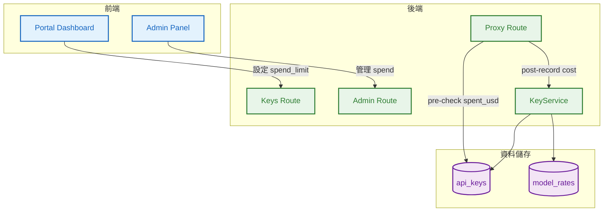
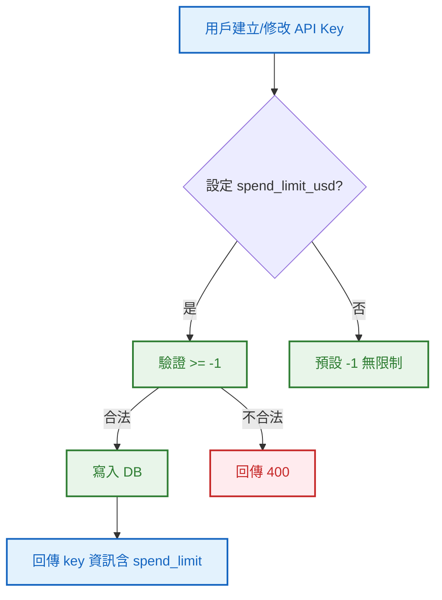
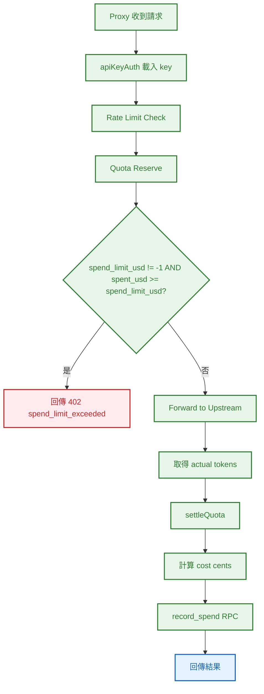

# S0 Brief Spec: Per-Key Spend Limit

> **階段**: S0 需求討論
> **建立時間**: 2026-03-15 10:00
> **Agent**: requirement-analyst
> **Spec Mode**: Full Spec
> **工作類型**: new_feature

---

## 0. 工作類型

**本次工作類型**：`new_feature`

## 1. 一句話描述

讓用戶可以為每個 API Key 設定花費上限（USD 美分），當累計花費達到上限時自動拒絕請求，防止單一 key 失控消耗。

## 2. 為什麼要做

### 2.1 痛點

- **無花費控制**：目前 quota 只管 token 數量，但不同模型的 token 單價差異極大（apex-smart vs apex-cheap），用戶無法直接控制「花了多少錢」
- **單一 key 失控風險**：如果某個 key 被自動化腳本使用，沒有花費上限可能在短時間內累積巨額消費

### 2.2 目標

- 用戶可在建立或修改 API Key 時設定 `spend_limit_usd`（美分 INTEGER，-1 = 無限制）
- Proxy 請求前檢查：累計花費 >= spend_limit 時回傳 402
- 每次請求完成後，根據實際 token 用量 + model_rates 計算花費並累加
- Admin 可查看/設定/重置 per-key spend limit
- 用戶可在 Portal 查看每個 key 的花費狀態

## 3. 使用者

| 角色 | 說明 |
|------|------|
| API 用戶 | 設定 key 花費上限、查看花費狀態 |
| Admin | 管理所有 key 的花費上限、查看花費資訊、重置計數器 |

## 4. 核心流程

### 4.0 功能區拆解

| FA ID | 功能區名稱 | 一句話描述 | 入口 | 獨立性 |
|-------|-----------|-----------|------|--------|
| FA-A | Spend Limit 設定 | 用戶/Admin 設定 per-key 花費上限 | API Key 管理頁 / Admin 面板 | 高 |
| FA-B | Spend Check & Record | Proxy 層花費檢查與記錄 | Proxy 請求 pipeline | 中（與現有 quota 機制緊耦合） |

**本次策略**：single_sop

### 4.1 系統架構總覽



### 4.2 FA-A: Spend Limit 設定

#### 4.2.1 全局流程圖



### 4.3 FA-B: Spend Check & Record

#### 4.3.1 全局流程圖



### 4.4 例外流程

| 維度 | ID | FA | 情境 | 觸發條件 | 預期行為 | 嚴重度 |
|------|-----|-----|------|---------|---------|--------|
| 業務邏輯 | E1 | FA-B | 花費超限 | spent_usd >= spend_limit_usd | 402 spend_limit_exceeded | P0 |
| 資料邊界 | E2 | FA-B | model_rates 未設定 | 查無對應 model_tag 的費率 | cost 記為 0，不阻斷請求 | P1 |
| 並行/競爭 | E3 | FA-B | 並發請求同時檢查 | 多個請求同時通過 pre-check | 允許輕微超額（最終一致性） | P2 |
| 資料邊界 | E4 | FA-A | spend_limit_usd 為 0 | 設定 0 表示完全禁止花費 | 所有請求被拒（合法行為） | P2 |

### 4.5 白話文摘要

這次功能讓用戶可以為每把 API Key 設定一個「花費上限」（以美分計算）。當某把 key 的累計花費達到上限時，系統會自動擋住後續請求，避免帳單失控。管理員也可以幫用戶重置花費計數器。最壞情況是並發請求可能讓花費略微超過上限（類似 quota 的樂觀預扣），但不會大幅超額。

## 5. 成功標準

| # | FA | 類別 | 標準 | 驗證方式 |
|---|-----|------|------|---------|
| 1 | FA-A | 功能 | POST /keys 支援 spend_limit_usd 參數 | API 測試 |
| 2 | FA-A | 功能 | PATCH /keys/:id 可修改 spend_limit_usd | API 測試 |
| 3 | FA-A | 功能 | GET /keys 回傳 spend_limit_usd + spent_usd | API 測試 |
| 4 | FA-B | 功能 | spent_usd >= spend_limit_usd 時回傳 402 | API 測試 |
| 5 | FA-B | 功能 | 請求完成後正確累加 spent_usd | DB 驗證 |
| 6 | FA-A | 功能 | Admin 可重置 spent_usd 為 0 | API 測試 |
| 7 | FA-A | 功能 | Portal UI 顯示花費狀態 | 目視確認 |

## 6. 範圍

### 範圍內
- api_keys 表新增 spend_limit_usd + spent_usd 欄位
- Proxy 層 spend check + spend record
- Keys route 支援設定 spend_limit
- Admin route 支援查看/設定/重置
- Portal UI 顯示花費狀態
- 基本測試

### 範圍外
- 花費預扣（pre-deduct cost）— 只做 post-record
- 花費通知 / Webhook
- 按時段重置花費（月重置）
- 精確成本追蹤（允許估算誤差）

## 7. 已知限制與約束

- 花費計算依賴 model_rates 表，若費率未設定則 cost 記為 0
- 並發場景下允許輕微超額（與 quota 機制一致的最終一致性模型）
- 花費以美分（INTEGER）儲存，避免浮點數精度問題

---

## 10. SDD Context

```json
{
  "sdd_context": {
    "stages": {
      "s0": {
        "status": "completed",
        "agent": "requirement-analyst",
        "output": {
          "brief_spec_path": "dev/specs/spend-limit/s0_brief_spec.md",
          "work_type": "new_feature",
          "requirement": "Per-key spend limit: 讓用戶為每個 API Key 設定花費上限（USD cents），超限時拒絕請求",
          "pain_points": ["無花費控制", "單一 key 失控風險"],
          "goal": "用戶/Admin 可設定 per-key 花費上限，Proxy 自動檢查並記錄花費",
          "success_criteria": ["SC-1", "SC-2", "SC-3", "SC-4", "SC-5", "SC-6", "SC-7"],
          "scope_in": ["DB 欄位", "Proxy check+record", "Keys route", "Admin route", "Portal UI"],
          "scope_out": ["花費預扣", "花費通知", "月重置", "精確成本追蹤"],
          "constraints": ["依賴 model_rates", "允許輕微超額", "美分 INTEGER"],
          "functional_areas": [
            {"id": "FA-A", "name": "Spend Limit 設定", "independence": "high"},
            {"id": "FA-B", "name": "Spend Check & Record", "independence": "medium"}
          ],
          "decomposition_strategy": "single_sop"
        }
      }
    }
  }
}
```
