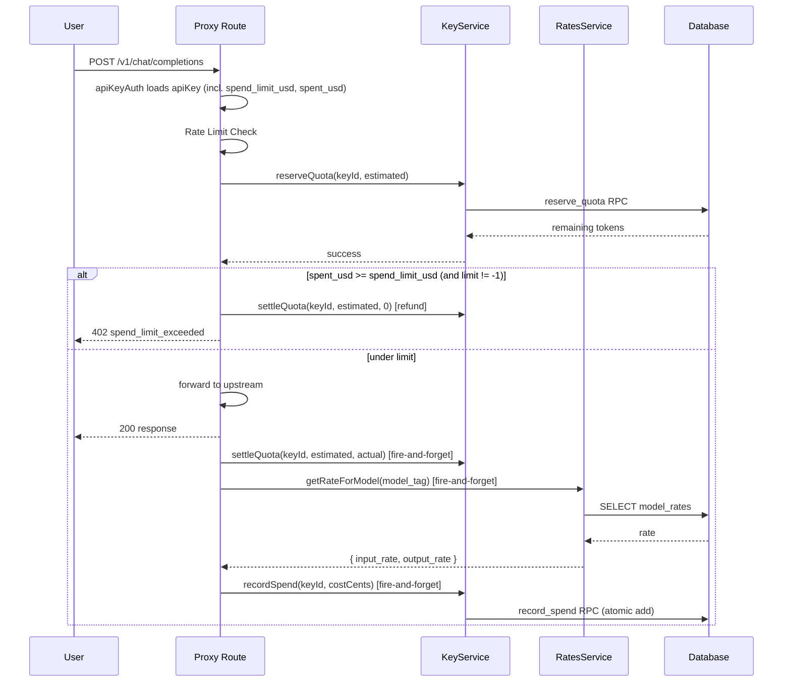

# S1 Dev Spec: Per-Key Spend Limit

> **階段**: S1 技術分析
> **建立時間**: 2026-03-15 10:00
> **Agent**: codebase-explorer (Phase 1) + architect (Phase 2)
> **工作類型**: new_feature
> **複雜度**: M

---

## 1. 概述

### 1.1 需求參照
> 完整需求見 `s0_brief_spec.md`，以下僅摘要。

在 api_keys 表新增 `spend_limit_usd`（花費上限，美分 INTEGER，-1=無限制）和 `spent_usd`（已花費，美分 INTEGER，0 起），Proxy 請求前檢查花費是否超限，請求完成後根據 model_rates 費率計算成本並累加。

### 1.2 技術方案摘要

採用與 quota 機制一致的「post-record」模式：Proxy 在 quota check 之後加入 spend limit pre-check（直接讀取 apiKeyAuth 已載入的 `apiKey` context），請求完成後在 settleQuota 的 fire-and-forget 區段新增 cost 計算 + `record_spend` RPC 呼叫。DB 新增一個 SQL function `record_spend` 做原子累加。Keys route 和 Admin route 擴充支援 spend_limit 的 CRUD。

---

## 2. 影響範圍（Phase 1：codebase-explorer）

### 2.1 受影響檔案

#### Backend (Hono + TypeScript)
| 檔案 | 變更類型 | 說明 |
|------|---------|------|
| `packages/api-server/src/services/KeyService.ts` | 修改 | 新增 spend limit 相關方法、createKey 支援 spend_limit_usd 參數 |
| `packages/api-server/src/routes/proxy.ts` | 修改 | quota check 後加 spend limit check、settlement 後加 cost record |
| `packages/api-server/src/routes/keys.ts` | 修改 | POST/PATCH 支援 spend_limit_usd、GET 回傳 spend 資訊 |
| `packages/api-server/src/routes/admin.ts` | 修改 | 新增 per-key spend 查看/設定/重置端點 |
| `packages/api-server/src/lib/errors.ts` | 修改 | 新增 spendLimitExceeded 錯誤 |
| `packages/api-server/src/services/RatesService.ts` | 讀取 | 使用現有 getRateForModel 方法取得費率 |

#### Database
| 資料表 | 變更類型 | 說明 |
|--------|---------|------|
| `api_keys` | 修改 | 新增 `spend_limit_usd` + `spent_usd` 欄位 |
| `model_rates` | 讀取 | 查詢費率計算成本 |

#### Frontend (Next.js)
| 檔案 | 變更類型 | 說明 |
|------|---------|------|
| `packages/web-admin/src/lib/api.ts` | 修改 | ApiKey 型別新增 spend 欄位 |
| `packages/web-admin/src/components/ApiKeyCard.tsx` | 修改 | 顯示花費狀態 |
| `packages/web-admin/src/components/ApiKeyCreateModal.tsx` | 修改 | 建立時可設定 spend_limit |

### 2.2 依賴關係
- **上游依賴**: `apiKeyAuth` middleware（已載入完整 api_keys row）、`model_rates` 表（費率計算）、`RatesService`
- **下游影響**: Proxy pipeline（新增 check + record 步驟）、Keys/Admin API 回應格式擴充

### 2.3 現有模式與技術考量

**Quota 預扣模式**：現有 quota 使用 `reserveQuota`（SQL atomic deduct）→ forward → `settleQuota`（SQL atomic refund/charge diff）。Spend limit 不需要預扣，因為成本只有在知道實際 token 數量後才能精確計算。所以 spend limit 使用更簡單的 **post-record** 模式：

1. Pre-check：在已載入的 apiKey context 中檢查 `spent_usd >= spend_limit_usd`（無額外 DB query）
2. Post-record：fire-and-forget 計算 cost + RPC 累加（與 settleQuota 同層級）

**apiKeyAuth 已載入完整 row**：`defaultApiKeyLookup` 使用 `select('*')`，所以新增的 `spend_limit_usd` 和 `spent_usd` 欄位會自動出現在 `c.get('apiKey')` 中，無需修改 middleware。

**model_rates 查詢**：`RatesService.getRateForModel()` 已存在，可直接使用。但它每次都查 DB。考慮到 spend record 是 fire-and-forget，這個延遲可以接受。

**並發安全**：Pre-check 使用的是請求開始時的 snapshot（apiKeyAuth 載入的值），多個並發請求可能同時通過 check。這與 quota 的行為一致 -- 最終一致性，允許輕微超額。`record_spend` SQL function 使用 atomic `spent_usd = spent_usd + p_amount` 確保累加不丟失。

---

## 3. User Flow（Phase 2：architect）

```mermaid
flowchart TD
    subgraph 設定花費上限
        A[用戶建立 API Key]:::fe --> B[填入 spend_limit_usd]:::fe
        B --> C[POST /keys]:::be
        C --> D[KeyService.createKey 含 spend_limit]:::be
        D --> E[DB INSERT]:::db
        E --> F[回傳 key 含 spend_limit_usd=N, spent_usd=0]:::fe
    end

    subgraph Proxy 請求
        G[API 請求進入]:::be --> H[apiKeyAuth 載入 key]:::be
        H --> I[Rate Limit Check]:::be
        I --> J[Quota Reserve]:::be
        J --> K{spend_limit_usd != -1 AND spent_usd >= spend_limit_usd?}
        K -->|超限| L[402 spend_limit_exceeded]:::ex
        K -->|未超限| M[Forward to Upstream]:::be
        M --> N[取得 actual usage]:::be
        N --> O[settleQuota]:::be
        O --> P[computeCost + recordSpend]:::be
        P --> Q[回傳結果]:::fe
    end

    classDef fe fill:#e3f2fd,color:#1565c0,stroke:#1565c0,stroke-width:2px
    classDef be fill:#e8f5e9,color:#2e7d32,stroke:#2e7d32,stroke-width:2px
    classDef db fill:#f3e5f5,color:#6a1b9a,stroke:#6a1b9a,stroke-width:2px
    classDef ex fill:#ffebee,color:#c62828,stroke:#c62828,stroke-width:2px
```



### 3.1 主要流程
| 步驟 | 用戶動作 | 系統回應 | 備註 |
|------|---------|---------|------|
| 1 | 建立 key 時設定 spend_limit_usd | 建立成功，回傳含 spend 資訊 | -1 = 無限制 |
| 2 | 使用 key 發送 API 請求 | 檢查花費 → 轉發 → 記錄成本 | fire-and-forget |
| 3 | 花費達上限後再次請求 | 回傳 402 spend_limit_exceeded | 類似 quota_exhausted |
| 4 | Admin 重置花費計數器 | spent_usd 歸零 | POST /admin/keys/:id/reset-spend |

### 3.2 異常流程

| S0 ID | 情境 | 觸發條件 | 系統處理 | 用戶看到 |
|-------|------|---------|---------|---------|
| E1 | 花費超限 | spent_usd >= spend_limit_usd | 退回 reserved quota + 回傳 402 | "Spend limit exceeded" |
| E2 | model_rates 未設定 | 查無費率 | cost 記為 0，不阻斷 | 正常回應（但花費不累加） |
| E3 | 並發超額 | 多請求同時通過 check | 允許，spent_usd 最終正確 | 正常回應 |
| E4 | spend_limit 為 0 | 設定 0 即完全禁止 | 所有請求 402 | "Spend limit exceeded" |

---

## 4. Data Flow



### 4.1 API 契約

> 完整 API 規格見 [`s1_api_spec.md`](./s1_api_spec.md)。

**Endpoint 摘要**

| Method | Path | 說明 |
|--------|------|------|
| `POST` | `/v1/keys` | 建立 key（新增 spend_limit_usd 參數） |
| `PATCH` | `/v1/keys/:id` | 修改 key（新增 spend_limit_usd 參數） |
| `GET` | `/v1/keys` | 列表 key（回傳含 spend 資訊） |
| `PATCH` | `/admin/keys/:id/spend-limit` | Admin 設定 spend limit |
| `POST` | `/admin/keys/:id/reset-spend` | Admin 重置花費計數器 |
| `GET` | `/admin/keys/:id/spend` | Admin 查看 key 花費資訊 |

### 4.2 資料模型

#### api_keys 擴充欄位
```
spend_limit_usd: INTEGER DEFAULT -1  -- 花費上限（美分），-1 = 無限制
spent_usd: INTEGER DEFAULT 0         -- 已花費（美分）
```

#### SQL Function: record_spend
```sql
record_spend(p_key_id UUID, p_amount_cents INTEGER) RETURNS VOID
-- UPDATE api_keys SET spent_usd = spent_usd + p_amount_cents WHERE id = p_key_id
```

#### Cost 計算公式
```
cost_cents = ROUND((prompt_tokens * input_rate_per_1k + completion_tokens * output_rate_per_1k) / 1000 * 100)
```
其中 rate 單位是 USD per 1K tokens，乘以 100 轉為美分。

---

## 5. 任務清單

### 5.1 任務總覽

| # | 任務 | 類型 | 複雜度 | Agent | 依賴 |
|---|------|------|--------|-------|------|
| 1 | DB migration: api_keys 新增 spend 欄位 + SQL function | 資料層 | S | backend-developer | - |
| 2 | KeyService 擴充 spend 相關方法 | 後端 | M | backend-developer | #1 |
| 3 | Proxy spend check（pre-check） | 後端 | S | backend-developer | #2 |
| 4 | Proxy spend record（post-record） | 後端 | M | backend-developer | #2 |
| 5 | Keys route 擴充 spend_limit 支援 | 後端 | S | backend-developer | #2 |
| 6 | Admin route 新增 spend 管理端點 | 後端 | M | backend-developer | #2 |
| 7 | 前端 API Key 顯示花費 + 設定 spend limit | 前端 | M | frontend-developer | #5 |
| 8 | 測試 | 後端 | M | backend-developer | #3, #4, #5, #6 |

### 5.2 任務詳情

#### Task #1: DB Migration — api_keys 新增 spend 欄位 + SQL function
- **類型**: 資料層
- **複雜度**: S
- **Agent**: backend-developer
- **描述**: 建立 `supabase/migrations/009_spend_limit.sql`，新增兩個欄位和一個 SQL function。
- **DoD (Definition of Done)**:
  - [ ] `api_keys` 表新增 `spend_limit_usd INTEGER NOT NULL DEFAULT -1`
  - [ ] `api_keys` 表新增 `spent_usd INTEGER NOT NULL DEFAULT 0`
  - [ ] 新增 `record_spend(p_key_id UUID, p_amount_cents INTEGER)` SQL function（atomic add）
  - [ ] 新增 `reset_spend(p_key_id UUID)` SQL function（reset to 0）
  - [ ] Migration 可正常執行，不破壞現有資料
- **驗收方式**: `supabase db push` 成功，`SELECT spend_limit_usd, spent_usd FROM api_keys` 回傳預設值

#### Task #2: KeyService 擴充 spend 相關方法
- **類型**: 後端
- **複雜度**: M
- **Agent**: backend-developer
- **依賴**: Task #1
- **描述**: 在 `KeyService` 新增 spend limit 相關方法，並修改 `createKey` 接受 `spend_limit_usd` 參數。
- **DoD**:
  - [ ] `createKey` 接受可選 `spendLimitUsd` 參數，寫入 DB
  - [ ] `updateSpendLimit(keyId, spendLimitUsd)` 方法
  - [ ] `recordSpend(keyId, amountCents)` 方法（呼叫 `record_spend` RPC）
  - [ ] `resetSpend(keyId)` 方法（呼叫 `reset_spend` RPC）
  - [ ] `listKeys` 回傳含 `spend_limit_usd` + `spent_usd`
  - [ ] `ApiKeyRecord` 和 `CreateKeyResult` interface 更新
- **驗收方式**: Unit test 驗證各方法

#### Task #3: Proxy Spend Check（pre-check）
- **類型**: 後端
- **複雜度**: S
- **Agent**: backend-developer
- **依賴**: Task #2
- **描述**: 在 `proxy.ts` 的 quota reserve 之後，加入 spend limit pre-check。若超限，退回 reserved quota 並回傳 402。
- **DoD**:
  - [ ] 在 `reserveQuota` 成功後、`resolveRoute` 之前加入 spend check
  - [ ] 讀取 `c.get('apiKey')` 中的 `spend_limit_usd` 和 `spent_usd`
  - [ ] 若 `spend_limit_usd != -1 && spent_usd >= spend_limit_usd`，呼叫 `settleQuota(keyId, estimated, 0)` 退回 quota，回傳 402
  - [ ] `errors.ts` 新增 `spendLimitExceeded()` 錯誤工廠
- **驗收方式**: 手動/自動測試：設定 spend_limit=100, spent=100 → 請求被拒 402

#### Task #4: Proxy Spend Record（post-record）
- **類型**: 後端
- **複雜度**: M
- **Agent**: backend-developer
- **依賴**: Task #2
- **描述**: 在 `proxy.ts` 的 settleQuota fire-and-forget 區段新增 cost 計算和 `recordSpend` 呼叫。
- **DoD**:
  - [ ] 在 non-streaming 和 streaming 的 settlement 區段都加入 cost record
  - [ ] 使用 `RatesService` 查詢 model_rates 取得費率
  - [ ] 計算 `costCents = Math.round((promptTokens * inputRate + completionTokens * outputRate) / 1000 * 100)`
  - [ ] 呼叫 `keyService.recordSpend(apiKeyId, costCents)` （fire-and-forget）
  - [ ] 若 model_rates 查無費率，cost 記為 0（不阻斷請求、不 throw）
- **驗收方式**: 發送請求後，`api_keys.spent_usd` 正確累加

#### Task #5: Keys Route 擴充 spend_limit 支援
- **類型**: 後端
- **複雜度**: S
- **Agent**: backend-developer
- **依賴**: Task #2
- **描述**: 修改 `keys.ts`，POST 支援 `spend_limit_usd` 參數，新增 PATCH 端點修改 spend_limit，GET 回傳 spend 資訊。
- **DoD**:
  - [ ] `POST /keys` body 接受 `spend_limit_usd`（可選，default -1）
  - [ ] 新增 `PATCH /keys/:id` 端點，接受 `{ spend_limit_usd: number }`
  - [ ] `GET /keys` 回傳含 `spend_limit_usd` + `spent_usd` 欄位
  - [ ] 驗證 `spend_limit_usd >= -1`
- **驗收方式**: API 測試

#### Task #6: Admin Route 新增 Spend 管理端點
- **類型**: 後端
- **複雜度**: M
- **Agent**: backend-developer
- **依賴**: Task #2
- **描述**: 在 `admin.ts` 新增 per-key spend 管理端點。
- **DoD**:
  - [ ] `GET /admin/keys/:id/spend` — 回傳 key 的 spend_limit_usd + spent_usd + key name + prefix
  - [ ] `PATCH /admin/keys/:id/spend-limit` — 設定 spend_limit_usd
  - [ ] `POST /admin/keys/:id/reset-spend` — 重置 spent_usd 為 0
  - [ ] 驗證 key 存在（404）、spend_limit_usd >= -1（400）
- **驗收方式**: API 測試

#### Task #7: 前端 API Key 顯示花費 + 設定 spend limit
- **類型**: 前端
- **複雜度**: M
- **Agent**: frontend-developer
- **依賴**: Task #5
- **描述**: 修改 Portal UI，在 ApiKeyCard 顯示花費狀態，ApiKeyCreateModal 支援設定 spend limit。
- **DoD**:
  - [ ] `ApiKey` type 新增 `spend_limit_usd` + `spent_usd`
  - [ ] `ApiKeyCard` 顯示 spent / limit（例：`$1.23 / $5.00`），limit=-1 顯示 "無限制"
  - [ ] `ApiKeyCreateModal` 新增 spend_limit_usd 輸入欄位（可選，預設無限制）
  - [ ] 花費接近上限時（>80%）顯示警告色
- **驗收方式**: 目視確認 UI 顯示正確

#### Task #8: 測試
- **類型**: 後端
- **複雜度**: M
- **Agent**: backend-developer
- **依賴**: Task #3, #4, #5, #6
- **描述**: 為 spend limit 功能撰寫單元測試和整合測試。
- **DoD**:
  - [ ] KeyService spend 方法單元測試
  - [ ] Proxy spend check 測試（超限 → 402、未超限 → 通過）
  - [ ] Proxy spend record 測試（cost 正確計算）
  - [ ] Keys route spend_limit CRUD 測試
  - [ ] Admin route spend 管理端點測試
  - [ ] 邊界情況：spend_limit=0、spend_limit=-1、model_rates 不存在
- **驗收方式**: `pnpm --filter @apiex/api-server test` 全部通過

---

## 6. 技術決策

### 6.1 架構決策

| 決策點 | 選項 | 選擇 | 理由 |
|--------|------|------|------|
| 花費儲存單位 | A: USD 浮點 / B: 美分 INTEGER | B | 避免浮點精度問題，與 topup_logs 的 amount_usd 一致 |
| 花費記錄時機 | A: 預扣模式 / B: post-record | B | 成本只有知道實際 token 數後才能計算，不適合預扣 |
| pre-check 資料來源 | A: 額外 DB query / B: apiKeyAuth 已載入的 context | B | 零額外 DB query，已有完整 row |
| 費率查詢 | A: 每次查 DB / B: 記憶體快取 | A | fire-and-forget 不影響回應延遲，避免快取同步問題 |

### 6.2 設計模式
- **Pattern**: 與現有 quota 機制一致的 fire-and-forget post-processing
- **理由**: 已被驗證的模式，不增加回應延遲

### 6.3 相容性考量
- **向後相容**: 完全向後相容。新欄位有 DEFAULT 值，現有 key 不受影響（spend_limit=-1 = 無限制）
- **Migration**: ALTER TABLE 不需要 downtime，DEFAULT 值確保現有 row 不需回填

---

## 7. 驗收標準

### 7.1 功能驗收
| # | 場景 | Given | When | Then | 優先級 |
|---|------|-------|------|------|--------|
| 1 | 建立 key 設定花費上限 | 用戶已登入 | POST /keys { name: "test", spend_limit_usd: 500 } | 回傳 key 含 spend_limit_usd=500, spent_usd=0 | P0 |
| 2 | 花費超限被拒 | key 的 spent_usd=500, spend_limit_usd=500 | POST /v1/chat/completions | 回傳 402 spend_limit_exceeded | P0 |
| 3 | 正常請求累加花費 | key 的 spend_limit_usd=1000, spent_usd=0 | 發送請求成功 | spent_usd 增加（>0） | P0 |
| 4 | 無限制 key 不受影響 | key 的 spend_limit_usd=-1 | 發送任意數量請求 | 永不被 spend limit 拒絕 | P0 |
| 5 | Admin 重置花費 | key 的 spent_usd=500 | POST /admin/keys/:id/reset-spend | spent_usd 歸零 | P1 |
| 6 | 修改花費上限 | key 已存在 | PATCH /keys/:id { spend_limit_usd: 1000 } | spend_limit_usd 更新為 1000 | P1 |
| 7 | model_rates 未設定 | model_rates 無對應記錄 | 發送請求成功 | cost 記為 0，不阻斷 | P1 |
| 8 | 前端顯示花費 | key 有 spend 資料 | 查看 Portal API Keys 頁 | 顯示 spent/limit 資訊 | P1 |

### 7.2 非功能驗收
| 項目 | 標準 |
|------|------|
| 效能 | pre-check 零額外 DB query；post-record 不增加回應延遲（fire-and-forget） |
| 安全 | 用戶只能操作自己的 key；Admin 可操作所有 key |

### 7.3 測試計畫
- **單元測試**: KeyService spend 方法、cost 計算邏輯
- **整合測試**: Proxy spend check + record pipeline
- **E2E 測試**: 無（前端為簡單顯示）

---

## 8. 風險與緩解

| 風險 | 影響 | 機率 | 緩解措施 | 負責人 |
|------|------|------|---------|--------|
| 並發超額 | 低 — 同 quota 機制 | 中 | record_spend 使用 atomic SQL，pre-check 允許最終一致性 | backend-developer |
| model_rates 費率變更 | 低 — 歷史花費不重算 | 低 | 接受：花費是估算值，不追求精確 | architect |
| RatesService 查詢失敗 | 低 — cost 記為 0 | 低 | fire-and-forget catch 吞錯，不影響回應 | backend-developer |

### 回歸風險
- Proxy pipeline 新增步驟可能影響回應延遲（緩解：pre-check 零 DB query，post-record fire-and-forget）
- apiKeyAuth `select('*')` 已涵蓋新欄位，但 `ApiKeyRecord` interface 需同步更新
- Keys route GET 回傳格式擴充，前端需相應更新 type

---

## SDD Context

```json
{
  "sdd_context": {
    "stages": {
      "s1": {
        "status": "completed",
        "agents": ["codebase-explorer", "architect"],
        "output": {
          "dev_spec_path": "dev/specs/spend-limit/s1_dev_spec.md",
          "completed_phases": [1, 2],
          "tasks": ["T1", "T2", "T3", "T4", "T5", "T6", "T7", "T8"],
          "acceptance_criteria": ["AC-1", "AC-2", "AC-3", "AC-4", "AC-5", "AC-6", "AC-7", "AC-8"],
          "assumptions": [
            "model_rates 表已有正確費率",
            "apiKeyAuth select('*') 涵蓋新欄位"
          ],
          "solution_summary": "api_keys 新增 spend_limit_usd + spent_usd 欄位，Proxy pre-check + post-record，Keys/Admin route 擴充",
          "tech_debt": [],
          "regression_risks": ["Proxy pipeline 新增步驟", "API 回應格式擴充"]
        }
      }
    }
  }
}
```
