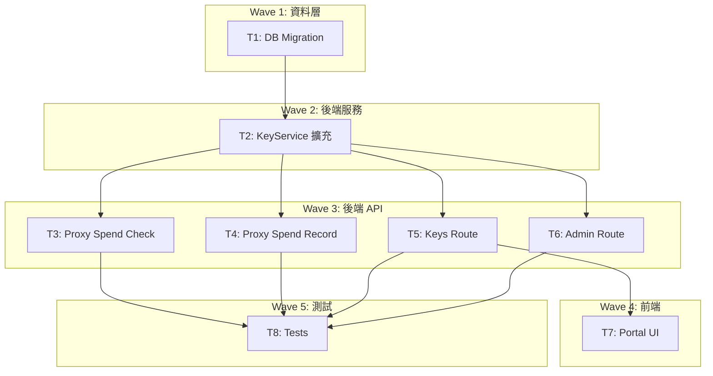

# S3 Implementation Plan: Per-Key Spend Limit

> **階段**: S3 實作計畫
> **建立時間**: 2026-03-15 10:00
> **Agents**: backend-developer, frontend-developer

---

## 1. 概述

### 1.1 功能目標
讓用戶為每個 API Key 設定花費上限（美分），Proxy 自動檢查並記錄花費，超限時拒絕請求。

### 1.2 實作範圍
- **範圍內**: DB migration、KeyService 擴充、Proxy spend check/record、Keys/Admin route 擴充、Portal UI 更新、測試
- **範圍外**: 花費預扣、花費通知、月重置、精確成本追蹤

### 1.3 關聯文件
| 文件 | 路徑 | 狀態 |
|------|------|------|
| Brief Spec | `./s0_brief_spec.md` | completed |
| Dev Spec | `./s1_dev_spec.md` | completed |
| API Spec | `./s1_api_spec.md` | completed |
| Implementation Plan | `./s3_implementation_plan.md` | current |

---

## 2. 實作任務清單

### 2.1 任務總覽

| # | 任務 | 類型 | Agent | 依賴 | 複雜度 | TDD | 狀態 |
|---|------|------|-------|------|--------|-----|------|
| 1 | DB migration: spend 欄位 + SQL functions | 資料層 | `backend-developer` | - | S | N/A | pending |
| 2 | KeyService 擴充 spend 方法 | 後端 | `backend-developer` | #1 | M | planned | pending |
| 3 | Proxy spend check (pre-check) | 後端 | `backend-developer` | #2 | S | planned | pending |
| 4 | Proxy spend record (post-record) | 後端 | `backend-developer` | #2 | M | planned | pending |
| 5 | Keys route 擴充 spend_limit | 後端 | `backend-developer` | #2 | S | planned | pending |
| 6 | Admin route spend 管理端點 | 後端 | `backend-developer` | #2 | M | planned | pending |
| 7 | 前端 ApiKeyCard + CreateModal 花費顯示 | 前端 | `frontend-developer` | #5 | M | N/A | pending |
| 8 | 測試 | 後端 | `backend-developer` | #3,#4,#5,#6 | M | planned | pending |

---

## 3. 任務詳情

### Task #1: DB Migration — spend 欄位 + SQL Functions

**基本資訊**
| 項目 | 內容 |
|------|------|
| 類型 | 資料層 |
| Agent | `backend-developer` |
| 複雜度 | S |
| 依賴 | - |
| 狀態 | pending |

**描述**
建立 `supabase/migrations/009_spend_limit.sql`，在 `api_keys` 表新增 `spend_limit_usd` 和 `spent_usd` 欄位，並建立 `record_spend` 和 `reset_spend` SQL functions。

**受影響檔案**
| 檔案 | 變更類型 | 說明 |
|------|---------|------|
| `supabase/migrations/009_spend_limit.sql` | 新增 | Migration 檔案 |

**DoD（完成定義）**
- [ ] ALTER TABLE api_keys ADD COLUMN spend_limit_usd INTEGER NOT NULL DEFAULT -1
- [ ] ALTER TABLE api_keys ADD COLUMN spent_usd INTEGER NOT NULL DEFAULT 0
- [ ] CREATE FUNCTION record_spend(p_key_id UUID, p_amount_cents INTEGER) — atomic `spent_usd = spent_usd + p_amount_cents`
- [ ] CREATE FUNCTION reset_spend(p_key_id UUID) — `spent_usd = 0`
- [ ] 現有資料不受影響（DEFAULT 值填入）

**TDD Plan**: N/A — 純 DDL migration，由 DB push 驗證

**驗證方式**
```bash
# 在 Supabase 本地環境執行
supabase db push
# 驗證欄位存在
psql -c "SELECT spend_limit_usd, spent_usd FROM api_keys LIMIT 1;"
# 驗證 function 存在
psql -c "SELECT record_spend('00000000-0000-0000-0000-000000000000'::uuid, 100);"
```

**實作備註**
- 參考 `003_quota_functions.sql` 的 reserve_quota/settle_quota 模式
- record_spend 必須是 atomic 操作（`spent_usd = spent_usd + p_amount`），不是 read-then-write
- SQL 範例：

```sql
-- 009_spend_limit.sql
ALTER TABLE api_keys ADD COLUMN spend_limit_usd INTEGER NOT NULL DEFAULT -1;
ALTER TABLE api_keys ADD COLUMN spent_usd INTEGER NOT NULL DEFAULT 0;

CREATE OR REPLACE FUNCTION record_spend(p_key_id UUID, p_amount_cents INTEGER)
RETURNS VOID
LANGUAGE plpgsql
AS $$
BEGIN
  UPDATE api_keys
  SET spent_usd = spent_usd + p_amount_cents
  WHERE id = p_key_id;
END;
$$;

CREATE OR REPLACE FUNCTION reset_spend(p_key_id UUID)
RETURNS VOID
LANGUAGE plpgsql
AS $$
BEGIN
  UPDATE api_keys
  SET spent_usd = 0
  WHERE id = p_key_id;
END;
$$;
```

---

### Task #2: KeyService 擴充 Spend 方法

**基本資訊**
| 項目 | 內容 |
|------|------|
| 類型 | 後端 |
| Agent | `backend-developer` |
| 複雜度 | M |
| 依賴 | Task #1 |
| 狀態 | pending |

**描述**
修改 `KeyService`：`createKey` 接受 `spendLimitUsd` 參數；新增 `recordSpend`、`resetSpend`、`updateSpendLimit` 方法；更新 interface 和 `listKeys` 查詢欄位。

**受影響檔案**
| 檔案 | 變更類型 | 說明 |
|------|---------|------|
| `packages/api-server/src/services/KeyService.ts` | 修改 | 新增 spend 方法、更新 interface |

**DoD**
- [ ] `ApiKeyRecord` interface 新增 `spend_limit_usd: number` + `spent_usd: number`
- [ ] `CreateKeyResult` interface 新增 `spend_limit_usd: number` + `spent_usd: number`
- [ ] `createKey(userId, name, spendLimitUsd?)` — 可選參數，default -1
- [ ] `updateSpendLimit(userId, keyId, spendLimitUsd)` — UPDATE api_keys SET spend_limit_usd
- [ ] `recordSpend(keyId, amountCents)` — 呼叫 record_spend RPC
- [ ] `resetSpend(keyId)` — 呼叫 reset_spend RPC
- [ ] `listKeys` SELECT 含 spend_limit_usd, spent_usd

**TDD Plan**
| 項目 | 內容 |
|------|------|
| 測試檔案 | `packages/api-server/src/services/__tests__/KeyService.test.ts` |
| 測試指令 | `pnpm --filter @apiex/api-server test` |
| 預期測試 | createKey with spend_limit, updateSpendLimit, recordSpend, resetSpend |

**實作備註**
- `updateSpendLimit` 需驗證 key 屬於指定用戶（WHERE user_id = ? AND id = ?）
- `recordSpend` 和 `resetSpend` 不需要 user check（由 caller 負責鑑權），參考 settleQuota 模式

---

### Task #3: Proxy Spend Check (Pre-Check)

**基本資訊**
| 項目 | 內容 |
|------|------|
| 類型 | 後端 |
| Agent | `backend-developer` |
| 複雜度 | S |
| 依賴 | Task #2 |
| 狀態 | pending |

**描述**
在 `proxy.ts` 的 `reserveQuota` 成功後、`resolveRoute` 之前，加入 spend limit 檢查。若超限，退回 reserved quota 並回傳 402。

**受影響檔案**
| 檔案 | 變更類型 | 說明 |
|------|---------|------|
| `packages/api-server/src/routes/proxy.ts` | 修改 | 新增 spend check 邏輯 |
| `packages/api-server/src/lib/errors.ts` | 修改 | 新增 spendLimitExceeded 錯誤 |

**DoD**
- [ ] `errors.ts` 新增 `spendLimitExceeded()` — 402, type=insufficient_quota, code=spend_limit_exceeded
- [ ] proxy.ts 在 reserveQuota 成功後讀取 `c.get('apiKey')` 的 spend_limit_usd 和 spent_usd
- [ ] 若 `spend_limit_usd !== -1 && spent_usd >= spend_limit_usd`，呼叫 settleQuota refund 後回傳 402
- [ ] 不影響 spend_limit_usd === -1 的 key

**TDD Plan**
| 項目 | 內容 |
|------|------|
| 測試檔案 | `packages/api-server/src/routes/__tests__/proxy.test.ts` |
| 測試指令 | `pnpm --filter @apiex/api-server test` |
| 預期測試 | spend_limit_exceeded_returns_402, unlimited_key_passes, under_limit_passes |

**實作備註**
- 插入位置：在 `// Step 4 — reserve quota` 成功之後、`// Step 5 — resolve route` 之前
- 範例：

```typescript
// Step 4.5 — spend limit check
const apiKey = c.get('apiKey') as Record<string, unknown>
const spendLimit = (apiKey.spend_limit_usd as number) ?? -1
const spentUsd = (apiKey.spent_usd as number) ?? 0
if (spendLimit !== -1 && spentUsd >= spendLimit) {
  keyService.settleQuota(apiKeyId, estimatedTokens, 0).catch(...)
  return Errors.spendLimitExceeded()
}
```

---

### Task #4: Proxy Spend Record (Post-Record)

**基本資訊**
| 項目 | 內容 |
|------|------|
| 類型 | 後端 |
| Agent | `backend-developer` |
| 複雜度 | M |
| 依賴 | Task #2 |
| 狀態 | pending |

**描述**
在 `proxy.ts` 的 settleQuota fire-and-forget 區段（non-streaming 和 streaming 兩處），新增成本計算和 `recordSpend` 呼叫。

**受影響檔案**
| 檔案 | 變更類型 | 說明 |
|------|---------|------|
| `packages/api-server/src/routes/proxy.ts` | 修改 | 新增 cost 計算 + recordSpend |

**DoD**
- [ ] import RatesService 並在 proxyRoutes 內實例化
- [ ] Non-streaming 成功路徑：在 settleQuota 之後，查詢 model_rates 並計算 cost，呼叫 recordSpend
- [ ] Streaming 成功路徑：同上（finally 區段）
- [ ] 錯誤路徑（upstream error）：不記錄花費（cost=0）
- [ ] model_rates 查無結果時 cost=0，不 throw
- [ ] 所有操作都是 fire-and-forget（.catch(console.error)）

**TDD Plan**
| 項目 | 內容 |
|------|------|
| 測試檔案 | `packages/api-server/src/routes/__tests__/proxy.test.ts` |
| 測試指令 | `pnpm --filter @apiex/api-server test` |
| 預期測試 | spend_recorded_after_success, spend_not_recorded_on_error, spend_zero_when_no_rate |

**實作備註**
- 費率查詢使用 `RatesService` — 檢查是否已有 `getRateForModel` 或類似方法
- cost 計算公式：`Math.round((promptTokens * inputRate + completionTokens * outputRate) / 1000 * 100)`
- 範例（non-streaming 區段）：

```typescript
// Fire-and-forget: record spend
;(async () => {
  try {
    const rates = await ratesService.getRateForModel(route.tag)
    if (rates) {
      const costCents = Math.round(
        (usage.prompt_tokens * rates.input_rate_per_1k +
         usage.completion_tokens * rates.output_rate_per_1k) / 1000 * 100
      )
      if (costCents > 0) {
        await keyService.recordSpend(apiKeyId, costCents)
      }
    }
  } catch (err) {
    console.error('[proxy] spend record failed:', err)
  }
})()
```

---

### Task #5: Keys Route 擴充 Spend Limit

**基本資訊**
| 項目 | 內容 |
|------|------|
| 類型 | 後端 |
| Agent | `backend-developer` |
| 複雜度 | S |
| 依賴 | Task #2 |
| 狀態 | pending |

**描述**
修改 `keys.ts`：POST 接受 `spend_limit_usd`，新增 PATCH 端點，GET 回傳 spend 資訊。

**受影響檔案**
| 檔案 | 變更類型 | 說明 |
|------|---------|------|
| `packages/api-server/src/routes/keys.ts` | 修改 | 擴充 POST + 新增 PATCH + GET 回傳 spend |

**DoD**
- [ ] POST /keys body 可含 `spend_limit_usd`（可選，default -1），傳給 KeyService.createKey
- [ ] POST /keys 回傳含 `spend_limit_usd` + `spent_usd`
- [ ] 新增 PATCH /keys/:id，接受 `{ spend_limit_usd }` body，呼叫 KeyService.updateSpendLimit
- [ ] PATCH 驗證 `spend_limit_usd >= -1`，否則 400
- [ ] GET /keys 回傳 mapped 結果含 `spend_limit_usd` + `spent_usd`

**TDD Plan**
| 項目 | 內容 |
|------|------|
| 測試檔案 | `packages/api-server/src/routes/__tests__/keys.test.ts` |
| 測試指令 | `pnpm --filter @apiex/api-server test` |
| 預期測試 | create_key_with_spend_limit, patch_spend_limit, list_keys_includes_spend |

**實作備註**
- 參考現有 POST /keys 模式，在 body parse 時取出 spend_limit_usd
- PATCH 端點需要確認 key 屬於當前用戶（KeyService.updateSpendLimit 的 WHERE 條件）

---

### Task #6: Admin Route Spend 管理端點

**基本資訊**
| 項目 | 內容 |
|------|------|
| 類型 | 後端 |
| Agent | `backend-developer` |
| 複雜度 | M |
| 依賴 | Task #2 |
| 狀態 | pending |

**描述**
在 `admin.ts` 新增三個端點：GET 查看 key spend info、PATCH 設定 spend limit、POST 重置 spend counter。

**受影響檔案**
| 檔案 | 變更類型 | 說明 |
|------|---------|------|
| `packages/api-server/src/routes/admin.ts` | 修改 | 新增 3 個 spend 管理端點 |

**DoD**
- [ ] GET /admin/keys/:id/spend — 回傳 id, name, key_prefix, user_id, spend_limit_usd, spent_usd, status
- [ ] PATCH /admin/keys/:id/spend-limit — body: { spend_limit_usd }, 驗證 >= -1
- [ ] POST /admin/keys/:id/reset-spend — 呼叫 KeyService.resetSpend
- [ ] 所有端點：key 不存在 → 404
- [ ] Admin auth 已由 parent middleware 處理

**TDD Plan**
| 項目 | 內容 |
|------|------|
| 測試檔案 | `packages/api-server/src/routes/__tests__/admin.test.ts` |
| 測試指令 | `pnpm --filter @apiex/api-server test` |
| 預期測試 | get_key_spend, set_spend_limit, reset_spend, key_not_found_404 |

**實作備註**
- 直接用 supabaseAdmin 查詢 api_keys（不需要經過 KeyService.validateKey，因為 admin 不需要 key_hash）
- resetSpend 呼叫 KeyService.resetSpend 即可

---

### Task #7: 前端 ApiKeyCard + CreateModal 花費顯示

**基本資訊**
| 項目 | 內容 |
|------|------|
| 類型 | 前端 |
| Agent | `frontend-developer` |
| 複雜度 | M |
| 依賴 | Task #5 |
| 狀態 | pending |

**描述**
更新前端 `ApiKey` type、`ApiKeyCard` 顯示花費狀態、`ApiKeyCreateModal` 支援設定 spend limit。

**受影響檔案**
| 檔案 | 變更類型 | 說明 |
|------|---------|------|
| `packages/web-admin/src/lib/api.ts` | 修改 | ApiKey type 新增 spend 欄位 |
| `packages/web-admin/src/components/ApiKeyCard.tsx` | 修改 | 顯示花費狀態 |
| `packages/web-admin/src/components/ApiKeyCreateModal.tsx` | 修改 | 建立時可設定 spend limit |

**DoD**
- [ ] `ApiKey` interface 新增 `spend_limit_usd: number` + `spent_usd: number`
- [ ] ApiKeyCard 顯示花費：`$X.XX / $Y.YY` 或 `$X.XX / 無限制`
- [ ] 花費比例 > 80% 顯示警告色（amber），>= 100% 顯示紅色
- [ ] ApiKeyCreateModal 新增 spend_limit_usd 輸入（可選，預設空=無限制）
- [ ] 金額顯示：spent_usd / 100 轉為 USD

**TDD Plan**: N/A — 純 UI 變更，由目視驗證

**實作備註**
- ApiKeyCard 現有結構：name + prefix + status badge + created_at。在 status badge 右邊或下方加花費資訊。
- 花費顯示範例：
  - 有限制：`花費 $1.23 / $5.00` (24.6%)
  - 無限制：`花費 $1.23 / 無限制`
  - 超限：`花費 $5.00 / $5.00 (已超限)` 紅色

---

### Task #8: 測試

**基本資訊**
| 項目 | 內容 |
|------|------|
| 類型 | 後端 |
| Agent | `backend-developer` |
| 複雜度 | M |
| 依賴 | Task #3, #4, #5, #6 |
| 狀態 | pending |

**描述**
為 spend limit 功能撰寫完整的單元測試和整合測試，覆蓋所有新增邏輯和邊界情況。

**受影響檔案**
| 檔案 | 變更類型 | 說明 |
|------|---------|------|
| `packages/api-server/src/services/__tests__/KeyService.test.ts` | 修改 | spend 方法測試 |
| `packages/api-server/src/routes/__tests__/proxy.test.ts` | 修改 | spend check/record 測試 |
| `packages/api-server/src/routes/__tests__/keys.test.ts` | 修改 | spend limit CRUD 測試 |
| `packages/api-server/src/routes/__tests__/admin.test.ts` | 修改 | admin spend 端點測試 |

**DoD**
- [ ] KeyService: createKey with spend_limit, recordSpend, resetSpend, updateSpendLimit 測試
- [ ] Proxy: spend_limit_exceeded → 402（含 quota refund 驗證）
- [ ] Proxy: under_limit → 請求通過
- [ ] Proxy: unlimited (-1) → 永不被擋
- [ ] Proxy: cost 正確計算並呼叫 recordSpend
- [ ] Proxy: model_rates 不存在 → cost=0
- [ ] Keys: POST with spend_limit、PATCH spend_limit、GET 回傳 spend
- [ ] Admin: get spend、set limit、reset spend、key not found 404
- [ ] 邊界：spend_limit=0（全擋）、spend_limit=-1（無限）、spend_limit_usd < -1（400 拒絕）

**TDD Plan**
| 項目 | 內容 |
|------|------|
| 測試檔案 | 見上方受影響檔案 |
| 測試指令 | `pnpm --filter @apiex/api-server test` |
| 預期測試 | 約 15-20 個 test cases |

**驗證方式**
```bash
pnpm --filter @apiex/api-server test
```

---

## 4. 依賴關係圖



---

## 5. 執行順序與 Agent 分配

### 5.1 執行波次

| 波次 | 任務 | Agent | 可並行 | 備註 |
|------|------|-------|--------|------|
| Wave 1 | #1 | `backend-developer` | 否 | DB migration 必須先完成 |
| Wave 2 | #2 | `backend-developer` | 否 | KeyService 是後續所有任務的基礎 |
| Wave 3 | #3, #4, #5, #6 | `backend-developer` | 是（4 任務可並行） | 都依賴 T2，互不依賴 |
| Wave 3 | #7 | `frontend-developer` | 是（與 T3/T4/T6 並行） | 只依賴 T5 的 API 契約 |
| Wave 4 | #8 | `backend-developer` | 否 | 所有功能完成後統一測試 |

### 5.2 Agent 調度指令

```
# Wave 1 — 資料層
Task(
  subagent_type: "backend-developer",
  prompt: "實作 Task #1: DB Migration\n建立 supabase/migrations/009_spend_limit.sql\n- ALTER TABLE api_keys ADD spend_limit_usd + spent_usd\n- CREATE FUNCTION record_spend + reset_spend\n參考 003_quota_functions.sql 模式\n\n完整 spec 見 dev/specs/spend-limit/s3_implementation_plan.md Task #1",
  description: "S4-T1 DB Migration: spend_limit"
)

# Wave 2 — KeyService
Task(
  subagent_type: "backend-developer",
  prompt: "實作 Task #2: KeyService 擴充\n修改 packages/api-server/src/services/KeyService.ts\n- 更新 interface 加 spend 欄位\n- createKey 支援 spendLimitUsd 參數\n- 新增 recordSpend, resetSpend, updateSpendLimit 方法\n\n完整 spec 見 dev/specs/spend-limit/s3_implementation_plan.md Task #2",
  description: "S4-T2 KeyService spend methods"
)

# Wave 3 — 並行: Proxy + Routes
Task(
  subagent_type: "backend-developer",
  prompt: "實作 Task #3: Proxy Spend Check\n修改 packages/api-server/src/routes/proxy.ts\n- 在 reserveQuota 成功後加 spend limit check\n- 超限 → settleQuota refund + 402\n新增 errors.ts spendLimitExceeded\n\n完整 spec 見 dev/specs/spend-limit/s3_implementation_plan.md Task #3",
  description: "S4-T3 Proxy spend check"
)

Task(
  subagent_type: "backend-developer",
  prompt: "實作 Task #4: Proxy Spend Record\n修改 packages/api-server/src/routes/proxy.ts\n- 在 settleQuota fire-and-forget 區段加 cost 計算 + recordSpend\n- 使用 RatesService 查詢費率\n- non-streaming + streaming 兩處都加\n\n完整 spec 見 dev/specs/spend-limit/s3_implementation_plan.md Task #4",
  description: "S4-T4 Proxy spend record"
)

Task(
  subagent_type: "backend-developer",
  prompt: "實作 Task #5: Keys Route 擴充\n修改 packages/api-server/src/routes/keys.ts\n- POST 支援 spend_limit_usd 參數\n- 新增 PATCH /keys/:id 修改 spend_limit\n- GET 回傳含 spend 資訊\n\n完整 spec 見 dev/specs/spend-limit/s3_implementation_plan.md Task #5\nAPI 契約見 dev/specs/spend-limit/s1_api_spec.md",
  description: "S4-T5 Keys route spend_limit"
)

Task(
  subagent_type: "backend-developer",
  prompt: "實作 Task #6: Admin Route Spend 管理\n修改 packages/api-server/src/routes/admin.ts\n- GET /admin/keys/:id/spend\n- PATCH /admin/keys/:id/spend-limit\n- POST /admin/keys/:id/reset-spend\n\n完整 spec 見 dev/specs/spend-limit/s3_implementation_plan.md Task #6\nAPI 契約見 dev/specs/spend-limit/s1_api_spec.md",
  description: "S4-T6 Admin spend endpoints"
)

Task(
  subagent_type: "frontend-developer",
  prompt: "實作 Task #7: 前端花費顯示\n修改 packages/web-admin 下的:\n- src/lib/api.ts — ApiKey type 加 spend 欄位\n- src/components/ApiKeyCard.tsx — 顯示花費\n- src/components/ApiKeyCreateModal.tsx — 建立時設定 spend_limit\n\n完整 spec 見 dev/specs/spend-limit/s3_implementation_plan.md Task #7",
  description: "S4-T7 Frontend spend display"
)

# Wave 4 — 測試
Task(
  subagent_type: "backend-developer",
  prompt: "實作 Task #8: 測試\n為 spend limit 功能撰寫完整測試\n覆蓋 KeyService, Proxy check/record, Keys route, Admin route\n\n完整 spec 見 dev/specs/spend-limit/s3_implementation_plan.md Task #8",
  description: "S4-T8 Spend limit tests"
)
```

---

## 6. 驗證計畫

### 6.1 逐任務驗證

| 任務 | 驗證指令 | 預期結果 |
|------|---------|---------|
| #1 | `supabase db push` | Migration 成功 |
| #2 | `pnpm --filter @apiex/api-server test -- KeyService` | Tests passed |
| #3 | `curl` 模擬超限請求 | 402 spend_limit_exceeded |
| #4 | 發送請求後查 DB | spent_usd 增加 |
| #5 | `curl POST/PATCH/GET /keys` | 正確回傳 spend 資訊 |
| #6 | `curl` Admin endpoints | 正確 get/set/reset |
| #7 | 瀏覽器檢查 Portal | UI 顯示花費 |
| #8 | `pnpm --filter @apiex/api-server test` | All tests pass |

### 6.2 整體驗證

```bash
# 後端測試
pnpm --filter @apiex/api-server test

# 前端建置
pnpm --filter @apiex/web-admin build

# 整合測試：建立 key 設定限額 → 發送請求 → 確認花費累加 → 超限被拒
```

---

## 7. 實作進度追蹤

### 7.1 進度總覽

| 指標 | 數值 |
|------|------|
| 總任務數 | 8 |
| 已完成 | 0 |
| 進行中 | 0 |
| 待處理 | 8 |
| 完成率 | 0% |

---

## 9. 風險與問題追蹤

### 9.1 已識別風險

| # | 風險 | 影響 | 緩解措施 | 狀態 |
|---|------|------|---------|------|
| 1 | RatesService 可能沒有 getRateForModel 方法 | 中 | T4 實作時確認，必要時新增 | 監控中 |
| 2 | 並發超額 | 低 | atomic SQL + 最終一致性，同 quota 模式 | 已接受 |
| 3 | Proxy 增加 fire-and-forget 呼叫影響 | 低 | 與現有 settleQuota 同層級，不影響延遲 | 已接受 |

---

## SDD Context

```json
{
  "sdd_context": {
    "stages": {
      "s3": {
        "status": "completed",
        "agent": "architect",
        "output": {
          "implementation_plan_path": "dev/specs/spend-limit/s3_implementation_plan.md",
          "waves": [
            {
              "wave": 1,
              "name": "資料層",
              "tasks": [
                {"id": 1, "name": "DB Migration", "agent": "backend-developer", "dependencies": [], "complexity": "S", "parallel": false}
              ]
            },
            {
              "wave": 2,
              "name": "後端服務",
              "tasks": [
                {"id": 2, "name": "KeyService 擴充", "agent": "backend-developer", "dependencies": [1], "complexity": "M", "parallel": false}
              ]
            },
            {
              "wave": 3,
              "name": "後端 API + 前端",
              "tasks": [
                {"id": 3, "name": "Proxy Spend Check", "agent": "backend-developer", "dependencies": [2], "complexity": "S", "parallel": true},
                {"id": 4, "name": "Proxy Spend Record", "agent": "backend-developer", "dependencies": [2], "complexity": "M", "parallel": true},
                {"id": 5, "name": "Keys Route", "agent": "backend-developer", "dependencies": [2], "complexity": "S", "parallel": true},
                {"id": 6, "name": "Admin Route", "agent": "backend-developer", "dependencies": [2], "complexity": "M", "parallel": true},
                {"id": 7, "name": "Frontend UI", "agent": "frontend-developer", "dependencies": [5], "complexity": "M", "parallel": true}
              ]
            },
            {
              "wave": 4,
              "name": "測試",
              "tasks": [
                {"id": 8, "name": "Tests", "agent": "backend-developer", "dependencies": [3, 4, 5, 6], "complexity": "M", "parallel": false}
              ]
            }
          ],
          "total_tasks": 8,
          "estimated_waves": 4,
          "verification": {
            "static_analysis": ["pnpm lint"],
            "unit_tests": ["pnpm --filter @apiex/api-server test"]
          }
        }
      }
    }
  }
}
```

---

## 附錄

### A. 相關文件
- S0 Brief Spec: `./s0_brief_spec.md`
- S1 Dev Spec: `./s1_dev_spec.md`
- S1 API Spec: `./s1_api_spec.md`

### B. 參考資料
- 現有 quota 機制：`003_quota_functions.sql`、`KeyService.reserveQuota/settleQuota`
- 現有費率表：`008_analytics.sql` model_rates
- 現有 proxy pipeline：`proxy.ts` 第 39-148 行

### C. 專案規範提醒

#### Hono 後端
- 遵守現有 fire-and-forget 模式（.catch(console.error)）
- 錯誤回傳使用 OpenAI 相容格式（errors.ts Errors 工廠）
- RPC 呼叫使用 supabaseAdmin.rpc()
