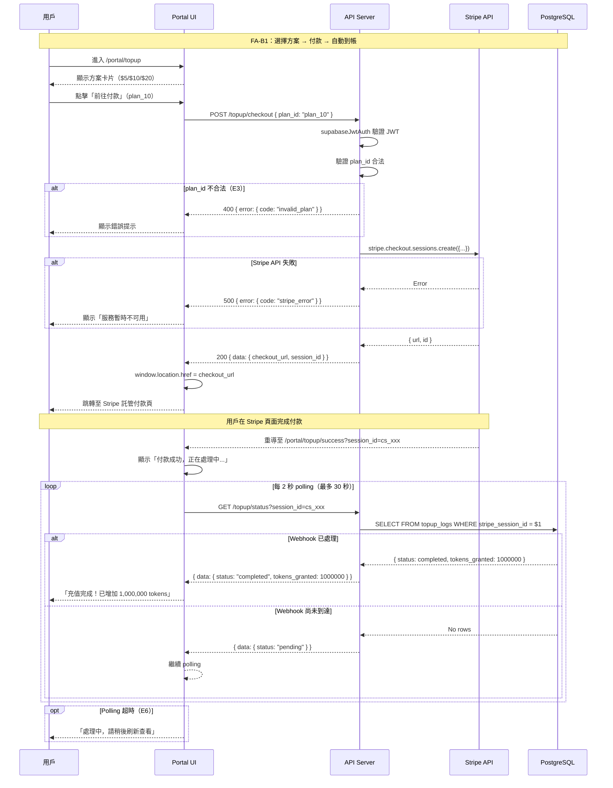
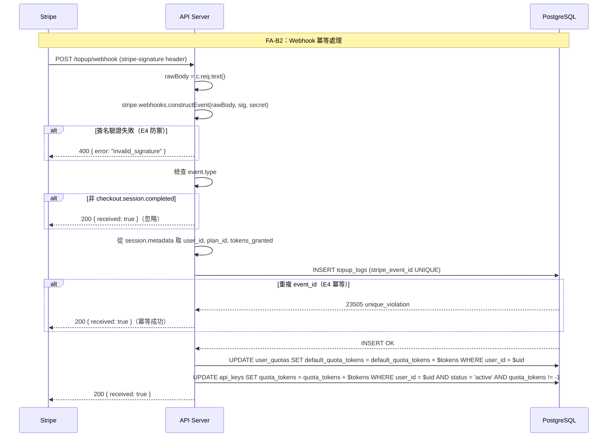

# S1 Dev Spec: Stripe 自助儲值

> **階段**: S1 技術分析
> **建立時間**: 2026-03-15 03:00
> **Agent**: codebase-explorer (Phase 1) + architect (Phase 2)
> **工作類型**: new_feature
> **複雜度**: M

---

## 1. 概述

### 1.1 需求參照
> 完整需求見 `s0_brief_spec.md`，以下僅摘要。

讓 Apiex 平台用戶透過 Stripe Checkout Session 自助儲值，付款成功後系統透過 Webhook 自動累加 quota_tokens，取代 admin 手動設定配額。包含三個功能區：FA-B1 用戶自助儲值、FA-B2 Webhook 處理與帳務、FA-B3 充值記錄檢視。

### 1.2 技術方案摘要

在既有 Hono + Next.js monorepo 架構上擴展。後端新增 `TopupService`（封裝 Stripe API 與 quota 累加邏輯）和 `topup` routes（checkout / webhook / status / logs）。Webhook endpoint 跳過 JWT auth，使用 Stripe 簽名驗證，以 `stripe_event_id` UNIQUE constraint 實現冪等。quota_tokens 累加同時更新 `user_quotas` 和所有 active `api_keys`（與既有 admin PATCH quota 邏輯一致）。前端新增 `/portal/*` 路由組（用戶自助區域）及 admin 充值記錄頁。資料層新增 `topup_logs` 表。

---

## 2. 影響範圍（Phase 1：codebase-explorer）

### 2.1 受影響檔案

#### Backend (Node.js + Hono)
| 檔案 | 變更類型 | 影響 | 說明 |
|------|---------|------|------|
| `packages/api-server/src/services/TopupService.ts` | 新增 | 高 | Stripe API 呼叫、topup_logs 寫入、quota_tokens 累加 |
| `packages/api-server/src/routes/topup.ts` | 新增 | 高 | POST /topup/checkout、POST /topup/webhook、GET /topup/status、GET /topup/logs |
| `packages/api-server/src/routes/admin.ts` | 修改 | 低 | 新增 GET /admin/topup-logs endpoint |
| `packages/api-server/src/index.ts` | 修改 | 低 | 掛載 topup routes（webhook 需獨立掛載，跳過 JWT auth） |
| `packages/api-server/src/lib/stripe.ts` | 新增 | 中 | Stripe client 初始化（singleton） |
| `packages/api-server/src/lib/database.types.ts` | 修改 | 低 | 新增 TopupLog 型別 |
| `packages/api-server/package.json` | 修改 | 低 | 新增 `stripe` npm 依賴 |

#### Frontend (Next.js + shadcn/ui)
| 檔案 | 變更類型 | 影響 | 說明 |
|------|---------|------|------|
| `packages/web-admin/src/app/portal/layout.tsx` | 新增 | 高 | Portal layout，有自己的 navbar |
| `packages/web-admin/src/app/portal/topup/page.tsx` | 新增 | 高 | FA-B1 儲值方案選擇頁 |
| `packages/web-admin/src/app/portal/topup/success/page.tsx` | 新增 | 中 | 付款成功返回頁 + polling |
| `packages/web-admin/src/app/portal/topup/cancel/page.tsx` | 新增 | 低 | 付款取消返回頁 |
| `packages/web-admin/src/app/portal/logs/page.tsx` | 新增 | 中 | 用戶充值記錄頁 |
| `packages/web-admin/src/app/admin/(protected)/topup-logs/page.tsx` | 新增 | 中 | Admin 充值記錄頁 |
| `packages/web-admin/src/components/AppLayout.tsx` | 修改 | 低 | navItems 新增「Topup Logs」 |
| `packages/web-admin/src/lib/api.ts` | 修改 | 低 | 新增 makeTopupApi、TopupLog 型別 |
| `packages/web-admin/src/middleware.ts` | 修改 | 中 | matcher 加入 /portal/:path*，portal 路由保護 |

#### Database (Supabase PostgreSQL)
| 資料表 | 變更類型 | 說明 |
|--------|---------|------|
| `topup_logs` | 新增 | 充值記錄表，stripe_event_id UNIQUE（冪等鍵） |

### 2.2 依賴關係
- **上游依賴**: Stripe API（Checkout Session 建立 + Webhook 驗證）、Supabase Auth（JWT 驗證，重用 `supabaseJwtAuth` middleware）
- **下游影響**: `user_quotas.default_quota_tokens` 累加、`api_keys.quota_tokens` 同步更新
- **可重用**: `supabaseJwtAuth` middleware、`adminAuth` middleware、`supabaseAdmin` client、`Errors` lib、`AppLayout.tsx`、`api.ts` 的 `apiGet`/`apiPost` helpers

### 2.3 現有模式與技術考量

1. **路由模式**：既有 routes 以 function factory 回傳 `Hono` router（如 `adminRoutes()`），新 routes 遵循同樣模式
2. **Service 模式**：`KeyService` 為 class，`TopupService` 建議也用 class（含 Stripe client 注入，方便測試 mock）
3. **Error 模式**：使用 `Errors.xxx()` 回傳 OpenAI 相容格式，topup 相關新增 `Errors.invalidPlan()` 和 `Errors.stripeError()`
4. **前端 API 模式**：使用 `makeXxxApi(token)` factory，新增 `makeTopupApi(token)`
5. **Webhook raw body**：Hono 不會自動 parse JSON body，webhook handler 使用 `c.req.text()` 取得 raw body 即可，無需額外處理

---

## 3. User Flow（Phase 2：architect）

### 3.1 Flow A：用戶自助儲值（FA-B1）



### 3.2 Flow B：Webhook 處理（FA-B2）



### 3.3 異常流程

| S0 ID | 情境 | 觸發條件 | 系統處理 | 用戶看到 |
|-------|------|---------|---------|---------|
| E1 | 連按兩次建立兩筆 Session | 快速點擊 | 前端 button disabled + loading，兩筆 Session 各自獨立 | 第二次點擊無效（按鈕已 disabled） |
| E2 | Session 過期後付款 | 超過 24hr | Stripe 自行拒絕，不產生 Webhook | Stripe 頁面顯示過期 |
| E3 | 金額不合法 | POST invalid plan_id | 400 invalid_plan | 前端 inline error |
| E4 | Webhook 重複送達 | Stripe 重試 | stripe_event_id UNIQUE → 跳過，回 200 | 無影響 |
| E5 | 退款後 quota 回收 | Stripe 退款 | MVP 不處理，scope out | 無影響 |
| E6 | 付款成功但 Webhook 延遲 | 非同步 | 成功頁 polling 30s → 超時提示 | 「處理中，請稍後刷新查看」 |

### 3.4 S0→S1 例外追溯表

| S0 ID | 維度 | S0 描述 | S1 處理位置 | 覆蓋狀態 |
|-------|------|---------|-----------|---------|
| E1 | 並行/競爭 | 連按兩次付款建立兩筆 Session | 前端 button disabled + TopupService 各 Session 獨立處理 | 覆蓋 |
| E2 | 狀態轉換 | Session 過期後付款 | Stripe 自行處理，不需後端介入 | 覆蓋 |
| E3 | 資料邊界 | quota_tokens 累加後超大值 | BIGINT 無溢出風險 | 覆蓋 |
| E4 | 網路/外部 | Webhook 延遲或重試 | stripe_event_id UNIQUE constraint 冪等 | 覆蓋 |
| E5 | 業務邏輯 | 退款後 quota 回收 | MVP scope out，不處理 | N/A（scope out） |
| E6 | UI/體驗 | 付款成功但 Webhook 未到 | 成功頁 polling + 30s 超時提示 | 覆蓋 |

---

## 4. Data Flow

### 4.1 API 契約

> 完整 API 規格（Request/Response/Error Codes）見 [`s1_api_spec.md`](./s1_api_spec.md)。

**Endpoint 摘要**

| Method | Path | Auth | 說明 |
|--------|------|------|------|
| `POST` | `/topup/checkout` | Supabase JWT | 建立 Stripe Checkout Session |
| `POST` | `/topup/webhook` | Stripe Signature | 處理付款完成 Webhook |
| `GET` | `/topup/status` | Supabase JWT | 查詢付款處理狀態（polling） |
| `GET` | `/topup/logs` | Supabase JWT | 用戶充值記錄 |
| `GET` | `/admin/topup-logs` | Admin JWT | 所有充值記錄 |

### 4.2 資料模型

#### topup_logs 表

```sql
CREATE TABLE topup_logs (
  id UUID PRIMARY KEY DEFAULT gen_random_uuid(),
  user_id UUID NOT NULL REFERENCES auth.users(id),
  stripe_session_id TEXT NOT NULL,
  stripe_event_id TEXT NOT NULL,
  amount_usd INTEGER NOT NULL,          -- 美分（500 = $5）
  tokens_granted BIGINT NOT NULL,
  status TEXT NOT NULL DEFAULT 'completed',
  created_at TIMESTAMPTZ NOT NULL DEFAULT now(),
  CONSTRAINT uk_topup_logs_event_id UNIQUE (stripe_event_id)
);

CREATE INDEX idx_topup_logs_user_id ON topup_logs(user_id);
CREATE INDEX idx_topup_logs_session_id ON topup_logs(stripe_session_id);
CREATE INDEX idx_topup_logs_created_at ON topup_logs(created_at);
```

**設計決策**：
- `status` 只有 `completed`（U4 裁決：Webhook 成功才寫入，不記錄 pending/failed）
- `stripe_event_id` UNIQUE 做為冪等鍵
- `amount_usd` 用 INTEGER 儲存美分，避免浮點精度問題
- 不設 `completed_at`（created_at 即為完成時間，因為只有 completed 才會寫入）
- `stripe_session_id` 有 INDEX 但非 UNIQUE（理論上一個 session 只產生一個 event，但不加 UNIQUE 避免邊界問題）

#### RLS Policies

```sql
-- 用戶只能看自己的充值記錄
ALTER TABLE topup_logs ENABLE ROW LEVEL SECURITY;

CREATE POLICY "Users can view own topup logs"
  ON topup_logs FOR SELECT
  USING (auth.uid() = user_id);

-- Service role（supabaseAdmin）可以 INSERT
CREATE POLICY "Service can insert topup logs"
  ON topup_logs FOR INSERT
  WITH CHECK (true);
```

> 注意：後端使用 `supabaseAdmin`（service_role key）操作 topup_logs，RLS 對 service_role 不生效。RLS 主要保護直接透過 Supabase client 存取的場景。

#### TypeScript Types

```typescript
// packages/api-server/src/lib/database.types.ts (新增)
export interface TopupLog {
  id: string
  user_id: string
  stripe_session_id: string
  stripe_event_id: string
  amount_usd: number
  tokens_granted: number
  status: 'completed'
  created_at: string
}

export interface TopupLogInsert {
  user_id: string
  stripe_session_id: string
  stripe_event_id: string
  amount_usd: number
  tokens_granted: number
}
```

#### Stripe Checkout Session Metadata

```typescript
// 傳給 Stripe 的 metadata，Webhook 回來時原樣取回
{
  user_id: string       // Supabase user ID
  plan_id: string       // "plan_5" | "plan_10" | "plan_20"
  tokens_granted: string // "500000" | "1000000" | "2000000"（Stripe metadata 只接受 string）
}
```

### 4.3 quota_tokens 累加流程

```
Webhook 確認付款 →
  1. INSERT topup_logs（冪等，失敗則跳過）
  2. UPDATE user_quotas SET default_quota_tokens = default_quota_tokens + $tokens
     (若 user_quotas 無記錄，先 UPSERT)
  3. UPDATE api_keys SET quota_tokens = quota_tokens + $tokens
     WHERE user_id = $uid AND status = 'active' AND quota_tokens != -1
```

> `quota_tokens = -1` 表示無限制，不累加（保持 -1）。與 admin PATCH quota 行為一致，參見 `packages/api-server/src/routes/admin.ts` 第 73 行。

---

## 5. 任務清單

### 5.1 任務總覽

| ID | 任務 | 類型 | 複雜度 | Agent | 依賴 | Wave |
|----|------|------|--------|-------|------|------|
| T01 | DB Migration: topup_logs 表 | 資料層 | S | backend-developer | - | 1 |
| T02 | 安裝 stripe + 初始化 Stripe client | 後端 | S | backend-developer | - | 1 |
| T03 | TopupService: 核心業務邏輯 | 後端 | L | backend-developer | T01, T02 | 2 |
| T04 | Topup Routes: checkout / webhook / status / logs | 後端 | M | backend-developer | T03 | 2 |
| T05 | Admin Route: GET /admin/topup-logs | 後端 | S | backend-developer | T01 | 2 |
| T06 | index.ts: 掛載 topup routes | 後端 | S | backend-developer | T04 | 2 |
| T07 | Errors lib: 新增 topup 錯誤碼 | 後端 | S | backend-developer | - | 1 |
| T08 | Frontend: Portal layout + middleware | 前端 | M | frontend-developer | - | 3 |
| T09 | Frontend: 儲值方案選擇頁 | 前端 | M | frontend-developer | T08, T04 | 3 |
| T10 | Frontend: 付款成功/取消頁 | 前端 | M | frontend-developer | T08, T04 | 3 |
| T11 | Frontend: 用戶充值記錄頁 | 前端 | S | frontend-developer | T08, T04 | 3 |
| T12 | Frontend: Admin 充值記錄頁 | 前端 | S | frontend-developer | T05 | 3 |
| T13 | Frontend: api.ts 擴充 makeTopupApi | 前端 | S | frontend-developer | - | 3 |
| T14 | 環境變數設定 + 部署文件 | 後端 | S | backend-developer | T06 | 4 |
| T15 | Integration tests | 後端 | M | backend-developer | T04, T05 | 4 |

### 5.2 任務詳情

#### T01: DB Migration - topup_logs 表
- **類型**: 資料層
- **複雜度**: S
- **Agent**: backend-developer
- **描述**: 新增 `supabase/migrations/004_topup_logs.sql`，建立 topup_logs 表 + indexes + RLS policies。Schema 見 4.2 節。
- **DoD**:
  - [ ] topup_logs 表建立成功，含所有欄位和約束
  - [ ] stripe_event_id UNIQUE constraint 存在
  - [ ] user_id, stripe_session_id, created_at 各有 INDEX
  - [ ] RLS policy 正確設定
  - [ ] `supabase db reset` 無錯誤
- **驗收方式**: `supabase migration up` 成功，手動 INSERT 測試 UNIQUE constraint
- **test_file**: N/A（migration 驗證）
- **test_command**: `supabase db reset`

---

#### T02: 安裝 stripe + 初始化 Stripe client
- **類型**: 後端
- **複雜度**: S
- **Agent**: backend-developer
- **描述**: `cd packages/api-server && pnpm add stripe`。新增 `src/lib/stripe.ts` 初始化 Stripe client singleton。更新 `.env.example` 新增 `STRIPE_SECRET_KEY` 和 `STRIPE_WEBHOOK_SECRET`。
- **DoD**:
  - [ ] `stripe` 已加入 api-server 的 dependencies
  - [ ] `src/lib/stripe.ts` 匯出 `stripeClient` singleton
  - [ ] `.env.example` 包含 STRIPE_SECRET_KEY 和 STRIPE_WEBHOOK_SECRET
- **驗收方式**: import 成功，TypeScript 編譯通過
- **test_file**: N/A
- **test_command**: `cd packages/api-server && pnpm tsc --noEmit`

---

#### T03: TopupService - 核心業務邏輯
- **類型**: 後端
- **複雜度**: L
- **Agent**: backend-developer
- **依賴**: T01, T02
- **描述**: 新增 `src/services/TopupService.ts`，封裝以下方法：
  - `createCheckoutSession(userId, planId)`: 驗證 plan → 呼叫 Stripe API → 回傳 { checkout_url, session_id }
  - `handleWebhookEvent(rawBody, signature)`: 簽名驗證 → 解析 event → 冪等寫入 topup_logs → 累加 quota
  - `getTopupStatus(userId, sessionId)`: 查 topup_logs by stripe_session_id
  - `getUserLogs(userId, page, limit)`: 分頁查詢用戶 topup_logs
  - `getAllLogs(filters)`: Admin 用，分頁 + user_id 篩選
  - 私有方法 `addQuota(userId, tokens)`: 累加 user_quotas + api_keys
- **DoD**:
  - [ ] TopupService class 實作完成，所有公開方法可用
  - [ ] plan 驗證邏輯正確（plan_5/plan_10/plan_20）
  - [ ] Stripe Checkout Session 建立含正確 metadata（user_id, plan_id, tokens_granted）
  - [ ] Webhook 簽名驗證使用 raw body
  - [ ] 冪等：stripe_event_id 重複時捕捉 23505 error → 回傳 success
  - [ ] quota 累加邏輯：user_quotas UPSERT + api_keys UPDATE（跳過 quota_tokens=-1 的 key）
  - [ ] 單元測試覆蓋：createCheckoutSession、handleWebhookEvent（含冪等）、getTopupStatus
- **驗收方式**: 單元測試全部通過
- **test_file**: `packages/api-server/src/services/__tests__/TopupService.test.ts`
- **test_command**: `cd packages/api-server && pnpm vitest run src/services/__tests__/TopupService.test.ts`

---

#### T04: Topup Routes - checkout / webhook / status / logs
- **類型**: 後端
- **複雜度**: M
- **Agent**: backend-developer
- **依賴**: T03
- **描述**: 新增 `src/routes/topup.ts`，匯出兩個 factory：
  - `topupRoutes()`: 需 JWT auth 的路由（POST /checkout、GET /status、GET /logs）
  - `topupWebhookRoute()`: 無 auth 的 webhook（POST /webhook）

  路由邏輯薄層，業務邏輯委託 TopupService。
- **DoD**:
  - [ ] POST /topup/checkout: 接收 plan_id → 回傳 checkout_url
  - [ ] POST /topup/webhook: raw body → Stripe 簽名驗證 → 處理 event
  - [ ] GET /topup/status: session_id query param → 回傳 status
  - [ ] GET /topup/logs: 分頁查詢用戶記錄
  - [ ] 所有錯誤使用 Errors.xxx() 格式
  - [ ] webhook handler 使用 `c.req.text()` 取得 raw body
- **驗收方式**: 路由測試通過
- **test_file**: `packages/api-server/src/routes/__tests__/topup.test.ts`
- **test_command**: `cd packages/api-server && pnpm vitest run src/routes/__tests__/topup.test.ts`

---

#### T05: Admin Route - GET /admin/topup-logs
- **類型**: 後端
- **複雜度**: S
- **Agent**: backend-developer
- **依賴**: T01
- **描述**: 在既有 `admin.ts` 新增 `GET /topup-logs` endpoint。支援分頁 + user_id 篩選。回傳含 user_email（需 join auth.users 或 RPC）。
- **DoD**:
  - [ ] GET /admin/topup-logs 回傳分頁 topup_logs
  - [ ] 支援 user_id query param 篩選
  - [ ] 回傳含 user_email 欄位
  - [ ] 遵循既有 admin.ts 的 response 格式（{ data, pagination }）
- **驗收方式**: curl 測試 + 既有 admin test suite 不破壞
- **test_file**: `packages/api-server/src/routes/__tests__/admin.test.ts`（追加）
- **test_command**: `cd packages/api-server && pnpm vitest run src/routes/__tests__/admin.test.ts`

---

#### T06: index.ts - 掛載 topup routes
- **類型**: 後端
- **複雜度**: S
- **Agent**: backend-developer
- **依賴**: T04
- **描述**: 在 `index.ts` 掛載 topup routes。關鍵：webhook 需獨立掛載，不經過 `supabaseJwtAuth`。
  ```typescript
  // JWT protected topup routes
  const topup = new Hono()
  topup.use('*', supabaseJwtAuth)
  topup.route('/', topupRoutes())
  app.route('/topup', topup)

  // Webhook — no auth (Stripe signature verification in handler)
  app.post('/topup/webhook', ...topupWebhookHandler)
  ```
  注意掛載順序：webhook 的 exact path match 須在 topup 的 wildcard match 之前，或獨立掛載避免衝突。
- **DoD**:
  - [ ] /topup/checkout、/topup/status、/topup/logs 經過 supabaseJwtAuth
  - [ ] /topup/webhook 不經過 supabaseJwtAuth
  - [ ] 既有路由不受影響（/v1、/auth、/keys、/admin）
  - [ ] CORS 設定涵蓋新路由
- **驗收方式**: 手動 curl 測試路由可達
- **test_file**: N/A（整合測試覆蓋）
- **test_command**: `cd packages/api-server && pnpm dev`（手動驗證）

---

#### T07: Errors lib - 新增 topup 錯誤碼
- **類型**: 後端
- **複雜度**: S
- **Agent**: backend-developer
- **描述**: 在 `src/lib/errors.ts` 新增：
  - `Errors.invalidPlan()` → 400 `invalid_request_error` / `invalid_plan`
  - `Errors.stripeError()` → 500 `server_error` / `stripe_error`
  - `Errors.invalidSignature()` → 400 `invalid_request_error` / `invalid_signature`
  - `Errors.missingSessionId()` → 400 `invalid_request_error` / `missing_session_id`
- **DoD**:
  - [ ] 四個新 error factory 加入 Errors object
  - [ ] TypeScript 編譯通過
  - [ ] 既有 Errors 不受影響
- **驗收方式**: TypeScript 編譯通過
- **test_file**: N/A
- **test_command**: `cd packages/api-server && pnpm tsc --noEmit`

---

#### T08: Frontend - Portal layout + middleware
- **類型**: 前端
- **複雜度**: M
- **Agent**: frontend-developer
- **描述**:
  1. 新增 `src/app/portal/layout.tsx`：Portal layout，含 navbar（Topup / 充值記錄 / 登出）
  2. 修改 `src/middleware.ts`：
     - matcher 加入 `/portal/:path*`
     - 未登入 redirect 到 `/admin/login`（U2 裁決：共用登入頁）
     - 已登入訪問 `/admin/login` 時，保持原有 redirect 到 `/admin/dashboard`
- **DoD**:
  - [ ] Portal layout 有獨立 navbar，不使用 AppLayout（admin 側）
  - [ ] Portal navbar 含：「儲值」(/portal/topup)、「充值記錄」(/portal/logs)、「登出」
  - [ ] middleware 保護 /portal/:path*，未登入 redirect 到 /admin/login
  - [ ] 既有 /admin/:path* 保護不受影響
- **驗收方式**: 手動驗證 portal 頁面需登入
- **test_file**: N/A（手動測試）
- **test_command**: `cd packages/web-admin && pnpm dev`

---

#### T09: Frontend - 儲值方案選擇頁
- **類型**: 前端
- **複雜度**: M
- **Agent**: frontend-developer
- **依賴**: T08, T04, T13
- **描述**: 新增 `src/app/portal/topup/page.tsx`。顯示三個方案卡片（$5/500K tokens、$10/1M tokens、$20/2M tokens），點擊後呼叫 `POST /topup/checkout`，取得 checkout_url 後 redirect。
- **DoD**:
  - [ ] 三個方案卡片正確顯示金額和 tokens 數量
  - [ ] 點擊按鈕後呼叫 API，成功後 redirect 到 Stripe
  - [ ] 按鈕在 loading 期間 disabled，防止重複點擊（E1）
  - [ ] API 錯誤時顯示 inline error message
- **驗收方式**: 手動測試 Stripe Test Mode 付款流程
- **test_file**: N/A（手動測試）
- **test_command**: `cd packages/web-admin && pnpm dev`

---

#### T10: Frontend - 付款成功/取消頁
- **類型**: 前端
- **複雜度**: M
- **Agent**: frontend-developer
- **依賴**: T08, T04, T13
- **描述**:
  1. `src/app/portal/topup/success/page.tsx`：從 URL query 取 session_id，每 2 秒 polling `GET /topup/status`。completed → 顯示成功；30 秒超時 → 顯示「處理中，請稍後刷新」（E6）。
  2. `src/app/portal/topup/cancel/page.tsx`：靜態頁面，顯示「付款已取消」+ Link 返回儲值頁。
- **DoD**:
  - [ ] 成功頁正確從 URL 取 session_id
  - [ ] polling 每 2 秒一次，completed 時停止並顯示成功
  - [ ] 30 秒超時顯示友善提示
  - [ ] 取消頁有返回儲值頁的連結
  - [ ] polling 在 component unmount 時清除 interval
- **驗收方式**: 手動測試完整付款流程
- **test_file**: N/A（手動測試）
- **test_command**: `cd packages/web-admin && pnpm dev`

---

#### T11: Frontend - 用戶充值記錄頁
- **類型**: 前端
- **複雜度**: S
- **Agent**: frontend-developer
- **依賴**: T08, T04, T13
- **描述**: `src/app/portal/logs/page.tsx`。呼叫 `GET /topup/logs` 顯示表格（日期、金額、tokens、狀態）。支援分頁。
- **DoD**:
  - [ ] 表格正確顯示所有欄位
  - [ ] 金額顯示為美元格式（$5.00 而非 500 cents）
  - [ ] 分頁 UI 正常運作
  - [ ] 空狀態顯示「尚無充值記錄」
- **驗收方式**: 手動測試
- **test_file**: N/A
- **test_command**: `cd packages/web-admin && pnpm dev`

---

#### T12: Frontend - Admin 充值記錄頁
- **類型**: 前端
- **複雜度**: S
- **Agent**: frontend-developer
- **依賴**: T05, T13
- **描述**:
  1. `src/app/admin/(protected)/topup-logs/page.tsx`：呼叫 `GET /admin/topup-logs` 顯示所有用戶充值記錄。含 user_email 顯示。
  2. 修改 `AppLayout.tsx` 的 navItems，新增 `{ href: '/admin/topup-logs', label: 'Topup Logs' }`。
- **DoD**:
  - [ ] Admin sidebar 顯示「Topup Logs」導航
  - [ ] 表格顯示 user_email、金額、tokens、日期
  - [ ] 分頁 UI 正常運作
- **驗收方式**: 手動測試
- **test_file**: N/A
- **test_command**: `cd packages/web-admin && pnpm dev`

---

#### T13: Frontend - api.ts 擴充 makeTopupApi
- **類型**: 前端
- **複雜度**: S
- **Agent**: frontend-developer
- **描述**: 在 `src/lib/api.ts` 新增：
  - `TopupLog` interface
  - `TopupStatusResponse` interface
  - `CheckoutResponse` interface
  - `makeTopupApi(token)` factory（checkout, getStatus, getLogs）
  - `makeAdminApi` 追加 `getTopupLogs` 方法
- **DoD**:
  - [ ] 所有新增 types 和 API methods 正確定義
  - [ ] TypeScript 編譯通過
  - [ ] 既有 makeAdminApi / makeKeysApi 不受影響
- **驗收方式**: TypeScript 編譯通過
- **test_file**: N/A
- **test_command**: `cd packages/web-admin && pnpm tsc --noEmit`

---

#### T14: 環境變數設定 + 部署文件
- **類型**: 後端
- **複雜度**: S
- **Agent**: backend-developer
- **依賴**: T06
- **描述**:
  1. 更新 `packages/api-server/.env.example`
  2. 更新部署文件，說明 Fly.io secrets 設定（STRIPE_SECRET_KEY, STRIPE_WEBHOOK_SECRET）
  3. 說明本地開發需使用 `stripe listen --forward-to localhost:3000/topup/webhook` 轉發 Webhook
- **DoD**:
  - [ ] .env.example 含所有新 env vars + 註解
  - [ ] 部署說明文件更新
- **驗收方式**: 文件完整
- **test_file**: N/A
- **test_command**: N/A

---

#### T15: Integration Tests
- **類型**: 後端
- **複雜度**: M
- **Agent**: backend-developer
- **依賴**: T04, T05
- **描述**: 撰寫整合測試，mock Stripe API：
  1. 完整 checkout → webhook → status polling → logs 查詢流程
  2. webhook 冪等（重複 event_id）
  3. webhook 簽名驗證失敗
  4. invalid plan_id
  5. admin topup-logs 查詢
- **DoD**:
  - [ ] 5 個以上整合測試案例
  - [ ] Stripe API mock 正確（不真實呼叫 Stripe）
  - [ ] 所有測試通過
- **驗收方式**: `vitest run` 全部 pass
- **test_file**: `packages/api-server/src/__tests__/topup.integration.test.ts`
- **test_command**: `cd packages/api-server && pnpm vitest run src/__tests__/topup.integration.test.ts`

---

## 6. 技術決策

### 6.1 Unknowns 裁決

| ID | 問題 | 裁決 | 理由 |
|----|------|------|------|
| U1 | quota_tokens 累加對象 | 兩者都更新（user_quotas + 所有 active api_keys） | 與 admin PATCH /admin/users/:id/quota 行為一致（見 admin.ts L56-78），避免用戶 quota 與 key quota 不同步 |
| U2 | Portal 登入頁 | 共用 /admin/login，middleware 保護 /portal/* | 避免重複登入 UI，Supabase Auth 只有一套 session，登入後兩邊都能用 |
| U3 | 成功頁 polling endpoint | GET /topup/status?session_id={id}（專用 endpoint） | 語意清晰，不污染 /topup/logs 的分頁語意；查 topup_logs.stripe_session_id 即可 |
| U4 | topup_logs.status | 只有 completed | Webhook 只在 checkout.session.completed 時寫入，不需要 pending/failed 狀態。status polling 查無記錄 = pending |

### 6.2 架構決策

| 決策點 | 選項 | 選擇 | 理由 |
|--------|------|------|------|
| Webhook 掛載方式 | A: 獨立路徑 app.post() / B: 同 router 但 skip middleware | A | 最簡單明確，避免 middleware 跳過邏輯的複雜度 |
| TopupService 風格 | A: Class / B: 純函式 | A | 與 KeyService 一致（class with methods），可注入 Stripe client 方便測試 mock |
| 方案定義 | A: DB config / B: 程式碼 hardcode | B | MVP 只有三個固定方案，hardcode 在 TopupService 的 `PLANS` 常數即可，未來需要動態方案再遷移到 DB |
| Portal layout | A: 共用 AppLayout / B: 獨立 layout | B | Portal 是用戶視角，不需要 admin sidebar，獨立 layout 更清晰 |

### 6.3 相容性考量
- **向後相容**: 新功能，不影響既有 API 和頁面
- **Migration**: 只新增 table，不修改既有 schema，可安全 migrate

---

## 7. 驗收標準

### 7.1 功能驗收

| ID | 場景 | Given | When | Then | 優先級 |
|----|------|-------|------|------|--------|
| AC-1 | 建立 Checkout Session | 已登入用戶 | POST /topup/checkout { plan_id: "plan_10" } | 回傳 200 含 checkout_url 和 session_id | P0 |
| AC-2 | 無效方案 | 已登入用戶 | POST /topup/checkout { plan_id: "plan_999" } | 回傳 400 invalid_plan | P0 |
| AC-3 | Webhook 處理成功 | Stripe 發送 checkout.session.completed | POST /topup/webhook 含正確簽名 | topup_logs 寫入一筆，user_quotas 和 api_keys quota_tokens 累加 | P0 |
| AC-4 | Webhook 冪等 | 同一 event_id 已處理 | POST /topup/webhook 重複送達 | 回傳 200，quota 不重複累加 | P0 |
| AC-5 | Webhook 簽名驗證 | 無效簽名 | POST /topup/webhook 含錯誤簽名 | 回傳 400 invalid_signature | P0 |
| AC-6 | Status polling - completed | Webhook 已處理完成 | GET /topup/status?session_id=cs_xxx | 回傳 { status: "completed", tokens_granted: N } | P0 |
| AC-7 | Status polling - pending | Webhook 尚未到達 | GET /topup/status?session_id=cs_xxx | 回傳 { status: "pending" } | P1 |
| AC-8 | 用戶查看充值記錄 | 用戶有充值記錄 | GET /topup/logs | 回傳該用戶的 topup_logs 列表 | P1 |
| AC-9 | Admin 查看充值記錄 | 系統有充值記錄 | GET /admin/topup-logs | 回傳所有用戶的 topup_logs，含 user_email | P1 |
| AC-10 | 前端儲值流程 | 用戶登入 Portal | 選擇 $10 方案 → 完成 Stripe 付款 → 返回成功頁 | 成功頁 polling 顯示「充值完成」 | P0 |
| AC-11 | 前端 polling 超時 | Webhook 延遲超過 30s | 成功頁 polling 30 秒 | 顯示「處理中，請稍後刷新查看」 | P1 |

### 7.2 非功能驗收

| 項目 | 標準 |
|------|------|
| 安全 | Webhook 必須通過 Stripe 簽名驗證，無法偽造 |
| 冪等 | 重複 Webhook 不會導致 quota 重複累加 |
| 資料一致性 | quota_tokens 累加後 user_quotas 和 api_keys 數值一致 |

### 7.3 測試計畫
- **單元測試**: TopupService（createCheckoutSession, handleWebhookEvent, getTopupStatus）
- **整合測試**: 完整 checkout→webhook→status 流程、冪等驗證、錯誤處理
- **手動測試**: Stripe Test Mode 完整付款流程（前端 E2E）

---

## 8. 風險與緩解

| ID | 風險 | 影響 | 機率 | 緩解措施 | 負責 |
|----|------|------|------|---------|------|
| R1 | Webhook raw body 解析 | 高（簽名驗證永遠失敗） | 低 | Hono 不自動 parse JSON，使用 `c.req.text()` 取 raw body；整合測試覆蓋 | backend-developer |
| R2 | quota_tokens race condition | 中（重複累加） | 低 | stripe_event_id UNIQUE constraint + 23505 error 捕捉 | backend-developer |
| R3 | quota_tokens 累加對象不明確 | 中（數值不一致） | 已解決 | U1 裁決：兩者都更新，與 admin PATCH 一致 | backend-developer |
| R4 | Portal 認證方式 | 中（未保護頁面） | 已解決 | U2 裁決：共用 /admin/login，middleware 擴展保護 /portal/* | frontend-developer |
| R5 | Stripe env vars 管理 | 低 | 低 | .env.example + 部署文件說明 | backend-developer |

### 回歸風險
- `admin.ts` 新增 topup-logs endpoint：需確認不影響既有 /admin/users 和 /admin/usage-logs
- `index.ts` 掛載新路由：CORS 設定已是 wildcard（dev mode），影響低
- `middleware.ts` 修改 matcher：需確認不影響既有 /admin/:path* 保護

---

## SDD Context

```json
{
  "sdd_context": {
    "stages": {
      "s1": {
        "status": "completed",
        "agents": ["codebase-explorer", "architect"],
        "output": {
          "completed_phases": [1, 2],
          "dev_spec_path": "dev/specs/stripe-topup/s1_dev_spec.md",
          "api_spec_path": "dev/specs/stripe-topup/s1_api_spec.md",
          "tasks": ["T01", "T02", "T03", "T04", "T05", "T06", "T07", "T08", "T09", "T10", "T11", "T12", "T13", "T14", "T15"],
          "acceptance_criteria": ["AC-1", "AC-2", "AC-3", "AC-4", "AC-5", "AC-6", "AC-7", "AC-8", "AC-9", "AC-10", "AC-11"],
          "solution_summary": "後端新增 TopupService + topup routes 整合 Stripe Checkout Session，Webhook 冪等處理，quota_tokens 同步累加 user_quotas 和 api_keys。前端新增 Portal 路由組含儲值頁、成功/取消頁、記錄頁。Admin UI 新增充值記錄頁。"
        }
      }
    }
  }
}
```
