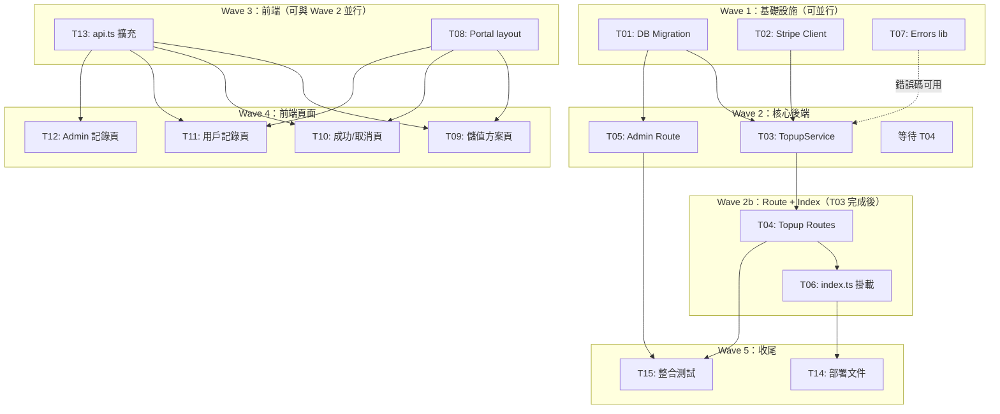

# S3 Implementation Plan: Stripe 自助儲值

> **階段**: S3 實作計畫
> **建立時間**: 2026-03-15 03:15
> **Agents**: backend-developer, frontend-developer

---

## 1. 概述

### 1.1 功能目標

讓 Apiex 平台用戶透過 Stripe Checkout Session 自助儲值，付款成功後系統透過 Webhook 自動累加 quota_tokens，取代 admin 手動設定配額。建立完整的預付儲值閉環：選擇方案 → 付款 → 自動到帳 → 可查記錄。

### 1.2 實作範圍

- **範圍內**:
  - FA-B1: 儲值方案選擇 UI（固定 $5/$10/$20）
  - FA-B1: Stripe Checkout Session 建立 API
  - FA-B1: 成功/取消返回頁面 + polling 機制
  - FA-B2: Stripe Webhook endpoint（簽名驗證 + 冪等處理）
  - FA-B2: quota_tokens 自動累加
  - FA-B2: topup_logs 記錄寫入
  - FA-B3: 用戶充值記錄 API + 頁面
  - FA-B3: Admin 充值記錄 API + 頁面
- **範圍外**:
  - 自動計費扣款（後付制）
  - 退款流程
  - 訂閱制方案
  - 多幣種支援
  - 自由輸入金額
  - 客製化發票
  - per-key 儲值
  - Stripe Payment Intents / Elements 內嵌表單

### 1.3 關聯文件

| 文件 | 路徑 | 狀態 |
|------|------|------|
| Brief Spec | `./s0_brief_spec.md` | ✅ |
| Dev Spec | `./s1_dev_spec.md` | ✅ |
| API Spec | `./s1_api_spec.md` | ✅ |
| Implementation Plan | `./s3_implementation_plan.md` | 📝 當前 |

---

## 2. 實作任務清單

### 2.1 任務總覽

| # | 任務 | 類型 | Agent | 依賴 | 複雜度 | source_ref | TDD | 狀態 |
|---|------|------|-------|------|--------|------------|-----|------|
| T01 | DB Migration: topup_logs 表 | 資料層 | `backend-developer` | - | S | §5.2 T01 | ⛔ | ⬜ |
| T02 | 安裝 stripe + 初始化 Stripe client | 後端 | `backend-developer` | - | S | §5.2 T02 | ⛔ | ⬜ |
| T07 | Errors lib: 新增 topup 錯誤碼 | 後端 | `backend-developer` | - | S | §5.2 T07 | ⛔ | ⬜ |
| T03 | TopupService: 核心業務邏輯 | 後端 | `backend-developer` | T01, T02 | L | §5.2 T03 | ✅ | ⬜ |
| T04 | Topup Routes: checkout / webhook / status / logs | 後端 | `backend-developer` | T03 | M | §5.2 T04 | ✅ | ⬜ |
| T05 | Admin Route: GET /admin/topup-logs | 後端 | `backend-developer` | T01 | S | §5.2 T05 | ✅ | ⬜ |
| T06 | index.ts: 掛載 topup routes | 後端 | `backend-developer` | T04 | S | §5.2 T06 | ⛔ | ⬜ |
| T13 | Frontend: api.ts 擴充 makeTopupApi | 前端 | `frontend-developer` | - | S | §5.2 T13 | ⛔ | ⬜ |
| T08 | Frontend: Portal layout + middleware | 前端 | `frontend-developer` | - | M | §5.2 T08 | ⛔ | ⬜ |
| T09 | Frontend: 儲值方案選擇頁 | 前端 | `frontend-developer` | T08, T13 | M | §5.2 T09 | ⛔ | ⬜ |
| T10 | Frontend: 付款成功/取消頁 | 前端 | `frontend-developer` | T08, T13 | M | §5.2 T10 | ⛔ | ⬜ |
| T11 | Frontend: 用戶充值記錄頁 | 前端 | `frontend-developer` | T08, T13 | S | §5.2 T11 | ⛔ | ⬜ |
| T12 | Frontend: Admin 充值記錄頁 | 前端 | `frontend-developer` | T13 | S | §5.2 T12 | ⛔ | ⬜ |
| T14 | 環境變數設定 + 部署文件 | 後端 | `backend-developer` | T06 | S | §5.2 T14 | ⛔ | ⬜ |
| T15 | Integration Tests | 後端 | `backend-developer` | T04, T05 | M | §5.2 T15 | ✅ | ⬜ |

**狀態圖例**：
- ⬜ pending（待處理）
- 🔄 in_progress（進行中）
- ✅ completed（已完成）
- ❌ blocked（被阻擋）
- ⏭️ skipped（跳過）

**複雜度**：
- S（小，<30min）
- M（中，30min-2hr）
- L（大，>2hr）

**TDD**: ✅ = has tdd_plan, ⛔ = N/A (skip_justification required)

---

## 3. 任務詳情

### Task T01: DB Migration - topup_logs 表

**基本資訊**
| 項目 | 內容 |
|------|------|
| 類型 | 資料層 |
| Agent | `backend-developer` |
| 複雜度 | S |
| 依賴 | - |
| source_ref | §5.2 T01 |
| 狀態 | ⬜ pending |

**描述**

新增 `supabase/migrations/004_topup_logs.sql`，建立 topup_logs 表、indexes 和 RLS policies。Schema 詳見 dev_spec §4.2。

**輸入**
- 無前置依賴
- Schema 規格：dev_spec §4.2

**輸出**
- `supabase/migrations/004_topup_logs.sql`（含建表、indexes、RLS）

**受影響檔案**
| 檔案 | 變更類型 | 說明 |
|------|---------|------|
| `supabase/migrations/004_topup_logs.sql` | 新增 | topup_logs 表 + indexes + RLS policies |

**DoD（完成定義）**
- [ ] topup_logs 表建立成功，含所有欄位和約束
- [ ] stripe_event_id UNIQUE constraint（uk_topup_logs_event_id）存在
- [ ] user_id、stripe_session_id、created_at 各有 INDEX
- [ ] RLS policy 正確設定（用戶只讀自己的記錄）
- [ ] `supabase db reset` 無錯誤

**TDD Plan**: N/A — Migration 為 DDL 變更，無可測試的業務邏輯；以 `supabase db reset` 驗證語法正確性，手動 INSERT 測試 UNIQUE constraint。

**驗證方式**
```bash
supabase db reset
# 手動驗證 UNIQUE constraint
psql $DATABASE_URL -c "INSERT INTO topup_logs (stripe_event_id, ...) VALUES ('evt_dup', ...);"
psql $DATABASE_URL -c "INSERT INTO topup_logs (stripe_event_id, ...) VALUES ('evt_dup', ...);"
# 預期第二筆 INSERT 回傳 23505 unique_violation
```

**實作備註**
- `amount_usd` 用 INTEGER 儲存美分（500 = $5），避免浮點精度問題
- `stripe_session_id` 有 INDEX 但非 UNIQUE（避免邊界問題，見 dev_spec §4.2）
- status 欄位 DEFAULT 'completed'，MVP 只有此狀態

---

### Task T02: 安裝 stripe + 初始化 Stripe client

**基本資訊**
| 項目 | 內容 |
|------|------|
| 類型 | 後端 |
| Agent | `backend-developer` |
| 複雜度 | S |
| 依賴 | - |
| source_ref | §5.2 T02 |
| 狀態 | ⬜ pending |

**描述**

在 api-server 安裝 stripe npm package，新增 `src/lib/stripe.ts` 初始化 Stripe client singleton，更新 `.env.example`。

**輸入**
- 無前置依賴

**輸出**
- `packages/api-server/src/lib/stripe.ts`（stripeClient singleton）
- 更新 `packages/api-server/package.json`（stripe 依賴）
- 更新 `packages/api-server/.env.example`

**受影響檔案**
| 檔案 | 變更類型 | 說明 |
|------|---------|------|
| `packages/api-server/src/lib/stripe.ts` | 新增 | Stripe client singleton |
| `packages/api-server/package.json` | 修改 | 新增 stripe 依賴 |
| `packages/api-server/.env.example` | 修改 | 新增 STRIPE_SECRET_KEY, STRIPE_WEBHOOK_SECRET |

**DoD（完成定義）**
- [ ] `stripe` 已加入 api-server 的 dependencies
- [ ] `src/lib/stripe.ts` 匯出 `stripeClient` singleton
- [ ] `.env.example` 包含 STRIPE_SECRET_KEY 和 STRIPE_WEBHOOK_SECRET（含說明註解）

**TDD Plan**: N/A — 純套件安裝與初始化設定，無業務邏輯；TypeScript 編譯通過即驗證完成。

**驗證方式**
```bash
cd packages/api-server && pnpm tsc --noEmit
```

**實作備註**
- 使用 `new Stripe(process.env.STRIPE_SECRET_KEY!, { apiVersion: '2024-06-20' })` 初始化
- 若 STRIPE_SECRET_KEY 未設定，應在啟動時 throw error（fail fast）

---

### Task T07: Errors lib - 新增 topup 錯誤碼

**基本資訊**
| 項目 | 內容 |
|------|------|
| 類型 | 後端 |
| Agent | `backend-developer` |
| 複雜度 | S |
| 依賴 | - |
| source_ref | §5.2 T07 |
| 狀態 | ⬜ pending |

**描述**

在既有 `src/lib/errors.ts` 新增四個 topup 相關錯誤 factory，遵循現有 `Errors` object 模式。

**輸入**
- 既有 `src/lib/errors.ts` 的 Errors 模式

**輸出**
- 更新 `packages/api-server/src/lib/errors.ts`

**受影響檔案**
| 檔案 | 變更類型 | 說明 |
|------|---------|------|
| `packages/api-server/src/lib/errors.ts` | 修改 | 新增四個 topup 錯誤碼 |

**DoD（完成定義）**
- [ ] `Errors.invalidPlan()` → 400 `invalid_request_error` / `invalid_plan`
- [ ] `Errors.stripeError()` → 500 `server_error` / `stripe_error`
- [ ] `Errors.invalidSignature()` → 400 `invalid_request_error` / `invalid_signature`
- [ ] `Errors.missingSessionId()` → 400 `invalid_request_error` / `missing_session_id`
- [ ] TypeScript 編譯通過
- [ ] 既有 Errors 不受影響

**TDD Plan**: N/A — 純設定 object 擴充，無條件邏輯；TypeScript 編譯確保型別正確。

**驗證方式**
```bash
cd packages/api-server && pnpm tsc --noEmit
```

---

### Task T03: TopupService - 核心業務邏輯

**基本資訊**
| 項目 | 內容 |
|------|------|
| 類型 | 後端 |
| Agent | `backend-developer` |
| 複雜度 | L |
| 依賴 | T01, T02 |
| source_ref | §5.2 T03 |
| 狀態 | ⬜ pending |

**描述**

新增 `src/services/TopupService.ts`，封裝所有 Stripe 互動與 quota 累加邏輯。包含六個方法：createCheckoutSession、handleWebhookEvent、getTopupStatus、getUserLogs、getAllLogs、私有 addQuota。

**輸入**
- T01: topup_logs 表存在（supabaseAdmin 可操作）
- T02: stripeClient singleton 可 import
- T07: Errors.invalidPlan() / Errors.stripeError() 可用

**輸出**
- `packages/api-server/src/services/TopupService.ts`
- `packages/api-server/src/services/__tests__/TopupService.test.ts`

**受影響檔案**
| 檔案 | 變更類型 | 說明 |
|------|---------|------|
| `packages/api-server/src/services/TopupService.ts` | 新增 | TopupService class |
| `packages/api-server/src/services/__tests__/TopupService.test.ts` | 新增 | 單元測試 |
| `packages/api-server/src/lib/database.types.ts` | 修改 | 新增 TopupLog / TopupLogInsert interface |

**DoD（完成定義）**
- [ ] TopupService class 實作完成，所有公開方法可用
- [ ] plan 驗證邏輯正確（plan_5/plan_10/plan_20），hardcode 在 PLANS 常數
- [ ] Stripe Checkout Session 建立含正確 metadata（user_id, plan_id, tokens_granted）
- [ ] Webhook 簽名驗證使用 raw body（由 route 層傳入）
- [ ] 冪等：stripe_event_id 重複時捕捉 23505 error → 回傳 success（不 throw）
- [ ] quota 累加邏輯：user_quotas UPSERT + api_keys UPDATE（跳過 quota_tokens=-1）
- [ ] 單元測試覆蓋 createCheckoutSession（成功/invalid plan）、handleWebhookEvent（成功/冪等/簽名失敗）、getTopupStatus（found/pending）

**TDD Plan**
| 項目 | 內容 |
|------|------|
| 測試檔案 | `packages/api-server/src/services/__tests__/TopupService.test.ts` |
| 測試指令 | `cd packages/api-server && pnpm vitest run src/services/__tests__/TopupService.test.ts` |
| 預期測試案例 | createCheckoutSession_success, createCheckoutSession_invalidPlan, handleWebhookEvent_success, handleWebhookEvent_idempotent, handleWebhookEvent_invalidSignature, getTopupStatus_completed, getTopupStatus_pending |

**驗證方式**
```bash
cd packages/api-server && pnpm vitest run src/services/__tests__/TopupService.test.ts
```

**實作備註**
- 方案定義：`PLANS = { plan_5: { amount_usd: 500, tokens: 500000 }, plan_10: { amount_usd: 1000, tokens: 1000000 }, plan_20: { amount_usd: 2000, tokens: 2000000 } }`
- Stripe Checkout session success_url / cancel_url 從環境變數取（`NEXT_PUBLIC_APP_URL`）
- `addQuota` 私有方法：先 UPSERT user_quotas（ON CONFLICT user_id DO UPDATE），再 UPDATE api_keys WHERE quota_tokens != -1
- 捕捉 PostgreSQL error code 23505 做冪等判斷，其他 DB error 正常 throw

---

### Task T04: Topup Routes - checkout / webhook / status / logs

**基本資訊**
| 項目 | 內容 |
|------|------|
| 類型 | 後端 |
| Agent | `backend-developer` |
| 複雜度 | M |
| 依賴 | T03 |
| source_ref | §5.2 T04 |
| 狀態 | ⬜ pending |

**描述**

新增 `src/routes/topup.ts`，匯出兩個 factory：`topupRoutes()`（需 JWT auth）與 `topupWebhookRoute()`（無 auth）。路由層薄，業務邏輯委託 TopupService。

**輸入**
- T03: TopupService 所有方法可用

**輸出**
- `packages/api-server/src/routes/topup.ts`
- `packages/api-server/src/routes/__tests__/topup.test.ts`

**受影響檔案**
| 檔案 | 變更類型 | 說明 |
|------|---------|------|
| `packages/api-server/src/routes/topup.ts` | 新增 | topup route factories |
| `packages/api-server/src/routes/__tests__/topup.test.ts` | 新增 | 路由測試 |

**DoD（完成定義）**
- [ ] POST /topup/checkout: 接收 plan_id → 回傳 `{ data: { checkout_url, session_id } }`
- [ ] POST /topup/webhook: 使用 `c.req.text()` 取 raw body → 傳給 TopupService.handleWebhookEvent
- [ ] GET /topup/status: session_id query param → 回傳 `{ data: { status, tokens_granted? } }`
- [ ] GET /topup/logs: 支援 page/limit query param → 回傳分頁記錄
- [ ] 所有錯誤使用 Errors.xxx() 格式
- [ ] 路由測試通過

**TDD Plan**
| 項目 | 內容 |
|------|------|
| 測試檔案 | `packages/api-server/src/routes/__tests__/topup.test.ts` |
| 測試指令 | `cd packages/api-server && pnpm vitest run src/routes/__tests__/topup.test.ts` |
| 預期測試案例 | POST_checkout_success, POST_checkout_invalidPlan, POST_webhook_success, POST_webhook_invalidSignature, GET_status_completed, GET_status_pending, GET_logs_success |

**驗證方式**
```bash
cd packages/api-server && pnpm vitest run src/routes/__tests__/topup.test.ts
```

**實作備註**
- `topupWebhookRoute()` 回傳單一 handler，不是完整 Hono router（供 index.ts 的 `app.post()` 直接使用）
- `topupRoutes()` 遵循既有 function factory 模式，回傳 `Hono` router

---

### Task T05: Admin Route - GET /admin/topup-logs

**基本資訊**
| 項目 | 內容 |
|------|------|
| 類型 | 後端 |
| Agent | `backend-developer` |
| 複雜度 | S |
| 依賴 | T01 |
| source_ref | §5.2 T05 |
| 狀態 | ⬜ pending |

**描述**

在既有 `admin.ts` 新增 `GET /topup-logs` endpoint。支援分頁 + user_id 篩選，回傳含 user_email（需 JOIN 或 RPC）。

**輸入**
- T01: topup_logs 表存在

**輸出**
- 更新 `packages/api-server/src/routes/admin.ts`（追加 endpoint）
- 更新 `packages/api-server/src/routes/__tests__/admin.test.ts`（追加測試）

**受影響檔案**
| 檔案 | 變更類型 | 說明 |
|------|---------|------|
| `packages/api-server/src/routes/admin.ts` | 修改 | 新增 GET /topup-logs endpoint |
| `packages/api-server/src/routes/__tests__/admin.test.ts` | 修改 | 追加測試案例 |

**DoD（完成定義）**
- [ ] GET /admin/topup-logs 回傳分頁 topup_logs
- [ ] 支援 user_id query param 篩選
- [ ] 回傳含 user_email 欄位（使用 supabaseAdmin 查詢 auth.users）
- [ ] 遵循既有 admin.ts 的 response 格式 `{ data, pagination }`
- [ ] 既有 admin test suite 不破壞

**TDD Plan**
| 項目 | 內容 |
|------|------|
| 測試檔案 | `packages/api-server/src/routes/__tests__/admin.test.ts` |
| 測試指令 | `cd packages/api-server && pnpm vitest run src/routes/__tests__/admin.test.ts` |
| 預期測試案例 | GET_admin_topup_logs_all, GET_admin_topup_logs_filter_by_user |

**驗證方式**
```bash
cd packages/api-server && pnpm vitest run src/routes/__tests__/admin.test.ts
```

**實作備註**
- S2 審查提出 SR-3（user_email join 方式未明確）：建議先查 topup_logs，再用 supabaseAdmin.auth.admin.listUsers() 或 JOIN auth.users（取決於 Supabase API 支援度）
- 遵循 admin.ts 現有分頁模式

---

### Task T06: index.ts - 掛載 topup routes

**基本資訊**
| 項目 | 內容 |
|------|------|
| 類型 | 後端 |
| Agent | `backend-developer` |
| 複雜度 | S |
| 依賴 | T04 |
| source_ref | §5.2 T06 |
| 狀態 | ⬜ pending |

**描述**

在 `index.ts` 掛載 topup routes。關鍵：webhook 必須獨立掛載，不經過 `supabaseJwtAuth`，且 exact path match 需在 wildcard 之前。

**輸入**
- T04: topupRoutes() 和 topupWebhookRoute() 可 import

**輸出**
- 更新 `packages/api-server/src/index.ts`

**受影響檔案**
| 檔案 | 變更類型 | 說明 |
|------|---------|------|
| `packages/api-server/src/index.ts` | 修改 | 掛載 topup routes |

**DoD（完成定義）**
- [ ] /topup/checkout、/topup/status、/topup/logs 經過 supabaseJwtAuth
- [ ] /topup/webhook 不經過 supabaseJwtAuth
- [ ] 既有路由不受影響（/v1、/auth、/keys、/admin）
- [ ] CORS 設定涵蓋新路由

**TDD Plan**: N/A — 路由掛載為組態設定，業務邏輯已由 T04 單元測試覆蓋；由 T15 整合測試驗證路由可達性與 auth 行為。

**驗證方式**
```bash
cd packages/api-server && pnpm dev
# curl 驗證
curl -X POST http://localhost:3000/topup/webhook -d '{}' -H "Content-Type: application/json"
# 預期：400 invalid_signature（webhook 可達但簽名失敗，代表未經過 JWT auth）
```

**實作備註**
- webhook 路由掛載順序：先掛載 `app.post('/topup/webhook', ...)` 再掛載 topup group，避免 Hono wildcard 攔截

---

### Task T13: Frontend - api.ts 擴充 makeTopupApi

**基本資訊**
| 項目 | 內容 |
|------|------|
| 類型 | 前端 |
| Agent | `frontend-developer` |
| 複雜度 | S |
| 依賴 | - |
| source_ref | §5.2 T13 |
| 狀態 | ⬜ pending |

**描述**

在 `src/lib/api.ts` 新增 TypeScript 型別和 `makeTopupApi` factory，以及在 `makeAdminApi` 追加 `getTopupLogs` 方法。此任務可與後端 Wave 2 並行（因為型別定義根據 API Spec 撰寫，不依賴後端實作完成）。

**輸入**
- `s1_api_spec.md` 的 API 契約

**輸出**
- 更新 `packages/web-admin/src/lib/api.ts`

**受影響檔案**
| 檔案 | 變更類型 | 說明 |
|------|---------|------|
| `packages/web-admin/src/lib/api.ts` | 修改 | 新增 TopupLog interface、makeTopupApi factory、makeAdminApi 追加 getTopupLogs |

**DoD（完成定義）**
- [ ] `TopupLog` interface 定義正確（id, user_id, stripe_session_id, amount_usd, tokens_granted, status, created_at）
- [ ] `TopupStatusResponse` interface（status: 'pending' | 'completed', tokens_granted?）
- [ ] `CheckoutResponse` interface（checkout_url, session_id）
- [ ] `makeTopupApi(token)` factory 含 checkout()、getStatus()、getLogs()
- [ ] `makeAdminApi` 追加 `getTopupLogs(params?)` 方法
- [ ] TypeScript 編譯通過
- [ ] 既有 makeAdminApi / makeKeysApi 不受影響

**TDD Plan**: N/A — 純 TypeScript 型別定義與 fetch wrapper，無條件邏輯；TypeScript 編譯確保型別正確，API 整合由手動測試驗收。

**驗證方式**
```bash
cd packages/web-admin && pnpm tsc --noEmit
```

---

### Task T08: Frontend - Portal layout + middleware

**基本資訊**
| 項目 | 內容 |
|------|------|
| 類型 | 前端 |
| Agent | `frontend-developer` |
| 複雜度 | M |
| 依賴 | - |
| source_ref | §5.2 T08 |
| 狀態 | ⬜ pending |

**描述**

建立 Portal 獨立 layout（不共用 admin AppLayout），並擴展 middleware.ts 保護 /portal 路由。

**輸入**
- 既有 `src/middleware.ts` 的保護邏輯
- 既有 `AppLayout.tsx` 作參考（但不共用）

**輸出**
- `packages/web-admin/src/app/portal/layout.tsx`
- 更新 `packages/web-admin/src/middleware.ts`

**受影響檔案**
| 檔案 | 變更類型 | 說明 |
|------|---------|------|
| `packages/web-admin/src/app/portal/layout.tsx` | 新增 | Portal layout + navbar |
| `packages/web-admin/src/middleware.ts` | 修改 | matcher 加入 /portal/:path*，未登入 redirect 到 /admin/login |

**DoD（完成定義）**
- [ ] Portal layout 有獨立 navbar，不使用 AppLayout
- [ ] Portal navbar 含：「儲值」(/portal/topup)、「充值記錄」(/portal/logs)、「登出」
- [ ] middleware 保護 /portal/:path*，未登入 redirect 到 /admin/login
- [ ] 既有 /admin/:path* 保護行為不受影響

**TDD Plan**: N/A — layout 與 middleware 路由設定，無可自動化測試的邏輯；手動驗證 redirect 行為。

**驗證方式**
```bash
cd packages/web-admin && pnpm dev
# 手動驗證：未登入時訪問 /portal/topup 應 redirect 到 /admin/login
```

**實作備註**
- U2 裁決：Portal 共用 /admin/login，登入後 redirect 邏輯保持原有行為（redirect 到 /admin/dashboard）
- Portal 登出使用 Supabase signOut()

---

### Task T09: Frontend - 儲值方案選擇頁

**基本資訊**
| 項目 | 內容 |
|------|------|
| 類型 | 前端 |
| Agent | `frontend-developer` |
| 複雜度 | M |
| 依賴 | T08, T13 |
| source_ref | §5.2 T09 |
| 狀態 | ⬜ pending |

**描述**

新增 `/portal/topup` 頁面，顯示三個方案卡片，點擊後呼叫 makeTopupApi.checkout()，取得 checkout_url 後 redirect。

**輸入**
- T08: Portal layout 存在
- T13: makeTopupApi.checkout() 可用

**輸出**
- `packages/web-admin/src/app/portal/topup/page.tsx`

**受影響檔案**
| 檔案 | 變更類型 | 說明 |
|------|---------|------|
| `packages/web-admin/src/app/portal/topup/page.tsx` | 新增 | 儲值方案選擇頁 |

**DoD（完成定義）**
- [ ] 三個方案卡片正確顯示（$5/500K tokens、$10/1M tokens、$20/2M tokens）
- [ ] 點擊後呼叫 API，成功後 window.location.href = checkout_url（redirect 至 Stripe）
- [ ] 按鈕在 loading 期間 disabled，防止重複點擊（E1 防禦）
- [ ] API 錯誤時顯示 inline error message

**TDD Plan**: N/A — 前端頁面含 Stripe redirect，自動化測試需 mock window.location；以手動測試 Stripe Test Mode 完整付款流程驗收。

**驗證方式**
```bash
cd packages/web-admin && pnpm dev
# 手動測試：Stripe Test Mode 付款流程
```

---

### Task T10: Frontend - 付款成功/取消頁

**基本資訊**
| 項目 | 內容 |
|------|------|
| 類型 | 前端 |
| Agent | `frontend-developer` |
| 複雜度 | M |
| 依賴 | T08, T13 |
| source_ref | §5.2 T10 |
| 狀態 | ⬜ pending |

**描述**

新增成功頁（含 polling）和取消頁兩個頁面。成功頁從 URL query 取 session_id，每 2 秒 polling GET /topup/status，最多 30 秒後超時顯示友善訊息。

**輸入**
- T08: Portal layout 存在
- T13: makeTopupApi.getStatus() 可用

**輸出**
- `packages/web-admin/src/app/portal/topup/success/page.tsx`
- `packages/web-admin/src/app/portal/topup/cancel/page.tsx`

**受影響檔案**
| 檔案 | 變更類型 | 說明 |
|------|---------|------|
| `packages/web-admin/src/app/portal/topup/success/page.tsx` | 新增 | 付款成功頁 + 2秒 polling |
| `packages/web-admin/src/app/portal/topup/cancel/page.tsx` | 新增 | 付款取消靜態頁 |

**DoD（完成定義）**
- [ ] 成功頁正確從 URL query 取 session_id
- [ ] polling 每 2 秒一次，completed 時停止並顯示成功訊息（含 tokens_granted 數量）
- [ ] 30 秒超時顯示「處理中，請稍後刷新查看」（E6 覆蓋）
- [ ] 取消頁顯示「付款已取消」+ Link 返回儲值頁
- [ ] polling 在 component unmount 時清除 interval（避免 memory leak）

**TDD Plan**: N/A — Polling 邏輯依賴 setInterval 和 API 回應，自動化測試需大量 mock；以手動測試完整 Stripe 付款流程驗收。

**驗證方式**
```bash
cd packages/web-admin && pnpm dev
# 手動測試：完整付款流程後驗證 success page polling 行為
```

**實作備註**
- 使用 `useEffect` 管理 polling interval，`clearInterval` 在 cleanup function
- `session_id` 從 `useSearchParams()` 取得

---

### Task T11: Frontend - 用戶充值記錄頁

**基本資訊**
| 項目 | 內容 |
|------|------|
| 類型 | 前端 |
| Agent | `frontend-developer` |
| 複雜度 | S |
| 依賴 | T08, T13 |
| source_ref | §5.2 T11 |
| 狀態 | ⬜ pending |

**描述**

新增 `/portal/logs` 頁面，呼叫 makeTopupApi.getLogs() 顯示分頁表格。

**輸入**
- T08: Portal layout 存在
- T13: makeTopupApi.getLogs() 可用

**輸出**
- `packages/web-admin/src/app/portal/logs/page.tsx`

**受影響檔案**
| 檔案 | 變更類型 | 說明 |
|------|---------|------|
| `packages/web-admin/src/app/portal/logs/page.tsx` | 新增 | 用戶充值記錄頁 |

**DoD（完成定義）**
- [ ] 表格顯示日期、金額（美元格式 $5.00）、tokens 數量、狀態
- [ ] amount_usd 轉換顯示：500 → $5.00（除以 100）
- [ ] 分頁 UI 正常運作
- [ ] 空狀態顯示「尚無充值記錄」

**TDD Plan**: N/A — 純展示頁，以手動測試驗收。

**驗證方式**
```bash
cd packages/web-admin && pnpm dev
```

---

### Task T12: Frontend - Admin 充值記錄頁

**基本資訊**
| 項目 | 內容 |
|------|------|
| 類型 | 前端 |
| Agent | `frontend-developer` |
| 複雜度 | S |
| 依賴 | T13 |
| source_ref | §5.2 T12 |
| 狀態 | ⬜ pending |

**描述**

新增 Admin 充值記錄頁，呼叫 makeAdminApi.getTopupLogs()，並在 AppLayout navItems 新增導航。

**輸入**
- T13: makeAdminApi.getTopupLogs() 可用（不依賴 T05 後端，因為 T13 已定義型別）

**輸出**
- `packages/web-admin/src/app/admin/(protected)/topup-logs/page.tsx`
- 更新 `packages/web-admin/src/components/AppLayout.tsx`

**受影響檔案**
| 檔案 | 變更類型 | 說明 |
|------|---------|------|
| `packages/web-admin/src/app/admin/(protected)/topup-logs/page.tsx` | 新增 | Admin 充值記錄頁 |
| `packages/web-admin/src/components/AppLayout.tsx` | 修改 | navItems 新增 Topup Logs 項目 |

**DoD（完成定義）**
- [ ] Admin sidebar 顯示「Topup Logs」導航連結（`/admin/topup-logs`）
- [ ] 表格顯示 user_email、金額（美元格式）、tokens、日期
- [ ] 分頁 UI 正常運作

**TDD Plan**: N/A — 純展示頁，以手動測試驗收。

**驗證方式**
```bash
cd packages/web-admin && pnpm dev
```

---

### Task T14: 環境變數設定 + 部署文件

**基本資訊**
| 項目 | 內容 |
|------|------|
| 類型 | 後端 |
| Agent | `backend-developer` |
| 複雜度 | S |
| 依賴 | T06 |
| source_ref | §5.2 T14 |
| 狀態 | ⬜ pending |

**描述**

更新 .env.example 和部署文件，說明 Stripe 環境變數設定方式（Fly.io secrets）及本地 Webhook 轉發設定。

**輸入**
- T06: 完整後端實作已完成

**輸出**
- 更新 `packages/api-server/.env.example`
- 更新部署說明文件（README 或 docs/deployment.md）

**受影響檔案**
| 檔案 | 變更類型 | 說明 |
|------|---------|------|
| `packages/api-server/.env.example` | 修改 | 新增 STRIPE_SECRET_KEY, STRIPE_WEBHOOK_SECRET |
| `docs/deployment.md`（或同等文件） | 修改 | Fly.io secrets 設定說明 + stripe listen 指令 |

**DoD（完成定義）**
- [ ] .env.example 含 STRIPE_SECRET_KEY 和 STRIPE_WEBHOOK_SECRET（含說明註解）
- [ ] 部署文件說明如何在 Fly.io 設定 secrets：`fly secrets set STRIPE_SECRET_KEY=sk_live_...`
- [ ] 文件說明本地開發 Webhook 轉發：`stripe listen --forward-to localhost:3000/topup/webhook`

**TDD Plan**: N/A — 純文件與設定，無可測試邏輯。

**驗證方式**
```bash
# 確認 .env.example 包含所有必要 env vars
grep -E "STRIPE_SECRET_KEY|STRIPE_WEBHOOK_SECRET" packages/api-server/.env.example
```

---

### Task T15: Integration Tests

**基本資訊**
| 項目 | 內容 |
|------|------|
| 類型 | 後端 |
| Agent | `backend-developer` |
| 複雜度 | M |
| 依賴 | T04, T05 |
| source_ref | §5.2 T15 |
| 狀態 | ⬜ pending |

**描述**

撰寫整合測試，mock Stripe API，涵蓋完整 topup 流程與各錯誤情境。

**輸入**
- T04: Topup Routes 完整實作
- T05: Admin Route 完整實作

**輸出**
- `packages/api-server/src/__tests__/topup.integration.test.ts`

**受影響檔案**
| 檔案 | 變更類型 | 說明 |
|------|---------|------|
| `packages/api-server/src/__tests__/topup.integration.test.ts` | 新增 | 整合測試 |

**DoD（完成定義）**
- [ ] 完整流程：checkout session 建立 → webhook 處理 → status polling 查詢 → logs 查詢
- [ ] webhook 冪等：重複 event_id 回傳 200，quota 不重複累加
- [ ] webhook 簽名驗證失敗：回傳 400 invalid_signature
- [ ] invalid plan_id：回傳 400 invalid_plan
- [ ] admin topup-logs 查詢：回傳分頁記錄
- [ ] 共 5 個以上測試案例全部 pass
- [ ] Stripe API mock 正確（不真實呼叫 Stripe）

**TDD Plan**
| 項目 | 內容 |
|------|------|
| 測試檔案 | `packages/api-server/src/__tests__/topup.integration.test.ts` |
| 測試指令 | `cd packages/api-server && pnpm vitest run src/__tests__/topup.integration.test.ts` |
| 預期測試案例 | full_flow, webhook_idempotent, webhook_invalid_signature, invalid_plan, admin_topup_logs |

**驗證方式**
```bash
cd packages/api-server && pnpm vitest run src/__tests__/topup.integration.test.ts
```

**實作備註**
- 使用 vitest 的 `vi.mock('stripe')` mock Stripe client
- webhook 簽名驗證 mock：`stripe.webhooks.constructEvent` 回傳 mock event
- 測試執行不需連接真實 Supabase（使用 test DB 或 mock）

---

## 4. 依賴關係圖



---

## 5. 執行順序與 Agent 分配

### 5.1 執行波次

| 波次 | 任務 | Agent | 可並行 | 備註 |
|------|------|-------|--------|------|
| Wave 1 | T01 | `backend-developer` | 是 | DB Migration |
| Wave 1 | T02 | `backend-developer` | 是 | Stripe client 安裝 |
| Wave 1 | T07 | `backend-developer` | 是 | Errors lib 擴充 |
| Wave 2 | T03 | `backend-developer` | 否 | 需 T01 + T02 |
| Wave 2 | T05 | `backend-developer` | 是（與 T03 並行） | 只需 T01 |
| Wave 2 | T13 | `frontend-developer` | 是（與後端 Wave 2 並行） | 根據 API Spec，不需後端完成 |
| Wave 2 | T08 | `frontend-developer` | 是（與後端 Wave 2 並行） | 純前端，無後端依賴 |
| Wave 3 | T04 | `backend-developer` | 否 | 需 T03 |
| Wave 3 | T09 | `frontend-developer` | 是（與 T10/T11/T12 並行） | 需 T08 + T13 |
| Wave 3 | T10 | `frontend-developer` | 是（與 T09/T11/T12 並行） | 需 T08 + T13 |
| Wave 3 | T11 | `frontend-developer` | 是（與 T09/T10/T12 並行） | 需 T08 + T13 |
| Wave 3 | T12 | `frontend-developer` | 是（與 T09/T10/T11 並行） | 需 T13（不強依賴 T08） |
| Wave 4 | T06 | `backend-developer` | 否 | 需 T04 |
| Wave 4 | T14 | `backend-developer` | 否 | 需 T06 |
| Wave 4 | T15 | `backend-developer` | 是（與 T14 並行） | 需 T04 + T05 |

### 5.2 Agent 調度指令

```
# Wave 1 — 三個任務可並行調度
Task(
  subagent_type: "backend-developer",
  prompt: "實作 T01: DB Migration\n\n依據 dev/specs/stripe-topup/s1_dev_spec.md §5.2 T01\n\nDoD:\n- topup_logs 表建立成功，含所有欄位和約束\n- stripe_event_id UNIQUE constraint 存在\n- user_id、stripe_session_id、created_at 各有 INDEX\n- RLS policy 正確設定\n- supabase db reset 無錯誤",
  description: "S3-T01 DB Migration: topup_logs 表"
)

Task(
  subagent_type: "backend-developer",
  prompt: "實作 T02: 安裝 stripe + 初始化 Stripe client\n\n依據 dev/specs/stripe-topup/s1_dev_spec.md §5.2 T02\n\nDoD:\n- stripe 已加入 api-server dependencies\n- src/lib/stripe.ts 匯出 stripeClient singleton\n- .env.example 包含 STRIPE_SECRET_KEY 和 STRIPE_WEBHOOK_SECRET",
  description: "S3-T02 Stripe client 初始化"
)

Task(
  subagent_type: "backend-developer",
  prompt: "實作 T07: Errors lib 新增 topup 錯誤碼\n\n依據 dev/specs/stripe-topup/s1_dev_spec.md §5.2 T07\n\nDoD:\n- Errors.invalidPlan() / stripeError() / invalidSignature() / missingSessionId() 四個 factory 加入\n- TypeScript 編譯通過",
  description: "S3-T07 Errors lib topup 錯誤碼"
)

# Wave 2 — T03 + T05 可並行（T13/T08 同時給前端）
Task(
  subagent_type: "backend-developer",
  prompt: "實作 T03: TopupService 核心業務邏輯\n\n依據 dev/specs/stripe-topup/s1_dev_spec.md §5.2 T03\n\nDoD（重點）:\n- 六個方法實作完成（createCheckoutSession / handleWebhookEvent / getTopupStatus / getUserLogs / getAllLogs / 私有 addQuota）\n- 冪等：23505 error 捕捉不 throw\n- quota 累加：user_quotas UPSERT + api_keys UPDATE（跳過 quota_tokens=-1）\n- 單元測試全部通過\n\n測試指令: cd packages/api-server && pnpm vitest run src/services/__tests__/TopupService.test.ts",
  description: "S3-T03 TopupService 核心業務邏輯"
)

Task(
  subagent_type: "backend-developer",
  prompt: "實作 T05: Admin Route GET /admin/topup-logs\n\n依據 dev/specs/stripe-topup/s1_dev_spec.md §5.2 T05\n\nDoD:\n- GET /admin/topup-logs 回傳分頁 topup_logs\n- 支援 user_id query param 篩選\n- 回傳含 user_email 欄位\n- 遵循既有 admin.ts response 格式 { data, pagination }\n- 既有 admin test suite 不破壞\n\n測試指令: cd packages/api-server && pnpm vitest run src/routes/__tests__/admin.test.ts",
  description: "S3-T05 Admin Route topup-logs"
)

Task(
  subagent_type: "frontend-developer",
  prompt: "實作 T13: api.ts 擴充 makeTopupApi\n\n依據 dev/specs/stripe-topup/s1_dev_spec.md §5.2 T13\n\nDoD:\n- TopupLog / TopupStatusResponse / CheckoutResponse interface 定義\n- makeTopupApi(token) factory 含 checkout / getStatus / getLogs\n- makeAdminApi 追加 getTopupLogs 方法\n- TypeScript 編譯通過\n\n測試指令: cd packages/web-admin && pnpm tsc --noEmit",
  description: "S3-T13 api.ts makeTopupApi"
)

Task(
  subagent_type: "frontend-developer",
  prompt: "實作 T08: Portal layout + middleware\n\n依據 dev/specs/stripe-topup/s1_dev_spec.md §5.2 T08\n\nDoD:\n- Portal layout 有獨立 navbar（儲值 / 充值記錄 / 登出）\n- middleware 保護 /portal/:path*，未登入 redirect 到 /admin/login\n- 既有 /admin/:path* 保護不受影響",
  description: "S3-T08 Portal layout + middleware"
)
```

---

## 6. 驗證計畫

### 6.1 逐任務驗證

| 任務 | 驗證指令 | 預期結果 |
|------|---------|---------|
| T01 | `supabase db reset` | 無錯誤，topup_logs 表存在 |
| T02 | `cd packages/api-server && pnpm tsc --noEmit` | 編譯通過 |
| T07 | `cd packages/api-server && pnpm tsc --noEmit` | 編譯通過 |
| T03 | `cd packages/api-server && pnpm vitest run src/services/__tests__/TopupService.test.ts` | All tests passed |
| T04 | `cd packages/api-server && pnpm vitest run src/routes/__tests__/topup.test.ts` | All tests passed |
| T05 | `cd packages/api-server && pnpm vitest run src/routes/__tests__/admin.test.ts` | All tests passed（含新增案例） |
| T06 | `cd packages/api-server && pnpm dev` + curl | webhook 路由可達（400 invalid_signature） |
| T13 | `cd packages/web-admin && pnpm tsc --noEmit` | 編譯通過 |
| T08 | `cd packages/web-admin && pnpm dev` + 手動測試 | 未登入訪問 /portal 被 redirect |
| T09~T12 | `cd packages/web-admin && pnpm dev` + 手動測試 | 頁面正常渲染 |
| T14 | `grep -E "STRIPE" packages/api-server/.env.example` | 包含兩個 STRIPE env vars |
| T15 | `cd packages/api-server && pnpm vitest run src/__tests__/topup.integration.test.ts` | All tests passed |

### 6.2 整體驗證

```bash
# 後端 TypeScript 編譯
cd packages/api-server && pnpm tsc --noEmit

# 後端單元測試（所有）
cd packages/api-server && pnpm vitest run

# 前端 TypeScript 編譯
cd packages/web-admin && pnpm tsc --noEmit

# 驗收場景（手動）：Stripe Test Mode 完整付款流程
# 1. 登入 Portal → 選擇 $10 方案 → 點擊「前往付款」
# 2. Stripe Test Card: 4242 4242 4242 4242
# 3. 返回成功頁 → polling 顯示「充值完成！已增加 1,000,000 tokens」
# 4. /portal/logs 確認記錄存在
# 5. /admin/topup-logs 確認 Admin 可見
```

---

## 7. 實作進度追蹤

### 7.1 進度總覽

| 指標 | 數值 |
|------|------|
| 總任務數 | 15 |
| 已完成 | 0 |
| 進行中 | 0 |
| 待處理 | 15 |
| 完成率 | 0% |

### 7.2 時間軸

| 時間 | 事件 | 備註 |
|------|------|------|
| 2026-03-15 03:15 | S3 Implementation Plan 產出 | |
| | | |

---

## 8. 變更記錄

### 8.1 檔案變更清單

```
新增：
  supabase/migrations/004_topup_logs.sql
  packages/api-server/src/lib/stripe.ts
  packages/api-server/src/services/TopupService.ts
  packages/api-server/src/services/__tests__/TopupService.test.ts
  packages/api-server/src/routes/topup.ts
  packages/api-server/src/routes/__tests__/topup.test.ts
  packages/api-server/src/__tests__/topup.integration.test.ts
  packages/web-admin/src/app/portal/layout.tsx
  packages/web-admin/src/app/portal/topup/page.tsx
  packages/web-admin/src/app/portal/topup/success/page.tsx
  packages/web-admin/src/app/portal/topup/cancel/page.tsx
  packages/web-admin/src/app/portal/logs/page.tsx
  packages/web-admin/src/app/admin/(protected)/topup-logs/page.tsx

修改：
  packages/api-server/src/lib/errors.ts
  packages/api-server/src/lib/database.types.ts
  packages/api-server/src/routes/admin.ts
  packages/api-server/src/routes/__tests__/admin.test.ts
  packages/api-server/src/index.ts
  packages/api-server/package.json
  packages/api-server/.env.example
  packages/web-admin/src/lib/api.ts
  packages/web-admin/src/middleware.ts
  packages/web-admin/src/components/AppLayout.tsx

刪除：
  （無）
```

### 8.2 Commit 記錄

| Commit | 訊息 | 關聯任務 |
|--------|------|---------|
| | | |

---

## 9. 風險與問題追蹤

### 9.1 已識別風險

| # | 風險 | 影響 | 緩解措施 | 狀態 |
|---|------|------|---------|------|
| R1 | Webhook raw body 解析 | 高（簽名驗證永遠失敗） | 使用 `c.req.text()` 取 raw body，整合測試覆蓋 | 監控中 |
| R2 | quota_tokens race condition | 中（重複累加） | stripe_event_id UNIQUE + 捕捉 23505 error | 監控中 |
| R3 | admin topup-logs user_email join 方式（SR-3） | 低 | 建議使用 supabaseAdmin.auth.admin.getUserById 或 listUsers | 待 T05 實作決定 |

### 9.2 問題記錄

| # | 問題 | 發現時間 | 狀態 | 解決方案 |
|---|------|---------|------|---------|
| | | | | |

---

## 10. E2E Test Plan

> 本功能涉及前端 UI 頁面，此節列出可測場景。

### 10.1 Testability 分類

| TC-ID | 描述 | Testability | 分配 Task |
|-------|------|-------------|----------|
| TC-1 | 建立 Checkout Session（AC-1） | `api_only` | T04/T15 |
| TC-2 | 無效方案 400（AC-2） | `api_only` | T04/T15 |
| TC-3 | Webhook 處理成功（AC-3） | `api_only` | T03/T15 |
| TC-4 | Webhook 冪等（AC-4） | `api_only` | T03/T15 |
| TC-5 | Webhook 簽名驗證（AC-5） | `api_only` | T04/T15 |
| TC-6 | Status polling completed（AC-6） | `api_only` | T04/T15 |
| TC-7 | Status polling pending（AC-7） | `api_only` | T04/T15 |
| TC-8 | 用戶查看充值記錄（AC-8） | `api_only` | T04/T15 |
| TC-9 | Admin 查看充值記錄（AC-9） | `api_only` | T05/T15 |
| TC-10 | 前端完整儲值流程（AC-10） | `manual` | T09/T10 |
| TC-11 | 前端 polling 超時（AC-11） | `manual` | T10 |

**Testability 說明**：
- AC-1 至 AC-9 均為 API 行為，由後端單元測試（T03~T05）與整合測試（T15）自動化覆蓋
- AC-10/AC-11 涉及 Stripe 外部服務跳轉，需 manual 測試（Stripe Test Mode）

### 10.2 手動測試清單

```
1. 完整付款流程（AC-10）
   - Given: 已登入用戶進入 /portal/topup
   - When: 選擇 $10 方案，使用 Stripe Test Card 4242424242424242 完成付款
   - Then: 返回 /portal/topup/success，polling 後顯示「充值完成！已增加 1,000,000 tokens」

2. Polling 超時（AC-11）
   - Given: 已登入用戶進入 /portal/topup/success?session_id=cs_nonexistent
   - When: 等待 30 秒
   - Then: 顯示「處理中，請稍後刷新查看」

3. 取消付款
   - Given: 已登入用戶在 Stripe 頁面點擊「返回」
   - When: 返回 /portal/topup/cancel
   - Then: 顯示「付款已取消」和返回連結
```

---

## 附錄

### A. 相關文件
- S0 Brief Spec: `./s0_brief_spec.md`
- S1 Dev Spec: `./s1_dev_spec.md`
- S1 API Spec: `./s1_api_spec.md`

### B. 參考資料
- [Stripe Checkout Session API](https://stripe.com/docs/api/checkout/sessions)
- [Stripe Webhook 簽名驗證](https://stripe.com/docs/webhooks/signatures)
- 既有 admin PATCH quota 邏輯：`packages/api-server/src/routes/admin.ts` L56-78

### C. 本專案規範提醒

#### 後端（Node.js + Hono）
- 路由 factory 模式：function 回傳 `Hono` router，與既有 `adminRoutes()` 一致
- 錯誤格式：使用 `Errors.xxx()` 回傳 OpenAI 相容格式，不自定格式
- DB 操作：使用 `supabaseAdmin`（service_role key），不使用用戶 JWT 做 DB 操作
- Webhook raw body：使用 `c.req.text()`，不用 `c.req.json()`

#### 前端（Next.js + shadcn/ui）
- API 呼叫：使用 `makeTopupApi(token)` / `makeAdminApi(token)` factory pattern
- 金額顯示：amount_usd（美分整數）轉美元顯示時除以 100，格式 `$5.00`
- Tokens 顯示：大數字加千分位，如 `1,000,000 tokens`
