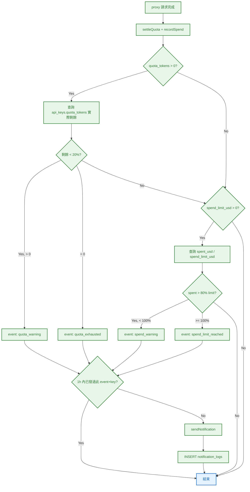

# S0 Brief Spec: Webhook 用量通知（擴展）

> **階段**: S0 需求討論
> **建立時間**: 2026-03-15 10:00
> **Agent**: requirement-analyst
> **Spec Mode**: Full Spec
> **工作類型**: `new_feature`
> **前置版本**: 已有 quota_warning (80/90/100%) 基礎，本次擴展為完整用量通知

---

## 0. 工作類型

**本次工作類型**：`new_feature`

## 1. 一句話描述

在 Apiex 平台現有的 Webhook 配額告警基礎上，擴展為完整用量通知系統：新增 quota_exhausted、spend_warning、spend_limit_reached 三種事件，統一 payload 格式，改用專屬 notification_logs 表做高效 dedup（1h 視窗），並提供 Admin Webhook 總覽介面。

## 2. 為什麼要做

### 2.1 痛點

- **花費超支無預警**：spend_limit 達到上限時請求被拒（回傳 429），但用戶在這之前沒有任何通知
- **配額耗盡與警告未區分**：現有 quota_warning 以 80/90/100% 閾值發送同一事件名稱，用戶無法區分「快用完」和「已用完」
- **dedup 機制低效**：現有 `_hasRecentLog` 掃描 webhook_logs 的 JSONB payload 做比對，N+1 查詢，效能差
- **缺少 Admin 可見度**：管理員無法在介面上查看用戶的 Webhook 設定狀態
- **Payload 不統一**：需求要求 event_type/key_id/key_prefix/current_value/threshold/timestamp 標準格式

### 2.2 目標

- 用戶在配額剩餘 < 20% 時收到 `quota_warning`
- 用戶在配額耗盡時收到 `quota_exhausted`
- 用戶在花費 > 80% spend_limit 時收到 `spend_warning`
- 用戶在花費達到 spend_limit 時收到 `spend_limit_reached`
- 每種事件每個 key 每小時最多通知一次（從 24h 改為 1h）
- Admin 可在管理介面查看所有用戶的 Webhook 設定
- Payload 格式統一為 { event_type, key_id, key_prefix, current_value, threshold, timestamp }

## 3. 使用者

| 角色 | 說明 |
|------|------|
| API 用戶 | 設定 Webhook URL，接收用量通知，在前端管理 Webhook 設定 |
| 管理員 | 查看所有用戶的 Webhook 設定與推播記錄 |

## 4. 核心流程

### 4.0 功能區拆解

#### 功能區識別表

| FA ID | 功能區名稱 | 一句話描述 | 入口 | 獨立性 |
|-------|-----------|-----------|------|--------|
| FA-A | 通知引擎擴展 | 擴展 WebhookService 支援 4 種事件 + 新 dedup 機制 | proxy.ts 結算後 | 中 |
| FA-B | 用戶 Webhook 設定頁 | 新增前端設定頁面（事件勾選擴展為 4 種） | /settings/webhooks 前端頁面 | 高 |
| FA-C | Admin Webhook 總覽 | 管理員查看所有用戶的 Webhook 設定 | /admin/webhooks API + 前端頁面 | 高 |

**本次策略**：`single_sop_fa_labeled`

#### 跨功能區依賴

| 來源 FA | 目標 FA | 依賴類型 | 說明 |
|---------|---------|---------|------|
| FA-A | FA-B | 資料共用 | 通知引擎讀取 FA-B 管理的 webhook_configs |
| FA-B | FA-C | 資料共用 | Admin 讀取 FA-B 寫入的 webhook_configs |

### 4.1 系統架構總覽

```mermaid
graph TB
    subgraph FE["前端"]
        WebhookSettings[Webhook 設定頁]:::fe
        AdminWebhooks[Admin Webhooks 總覽]:::fe
    end

    subgraph BE["後端"]
        Proxy[proxy.ts]:::be
        WebhookSvc[WebhookService]:::be
        WebhookAPI[/webhooks routes]:::be
        AdminAPI[/admin/webhooks routes]:::be
    end

    subgraph DB["資料儲存"]
        WebhookConfigs[(webhook_configs)]:::db
        NotifLogs[(notification_logs)]:::db
        WebhookLogs[(webhook_logs)]:::db
        ApiKeys[(api_keys)]:::db
    end

    subgraph EXT["外部"]
        UserEndpoint[用戶 Webhook Endpoint]:::tp
    end

    Proxy -->|fire-and-forget| WebhookSvc
    WebhookSvc -->|check threshold| ApiKeys
    WebhookSvc -->|check dedup| NotifLogs
    WebhookSvc -->|POST| UserEndpoint
    WebhookSvc -->|record delivery| WebhookLogs
    WebhookSvc -->|record dedup| NotifLogs
    WebhookSettings --> WebhookAPI
    WebhookAPI --> WebhookConfigs
    AdminWebhooks --> AdminAPI
    AdminAPI --> WebhookConfigs

    classDef fe fill:#e3f2fd,color:#1565c0,stroke:#1565c0,stroke-width:2px
    classDef be fill:#e8f5e9,color:#2e7d32,stroke:#2e7d32,stroke-width:2px
    classDef tp fill:#fff3e0,color:#e65100,stroke:#e65100,stroke-width:2px
    classDef db fill:#f3e5f5,color:#6a1b9a,stroke:#6a1b9a,stroke-width:2px
```

### 4.2 FA-A: 通知引擎擴展

#### 4.2.1 全局流程圖



### 4.3 FA-B: 用戶 Webhook 設定頁

已有 /webhooks API routes（GET/POST/DELETE/logs/test），需新增前端設定頁面，事件清單從 1 種擴展為 4 種。

### 4.4 FA-C: Admin Webhook 總覽

需新增 Admin API endpoint + 前端頁面。

### 4.5 六維度例外清單

| 維度 | ID | FA | 情境 | 觸發條件 | 預期行為 | 嚴重度 |
|------|-----|-----|------|---------|---------|--------|
| 網路/外部 | E1 | FA-A | Webhook endpoint 無回應/超時 | fetch timeout | 記錄失敗 log，不影響請求回應 | P2 |
| 並行/競爭 | E2 | FA-A | 高並發下同一 key 同時觸發同事件 | 多個 proxy 請求同時結算 | notification_logs dedup 容忍微小 race（可能多發 1 次，可接受） | P1 |
| 業務邏輯 | E3 | FA-A | 配額無限制 | quota_tokens = -1 | 跳過配額通知檢查 | P1 |
| 業務邏輯 | E4 | FA-A | 花費限制為無限制 | spend_limit_usd = -1 | 跳過花費通知檢查 | P1 |
| 資料邊界 | E5 | FA-B | 用戶設定無效 URL | URL 格式不合法（非 http/https） | 回傳 400 錯誤 | P1 |
| 資料邊界 | E6 | FA-B | 用戶未設定 Webhook | webhook_configs 不存在 | 前端顯示空白設定表單 | P2 |
| 業務邏輯 | E7 | FA-A | key_prefix 查詢失敗 | api_keys 記錄不存在 | payload 中 key_prefix 為空字串，不中斷流程 | P2 |

### 4.6 白話文摘要

這次改動讓 Apiex 平台在用戶的 API 配額或花費接近上限時，主動推送通知到用戶設定的 Webhook 網址。用戶可以在管理介面設定通知網址和選擇想收到的事件類型（配額警告、配額耗盡、花費警告、花費達限）。為防止通知轟炸，每種事件每個 API Key 每小時最多只會發送一次。管理員也可以在後台查看所有用戶的 Webhook 設定狀態。

## 5. 成功標準

| # | FA | 類別 | 標準 | 驗證方式 |
|---|-----|------|------|---------|
| SC-1 | FA-A | 功能 | 配額剩餘 < 20% 時發送 quota_warning | 單元測試 |
| SC-2 | FA-A | 功能 | 配額耗盡（= 0）時發送 quota_exhausted | 單元測試 |
| SC-3 | FA-A | 功能 | 花費 > 80% spend_limit 時發送 spend_warning | 單元測試 |
| SC-4 | FA-A | 功能 | 花費 >= spend_limit 時發送 spend_limit_reached | 單元測試 |
| SC-5 | FA-A | 功能 | 同一 key 同一事件 1h 內不重複發送 | 單元測試 |
| SC-6 | FA-A | 效能 | 通知是 fire-and-forget，不影響請求延遲 | Code Review |
| SC-7 | FA-A | 功能 | Payload 包含 event_type, key_id, key_prefix, current_value, threshold, timestamp | 單元測試 |
| SC-8 | FA-B | 功能 | 前端可設定 Webhook URL 和選擇 4 種事件 | 手動測試 |
| SC-9 | FA-C | 功能 | Admin 可查看所有用戶的 Webhook 設定 | API 測試 |
| SC-10 | FA-A | 功能 | 無限配額/無限花費限制時跳過對應通知 | 單元測試 |

## 6. 範圍

### 範圍內
- **FA-A**: 新增 notification_logs 表（高效 dedup，1h 視窗）
- **FA-A**: 擴展 WebhookService：新增 checkAndNotifySpend 方法
- **FA-A**: 重構 checkAndNotifyQuota：查詢 DB 實際剩餘、區分 quota_warning vs quota_exhausted
- **FA-A**: 統一 Payload 格式為 { event_type, key_id, key_prefix, current_value, threshold, timestamp }
- **FA-A**: proxy.ts 新增 spend 通知觸發點（recordSpend 之後）
- **FA-B**: 前端 Webhook 設定頁（URL + 4 種事件勾選 + 推播記錄 + 測試）
- **FA-C**: Admin Webhook 總覽 API（GET /admin/webhooks）
- **FA-C**: Admin Webhook 總覽前端頁面
- **全域**: Sidebar 導航新增 Webhooks 項目

### 範圍外
- Webhook 重試機制（火忘模式，失敗記 log 不重試）
- Email/SMS 通知管道
- 自訂閾值百分比（固定 20% / 80%）
- 多組 Webhook URL（維持每用戶一組）

## 7. 已知限制與約束

- Webhook 是 fire-and-forget，不保證送達
- dedup 依賴 notification_logs 表查詢，高並發可能微小 race condition（可接受）
- 前端技術棧為 Next.js (App Router) + Tailwind CSS
- webhook_configs / webhook_logs 表已在 WebhookService 中引用並運作（無 SQL migration 檔案但表已存在於 DB）
- 需新增 notification_logs migration

## 8. 前端 UI 畫面清單

### 8.1 FA-B: 用戶 Webhook 設定畫面

| # | 畫面 | 狀態 | 既有檔案 | 變更說明 |
|---|------|------|---------|---------|
| 1 | **Webhook 設定頁** | 新增 | -- | URL、Secret、4 種事件勾選、啟用/停用、推播記錄、測試按鈕 |

### 8.2 FA-C: Admin Webhook 總覽畫面

| # | 畫面 | 狀態 | 既有檔案 | 變更說明 |
|---|------|------|---------|---------|
| 1 | **Admin Webhooks 總覽** | 新增 | -- | 所有用戶的 Webhook 設定列表（URL、事件、啟用狀態） |

### 8.3 既有修改

| # | 畫面 | 狀態 | 既有檔案 | 變更說明 |
|---|------|------|---------|---------|
| 1 | **Sidebar** | 既有修改 | `packages/web-admin/src/components/AppLayout.tsx` | 新增 Settings: Webhooks 導航 |

### 8.4 畫面統計摘要

| 類別 | 數量 |
|------|------|
| 新增畫面 | **2**（設定頁 + Admin 總覽） |
| 既有修改畫面 | **1**（Sidebar） |
