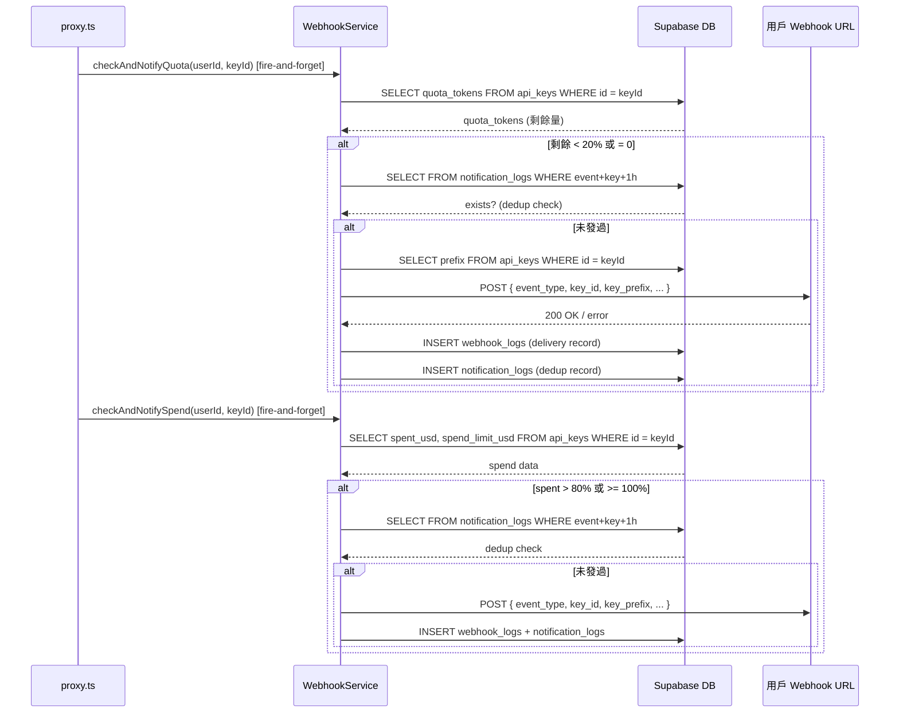

# S1 Dev Spec: Webhook 用量通知（擴展）

> **階段**: S1 技術分析
> **建立時間**: 2026-03-15 10:30
> **Agent**: codebase-explorer (Phase 1) + architect (Phase 2)
> **工作類型**: new_feature
> **複雜度**: M

---

## 1. 概述

### 1.1 需求參照
> 完整需求見 `s0_brief_spec.md`，以下僅摘要。

在現有 Webhook 配額告警基礎上擴展為完整用量通知系統：新增 quota_exhausted、spend_warning、spend_limit_reached 事件，統一 payload 格式，改用 notification_logs 表做 1h dedup，並提供 Admin 總覽介面。

### 1.2 技術方案摘要

擴展現有 `WebhookService`：新增 `checkAndNotifySpend` 方法處理花費事件；重構 `checkAndNotifyQuota` 查詢 DB 實際剩餘量並區分 warning/exhausted；新增 `notification_logs` 表取代現有的 webhook_logs payload 掃描做 dedup；在 proxy.ts 的 recordSpend 之後新增 spend 通知觸發；新增 Admin API endpoint 和前端頁面。

---

## 2. 影響範圍（Phase 1：codebase-explorer）

### 2.1 受影響檔案

#### Backend
| 檔案 | 變更類型 | 說明 |
|------|---------|------|
| `packages/api-server/src/services/WebhookService.ts` | 修改 | 新增 checkAndNotifySpend、重構 checkAndNotifyQuota、統一 payload、改用 notification_logs dedup |
| `packages/api-server/src/routes/proxy.ts` | 修改 | recordSpend 後新增 spend 通知觸發 |
| `packages/api-server/src/routes/admin.ts` | 修改 | 新增 GET /admin/webhooks endpoint |
| `packages/api-server/src/routes/webhooks.ts` | 修改 | test endpoint payload 擴展支援多種事件 |
| `packages/api-server/src/services/__tests__/WebhookService.test.ts` | 修改 | 新增 spend 事件、dedup、payload 格式測試 |

#### Frontend
| 檔案 | 變更類型 | 說明 |
|------|---------|------|
| `packages/web-admin/src/app/admin/(protected)/settings/webhooks/page.tsx` | 新增 | 用戶 Webhook 設定頁（URL + 4 種事件勾選） |
| `packages/web-admin/src/app/admin/(protected)/webhooks/page.tsx` | 新增 | Admin Webhook 總覽頁 |
| `packages/web-admin/src/components/AppLayout.tsx` | 修改 | Sidebar 新增 Webhooks 導航 |
| `packages/web-admin/src/lib/api.ts` | 修改 | 新增 webhook 相關 types 和 API factory |

#### Database
| 資料表 | 變更類型 | 說明 |
|--------|---------|------|
| `notification_logs` | 新增 | 通知 dedup 記錄（event_type, key_id, created_at） |

### 2.2 依賴關係
- **上游依賴**: `WebhookService`（已存在）、`KeyService`（quota/spend 查詢）、`proxy.ts`（觸發點）
- **下游影響**: 無（fire-and-forget，不影響任何既有請求流程）

### 2.3 現有模式與技術考量

**現有 WebhookService 模式**：
- `checkAndNotifyQuota` 接收 `(userId, keyId, quotaTokens, currentUsed)`，但 `currentUsed` 語義不明確（有時是本次用量，有時是總消耗）
- dedup 透過 `_hasRecentLog` 掃描 webhook_logs 的 JSONB payload，效率差
- 閾值定義 `[80, 90, 100]`，窗口 24h

**本次改動**：
- 將 `checkAndNotifyQuota` 改為查詢 DB 的 `api_keys.quota_tokens` 實際剩餘量
- 閾值改為：配額 < 20% 剩餘 = `quota_warning`，配額 = 0 = `quota_exhausted`
- 新增 `checkAndNotifySpend`：花費 > 80% = `spend_warning`，花費 >= 100% = `spend_limit_reached`
- dedup 改用 `notification_logs` 表直接查詢（`event_type + key_id + created_at > NOW() - 1h`）

**proxy.ts 觸發點**：
- 非串流：第 106-114 行 recordSpend 之後加入 spend notification
- 串流：第 161-169 行 recordSpend 之後加入 spend notification

---

## 3. User Flow（Phase 2：architect）

```mermaid
flowchart TD
    subgraph 通知引擎
        A[API 請求完成]:::be --> B[settleQuota]:::be
        B --> C[recordSpend]:::be
        C --> D[checkAndNotifyQuota]:::be
        D --> E[checkAndNotifySpend]:::be
    end

    subgraph Webhook 設定
        F[用戶進入設定頁]:::fe --> G[輸入 URL + 選擇事件]:::fe
        G --> H[POST /webhooks]:::be
        H --> I[upsert webhook_configs]:::db
    end

    subgraph Admin 總覽
        J[Admin 進入 Webhooks 頁]:::fe --> K[GET /admin/webhooks]:::be
        K --> L[查詢所有 webhook_configs]:::db
        L --> M[顯示列表]:::fe
    end

    classDef fe fill:#e3f2fd,color:#1565c0,stroke:#1565c0,stroke-width:2px
    classDef be fill:#e8f5e9,color:#2e7d32,stroke:#2e7d32,stroke-width:2px
    classDef db fill:#f3e5f5,color:#6a1b9a,stroke:#6a1b9a,stroke-width:2px
```



### 3.1 主要流程

| 步驟 | 用戶動作 | 系統回應 | 備註 |
|------|---------|---------|------|
| 1 | API 請求完成 | settleQuota + recordSpend | 既有流程不變 |
| 2 | -- | checkAndNotifyQuota（fire-and-forget） | 查詢 DB 實際剩餘，判斷 warning/exhausted |
| 3 | -- | checkAndNotifySpend（fire-and-forget） | 查詢 spent_usd/spend_limit_usd，判斷 warning/reached |
| 4 | -- | 若觸發：查 notification_logs dedup | 1h 內同 event+key 已發過則跳過 |
| 5 | -- | sendNotification → POST 到用戶 URL | 記錄 webhook_logs + notification_logs |

### 3.2 異常流程

| S0 ID | 情境 | 觸發條件 | 系統處理 | 用戶看到 |
|-------|------|---------|---------|---------|
| E1 | Webhook endpoint 無回應 | fetch 失敗/超時 | 記錄失敗 log，不影響請求 | 無（fire-and-forget） |
| E2 | 高並發重複通知 | 多個請求同時結算 | notification_logs dedup（微小 race 可接受） | 可能收到 2 次（可接受） |
| E3 | 無限配額 | quota_tokens = -1 | 跳過 checkAndNotifyQuota | 不收到配額通知 |
| E4 | 無限花費限制 | spend_limit_usd = -1 | 跳過 checkAndNotifySpend | 不收到花費通知 |

---

## 4. Data Flow



### 4.1 API 契約

> 完整 API 規格見 [`s1_api_spec.md`](./s1_api_spec.md)。

**Endpoint 摘要**

| Method | Path | 說明 |
|--------|------|------|
| `GET` | `/webhooks` | 取得用戶 webhook 設定（已存在） |
| `POST` | `/webhooks` | 建立/更新 webhook 設定（已存在，events 擴展） |
| `DELETE` | `/webhooks/:id` | 刪除 webhook 設定（已存在） |
| `GET` | `/webhooks/:id/logs` | 查看推播記錄（已存在） |
| `POST` | `/webhooks/test` | 發送測試推播（已存在，payload 更新） |
| `GET` | `/admin/webhooks` | Admin 查看所有 webhook 設定（新增） |

### 4.2 資料模型

#### notification_logs（新增）
```
notification_logs:
  id: UUID PK (gen_random_uuid)
  event_type: TEXT NOT NULL          -- quota_warning | quota_exhausted | spend_warning | spend_limit_reached
  key_id: UUID NOT NULL REFERENCES api_keys(id)
  user_id: UUID NOT NULL REFERENCES auth.users(id)
  created_at: TIMESTAMPTZ NOT NULL DEFAULT now()
```

#### 統一 Webhook Payload 格式
```json
{
  "event_type": "quota_warning",
  "key_id": "uuid-string",
  "key_prefix": "apx-sk-a",
  "current_value": 8500,
  "threshold": 10000,
  "timestamp": "2026-03-15T12:00:00Z"
}
```

**各事件的 current_value / threshold 語義**：

| event_type | current_value | threshold | 觸發條件 |
|------------|--------------|-----------|---------|
| quota_warning | 剩餘 token 數 | quota_tokens * 0.2（20% 門檻值） | 剩餘 < 20% 且 > 0 |
| quota_exhausted | 0 | 原始 quota_tokens | 剩餘 = 0 |
| spend_warning | 當前 spent_usd | spend_limit_usd * 0.8（80% 門檻值） | spent > 80% 且 < 100% |
| spend_limit_reached | 當前 spent_usd | spend_limit_usd | spent >= 100% |

---

## 5. 任務清單

### 5.1 任務總覽

| # | 任務 | 類型 | 複雜度 | Agent | 依賴 |
|---|------|------|--------|-------|------|
| T1 | notification_logs DB Migration | 資料層 | S | backend-developer | - |
| T2 | WebhookService 擴展 — 統一 payload + spend 事件 | 後端 | L | backend-developer | T1 |
| T3 | WebhookService 擴展 — notification_logs dedup | 後端 | M | backend-developer | T1 |
| T4 | proxy.ts spend 通知整合 | 後端 | S | backend-developer | T2 |
| T5 | Admin Webhook API（GET /admin/webhooks） | 後端 | S | backend-developer | - |
| T6 | 前端 API client 擴展（types + factory） | 前端 | S | frontend-developer | T5 |
| T7 | 前端 Webhook 設定頁 | 前端 | M | frontend-developer | T6 |
| T8 | 前端 Admin Webhooks 總覽頁 | 前端 | S | frontend-developer | T6 |
| T9 | Sidebar 導航更新 | 前端 | S | frontend-developer | - |
| T10 | 單元測試擴展 | 後端 | M | backend-developer | T2, T3 |

### 5.2 任務詳情

#### Task T1: notification_logs DB Migration
- **類型**: 資料層
- **複雜度**: S
- **Agent**: backend-developer
- **描述**: 新增 `notification_logs` 表，用於高效 dedup。欄位：id, event_type, key_id, user_id, created_at。建立複合索引 `(event_type, key_id, created_at DESC)` 加速 dedup 查詢。
- **DoD**:
  - [ ] `supabase/migrations/010_notification_logs.sql` 建立 notification_logs 表
  - [ ] 包含 idx_notification_logs_dedup 複合索引
  - [ ] RLS policy: service_role 可讀寫
- **驗收方式**: SQL migration 可成功執行

#### Task T2: WebhookService 擴展 — 統一 payload + spend 事件
- **類型**: 後端
- **複雜度**: L
- **Agent**: backend-developer
- **依賴**: T1
- **描述**:
  1. 新增 `checkAndNotifySpend(userId, keyId)` 方法：查詢 api_keys 的 spent_usd 和 spend_limit_usd，判斷 spend_warning (>80%) 和 spend_limit_reached (>=100%)
  2. 重構 `checkAndNotifyQuota`：改為查詢 DB 的 api_keys.quota_tokens 實際剩餘量，區分 quota_warning (剩餘 < 20%, > 0) 和 quota_exhausted (= 0)
  3. 統一 payload 格式為 `{ event_type, key_id, key_prefix, current_value, threshold, timestamp }`
  4. 移除舊的 `QUOTA_THRESHOLDS` 常數和舊的 `QuotaWarningPayload` type
- **DoD**:
  - [ ] `checkAndNotifySpend` 方法實作完成
  - [ ] `checkAndNotifyQuota` 重構完成（查 DB 剩餘、區分 warning/exhausted）
  - [ ] payload 格式統一（所有 4 種事件使用同一格式）
  - [ ] key_prefix 從 api_keys 表查詢填入 payload
  - [ ] spend_limit_usd = -1 時跳過 spend 通知
  - [ ] quota_tokens <= 0 時跳過 quota 通知
- **驗收方式**: 單元測試覆蓋所有 4 種事件的觸發和跳過場景

#### Task T3: WebhookService 擴展 — notification_logs dedup
- **類型**: 後端
- **複雜度**: M
- **Agent**: backend-developer
- **依賴**: T1
- **描述**:
  1. 新增 `_checkDedup(eventType, keyId)` 方法：查詢 notification_logs 表中過去 1 小時是否有同 event_type + key_id 的記錄
  2. 新增 `_recordNotification(eventType, keyId, userId)` 方法：INSERT notification_logs
  3. 將 T2 的 checkAndNotifyQuota/checkAndNotifySpend 中的 dedup 邏輯改用此方法
  4. 移除舊的 `_hasRecentLog` 方法（或標記 @deprecated）
  5. 將 `DEDUP_WINDOW_HOURS` 從 24 改為 1
- **DoD**:
  - [ ] `_checkDedup` 方法查詢 notification_logs 表
  - [ ] `_recordNotification` 方法寫入 notification_logs 表
  - [ ] dedup 視窗為 1 小時
  - [ ] 舊的 `_hasRecentLog` 移除或標記 deprecated
- **驗收方式**: dedup 單元測試通過

#### Task T4: proxy.ts spend 通知整合
- **類型**: 後端
- **複雜度**: S
- **Agent**: backend-developer
- **依賴**: T2
- **描述**: 在 proxy.ts 的 recordSpend 回調之後，fire-and-forget 調用 `webhookService.checkAndNotifySpend(userId, apiKeyId)`。需處理非串流（~行 106-114）和串流（~行 161-169）兩個觸發點。同時更新 `checkAndNotifyQuota` 的呼叫簽名（移除 quotaTokens 和 currentUsed 參數，改為內部查 DB）。
- **DoD**:
  - [ ] 非串流路徑 recordSpend 後新增 spend 通知
  - [ ] 串流路徑 recordSpend 後新增 spend 通知
  - [ ] checkAndNotifyQuota 呼叫簽名更新
  - [ ] 所有通知調用都是 fire-and-forget（`.catch(() => {})`）
- **驗收方式**: Code review 確認觸發點正確

#### Task T5: Admin Webhook API
- **類型**: 後端
- **複雜度**: S
- **Agent**: backend-developer
- **描述**: 在 admin.ts 新增 `GET /admin/webhooks` endpoint，查詢所有 webhook_configs（支援分頁），回傳用戶 ID、URL、events、is_active。
- **DoD**:
  - [ ] GET /admin/webhooks endpoint 實作
  - [ ] 支援 page/limit 分頁參數
  - [ ] 回傳格式與其他 admin endpoints 一致（`{ data, pagination }`）
  - [ ] 需 adminAuth middleware 保護
- **驗收方式**: curl 測試回傳正確分頁結果

#### Task T6: 前端 API client 擴展
- **類型**: 前端
- **複雜度**: S
- **Agent**: frontend-developer
- **依賴**: T5
- **描述**: 在 `packages/web-admin/src/lib/api.ts` 新增 Webhook 相關 types（WebhookConfig, WebhookLog, NotificationEvent）和 API factory functions（makeWebhooksApi, makeAdminWebhooksApi）。
- **DoD**:
  - [ ] WebhookConfig interface 定義
  - [ ] WebhookLog interface 定義
  - [ ] NOTIFICATION_EVENTS 常數（4 種事件名 + 顯示標籤）
  - [ ] makeWebhooksApi factory（get, upsert, delete, logs, test）
  - [ ] makeAdminWebhooksApi factory（list）
- **驗收方式**: TypeScript 編譯通過

#### Task T7: 前端 Webhook 設定頁
- **類型**: 前端
- **複雜度**: M
- **Agent**: frontend-developer
- **依賴**: T6
- **描述**: 新增 `packages/web-admin/src/app/admin/(protected)/settings/webhooks/page.tsx`。包含：URL 輸入框、Secret 輸入框（可選）、4 種事件勾選框、啟用/停用 toggle、儲存按鈕、測試按鈕（顯示結果）、推播記錄列表（最近 20 筆）。遵循現有頁面的 Tailwind CSS 樣式。
- **DoD**:
  - [ ] 頁面元件實作完成
  - [ ] URL 欄位驗證（http/https 格式）
  - [ ] 4 種事件各有勾選框，預設全選
  - [ ] 儲存呼叫 POST /webhooks
  - [ ] 測試按鈕呼叫 POST /webhooks/test 並顯示結果
  - [ ] 推播記錄列表顯示 event、status_code、created_at
  - [ ] loading/error 狀態處理
- **驗收方式**: 手動測試頁面功能完整

#### Task T8: 前端 Admin Webhooks 總覽頁
- **類型**: 前端
- **複雜度**: S
- **Agent**: frontend-developer
- **依賴**: T6
- **描述**: 新增 `packages/web-admin/src/app/admin/(protected)/webhooks/page.tsx`。表格顯示所有用戶的 Webhook 設定：user_id、URL、events（Tag 列表）、is_active（狀態 badge）、created_at。支援分頁。
- **DoD**:
  - [ ] 頁面元件實作完成
  - [ ] 表格列出所有 webhook 設定
  - [ ] 分頁控制
  - [ ] is_active 以綠/灰 badge 顯示
  - [ ] events 以 Tag 元件顯示
- **驗收方式**: 手動測試頁面載入正確

#### Task T9: Sidebar 導航更新
- **類型**: 前端
- **複雜度**: S
- **Agent**: frontend-developer
- **描述**: 在 `AppLayout.tsx` 的 navItems 陣列中新增兩項：`{ href: '/admin/settings/webhooks', label: 'Settings: Webhooks' }` 和 `{ href: '/admin/webhooks', label: 'Webhooks' }`。
- **DoD**:
  - [ ] navItems 新增 Settings: Webhooks
  - [ ] navItems 新增 Webhooks（Admin 總覽）
  - [ ] 導航 active 狀態正確
- **驗收方式**: 側欄導航顯示新項目，點擊路由正確

#### Task T10: 單元測試擴展
- **類型**: 後端
- **複雜度**: M
- **Agent**: backend-developer
- **依賴**: T2, T3
- **描述**: 擴展 `WebhookService.test.ts`，新增以下測試案例：
  1. checkAndNotifySpend — spend_warning 觸發（>80%）
  2. checkAndNotifySpend — spend_limit_reached 觸發（>=100%）
  3. checkAndNotifySpend — spend_limit=-1 跳過
  4. checkAndNotifySpend — spent=0 跳過
  5. checkAndNotifyQuota — quota_warning 觸發（剩餘 < 20%, > 0）
  6. checkAndNotifyQuota — quota_exhausted 觸發（剩餘 = 0）
  7. payload 格式包含所有必要欄位（event_type, key_id, key_prefix, current_value, threshold, timestamp）
  8. notification_logs dedup（1h 內不重複）
  9. notification_logs dedup（超過 1h 允許重發）
- **DoD**:
  - [ ] 9 個新測試案例全部通過
  - [ ] 覆蓋所有 4 種事件的觸發和跳過場景
  - [ ] 驗證 payload 格式統一
  - [ ] dedup 測試覆蓋 1h 邊界
- **驗收方式**: `pnpm --filter @apiex/api-server test` 全部通過

---

## 6. 技術決策

### 6.1 架構決策

| 決策點 | 選項 | 選擇 | 理由 |
|--------|------|------|------|
| dedup 儲存 | A: 繼續用 webhook_logs payload / B: 新建 notification_logs | B | webhook_logs JSONB 掃描效率差，專屬表可建複合索引，查詢 O(1) |
| dedup 視窗 | A: 維持 24h / B: 改為 1h | B | 需求明確要求 1h，且 1h 更合理（用戶可能在 1h 後想再次收到） |
| quota 檢查方式 | A: 傳入參數計算 / B: 查 DB 實際值 | B | 現有方式參數語義混亂，查 DB 才能拿到 settleQuota 後的真實剩餘 |
| spend 通知觸發點 | A: recordSpend 內部 / B: proxy.ts recordSpend 之後 | B | 保持 KeyService 單一職責，通知邏輯在 proxy 層協調 |

### 6.2 設計模式
- **Pattern**: Fire-and-forget Observer
- **理由**: 通知不應影響請求效能，所有通知調用都用 `.catch(() => {})` 包裹

### 6.3 相容性考量
- **向後相容**: 現有 quota_warning 事件保留，但 payload 格式變更（breaking change for webhook consumers）
- **Migration**: 無資料遷移需求，notification_logs 是全新表

---

## 7. 驗收標準

### 7.1 功能驗收

| # | 場景 | Given | When | Then | 優先級 |
|---|------|-------|------|------|--------|
| AC-1 | 配額警告 | key 配額剩餘 15%（< 20%），1h 內未通知 | 請求完成 settleQuota 後 | 發送 quota_warning webhook，payload 包含 event_type/key_id/key_prefix/current_value/threshold/timestamp | P0 |
| AC-2 | 配額耗盡 | key 配額剩餘 = 0 | 請求完成 settleQuota 後 | 發送 quota_exhausted webhook | P0 |
| AC-3 | 花費警告 | key spent_usd = 85（spend_limit = 100），1h 內未通知 | 請求完成 recordSpend 後 | 發送 spend_warning webhook | P0 |
| AC-4 | 花費達限 | key spent_usd >= spend_limit_usd | 請求完成 recordSpend 後 | 發送 spend_limit_reached webhook | P0 |
| AC-5 | dedup 1h | 同一 event + key 在 30 分鐘前已通知 | 再次觸發同條件 | 不發送通知 | P0 |
| AC-6 | dedup 過期 | 同一 event + key 在 2 小時前已通知 | 再次觸發同條件 | 正常發送通知 | P1 |
| AC-7 | 無限配額跳過 | key quota_tokens = -1 | 請求完成 | 不觸發 quota 通知 | P0 |
| AC-8 | 無限花費跳過 | key spend_limit_usd = -1 | 請求完成 | 不觸發 spend 通知 | P0 |
| AC-9 | Admin 總覽 | admin 登入 | GET /admin/webhooks | 回傳所有用戶 webhook 設定列表 | P1 |
| AC-10 | 前端設定 | 用戶進入 Webhook 設定頁 | 輸入 URL + 勾選事件 + 儲存 | webhook_configs 更新成功 | P1 |

### 7.2 非功能驗收

| 項目 | 標準 |
|------|------|
| 效能 | 通知 fire-and-forget，proxy 請求延遲增加 < 1ms |
| 安全 | Admin webhook endpoint 需 adminAuth middleware |

### 7.3 測試計畫
- **單元測試**: WebhookService 所有 4 種事件的觸發/跳過/dedup/payload 格式
- **整合測試**: 無（fire-and-forget 特性難以端對端驗證）
- **手動測試**: 前端設定頁 + Admin 總覽頁功能驗證

---

## 8. 風險與緩解

| 風險 | 影響 | 機率 | 緩解措施 | 負責人 |
|------|------|------|---------|--------|
| Payload 格式變更破壞現有 webhook 消費者 | 中 | 中 | 本平台尚在早期，webhook 消費者極少；在 webhook_logs 的 test payload 中加入 schema_version | backend-developer |
| notification_logs 表資料增長 | 低 | 高 | 1h dedup 意味著資料量可控；未來可加定期清理 job | backend-developer |
| 高並發 dedup race condition | 低 | 低 | 最壞情況多發 1 次，可接受 | -- |

### 回歸風險
- proxy.ts 觸發點修改：checkAndNotifyQuota 簽名變更可能影響現有配額通知
- WebhookService 重構：payload 格式變更影響現有 webhook 消費者
