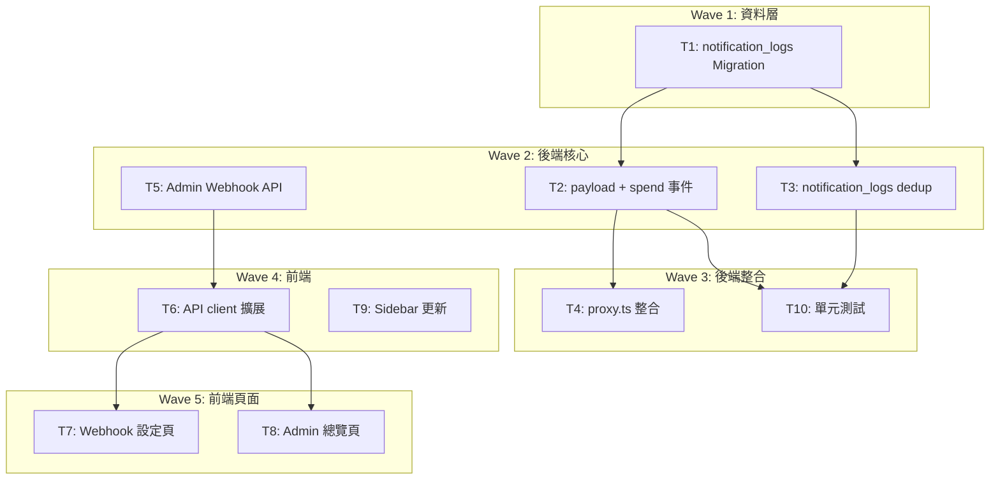

# S3 Implementation Plan: Webhook 用量通知（擴展）

> **階段**: S3 實作計畫
> **建立時間**: 2026-03-15 11:00
> **Agents**: backend-developer, frontend-developer

---

## 1. 概述

### 1.1 功能目標
擴展現有 Webhook 系統，支援 4 種用量通知事件（quota_warning, quota_exhausted, spend_warning, spend_limit_reached），統一 payload 格式，改用 notification_logs 表做 1h dedup，並提供 Admin 總覽介面。

### 1.2 實作範圍
- **範圍內**: notification_logs 表、WebhookService 擴展（spend 事件 + quota 重構 + dedup 改造）、proxy.ts 整合、Admin API、前端設定頁 + Admin 總覽頁、Sidebar 更新、單元測試
- **範圍外**: Webhook 重試機制、Email/SMS、自訂閾值

### 1.3 關聯文件

| 文件 | 路徑 | 狀態 |
|------|------|------|
| Brief Spec | `./s0_brief_spec.md` | completed |
| Dev Spec | `./s1_dev_spec.md` | completed |
| API Spec | `./s1_api_spec.md` | completed |
| Implementation Plan | `./s3_implementation_plan.md` | current |

---

## 2. 實作任務清單

### 2.1 任務總覽

| # | 任務 | 類型 | Agent | 依賴 | 複雜度 | TDD | 狀態 |
|---|------|------|-------|------|--------|-----|------|
| T1 | notification_logs DB Migration | 資料層 | `backend-developer` | - | S | N/A | pending |
| T2 | WebhookService — 統一 payload + spend 事件 | 後端 | `backend-developer` | T1 | L | planned | pending |
| T3 | WebhookService — notification_logs dedup | 後端 | `backend-developer` | T1 | M | planned | pending |
| T4 | proxy.ts spend 通知整合 | 後端 | `backend-developer` | T2 | S | N/A | pending |
| T5 | Admin Webhook API | 後端 | `backend-developer` | - | S | planned | pending |
| T6 | 前端 API client 擴展 | 前端 | `frontend-developer` | T5 | S | N/A | pending |
| T7 | 前端 Webhook 設定頁 | 前端 | `frontend-developer` | T6 | M | N/A | pending |
| T8 | 前端 Admin Webhooks 總覽頁 | 前端 | `frontend-developer` | T6 | S | N/A | pending |
| T9 | Sidebar 導航更新 | 前端 | `frontend-developer` | - | S | N/A | pending |
| T10 | 單元測試擴展 | 後端 | `backend-developer` | T2, T3 | M | core | pending |

---

## 3. 任務詳情

### Task T1: notification_logs DB Migration

**基本資訊**

| 項目 | 內容 |
|------|------|
| 類型 | 資料層 |
| Agent | `backend-developer` |
| 複雜度 | S |
| 依賴 | - |
| 狀態 | pending |

**描述**

新增 `notification_logs` 表，用於 webhook 通知 dedup。每次成功發送通知後寫入一筆記錄，dedup 查詢時檢查過去 1h 內是否有同 event_type + key_id 的記錄。

**受影響檔案**

| 檔案 | 變更類型 | 說明 |
|------|---------|------|
| `supabase/migrations/010_notification_logs.sql` | 新增 | 建表 + 索引 + RLS |

**DoD**

- [ ] notification_logs 表建立（id UUID PK, event_type TEXT, key_id UUID, user_id UUID, created_at TIMESTAMPTZ）
- [ ] 複合索引 `idx_notification_logs_dedup` ON (event_type, key_id, created_at DESC)
- [ ] RLS policy: service_role 可讀寫

**TDD Plan**: N/A -- 純 DDL，無可測邏輯

**驗證方式**
```bash
# 確認 migration 語法正確
cat supabase/migrations/010_notification_logs.sql
```

---

### Task T2: WebhookService — 統一 payload + spend 事件

**基本資訊**

| 項目 | 內容 |
|------|------|
| 類型 | 後端 |
| Agent | `backend-developer` |
| 複雜度 | L |
| 依賴 | T1 |
| 狀態 | pending |

**描述**

1. 定義統一 `NotificationPayload` type：`{ event_type, key_id, key_prefix, current_value, threshold, timestamp }`
2. 新增 `checkAndNotifySpend(userId, keyId)` 方法：
   - 查詢 `api_keys` 表的 `spent_usd` 和 `spend_limit_usd`
   - spend_limit_usd = -1 → 跳過
   - spent >= limit → `spend_limit_reached`
   - spent > limit * 0.8 → `spend_warning`
   - 查 prefix → 填入 payload
3. 重構 `checkAndNotifyQuota(userId, keyId)` 方法（移除 quotaTokens/currentUsed 參數）：
   - 查詢 `api_keys` 表的 `quota_tokens`
   - quota_tokens <= 0 → 跳過（-1 無限制，0 無意義）
   - 剩餘 = 0 → `quota_exhausted`
   - 剩餘 < quota_tokens * 0.2 → `quota_warning`
   - 查 prefix → 填入 payload
4. 移除舊的 `QUOTA_THRESHOLDS` 和 `QuotaWarningPayload`

**受影響檔案**

| 檔案 | 變更類型 | 說明 |
|------|---------|------|
| `packages/api-server/src/services/WebhookService.ts` | 修改 | 新增 checkAndNotifySpend、重構 checkAndNotifyQuota、統一 payload |

**DoD**

- [ ] `NotificationPayload` type 定義
- [ ] `checkAndNotifySpend(userId, keyId)` 實作
- [ ] `checkAndNotifyQuota(userId, keyId)` 重構（查 DB 剩餘、2 種事件）
- [ ] 4 種事件的 payload 格式統一
- [ ] key_prefix 從 api_keys 表查詢
- [ ] spend_limit_usd = -1 跳過
- [ ] quota_tokens <= 0 跳過

**TDD Plan**

| 項目 | 內容 |
|------|------|
| 測試檔案 | `packages/api-server/src/services/__tests__/WebhookService.test.ts` |
| 測試指令 | `pnpm --filter @apiex/api-server test` |
| 預期失敗測試 | checkAndNotifySpend 系列、payload 格式驗證 |

---

### Task T3: WebhookService — notification_logs dedup

**基本資訊**

| 項目 | 內容 |
|------|------|
| 類型 | 後端 |
| Agent | `backend-developer` |
| 複雜度 | M |
| 依賴 | T1 |
| 狀態 | pending |

**描述**

1. 新增 `_checkDedup(eventType, keyId): Promise<boolean>` — 查詢 notification_logs 表過去 1h
2. 新增 `_recordNotification(eventType, keyId, userId): Promise<void>` — INSERT notification_logs
3. 在 checkAndNotifyQuota/checkAndNotifySpend 中使用 `_checkDedup` 取代 `_hasRecentLog`
4. 移除 `_hasRecentLog` 方法
5. 更新 `DEDUP_WINDOW_HOURS` 為 1

**受影響檔案**

| 檔案 | 變更類型 | 說明 |
|------|---------|------|
| `packages/api-server/src/services/WebhookService.ts` | 修改 | dedup 機制改造 |

**DoD**

- [ ] `_checkDedup` 查詢 notification_logs
- [ ] `_recordNotification` 寫入 notification_logs
- [ ] dedup 視窗 = 1h
- [ ] `_hasRecentLog` 移除
- [ ] sendNotification 成功後調用 `_recordNotification`

**TDD Plan**

| 項目 | 內容 |
|------|------|
| 測試檔案 | `packages/api-server/src/services/__tests__/WebhookService.test.ts` |
| 測試指令 | `pnpm --filter @apiex/api-server test` |
| 預期失敗測試 | dedup 1h 內不重複、超過 1h 允許重發 |

---

### Task T4: proxy.ts spend 通知整合

**基本資訊**

| 項目 | 內容 |
|------|------|
| 類型 | 後端 |
| Agent | `backend-developer` |
| 複雜度 | S |
| 依賴 | T2 |
| 狀態 | pending |

**描述**

在 proxy.ts 的 recordSpend 回調 `.then()` 鏈中新增 spend 通知觸發。需處理兩個位置：
1. **非串流**（~行 106-114）：在 recordSpend `.then()` 內加入 `webhookService.checkAndNotifySpend(userId, apiKeyId).catch(() => {})`
2. **串流**（~行 161-169）：同上

同時更新 `checkAndNotifyQuota` 呼叫：移除 `quotaTokens` 和 `usage.total_tokens` 參數，改為 `checkAndNotifyQuota(userId, apiKeyId)`。

**受影響檔案**

| 檔案 | 變更類型 | 說明 |
|------|---------|------|
| `packages/api-server/src/routes/proxy.ts` | 修改 | 新增 spend 通知 + 更新 quota 通知呼叫 |

**DoD**

- [ ] 非串流路徑 recordSpend 後新增 `checkAndNotifySpend`
- [ ] 串流路徑 recordSpend 後新增 `checkAndNotifySpend`
- [ ] `checkAndNotifyQuota` 呼叫簽名更新（移除 quotaTokens, total_tokens）
- [ ] 所有通知調用 fire-and-forget（`.catch(() => {})`）

**TDD Plan**: N/A -- 整合點，由 T10 覆蓋

---

### Task T5: Admin Webhook API

**基本資訊**

| 項目 | 內容 |
|------|------|
| 類型 | 後端 |
| Agent | `backend-developer` |
| 複雜度 | S |
| 依賴 | - |
| 狀態 | pending |

**描述**

在 admin.ts 新增 `GET /admin/webhooks` endpoint：
- 查詢 webhook_configs 表全部記錄
- 支援 page/limit 分頁
- 排除 secret 欄位
- 回傳格式 `{ data: [...], pagination: { page, limit, total } }`

**受影響檔案**

| 檔案 | 變更類型 | 說明 |
|------|---------|------|
| `packages/api-server/src/routes/admin.ts` | 修改 | 新增 GET /admin/webhooks |

**DoD**

- [ ] GET /admin/webhooks endpoint
- [ ] 支援 page/limit 分頁
- [ ] 排除 secret 欄位
- [ ] 回傳格式與其他 admin endpoints 一致

**TDD Plan**

| 項目 | 內容 |
|------|------|
| 測試檔案 | `packages/api-server/src/routes/__tests__/admin.test.ts` |
| 測試指令 | `pnpm --filter @apiex/api-server test` |
| 預期失敗測試 | admin webhooks list |

---

### Task T6: 前端 API client 擴展

**基本資訊**

| 項目 | 內容 |
|------|------|
| 類型 | 前端 |
| Agent | `frontend-developer` |
| 複雜度 | S |
| 依賴 | T5 |
| 狀態 | pending |

**描述**

在 `api.ts` 新增：
1. `WebhookConfig` interface
2. `WebhookLog` interface
3. `NOTIFICATION_EVENTS` 常數陣列（4 種事件 + 中文顯示標籤）
4. `makeWebhooksApi(token)` factory -- get, upsert, remove, logs, test
5. `makeAdminWebhooksApi(token)` factory -- list

**受影響檔案**

| 檔案 | 變更類型 | 說明 |
|------|---------|------|
| `packages/web-admin/src/lib/api.ts` | 修改 | 新增 webhook types + factories |

**DoD**

- [ ] WebhookConfig / WebhookLog interface
- [ ] NOTIFICATION_EVENTS 常數
- [ ] makeWebhooksApi factory
- [ ] makeAdminWebhooksApi factory
- [ ] TypeScript 編譯通過

**TDD Plan**: N/A -- 純型別定義 + API wrapper

---

### Task T7: 前端 Webhook 設定頁

**基本資訊**

| 項目 | 內容 |
|------|------|
| 類型 | 前端 |
| Agent | `frontend-developer` |
| 複雜度 | M |
| 依賴 | T6 |
| 狀態 | pending |

**描述**

新增 `packages/web-admin/src/app/admin/(protected)/settings/webhooks/page.tsx`。UI 包含：
- URL 輸入框（placeholder: `https://your-server.com/webhook`）
- Secret 輸入框（可選，password type）
- 4 種事件各一個 checkbox（使用 NOTIFICATION_EVENTS 常數）
- 啟用/停用 toggle
- 「儲存」按鈕（POST /webhooks）
- 「測試推播」按鈕（POST /webhooks/test → 顯示 status_code）
- 「推播記錄」區塊（GET /webhooks/:id/logs → 表格顯示最近 20 筆）

遵循現有頁面的 Tailwind CSS 樣式（參考 rates/page.tsx 或 models/page.tsx 的表單風格）。

**受影響檔案**

| 檔案 | 變更類型 | 說明 |
|------|---------|------|
| `packages/web-admin/src/app/admin/(protected)/settings/webhooks/page.tsx` | 新增 | Webhook 設定頁 |

**DoD**

- [ ] 頁面元件完成
- [ ] URL + Secret + 事件勾選 + toggle
- [ ] 儲存功能（POST /webhooks）
- [ ] 測試推播功能 + 結果顯示
- [ ] 推播記錄列表
- [ ] loading / error 狀態處理
- [ ] 首次載入無設定時顯示空表單

**TDD Plan**: N/A -- UI 頁面，手動驗證

---

### Task T8: 前端 Admin Webhooks 總覽頁

**基本資訊**

| 項目 | 內容 |
|------|------|
| 類型 | 前端 |
| Agent | `frontend-developer` |
| 複雜度 | S |
| 依賴 | T6 |
| 狀態 | pending |

**描述**

新增 `packages/web-admin/src/app/admin/(protected)/webhooks/page.tsx`。表格顯示所有用戶 webhook 設定：
- 欄位：user_id（truncate）、URL、events（Tag badges）、is_active（badge）、created_at
- 支援分頁（page/limit）

**受影響檔案**

| 檔案 | 變更類型 | 說明 |
|------|---------|------|
| `packages/web-admin/src/app/admin/(protected)/webhooks/page.tsx` | 新增 | Admin Webhooks 總覽頁 |

**DoD**

- [ ] 表格列出所有 webhook 設定
- [ ] 分頁控制
- [ ] is_active badge（綠/灰）
- [ ] events Tag 顯示
- [ ] loading / error 狀態

**TDD Plan**: N/A -- UI 頁面

---

### Task T9: Sidebar 導航更新

**基本資訊**

| 項目 | 內容 |
|------|------|
| 類型 | 前端 |
| Agent | `frontend-developer` |
| 複雜度 | S |
| 依賴 | - |
| 狀態 | pending |

**描述**

在 `AppLayout.tsx` 的 `navItems` 陣列中新增：
- `{ href: '/admin/settings/webhooks', label: 'Settings: Webhooks' }` -- 放在 Settings: Routes 之後
- `{ href: '/admin/webhooks', label: 'Webhooks' }` -- 放在 Topup Logs 之後

**受影響檔案**

| 檔案 | 變更類型 | 說明 |
|------|---------|------|
| `packages/web-admin/src/components/AppLayout.tsx` | 修改 | navItems 新增 2 項 |

**DoD**

- [ ] navItems 新增 2 個導航項目
- [ ] 位置正確（Settings: Webhooks 在 Routes 後，Webhooks 在 Topup Logs 後）
- [ ] active 狀態正確

**TDD Plan**: N/A -- 純 UI 配置

---

### Task T10: 單元測試擴展

**基本資訊**

| 項目 | 內容 |
|------|------|
| 類型 | 後端 |
| Agent | `backend-developer` |
| 複雜度 | M |
| 依賴 | T2, T3 |
| 狀態 | pending |

**描述**

在 `WebhookService.test.ts` 新增測試案例：

1. `checkAndNotifySpend` — spend_warning 觸發（spent > 80% limit）
2. `checkAndNotifySpend` — spend_limit_reached 觸發（spent >= 100% limit）
3. `checkAndNotifySpend` — spend_limit=-1 跳過
4. `checkAndNotifySpend` — spent=0 跳過
5. `checkAndNotifyQuota`（重構後） — quota_warning（剩餘 < 20%, > 0）
6. `checkAndNotifyQuota`（重構後） — quota_exhausted（剩餘 = 0）
7. 統一 payload 包含 event_type, key_id, key_prefix, current_value, threshold, timestamp
8. notification_logs dedup — 1h 內不重複
9. notification_logs dedup — 超過 1h 允許重發

**受影響檔案**

| 檔案 | 變更類型 | 說明 |
|------|---------|------|
| `packages/api-server/src/services/__tests__/WebhookService.test.ts` | 修改 | 新增 9 個測試案例 |

**DoD**

- [ ] 9 個新測試案例全部通過
- [ ] 覆蓋 4 種事件的觸發 + 跳過場景
- [ ] payload 格式驗證
- [ ] dedup 邊界測試

**TDD Plan**

| 項目 | 內容 |
|------|------|
| 測試檔案 | `packages/api-server/src/services/__tests__/WebhookService.test.ts` |
| 測試指令 | `pnpm --filter @apiex/api-server test` |

---

## 4. 依賴關係圖



---

## 5. 執行順序與 Agent 分配

### 5.1 執行波次

| 波次 | 任務 | Agent | 可並行 | 備註 |
|------|------|-------|--------|------|
| Wave 1 | T1 | `backend-developer` | 否 | 基礎表 |
| Wave 2 | T2, T3, T5 | `backend-developer` | 是（T2//T3//T5） | T2 和 T3 都依賴 T1；T5 無依賴 |
| Wave 3 | T4, T10 | `backend-developer` | 是 | T4 依賴 T2；T10 依賴 T2+T3 |
| Wave 4 | T6, T9 | `frontend-developer` | 是 | T6 依賴 T5；T9 無依賴 |
| Wave 5 | T7, T8 | `frontend-developer` | 是 | 都依賴 T6 |

---

## 6. 驗證計畫

### 6.1 逐任務驗證

| 任務 | 驗證指令 | 預期結果 |
|------|---------|---------|
| T1 | `cat supabase/migrations/010_notification_logs.sql` | 表定義正確 |
| T2-T3 | `pnpm --filter @apiex/api-server test -- --grep WebhookService` | 所有測試通過 |
| T4 | Code review: proxy.ts 觸發點 | checkAndNotifySpend 存在於兩個路徑 |
| T5 | `curl -H "Authorization: Bearer $ADMIN_TOKEN" http://localhost:3000/admin/webhooks` | 200 + data 列表 |
| T6 | `cd packages/web-admin && npx tsc --noEmit` | 編譯通過 |
| T7-T8 | 手動瀏覽器測試 | 頁面顯示正確 |
| T9 | 瀏覽器確認 sidebar | 新導航項目存在 |
| T10 | `pnpm --filter @apiex/api-server test` | 全部通過 |

### 6.2 整體驗證

```bash
# 後端測試
pnpm --filter @apiex/api-server test

# 前端編譯
cd packages/web-admin && npx tsc --noEmit

# 前端 build
cd packages/web-admin && pnpm build
```

---

## 7. 實作進度追蹤

### 7.1 進度總覽

| 指標 | 數值 |
|------|------|
| 總任務數 | 10 |
| 已完成 | 0 |
| 進行中 | 0 |
| 待處理 | 10 |
| 完成率 | 0% |

---

## 9. 風險與問題追蹤

### 9.1 已識別風險

| # | 風險 | 影響 | 緩解措施 | 狀態 |
|---|------|------|---------|------|
| 1 | checkAndNotifyQuota 簽名變更影響 proxy.ts 呼叫 | 中 | T4 同步更新呼叫點 | 監控中 |
| 2 | payload 格式變更影響現有 webhook 消費者 | 低 | 平台早期使用者極少 | 已接受 |
| 3 | notification_logs 無清理機制 | 低 | 1h dedup 資料量小，未來可加 cron | 已接受 |

---

## 附錄

### A. 相關文件
- S0 Brief Spec: `./s0_brief_spec.md`
- S1 Dev Spec: `./s1_dev_spec.md`
- S1 API Spec: `./s1_api_spec.md`

### B. 專案規範提醒

#### Node.js 後端
- 使用 Hono 框架
- Supabase client 透過 `supabaseAdmin` singleton
- 錯誤回傳使用 `Errors.*` helper
- fire-and-forget 統一使用 `.catch(() => {})` 或 `.catch((err) => console.error(...))`

#### Next.js 前端
- App Router 模式（`src/app/admin/(protected)/...`）
- 使用 `'use client'` directive
- Tailwind CSS 樣式
- API 透過 `api.ts` 的 factory functions
- Supabase Auth token 透過 `supabase.auth.getSession()`
